> [!NOTE] 目录
> - [C++](#C++)
> - [数据结构](#数据结构)
> - [算法](#算法)
> - [操作系统](#操作系统)
> - [计算机网络](#计算机网络) 
> - [数据库](#数据库) 
> - [设计模式](#设计模式) 
> - [DDD领域设计](#DDD领域设计) 
> - [Java](#JAVA)
> - [Spring](#Spring)
> - [工具](#工具)
> - [沟通](#沟通)

## C++

### HelloWorld
传说一切语言的第一个程序都是“HelloWorld！”

如下为C++的：

```cpp
#include <iostream>

int main(int argc, char* argv[])
{
 std::cout << "Hello World!" << std::endl;
    return 0;
}
```

简单做一个认识吧：
#### main函数

函数的格式:

```cpp
返回值类型 函数名(参数类型 参数， ... )
{
  函数体
}
```

c++程序都是由main函数开始的;

main函数的返回值类型一般为int类型，返回0表示执行成功。

例：

```cpp
int main(int argc, char* argv[])
{
 *****
  return 0;
}
```

#### 基本输入输出

有输入和输出的程序才有意义。

C++的基本输入输出流为：cin 和 cout

需要：

1、引入头文件

```cpp
#include <iostream>
```

2、使用命名空间：std

```cpp
using namespace std;

或

std::cout
std::cin
```


**代码：**

```cpp
#include <iostream>
#include <string>
using namespace std;
int main(int argc, char* argv[])
{
 cout << "Hello World!" << endl;

 cout << "请输入你的名字：";
 string name;
 cin >> name;
 cout << "你好！" << name << endl;

 return 0;
}
```


**运行：**


#### 变量&注释


##### 注释

C++ 支持单行注释和多行注释。注释中的所有字符会被 C++ 编译器忽略。

C++ 注释一般有两种：

// - 一般用于单行注释。

/*...*/ - 一般用于多行注释。

##### 变量

C++中，变量是程序运行中需要申请的存储空间的助记符；编译完成的程序中是不存在变量的。

声明一个变量，即从申请了一个存储空间；初始化一个变量，即给存储空间一个值。


### 基础概念

#### 函数 & 参数 & 返回值

回到熟悉的Hello World,来学习一下函数、的概念。


函数的一般形式为：

```cpp
返回值类型 函数名(参数列表)
{
  函数体
}
```


例：封装两个int相加的函数，并使用

```cpp
int add(int a, int b)
{
 return a + b;
}

int main(int argc, char* argv[])
{
 int a = add(1, 2);
 cout << a << endl;
 return 0;
}
```


结果：

> 3

#### 变量 & 作用域

在 【HelloWorld】中 第一次说到【变量 】，这里再一次提，主要想讲解 作用域是什么。

##### 作用域：全局变量，局部变量，形参

作用域：简易理解，一个`{}`决定了一个作用域。如果不在任何`{}`,就是全局。

作用域和变量的关系，具体有以下几点：

1. 变量的作用域为：从变量定义开始，到对应的`}` 为止；
2. 变量只在其作用域内有效；
3. 同一个作用域，不能定义两个相同的变量；
4. 当使用一个变量a时，发现当前位置有两个不同的作用域都有a的声明定义；a取声明最近的一个。

具体可以结合以下代码理解：

```cpp
#include <iostream>
using namespace std;

int b = 2; // b 为 全局变量

int add(int a, int b) // a、b 为 形式参数（简称：形参）
{
 cout << "函数 ： " << endl;
 cout << "a ： " << a << endl;
 cout << "b ： " << b << endl;
 return a + b;
}

int main(int argc, char* argv[])  // argc、argv 为 形式参数（简称：形参）
{
 int a = 1; // a 为 局部变量；

 {
  int a = add(b, 1); // a 为 局部变量； b 为 全局变量
  cout << "a ： " << a << endl;
 }

 cout << "a ： " << a << endl;
 return 0;
}
```


结果：

> 函数 ：
>
> a ： 2
>
> b ： 1
>
> a ： 3
>
> a ： 1

名词解释：

**全局变量：** 函数外部的变量，不在任何`{}`内的变量。

**局部变量：** 存在某个`{}`内部的变量。

**形参：** 函数的参数


### 基础类型

#### 基础类型

C++的基础数据类型有：

bool ： 处理 布尔类型 值 true 或 false；

char ： 处理 字符类型数据；

int ：处理 整型 数据

float ：处理 浮点数

double ： 处理 双精度浮点数

wchar_t（宽字符型）：如果常量以 L（仅当大写时）开头，则表示它是一个宽字符常量（例如 L’x’），此时它必须存储在 wchar_t 类型的变量中。否则，它就是一个窄字符常量（例如 ‘x’），此时它可以存储在 char 类型的简单变量中。

void ： 空类型


##### 修饰符

除此外，还有类型修饰符：signed、unsigned、long 和 short

可以被类型修饰符修饰的类型有：int char 和 double

其中：

int 可以被 signed、unsigned、long 和 short 修饰 char 可以被 signed、unsigned 修饰 double 可以被 long 修饰

如果只写：signed、unsigned、long 和 short 等价于： signed int、unsigned int、long int 和 short int


##### 范围

不同的编译器，数据类型的大小不同

```cpp
#include <iostream>
#include <limits>
using namespace std;
int main(int argc, char* argv[])
{
    cout << "bool:\t\t\t" << sizeof(bool) << "\t字节\t" << "范围:" << numeric_limits<bool>::min() << "~" << numeric_limits<bool>::max() << endl;
    cout << "char:\t\t\t" << sizeof(char) << "\t字节\t" << "范围:" << (int)numeric_limits<char>::min() << "~" << (int)numeric_limits<char>::max() << endl;
    cout << "signed char:\t\t" << sizeof(signed char) << "\t字节\t" << "范围:" << (int)numeric_limits<signed char>::min() << "~" << (int)numeric_limits<signed char>::max() << endl;
    cout << "unsigned char:\t\t" << sizeof(unsigned char) << "\t字节\t" << "范围:" << (int)numeric_limits<unsigned char>::min() << "~" << (int)numeric_limits<unsigned char>::max() << endl;
    cout << "int:\t\t\t" << sizeof(int) << "\t字节\t" << "范围:" << numeric_limits<int>::min() << "~" << numeric_limits<int>::max() << endl;
    cout << "signed int:\t\t" << sizeof(signed int) << "\t字节\t" << "范围:" << numeric_limits<signed int>::min() << "~" << numeric_limits<signed int>::max() << endl;
    cout << "signed:\t\t\t" << sizeof(signed) << "\t字节\t" << "范围:" << numeric_limits<signed>::min() << "~" << numeric_limits<signed>::max() << endl;
    cout << "unsigned int:\t\t" << sizeof(unsigned int) << "\t字节\t" << "范围:" << numeric_limits<unsigned int>::min() << "~" << numeric_limits<unsigned int>::max() << endl;
    cout << "unsigned:\t\t" << sizeof(unsigned) << "\t字节\t" << "范围:" << numeric_limits<unsigned>::min() << "~" << numeric_limits<unsigned>::max() << endl;
    cout << "short int:\t\t" << sizeof(short int) << "\t字节\t" << "范围:" << numeric_limits<short int>::min() << "~" << numeric_limits<short int>::max() << endl;
    cout << "short:\t\t\t" << sizeof(short) << "\t字节\t" << "范围:" << numeric_limits<short>::min() << "~" << numeric_limits<short>::max() << endl;
    cout << "signed short int:\t" << sizeof(signed short int) << "\t字节\t" << "范围:" << numeric_limits<signed short int>::min() << "~" << numeric_limits<signed short int>::max() << endl;
    cout << "unsigned short int:\t" << sizeof(unsigned short int) << "\t字节\t" << "范围:" << numeric_limits<unsigned short int>::min() << "~" << numeric_limits<unsigned short int>::max() << endl;
    cout << "long int:\t\t" << sizeof(long int) << "\t字节\t" << "范围:" << numeric_limits<long int>::min() << "~" << numeric_limits<long int>::max() << endl;
    cout << "long:\t\t\t" << sizeof(long) << "\t字节\t" << "范围:" << numeric_limits<long>::min() << "~" << numeric_limits<long>::max() << endl;
    cout << "signed long int:\t" << sizeof(signed long int) << "\t字节\t" << "范围:" << numeric_limits<signed long int>::min() << "~" << numeric_limits<unsigned long int>::max() << endl;
    cout << "unsigned long int:\t" << sizeof(unsigned long int) << "\t字节\t" << "范围:" << numeric_limits<unsigned long int>::min() << "~" << numeric_limits<unsigned long int>::max() << endl;
    cout << "float:\t\t\t" << sizeof(float) << "\t字节\t" << "范围:" << numeric_limits<float>::min() << "~" << numeric_limits<float>::max() << endl;
    cout << "double:\t\t\t" << sizeof(double) << "\t字节\t" << "范围:" << numeric_limits<double>::min() << "~" << numeric_limits<double>::max() << endl;
    cout << "long double:\t\t" << sizeof(long double) << "\t字节\t" << "范围:" << numeric_limits<long double>::min() << "~" << numeric_limits<long double>::max() << endl;
    cout << "wchar_t:\t\t" << sizeof(wchar_t) << "\t字节\t" << "范围:" << numeric_limits<wchar_t>::min() << "~" << numeric_limits<wchar_t>::max() << endl;
 return 0;
}
```


**使用：**  Microsoft Visual C++ x86 


**使用：** Microsoft Visual C++ x64 


**使用:** Ubuntu GCC 


#### 基础运算符

| 优先权 | 运算符 | 说明 | 结合性 |
| :--: | :--: | :--- | :--: |
| 1 | () | 括号 | 由左至右 |
| 2 | !、-、++、-- | 逻辑运算符NOT、算术运算符负号、递增、递减 | 由右至左 |
| 3 | *、/、% | 算术运算符的乘法、除法、余数 | 由左至右 |
| 4 | +、- | 算术运算符加法、减法 | 由左至右 |
| 5 | <<、>>、>>> | 位操作子左移、右移、无符号右移 | 由左至右 |
| 6 | >、>=、<、<= | 关系运算符大于、大于等于、小于、小于等于 | 由左至右 |
| 7 | ==、!= | 关系运算符等于、不等于 | 由左至右 |
| 8 | & | 位操作子AND | 由左至右 |
| 9 | ^ | 位操作子XOR | 由左至右 |
| 10 | \| | 位操作子OR | 由左至右 |
| 11 | && | 逻辑运算符AND | 由左至右 |
| 12 | \|\| | 逻辑运算符OR | 由左至右 |
| 13 | ?: | 条件控制运算符 | 由右至左 |
| 14 | =、op= | 指定运算符 | 由右至左 |

**op=** 这里指： += 、 -= 、 *= 、 \= 、 %= 、 &= 、 ^= 、 |=

#### 引用

在前面一篇我们知道，变量是内存地址的一个名字；引用是给一个已经有名称的内存地址，再起一个名字。

看下面代码，做一下深入理解：

```cpp
/*
* 引用
* 类型 & 引用变量名 = 引用实体；
*/
void test1()
{
 int a = 1;  // 声明并初始化 int 类型变量 a
 int& b = a;  // 定义引用类型 b，指向 变量a
 cout << b << endl;
 int& c = b;  // 定义引用类型 b，指向 变量b
 cout << c << endl;

 cout << &a << endl; // 输出a的内存地址
 cout << &b << endl; // 输出b的内存地址
 cout << &c << endl; // 输出c的内存地址
}
```


**结果：**

> 1
>
> 1
>
> 0x7fffffffe464
>
> 0x7fffffffe464
>
> 0x7fffffffe464

引用 不是新定义一个变量，而 是给已存在变量取了一个别名 ，编译器不会为引用变量开辟内存空间，它和它引用的变量共用同一块内存空间。


#### 指针&指针初始化

指针（pointer）是 C++中的一个核心概念；是c++中常见的用来存在内存的一种工具。

理解指针有两个点：

1. 指针本身是一个大小等于int类型的变量。
2. 指针内存储着它指向的值的地址。

```cpp
void test1()
{
 int a = 1; // 声明并初始化 int 类型变量 a
 int* ptr;  // 声明int类型指针 ptr
 ptr = &a;  // 让指针ptr指向 变量a 的地址
 cout << ptr  << endl; // 输出 指针指向的地址
 cout << *ptr << endl; // 输出 指针指向的地址的值
 cout << &ptr << endl; // 输出 指针的地址
}
```


**结果：**

> 0x7fffffffe46c
>
> 1
>
> 0x7fffffffe470

以上demo，指针是指向**栈对象**，其实在正式的编程工作中，指针大多是指向**堆对象**的。

*栈对象 和 堆对象的区别，我们会在后续讲解。*

**堆对象** 的 创建 和 释放 是需要特殊的关键字；

C++中 一共有两对关键字：

**malloc**，**free** （C++，兼容C；所以可以用C的关键字）

**new**，**delete** （C++新增，常用这一对）

**这里注意：** free 和 delete 是 释放指针指向地址的内存，这时指针依然指向对应地址，不为空。

这时需要给指针赋空值，否则后续无法判断指针指向的位置是否有效，就会形成野指针。

同理，在声明一个指针是，通常就应该初始化；如果暂不确定值，可以赋空，防止野指针。

##### malloc & free

malloc 和 free 的一般形式：

```cpp
void *malloc(size_t size) 
void free(void *ptr)
```

malloc 分配指定大小为 size字节的内存空间，返回一个指向该空间的void*指针。 由于返回 void* 指针，所以需要强制类型转换后才能引用其中的值。

free 释放一个由 malloc 所分配的内存空间。ptr 指向一个要释放内存的内存块， 该指针应当是之前调用 malloc 的返回值。

```cpp
void test3()
{
 int* ptr = nullptr; // 通常指针变量声明时，就应该初始化；如果暂不确定值，可以赋空，防止野指针。
 ptr = (int*)malloc(sizeof(int)); // 申请一个int大小的堆内存，并进行强制类型转换
 *ptr = 1; // 对ptr指向的位置赋值
 cout << *ptr << endl; // 输出
 free(ptr);
  ptr = nullptr;
}
```


**结果：**

> 1
>
> 0x55555556aeb0
>
> 0x55555556aeb0


##### new & delete

new & delete 的一般形式：

```cpp
类型* 指针名 = new 类型();
delete 指针名
```


new 按照类型的大小，分配内存。 delete 释放指针指向地址的内存，这是指针依然指向对应地址，不为空。 通常会在 delete 后，增加一个 给指针变量赋空的操作；防止野指针。

```cpp
void test4()
{
 int* ptr = new int(4); // 声明并初始化 int类型 指针 ptr
 cout << ptr << endl; // 输出 ptr 指向的地址
 cout << *ptr << endl; // 输出 ptr 指向地址的值
 delete ptr;
 cout << ptr << endl; // 输出 ptr 指向的地址
 cout << *ptr << endl; // 输出 ptr 指向地址的值
  ptr = nullptr;
}
```


**结果：**

> 0x55555556aeb0
>
> 4
>
> 0x55555556aeb0
>
> 1431655786


#### 数组

以int类型举例：

当声明一个int类型的变量a，是在内存中声明了一个int类型大小（4Byte，32Bit）的内存

当声明一个int类型的数组array，是在内存中声明了一组连续的int类型大小（4Byte，32Bit）的内存


##### 基本操作（初始化和下标访问）

数据申明的基本形式：

```cpp
类型  参数[数量]
```

访问数组时，使用数组下标，下标从0开始。

###### 初始化1

已知数组大小，和所有元素的值。

```cpp
void demo()
{
  int array[2] = { 1, 2 };
  cout << array[0] << endl;
  cout << array[1] << endl;
}
```

**结果：**

> 1
>
> 2

这种情况下也可以省略数组大小不写，结果等价。

###### 初始化2

已知数组大小，和有元素的值，且值相同。

```cpp
void demo()
{
  int array[2] = { 1 };
  cout << array[0] << endl;
  cout << array[1] << endl;
}
```

**结果：**
> 1
> 1
###### 初始化3
已知数组大小，值暂不清晰。

```cpp
void demo()
{
  int array[2];
  array[0] = 0;
  array[1] = 1;
  cout << array[0] << endl;
  cout << array[1] << endl;
}
```

###### 未初始化

未初始化的数据为当前内存位置存的随机值（内存中本来的值）。

存在两种为初始的情况： 1、数组刚声明，未赋值。 2、数组访问下标越界，虽然还是可以访问，但是值为随机值。

```cpp
void demo()
{
  int array1[2];
  cout << array1[0] << endl;
  cout << array1[1] << endl;

  int array2[2] = {0};
  cout << array2[0] << endl;
  cout << array2[1] << endl;
  cout << array2[2] << endl;
}
```

**结果：**

```text
-135408993
32767

0
0
-135408993
```

##### 栈数组和堆数组（数组动态分配）

**栈数组：内容存储在栈中的数组。** 上面的demo其实就是栈数组。 这样的数组有一个弊端，需要在写代码时，就定义好数组大小。

如果我们暂时不知道数组的大小；需要在运行时决定数组大小，就需要堆数组；对数组大小进行动态分配。

**堆数组：内容存储在堆中的数组。** C++如果想把内存分配到堆上，就需要使用 C++操作堆的两组关键字：

**malloc**，**free** （C++，兼容C；所以可以用C的关键字）

**new**，**delete** （C++新增，常用这一对）

具体理解查看下面的demo：

###### malloc & free

```cpp
void demo5()
{
 int n = 2; // 定义数组的大小
 int* grade = (int*)malloc(sizeof(int) * n); // 创建数组 数组大小：int类型的大小 * n 。

  cout << sizeof(grade) << endl; // 输出 grade 大小
 cout << grade << endl;  // 输出：指针的执行的位置
 cout << &grade[0] << endl; // 输出：数组0号位的位置 
 cout << &grade[1] << endl; // 输出：数组1号位的位置

 // 输出默认值
 cout << grade[0] << endl;
 cout << grade[1] << endl;

 grade[0] = 0; // 给数组0号位赋值
 grade[1] = 1; // 给数组1号位赋值
 // 输出 赋值后结果
 cout << grade[0] << endl;
 cout << grade[1] << endl;

 free(grade);
}
```


**结果：**

> 8
>
> 0x55555556aeb0
>
> 0x55555556aeb0
>
> 0x55555556aeb4
>
> 0
>
> 0
>
> 0
>
> 1

###### new & delete

需要注意的是 数组的操作符方式为： new\[\] 和 delete\[\]

一般形式为：

```cpp
类型* 指针名 = new 类型[n]; // n 为数组个数
delete[] 指针名
```

```cpp
void demo6()
{
 int n = 3; // 定义数组的大小
 int* grade = new int[n]; // 创建数组 数组大小：int类型的大小 * n 。

  cout << sizeof(grade) << endl; // 输出 grade 大小
 cout << grade << endl;  // 输出：指针的执行的位置
 cout << &grade[0] << endl; // 输出：数组0号位的位置 
 cout << &grade[1] << endl; // 输出：数组1号位的位置

 // 输出默认值
 cout << grade[0] << endl;
 cout << grade[1] << endl;

 grade[0] = 0; // 给数组0号位赋值
 grade[1] = 1; // 给数组1号位赋值
 // 输出 赋值后结果
 cout << grade[0] << endl;
 cout << grade[1] << endl;

 delete[] grade;
}
```


**结果：**

> 8
>
> 0x55555556aeb0
>
> 0x55555556aeb0
>
> 0x55555556aeb4
>
> 0
>
> 0
>
> 0
>
> 1

###### 指针和数组的关系

从以上demo可以发现：堆数组是用指针的方式操作数组；来实现在运行期再决定数组大小的目的。

现在的问题是 为什么我们可以这么做嗯？

这是因为编译器在处理指针的 `[n]`,`++`,`--`,`+ n`,`- n` 操作时，是按 **对应类型大小** 的 往上或往下找到第**n**个位置。

即 指针，可以通过这样的方式操作连续内存，这恰好和数据契合；所以我们可以用指针来操作数组。

但指针和数组是两个概念。


#### 常用语句

C++ 常用语句有：

1、赋值语句

2、条件语句

3、循环语句

4、try...catch...throw

##### 赋值语句

一般形式为：

```text
value = exp;
```


value 为变量，exp为可求值的表达式。

例：

```text
int a = 0;

a = 1 + 1;
```


第一句 初始一个int类型变量a，并赋值为0； 第二句 求1 + 1 的值，并赋给 a；


##### 条件语句

###### if else

一般形式为：

```cpp
if (exp)
{
  // 程序代码
}
else
{
  // 程序代码
}
```


exp 为求值为bool 类型的表达式。 程序代码中可以继续嵌套 if else 已完成复杂逻辑判断。

如果只有为true的条件需要特殊的程序代码：

```cpp
if (exp)
{
  // 程序代码
}
```


如果有多个并列的不同条件：

```cpp
if (exp1)
{
  // 程序代码
}
else if (exp2)
{
  // 程序代码
}
else
{
  // 程序代码
}
```


###### 三元运算符

一般形式：

```cpp
condition ? exp1 : exp2;
```


执行方式为：先执行 condition； condition为true，结果为exp1的值； condition为false，结果为exp2的值。

###### switch

如果我们存在大量使用多个并列的不同条件需要判断，也可以使用switch。

一般形式：

```cpp
switch (exp) {
  case condition_exp1:
    // 程序代码1
    break;
  case condition_exp2:
    // 程序代码2
    break;
  case condition_exp3:
    // 程序代码3
    break;
  default:
    // 程序代码4
    break;
}
```


exp、condition_exp1、condition_exp2 ... 可 计算为 int类型，或者为 枚举类型。

逻辑为：exp求出的值，等于 哪一个 condition_exp；代码就跳转到那里执行，到break为止。

如果没有，就执行 default。

例1：

```cpp
int a = 2;
switch (a)
{
case 1:
 cout << "case 1" << endl;
 break;
case 1 + 1 :
 cout << "case 2" << endl;
 break;
default:
 cout << "case default" << endl;
 break;
}
```


运行结果：

```text
case 2
```


例2：

```cpp
switch (1 + 1)
{
case 1+0:
 cout << "case 1" << endl;
case 2:
 cout << "case 2" << endl;
default:
 cout << "case default" << endl;
 break;
}
```


运行结果：

```text
case 2
case default
```


##### 循环语句

###### while

一般形式：

```cpp
while (condition)
{
  循环体代码
}
```


例：计算 1 + 2 + 3 + ··· + 10 的结果

```cpp
void while_demo()
{
 int i = 1;
 int amont = 0;
 while (i <= 10)
 {
  amont += i;
  i++;
 }
}
```


###### do... while

一般形式：

```cpp
do
{
  循环体代码
} while (condition)
```


例：计算 1 + 2 + 3 + ··· + 10 的结果

```cpp
void do_while_demo()
{
 int i = 1;
 int amont = 0;
 do
 {
  amont += i;
  i++;
 } while (i <= 10);
}
```


###### for

一般形式：

```cpp
for ( init ; condition ; increment )
{
  循环体代码
}
```


例：计算 1 + 2 + 3 + ··· + 10 的结果

```cpp
void for_demo()
{
 int amont = 0;
 for (int i = 1; i <= 10; i++)
 {
  amont += i;
 }
}
```


##### try...catch...throw

当执行一段语句可能发生异常时，就需要将这段代码保护起来。

一般形式：

```cpp
try
{
  保护块代码:
  包含：
    throw
  
}
cacth (ExceptionName e1)
{
  cacth块代码1：处理异常1的情况
}
cacth (ExceptionName e2)
{
  cacth块代码2：处理异常2的情况
}
cacth (...)
{
  cacth块代码 ... ：处理剩下的所有异常
}
```

throw : 抛出异常 try : 执行保护代码中，一般包含throw catch : 接收处理异常


###### Demo & 理解throw

throw 在未被命中前，将跳过后续的所有代码；如果一直没有被处理，就会被系统接收，导致当前程序崩溃。

**demo1：** 正常命中异常

```cpp
void try_catch_deom()
{
 try
 {
  cout << "This is before throw" << endl;
  throw 1;
  cout << "This is after throw" << endl;
 }
 catch (int num)
 {
  cout << "This is catch int" << endl;
 }
}


int main(int argc, char* argv[])
{
 try_catch_deom();
 cout << "this is after demo" << endl;

 return 0;
}
```

**结果：**

> This is before throw
> This is catch int
> this is after demo

**demo2：** 由...命中异常

```cpp
void try_catch_deom()
{
 try
 {
  cout << "This is before throw" << endl;
  throw 1.1;
  cout << "This is after throw" << endl;
 }
 catch (int num)
 {
  cout << "This is catch int" << endl;
 }
}

int main(int argc, char* argv[])
{
 try
 {
  try_catch_deom();
  cout << "this is after demo" << endl;
 }
 catch (...)
 {
  cout << "This is catch ..." << endl;
 }
 return 0;
}
```

**结果：**

> This is before throw
> This is catch ...


**demo3:** 无接收

```cpp
int main(int argc, char* argv[])
{
  throw 1;
 return 0;
}
```

结果：程序崩溃


### 结构体联合体

#### 总述

之前了解过 int，char，bool，loog 等基础类型，**结构体**和**联合体** 都是C++继承兼容C的一种自定义类型的方式。

**结构体 (struct)：** 将几个变量的内存组合在一起；长度为所有变量长度之和。

**联合体 (union)：** 让几个变量使用同一段内存；长度为内存占用最大的参数。

*值得注意的是：这里的**变量**，可以是基础类型，也可是自定义类型。*

#### 结构体 (struct)

一般形式：

```cpp
struct 结构体名称
{
    结构体
};
```


举例：定义一个同学类型，并使用

```cpp
#include <iostream>
#include <cstring>
using namespace std;

// 声明结构体 Student
struct Student
{
 char name[20]; // 姓名
 int age;  // 年龄
 double height; // 身高 cm
 double weight; // 体重 kg
};


int main(int argc, char* argv[])
{
 Student a; // 定义同学：a
 strcpy(a.name, "小红");
 a.age = 4;
 a.height = 100;
 a.weight = 20.03;
 
 cout << "姓名：" << a.name << endl;
 cout << "年龄：" << a.age << endl;
 cout << "身高：" << a.height << endl;
 cout << "体重：" << a.weight << endl;

 return 0;
}
```

**结果：**

> 姓名：小红
>
> 年龄：4
>
> 身高：100
>
> 体重：20.03


我们还可以在声明结构体的同时去定义对象：

```cpp
struct 结构体名称
{
    结构体
} 变量名1, 变量名2 ... 变量名n;
```


例：

```cpp
// 声明结构体 Student
struct Student
{
 char name[20]; // 姓名
 int age;  // 年龄
 double height; // 身高 cm
 double weight; // 体重 kg
} a; // 定义全局对象 同学：a
```

#### 联合体 (union)

一般形式：

```cpp
union 结构体名称
{
    结构体
};
```


这里也支持同时去定义对象：

```cpp
union 结构体名称
{
    结构体
} 变量名1, 变量名2 ... 变量名n;
```


联合体会几个变量使用同一段内存，可结合下面一段代码理解。

例：给以上同学类型再加一个学号

```cpp
#include <iostream>
#include <cstring>
using namespace std;

// 声明结构体 Student
struct Student
{
 int num;  // 学号
 char name[20]; // 姓名
 int age;  // 年龄
 double height; // 身高 cm
 double weight; // 体重 kg
};

union StudentU
{
 Student student;
 int key;
};

int main(int argc, char* argv[])
{
 StudentU a; // 定义同学：a
 a.student.num = 101; // 学号为1
 strcpy(a.student.name, "小红");
 a.student.age = 4;
 a.student.height = 100;
 a.student.weight = 20.03;
 
 cout << "关键值：" << a.key << endl;

 return 0;
}
```

**结果：**

> 关键值：101


可以看到我们没有对 **key** 赋值，但是 **key** 里面存了我们想要的东西；取的是**num**对应的内存中的值。

联合体多用于网络编程，如果希望做相关开发工作，可以看看理解相关概念。

### 类的封装、继承、多态

首先，简单的认知一下类：C++不同于C的一种自定义类型的方式。

类（Class） 是 C++ 和 C 的最重要区别，C++ 的早期命名就是 C with Class。

类的存在给C++ 带来了面向对象 ，封装、继承、多态为类的三大特性。

在学习Class的具体使用方式前，我们必须先对面向对象的核心概念有大致的认知。大家可以通过：

面向对象的核心概念 ，后面再通过代码理解。

#### 类的封装

**定义：** 将抽象出的 **数据**、**行为** 进行有机结合；隐藏细节，指对外提供特定功能的接口 的动作

封装可以分级向外提供访问权限：public、protected、private。

要完成封装，需要做两件事：

1. 从实体猫中 抽象 出我们需要的猫的行为和属性。
2. 将抽象的结果，转换为代码： 类 

##### 抽象

定义: 从众多的事物中抽取出共同的、本质性的特征，而舍弃其非本质的特征的过程。 衡量特征是否为本质特征，要看编程的目的。

举例：我们想看关注一群猫吃的动作

这时我们的抽象：


当我们只关注猫的吃这个动作时，猫的其他属性和动作对我们而言就没有意义了。

##### 类

定义：类是抽象化后的成果。

一般形式：

```cpp
class 类名称
{
public:
  公开的行为定义[函数定义]
protected:
  保护的行为定义[函数定义]
private:
  私有的行为定义[函数定义]
public:
  公开的属性定义[变量定义]
protected:
  保护的属性定义[变量定义]
private:
  私有的属性定义[变量定义]
};  // 一定注意这里有一个`;`，实际编码中常见的错误；会导致一些无法预知的编译错误。
```

**关键字解读：**

> class：类定义关键字
> public、protected、private ：限定函数、属性的使用范围的关键字， 范围 public > protected > private
> 封装时范围说明：
> public：类内部可以访问、子类可访问、类外部可访问
> protected：类内部可以访问、子类可访问
> private：类内部可以访问
> 如果 类 声明时未使用范围的关键字进行标注 函数、属性； 默认为 private
> *public、protected、private在继承上的使用，呆呆 会在下面 见 继承 中讲解*

例：上面的猫的抽象得到类
```cpp
class Cat   // 声明一个类
{
public:
 void eat()
 {
  cout << "猫:" << num << " 在吃鱼 " << endl;
 }
public:
 int num;
};
```

##### 对象
定义：类的实例化结果就是对象。
例：
```cpp
#include <iostream>
#include <cstring>
using namespace std;

class Cat
{
public:
 void eat()
 {
  cout << "猫:" << num << " 在吃鱼 " << endl;
 }
public:
 int num;
};

int main(int argc, char* argv[])
{
 Cat cat;    // 声明一个对象
 cat.num = 1;
 cat.eat();
 return 0;
}
```

**结果：**

> 猫:1 在吃鱼

##### this指针

this指针是类的成员函数的一个隐藏参数，处于形参链表的第一位;它指向当前类对象。

例：

```cpp
class Cat
{
public:
 void eat()
 {
  cout << "猫:" << this->num << " 在吃鱼 " << endl;
 }
public:
 int num;
};
```

##### 构造函数 & 析构函数

构造和析构是类中两个重要的概念；

**构造函数** ：用于初始化类对象，在对象初始化（new 或 直接对象创建）时调用。 **析构函数** ：用于对象资源释放，在对象释放（delete 或 出作用域时对象直接释放）时调用。

一般形式：

```cpp
class ClassName
{
public:
  ClassName(参数列表) // 函数名 必须同类名
    : 初始化列表      // 在初始化列表阶段，对象内存还没建立完成；this是不存在的
  {
    函数体            // this 可使用
  }

  ~ ClassName()      // 函数名 必须同类名; 同时 在前面加上 `~`
  {
    函数体            // this 可使用
  }
};
```

例：

```cpp
#include <iostream>
#include <cstring>
using namespace std;

class Cat
{
public:
 Cat(int num)
  : m_num(num)
 {
  cout << "猫: " << this->m_num << " 出生了" << endl;
 }

 ~Cat()
 {
  cout << "猫: " << this->m_num << " 嗝屁了" << endl;
 }

 void eat()
 {
  cout << "猫: " << this->m_num << " 在吃鱼 " << endl;
 }
public:
 int m_num;
};

int main(int argc, char* argv[])
{
 { // 添加作用域，让 cat析构
  Cat cat(1);
  cat.eat();
 }

 Cat *pCat = new Cat(2);
 pCat->eat();
 delete pCat;

 return 0;
}
```

**结果：**

> 猫: 1 出生了
> 猫: 1 在吃鱼
> 猫: 1 嗝屁了
> 猫: 2 出生了
> 猫: 2 在吃鱼
> 猫: 2 嗝屁了

#### 类的继承

**定义：** 描述父子类的关系，子类继承于父类；子类就是父类的一种特例，子类拥有父类的所有信息

继承的方式一般有：public、protected、private

一般形式：

```cpp
class 子类 : public\protected\private 父类
{
 类实现;
};
```

**关键词解释：**

> public、protected、private ：限定函数、属性的使用范围的关键字
> 范围: public > protected > private

**继承时时范围说明：**

|     访问方式     |      public       | protected | private |
| :--------------: | :---------------: | :-------: | :-----: |
|   子类访问父类   | public、protected |  public   | 无权限  |
| 子类对象访问父类 |      public       |  无权限   | 无权限  |

例：
```cpp
#include <iostream>
#include <cstring>
using namespace std;

class Pet
{
public:
 Pet(int num)
  : m_num(num)
 {
  cout << "宠物: " << this->getNum() << " 出生了" << endl;
 }

 ~Pet()
 {
  cout << "宠物: " << this->getNum() << " 嗝屁了" << endl;
 }

 void eat()
 {
  cout << "宠物: " << this->m_num << " 在吃食物 " << endl;
 }

protected:
 int getNum()
 {
  return m_num;
 }

private:
 int m_num;
};


class Cat : public Pet
{
public:
 Cat(int num)
  : Pet(num)
 {
  cout << "猫: " << this->getNum() << " 出生了" << endl;
 }

 ~Cat()
 {
  cout << "猫: " << getNum() << " 嗝屁了" << endl;
 }
};

int main(int argc, char* argv[])
{
 { // 添加作用域，让 cat析构
  Cat cat(1);
  cat.eat();
 }
 return 0;
}
```

**结果：**

> 宠物: 1 出生了
>
> 猫: 1 出生了
>
> 宠物: 1 在吃食物
>
> 猫: 1 嗝屁了
>
> 宠物: 1 嗝屁了

#### 类的多态

**定义：** 为不同数据类型的实体提供统一接口，并表现出不同的行为。多态是针对行为（函数）的知识

一般认为多态有 ：重载(overload)、隐藏(hide)、覆盖(override) 三种情况

##### 重载（overload）

**定义：**

> **条件1：** 同一个类中
>
> **条件2：** 相同函数名
>
> **条件3：** 参数不同(参数类型，或参数个数)
>
> **结果：** 函数调用由传入参数决定

例：

```cpp
class Cat
{
public:
 Cat(int num)
  : m_num(num)
 {
  cout << "猫: " << this->m_num << " 出生了" << endl;
 }

 ~Cat()
 {
  cout << "猫: " << this->m_num << " 嗝屁了" << endl;
 }

 void eat(int weight)
 {
  cout << "(int)猫: " << this->m_num << " 吃了 " << weight << " kg 鱼 " << endl;
 }

 void eat(double weight)
 {
  cout << "(double)猫: " << this->m_num << " 吃了 " << weight << " kg 鱼 " << endl;
 }

public:
 int m_num;
};

int main(int argc, char* argv[])
{
 Cat* pCat = new Cat(2);
 pCat->eat(1);
 pCat->eat(1.3);
 delete pCat;

 return 0;
}
```

这里呆呆两次调用了eat方法，只是传入参数的类型不同；对应的结果也不相同。

**结果：**

> 猫: 2 出生了
>
> (int)猫: 2 吃了 1 kg 鱼
>
> (double)猫: 2 吃了 1.3 kg 鱼
>
> 猫: 2 嗝屁了

*这里可能会有疑问：如果是函数名、参数相同，返回值不同会是什么情况？*

*呆呆这里需要提醒大家：在一个类中，C++类中不能声明两个 函数名和参数都相同的函数。*

##### 隐藏 （hide）

**定义：** 隐藏是子类对父类的一种覆盖隐藏的行为，对象是 同名的标识符（函数和属性）； 如果子类中存在和父类相同的标识符，且不构成覆盖（override），则是隐藏。

###### 属性隐藏

> **条件1：** 两个类呈 父子关系； class A 继承 class B
>
> **条件1：** A、B 中存在同名属性： attitude
>
> **使用：** 使用Class A 创建一个对象，赋值给A类型的变量； 使用attitude
>
> **结果：** 使用的是 A 中的 属性

例：

```cpp
#include <iostream>
#include <cstring>
using namespace std;

class Pet
{
public:
 Pet(int num)
  : m_num(num) {}

 ~Pet() { }

public:
 int m_num;
};


class Cat : public Pet
{
public:
 Cat(int num)
  : Pet(num)   // 父类的m_num 赋值为num
  , m_num(100) // 子类的m_num 赋值为 100
 { }

 ~Cat() { }

public:
 int m_num;
};

int main(int argc, char* argv[])
{
 Cat* pCat = new Cat(2);  // 创建 Cat对象赋值给 Cat变量
 cout << pCat->m_num << endl;// 输出Cat变量的m_num
 delete pCat;

 Pet* pPet = new Cat(2);  // 创建 Cat对象赋值给 Pet变量
 cout << pPet->m_num << endl;// 输出Pet变量的m_num
 delete pPet;

 return 0;
}
```

**结果：**

> 100
>
> 2

**这里可以发现，父子类的属性都是存在内存中的；我们可以分别使用父子类的变量，去访问他们的属性**

###### 行为隐藏（函数隐藏）

> **条件1：** 两个类呈 父子关系； class A 继承 class B
>
> **条件2：** A、B 中存在同名函数： fun
>
> **条件3：** A、B中的fun不呈覆盖逻辑
>
> **使用：** 使用Class A 创建一个对象，赋值给A类型的变量； 使用fun
>
> **结果：** 使用的是 A 中的 函数

例：

```cpp
#include <iostream>
#include <cstring>
using namespace std;

class Pet
{
public:
 void eat() // 定义eat函数
 {
  cout << "Pet eat!!!" << endl;
 }
};


class Cat : public Pet
{
public:
 void eat(int num) // 子类声明了同名eat函数，就会隐藏父类eat
 {
  cout << "Cat eat!!!" << endl;
 }
};

int main(int argc, char* argv[])
{
 Cat* pCat = new Cat();
 // pCat->eat(); // eat() 函数被隐藏，无法被调用
 pCat->eat(1);
 delete pCat;

 Pet* pPet = new Cat();
 pPet->eat();
 delete pPet;

 return 0;
}
```

**结果：**

> Cat eat!!!
>
> Pet eat!!!

##### 覆盖 （override）

**定义：**

> **条件1：** 两个类呈 父子关系； class A 继承 class B
>
> **条件2：** A、B中存在函数 fun（fun_a、fun_b）：函数名、函数参数完全相同，返回值相同 或 为父子关系（fun_a 的返回值 是 fun_b的返回值的子类）
>
> **条件3：** Class B 的 函数 有virtual修饰符
>
> **使用：** 使用Class A 创建一个对象，赋值给B类型的变量； 调用 fun
>
> **结果：** 调用结果为 Class A 定义的 fun_a

这里用virtual标识的函数，又称 **虚函数**

例：

```cpp
#include <iostream>
#include <cstring>
using namespace std;

class Pet
{
public:
 Pet(int num)
  : m_num(num) {}

 // 需要注意的是：类成员中存在一个虚函数，那析构函数一定要是虚函数
 // 这是一个编程习惯，后续有机会；再讲解
 virtual ~Pet() { } 
 // 父类的 virtual 是必须的
 virtual void eat()
 {
  cout << "宠物: " << this->m_num << " 在吃食物 " << endl;
 }

protected:
 int m_num;
};

class Cat : public Pet
{
public:
 Cat(int num)
  : Pet(num) { }

 ~Cat() { }
 // 子类的 virtual 和 override 关键字可以省略； 
 // virtual: 添加上增加可读性
 // override: 添加上可以帮助编译器做编译器检查
 virtual void eat() override
 {
  cout << "猫: " << this->m_num << " 在吃食物 " << endl;
 }
};

int main(int argc, char* argv[])
{
 // 这里使用 Cat 类 创建一个 Pet类型 的 变量 pCat
 Pet* pCat = new Cat(2);
 pCat->eat();
 delete pCat;

 return 0;
}
```

**虽然 pCat类型是Pet，但是它的内存中存储的是 Cat类的对象；这时由于覆盖的特性，调用的是Cat类的函数**

结果：

> 猫: 2 在吃食物

##### 综述

重载（overload）：描述的是一个类的同名函数使用规则

隐藏（hide）：描述的是父子类的同名函数，同名属性的使用规则

覆盖（override）：描述的是父子类的**虚函数**使用规则

**呆呆在这里提醒：在正式的编程生产时，函数的隐藏（hide）特性是不被提倡的；**

> 即：子类不要有和父类相同名称的函数；
>
> > 解决方案：
> >
> > 1. 业务意义相同使用父类
> > 2. 业务意义不相同，重命名；子类单独实现

**这会干扰编程设计，一个对象在不同的变量状态下，可能行为结果不同**

##### 扩展认知

多态还可以分为：

变量多态：基础类型变量可以被赋值基础类型对象，也可以被赋值派生类型对象。

函数多态：相同的函数调用（函数名和实参数表），传递给一个对象变量a，可以有不同的行为。行为由变量a的类型决定。

也可以分为：

动态多态：在运行期决定的多态，主要为通过虚继承的方式，实现父类，不同子类的实现不同；即override。

静态多态：在编译期决定的多态

> 静态多态分为：非参数化多态和参数化多态
>
> > **非参数化多态**：函数重载，运算符重载；即overload
> >
> > **参数化多态**：把类型做出参数的多态，泛型编程

### 抽象类接口

#### 接口定义
硬件类接口：指同一计算机不同功能层之间的通信规则称为接口

软件类接口：指对协定进行定义的引用类型。其他类型实现接口，以保证它们支持某些操作。接口指定必须由类提供的成员或实现它的其他接口。与类相似，接口可以包含方法、属性、索引器和事件作为成员。

来自 [百度百科](https://baike.baidu.com/item/接口/15422203?fr=aladdin)

由上可以发现：接口只定义规则，不能创建对象实现业务。

呆呆对接口的理解

对外：一个协议，用于和程序的其他部分通信; 告知程序的其他部分，这里的功能有什么

对内：一个规则，用于告知所有的子类功能要做什么

#### 纯虚函数

一般形式：

```text
class 类名
{
范围修饰符:
 virtual 返回值 函数名(参数列表) = 0; // 纯虚函数

};
```

如上：

类中 一个函数 符合： 有 virtual修饰符、有“=0”、无函数实现体； 就是纯虚函数

如果一个类中有纯虚函数，那么这个类就无法事例化

#### C++的接口

依据接口的定义，可以用C++纯虚函数来完成：C++中接口的定义

定义

严格定义：如果一个类中的函数都是纯虚函数，这个类就是接口类

宽松定义：如果一个类中的函数存在纯虚函数，这个类就是接口类

相对而言，呆呆更偏向使用严格定义；这样能更好的使用面向接口编程的概念。宽松定义，更多的可能是对已有复杂代码的一种妥协。

例：

```cpp
#include <iostream>
#include <cstring>
using namespace std;

// 定义一个 Pet 接口
class Pet
{
public:
 virtual ~Pet() {} // 虚析构 是必须的，防止内存泄漏
 virtual void eat() = 0; // 纯虚函数
};

// 实现一个Cat
class Cat : public Pet
{
public:
 virtual void eat() override // 子类声明了同名eat函数，就会隐藏父类eat
 {
  cout << "Cat eat!!!" << endl;
 }
};

int main(int argc, char* argv[])
{
 Pet* pPet = new Cat();
 pPet->eat();
 delete pPet;
 return 0;
}
```

**结果：**

> Cat eat!!!
### 枚举和枚举类

> 枚举
> 定义：枚举（enumeration）是一个自定义类型的方式。
> 作用：限定变量的取值范围为数个明确命名的常量（枚举项（enumerator））。


关键字：
c++11 之前 **enum**
c++11 之后 **enum**, **enum class**, **enum struct**

#### enum 不限范围的枚举类型

**一般形式1：**

```cpp
enum 类型名 // 【类型名】 为新的数据类型；
{
  类型1,         // 【类型1】为符号常量，默认从0开始; 【类型1】= 0
  类型2 = 常量表达式,    // 符号常量，也可以被表达式赋值； 【类型2】= 2
  类型3          // 符号常量的值是顺延的；   【类型3】= 3
};
```


例：定义weekday 并使用

```cpp
#include <iostream>
#include <cstring>
using namespace std;

enum Weekday
{
  Mon,
  Tues,
  Wed,
  Thur,
  Fri,
  Sat,
  Sun
};

class Cat
{
public:
 void eat(Weekday day)
 {
    switch (day)
    {
    case Mon:
      cout << "This is Mon， I want fish;" << endl;
      break;
    case 1:
      cout << "This is Tues， I want fish;" << endl;
      break;
    case Wed:
      cout << "This is Wed， I want fish;" << endl;
      break;
    case Thur:
      cout << "This is Thur， I want fish;" << endl;
      break;
    case Fri:
      cout << "This is Fri， I want fish;" << endl;
      break;
    default:
      cout << "I want fish, everyday!" << endl;
      break;
    }
 }
};

int main(int argc, char* argv[])
{
  Cat oCat;
  oCat.eat(0);
 
  oCat.eat(Weekday::Tues);
 
  Weekday oDay1 = Wed;
  oCat.eat(oDay1);
 
  Weekday& oDay2 = oDay1;
  oDay2 = Thur;
  oCat.eat(oDay2);
 
  return 0;
}
```

**结果：**

> This is Mon， I want fish;
> This is Tues， I want fish;
> This is Wed， I want fish;
> This is Thur， I want fish;
##### 局限

**1、** enum的枚举类型是 C++98版本就引入的，呆呆之前说过 C++有作用域的概念，但在这里有点小特殊；我们发现可以在 main 函数中直接使用 Mon。

这就意味着：枚举的声明已经突破了作用域的范围；一旦定义了枚举就无法定义同名类，同名变量。

**2、** 隐式转换问题，由上代码事例可发现；枚举 和 int 可以无障碍的隐式转换；这可能让一些**笔误**逃过编译器的探查，导致一些未知的问题。

*ps: 并不是每个编译器都可以正常的隐式转换，如果使用新版编译器，可减少对应错误*

#### enum class

`enum class` 是 `C++11` 提出的，可完美解决以上问题

一般形式：

```cpp
enum class 类型名 // 【类型名】 为新的数据类型；
{
  类型1,         // 【类型1】为符号常量，默认从0开始; 【类型1】= 0
  类型2 = 常量表达式,    // 符号常量，也可以被表达式赋值； 【类型2】= 2
  类型3          // 符号常量的值是顺延的；   【类型3】= 3
};
```

例：

```cpp
enum class Weekday
{
  Mon,
  Tues,
  Wed,
  Thur,
  Fri,
  Sat,
  Sun
};
```

由于使用了 `class` 关键字，所以做类似其他类一样做前置申明
总结，枚举类有以下3个优点：
笔记
1. 降低命名空间污染
2. 避免发生隐式转换
3. 可以前置声明

### 头文件

#### 头文件的作用

C/C++ 编译采用分离编译模式。在一个项目中，有多个源文件存在，但是它们总会有一些相同的内容，比如 `用户自定义类型`、`全局变量`、`全局函数的声明`等。将这些内容抽取出来放到头文件中，提供给各个源文件包含，就可以避免相同内容的重复书写，提高编程效率和代码安全性。

所以，设立头文件的主要目的是：提供全局变量、全局函数的声明或公用数据类型的定义，从而实现分离编译和代码复用。

概括地说，头文件有如下三个作用：


##### 加强类型检查，提高类型安全性

使用头文件，可有效地保证自定义类型的一致性。虽然，在语法上，同一个数据类型（如一个 class）在不同的源文件中书写多次是允许的，程序员认为他们是同一个自定义类型，但是，由于数据类型不具有外部连接特性，编译器并不关心该类型的多个版本之间是否一致，这样有可能会导致逻辑错误的发生。考察如下程序。

```cpp
//source1.cpp
#include <iostream>

class A {
private:
	char num;
public:
	A();
	void show();
};

void A::show(){ std::cout<<num<<std::endl;}

void see(A& a){a.show();}
//end source1.cpp
```


```cpp
//source2.cpp
#include <iostream>

class A {
private:
	int num;
public:
	A(){num=5;};
	void show();
};

void see(A& a);

int main() {
	A a;
	see(a);
}
//end source2.cpp
```


这个程序能够顺利通过编译并正确的运行，在构成项目的两个源文件中，对class A的定义出现了一点小小的不一致。两个源文件中，成员变量num一个是char类型，一个是int类型，这就导致输出了一个特殊的字符。

如果将 class A 的定义放到一个头文件中，用到class A的源文件都包含这个头文件，可以绝对保证数据类型的一致性和安全性。


##### 减少公用代码的重复书写，提高编程效率

程序开发过程中，对某些数据类型或者接口进行修改是在所难免的，使用头文件，只需要修改头文件中的内容，就可以保证修改在所有源文件中生效，从而避免了繁琐易错的重复修改。


##### 提供保密和代码重用的手段

头文件也是 C++ 代码重用机制中不可缺少的一种手段，在很多场合，源代码不便（或不准）向用户公布，只要向用户提供头文件和二进制库即可。用户只需要按照头文件的接口声明来调用库函数，而不必关心接口的具体实现，编译器会从库中连接相应的实现代码。


#### 头文件的用法

##### 头文件的内容

头文件包含的是多个源文件的公用内容，因此，全局函数原型声明、全局变量声明、自定义宏和类型等应该放在头文件中。规范的头文件允许被多个源文件包含而不会引发编译错误，所以全局变量的定义、外部变量的定义、全局函数的定义、在类体之外的类成员函数的定义等只能出现一次的内容不应该放在头文件中。

##### 使用系统提供的头文件

C 语言提供的头文件都是以 .h 结尾的，如标准库头文件 stdio.h 等。C++ 语言最初的目的是成为一个“更好的 C”，所以 C++ 沿用了 C 头文件的命名习惯，将头文件后面加上 .h 标志。随着 C++ 语言的发展，C++ 加入了全新的标准库，为了避免与 C 发生冲突，C++ 引入了名字空间来避免名称冲突，也去掉了头文件的 .h 后缀。于是，在一段时间里，很多头文件有两个版本，一个以 .h 结尾，而另一则不是，如iostream.h（位于全局名字空间）和 iostream（位于名字空间 std）。程序员编写程序也有不同的选择，很多 C++ 源程序以这样的语句开始：

```cpp
#include <iostream.h>
```

而另一些，则以这样的两条语句开始：

```cpp
#include <iostream>
using namespace std;
```

这种现象有些混乱，于是 C++ 标准委员会规定，旧 C 头文件（如 stdio.h）和 C++ 中新的 C 头文件（如 cstdio）继续使用，但是旧的 C++ 头文件（如 iostream.h）已被废弃，一律采用 C++ 新标准规定的头文件（如 iostream）。另外，在包含系统头文件的时候，应该使用尖括号（<>）而不是双引号（“”）。

例如应该这样包含头文件 iostream：

```cpp
#include <iostream>
```

而不是这样：

```cpp
#include “iostream”
```

双引号`“”`用来包含自定义的头文件，用它来包含系统头文件是一种不良的编程习惯。原因是编译器遇到双引号包裹的头文件默认为用户自定义头文件，从项目目录下查找，查找不到才会到系统目录中查找，如果存在与系统头文件同名的用户自定义头文件，则会出现不符合预期的错误。

##### 避免头文件被重复包含

C++ 中，如全局变量的定义、全局函数的定义等在项目中只能出现一次。有的可以出现多次，但在一个源文件中只能出现一次，如class的定义等，还有的在一个源文件中可以出现多次，如函数声明等。由于事先无法无法确定头文件的内容，应该避免在一个源文件中对同一头文件包含多次，以免引起重定义错误。考察如下程序。

```cpp
// header1.h
class A {
	int num;
public:
	A();
	void show();
};
// end header1.h
```

```cpp
// header2.h
#include “header1.h”
class B {
	A a;
public:
    void disp();
};
// end header2.h
```

```cpp
// main.cpp
#include <iostream>
#include “header1.h”
#include “header2.h”
A::A() {
    num=5;
}
void A::show(){std::cout<<num<<std::endl;}
int main() {
	A a;
	a.show();
}
// end main.cpp
```

这个程序无法通过编译，原因是 class A 在源文件 main.cpp 中被定义了两次，这是由于头文件 header2.h 包含了 header.1，在源文件 main.cpp 包含了 header2.h，也包含了 header1.h，这就导致 header1.h 在main.cpp 中被包含了两次，也就造成了 class A 重复定义。

一个头文件被别的源文件重复包含是经常发生的，如何避免某个头文件被重复包含呢？利用条件编译轻松解决。在头文件的开始加入：

```cpp
#ifndef HEADER_NAME
#define HEADER_NAME
```

在头文件的结尾加上：

```cpp
#endif
```

`HEADER_NAME` 可以为任意内容，只要能够唯一标识当前头文件即可，建议使用头文件的名称。将这些条件编译预处理指令加入上面的示例程序中的两个头文件，问题即可解决。此外，也可以使用`#paragma once`预处理指令来实现，但这种方法并非所有编译器都支持，考虑到代码的可移植性，建议使用条件编译预处理指令。

阅读以上示例代码，需要注意以下几点：

（1）条件编译指令`#ifndef` `HEADER_NAME`和`#endif`的意思是：如果条件编译标志 `HEADER_NAME` 没有定义的话，则编译 `#ifndef` 和 `#endif` 之间的程序段，否则就忽略它。头文件 `header1.h` 只要被包含一次，条件编译标志宏 `HEADER_NAME` 就会被定义，这样就不会被再次包含

（2）`iostream` 是标准库中的头文件，所以被包含时使用尖括号 `<>`，而 `header1.h` 和 `header2.h` 是用户自定义的头文件，被包含时使用`双引号`


#### 常用c++头文件

```cpp
#include <algorithm>//STL通用算法 
#include <bitset> //STL位集容器 
#include <cctype> //字符处理 
#include <cerrno> //定义错误码 
#include <clocale> //定义本地化函数 
#include <cmath> //定义数学函数 
#include <complex>//复数类 
#include <cstdio> //定义输入输出函数 
#include <cstdlib> //定义杂项函数内存分配函数 
#include <cstring> //字符串处理 
#include <ctime> //定义关于时间的函数 
#include <deque> //STL双端队列容器 
#include <exception> //异常处理类 
#include <fstream> //文件输入或者输出 
#include <functional>// STL定义运算函数(代替运算符) 
#include <limits> //定义各种数据类型最值常量 
#include <list> //STL线性列表容器 
#include <map> //STL映射容器 
#include <iomanip>// 参数化输入输出 
#include <ios>//基本输入输出支持 
#include <iosfwd> //输入输出系统使用的前置声明 
#include <iostream> //数据流输入数据流输出 
#include <istream> //基本输入流 
#include <ostream> //基本输出流 
#include <queue> //STL队列送容器 
#include <set> //STL集合容器 
#include <sstream> //基于字符串的流 
#include <stack> //STL堆栈容器 
#include <stdexcept> //标准异常类 
#include <streambuf> //底层输入输出支持 
#include <string> //字符串类 
#include <utility> //STL通用模板类 
#include <vector>//STL动态数组容器 
#include <cwchar>//宽字符处理及输入或者输出 
#include <cwctype> //宽字符分类

//C99
#include <complex.h> //复数处理 
#include <fenv.h> //浮点环境 
#include <inttypes.h> //整数格式转换 
#include <stdbool.h> //布尔环境 
#include <stdint.h> //整数环境 
#include <tgmath.h> //通用类型数学宏
```

### C++11


#### 01C++11的类型推导详解--auto&decltype
##### auto & decltype

关于C++11新特性，最先提到的肯定是类型推导，C++11引入了auto和decltype关键字，使用他们可以在编译期就推导出变量或者表达式的类型，方便开发者编码也简化了代码。

###### auto

auto可以让编译器在编译器就推导出变量的类型，话不多说上代码：

```cpp
auto a = 10; // 10是int型，可以自动推导出a是int

int i = 10;
auto b = i; // b是int型

auto d = 2.0; // d是double型
```

这就是auto的基本用法，可以通过=右边的类型推导出变量的类型。

auto推导规则

直接看代码

代码1：

```cpp
int i = 10;
auto a = i, &b = i, *c = &i; // a是int，b是i的引用，c是i的指针，auto就相当于int
auto d = 0, f = 1.0; // error，0和1.0类型不同，对于编译器有二义性，没法推导
auto e; // error，使用auto必须马上初始化，否则无法推导类型
```

代码2：

```cpp
void func(auto value) {} // error，auto不能用作函数参数

class A {
    auto a = 1; // error，在类中auto不能用作非静态成员变量
    static auto b = 1; // error，这里与auto无关，正常static int b = 1也不可以
    static const auto c = 1; // ok
};

void func2() {
    int a[10] = {0};
    auto b = a; // ok
    auto c[10] = a; // error，auto不能定义数组，可以定义指针
    vector<int> d;
    vector<auto> f = d; // error，auto无法推导出模板参数
}
```

总结一下auto的限制：

- auto的使用必须马上初始化，否则无法推导出类型
- auto在一行定义多个变量时，各个变量的推导不能产生二义性，否则编译失败
- auto不能用作函数参数
- 在类中auto不能用作非静态成员变量
- auto不能定义数组，可以定义指针
- auto无法推导出模板参数

再看这段代码：

```cpp
int i = 0;
auto *a = &i; // a是int*
auto &b = i; // b是int&
auto c = b; // c是int，忽略了引用

const auto d = i; // d是const int
auto e = d; // e是int

const auto& f = e; // f是const int&
auto &g = f; // g是const int&
```

首先介绍下cv是指const 和volatile

- 在不声明为引用或指针时，auto会忽略等号右边的引用类型和cv限定
- 在声明为引用或者指针时，auto会保留等号右边的引用和cv属性
什么时候使用auto

这里没有绝对答案，只能说一下我自己的理解，个人认为在不影响代码代码可读性的前提下尽可能使用auto是蛮好的，复杂类型就使用auto，int、double这种就没有必要使用auto了吧，看下面这段代码：

```cpp
auto func = [&] {
        cout << "xxx";
}; // 对于func你难道不使用auto吗，反正我是不关心lambda表达式究竟是什么类型。

auto asyncfunc = std::async(std::launch::async, func);
// 对于asyncfunc你难道不使用auto吗，我是懒得写std::futurexxx等代码，而且我也记不住它返回的究竟是什么...
```

 ###### decltype

上面介绍auto用于推导变量类型，而decltype则用于推导表达式类型，这里只用于编译器分析表达式的类型，表达式实际不会进行运算，上代码：

```cpp
int func() { return 0; }
decltype(func()) i; // i为int类型

int x = 0;
decltype(x) y; // y是int类型
decltype(x + y) z; // z是int类型
```

注意：decltype不会像auto一样忽略引用和cv属性，decltype会保留表达式的引用和cv属性

```cpp
const int &i = 1;
int a = 2;
decltype(i) b = 2; // b是const int&
```

decltype推导规则

对于decltype(exp)有

- exp是表达式，decltype(exp)和exp类型相同
- exp是函数调用，decltype(exp)和函数返回值类型相同
- 其它情况，若exp是左值，decltype(exp)是exp类型的左值引用

```cpp
int a = 0, b = 0;
decltype(a + b) c = 0; // c是int，因为(a+b)返回一个右值
decltype(a += b) d = c;// d是int&，因为(a+=b)返回一个左值

d = 20;
cout << "c " << c << endl; // 输出c 20
```

关于左值和右值知识点后续程序喵会介绍的，请关注哦~

##### auto和decltype的配合使用

auto和decltype一般配合使用在推导函数返回值的类型问题上。

下面这段代码

```cpp
template<typename T, typename U>
return_value add(T t, U u) { // t和v类型不确定，无法推导出return_value类型
    return t + u;
}
```

上面代码由于t和u类型不确定，那如何推导出返回值类型呢，我们可能会想到这种

```cpp
template<typename T, typename U>
decltype(t + u) add(T t, U u) { // t和u尚未定义
    return t + u;
}
```

这段代码在C++11上是编译不过的，因为在decltype(t +u)推导时，t和u尚未定义，就会编译出错，所以有了下面的叫做返回类型后置的配合使用方法：

```cpp
template<typename T, typename U>
auto add(T t, U u) -> decltype(t + u) {
    return t + u;
}
```

返回值后置类型语法就是为了解决函数返回制类型依赖于参数但却难以确定返回值类型的问题。


#### 02.C++11列表初始化
C++11新增了列表初始化的概念。

在C++11中可以直接在变量名后面加上初始化列表来进行对象的初始化。

```cpp
struct A {
public:
   A(int) {}
private:
    A(const A&) {}
};
int main() {
   A a(123);
   A b = 123; // error
   A c = { 123 };
   A d{123}; // c++11

   int e = {123};
   int f{123}; // c++11

   return 0;
}
```

列表初始化也可以用在函数的返回值上

```cpp
std::vector<int> func() {
   return {};
}
```

**列表初始化的一些规则**：

首先说下聚合类型可以进行直接列表初始化，这里需要了解什么是聚合类型：

1. 类型是一个普通数组，如int[5]，char[]，double[]等

2. 类型是一个类，且满足以下条件：
   - 没有用户声明的构造函数
   - 没有用户提供的构造函数(允许显示预置或弃置的构造函数)
   - 没有私有或保护的非静态数据成员
   - 没有基类
   - 没有虚函数
   - 没有{}和=直接初始化的非静态数据成员
   - 没有默认成员初始化器

```cpp
struct A {
   int a;
   int b;
   int c;
   A(int, int){}
};
int main() {
   A a{1, 2, 3};// error，A有自定义的构造函数，不能列表初始化
}
```

上述代码类A不是聚合类型，无法进行列表初始化，必须以自定义的构造函数来构造对象。

```cpp
struct A {
int a;
   int b;
   virtual void func() {} // 含有虚函数，不是聚合类
};

struct Base {};
struct B : public Base { // 有基类，不是聚合类
int a;
   int b;
};

struct C {
   int a;
   int b = 10; // 有等号初始化，不是聚合类
};

struct D {
   int a;
   int b;
private:
   int c; // 含有私有的非静态数据成员，不是聚合类
};

struct E {
int a;
   int b;
   E() : a(0), b(0) {} // 含有默认成员初始化器，不是聚合类
};
```

上面列举了一些不是聚合类的例子，对于一个聚合类型，使用列表初始化相当于对其中的每个元素分别赋值；对于非聚合类型，需要先自定义一个对应的构造函数，此时列表初始化将调用相应的构造函数。

##### std::initializer_list

我们平时开发使用STL过程中可能发现它的初始化列表可以是任意长度，大家有没有想过它是怎么实现的呢，答案是std::initializer_list，看下面这段示例代码：

```cpp
struct CustomVec {
   std::vector<int> data;
   CustomVec(std::initializer_list<int> list) {
       for (auto iter = list.begin(); iter != list.end(); ++iter) {
           data.push_back(*iter);
      }
  }
};
```

我想通过上面这段代码大家可能已经知道STL是如何实现的任意长度初始化了吧，这个std::initializer_list其实也可以作为函数参数。

注意：std::initializer_list\<T\>，它可以接收任意长度的初始化列表，但是里面必须是相同类型T，或者都可以转换为T。

##### 列表初始化的好处

个人认为列表初始化的好处如下：

1. 方便，且基本上可以替代括号初始化

2. 可以使用初始化列表接受任意长度

3. 可以防止类型窄化，避免精度丢失的隐式类型转换

- 什么是类型窄化，列表初始化通过禁止下列转换，对隐式转化加以限制：

- 从浮点类型到整数类型的转换

- 从 long double 到 double 或 float 的转换，以及从 double 到 float 的转换，除非源是常量表达式且不发生溢出

- 从整数类型到浮点类型的转换，除非源是其值能完全存储于目标类型的常量表达式

- 从整数或无作用域枚举类型到不能表示原类型所有值的整数类型的转换，除非源是其值能完全存储于目标类型的常量表达式

示例：

```cpp
int main() {
   int a = 1.2; // ok
   int b = {1.2}; // error

   float c = 1e70; // ok
   float d = {1e70}; // error

   float e = (unsigned long long)-1; // ok
   float f = {(unsigned long long)-1}; // error
   float g = (unsigned long long)1; // ok
   float h = {(unsigned long long)1}; // ok

   const int i = 1000;
   const int j = 2;
   char k = i; // ok
   char l = {i}; // error

   char m = j; // ok
   char m = {j}; // ok，因为是const类型，这里如果去掉const属性，也会报错
}
```

打印如下：

```txt
test.cc:24:17: error: narrowing conversion of ‘1.2e+0’ from ‘double’ to ‘int’ inside { } [-Wnarrowing]
    int b = {1.2};
                ^
test.cc:27:20: error: narrowing conversion of ‘1.0000000000000001e+70’ from ‘double’ to ‘float’ inside { } [-Wnarrowing]
     float d = {1e70};

test.cc:30:38: error: narrowing conversion of ‘18446744073709551615’ from ‘long long unsigned int’ to ‘float’ inside { } [-Wnarrowing]
    float f = {(unsigned long long)-1};
                                     ^
test.cc:36:14: warning: overflow in implicit constant conversion [-Woverflow]
    char k = i;
             ^
test.cc:37:16: error: narrowing conversion of ‘1000’ from ‘int’ to ‘char’ inside { } [-Wnarrowing]
    char l = {i};
```

关于列表初始化的所有知识点就是这些，如有遗漏或者遗漏的大家积极留言哈，请持续关注~


#### 03.C++11左值引用、右值引用、移动语义、完美转发
众所周知C++11新增了右值引用，谈右值引用我们也可以扩展一些相关概念：

左值
右值
纯右值
将亡值
左值引用
右值引用
移动语义
完美转发
返回值优化
我们下面会一一介绍：

##### 左值、右值

**概念1：**

左值：可以放到等号左边的东西叫左值。

右值：不可以放到等号左边的东西就叫右值。

**概念2：**

左值：可以取地址并且有名字的东西就是左值。

右值：不能取地址的没有名字的东西就是右值。

**举例：**

```cpp
int a = b + c;
```

a是左值，a有变量名，也可以取地址，可以放到等号左边, 表达式b+c的返回值是右值，没有名字且不能取地址，&(b+c)不能通过编译，而且也不能放到等号左边。

```cpp
int a = 4; // a是左值，4作为普通字面量是右值
```

左值一般有：

- 函数名和变量名
- 返回左值引用的函数调用
- 前置自增自减表达式++i、--i
- 由赋值表达式或赋值运算符连接的表达式(a=b, a += b等)
- 解引用表达式*p

##### 纯右值、将亡值

纯右值和将亡值都属于右值。

###### 纯右值

运算表达式产生的临时变量、不和对象关联的原始字面量、非引用返回的临时变量、lambda表达式等都是纯右值。

**举例：**

- 除字符串字面值外的字面值
- 返回非引用类型的函数调用
- 后置自增自减表达式i++、i--
- 算术表达式(a+b, a*b, a&&b, a==b等)
- 取地址表达式等(&a)

###### 将亡值

将亡值是指C++11新增的和右值引用相关的表达式，通常指将要被移动的对象、T&&函数的返回值、std::move函数的返回值、转换为T&&类型转换函数的返回值，将亡值可以理解为即将要销毁的值，通过“盗取”其它变量内存空间方式获取的值，在确保其它变量不再被使用或者即将被销毁时，可以避免内存空间的释放和分配，延长变量值的生命周期，常用来完成移动构造或者移动赋值的特殊任务。

举例：

```cpp
class A {
    xxx;
};
A a;
auto c = std::move(a); // c是将亡值
auto d = static_cast<A&&>(a); // d是将亡值
```

##### 左值引用、右值引用

根据名字大概就可以猜到意思，左值引用就是对左值进行引用的类型，右值引用就是对右值进行引用的类型，他们都是引用，都是对象的一个别名，并不拥有所绑定对象的堆存，所以都必须立即初始化。

```cpp
type &name = exp; // 左值引用
type &&name = exp; // 右值引用
```

###### 左值引用

看代码：

```cpp
int a = 5;
int &b = a; // b是左值引用
b = 4;
int &c = 10; // error，10无法取地址，无法进行引用
const int &d = 10; // ok，因为是常引用，引用常量数字，这个常量数字会存储在内存中，可以取地址
```

可以得出结论：对于左值引用，等号右边的值必须可以取地址，如果不能取地址，则会编译失败，或者可以使用const引用形式，但这样就只能通过引用来读取输出，不能修改数组，因为是常量引用。

###### 右值引用

如果使用右值引用，那表达式等号右边的值需要时右值，可以使用std::move函数强制把左值转换为右值。

```cpp
int a = 4;
int &&b = a; // error, a是左值
int &&c = std::move(a); // ok
```

##### 移动语义

谈移动语义前，我们首先需要了解深拷贝与浅拷贝的概念

###### 深拷贝、浅拷贝

直接拿代码举例:

```cpp
class A {
public:
    A(int size) : size_(size) {
        data_ = new int[size];
    }
    A(){}
    A(const A& a) {
        size_= a.size_;
        data_= a.data_;
        cout << "copy " << endl;
    }
    ~A() {
        delete[] data_;
    }
    int *data_;
    int size_;
};
int main() {
    A a(10);
    A b = a;
    cout << "b " << b.data_ << endl;
    cout << "a " << a.data_ << endl;
    return 0;
}
```

上面代码中，两个输出的是相同的地址，a和b的data_指针指向了同一块内存，这就是浅拷贝，只是数据的简单赋值，那再析构时data_内存会被释放两次，导致程序出问题，这里正常会出现double free导致程序崩溃的，但是不知道为什么我自己测试程序却没有崩溃，能力有限，没搞明白，无论怎样，这样的程序肯定是有隐患的，如何消除这种隐患呢，可以使用如下深拷贝：

```cpp
class A {
public:
    A(int size) : size_(size) {
        data_ = new int[size];
    }
    A(){}
    A(const A& a) {
        size_= a.size_;
        data_= new int[size_];
        // need memcpy
        cout << "copy " << endl;
    }
    ~A() {
        delete[] data_;
    }
    int *data_;
    int size_;
};
int main() {
    A a(10);
    A b = a;
    cout << "b " << b.data_ << endl;
    cout << "a " << a.data_ << endl;
    return 0;
}
```

深拷贝就是再拷贝对象时，如果被拷贝对象内部还有指针引用指向其它资源，自己需要重新开辟一块新内存存储资源，而不是简单的赋值。

聊完了深拷贝浅拷贝我们可以聊聊移动语义啦：

移动语义， 可以理解为转移所有权，之前的拷贝是对于别人的资源，自己重新分配一块内存存储复制过来的资源，而对于移动语义，类似于转让或者资源窃取的意思，对于那块资源，转为自己所拥有，别人不再拥有也不会再使用，通过C++11新增的移动语义可以省去很多拷贝负担，怎么利用移动语义呢，是通过移动构造函数。

```cpp
class A {
public:
    A(int size) : size_(size) {
        data_ = new int[size];
    }
    A(){}
    A(const A& a) {
        size_= a.size_;
        data_= new int[size_];
        // need memcpy
        cout << "copy " << endl;
    }
    A(A&& a) {
        this->data_ = a.data_;
        a.data_ = nullptr;
        cout << "move " << endl;
    }
    ~A() {
        if (data_!= nullptr) {
            delete[] data_;
        }
    }
    int *data_;
    int size_;
};
int main() {
    A a(10);
    A b = a;
    A c = std::move(a); // 调用移动构造函数
    return 0;
}
```

如果不使用std::move()，会有很大的拷贝代价，使用移动语义可以避免很多无用的拷贝，提供程序性能，C++所有的STL都实现了移动语义，方便我们使用。例如：

```cpp
std::vector<string> vecs;
...
std::vector<string> vecm = std::move(vecs); // 免去很多拷贝
```

注意：移动语义仅针对于那些实现了移动构造函数的类的对象，对于那种基本类型int、float等没有任何优化作用，还是会拷贝，因为它们实现没有对应的移动构造函数。

##### 完美转发和万能引用
完美转发指可以写一个接受任意实参的函数模板  ，并转发到其它函数，目标函数会收到与转发函数完全相同的实参，转发函数实参是左值那目标函数实参也是左值，转发函数实参是右值那目标函数实参也是右值。那如何实现完美转发呢，答案是使用std::forward()。

```cpp
void PrintV(int &t) {
    cout << "lvalue" << endl;
}

void PrintV(int &&t) {
    cout << "rvalue" << endl;
}

template<typename T>
void Test(T &&t) {
    PrintV(t);
    PrintV(std::forward<T>(t));

    PrintV(std::move(t));
}

int main() {
    Test(1); // lvalue rvalue rvalue
    int a = 1;
    Test(a); // lvalue lvalue rvalue
    Test(std::forward<int>(a)); // lvalue rvalue rvalue
    Test(std::forward<int&>(a)); // lvalue lvalue rvalue
    Test(std::forward<int&&>(a)); // lvalue rvalue rvalue
    return 0;
}
```

**Test(1)**：1是右值，模板中T &&t这种为万能引用，右值1传到Test函数中变成了右值引用，但是调用PrintV()时候，t变成了左值，因为它变成了一个拥有名字的变量，所以打印lvalue，而PrintV(std::forward(t))时候，会进行完美转发，按照原来的类型转发，所以打印rvalue，PrintV(std::move(t))毫无疑问会打印rvalue。

**Test(a)**：a是左值，模板中T &&这种为万能引用，左值a传到Test函数中变成了左值引用，所以有代码中打印。
**Test(std::forward(a))**：转发为左值还是右值，依赖于T，T是左值那就转发为左值，T是右值那就转发为右值。

##### 返回值优化

返回值优化(RVO)是一种C++编译优化技术，当函数需要返回一个对象实例时候，就会创建一个临时对象并通过复制构造函数将目标对象复制到临时对象，这里有复制构造函数和析构函数会被多余的调用到，有代价，而通过返回值优化，C++标准允许省略调用这些复制构造函数。

**那什么时候编译器会进行返回值优化呢?**

- return的值类型与函数的返回值类型相同
- return的是一个局部对象

看几个例子:
示例1：
```cpp
std::vector<int> return_vector(void) {
    std::vector<int> tmp {1,2,3,4,5};
    return tmp;
}
std::vector<int> &&rval_ref = return_vector();
```

不会触发RVO，拷贝构造了一个临时的对象，临时对象的生命周期和rval_ref绑定，等价于下面这段代码：

```cpp
const std::vector<int>& rval_ref = return_vector();
```

示例2：

```cpp
std::vector<int>&& return_vector(void) {
    std::vector<int> tmp {1,2,3,4,5};
    return std::move(tmp);
}

std::vector<int> &&rval_ref = return_vector();
```

这段代码会造成运行时错误，因为rval_ref引用了被析构的tmp。讲道理来说这段代码是错的，但我自己运行过程中却成功了，我没有那么幸运，这里不纠结，继续向下看什么时候会触发RVO。

示例3：

```cpp
std::vector<int> return_vector(void)
{
    std::vector<int> tmp {1,2,3,4,5};
    return std::move(tmp);
}
std::vector<int> &&rval_ref = return_vector();
```

和示例1类似，std::move一个临时对象是没有必要的，也会忽略掉返回值优化。

最好的代码：

```cpp
std::vector<int> return_vector(void)
{
    std::vector<int> tmp {1,2,3,4,5};
    return tmp;
}

std::vector<int> rval_ref = return_vector();
```

这段代码会触发RVO，不拷贝也不移动，不生成临时对象。


#### 04.C++11的占位符std-placeholders
##### std::placeholders

C++11的新特性：占位符std::placeholders，其定义如下：

```cpp
namespace placeholders {
  extern /* unspecified */ _1;
  extern /* unspecified */ _2;
  extern /* unspecified */ _3;
  // ...
}
```


其中\_1, \_2, \_3是未指定的数字对象，用于function的bind中。 \_1用于代替回调函数中的第一个参数，\ _2用于代替回调函数中的第二个参数，以此类推。使用的例子如下：

```cpp
#include <functional>
#include <string>
#include <iostream>

void goodbye(const std::string& s)
{
    std::cout << "Goodbye " << s << '\n';
}

class Object {
public:
    void hello(const std::string& s)
    {
        std::cout << "Hello " << s << '\n';
    }
};

int main(int argc, char* argv[])
{
    typedef std::function<void(const std::string&)> ExampleFunction;
    Object instance;
    std::string str("World");
    ExampleFunction f = std::bind(&Object::hello, &instance, 
                                  std::placeholders::_1);
    // equivalent to instance.hello(str)
    f(str);
    f = std::bind(&goodbye, std::placeholders::_1);

    // equivalent to goodbye(str)
    f(str);    
    return 0;
}
```
##### std::is_placeholder

std::is_placeholder 用于判断T是否为占位符，它有一个成员变量value。如果T是placeholder类型，value的值为1代表 \_1，2代表 \_2；如果T不是，则value为0。示例如下：

```cpp
#include <iostream>     // std::cout, std::boolalpha
#include <functional>   // std::is_placeholder, std::placeholders

int main () {
  using namespace std::placeholders;  // introduces _1

  std::cout << std::is_placeholder<decltype(_1)>::value << '\n';
  std::cout << std::is_placeholder<decltype(_2)>::value << '\n';
  std::cout << std::is_placeholder<int>::value << '\n';

  return 0;
}
//输出：
1
2
0

```

##### std::is_bind_expression
判断是否是bind表达式，有value成员，返回值是true或false，其示例如下：

```cpp
#include <iostream>     // std::cout, std::boolalpha
#include <functional>   // std::bind, std::plus, std::placeholders, std::is_bind_expression

int main () {
  using namespace std::placeholders;  // introduces _1
  auto increase_int = std::bind (std::plus<int>(),_1,1);

  std::cout << std::boolalpha;
  std::cout << std::is_bind_expression<decltype(increase_int)>::value << '\n';

  return 0;
}
//输出
true
```


#### 05.C++11新特性std-function和lambda表达式

c++11新增了std::function、std::bind、lambda表达式等封装使函数调用更加方便。

##### std::function

讲std::function前首先需要了解下什么是可调用对象

满足以下条件之一就可称为可调用对象：

- 是一个函数指针
- 是一个具有operator()成员函数的类对象(传说中的仿函数)，lambda表达式
- 是一个可被转换为函数指针的类对象
- 是一个类成员(函数)指针
- bind表达式或其它函数对象

而std::function就是上面这种可调用对象的封装器，可以把std::function看做一个函数对象，用于表示函数这个抽象概念。

std::function的实例可以存储、复制和调用任何可调用对象，存储的可调用对象称为std::function的目标，若std::function不含目标，则称它为空，调用空的std::function的目标会抛出std::bad_function_call异常。

使用参考如下实例代码：

```cpp
#include <functional>
#include <iostream>

std::function<void(int)> f; // 这里表示function的对象f的参数是int，返回值是void

struct Foo {
   Foo(int num) : num_(num) {}
   void print_add(int i) const { std::cout << num_ + i << '\n'; }
   int num_;
};

void print_num(int i) { std::cout << i << '\n'; }

struct PrintNum {
   void operator()(int i) const { std::cout << i << '\n'; }
};

int main() {
   // 存储自由函数
   std::function<void(int)> f_display = print_num;
   f_display(-9);

   // 存储 lambda
   std::function<void()> f_display_42 = []() { print_num(42); };
   f_display_42();

   // 存储到 std::bind 调用的结果
   std::function<void()> f_display_31337 = std::bind(print_num, 31337);
   f_display_31337();

   // 存储到成员函数的调用
   std::function<void(const Foo&, int)> f_add_display = &Foo::print_add;
   const Foo foo(314159);
   f_add_display(foo, 1);
   f_add_display(314159, 1);

   // 存储到数据成员访问器的调用
   std::function<int(Foo const&)> f_num = &Foo::num_;
   std::cout << "num_: " << f_num(foo) << '\n';

   // 存储到成员函数及对象的调用
   using std::placeholders::_1;
   std::function<void(int)> f_add_display2 = std::bind(&Foo::print_add, foo, _1);
   f_add_display2(2);

   // 存储到成员函数和对象指针的调用
   std::function<void(int)> f_add_display3 = std::bind(&Foo::print_add, &foo, _1);
   f_add_display3(3);

   // 存储到函数对象的调用
   std::function<void(int)> f_display_obj = PrintNum();
   f_display_obj(18);
}
```

从上面可以看到std::function的使用方法，当给std::function填入合适的参数表和返回值后，它就变成了可以容纳所有这一类调用方式的函数封装器。std::function还可以用作回调函数，或者在C++里如果需要使用回调那就一定要使用std::function，特别方便，这方面的使用方式大家可以读下我之前写的关于线程池和定时器相关的文章。

##### std::bind

使用std::bind可以将可调用对象和参数一起绑定，绑定后的结果使用std::function进行保存，并延迟调用到任何我们需要的时候。

std::bind通常有两大作用：

- 将可调用对象与参数一起绑定为另一个std::function供调用
- 将n元可调用对象转成m(m < n)元可调用对象，绑定一部分参数，这里需要使用std::placeholders

具体示例：

```cpp
#include <functional>
#include <iostream>
#include <memory>

void f(int n1, int n2, int n3, const int& n4, int n5) {
   std::cout << n1 << ' ' << n2 << ' ' << n3 << ' ' << n4 << ' ' << n5 << std::endl;
}

int g(int n1) { return n1; }

struct Foo {
   void print_sum(int n1, int n2) { std::cout << n1 + n2 << std::endl; }
   int data = 10;
};

int main() {
   using namespace std::placeholders;  // 针对 _1, _2, _3...

   // 演示参数重排序和按引用传递
   int n = 7;
   // （ _1 与 _2 来自 std::placeholders ，并表示将来会传递给 f1 的参数）
   auto f1 = std::bind(f, _2, 42, _1, std::cref(n), n);
   n = 10;
   f1(1, 2, 1001);  // 1 为 _1 所绑定， 2 为 _2 所绑定，不使用 1001
                    // 进行到 f(2, 42, 1, n, 7) 的调用

   // 嵌套 bind 子表达式共享占位符
   auto f2 = std::bind(f, _3, std::bind(g, _3), _3, 4, 5);
   f2(10, 11, 12);  // 进行到 f(12, g(12), 12, 4, 5); 的调用

   // 绑定指向成员函数指针
   Foo foo;
   auto f3 = std::bind(&Foo::print_sum, &foo, 95, _1);
   f3(5);

   // 绑定指向数据成员指针
   auto f4 = std::bind(&Foo::data, _1);
   std::cout << f4(foo) << std::endl;

   // 智能指针亦能用于调用被引用对象的成员
   std::cout << f4(std::make_shared<Foo>(foo)) << std::endl;
}
```

**lambda表达式**

lambda表达式可以说是c++11引用的最重要的特性之一，它定义了一个匿名函数，可以捕获一定范围的变量在函数内部使用，一般有如下语法形式：

```cpp
auto func = [capture] (params) opt -> ret { func_body; };
```

其中func是可以当作lambda表达式的名字，作为一个函数使用，capture是捕获列表，params是参数表，opt是函数选项(mutable之类)， ret是返回值类型，func_body是函数体。

一个完整的lambda表达式：

```cpp
auto func1 = [](int a) -> int { return a + 1; };
auto func2 = [](int a) { return a + 2; };
cout << func1(1) << " " << func2(2) << endl;
```

如上代码，很多时候lambda表达式返回值是很明显的，c++11允许省略表达式的返回值定义。

lambda表达式允许捕获一定范围内的变量：

- \[]不捕获任何变量
- \[&]引用捕获，捕获外部作用域所有变量，在函数体内当作引用使用
- \[=]值捕获，捕获外部作用域所有变量，在函数内内有个副本使用
- \[=, &a]值捕获外部作用域所有变量，按引用捕获a变量
- \[a]只值捕获a变量，不捕获其它变量
- \[this]捕获当前类中的this指针

lambda表达式示例代码：

```cpp
int a = 0;
auto f1 = [=](){ return a; }; // 值捕获
acout << f1() << endl;

auto f2 = [=]() { return a++; }; // 修改按值捕获的外部变量，error
auto f3 = [=]() mutable { return a++; };
```

代码中的f2是编译不过的，因为我们修改了按值捕获的外部变量，其实lambda表达式就相当于是一个仿函数，仿函数是一个有operator()成员函数的类对象，这个operator()默认是const的，所以不能修改成员变量，而加了mutable，就是去掉const属性。

还可以使用lambda表达式自定义stl的规则，例如自定义sort排序规则：

```cpp
struct A {
    int a;
    int b;
};

int main() {
    vector<A> vec;
    std::sort(vec.begin(), vec.end(), [](const A &left, const A &right) {
        return left.a < right.a; });
}
```

##### 总结

std::function和std::bind使得我们平时编程过程中封装函数更加的方便，而lambda表达式将这种方便发挥到了极致，可以在需要的时间就地定义匿名函数，不再需要定义类或者函数等，在自定义STL规则时候也非常方便，让代码更简洁，更灵活，提高开发效率。

#### 06.C++11的mutable和volatile

C++中修饰数据可变的关键字有三个：const、volatile和mutable。const比较好理解，表示其修饰的内容不可改变（至少编译期不可改变），而volatile和mutable恰好相反，指示数据总是可变的。mutable和volatile均可以和const搭配使用，但两者在使用上有比较大差别。
##### mutable

mutable只能作用在类成员上，指示其数据总是可变的。不能和const 同时修饰一个成员，但能配合使用：const修饰的方法中，mutable修饰的成员数据可以发生改变，除此之外不应该对类/对象带来副作用。

考虑一个mutable的使用场景：呼叫系统中存有司机(Driver)的信息，为了保护司机的隐私，司机对外展现的联系号码每隔五分钟从空闲号码池更新一次。根据需求，Driver类的实现如下伪代码：

```cpp
class Driver {
private:
  ...
  // real phone number
  string phone;
  // display phone number
  mutable string displayPhone;

public:
  string getDisplayPhone() const {
    if (needUpdate()) {
      lock.lock();
      if (needUpdate()) {
        updateDisplayPhone(); // displayPhone在这里被改变
      }
      lock.unlock();
    }
    return displayPhone;
  }
};
```

在上述代码中，const方法中不允许对常规成员进行变动，但mutable成员不受此限制。对Driver类来说，其固有属性（姓名、年龄、真实手机号等）未发生改变，符合const修饰。mutable让一些随时可变的展示属性能发生改变，达到了灵活编程的目的。


##### volatile

volatile用于修饰成员或变量，指示其修饰对象可能随时变化，编译器不要对所修饰变量进行优化（缓存），每次取值应该直接读取内存。由于volatile的变化来自运行期，其可以与const一起使用。两者一起使用可能让人费解，如果考虑场景就容易许多：CPU和GPU通过映射公用内存中的同一块，GPU可能随时往共享内存中写数据。对CPU上的程序来说，const修饰变量一直是右值，所以编译通过。但其变量内存中的值在运行期间可能随时在改变，volatile修饰是正确做法。

在多线程环境下，volatile可用作内存同步手段。例如多线程爆破密码：

```cpp
volatile bool found = false;

void run(string target) {
  while (!found) {
    // 计算字典口令的哈希
    if (target == hash) {
      found = true;
      break;
    }
  }
}
```

在volatile的修饰下，每次循环都会检查内存中的值，达到同步的效果。

需要注意的是，volatile的值可能随时会变，期间会导致非预期的结果。例如下面的例子求平方和：

```cpp
double square(volatile double a, volatile double b) {
  return (a + b) * (a + b);
}
```

a和b都是随时可变的，所以上述代码中的第一个a + b可能和第二个不同，导致出现非预期的结果。这种情况下，正确做法是将值赋予常规变量，然后再相乘：

```cpp
double square(volatile double a, volatile double b) {
  double c = a + b;
  return c * c;
}
```


##### 总结

mutable只能用与类变量，不能与const同时使用；在const修饰的方法中，mutable变量数值可以发生改变；

volatile只是运行期变量的值随时可能改变，这种改变即可能来自其他线程，也可能来自外部系统


##### 参照资料

https://zhuanlan.zhihu.com/p/455490651

#### 07.C++11智能指针

很多人谈到c++，说它特别难，可能有一部分就是因为c++的内存管理吧，不像java那样有虚拟机动态的管理内存，在程序运行过程中可能就会出现内存泄漏，然而这种问题其实都可以通过c++11引入的智能指针来解决，相反我还认为这种内存管理还是c++语言的优势，因为尽在掌握。

c++11引入了三种智能指针：

- std::shared_ptr
- std::weak_ptr
- std::unique_ptr

##### shared_ptr

shared_ptr使用了引用计数，每一个shared_ptr的拷贝都指向相同的内存，每次拷贝都会触发引用计数+1，每次生命周期结束析构的时候引用计数-1，在最后一个shared_ptr析构的时候，内存才会释放。

使用方法如下：

```cpp
struct ClassWrapper {
    ClassWrapper() {
        cout << "construct" << endl;
        data = new int[10];
    }
    ~ClassWrapper() {
        cout << "deconstruct" << endl;
        if (data != nullptr) {
            delete[] data;
        }
    }
    void Print() {
        cout << "print" << endl;
    }
    int* data;
};

void Func(std::shared_ptr<ClassWrapper> ptr) {
    ptr->Print();
}

int main() {
    auto smart_ptr = std::make_shared<ClassWrapper>();
    auto ptr2 = smart_ptr; // 引用计数+1
    ptr2->Print();
    Func(smart_ptr); // 引用计数+1
    smart_ptr->Print();
    ClassWrapper *p = smart_ptr.get(); // 可以通过get获取裸指针
    p->Print();
    return 0;
}
```

智能指针还可以自定义删除器，在引用计数为0的时候自动调用删除器来释放对象的内存，代码如下：

```cpp
std::shared_ptr<int> ptr(new int, [](int *p){ delete p; });
```


###### 关于shared_ptr有几点需要注意

• 不要用一个裸指针初始化多个shared_ptr，会出现double_free导致程序崩溃

• 通过shared_from_this()返回this指针，不要把this指针作为shared_ptr返回出来，因为this指针本质就是裸指针，通过this返回可能 会导致重复析构，不能把this指针交给智能指针管理。

```cpp
class A {
    shared_ptr<A> GetSelf() {
       return shared_from_this();
       // return shared_ptr<A>(this); 错误，会导致double free
    }  
};
```

- 尽量使用make_shared，少用new。
- 不要delete get()返回来的裸指针。
- 不是new出来的空间要自定义删除器。
- 要避免循环引用，循环引用导致内存永远不会被释放，造成内存泄漏。

```cpp
using namespace std;
struct A;
struct B;

struct A {
   std::shared_ptr<B> bptr;
   ~A() {
       cout << "A delete" << endl;
  }
};

struct B {
   std::shared_ptr<A> aptr;
   ~B() {
       cout << "B delete" << endl;
   }
};

int main() {
   auto aaptr = std::make_shared<A>();
   auto bbptr = std::make_shared<B>();
   aaptr->bptr = bbptr;
   bbptr->aptr = aaptr;
   return 0;
}
```


上面代码，产生了循环引用，导致aptr和bptr的引用计数为2，离开作用域后aptr和bptr的引用计数-1，但是永远不会为0，导致指针永远不会析构，产生了内存泄漏，如何解决这种问题呢，答案是使用weak_ptr。

##### weak_ptr

weak_ptr是用来监视shared_ptr的生命周期，它不管理shared_ptr内部的指针，它的拷贝的析构都不会影响引用计数，纯粹是作为一个旁观者监视shared_ptr中管理的资源是否存在，可以用来返回this指针和解决循环引用问题。

- 作用1：返回this指针，上面介绍的shared_from_this()其实就是通过weak_ptr返回的this指针，这里参考我之前写的源码分析shared_ptr实现的文章，最后附上链接。
- 作用2：解决循环引用问题。

```cpp
struct A;
struct B;

struct A {
   std::shared_ptr<B> bptr;
   ~A() {
       cout << "A delete" << endl;
   }
   void Print() {
       cout << "A" << endl;
   }
};

struct B {
   std::weak_ptr<A> aptr; // 这里改成weak_ptr
   ~B() {
       cout << "B delete" << endl;
   }
   void PrintA() {
       if (!aptr.expired()) { // 监视shared_ptr的生命周期
           auto ptr = aptr.lock();
           ptr->Print();
      }
   }
};

int main() {
   auto aaptr = std::make_shared<A>();
   auto bbptr = std::make_shared<B>();
   aaptr->bptr = bbptr;
   bbptr->aptr = aaptr;
   bbptr->PrintA();
   return 0;
}
输出：
A
A delete
B delete
```


##### unique_ptr

std::unique_ptr是一个独占型的智能指针，它不允许其它智能指针共享其内部指针，也不允许unique_ptr的拷贝和赋值。使用方法和shared_ptr类似，区别是不可以拷贝：

```cpp
using namespace std;

struct A {
   ~A() {
       cout << "A delete" << endl;
   }
   void Print() {
       cout << "A" << endl;
   }
};


int main() {
   auto ptr = std::unique_ptr<A>(new A);
   auto tptr = std::make_unique<A>(); // error, c++11还不行，需要c++14
   std::unique_ptr<A> tem = ptr; // error, unique_ptr不允许移动
   ptr->Print();
   return 0;
}
```

unique_ptr也可以像shared_ptr一样自定义删除器，使用方法和shared_ptr相同。


#### 08.C++11的模板改进

C++11关于模板有一些细节的改进：

- 模板的右尖括号
- 模板的别名
- 函数模板的默认模板参数


##### 模板的右尖括号

C++11之前是不允许两个右尖括号出现的，会被认为是右移操作符，所以需要中间加个空格进行分割，避免发生编译错误。

```cpp
int main() { 
	std::vector<std::vector<int>> a; // error
    std::vector<std::vector<int> > b; // ok
}
```

这个我之前都不知道，我开始学编程的时候就已经是C++11的时代啦。


##### 模板的别名

C++11引入了using，可以轻松的定义别名，而不是使用繁琐的typedef。

```cpp
typedef std::vector<std::vector<int>> vvi; // before c++11
using vvi = std::vector<std::vector<int>>; // c++11
```

使用using明显简洁并且易读，大家可能之前也见过使用typedef定义函数指针之类的操作，那烂代码我就不列出来了，反正我是看不懂也不想看...以后都可以使用using，额还是列出来吧。

```cpp
typedef void (*func)(int, int); // 啥玩意，看不懂
using func = void (*)(int, int); // 起码比typedef容易看的懂吧
```

上面的代码使用using起码比typedef容易看的懂一些吧，但是我还是看不懂，因为我从来不用这种来表示函数指针，用std::function()、std::bind()、std::placeholder()、lambda表达式它不香吗。


##### 函数模板的默认模板参数

C++11之前只有类模板支持默认模板参数，函数模板是不支持默认模板参数的，C++11后都支持。

```cpp
template <typename T, typename U=int>class A {    T value;  };
template <typename T=int, typename U> // errorclass A {    T value;  };
```

类模板的默认模板参数必须从右往左定义，而函数模板则没有这个限制。

```cpp
template <typename R, typename U=int>R func1(U val) {   return val;}
template <typename R=int, typename U>R func2(U val) {   return val;}
int main() {
	cout << func1<int, double>(99.9) << endl; // 99
    cout << func1<double, double>(99.9) << endl; // 99.9
    cout << func1<double>(99.9) << endl; // 99.9
    cout << func1<int>(99.9) << endl; // 99
    cout << func2<int, double>(99.9) << endl; // 99
    cout << func1<double, double>(99.9) << endl; // 99.9
    cout << func2<double>(99.9) << endl; // 99.9
    cout << func2<int>(99.9) << endl; // 99
    return 0;
}
```

对于函数模板，参数的填充顺序是从左到右的。

**参考资料**

> 《深入应用C++11：代码优化与工程级应用》

> https://blog.csdn.net/tennysonsky/article/details/77817027

> https://blog.csdn.net/wf19930209/article/details/79309881?utm_medium=distribute.pc_relevant_t0.none-task-blog-BlogCommendFromBaidu-1&depth_1-utm_source=distribute.pc_relevant_t0.none-task-blog-BlogCommendFromBaidu-1

关于C++11对于模板的改进就讲到这里，请继续关注~

#### 09.C++11新特性之线程相关


c++11关于并发引入了好多好东西，这里按照如下顺序介绍：
- std::thread相关
- std::mutex相关
- std::lock相关
- std::atomic相关
- std::call_once相关
- volatile相关
- std::condition_variable相关
- std::future相关
- async相关

##### std::thread相关

c++11之前你可能使用pthread_xxx来创建线程，繁琐且不易读，c++11引入了std::thread来创建线程，支持对线程join或者detach。


直接看代码：

```cpp
#include <iostream>
#include <thread>

using namespace std;

int main() {
   auto func = []() {
       for (int i = 0; i < 10; ++i) {
           cout << i << " ";
      }
       cout << endl;
  };
   std::thread t(func);
   if (t.joinable()) {
       t.detach();
  }
   auto func1 = [](int k) {
       for (int i = 0; i < k; ++i) {
           cout << i << " ";
      }
       cout << endl;
  };
   std::thread tt(func1, 20);
   if (tt.joinable()) { // 检查线程可否被join
       tt.join();
  }
   return 0;
}
```

上述代码中，函数func和func1运行在线程对象t和tt中，从刚创建对象开始就会新建一个线程用于执行函数，调用join函数将会阻塞主线程，直到线程函数执行结束，线程函数的返回值将会被忽略。如果不希望线程被阻塞执行，可以调用线程对象的detach函数，表示将线程和线程对象分离。

如果没有调用join或者detach函数，假如线程函数执行时间较长，此时线程对象的生命周期结束调用析构函数清理资源，这时可能会发生错误，这里有两种解决办法，一个是调用join()，保证线程函数的生命周期和线程对象的生命周期相同，另一个是调用detach()，将线程和线程对象分离，这里需要注意，如果线程已经和对象分离，那我们就再也无法控制线程什么时候结束了，不能再通过join来等待线程执行完。

这里可以对thread进行封装，避免没有调用join或者detach可导致程序出错的情况出现：

```cpp
class ThreadGuard {
  public:
   enum class DesAction { join, detach };

   ThreadGuard(std::thread&& t, DesAction a) : t_(std::move(t)), action_(a){};

   ~ThreadGuard() {
       if (t_.joinable()) {
           if (action_ == DesAction::join) {
               t_.join();
          } else {
               t_.detach();
          }
  }
  }

   ThreadGuard(ThreadGuard&&) = default;
   ThreadGuard& operator=(ThreadGuard&&) = default;

   std::thread& get() { return t_; }

  private:
   std::thread t_;
   DesAction action_;
};

int main() {
   ThreadGuard t(std::thread([]() {
       for (int i = 0; i < 10; ++i) {
           std::cout << "thread guard " << i << " ";
      }
       std::cout << std::endl;}), ThreadGuard::DesAction::join);
   return 0;
}
```

`c++11`还提供了获取线程id，或者系统`cpu`个数，获取 `thread native_handle`，使得线程休眠等功能

```cpp
std::thread t(func);
cout << "当前线程ID " << t.get_id() << endl;
cout << "当前cpu个数 " << std::thread::hardware_concurrency() << endl;
auto handle = t.native_handle();// handle可用于pthread相关操作
std::this_thread::sleep_for(std::chrono::seconds(1));
```


##### std::mutex相关

std::mutex是一种线程同步的手段，用于保存多线程同时操作的共享数据。

mutex分为四种：

- std::mutex：独占的互斥量，不能递归使用，不带超时功能
- std::recursive_mutex：递归互斥量，可重入，不带超时功能
- std::timed_mutex：带超时的互斥量，不能递归
- std::recursive_timed_mutex：带超时的互斥量，可以递归使用

拿一个 std::mutex 和 std::timed_mutex 举例吧，别的都是类似的使用方式：

**std::mutex:**

```cpp
#include <iostream>
#include <mutex>
#include <thread>

using namespace std;
std::mutex mutex_;

int main() {
   auto func1 = [](int k) {
       mutex_.lock();
       for (int i = 0; i < k; ++i) {
           cout << i << " ";
      }
       cout << endl;
       mutex_.unlock();
  };
   std::thread threads[5];
   for (int i = 0; i < 5; ++i) {
       threads[i] = std::thread(func1, 200);
  }
   for (auto& th : threads) {
       th.join();
  }
   return 0;
}
```

**std::timed_mutex：**

```cpp
#include <iostream>
#include <mutex>
#include <thread>
#include <chrono>

using namespace std;
std::timed_mutex timed_mutex_;

int main() {
   auto func1 = [](int k) {
       timed_mutex_.try_lock_for(std::chrono::milliseconds(200));
       for (int i = 0; i < k; ++i) {
           cout << i << " ";
      }
       cout << endl;
       timed_mutex_.unlock();
  };
   std::thread threads[5];
   for (int i = 0; i < 5; ++i) {
       threads[i] = std::thread(func1, 200);
  }
   for (auto& th : threads) {
       th.join();
  }
   return 0;
}
```

##### std::lock相关

这里主要介绍两种RAII方式的锁封装，可以动态的释放锁资源，防止线程由于编码失误导致一直持有锁。

c++11主要有std::lock_guard和std::unique_lock两种方式，使用方式都类似，如下：

```cpp
#include <iostream>
#include <mutex>
#include <thread>
#include <chrono>

using namespace std;
std::mutex mutex_;

int main() {
   auto func1 = [](int k) {
       // std::lock_guard<std::mutex> lock(mutex_);
       std::unique_lock<std::mutex> lock(mutex_);
       for (int i = 0; i < k; ++i) {
           cout << i << " ";
      }
       cout << endl;
  };
   std::thread threads[5];
   for (int i = 0; i < 5; ++i) {
       threads[i] = std::thread(func1, 200);
  }
   for (auto& th : threads) {
       th.join();
  }
   return 0;
}
```

std::lock_gurad相比于std::unique_lock更加轻量级，少了一些成员函数，std::unique_lock类有unlock函数，可以手动释放锁，所以条件变量都配合std::unique_lock使用，而不是std::lock_guard，因为条件变量在wait时需要有手动释放锁的能力，具体关于条件变量后面会讲到。

##### std::atomic相关

c++11提供了原子类型std::atomic\<T>，理论上这个T可以是任意类型，但是我平时只存放整形，别的还真的没用过，整形有这种原子变量已经足够方便，就不需要使用std::mutex来保护该变量啦。看一个计数器的代码

```cpp
struct OriginCounter { // 普通的计数器
   int count;
   std::mutex mutex_;
   void add() {
       std::lock_guard<std::mutex> lock(mutex_);
       ++count;
  }

   void sub() {
       std::lock_guard<std::mutex> lock(mutex_);
       --count;
  }

   int get() {
       std::lock_guard<std::mutex> lock(mutex_);
       return count;
  }
};

struct NewCounter { // 使用原子变量的计数器
   std::atomic<int> count;
   void add() {
       ++count;
       // count.store(++count);这种方式也可以
  }

   void sub() {
       --count;
       // count.store(--count);
  }

   int get() {
       return count.load();
  }
};
```

是不是使用原子变量更加方便了呢？

##### std::call_once相关

c++11提供了std::call_once来保证某一函数在多线程环境中只调用一次，它需要配合std::once_flag使用，直接看使用代码吧：

```cpp
std::once_flag onceflag;

void CallOnce() {
   std::call_once(onceflag, []() {
       cout << "call once" << endl;
  });
}

int main() {
   std::thread threads[5];
   for (int i = 0; i < 5; ++i) {
       threads[i] = std::thread(CallOnce);
  }
   for (auto& th : threads) {
       th.join();
  }
   return 0;
}
```

volatile相关

貌似把volatile放在并发里介绍不太合适，但是貌似很多人都会把volatile和多线程联系在一起，那就一起介绍下吧。

volatile通常用来建立内存屏障，volatile修饰的变量，编译器对访问该变量的代码通常不再进行优化，看下面代码：

```cpp
int *p = xxx;
int a = *p;
int b = *p;
```

a和b都等于p指向的值，一般编译器会对此做优化，把*p的值放入寄存器，就是传说中的工作内存(不是主内存)，之后a和b都等于寄存器的值，但是如果中间p地址的值改变，内存上的值改变啦，但a,b还是从寄存器中取的值(不一定，看编译器优化结果)，这就不符合需求，所以在此对p加volatile修饰可以避免进行此类优化。


**注意：** volatile不能解决多线程安全问题，针对特种内存才需要使用volatile，它和atomic的特点如下：

• std::atomic用于多线程访问的数据，且不用互斥量，用于并发编程中

• volatile用于读写操作不可以被优化掉的内存，用于特种内存中

##### std::condition_variable相关

条件变量是c++11引入的一种同步机制，它可以阻塞一个线程或者个线程，直到有线程通知或者超时才会唤醒正在阻塞的线程，条件变量需要和锁配合使用，这里的锁就是上面介绍的std::unique_lock。

这里使用条件变量实现一个CountDownLatch

```cpp
class CountDownLatch {
   public:
    explicit CountDownLatch(uint32_t count) : count_(count);

    void CountDown() {
        std::unique_lock<std::mutex> lock(mutex_);
        --count_;
        if (count_ == 0) {
            cv_.notify_all();
        }
    }

    void Await(uint32_t time_ms = 0) {
        std::unique_lock<std::mutex> lock(mutex_);
        while (count_ > 0) {
            if (time_ms > 0) {
                cv_.wait_for(lock, std::chrono::milliseconds(time_ms));
            } else {
                cv_.wait(lock);
            }
        }
    }

    uint32_t GetCount() const {
        std::unique_lock<std::mutex> lock(mutex_);
      return count_;
    }

   private:
    std::condition_variable cv_;
    mutable std::mutex mutex_;
    uint32_t count_ = 0;
};
```

关于条件变量其实还涉及到通知丢失和虚假唤醒问题，因为不是本文的主题，这里暂不介绍，大家有需要可以留言。

##### std::future相关

c++11关于异步操作提供了future相关的类，主要有std::future、std::promise和std::packaged_task，std::future比std::thread高级些，std::future作为异步结果的传输通道，通过get()可以很方便的获取线程函数的返回值，std::promise用来包装一个值，将数据和future绑定起来，而std::packaged_task则用来包装一个调用对象，将函数和future绑定起来，方便异步调用。而std::future是不可以复制的，如果需要复制放到容器中可以使用std::shared_future。

**std::promise与std::future配合使用**

```cpp
#include <functional>
#include <future>
#include <iostream>
#include <thread>

using namespace std;

void func(std::future<int>& fut) {
    int x = fut.get();
    cout << "value: " << x << endl;
}

int main() {
    std::promise<int> prom;
    std::future<int> fut = prom.get_future();
    std::thread t(func, std::ref(fut));
    prom.set_value(144);
    t.join();
    return 0;
}
```

**std::packaged_task与std::future配合使用**

```cpp
#include <functional>
#include <future>
#include <iostream>
#include <thread>

using namespace std;

int func(int in) {
    return in + 1;
}

int main() {
    std::packaged_task<int(int)> task(func);
    std::future<int> fut = task.get_future();
    std::thread(std::move(task), 5).detach();
    cout << "result " << fut.get() << endl;
    return 0;
}
```

更多关于future的使用可以看我之前写的关于线程池和定时器的文章。

**三者之间的关系**

std::future用于访问异步操作的结果，而std::promise和std::packaged_task在future高一层，它们内部都有一个future，promise包装的是一个值，packaged_task包装的是一个函数，当需要获取线程中的某个值，可以使用std::promise，当需要获取线程函数返回值，可以使用std::packaged_task。

##### async相关

async是比future，packaged_task，promise更高级的东西，它是基于任务的异步操作，通过async可以直接创建异步的任务，返回的结果会保存在future中，不需要像packaged_task和promise那么麻烦，关于线程操作应该优先使用async，看一段使用代码：

```cpp
#include <functional>
#include <future>
#include <iostream>
#include <thread>

using namespace std;

int func(int in) { return in + 1; }

int main() {
    auto res = std::async(func, 5);
    // res.wait();
    cout << res.get() << endl; // 阻塞直到函数返回
    return 0;
}
```

使用async异步执行函数是不是方便多啦。

async具体语法如下：

```
async(std::launch::async | std::launch::deferred, func, args...);
```

第一个参数是创建策略：

- std::launch::async表示任务执行在另一线程
- std::launch::deferred表示延迟执行任务，调用get或者wait时才会执行，不会创建线程，惰性执行在当前线程。

如果不明确指定创建策略，以上两个都不是async的默认策略，而是未定义，它是一个基于任务的程序设计，内部有一个调度器(线程池)，会根据实际情况决定采用哪种策略。

若从 std::async 获得的 std::future 未被移动或绑定到引用，则在完整表达式结尾， std::future的析构函数将阻塞直至异步计算完成，实际上相当于同步操作：

```cpp
std::async(std::launch::async, []{ f(); }); // 临时量的析构函数等待 f()
std::async(std::launch::async, []{ g(); }); // f() 完成前不开始
```

**注意：** 关于async启动策略这里网上和各种书籍介绍的五花八门，这里会以cppreference为主。

• 有时候我们如果想真正执行异步操作可以对async进行封装，强制使用std::launch::async策略来调用async。

```cpp
template <typename F, typename... Args>
inline auto ReallyAsync(F&& f, Args&&... params) {
    return std::async(std::launch::async, std::forward<F>(f), std::forward<Args>(params)...);
}
```

##### 总结

- std::thread使线程的创建变得非常简单，还可以获取线程id等信息。
- std::mutex通过多种方式保证了线程安全，互斥量可以独占，也可以重入，还可以设置互斥量的超时时间，避免一直阻塞等锁。
- std::lock通过RAII技术方便了加锁和解锁调用，有std::lock_guard和std::unique_lock。
- std::atomic提供了原子变量，更方便实现实现保护，不需要使用互斥量
- std::call_once保证函数在多线程环境下只调用一次，可用于实现单例。
- volatile常用于读写操作不可以被优化掉的内存中。
- std::condition_variable提供等待的同步机制，可阻塞一个或多个线程，等待其它线程通知后唤醒。
- std::future用于异步调用的包装和返回值。
- async更方便的实现了异步调用，异步调用优先使用async取代创建线程。

### C++14

#### 函数返回值类型推导

C++14对函数返回类型推导规则做了优化，先看一段代码：  

```cpp

#include <iostream>

using namespace std;

auto func(int i) {
   return i;
}

int main() {
   cout << func(4) << endl;
   return 0;
}

```


使用C++11编译：  

```txt
~/test$ g++ test.cc -std=c++11
test.cc:5:16: error: ‘func’ function uses ‘auto’ type specifier without trailing return type
auto func(int i) {
               ^
test.cc:5:16: note: deduced return type only available with -std=c++14 or -std=gnu++14
```

上面的代码使用C++11是不能通过编译的，通过编译器输出的信息也可以看见这个特性需要到C++14才被支持。  

返回值类型推导也可以用在模板中：  

```cpp
#include <iostream>
using namespace std;

template<typename T> auto func(T t) { return t; }

int main() {
   cout << func(4) << endl;
   cout << func(3.4) << endl;
   return 0;
}
```

**注意**：

**函数内如果有多个return语句，它们必须返回相同的类型，否则编译失败**

```cpp
auto func(bool flag) {
    if (flag) return 1;
    else return 2.3; // error
}
// inconsistent deduction for auto return type: ‘int’ and then ‘double’
```

**如果return语句返回初始化列表，返回值类型推导也会失败**

```cpp
auto func() {
   return {1, 2, 3}; // error returning initializer list
}
```

**如果函数是虚函数，不能使用返回值类型推导**

```cpp
struct A {
// error: virtual function cannot have deduced return type
virtual auto func() { return 1; }
}
```

**返回类型推导可以用在前向声明中，但是在使用它们之前，翻译单元中必须能够得到函数定义**

```cpp
auto f();               // declared, not yet defined
auto f() { return 42; } // defined, return type is int

int main() {
cout << f() << endl;
}
```

**返回类型推导可以用在递归函数中，但是递归调用必须以至少一个返回语句作为先导，以便编译器推导出返回类型。**

```cpp
auto sum(int i) {
   if (i == 1)
       return i;              // return int
   else
       return sum(i - 1) + i; // ok
}
```

#### lambda参数auto

在C++11中，lambda表达式参数需要使用具体的类型声明：  

```cpp
auto f = [] (int a) { return a; }
```

在C++14中，对此进行优化，lambda表达式参数可以直接是auto：  

```cpp
auto f = [] (auto a) { return a; };
cout << f(1) << endl;
cout << f(2.3f) << endl;
```

#### 变量模板

C++14支持变量模板：  

```cpp
template<class T>
constexpr T pi = T(3.1415926535897932385L);

int main() {
   cout << pi<int> << endl; // 3
   cout << pi<double> << endl; // 3.14159
   return 0;
}
```

  
#### 别名模板

C++14也支持别名模板：  

```cpp
template<typename T, typename U>
struct A {
   T t;
   U u;
};

template<typename T>
using B = A<T, int>;

int main() {
   B<double> b;
   b.t = 10;
   b.u = 20;
   cout << b.t << endl;
   cout << b.u << endl;
   return 0;
}
```

#### constexpr的限制

C++14相较于C++11对constexpr减少了一些限制：

**C++11中constexpr函数可以使用递归，在C++14中可以使用局部变量和循环**

```cpp
constexpr int factorial(int n) { // C++14 和 C++11均可
   return n <= 1 ? 1 : (n * factorial(n - 1));
}
```

在C++14中可以这样做：  

```cpp

constexpr int factorial(int n) { // C++11中不可，C++14中可以
   int ret = 0;
   for (int i = 0; i < n; ++i) {
       ret += i;
  }
   return ret;
}
```

**C++11中constexpr函数必须必须把所有东西都放在一个单独的return语句中，而constexpr则无此限制**

```cpp
constexpr int func(bool flag) { // C++14 和 C++11均可
   return 0;
}
```

在C++14中可以这样：  

```cpp

constexpr int func(bool flag) { // C++11中不可，C++14中可以
   if (flag) return 1;
   else return 0;
}
```

#### deprecated标记

C++14中增加了deprecated标记，修饰类、变、函数等，当程序中使用到了被其修饰的代码时，编译时被产生警告，用户提示开发者该标记修饰的内容将来可能会被丢弃，尽量不要使用。  

```cpp
struct [[deprecated]] A { };

int main() {
    A a;
    return 0;
}
```

当编译时，会出现如下警告：  

```cpp
~/test$ g++ test.cc -std=c++14
test.cc: In function ‘int main()’:
test.cc:11:7: warning: ‘A’ is deprecated [-Wdeprecated-declarations]
     A a;
       ^
test.cc:6:23: note: declared here
 struct [[deprecated]] A {
```

#### 二进制字面量与整形字面量分隔符

C++14引入了二进制字面量，也引入了分隔符，防止看起来眼花哈~  

```cpp
int a = 0b0001'0011'1010;
double b = 3.14'1234'1234'1234;
```

#### std::make_unique

我们都知道C++11中有std::make_shared，却没有std::make_unique，在C++14已经改善。  

```cpp
struct A {};
std::unique_ptr<A> ptr = std::make_unique<A>();
```

#### std::shared_timed_mutex与std::shared_lock

C++14通过std::shared_timed_mutex和std::shared_lock来实现读写锁，保证多个线程可以同时读，但是写线程必须独立运行，写操作不可以同时和读操作一起进行。

实现方式如下：  

```cpp
struct ThreadSafe {
    mutable std::shared_timed_mutex mutex_;
    int value_;

    ThreadSafe() {
        value_ = 0;
    }

    int get() const {
        std::shared_lock<std::shared_timed_mutex> loc(mutex_);
        return value_;
    }

    void increase() {
        std::unique_lock<std::shared_timed_mutex> lock(mutex_);
        value_ += 1;
    }
};
```

为什么是timed的锁呢，因为可以带超时时间，具体可以自行查询相关资料哈，网上有很多。  

#### std::integer_sequence

```cpp
template<typename T, T... ints>
void print_sequence(std::integer_sequence<T, ints...> int_seq)
{
    std::cout << "The sequence of size " << int_seq.size() << ": ";
    ((std::cout << ints << ' '), ...);
    std::cout << '\n';
}

int main() {
    print_sequence(std::integer_sequence<int, 9, 2, 5, 1, 9, 1, 6>{});
    return 0;
}

输出：7 9 2 5 1 9 1 6
```

**std::integer_sequence**和**std::tuple**的配合使用：  

```cpp

template <std::size_t... Is, typename F, typename T>
auto map_filter_tuple(F f, T& t) {
    return std::make_tuple(f(std::get<Is>(t))...);
}

template <std::size_t... Is, typename F, typename T>
auto map_filter_tuple(std::index_sequence<Is...>, F f, T& t) {
    return std::make_tuple(f(std::get<Is>(t))...);
}

template <typename S, typename F, typename T>
auto map_filter_tuple(F&& f, T& t) {
    return map_filter_tuple(S{}, std::forward<F>(f), t);
}
```

#### std::exchange
直接看代码吧：  

```cpp

int main() {
    std::vector<int> v;
    std::exchange(v, {1,2,3,4});
    cout << v.size() << endl;
    for (int a : v) {
        cout << a << " ";
    }
    return 0;
}
```

看样子貌似和std::swap作用相同，那它俩有什么区别呢？

可以看下exchange的实现：  

```cpp
template<class T, class U = T>
constexpr T exchange(T& obj, U&& new_value) {
    T old_value = std::move(obj);
    obj = std::forward<U>(new_value);
    return old_value;
}
```

可以看见new_value的值给了obj，而没有对new_value赋值，这里相信您已经知道了它和swap的区别了吧！  

#### std::quoted
C++14引入std::quoted用于给字符串添加双引号，直接看代码：  

```cpp
int main() {
    string str = "hello world";
    cout << str << endl;
    cout << std::quoted(str) << endl;
    return 0;
}
```

编译&输出：  

```cpp
~/test$ g++ test.cc -std=c++14
~/test$ ./a.out
hello world
"hello world"
```

关于C++14，我们今天先说到这里
### C++17

#### 构造函数模板推导
在C++17前构造一个模板类对象需要指明类型：
```cpp
pair<int, double> p(1, 2.2); // before c++17
```
C++17就不需要特殊指定，直接可以推导出类型，代码如下：
```cpp
pair p(1, 2.2); // c++17 自动推导
vector v = {1, 2, 3}; // c++17
```

#### 结构化绑定

通过结构化绑定，对于tuple、map等类型，获取相应值会方便很多，看代码：

```cpp
std::tuple<int, double> func() {
   return std::tuple(1, 2.2);
}

int main() {
   auto[i, d] = func(); //是C++11的tie吗？更高级
   cout << i << endl;
   cout << d << endl;
}

//==========================
void f() {
   map<int, string> m = {
    {0, "a"},
    {1, "b"},  
  };
   for (const auto &[i, s] : m) {
       cout << i << " " << s << endl;
  }
}

// ====================
int main() {
   std::pair a(1, 2.3f);
   auto[i, f] = a;
   cout << i << endl; // 1
   cout << f << endl; // 2.3f
   return 0;
}
```

结构化绑定还可以改变对象的值，使用引用即可：
```cpp
// 进化，可以通过结构化绑定改变对象的值
int main() {
   std::pair a(1, 2.3f);
   auto& [i, f] = a;
   i = 2;
   cout << a.first << endl; // 2
}
```

注意结构化绑定不能应用于constexpr
```cpp
constexpr auto[x, y] = std::pair(1, 2.3f); // compile error, C++20可以
```

结构化绑定不止可以绑定pair和tuple，还可以绑定数组和结构体等。
```cpp
int array[3] = {1, 2, 3};
auto [a, b, c] = array;
cout << a << " " << b << " " << c << endl;

// 注意这里的struct的成员一定要是public的
struct Point {
   int x;
   int y;
};
Point func() {
   return {1, 2};
}
const auto [x, y] = func();
```

这里其实可以实现自定义类的结构化绑定，代码如下：
```cpp
// 需要实现相关的tuple_size和tuple_element和get<N>方法。
class Entry {
public:
   void Init() {
       name_= "name";
       age_ = 10;
  }

   std::string GetName() const { return name_; }
   int GetAge() const { return age_; }
private:
   std::string name_;
   int age_;
};

template <size_t I>
auto get(const Entry& e) {
   if constexpr (I == 0) return e.GetName();
   else if constexpr (I == 1) return e.GetAge();
}

namespace std {
   template<> struct tuple_size<Entry> : integral_constant<size_t, 2> {};
   template<> struct tuple_element<0, Entry> { using type = std::string; };
   template<> struct tuple_element<1, Entry> { using type = int; };
}

int main() {
   Entry e;
   e.Init();
   auto [name, age] = e;
   cout << name << " " << age << endl; // name 10
   return 0;
}
```

#### if-switch语句初始化

C++17前if语句需要这样写代码：
```cpp
int a = GetValue();
if (a < 101) {
   cout << a;
}
C++17之后可以这样：

// if (init; condition)

if (int a = GetValue()); a < 101) {
   cout << a;
}

string str = "Hi World";
if (auto [pos, size] = pair(str.find("Hi"), str.size()); pos != string::npos) {
   std::cout << pos << " Hello, size is " << size;
}
```

使用这种方式可以尽可能约束作用域，让代码更简洁，但是可读性略有下降。

#### 内联变量
C++17前只有内联函数，现在有了内联变量，我们印象中C++类的静态成员变量在头文件中是不能初始化的，但是有了内联变量，就可以达到此目的：
```cpp
// header file
struct A {
   static const int value;  
};
inline int const A::value = 10;

// ==========或者========
struct A {
   inline static const int value = 10;
}
```

#### 折叠表达式

C++17引入了折叠表达式使可变参数模板编程更方便：
```cpp
template <typename ... Ts>
auto sum(Ts ... ts) {
   return (ts + ...);
}
int a {sum(1, 2, 3, 4, 5)}; // 15
std::string a{"hello "};
std::string b{"world"};
cout << sum(a, b) << endl; // hello world
```

#### constexpr lambda表达式

C++17前lambda表达式只能在运行时使用，C++17引入了constexpr lambda表达式，可以用于在编译期进行计算。
```cpp
int main() { // c++17可编译
   constexpr auto lamb = [] (int n) { return n * n; };
   static_assert(lamb(3) == 9, "a");
}
```

注意

constexpr函数有如下限制：

函数体不能包含汇编语句、goto语句、label、try块、静态变量、线程局部存储、没有初始化的普通变量，不能动态分配内存，不能有new delete等，不能虚函数。

#### namespace嵌套
```cpp
namespace A {
   namespace B {
       namespace C {
           void func();
      }
  }
}

// c++17，更方便更舒适
namespace A::B::C {
   void func();)
}
```

#### __has_include预处理表达式

可以判断是否有某个头文件，代码可能会在不同编译器下工作，不同编译器的可用头文件有可能不同，所以可以使用此来判断：
```cpp
## if defined __has_include
## if__has_include(<charconv>)
## define has_charconv 1
## include <charconv>
## endif
## endif

std::optional<int> ConvertToInt(const std::string& str) {
   int value{};
## ifdef has_charconv
   const auto last = str.data() + str.size();
   const auto res = std::from_chars(str.data(), last, value);
   if (res.ec == std::errc{} && res.ptr == last) return value;
## else
   // alternative implementation...
   其它方式实现
## endif
   return std::nullopt;
}
```

在lambda表达式用\*this捕获对象副本

正常情况下，lambda表达式中访问类的对象成员变量需要捕获this，但是这里捕获的是this指针，指向的是对象的引用，正常情况下可能没问题，但是如果多线程情况下，函数的作用域超过了对象的作用域，对象已经被析构了，还访问了成员变量，就会有问题。
```cpp
struct A {
   int a;
   void func() {
       auto f = [this] {
           cout << a << endl;
      };
       f();
  }  
};
int main() {
   A a;
   a.func();
   return 0;
}
```

所以C++17增加了新特性，捕获*this，不持有this指针，而是持有对象的拷贝，这样生命周期就与对象的生命周期不相关啦。
```cpp
struct A {
   int a;
   void func() {
       auto f = [*this] { // 这里
           cout << a << endl;
      };
       f();
  }  
};
int main() {
   A a;
   a.func();
   return 0;
}
```

#### 新增Attribute

我们可能平时在项目中见过__declspec__, __attribute__ , \#pragma指示符，使用它们来给编译器提供一些额外的信息，来产生一些优化或特定的代码，也可以给其它开发者一些提示信息。

例如：
```cpp
struct A { short f[3]; } __attribute__((aligned(8)));

void fatal() __attribute__((noreturn));
```

在C++11和C++14中有更方便的方法：

\[\[carries_dependency\]\] 让编译期跳过不必要的内存栅栏指令
\[\[noreturn\]\] 函数不会返回
\[\[deprecated\]\] 函数将弃用的警告
```cpp
[[noreturn]] void terminate() noexcept;
[[deprecated("use new func instead")]] void func() {}
```

C++17又新增了三个：

\[\[fallthrough\]\]：用在switch中提示可以直接落下去，不需要break，让编译期忽略警告
```cpp
switch (i) {}
    case 1:
        xxx; // warning
    case 2:
        xxx;
        [[fallthrough]];      // 警告消除
    case 3:
        xxx;
       break;
}
```

使得编译器和其它开发者都可以理解开发者的意图。

\[\[nodiscard\]\] ：表示修饰的内容不能被忽略，可用于修饰函数，标明返回值一定要被处理
```cpp
[[nodiscard]] int func();
void F() {
    func(); // warning 没有处理函数返回值
}
```

\[\[maybe_unused\]\] ：提示编译器修饰的内容可能暂时没有使用，避免产生警告
```cpp
void func1() {}
[[maybe_unused]] void func2() {} // 警告消除
void func3() {
    int x = 1;
    [[maybe_unused]] int y = 2; // 警告消除
}
```
#### 字符串转换

新增from_chars函数和to_chars函数，直接看代码：
```cpp
## include <charconv>

int main() {
    const std::string str{"123456098"};
    int value = 0;
    const auto res = std::from_chars(str.data(), str.data() + 4, value);
    if (res.ec == std::errc()) {
        cout << value << ", distance " << res.ptr - str.data() << endl;
    } else if (res.ec == std::errc::invalid_argument) {
        cout << "invalid" << endl;
    }
    str = std::string("12.34);
    double val = 0;
    const auto format = std::chars_format::general;
    res = std::from_chars(str.data(), str.data() + str.size(), value, format);

    str = std::string("xxxxxxxx");
    const int v = 1234;
    res = std::to_chars(str.data(), str.data() + str.size(), v);
    cout << str << ", filled " << res.ptr - str.data() << " characters \n";
    // 1234xxxx, filled 4 characters
}
```

#### std::variant

C++17增加std::variant实现类似union的功能，但却比union更高级，举个例子union里面不能有string这种类型，但std::variant却可以，还可以支持更多复杂类型，如map等，看代码：
```cpp
int main() { // c++17可编译
    std::variant<int, std::string> var("hello");
    cout << var.index() << endl;
    var = 123;
    cout << var.index() << endl;

    try {
        var = "world";
        std::string str = std::get<std::string>(var); // 通过类型获取值
        var = 3;
        int i = std::get<0>(var); // 通过index获取对应值
        cout << str << endl;
        cout << i << endl;
    } catch(...) {
        // xxx;
    }
    return 0;
}
```

注意

一般情况下variant的第一个类型一般要有对应的构造函数，否则编译失败：
```cpp
struct A {
    A(int i){}
};
int main() {
    std::variant<A, int> var; // 编译失败
}
```

如何避免这种情况呢，可以使用std::monostate来打个桩，模拟一个空状态。
```cpp
std::variant<std::monostate, A> var; // 可以编译成功
```

#### std::optional

我们有时候可能会有需求，让函数返回一个对象，如下：
```cpp
struct A {};
A func() {
    if (flag) return A();
    else {
        // 异常情况下，怎么返回异常值呢，想返回个空呢
    }
}

```
有一种办法是返回对象指针，异常情况下就可以返回nullptr啦，但是这就涉及到了内存管理，也许你会使用智能指针，但这里其实有更方便的办法就是std::optional。
```cpp
std::optional<int> StoI(const std::string &s) {
    try {
        return std::stoi(s);
    } catch(...) {
        return std::nullopt;
    }
}

void func() {
    std::string s{"123"};
    std::optional<int> o = StoI(s);
    if (o) {
        cout << *o << endl;
    } else {
        cout << "error" << endl;
    }
}
```

#### std::any

C++17引入了any可以存储任何类型的单个值，见代码：
```cpp
int main() { // c++17可编译
    std::any a = 1;
    cout << a.type().name() << " " << std::any_cast<int>(a) << endl;
    a = 2.2f;
    cout << a.type().name() << " " << std::any_cast<float>(a) << endl;
    if (a.has_value()) {
        cout << a.type().name();
    }
    a.reset();
    if (a.has_value()) {
        cout << a.type().name();
    }
    a = std::string("a");
    cout << a.type().name() << " " << std::any_cast<std::string>(a) << endl;
    return 0;
}
```

#### std::apply

使用std::apply可以将tuple展开作为函数的参数传入，见代码：
```cpp
int add(int first, int second) { return first + second; }

auto add_lambda = [](auto first, auto second) { return first + second; };

int main() {
    std::cout << std::apply(add, std::pair(1, 2)) << '\n';
    std::cout << add(std::pair(1, 2)) << "\n"; // error
    std::cout << std::apply(add_lambda, std::tuple(2.0f, 3.0f)) << '\n';
}
```

#### std::make_from_tuple

使用make_from_tuple可以将tuple展开作为构造函数参数
```cpp
struct Foo {
    Foo(int first, float second, int third) {
        std::cout << first << ", " << second << ", " << third << "\n";
    }
};
int main() {
   auto tuple = std::make_tuple(42, 3.14f, 0);
   std::make_from_tuple<Foo>(std::move(tuple));
}
```

#### std::string_view

通常我们传递一个string时会触发对象的拷贝操作，大字符串的拷贝赋值操作会触发堆内存分配，很影响运行效率，有了string_view就可以避免拷贝操作，平时传递过程中传递string_view即可。
```cpp
void func(std::string_view stv) { cout << stv << endl; }

int main(void) {
    std::string str = "Hello World";
    std::cout << str << std::endl;

    std::string_view stv(str.c_str(), str.size());
    cout << stv << endl;
    func(stv);
    return 0;
}
```

#### as_const

C++17使用as_const可以将左值转成const类型
```cpp
std::string str = "str";
const std::string& constStr = std::as_const(str);
```

#### file_system

C++17正式将file_system纳入标准中，提供了关于文件的大多数功能，基本上应有尽有，这里简单举几个例子：
```cpp
namespace fs = std::filesystem;
fs::create_directory(dir_path);
fs::copy_file(src, dst, fs::copy_options::skip_existing);
fs::exists(filename);
fs::current_path(err_code);
std::shared_mutex
```

C++17引入了shared_mutex，可以实现读写锁
### C++20

#### 语言特性

##### 比较运算<=>

对于 (a <=> b)，如果a > b ，则运算结果>0，如果a < b，则运算结果<0，如果a\==b，则运算结果等于0，注意下，运算符的结果类型会根据a和b的类型来决定，所以我们平时使用时候最好直接用auto，方便快捷。

```cpp
## include <compare>
## include <iostream>

int main() {
    double foo = 0.0;
    double bar = 1.0;
    auto res = foo <=> bar;
    if (res < 0)
        std::cout << "foo is less than bar";
    else if (res == 0)
        std::cout << "foo and bar are equal";
    else if (res > 0)
        std::cout << "foo is greater than bar";
}
```

输出：
```text
foo is less than bar
```

指定初始化（cppreference中列出来了这项，但是我没搞明白多了啥特性???知道的老铁请打在评论区）：
```cpp
struct A { int x; int y; int z; };
A a{.y = 2, .x = 1}; // error; designator order does not match declaration order
A b{.x = 1, .z = 2};
```

这种乱序初始化方式在C语言中可以，但是在C++中是不可以的，C++里一定要按顺序初始化。

for循环括号里可以初始化：

```cpp
## include <iostream>
## include <vector>

int main() {
    std::vector<int> v = {0, 1, 2, 3, 4, 5};
    for (const int& i : v) // access by const reference
        std::cout << i << ' ';
    std::cout << '\n';
    for (auto i : v) // access by value, the type of i is int
        std::cout << i << ' ';
    std::cout << '\n';
    for (auto n = v.size(); auto i : v) // the init-statement (C++20)
        std::cout << --n + i << ' ';
    std::cout << '\n';
}
```

多了一个char8_t类型，和普通的char没区别，就是容易区分出具体大小而已，就像int32_t与int一样。

\[\[no_unique_address\]\]：看着貌似没啥用，没具体关注...

\[\[likely\]\]和\[\[unlikely\]\]：在分支预测时，用于告诉编译器哪个分支更容易被执行，哪个不容易执行，方便编译器做优化。
```cpp
constexpr long long fact(long long n) noexcept {
    if (n > 1) [[likely]]
        return n * fact(n - 1);
    else [[unlikely]]
        return 1;
}
```

lambda表达式的捕获

C++20之前\[=\]会隐式捕获this，而C++20需要显式捕获，这样\[=, this\]
```cpp
struct S2 { void f(int i); };
void S2::f(int i)
{
    [=]{};          // OK: by-copy capture default
    [=, &i]{};      // OK: by-copy capture, except i is captured by reference
    [=, *this]{};   // until C++17: Error: invalid syntax
                    // since c++17: OK: captures the enclosing S2 by copy
    [=, this] {};   // until C++20: Error: this when = is the default
                    // since C++20: OK, same as [=]
}
```

lambda表达式可以使用模板：
```cpp
// generic lambda, operator() is a template with two parameters
auto glambda = []<class T>(T a, auto&& b) { return a < b; };

// generic lambda, operator() is a template with one parameter pack
auto f = []<typename ...Ts>(Ts&& ...ts) {
   return foo(std::forward<Ts>(ts)...);
};
```

##### consteval

consteval修饰的函数只会在编译期间执行，如果不能编译期间执行，则编译失败。

```cpp
consteval int f() { return 42; }
```

##### constint

断言一个变量有静态初始化，即零初始化和常量初始化，否则程序是有问题的。

```cpp
const char *g() { return "dynamic initialization"; }
constexpr const char*f(bool p) { return p ? "constant initializer" : g(); }

constinit const char *c = f(true); // OK
// constinit const char*d = f(false); // error
```

删除了在很多上下文中需要使用typename来消除类型歧义的要求

```cpp
template<typename IterT>
void workWithIterator(IterT it){
    typename std::iterator_traits<IterT>::value_type tmp(*it); // C++20前
    std::iterator_traits<IterT>::value_type tmp(*it); // C++20
}
```

结构体直接初始化：

```cpp
T object {arg1, arg2, ... }; // C++11
T object { .designator = arg1 , .designator { arg2 } ... }; // C++20
```
#### 协程

协程具体是什么不做过多介绍，它最大的特点就是可以使用顺序代码的逻辑执行异步的任务，让我们写异步代码非常的方便。

如果一个函数的定义有以下任何一种情况，那么它就是协程：

1. 使用co_await操作符暂停执行，直到恢复

```cpp
task<> tcp_echo_server() {
  char data[1024];
  for (;;) {
    size_t n = co_await socket.async_read_some(buffer(data));
    co_await async_write(socket, buffer(data, n));
  }
}
```
2. 使用关键字co_yield暂停执行，返回一个值

```cpp
generator<int> iota(int n = 0) {
  while(true)
    co_yield n++;
}
```
3. 使用关键字co_return完成执行，返回一个值
```cpp
lazy<int> f() {
  co_return 7;
}
```

每个协程都必须有一个返回类型来满足以下的许多要求。

示例代码：
```cpp
## include <coroutine>
## include <iostream>
## include <stdexcept>
## include <thread>

auto switch_to_new_thread(std::jthread& out) {
  struct awaitable {
    std::jthread*p_out;
    bool await_ready() { return false; }
    void await_suspend(std::coroutine_handle<> h) {
      std::jthread& out =*p_out;
      if (out.joinable())
        throw std::runtime_error("Output jthread parameter not empty");
      out = std::jthread([h] { h.resume(); });
      // Potential undefined behavior: accessing potentially destroyed *this
      // std::cout << "New thread ID: " << p_out->get_id() << '\n';
      std::cout << "New thread ID: " << out.get_id() << '\n'; // this is OK
    }
    void await_resume() {}
  };
  return awaitable{&out};
}

struct task{
  struct promise_type {
    task get_return_object() { return {}; }
    std::suspend_never initial_suspend() { return {}; }
    std::suspend_never final_suspend() noexcept { return {}; }
    void return_void() {}
    void unhandled_exception() {}
  };
};

task resuming_on_new_thread(std::jthread& out) {
  std::cout << "Coroutine started on thread: " << std::this_thread::get_id() << '\n';
  co_await switch_to_new_thread(out);
  // awaiter destroyed here
  std::cout << "Coroutine resumed on thread: " << std::this_thread::get_id() << '\n';
}

int main() {
  std::jthread out;
  resuming_on_new_thread(out);
}
```

限制：

协程不能使用可变参数、普通返回语句或占位符返回类型(auto或Concept)。Constexpr函数、构造函数、析构函数和主函数不能是协程。

Modules：直接看代码
```cpp
// helloworld.cpp
export module helloworld;  // module declaration
import <iostream>;         // import declaration

export void hello() {      // export declaration
    std::cout << "Hello world!\n";
}
// main.cpp
import helloworld;  // import declaration

int main() {
    hello();
}
```

modules使用方式和include差不多，但modules使用比include头文件速度更快，C++全球开发者大会中，C++之父贴出来过测试数据，modules效率比include高了25倍。

图片

using 可以引用enum
```cpp
enum class Animal {
  kCat,
  kGog  
};
int main() {
    Animal animal;
    using enum Animal;
    switch(animal) {
        case kCat:
            break;
    }
}
```

Constraints and concepts约束和概念

类模板、函数模板和非模板函数(通常是类模板的成员)可以与一个约束相关联，这个约束指定了对模板实参的要求，这些实参可用于选择最合适的函数重载和模板特化。

这些需求的命名被称为概念。每个概念都是一个谓词，在编译时计算，并成为模板接口的一部分，在那里它被用作约束：

```cpp
## include <string>
## include <cstddef>
## include <concepts>

template<typename T>
concept Hashable = requires(T a) {
    { std::hash<T>{}(a) } -> std::convertible_to<std::size_t>;
};

struct meow {};

// Constrained C++20 function template:
template<Hashable T>
void f(T) {}

int main() {
  using std::operator""s;
  f("abc"s); // OK, std::string satisfies Hashable
  //f(meow{}); // Error: meow does not satisfy Hashable
}
```
缩写函数模板

```cpp
void f1(auto); // same as template<class T> void f(T)
void f2(C1 auto); // same as template<C1 T> void f2(T), if C1 is a concept
void f3(C2 auto...); // same as template<C2... Ts> void f3(Ts...), if C2 is a concept
void f4(const C3 auto*, C4 auto&); // same as template<C3 T, C4 U> void f4(const T*, U&);
template <class T, C U>
void g(T x, U y, C auto z); // same as template<class T, C U, C W> void g(T x, U y, W z);

```
新的library特性

std::format系列

std::format可用于替代printf，它的目的是补充现有的c++ I/O流库，并重用它的一些基础设施，如用户定义类型的重载插入操作符。
```cpp

std::string message = std::format("The answer is {}.", 42);

```
增加日历和时区的支持

增加了std::atomic：让智能指针线程安全

source_location：可作为__LINE__ 、__func__这些宏的替代：

```cpp
## include <iostream>
## include <string_view>
## include <source_location>

void log(const std::string_view message,
         const std::source_location& location = std::source_location::current())
{
    std::cout << "info: "
              << location.file_name() << "("
              << location.line() << ":"
              << location.column() << ") `"
              << location.function_name() << "` "
              << message << '\n';
}

int main(int, char*[])
{
    log("Hello world!");
}
```
span：类模板span可以表示一个片段。

```cpp
## include <algorithm>
## include <cstddef>
## include <iostream>
## include <span>

template<class T, std::size_t N> [[nodiscard]]
constexpr auto slide(std::span<T,N> s, std::size_t offset, std::size_t width) {
    return s.subspan(offset, offset + width <= s.size() ? width : 0U);
}

template<class T, std::size_t N, std::size_t M> [[nodiscard]]
constexpr bool starts_with(std::span<T,N> data, std::span<T,M> prefix) {
    return data.size() >= prefix.size()
        && std::equal(prefix.begin(), prefix.end(), data.begin());
}

template<class T, std::size_t N, std::size_t M> [[nodiscard]]
constexpr bool ends_with(std::span<T,N> data, std::span<T,M> suffix) {
    return data.size() >= suffix.size()
        && std::equal(data.end() - suffix.size(), data.end(),
                      suffix.end() - suffix.size());
}

template<class T, std::size_t N, std::size_t M> [[nodiscard]]
constexpr bool contains(std::span<T,N> span, std::span<T,M> sub) {
    return std::search(span.begin(), span.end(), sub.begin(), sub.end())
        != span.end();
}

void print(const auto& seq) {
    for (const auto& elem : seq) std::cout << elem << ' ';
    std::cout << '\n';
}

int main()
{
    constexpr int a[] { 0, 1, 2, 3, 4, 5, 6, 7, 8 };
    constexpr int b[] { 8, 7, 6 };

    for (std::size_t offset{}; ; ++offset) {
        constexpr std::size_t width{6};
        auto s = slide(std::span{a}, offset, width);
        if (s.empty())
            break;
        print(s);
    }
 
    static_assert(starts_with(std::span{a}, std::span{a,4})
        && starts_with(std::span{a+1, 4}, std::span{a+1,3})
        && !starts_with(std::span{a}, std::span{b})
        && !starts_with(std::span{a,8}, std::span{a+1,3})
        && ends_with(std::span{a}, std::span{a+6,3})
        && !ends_with(std::span{a}, std::span{a+6,2})
        && contains(std::span{a}, std::span{a+1,4})
        && !contains(std::span{a,8}, std::span{a,9}));
}
```
endian：可获取当前平台是大端序还是小端序

```cpp
## include <bit>
## include <iostream>

int main() {

    if constexpr (std::endian::native == std::endian::big) {
        std::cout << "big-endian" << '\n';
    }
    else if constexpr (std::endian::native == std::endian::little) {
        std::cout << "little-endian"  << '\n';
    }
    else {
        std::cout << "mixed-endian"  << '\n';
    }

}
```
make_shared 支持构造数组

std::remove_cvref看名字就知道，去除CV，去除引用

```cpp
## include <iostream>
## include <type_traits>

int main()
{
    std::cout << std::boolalpha
              << std::is_same_v<std::remove_cvref_t<int>, int> << '\n'
              << std::is_same_v<std::remove_cvref_t<int&>, int> << '\n'
              << std::is_same_v<std::remove_cvref_t<int&&>, int> << '\n'
              << std::is_same_v<std::remove_cvref_t<const int&>, int> << '\n'
              << std::is_same_v<std::remove_cvref_t<const int[2]>, int[2]> << '\n'
              << std::is_same_v<std::remove_cvref_t<const int[&](2)>, int[2]> << '\n'
              << std::is_same_v<std::remove_cvref_t<int(int)>, int(int)> << '\n';
}
```
结果全是true
std::to_address：获得由p表示的地址，而不形成对p所指向的对象的引用。

线程同步：

barrier：屏障

latch：CountDownLatch

counting_semaphore：信号量

std::jthread：之前的std::thread在析构时如果没有join或者detach会crash，而jthread在析构时会自动join。jthread也可以取消线程：request_stop()。

C++20也引进了一些中断线程执行的相关类：

stop_token：查询线程是否中断

stop_source：请求线程停止运行

stop_callback：stop_token执行时，可以触发的回调函数

basic_osyncstream：它是对std::basic_syncbuf的再包装，直接使用std::cout多线程下可能出现数据交叉，osyncstream不会发生这种情况。

```cpp
{
    std::osyncstream synced_out(std::cout); // synchronized wrapper for std::cout
    synced_out << "Hello, ";
    synced_out << "World!";
    synced_out << std::endl; // flush is noted, but not yet performed
    synced_out << "and more!\n";
} // characters are transferred and std::cout is flushed
```
string的系列操作

string::starts_with

string::ends_with

string_view::starts_with

string::view::ends_with

```cpp
## include <iostream>
## include <string_view>
## include <string>

template <typename PrefixType>
void test_prefix_print(const std::string& str, PrefixType prefix)
{
    std::cout << '\'' << str << "' starts with '" << prefix << "': " <<
        str.starts_with(prefix) << '\n';
}

int main()
{
    std::boolalpha(std::cout);
    auto helloWorld = std::string("hello world");

    test_prefix_print(helloWorld, std::string_view("hello"));
 
    test_prefix_print(helloWorld, std::string_view("goodbye"));
 
    test_prefix_print(helloWorld, 'h');
 
    test_prefix_print(helloWorld, 'x');
}
std::assume_aligned

template< std::size_t N, class T >
[[nodiscard]] constexpr T*assume_aligned(T* ptr);
```
指定多少字节对齐，来进一步生成有效的代码。

```cpp
void f(int*p) {
   int* p1 = std::assume_aligned<256>(p);
   // Use p1, not p, to ensure benefit from the alignment assumption.
   // However, the program has undefined behavior if p is not aligned
   // regardless of whether p1 is used.
}
```
bind_front：和使用std::bind绑定第一个参数效果相同

std::ssize：signed size

```cpp
## include <iostream>
## include <vector>
## include <iterator>

int main()
{
    std::vector<int> v = { 3, 1, 4 };
    std::cout << std::size(v) << '\n';

    int a[] = { -5, 10, 15 };
    std::cout << std::size(a) << '\n';
 
    // since C++20 the signed size (ssize) can avail
    auto i = std::ssize(v);
    for (--i; i != -1; --i) {
        std::cout << v[i] << ' ';
    }
    std::cout << "\n" "i = " << i << '\n';
}
```
midpoint 函数计算中位数

lerp函数计算线性差值：

```cpp
constexpr double lerp( double a, double b, double t) noexcept {
    return a + t * (b - a);
}
```
Ranges库：ranges库提供了用于处理元素范围的组件，包括各种视图适配器。表示连续元素或者连续元素的片段。

```cpp
## include <ranges>
## include <iostream>

int main()
{
    auto const ints = {0,1,2,3,4,5};
    auto even = [](int i) { return 0 == i % 2; };
    auto square = [](int i) { return i * i; };

    // "pipe" syntax of composing the views:
    for (int i : ints | std::views::filter(even) | std::views::transform(square)) {
        std::cout << i << ' ';
    }
 
    std::cout << '\n';
 
    // a traditional "functional" composing syntax:
    for (int i : std::views::transform(std::views::filter(ints, even), square)) {
        std::cout << i << ' ';
    }
}
```
输出：
0 4 16
0 4 16
std::is_bounded_array：检查数组是不是有界

std::is_unbounded_array

```cpp
## include <iostream>
## include <type_traits>

class A {};

int main()
{
    std::cout << std::boolalpha;
    std::cout << std::is_bounded_array_v<A> << '\n';
    std::cout << std::is_bounded_array_v<A[]> << '\n';
    std::cout << std::is_bounded_array_v<A[3]> << '\n';
    std::cout << std::is_bounded_array_v<float> << '\n';
    std::cout << std::is_bounded_array_v<int> << '\n';
    std::cout << std::is_bounded_array_v<int[]> << '\n';
    std::cout << std::is_bounded_array_v<int[3]> << '\n';
}
```
在numbers头文件中定义了一些数学常量：

e

log2e

log10e

pi

inv_pi

inv_sqrtpi

ln2

ln10

sqrt2

sqrt3

inv_sqrt3

egamma

phi

贴一张cppreference的截图：

图片


### 面试题

#### const
##### 作用

1. 修饰变量，说明该变量不可以被改变；
2. 修饰指针，分为指向常量的指针（pointer to const）和自身是常量的指针（常量指针，const pointer）；
3. 修饰引用，指向常量的引用（reference to const），用于形参类型，即避免了拷贝，又避免了函数对值的修改；
4. 修饰成员函数，说明该成员函数内不能修改成员变量。

##### const 的指针与引用

- 指针
    - 指向常量的指针（pointer to const）
    - 自身是常量的指针（常量指针，const pointer）
- 引用
    - 指向常量的引用（reference to const）
    - 没有 const reference，因为引用只是对象的别名，引用不是对象，不能用 const 修饰

> （为了方便记忆可以想成）被 const 修饰（在 const 后面）的值不可改变，如下文使用例子中的 `p2`、`p3`

##### 使用

const 使用

```c
// 类
class A
{
private:
    const int a;                // 常对象成员，可以使用初始化列表或者类内初始化

public:
    // 构造函数
    A() : a(0) { };
    A(int x) : a(x) { };        // 初始化列表

    // const可用于对重载函数的区分
    int getValue();             // 普通成员函数
    int getValue() const;       // 常成员函数，不得修改类中的任何数据成员的值
};

void function()
{
    // 对象
    A b;                        // 普通对象，可以调用全部成员函数
    const A a;                  // 常对象，只能调用常成员函数
    const A *p = &a;            // 指针变量，指向常对象
    const A &q = a;             // 指向常对象的引用

    // 指针
    char greeting[] = "Hello";
    char* p1 = greeting;                // 指针变量，指向字符数组变量
    const char* p2 = greeting;          // 指针变量，指向字符数组常量（const 后面是 char，说明指向的字符（char）不可改变）
    char* const p3 = greeting;          // 自身是常量的指针，指向字符数组变量（const 后面是 p3，说明 p3 指针自身不可改变）
    const char* const p4 = greeting;    // 自身是常量的指针，指向字符数组常量
}

// 函数
void function1(const int Var);           // 传递过来的参数在函数内不可变
void function2(const char* Var);         // 参数指针所指内容为常量
void function3(char* const Var);         // 参数指针为常量
void function4(const int& Var);          // 引用参数在函数内为常量

// 函数返回值
const int function5();      // 返回一个常数
const int* function6();     // 返回一个指向常量的指针变量，使用：const int *p = function6();
int* const function7();     // 返回一个指向变量的常指针，使用：int* const p = function7();
```

##### 宏定义 `#define` 和 `const` 常量

|宏定义 `#define`  |const 常量  |
|---|---|
|宏定义，相当于字符替换|常量声明|
|预处理器处理|编译器处理|
|无类型安全检查|有类型安全检查|
|不分配内存|要分配内存|
|存储在代码段|存储在数据段|
|可通过 `#undef` 取消|不可取消| 

#### static

##### 作用

1. 修饰普通变量，修改变量的存储区域和生命周期，使变量存储在静态区，在 main 函数运行前就分配了空间，如果有初始值就用初始值初始化它，如果没有初始值系统用默认值初始化它。
2. 修饰普通函数，表明函数的作用范围，仅在定义该函数的文件内才能使用。在多人开发项目时，为了防止与他人命名空间里的函数重名，可以将函数定位为 static。
3. 修饰成员变量，修饰成员变量使所有的对象只保存一个该变量，而且不需要生成对象就可以访问该成员。
4. 修饰成员函数，修饰成员函数使得不需要生成对象就可以访问该函数，但是在 static 函数内不能访问非静态成员。

#### this 指针

1. `this` 指针是一个隐含于每一个非静态成员函数中的特殊指针。它指向调用该成员函数的那个对象。
2. 当对一个对象调用成员函数时，编译程序先将对象的地址赋给 `this` 指针，然后调用成员函数，每次成员函数存取数据成员时，都隐式使用 `this` 指针。
3. 当一个成员函数被调用时，自动向它传递一个隐含的参数，该参数是一个指向这个成员函数所在的对象的指针。
4. `this` 指针被隐含地声明为: `ClassName *const this`，这意味着不能给 `this` 指针赋值；在 `ClassName` 类的 `const` 成员函数中，`this` 指针的类型为：`const ClassName* const`，这说明不能对 `this` 指针所指向的这种对象是不可修改的（即不能对这种对象的数据成员进行赋值操作）；
5. `this` 并不是一个常规变量，而是个右值，所以不能取得 `this` 的地址（不能 `&this`）。
6. 在以下场景中，经常需要显式引用 `this` 指针：
    1. 为实现对象的链式引用；
    2. 为避免对同一对象进行赋值操作；
    3. 在实现一些数据结构时，如 `list`。

#### inline 内联函数

##### 特征

- 相当于把内联函数里面的内容写在调用内联函数处；
- 相当于不用执行进入函数的步骤，直接执行函数体；
- 相当于宏，却比宏多了类型检查，真正具有函数特性；
- 编译器一般不内联包含循环、递归、switch 等复杂操作的内联函数；
- 在类声明中定义的函数，除了虚函数的其他函数都会自动隐式地当成内联函数。

##### 使用

inline 使用

```c
// 声明1（加 inline，建议使用）
inline int functionName(int first, int second,...);

// 声明2（不加 inline）
int functionName(int first, int second,...);

// 定义
inline int functionName(int first, int second,...) {/****/};

// 类内定义，隐式内联
class A {
    int doA() { return 0; }         // 隐式内联
}

// 类外定义，需要显式内联
class A {
    int doA();
}
inline int A::doA() { return 0; }   // 需要显式内联
```

##### 编译器对 inline 函数的处理步骤

1. 将 inline 函数体复制到 inline 函数调用点处；
2. 为所用 inline 函数中的局部变量分配内存空间；
3. 将 inline 函数的的输入参数和返回值映射到调用方法的局部变量空间中；
4. 如果 inline 函数有多个返回点，将其转变为 inline 函数代码块末尾的分支（使用 GOTO）。

##### 优缺点

优点

1. 内联函数同宏函数一样将在被调用处进行代码展开，省去了参数压栈、栈帧开辟与回收，结果返回等，从而提高程序运行速度。
2. 内联函数相比宏函数来说，在代码展开时，会做安全检查或自动类型转换（同普通函数），而宏定义则不会。
3. 在类中声明同时定义的成员函数，自动转化为内联函数，因此内联函数可以访问类的成员变量，宏定义则不能。
4. 内联函数在运行时可调试，而宏定义不可以。

缺点

1. 代码膨胀。内联是以代码膨胀（复制）为代价，消除函数调用带来的开销。如果执行函数体内代码的时间，相比于函数调用的开销较大，那么效率的收获会很少。另一方面，每一处内联函数的调用都要复制代码，将使程序的总代码量增大，消耗更多的内存空间。
2. inline 函数无法随着函数库升级而升级。inline函数的改变需要重新编译，不像 non-inline 可以直接链接。
3. 是否内联，程序员不可控。内联函数只是对编译器的建议，是否对函数内联，决定权在于编译器。

##### 虚函数（virtual）可以是内联函数（inline）吗？

> [Are "inline virtual" member functions ever actually "inlined"?](http://www.cs.technion.ac.il/users/yechiel/c++-faq/inline-virtuals.html)

- 虚函数可以是内联函数，内联是可以修饰虚函数的，但是当虚函数表现多态性的时候不能内联。
- 内联是在编译期建议编译器内联，而虚函数的多态性在运行期，编译器无法知道运行期调用哪个代码，因此虚函数表现为多态性时（运行期）不可以内联。
- `inline virtual` 唯一可以内联的时候是：编译器知道所调用的对象是哪个类（如 `Base::who()`），这只有在编译器具有实际对象而不是对象的指针或引用时才会发生。

虚函数内联使用

```c
#include <iostream>  
using namespace std;
class Base
{
public:
	inline virtual void who()
	{
		cout << "I am Base\n";
	}
	virtual ~Base() {}
};
class Derived : public Base
{
public:
	inline void who()  // 不写inline时隐式内联
	{
		cout << "I am Derived\n";
	}
};

int main()
{
	// 此处的虚函数 who()，是通过类（Base）的具体对象（b）来调用的，编译期间就能确定了，所以它可以是内联的，但最终是否内联取决于编译器。 
	Base b;
	b.who();

	// 此处的虚函数是通过指针调用的，呈现多态性，需要在运行时期间才能确定，所以不能为内联。  
	Base *ptr = new Derived();
	ptr->who();

	// 因为Base有虚析构函数（virtual ~Base() {}），所以 delete 时，会先调用派生类（Derived）析构函数，再调用基类（Base）析构函数，防止内存泄漏。
	delete ptr;
	ptr = nullptr;

	system("pause");
	return 0;
} 
```

#### volatile

```c
volatile int i = 10; 
```

- volatile 关键字是一种类型修饰符，用它声明的类型变量表示可以被某些编译器未知的因素（操作系统、硬件、其它线程等）更改。所以使用 volatile 告诉编译器不应对这样的对象进行优化。
- volatile 关键字声明的变量，每次访问时都必须从内存中取出值（没有被 volatile 修饰的变量，可能由于编译器的优化，从 CPU 寄存器中取值）
- const 可以是 volatile （如只读的状态寄存器）
- 指针可以是 volatile

#### explicit（显式）关键字

- explicit 修饰构造函数时，可以防止隐式转换和复制初始化
- explicit 修饰转换函数时，可以防止隐式转换，但 [按语境转换](https://zh.cppreference.com/w/cpp/language/implicit_conversion) 除外

explicit 使用

```c
struct A
{
	A(int) { }
	operator bool() const { return true; }
};

struct B
{
	explicit B(int) {}
	explicit operator bool() const { return true; }
};

void doA(A a) {}

void doB(B b) {}

int main()
{
	A a1(1);		// OK：直接初始化
	A a2 = 1;		// OK：复制初始化
	A a3{ 1 };		// OK：直接列表初始化
	A a4 = { 1 };		// OK：复制列表初始化
	A a5 = (A)1;		// OK：允许 static_cast 的显式转换 
	doA(1);			// OK：允许从 int 到 A 的隐式转换
	if (a1);		// OK：使用转换函数 A::operator bool() 的从 A 到 bool 的隐式转换
	bool a6(a1);		// OK：使用转换函数 A::operator bool() 的从 A 到 bool 的隐式转换
	bool a7 = a1;		// OK：使用转换函数 A::operator bool() 的从 A 到 bool 的隐式转换
	bool a8 = static_cast<bool>(a1);  // OK ：static_cast 进行直接初始化

	B b1(1);		// OK：直接初始化
	B b2 = 1;		// 错误：被 explicit 修饰构造函数的对象不可以复制初始化
	B b3{ 1 };		// OK：直接列表初始化
	B b4 = { 1 };		// 错误：被 explicit 修饰构造函数的对象不可以复制列表初始化
	B b5 = (B)1;		// OK：允许 static_cast 的显式转换
	doB(1);			// 错误：被 explicit 修饰构造函数的对象不可以从 int 到 B 的隐式转换
	if (b1);		// OK：被 explicit 修饰转换函数 B::operator bool() 的对象可以从 B 到 bool 的按语境转换
	bool b6(b1);		// OK：被 explicit 修饰转换函数 B::operator bool() 的对象可以从 B 到 bool 的按语境转换
	bool b7 = b1;		// 错误：被 explicit 修饰转换函数 B::operator bool() 的对象不可以隐式转换
	bool b8 = static_cast<bool>(b1);  // OK：static_cast 进行直接初始化

	return 0;
}
```

#### friend 友元类和友元函数

- 能访问私有成员
- 破坏封装性
- 友元关系不可传递
- 友元关系的单向性
- 友元声明的形式及数量不受限制

#### using

##### using 声明

一条 `using 声明` 语句一次只引入命名空间的一个成员。它使得我们可以清楚知道程序中所引用的到底是哪个名字。如：

```c
using namespace_name::name;
```

##### 构造函数的 using 声明

在 C++11 中，派生类能够重用其直接基类定义的构造函数。

```c
class Derived : Base {
public:
    using Base::Base;
    /* ... */
};
```

如上 using 声明，对于基类的每个构造函数，编译器都生成一个与之对应（形参列表完全相同）的派生类构造函数。生成如下类型构造函数：

```c
Derived(parms) : Base(args) { }
```

##### using 指示

`using 指示` 使得某个特定命名空间中所有名字都可见，这样我们就无需再为它们添加任何前缀限定符了。如：

```c
using namespace_name name;
```

##### 尽量少使用 `using 指示` 污染命名空间

> 一般说来，使用 using 命令比使用 using 编译命令更安全，这是由于它**只导入了指定的名称**。如果该名称与局部名称发生冲突，编译器将**发出指示**。using编译命令导入所有的名称，包括可能并不需要的名称。如果与局部名称发生冲突，则**局部名称将覆盖名称空间版本**，而编译器**并不会发出警告**。另外，名称空间的开放性意味着名称空间的名称可能分散在多个地方，这使得难以准确知道添加了哪些名称。

using 使用

尽量少使用 `using 指示`

```c
using namespace std;
```

应该多使用 `using 声明`

```c
int x;
std::cin >> x ;
std::cout << x << std::endl;
```

或者

```c
using std::cin;
using std::cout;
using std::endl;
int x;
cin >> x;
cout << x << endl;
```

#### :: 范围解析运算符

##### 分类

1. 全局作用域符（`::name`）：用于类型名称（类、类成员、成员函数、变量等）前，表示作用域为全局命名空间
2. 类作用域符（`class::name`）：用于表示指定类型的作用域范围是具体某个类的
3. 命名空间作用域符（`namespace::name`）:用于表示指定类型的作用域范围是具体某个命名空间的

**:: 使用**

```c
int count = 11;         // 全局（::）的 count

class A {
public:
	static int count;   // 类 A 的 count（A::count）
};
int A::count = 21;

void fun()
{
	int count = 31;     // 初始化局部的 count 为 31
	count = 32;         // 设置局部的 count 的值为 32
}

int main() {
	::count = 12;       // 测试 1：设置全局的 count 的值为 12

	A::count = 22;      // 测试 2：设置类 A 的 count 为 22

	fun();		        // 测试 3

	return 0;
}
```


## 数据结构


### 定义

数据结构分为**逻辑结构**和**物理结构**。  

- 逻辑结构：指数据元素之间逻辑关系的数据结构，这里的逻辑关系是指数据元素之间的前后间关系，与数据在计算机中的存储位置无关。
- 物理结构：指数据的逻辑结构在计算机存储空间中的存放形式称为数据的物理结构，也叫做存储结构。

#### 逻辑结构
数据的**逻辑结构**主要分为**线性结构**和**非线性结构**。  

- 线性结构：数据结构的元素之间存在一对一线性关系，所有结点都最多只有一个直接前趋结点和一个直接后继结点。常见的有数组、队列、链表、栈。
- 非线性结构：各个结点之间具有多个对应关系，一个结点可能有多个直接前趋结点和多个直接后继结点。常见的有多维数组、广义表、树结构和图结构等。

#### 物理结构
数据的**物理结构**（以后我都统一称存储结构），表示数据元素之间的逻辑关系，一种数据结构的逻辑结构根据需要可以表示成多种存储结构，常用的存储结构有：  

- **顺序存储**：存储顺序是连续的，在内存中用一组地址连续的存储单元依次存储线性表的各个数据元素。
- **链式存储**：在内存中的存储元素不一定是连续的，用任意地址的存储单元存储元素，元素节点存放数据元素以及通过指针指向相邻元素的地址信息。
- **索引存储**：除建立存储结点信息外，还建立附加的索引表来标识节点的地址。索引表由若干索引项组成。
- **散列存储**：又称Hash存储，由节点的关键码值决定节点的存储地址。

### 线性结构

#### 数组（Array）

一种使用连续内存，存储线性数据的结构。
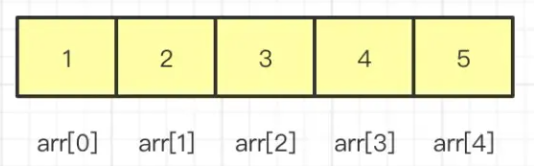

##### 顺序表（Sequence List）
用数组实现了队列List的功能模板，并可动态扩容

[SqList.cpp](https://github.com/su-dd/learning/blob/main/src/DataStructure/SqList.cpp)
顺序表数据结构和图片
```cpp
//顺序列表的类型
typedef struct {
    ElemType *elem; // 队列首指针
    int length;     // 队列中元素个数
    int size;       // 队列大小
    int increment;  // 扩增大小
} SqList;
```


#### 链表（Linked List）

一种使用非连续内存，存储线性数据的结构。

在内存的的表现为：

数据结构：
```cpp
typedef struct LNode {
    ElemType data;
    struct LNode *next;
} LNode, *LinkList;
```
###### 单链表（Link List）

###### 双向链表（Du-Link-List）

###### 循环链表（Cir-Link-List）


#### 队列（Queue）

一种先进先出（FIFO，First in First out）的线性结构；


##### 数组队列
数据结构
```cpp
typedef struct {
	ElemType * elem;
	int front;
	int rear;
	int maxSize;
}SqQueue;
```

**非循环队列**

```cpp
SqQueue.rear++
```

**循环队列**
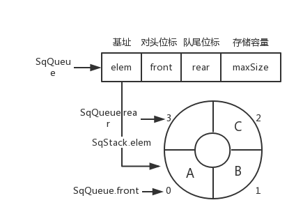
```cpp
SqQueue.rear = (SqQueue.rear + 1) % SqQueue.maxSize
```

##### 链队列


#### 栈（Stack）

一种后进先出（LIFO，Last in First out）的线性结构；


##### 顺序栈

用数组实现了栈的功能模板，并可动态扩容

[SqStack.cpp](https://github.com/su-dd/learning/blob/main/src/DataStructure/SqStack.cpp)
顺序栈数据结构和图片
```cpp
//顺序栈的类型
typedef struct {
    ElemType *elem; // 栈底指针
    int top;        // 栈顶
    int size;       // 当前大小
    int increment;  // 扩增
} SqSrack;
```


### 非线性结构
#### 树（Tree）

树形结构是一种层级式的数据结构，由顶点（节点）和连接它们的边组成。  
数的结构特点是：  

- 每个节点有零个或多个子节点；
- 没有父节点的节点称为根节点；
- 每一个非根节点有且只有一个父节点；
- 除了根节点外，每个子节点可以分为多个不相交的子树。

##### 二叉树
- 每个结点最多有两颗子树，结点的度最大为2。
- 左子树和右子树是有顺序的，次序不能颠倒。
- 即使某结点只有一个子树，也要区分左右子树。
- 每个结点的值均大于其左子树上任意一个结点的值。比如 根结点的值。根结点100大于其左子树上的30，18和16。
- 每个结点的值均小于其右子树上任意 一个结点的值。比如根结点 100 小于其右子树上的 120、130 和 135。


###### 存储结构

[BinaryTree.cpp](https://github.com/su-dd/learning/blob/main/src/DataStructure/BinaryTree.cpp)

二叉树数据结构

```c
typedef struct BiTNode
{
    TElemType data;
    struct BiTNode *lchild, *rchild;
}BiTNode, *BiTree;
```

###### 顺序存储

二叉树顺序存储图片


###### 链式存储

二叉树链式存储图片


###### 遍历方式

**DLR--前序遍历**

根在前，从左往右，一棵树的根永远在左子树前面，左子树又永远在右子树前面 


```cpp
	void pre_order(BiTree Node)//前序遍历递归算法
	{
		if (Node == NULL)
			return;
		printf("%c ", Node->data);//显示节点数据，可以更改为其他操作。在前面
		pre_order(Node->lchild);
		pre_order(Node->rchild);
	}****
```

**LDR--中序遍历**

根在中，从左往右，一棵树的左子树永远在根前面，根永远在右子树前面


```cpp
	void middle_order(BiTree Node)//中序遍历递归算法
	{
		if (Node == NULL)
			return;
		middle_order(Node->lchild);
		printf("%c ", Node->data);// 显示节点数据，可以更改为其他操作。在中间
		middle_order(Node->rchild);
	}
```

**LRD--后序遍历**

根在后，从左往右，一棵树的左子树永远在右子树前面，右子树永远在根前面

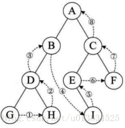

```cpp
	void post_order(BiTree Node)//后序遍历递归算法
	{
		if (Node == NULL)
			return;
		post_order(Node->lchild);
		post_order(Node->rchild);
		printf("%c ", Node->data);// 显示节点数据，可以更改为其他操作。在最后
	}
```

**层次遍历**

一层一层的遍历当前树；

一般通过中间容器存储一个层级的节点，实现层级变量

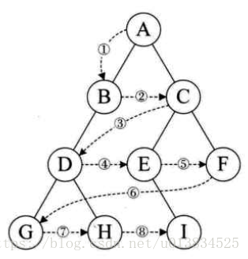


##### 满二叉树

除最后一层无任何子节点外，每一层上的所有结点都有两个子结点二叉树。或者说：一个二叉树，如果每一个层的结点数都达到最大值，则这个二叉树就是满二叉树。或者说，如果一个二叉树的层数为K，且结点总数是(2^k) -1 ，则它就是满二叉树。

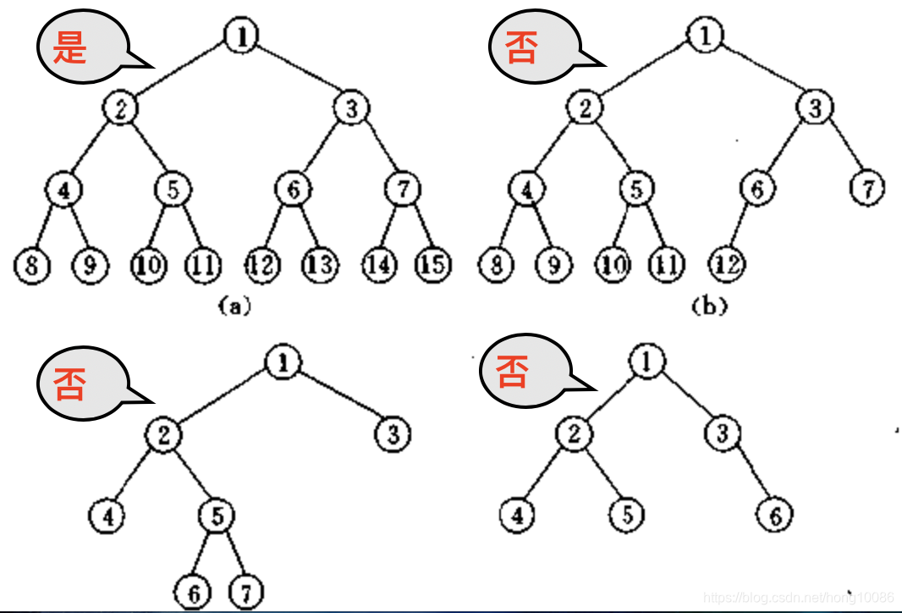

##### 完全二叉树

完全二叉树是效率很高的数据结构，完全二叉树是由满二叉树而引出来的。对于深度为K的，有n个结点的二叉树，当且仅当其每一个结点都与深度为K的满二叉树中编号从1至n的结点一一对应时称之为完全二叉树。

或者说：若设二叉树的深度为h，除第 h 层外，其它各层 (1～h-1) 的结点数都达到最大个数，第 h 层所有的结点都连续集中在最左边，这就是完全二叉树。

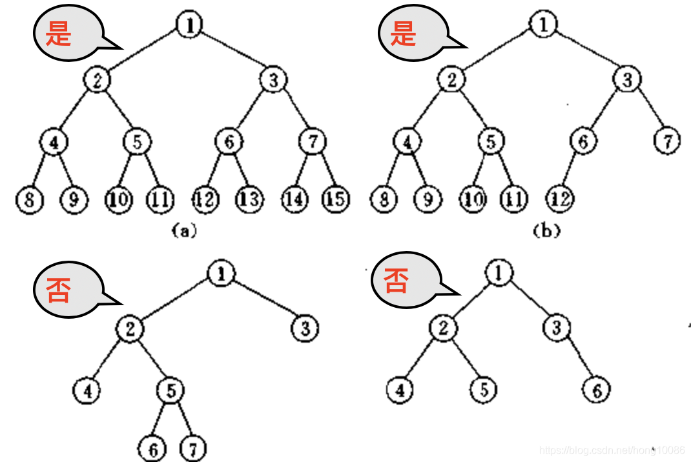

##### 堆（Heap）

堆比较特殊，是一种图的树形结构。被用于实现“优先队列”(priority queues)，优先队列是一种数据结构，可以自由添加数据，但取出数据时要从最小值开始按顺 序取出。在堆的树形结构中，各个顶点被称为“结点”(node)，数据就存储在这些结点中。  

只要满足下面两个特点的树形结构就是堆：  

- 堆是一个完全二叉树（所谓完全二叉树就是除了最后一层其他层的节点个数都是满的）。
- 大顶堆：根 >= 左 && 根 >= 右
- 小顶堆：根 <= 左 && 根 <= 右


##### 二叉查找树（二叉排序树，二叉搜索树）

值：左 < 根 < 右
1. 若左子树不空，则左子树上所有结点的值均小于它的根结点的值；  
2. 若右子树不空，则右子树上所有结点的值均大于它的根结点的值；  
3. 左、右子树也分别为二叉排序树；  

###### 二叉搜索树的搜索性能

在最好的情况下，二叉搜索树的查找效率比较高，是 O(logn)，其访问性能近似于二分法；

但最差时候会是 O(n)，比如插入的元素是有序的，生成的二叉搜索树就是一个链表，树的一条腿特变长，这种情况下，需要遍历全部元素才行

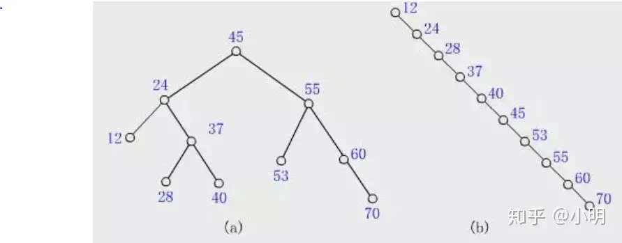

###### 删除
- 删除节点是树叶，则直接删除；
- 删除的节点只有一个子节点，此时只需要将删除节点的上一个节点的指向该节点的指针指向该节点唯一的子节点；
- 删除的节点有两个子节点（递归）
	- 将该节点右子树中最小的一个节点的值覆盖该节点中的值，然后再删除该节点的右子树中的最小的那个子节点
	- 将该节点左子树中最大的一个节点的值覆盖该节点中的值，然后再删除该节点的左子树中的最大的那个子节点

##### 平衡二叉树（AVL树）
定义：| 左子树树高 - 右子树树高 | <= 1

平衡二叉树的提出就是为了保证树不至于出现二叉查找树的极端一条腿长现象，尽量保证两条腿平衡。因此它的定义如下：

定义：平衡二叉树要么是一棵空树，要么保证左右子树的高度之差不大于 1，并且子树也必须是一棵平衡二叉树。


**查找效率为：**


###### 最小失衡树

平衡二叉树插入新结点导致失衡的子树：

###### 右旋左旋

  

**图解代码**


###### 调整

**LL型**（根的左孩子的左子树插入导致不平衡）：根的左孩子右旋


**RR型**（根的右孩子的右子树插入导致不平衡）：根的右孩子左旋


**LR型**（根的左孩子的右子树插入导致不平衡）：根的左孩子左旋，再右旋


**RL型**（根的右孩子的左子树插入导致不平衡）：右孩子的左子树右旋，再左旋


###### 删除
- 删除节点是树叶，则直接删除；
- 删除的节点只有一个子节点，此时只需要将删除节点的上一个节点的指向该节点的指针指向该节点唯一的子节点；
- 删除的节点有两个子节点（递归）
	- 将该节点右子树中最小的一个节点的值覆盖该节点中的值，然后再删除该节点的右子树中的最小的那个子节点
	- 将该节点左子树中最大的一个节点的值覆盖该节点中的值，然后再删除该节点的左子树中的最大的那个子节点

##### 红黑树

[RedBlackTree.cpp](https://github.com/su-dd/learning/blob/main/src/DataStructure/RedBlackTree.cpp)

首先红黑树（RBT）先是一个二叉搜索树（BST），他是解决二叉搜索树单链情况，区别于二叉平衡树（AVL）的另一种办法；

###### 红黑树的特征是什么？

可以按照括号里边的分类，记住 红黑树的几个原则：

- （**颜色属性**）性质1：节点非黑即红
- （**根属性**）性质2：根节点一定是黑色
- （**叶子属性**）性质3：叶子节点（NIL）一定是黑色
- （**红色属性**）性质4：每个红色节点的两个子节点，都为黑色。(从每个叶子到根的所有路径上不能有两个连续的红色节点)
- **（黑色属性）性质5：** 从任一节点到其每个叶子的所有路径，都包含相同数目的黑色节点。


**红色属性** 说明，红色节点的孩子，一定是黑色。 但是，RBTree 黑色节点的孩子，可以是红色，也可以是黑色；

**黑色属性**，可以理解为**平衡特征**， 如果满足不了平衡特征，就要进行平衡操作。

**新插入的节点一定是红色，且新节点的Parent也是红色；这时，需要调整**
###### 调整
设我们插入的新节点为 X

 **变色**
 1. 如果 X 是根结点(root)，则标记为黑色
 2. 如果 X 的 parent 为红，同时 uncle是红

 	

**左旋右旋**：如果 X 的 parent 为红，同时 uncle是黑色

- **LL** ：Parent节点右旋，变色
	
	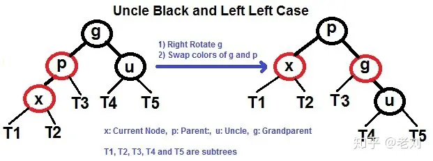

- **LR** ：先X节点左旋，再右旋，变色
	 
	 
	
- **RR** ：Parent节点右旋，变色
	 
	 
	
- **RL** ：先X节点右旋，再左旋，变色
	 
	 
	

###### 删除

1. 删除的节点的左、右子树都非空；
2. 删除的节点的左子树为空树，右子树非空；
3. 删除的节点的右子树为空树，左子树非空；
4. 删除的节点的左、右子树都为空树；

分析：1 可以通过，替换 中序遍历的 前置位的值，或后置位的值。转换为 2,3,4 ； 后面只讨论2,3,4

设删除节点为D

###### D为红色叶子


分析：删除D即可

###### D为黑色叶子，兄弟为红


当前状态，D下面两个位Nil，S为红，SL和SR必定不为空。

需要将P左转，做变色


###### D为黑色叶子，兄弟为黑色叶子

- **P为黑**


分析：S改为红色

- **P为红**


分析：结果同上，S改黑，P改为黑色。

###### D为黑色叶子，兄弟为黑色，有子

- **SL为红，SR颜色任意；**(对于该情况的处理，其实我们不关心P的颜色)

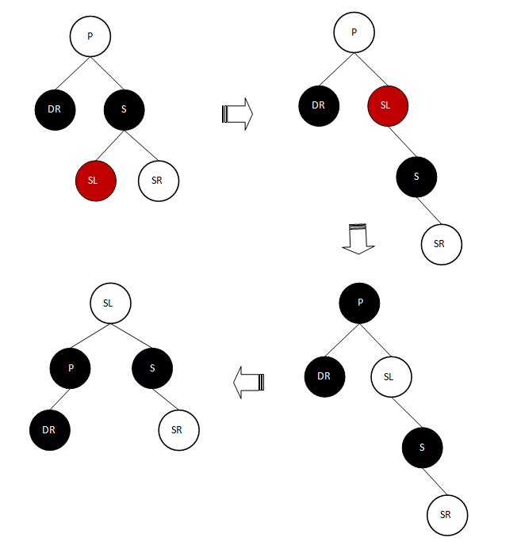
分析：将S右旋转；接着将SL改为P的颜色，P的颜色改为黑色(用这个黑色来填补DR分支的黑节点数)；将P左旋转


- **SR为红，SL颜色任意；**(对于该情况的处理，其实我们不关心P的颜色)


分析：将S由黑色改为P的颜色；将SR由红色改为黑色；将P的颜色改为黑色(用该黑色来填补DR分支缺失的黑节点数)；将P节点左旋转；

###### D为黑色，有一个红色叶子


分析：D的左右子，有一个有值且为红色时，用它替换D，变色即可

###### 应用
- 关联数组：如 STL 中的 map、set

###### 红黑树、二叉树搜索树的区别？

- 红黑树放弃了追求完全平衡，追求大致平衡，在与平衡二叉树的时间复杂度相差不大的情况下，保证每次插入最多只需要三次旋转就能达到平衡，实现起来也更为简单。
- 平衡二叉树追求绝对平衡，条件比较苛刻，实现起来比较麻烦，每次插入新节点之后需要旋转的次数不能预知。

[红黑树，超强动静图详解，简单易懂 - 知乎 (zhihu.com)](https://zhuanlan.zhihu.com/p/79980618)


##### B树（B-tree）、B+树（B+-tree）

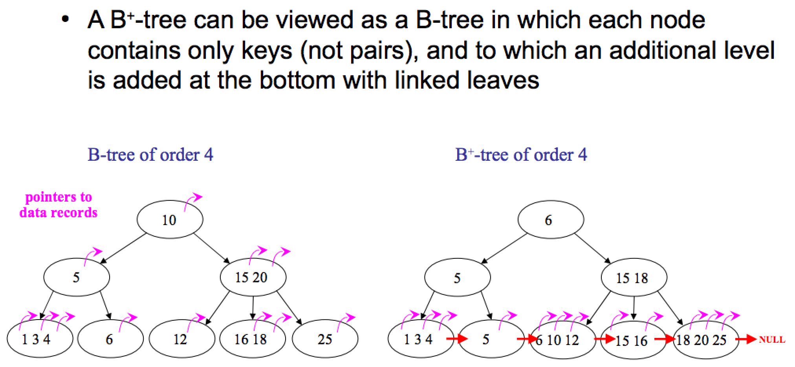

###### 特点

- 一般化的二叉查找树（binary search tree）
- “矮胖”，内部（非叶子）节点可以拥有可变数量的子节点（数量范围预先定义好）

###### 应用

- 大部分文件系统、数据库系统都采用B树、B+树作为索引结构

###### 区别

- B+树中只有叶子节点会带有指向记录的指针（ROWID），而B树则所有节点都带有，在内部节点出现的索引项不会再出现在叶子节点中。
- B+树中所有叶子节点都是通过指针连接在一起，而B树不会。

###### B树的优点

对于在内部节点的数据，可直接得到，不必根据叶子节点来定位。

###### B+树的优点

- 非叶子节点不会带上 ROWID，这样，一个块中可以容纳更多的索引项，一是可以降低树的高度。二是一个内部节点可以定位更多的叶子节点。
- 叶子节点之间通过指针来连接，范围扫描将十分简单，而对于B树来说，则需要在叶子节点和内部节点不停的往返移动。

> B 树、B+ 树区别来自：[differences-between-b-trees-and-b-trees](https://stackoverflow.com/questions/870218/differences-between-b-trees-and-b-trees)、[B树和B+树的区别](https://www.cnblogs.com/ivictor/p/5849061.html)

[一文详解 B-树，B+树，B*树 - 知乎 (zhihu.com)](https://zhuanlan.zhihu.com/p/98021010)

###### 红黑树、B 树、B+ 树的区别？

- 红黑树的深度比较大，而 B 树和 B+ 树的深度则相对要小一些
- B+ 树则将数据都保存在叶子节点，同时通过链表的形式将他们连接在一起。

#### 散列表（Hash）

散列表又叫哈希表，存储的是由键(key)和值(value)组 成的数据，根据键直接访问存储在内存存储位置的数据结构。


从图中可以看出，左边很明显是个数组，数组的每个成员包括一个指针，指向一个链表的头，当然这个链表可能为空，也可能元素很多。我们根据元素的一些特征把元素分配到不同的链表中去，也是根据这些特征，找到正确的链表，再从链表中找出这个元素。

**哈希表查找数据的公式为：记录的存储位置=f(key)** 

这里的对应关系 f 成为散列函数，又称为哈希 (hash函数)，而散列表就是把Key通过一个固定的算法函数既所谓的哈希函数转换成一个整型数字，然后就将该数字对数组长度进行取余，取余结果就当作数组的下标，将value存储在以该数字为下标的数组空间里，这种存储空间可以充分利用数组的查找优势来查找元素，所以查找的速度很快。

##### 概念

哈希函数：`H(key): K -> D , key ∈ K`
##### 构造方法
- 直接定址法
- 除留余数法
- 数字分析法
- 折叠法
- 平方取中法
##### 冲突处理方法
- 链地址法：key 相同的用单链表链接
- 开放定址法
    - 线性探测法：key 相同 -> 放到 key 的下一个位置，`Hi = (H(key) + i) % m`
    - 二次探测法：key 相同 -> 放到 `Di = 1^2, -1^2, ..., ±（k)^2,(k<=m/2）`
    - 随机探测法：`H = (H(key) + 伪随机数) % m`

##### 线性探测的哈希表数据结构实现
 
[HashTable.cpp](https://github.com/su-dd/learning/blob/main/src/DataStructure/HashTable.cpp)

线性探测的哈希表数据结构和图片
```cpp
typedef char KeyType;
// 哈希表中的记录类型
typedef struct {
	KeyType key;
}RcdType;

// 哈希表类型
typedef struct {
	RcdType* rcd;	// 哈希容器指针
	int size;	// 容量
	int count;	// 当前大小
	int* tag;	// 满空标识，有值1，无值0，删除-1 哈希表用过的同一个key，只能在一个位置，所以需要-1这个值
}HashTable;
```


#### 图（Graph）

由顶点和连接每对顶点的边所构成的图形就是图

圆圈叫作“顶点”(Vertex，也叫“结点”)，连接顶点的线叫作“边”（Edge）。也就是说，由顶点和连接每对顶点的边所构成的图形就是图。 图按照顶点指向的方向可分为无向图和有向图，像下面的就叫无向图。 图在存储数据上有着比较复杂和高效的算法，分别有邻接矩阵 、邻接表、十字链表、邻接多重表、边集数组等存储结构。常见的图遍历算法就是广度优先算法和深度优先算法。


## 算法


## 操作系统


## 计算机网络


## 数据库


## 设计模式

### 设计模式总览

在1994年，由Erich Gamma、Richard Helm、Ralph Johnson 和 John Vlissides 四人合著出版了一本名为 **Design Patterns - Elements of Reusable Object-Oriented Software**的书，这里就是设计模式的起源。

四位作者合成GOF（四人帮，Gang of Four），他们提出的设计模式主要基于面向对象设计原则。

> 对接口编程而不是对实现编程。
>
> 优先使用对象组合而不是继承。

总结来说设计模式是前人总结的经验，用于解决开发过程中常见问题的解决公式。

#### 7大基本原则

1. **开闭原则（OCP，Open Close Principle）**

   > 对扩展开放，对修改关闭。
   >
   > 在程序需要进行拓展的时候，不能去修改原有的代码，而是实现一个热插拔的效果。简言之，是为了使程序的扩展性好，易于维护和升级。想要达到这样的效果，我们需要使用**接口和抽象类**。

2. **单一职责原则（SRP，Single Responsibility Principle）**

   > 就一个类而言,应该仅有一个引起它变化的原因；
   >
   > 控制类的粒度、将对象解耦、提高内聚性；注重职责，主要约束类（实现和细节）；

3. **里氏替换原则（LSP，Liskov Substitution Principle）**

   > 任何基类可以出现的地方，子类一定可以出现。
   >
   > 阐述继承复用的原则；开闭原则实现方式；子类继承父类时，尽量不要重写父类方法；（不要破坏继承关系）

4. **依赖倒置原则（DIP，Dependence Inversion Principle）**

   > 接口不应依赖于实现，实现应该依赖于接口。
   >
   > 原则是开闭原则的基础，具体内容：针对接口编程，依赖于抽象而不依赖于具体。

5. **接口隔离原则（ISP，Interface Segregation Principle）**

   > 从子类实现角度，一个子类实现只需要实现那些他需要的接口。
   >
   > 所以我们需要对接口进行分组，这样可以降低类之间的耦合度。

6. **迪米特法则（LoD， Law of Demeter）**

   > 一个实体应当尽量少地与其他实体之间发生相互作用，使得系统功能模块相对独立。

7. **合成复用原则（CRP，Composite Reuse Principle）**

   > 尽量使用合成/聚合的方式，而不是使用继承。

#### 设计模型分类

**创建型**：描述对象如何创建，是为了将对象的创建与使用分离。

包括6种：单例、原型、简单工厂、工厂方法、抽象工厂、建造者。

**结构型**：描述类或对象如何组织成更大结构

包括7种：代理、适配器、桥接、装饰、外观、享元、组合。

**行为型**：描述类或对象之间如何协作完成任务

包括11种：模板方法、策略、命令、职责链、状态、观察者、中介者、迭代器、访问者、备忘录、解释器。

共24中设计模式，也由把简单工厂摘出来，为23中设计模式。

#### 图解设计模式关系


#### 语言选择

作者为C++开发，所以暂定语言为C++。

在进入正题之前，需要先了解两个概念：接口和抽象类。

**定义:**

抽象类：用来捕捉子类的通用特性的，不能被实例化，只能被用作子类的超类，是被用来创建继承层级里子类的模板；

接口：抽象方法的集合，只是一种形式，接口自身不能做任何事情。

**实现：**

C++语言中没有为这两个概念提供直接的关键字。但从实现的角度我们却更容易的知道他们的区别。

抽象类：存在纯虚函数的类。

接口：只存在纯虚函数的类。

C++的override关键字为**virtual**；一个函数使用了**virtual**代表可以被子类重写，但同时它也应该被实现；这样的函数称为**虚函数**。

在**虚函数**的末尾使用 **‘=0’**，这个函数就变成的**纯虚函数**，这时它就不能被实现，只能被子类重写。

### 简单工厂

选择简单工厂作为第一个篇，因为它几乎是最简单的设计模式。

这里想一想我们的冰淇淋贩卖机器，客户不需要知道冰淇淋怎么生成，客户只需要按下对应的按钮即可得到他们想要的产品。


代码如何实现？

#### 场景分析

这里不需要实现所有的选项。

简化一下：啃得鸡推出冰淇淋产品，共两款。草莓冰淇淋（产品编号1）和香草冰淇淋（产品编号1），要卖给用户；

简单工厂就可以实现贩卖机的功能。

#### 实现思路

实现类图为：

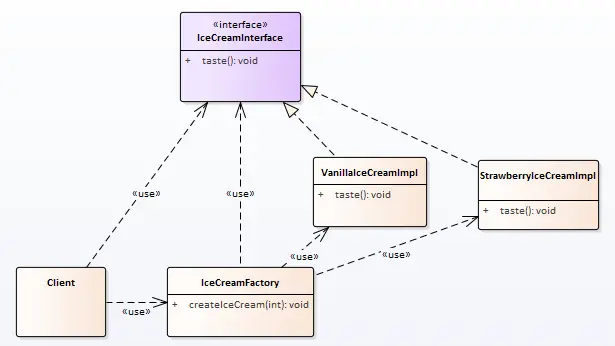

用户不用知道冰淇淋的生产过程；

用户只需要知道：

1. 要的是冰淇淋 （接口）
2. 冰淇淋的贩卖机在哪 （工厂）
3. 冰淇淋的产品列表 （一般会抽象为枚举类型)

#### 代码实现

**冰淇淋接口和它的实现**

```cpp
// 冰淇淋接口
class IceCreamInfterface
{
public:
    virtual ~IceCreamInfterface() {}
    virtual void taste() = 0;
};

// 草莓冰淇淋
class StrawberryIceCreamImpl : public IceCreamInfterface
{
public:
    virtual void taste() override
    {
        qDebug() << QStringLiteral("草莓冰淇淋的味道！");
    }
};

// 香草冰淇淋
class VanillaIceCreamImpl : public IceCreamInfterface
{
public:
    virtual void taste() override
    {
        qDebug() << QStringLiteral("香草冰淇淋的味道！");
    }
};
```

**冰淇淋工厂和产品列表**

```cpp
// 冰淇淋工厂
class IceCreamFactory
{
public:
    // 产品列表
    enum ProductList
    {
        StrawberryIceCream,
        VanillaIceCream
    };

public:
    static IceCreamInfterface  createIceCream(ProductList productId)
    {
        IceCreamInfterface *pProduct = nullptr;
        switch (productId)
        {
        case StrawberryIceCream:
            pProduct = new StrawberryIceCreamImpl();
            break;
        case VanillaIceCream:
            pProduct = new VanillaIceCreamImpl();
            break;
        default:
            break;
        }
        return pProduct;
    }
};
```

**客户**

```cpp
int main(int argc, char *argv[])
{
    // 买个草莓味的冰淇淋
    IceCreamInfterface *pIceCream1 =
            IceCreamFactory::createIceCream(IceCreamFactory::StrawberryIceCream);
    pIceCream1->taste();

    // 买个香草味的冰淇淋
    IceCreamInfterface *pIceCream2 =
            IceCreamFactory::createIceCream(IceCreamFactory::VanillaIceCream);
    pIceCream2->taste();

    delete pIceCream1;
    delete pIceCream2;
}
```

#### 使用感悟

简单工厂作为创建型设计模式，主要作用也是将对象的创建与使用分离。

##### 简单工厂的特点：

```
1. 产品是有限的、已知的。
2. 工厂类可以直用静态方法，所以可隐藏构造函数（构造函数私有化）
3. 创建方法理论上只依赖产品列表，所以可以创建各种实例，不限于只一类。（这是一个危险的实现）
```

##### 简单工厂的问题

1、添加新产品需要修改已经完成的工厂方法。

2、客户需要知道产品列表和功能直接的关系，增加复杂度。


#### 代码路径

https://github.com/su-dd/learning/tree/main/src/design_pattern/SimpleFactory

### 工厂模式

经过大家的努力，啃得鸡的草莓冰淇淋和香草冰淇淋销量不错。

准备继续贩售新的冰淇淋产品，发现每次生产新产品时，都要对之前的工厂（简单工厂）进行改造。

啃得鸡害怕会影响产品品质，希望设计一个发布新产品不会影响原产品生产的工厂。


代码如何实现？


#### 场景分析

让我们再想一想冰淇淋工厂的流水线吧；如何再不影响一个流水线的情况下，再多出一种产品嗯？

**造一条新的流水线去生产新产品！**

程序就是好，造流水线没那么花钱。


#### 实现思路

实现类图：


这时我们发现如果需要我们有了一个新冰淇淋（产品），那么我们就安排一个新的生产线（工厂）。再也不会影响原了的冰淇淋生产情况了。

#### 实现代码

**冰淇淋：**

```cpp
// 冰淇淋接口
class IceCreamInterface
{
public:
    virtual ~IceCreamInterface() {}
    virtual void taste() = 0;
};

// 草莓冰淇淋
class StrawberryIceCreamImpl : public IceCreamInterface
{
public:
    virtual void taste() override
    {
        qDebug() << QStringLiteral("草莓冰淇淋的味道！");
    }
};

// 香草冰淇淋
class VanillaIceCreamImpl : public IceCreamInterface
{
public:
    virtual void taste() override
    {
        qDebug() << QStringLiteral("香草冰淇淋的味道！");
    }
};
```


**冰淇淋工厂：**

```cpp
// 冰淇淋工厂接口
class IceCreamFactoryInterface
{
public:
    virtual ~IceCreamFactoryInterface() {}
    virtual IceCreamInterface * createIceCream() = 0;
};
// 草莓冰淇淋工厂
class StrawberryIceCreamFactory : public IceCreamFactoryInterface
{
public:
    StrawberryIceCreamFactory() {}
    IceCreamInterface * createIceCream()
    {
        return new StrawberryIceCreamImpl();
    }
};
// 香草冰淇淋工厂
class VanillaIceCreamFactory : public IceCreamFactoryInterface
{
public:
    VanillaIceCreamFactory() {}
    IceCreamInterface * createIceCream()
    {
        return new VanillaIceCreamImpl();
    }
};
```


**客户端：**

```cpp
int main(int argc, char *argv[])
{
    IceCreamFactoryInterface* pStrawberryIceCreamFactory =
            new StrawberryIceCreamFactory();

    IceCreamFactoryInterface* pVanillaIceCreamFactory =
            new VanillaIceCreamFactory();

    IceCreamInterface* pStrawberryIceCream = pStrawberryIceCreamFactory->createIceCream();
    IceCreamInterface* pVanillaIceCream = pVanillaIceCreamFactory->createIceCream();

    pStrawberryIceCream->taste();
    pVanillaIceCream->taste();

    delete pStrawberryIceCreamFactory;
    delete pVanillaIceCreamFactory;
    delete pStrawberryIceCream;
    delete pVanillaIceCream;
}
```


#### 使用感悟

这里我们解决了简单工厂存在的问题，符合开闭原则的增加产品生产；

但是我们同时引入了新的问题，客户端使用起来很麻烦，对应到现实就是本来一个客户去一个工厂能满足所有的需求，现在客户想要同时买到两种冰淇淋就需要跑两个场；

所有现在我们需一个超市，或者小卖部？

**特点/优点：**

1、工厂类可以不实例化，使用静态工厂类。

2、延时创建，使用类再不确定是否要创建产品时，可以通过拿着产品的工厂方法。再需要时再创建。 实现延时创建。

**问题：**

1、随着产品的增加，工厂也不断的增加，可能造成对象的爆发。

2、客户需要关注每个工厂的不同才能获得想要的产品，可能增加维护成本。

**思考：**

什么是产品，什么是工厂？

由于产品和工厂两个名称的迷惑性，我们可能会下意识的把他们对应到某个实体的映射。（这当然是初学时最快的理解方式）

但产品和工厂的概念中，产品指的是类；类可以是事物，关系等的抽象。


#### 代码路径

https://github.com/su-dd/learning/tree/main/src/design_pattern/FactoryMethod

### 外观模式

经过上篇的基建，发现：产品的质量已经可控，但是客户太费鞋（毕竟跑一家工厂买一个产品，鞋累啊）。

如何让用户不那么费鞋嗯？

供货的问题解决后，下面解决的就是经销的问题，一家可以卖各种商品的小卖部是很有必要的。


#### 场景分析

小卖部的特性是什么嗯？

小卖部的特性是将所有的功能放到统一位置，以便客户使用。

#### 实现思路

实现类图:


#### 实现代码

**外观/面板：**

```cpp
class  IceCreamFactoryFacade
{
public:
    IceCreamFactoryFacade()
        : m_pStrawberryIceCreamFactory(new StrawberryIceCreamFactory())
        , m_pVanillaIceCreamFactory(new VanillaIceCreamFactory()) {}

    ~IceCreamFactoryFacade()
    {
        delete m_pStrawberryIceCreamFactory;
        m_pStrawberryIceCreamFactory = nullptr;
        delete m_pVanillaIceCreamFactory;
        m_pVanillaIceCreamFactory = nullptr;
    }

public:
    IceCreamInterface *createStrawberryIceCream()
    {
        return m_pStrawberryIceCreamFactory->createIceCream();
    }

    IceCreamInterface *createVanillaIceCream()
    {
        return m_pVanillaIceCreamFactory->createIceCream();
    }

private:
    IceCreamFactoryInterface *m_pStrawberryIceCreamFactory;
    IceCreamFactoryInterface *m_pVanillaIceCreamFactory;
};
```


**客户端：**

```cpp
#include "IceCreamInterface.h"
#include "IceCreamFactoryFacade.hpp"

int main(int argc, char *argv[])
{
    IceCreamFactoryFacade oIceCreamFactoryFacade;
    IceCreamInterface* pStrawberryIceCream = oIceCreamFactoryFacade.createStrawberryIceCream();
    IceCreamInterface* pVanillaIceCream = oIceCreamFactoryFacade.createVanillaIceCream();

    pStrawberryIceCream->taste();
    pVanillaIceCream->taste();

    delete pStrawberryIceCream;
    delete pVanillaIceCream;
    return 0;
}
```


#### 使用感悟

在外观模式的帮助下，现在解决了工厂模式带来的使用不便的问题。

**对比外观+工厂和简单工厂模式，我们发现：**

相同：

1、对使用者隐藏了实现细节

2、提供良好的使用界面

不同：

外观+工厂对新扩展依然有比较好的包容性，但简单工厂相对差一些。

相对的，简单工厂的类实现比较简单，维护更简单。

**对应外观模式自身：**

外观模式通过提供统一的面板，隐藏了子系统、子模块的具体实现。系统的**封装性和易用性得到提升**，可以阻止新人对不熟悉模块的错误使用。

同时增加新的接口也需要修改面板，相对而言面板本身容易被影响，**扩展性下降**。


#### 代码位置

https://github.com/su-dd/learning/tree/main/src/design_pattern/Facade

### 单例模式

上篇了解了外观模式，解决了客户端找不到需要访问的功能的困扰。

小卖部是挺好，但是啃得鸡就不干了；我研发的产品，你去卖？ 那我怎么管理服务的标准化（统一提价）。


#### 场景分析

小卖部虽好，但如果只有我能开，那就更好了！

单例模式的思路比较简单，就是要求程序运行范围内只有一个对象。

为了这个目的，在不同情况下，需要使用不同的技术来辅助。

#### 实现思路

类图：


#### 实现代码

单例分为饿汉单例和懒汉单例，下面分别介绍。

##### 饿汉单例

相对来说，饿汉单例更好理解一些。单例的目的是为了保证只有一个对象。所以使用了静态对象进行处理。

同时将类的构造函数，copy构造，赋值构造进行私有化。

这时一个进程中将有且只有一个单例类的对象。

```cpp
#include "IceCreamFactoryFacadeInterface.h"
#include "StrawberryIceCreamFactory.hpp"
#include "VanillaIceCreamFactory.hpp"

class EagerSingletonFactoryFacade : public IceCreamFactoryFacadeInterface
{
private:
    static EagerSingletonFactoryFacade m_oInstance;
private:
    EagerSingletonFactoryFacade()
        : m_pStrawberryIceCreamFactory(new StrawberryIceCreamFactory())
        , m_pVanillaIceCreamFactory(new VanillaIceCreamFactory()) {}

    EagerSingletonFactoryFacade(EagerSingletonFactoryFacade const&);
    EagerSingletonFactoryFacade& operator=(EagerSingletonFactoryFacade const&);

public:
    virtual ~EagerSingletonFactoryFacade() {}

    static IceCreamFactoryFacadeInterface *getInstance()
    {
        return &m_oInstance;
    }

public:
    IceCreamInterface *createStrawberryIceCream() override
    {
        return m_pStrawberryIceCreamFactory->createIceCream();
    }

    IceCreamInterface *createVanillaIceCream() override
    {
        return m_pVanillaIceCreamFactory->createIceCream();
    }
private:
    IceCreamFactoryInterface *m_pStrawberryIceCreamFactory;
    IceCreamFactoryInterface *m_pVanillaIceCreamFactory;
};

// 初始化静态变量
EagerSingletonFactoryFacade EagerSingletonFactoryFacade::m_oInstance;
```


##### 懒汉单例

懒汉单例不同于只处在于，在使用时它才会加载。有懒加载的效果。

主要使用判空方式确保对象只生成一次。

Ps：实例中使用静态的方式存储指针对象，只是为了方便，这并不是规范。

```cpp
#include "IceCreamFactoryFacadeInterface.h"
#include "StrawberryIceCreamFactory.hpp"
#include "VanillaIceCreamFactory.hpp"
#include <QMutex>
#include <QMutexLocker>

class LazySingletonFactoryFacade : public IceCreamFactoryFacadeInterface
{
private:
    static IceCreamFactoryFacadeInterface *m_pInstance;
    static QMutex s_oMutex;
private:
    LazySingletonFactoryFacade()
        : m_pStrawberryIceCreamFactory(new StrawberryIceCreamFactory())
        , m_pVanillaIceCreamFactory(new VanillaIceCreamFactory()) {}
public:
    virtual ~LazySingletonFactoryFacade() {}

    static void freeInstancel()
    {
        if (nullptr != m_pInstance)
        {
            delete m_pInstance;
            m_pInstance = nullptr;
        }
    }

    // 对于单线程
    // 如果当前判断为单进程，我们中需要做简单的判空处理即可
    static IceCreamFactoryFacadeInterface *getInstance_1()
    {
        if (nullptr == m_pInstance)
        {
            m_pInstance = new LazySingletonFactoryFacade();
        }
        return m_pInstance;
    }

    // 对于多线程
    // 对于多线程程序，只做判空不能做到单例的效果，需要加锁
    // 这是最简单的加锁方式，通常不使用，应为效率不够高
    static IceCreamFactoryFacadeInterface *getInstance_2()
    {
        QMutexLocker oLocker(&s_oMutex);
        if (nullptr == m_pInstance)
        {
            m_pInstance = new LazySingletonFactoryFacade();
        }
        return m_pInstance;
    }

    // 对于多线程 - 双重判空
    // 对于多线程，同时使用双重判空的方式处理，以提高效率
    static IceCreamFactoryFacadeInterface *getInstance_3()
    {
        if (nullptr == m_pInstance)
        {
            QMutexLocker oLocker(&s_oMutex);
            if (nullptr == m_pInstance)
            {
                m_pInstance = new LazySingletonFactoryFacade();
            }
        }
        return m_pInstance;
    }

public:
    IceCreamInterface *createStrawberryIceCream() override
    {
        return m_pStrawberryIceCreamFactory->createIceCream();
    }

    IceCreamInterface *createVanillaIceCream() override
    {
        return m_pVanillaIceCreamFactory->createIceCream();
    }
private:
    IceCreamFactoryInterface *m_pStrawberryIceCreamFactory;
    IceCreamFactoryInterface *m_pVanillaIceCreamFactory;
};

// 初始化静态变量
IceCreamFactoryFacadeInterface * LazySingletonFactoryFacade::m_pInstance = nullptr;
QMutex LazySingletonFactoryFacade::s_oMutex(QMutex::Recursive);
```


#### 使用感悟

| 种类     | 实现                                | 优点                                                    | 缺点                                                         |
| -------- | ----------------------------------- | ------------------------------------------------------- | ------------------------------------------------------------ |
| 饿汉单例 | 1、使用静态区对象，确保只有一份实例 | 1、多线程，单线程可以用统一的方式处理 2、无加锁，效率高 | 1、程序运行时需要加载暂时无用的内存，可能影响效率 2、静态对象的初始化由系统决定，如果初始化依赖静态对象，可能导致异常。 |
| 懒汉单例 | 1、通过判空的方法，确保只有一份实例 | 1、程序运行时不用加载多余的数据                         | 1、第一次加载可能不够快 2、代码相对复杂                      |


#### 代码位置

https://github.com/su-dd/learning/tree/main/src/design_pattern/Singleton

### 原型模式

啃得鸡冰淇淋卖的太好了，别的商家希望也能卖冰淇淋；但是不想自己设计调参。于是clone或者说copy就是一个方案了？

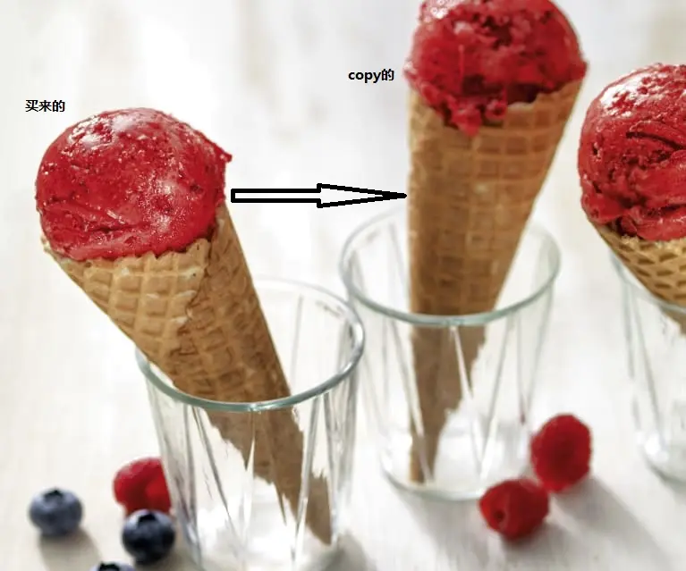

#### 场景分析

客户端可以再不用知道对象的具体实现的情况下，新建一个新的对象。那就是客户端只知道接口定义，也就是说是通过接口访问的。

原型模式指通过【现有对象】 是生成一个新对象，而不需要知道他们所属的类。

#### 实现思路

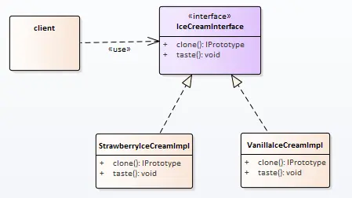

类图的设计也可以提一个单独的Prototype接口作为所有类的父类，客户端其实需要的是具有业务意义的类。

#### 实现代码

接口：

```cpp
// 冰淇淋接口
class IceCreamInterface
{
public:
    virtual ~IceCreamInterface() {}
    virtual void taste() = 0;
    virtual IceCreamInterface *clone() = 0;
};
```


实现：

```cpp
// 草莓冰淇淋
class StrawberryIceCreamImpl : public IceCreamInterface
{
public:
    virtual void taste() override
    {
        qDebug() << QStringLiteral("草莓冰淇淋的味道！");
    }

    IceCreamInterface *clone()
    {
        return new StrawberryIceCreamImpl();
    }
};
```


#### 使用感悟

原型模式的本质是通过深copy的方式生成对象，不用受构造函数的约束（可不用引入具体头文件）。

优点 / 使用场景：

1. 性能优化的场景中，当一共从头建造是需要消耗大量资源（如需要大量的IO操作，权限申请等）
2. 安全要求场景中，不向外暴露头文件，再一写情况下比较安全。

组合使用方式： 可以和工厂模式结合使用，作为工厂模式创建

缺点： 对于类中含有容器对象【如组合模式】不够友好

对类中对象由外部传递时，不够友好

#### 代码位置

https://github.com/su-dd/learning/tree/main/src/design_pattern/Prototype


### 抽象工厂

啃得鸡自从产品被抄袭，就很紧张；经过市场部讨论后，希望通过套餐的方式去打动用户。

套餐：（冰淇淋 + 薯条）

现再的问题是套餐产品怎么搞嗯？


#### 场景分析

不同于我们之前生产的产品，套餐类产品都是由不同的部分去构成，同一部分再不同套餐中不尽相同；不能在一个工厂内生产所有套餐产品。

所以我们需要多个工厂

抽象工厂是生成一系列对象的方法。

#### 实现思路


抽象工厂对比工厂模式，发现工厂是抽象工厂的特例。当抽象工厂的产品只有一种时，就是工厂模式。

#### 实现代码

产品1：冰淇淋

```cpp
// 冰淇淋接口
class IceCreamInterface
{
public:
    virtual ~IceCreamInterface() {}
    virtual void taste() = 0;
};

// 香草冰淇淋
class VanillaIceCreamImpl : public IceCreamInterface
{
public:
    virtual void taste() override
    {
        qDebug() << QStringLiteral("香草冰淇淋的味道！");
    }
};

// 草莓冰淇淋
class StrawberryIceCreamImpl : public IceCreamInterface
{
public:
    virtual void taste() override
    {
        qDebug() << QStringLiteral("草莓冰淇淋的味道！");
    }
};
```


产品2：薯条

```cpp
class ChipsInterface
{
public:
    virtual ~ChipsInterface() {}
    virtual void size() = 0;
};

class BigChipsImpl : public ChipsInterface
{
public:
    virtual void size()
    {
        qDebug() << "这个大份的薯条！";
    }
};

class LittleChipsImpl : public ChipsInterface
{
public:
    virtual void size()
    {
        qDebug() << "这个小份的薯条！";
    }
};
```


FactoryProducer:

```cpp
class FactoryProducer
{
public:
    enum Set
    {
        Set1,
        Set2
    };

public:
    FactoryInterface * createSet(Set setNum)
    {
        switch (setNum) {
        case Set1:
            return new Set1FactoryImpl();
        case Set2:
            return new Set2FactoryImpl();
        default:
            return nullptr;
        }
    }
};
```


#### 使用感悟

抽象工厂其实并不是一个复杂概念，其实抽象工厂就是工厂模式的一般现象，工厂模式就是抽象工厂的个例。

抽象工厂想要新增一个套餐是简单的，但是想要在套餐中新增一个项就比较不友好。

抽象工厂适用于整套的替换场景中。


#### 代码位置

https://github.com/su-dd/learning/tree/main/src/design_pattern/AbstractFactory

### 模板方法

啃得鸡自从通过抽象工厂解决套餐模式后，流量大增；但暂时盈利达到了上限。于是希望节流，发现工厂流程很多重复项，希望可以通过统一生产流程来做到成本优化。


#### 场景分析

简化场景，只生产冰淇淋甜筒。我们发现冰淇淋甜筒就是薄饼筒和冰淇淋球的组合。不同口味的冰淇淋，薄饼筒是不变的，换不同的冰淇淋球。

模板方法是一个你在下意识的情况下就会使用的方法。

模板方法的核心思想就是将流程中的细节（变化的地方）；下放到子类中解决。

#### 实现思路


#### 实现代码

模板方法：

```cpp
class FactoryTemplate
{
public:
    virtual ~FactoryTemplate() {}
    IceCream createIceCream()
    {
        IceCream oIceCream;
        createCone(oIceCream);
        createIceBall(oIceCream);
        return oIceCream;
    }

protected:
    void createCone(IceCream &iceCream)
    {
        iceCream.setCone();
    }

    virtual void createIceBall(IceCream &iceCream) = 0;
};
```


子类：

```cpp
class StrawberryFactory : public FactoryTemplate
{
public:
    virtual ~StrawberryFactory() {}
protected:
    virtual void createIceBall(IceCream &iceCream)
    {
        iceCream.setIceBall(QStringLiteral("草莓"));
    }
};

class VanillaFactory : public FactoryTemplate
{
public:
    virtual ~VanillaFactory() {}
protected:
    virtual void createIceBall(IceCream &iceCream)
    {
        iceCream.setIceBall(QStringLiteral("香草"));
    }
};
```


#### 使用感悟

模板方法的基本思路：

基于继承的情况上，封装不变的部分，扩展可变的部分。

优点：1、更好的代码复用性；2、父类封装控制，子类实现细节；实现更可控

缺点：1、类的增加，导致实现更复杂


#### 代码位置

https://github.com/su-dd/learning/tree/main/src/design_pattern/Template

### 策略方法

啃得鸡的节流策略很成功，但是节流是有上限的。内卷完了，还是要想想怎么开源。

于是相到通过促销的方式培养用户习惯。

现在有两个促销：

1. 一、三、五 薯条免费
2. 二、四、六 冰淇淋半价


#### 场景分析

现在我们有两个需要做的策略，需要随着时间的变化，去执行不同的策略。

执行策略的主体的不变的，行为是变化的。

策略模式是对算法的封装，将一组算法和算法作用的数据分开，使算法可以独立变化。

通过抽提共有接口，每个算法单独封装，算法之间可以相互替换。

#### 实现思路

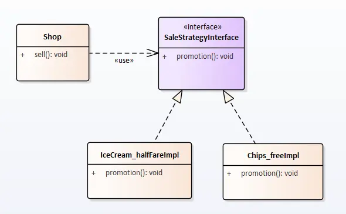

#### 实现代码

接口：

```cpp
class SaleStrategyInterface
{
public:
    virtual ~SaleStrategyInterface() {}
    virtual void promotion() = 0;
};
```


实现：

```cpp
class IceCream_halfFareImpl : public SaleStrategyInterface
{
public:
    virtual void promotion() override
    {
        qDebug() << QStringLiteral("冰淇淋半价！");
    }
};

class Chips_freeImpl : public SaleStrategyInterface
{
public:
    virtual void promotion() override
    {
        qDebug() << QStringLiteral("薯条免费！");
    }
};
```


使用:

```cpp
class Shop
{
public:
    Shop():m_pStrategy(nullptr) {}
    ~Shop() {delete m_pStrategy;}
    void sell()
    {
        m_pStrategy->promotion();
    }

    void getStrategy(SaleStrategyInterface *strategy)
    {
        delete m_pStrategy;
        m_pStrategy = strategy;
    }

private:
    SaleStrategyInterface *m_pStrategy;
};
```


#### 使用感悟

策略模式的本质是对算法的封装，使算法的使用者和算法本身可以自由变化。

优点：1、扩展性好；2、可以自由切换策略，对象复用性高

缺点：所有算法都需要暴露给客户段，维护成本变高

可以考虑结合简单工厂，对策略本身也进行一层封装；减少暴露。


#### 代码位置

https://github.com/su-dd/learning/tree/main/src/design_pattern/Strategy


### 享元模式

啃得鸡通过促销的方式，已经做了一个爆款店铺。现在希望在其他99家点评也使用这样的促销策略。


#### 场景分析

现在我们有100家店铺需要做促销，促销方案有2种。如果是每个店自己做自己的，就要200个策略对象。

这当然不是我们希望看到的！

我们希望只要建两个策略对象就可以了，100家店铺共用这两个策略对象。

享元模式又叫"蝇量模式"是一种通过减少创建对象的个数，来降低内存,提供效率的方式；是一种结构化的设计模式。


#### 实现思路


#### 实现代码

享元工厂

```cpp
class FlyweightFactory
{
public:
    enum StrategyType
    {
        IceCream_halfFare,
        Chips_free
    };
public:
    ~FlyweightFactory()
    {
        qDeleteAll(m_oStrategyMap.values());
    }

    SaleStrategyInterface* getStrategy(StrategyType type)
    {
        if (!m_oStrategyMap.contains(type))
        {
            switch (type)
            {
            case IceCream_halfFare:
                m_oStrategyMap.insert(type, new IceCream_halfFareImpl());
                break;
            case Chips_free:
                m_oStrategyMap.insert(type, new Chips_freeImpl());
                break;
            default:
                break;
            }
        }
        return m_oStrategyMap[type];
    }

private:
    QMap<int, SaleStrategyInterface*> m_oStrategyMap;
};
```


#### 使用感悟

享元模式的目的是通过减少对象的创建，来达到减少内存，提供效率的目的；

它设计的重点在于HashMap是使用，我们需要为HashMap找到一个唯一的特征值。

HashMap一般放在享元工厂中管理。

**优点：**提高对象复用率，提高效率

适用场景：

1. 大量相似或相同对象。
2. 这些对象占用大量内存，或影响效率。
3. 不同对象对外部执行无影响


**进一步思考：**

我们之前的实例其实是每种享元对象都最少创建一个，当这些享元对象之间又存在大量相同的数据如何处理？

这时我们需要引入两个概念：

- **内蕴状态(Internal State)**：存储在享元对象内部且不会随环境改变而改变。因此内蕴状态并可以共享。
- **外蕴状态(External State)**：是随环境改变而改变的、不可以共享的状态。

为了解决这个问题，我们要为现有的对象抽去共性，即对内蕴状态归类，成为享元对象的基础（私有对象或基类数据）；

外蕴状态由客户端保存，并在享元对象被创建之后，在需要使用的时候再传入到享元对象内部。

需要保证：外蕴状态与内蕴状态是相互独立的。


**实现举例:**

通过【P指针】的方式，多个对象共用一段内存属性。

这段内存一般为只读属性（外部只提供只读接口，这样可以做多线程安全）。


#### 代码路径

https://github.com/su-dd/learning/tree/main/src/design_pattern/Flyweight


### 装饰模式

想想一下，我现在如果想在冰淇淋里面加坚果、葡萄干怎么办？

#### 场景分析

当然我们可以在多建几个工厂，穷举每一个类型。

但是也许你也发现了！

我们要的冰淇淋发生了变化，用户其实可以加更多的东西，或者随意搭配。

难道我们还能不断穷举？

即使我们可以，这种穷举也会随着添加种类，枚举的可能性不断增加，工作量是指数级增长的。


**装饰器模式是怎么解决这个问题的？**

装饰器其实是将每种变化封装为一种装饰，可以这直接附加到原对象上，产生一个新对象。用于解决问题。

如加两次装饰器的小明：【小明】 --到--> 【穿裤子的小明】 --到--> 【穿裤子的戴帽子的小明】

这样装饰器可以自由组合叠加。

装饰模式是给一个现有对象添加新功能，同时有不去改变其结构的方式。它可以动态的给对象增加新的功能。


#### 实现思路

**类图**


#### 实现代码

**基础类:**

```cpp
class StrawberryIceCreamImpl : public IceCreamInterface
{
public:
    virtual void taste() override
    {
        cout << "草莓味冰淇淋" << endl;
    }
};
```


**装饰者基类：**

```cpp
class IceCreamDecorator : public IceCreamInterface
{
public:
    IceCreamDecorator(IceCreamInterface *iceCream)
        : m_pIceCream(iceCream)
    {
    }
    virtual ~IceCreamDecorator()
    {
        delete m_pIceCream;
    }

    virtual void taste() override
    {
        if (m_pIceCream)
        {
            m_pIceCream->taste();
        }
    }

private:
    IceCreamInterface *m_pIceCream;
};
```


**装饰者：**

```cpp
class NutIceCreamDecorator : public IceCreamDecorator
{
public:
    NutIceCreamDecorator(IceCreamInterface *iceCream)
        : IceCreamDecorator(iceCream)
    {
    }

    virtual void taste() override
    {
        std::cout << "带坚果的";
        IceCreamDecorator::taste();
    }
};
```


**客户使用：**

```cpp
int main()
{
	StrawberryIceCreamImpl().taste();
	NutIceCreamDecorator(new StrawberryIceCreamImpl()).taste();
	return 0;
}
```


#### 使用感悟

**使用场景：**

不想增加子类（或者需要增加子类的数量比较多）时，想扩展类能力。

**优点：**

装饰类和被装饰类可以独立发展，而不会相互耦合。

有效的分割核心职责和非核心职责

可动态地扩展一个实现类的功能（【套娃】使用），减少了类的数量

**注意点：**

装饰模式一般是构造函数中传入被装饰的对象。

装饰模式是的目的是为了给现有对象增强能力，但是不管怎么增强，不会改变对象的本质。（这点很重要，后面会在代理中做比较）

**缺点：**

多层包装的装饰类，出BUG，要一层一层查。如：游戏角色的装扮，如果一共20层装饰者，工作量大。


#### 代码路径

https://github.com/su-dd/learning/tree/main/src/design_pattern/Decorator

### 代理模式

冰淇淋从工厂出来后，一般要经过超市、马路边的小推车等 ，经销代理后，再到达消费者手里；

那为什么要有这样经销代理嗯？

#### 场景分析

这里对于消费者而言，目的就是从获得想要的冰淇淋，但是直接从工厂拿对用户而言不方便。所以有了超市。

超市还不能足够的接近客户，就有了马路边的小推车。

超市是为了消费者服务的，小推车也是为消费者服务的。 代理也是为客户服务的。

当希望使用，但无法直接使用，某个对象时；我们就可以考虑代理模式。


#### 实现思路


#### 实现代码

冰淇淋工厂：

```cpp
class IceCreamFactory : public IceCreamFactoryIntf
{
public:
	IceCreamFactory() {}
	virtual ~IceCreamFactory() {}

	virtual void getIceCream()
	{
		cout << "《冰淇淋》！" << endl;
	}
};
```


工厂代理：

```cpp
class IceCreamFactoryProxy : public IceCreamFactoryIntf
{
public:
	IceCreamFactoryProxy() {}
	virtual ~IceCreamFactoryProxy() {}

	virtual void getIceCream()
	{
		cout << "加价" << endl;
		m_oFactory.getIceCream();
	}

private:
	IceCreamFactory m_oFactory;
};
```


客户调用：

```cpp
int main()
{
	SetConsoleOutputCP(CP_UTF8);
	IceCreamFactoryIntf *p = new IceCreamFactoryProxy();
	p->getIceCream();

	delete p;
	return 0;
}
```


#### 感悟

代理模式是一个自由度特别高的模式，也是一个不容易被辨识的模式。

现在去回想：装饰者模式，或者准备在下一章写的桥模式，我们会发现，里面的区别很微妙。

这里来比较装饰者模式 和 代理：

装饰者模式的注重点在于对已有对象的功能增强，特性上可以无限嵌套；

代理注重解决：客户和要使用的对象之间的复杂性，当我们规划了两个实体A和B后，发现A和B之间的调用关系复杂，或者存在业务上不属于A或者B的调用时。

我们就需要代理来处理这部分的复杂性，代理通过添加中间层的方式在A和B之间添加了一层新的扩展封装。

spring aop 是现在比较有名的代理模式实现。


#### 代码位置

https://github.com/su-dd/learning/tree/main/src/design_pattern/Proxy


### 桥模式

小商贩多了，也就一味这销售的渠道拓宽了，人们接受了这种商品。 同时也意味着是用**原型**模式做copy的人多了。

这时为了不被虐币驱逐良币，啃得鸡决定：将工厂独立处理，加大产能，压缩价格，打价格战。

啃地鸡冰淇淋代工厂产生了！！！！

各品牌直接把自己的牌子放在啃地鸡，就能拿到自己的产品。问啃地鸡怎么生产？


#### 场景分析

啃地鸡待工厂现在生产的冰淇淋有两个维度属性： 品牌，配方。

我们可以使用继承关系，但是随着 品牌，配方 不断的增加。子类的数量呈快速增加的状态。可能增加一个配方，就需要十多个子类，甚至更多 。

但是，如果采用品牌和配方拆开的生产方式，增加一个配方就是一个配方。

当类中存在多层继承时，如果我们发现基础是按两个不同维度展开时，就应该考虑**桥模式**。


#### 实现思路

**类图：**


#### 实现代码

品牌：

```cpp
// 接口：
class BrandIntf
{
public:
    virtual ~BrandIntf() {}
    virtual void logo() = 0;
};

// 实现
class ABrandImpl : public BrandIntf
{
public:
    void logo()
    {
        cout << "啃得鸡logo";
    }
};

class BBrandImpl : public BrandIntf
{
public:
    void logo()
    {
        cout << "啃得鸭logo";
    }
};
```


冰淇淋：

```cpp
// 接口
class IceCreamIntf
{
public:
    virtual ~IceCreamIntf() {}
    virtual void taste() = 0;
    virtual void setBrand(BrandIntf *brand) = 0;
};

// 实现

class IceCreamImpl
{
public:
    IceCreamImpl() : m_pBrand(nullptr) {}
    virtual ~IceCreamImpl()
    {
        delete m_pBrand;
    }

    virtual void taste()
    {
        m_pBrand->logo();
    }

    virtual void setBrand(BrandIntf *brand)
    {
        if (m_pBrand == brand)
            return;
        if (nullptr != m_pBrand)
            delete m_pBrand;
        m_pBrand = brand;
    }

private:
    BrandIntf *m_pBrand;
};

class StrawberryIceCreamImpl : public IceCreamImpl
{
public:
    virtual void taste()
    {
        IceCreamImpl::taste();
        cout << "草莓冰淇淋！" << endl;
    }
};
```


客户端：

```cpp
int main()
{
    SetConsoleOutputCP(CP_UTF8);
    StrawberryIceCreamImpl oIceCream1;
    oIceCream1.setBrand(new ABrandImpl());
    oIceCream1.taste();

    StrawberryIceCreamImpl oIceCream2;
    oIceCream2.setBrand(new BBrandImpl());
    oIceCream2.taste();

    return 0;
}
```


#### 感悟

**优点：**

1、从两个维度拆分多重基础类，极大的减少了类个数。

2、两个维度可以独立变化，而不影响另一个维度。

**缺点：**

1、外在使用时会更复杂。

对比代理，装饰者，我们发现这三这外在使用时，有类似的使用方式。

**这样对注重点做对比：**

代理：增加不属于原对象的功能。

装饰者：对原有功能的增强，增强后还是原有功能。

桥模式：拆分两个维度，以简化原实现。


#### 代码位置

https://github.com/su-dd/learning/tree/main/src/design_pattern/Bridge

### 适配器模式

在桥模式这篇中，啃得鸡优化了自己工厂生产模式；使用桥模型，使得冰淇淋口味和品牌（logo）相互独立变化。

现在小厂家有了一点问题，小厂家A只知道自己需要 草莓和香草两种冰淇淋。不希望知道啃得鸡可以帮助贴多少中品牌。

问题：小厂家如何更简单的获得自己的产品嗯？

#### 场景分析

对小厂家A而言，只需要草莓和香草两种冰淇淋。

贴自己的logo是默认的，不需要时刻提醒的。

适配器是为了已经适配那些已经稳定的功能，不希望再发生变动的模块；或者我们并无能力改变的，由外部提供的功能。

典型的是对sdk的接入，当我们希望使用某个sdk的功能；但它又不是那么切合时，为了不将程序搞得一团乱麻。

我们通常会考虑使用适配器的方式。


#### 实现思路

这里先看下：啃得鸡sdk


sdk最终通过facade的方式将创建的决定权移交给客户端，代码如下。

```cpp
#include "BrandImpl.hpp"
#include "BrandIntf.h"
#include "IceCreamIntf.h"
#include "IceCreamImpl.hpp"


enum Brand { A, B };
enum Taste { Strawberry, Vanilla };

class IceCreamFacade
{
public:
	IceCreamIntf* createIceCream(Taste taste, Brand brand)
	{
		IceCreamIntf* pIceCream = nullptr;
		switch (taste)
		{
		case Strawberry:
			pIceCream = new StrawberryIceCreamImpl();
			break;
		case Vanilla:
			pIceCream = new VanillaIceCreamImpl();
			break;
		default:
			pIceCream = new StrawberryIceCreamImpl();
		}

		switch (brand)
		{
		case A:
			pIceCream->setBrand(new ABrandImpl());
			break;
		case B:
			pIceCream->setBrand(new BBrandImpl());
			break;
		default:			   
			break;
		}
		return pIceCream;
	}

};
```

对于品牌方A而已，只希望选择口味；不希望在每个生产环境都选择一下自己是A。

这里是使用适配器的方式，隔离A不希望知道的信息。一般有两种方式：类适配器，对象适配器


##### 类适配器

通过继承的方式，重写父类函数；以此为client提供更合适的接口。


```cpp
#include "sdk/IceCreamFacade.hpp"

class IceCreamFacadeClassAdapter : public IceCreamFacade
{
public:
	IceCreamIntf* createIceCream(Taste taste)
	{
		return IceCreamFacade::createIceCream(taste, Brand::A);
	}
};
```


##### 对象适配器

通过对象使用的方式，将需要实际的业务执行对象进行包装。以此为client提供更合适的接口。


```cpp
class IceCreamFacadeObjectAdapter
{
public:
	IceCreamFacadeObjectAdapter()
		: m_pIceCreamFacade(new IceCreamFacade())
	{

	}
	virtual ~IceCreamFacadeObjectAdapter()
	{
		delete m_pIceCreamFacade;
		m_pIceCreamFacade = nullptr;
	}

public:
	IceCreamIntf* createIceCream(Taste taste)
	{
		return m_pIceCreamFacade->createIceCream(taste, Brand::A);
	}

private:
	IceCreamFacade* m_pIceCreamFacade;
};
```


#### 感悟

1、从上述的可知适配器的本质是为了去处理由于某种原因，不能被修改代码的部分。如果我们可以修改目标代码，不建议使用适配器。

2、上述场景为单向调用场景；在实际的场景中还有很多是两个模块相互使用。同时，他们又是不可以被改动的情况。这时我们需要使用双向适配器。这时主要使用**类适配器**。

**双向适配器：**



#### 代码

https://github.com/su-dd/learning/tree/main/src/design_pattern/Adapter

### 迭代器模式

随着消费观的变化，冰淇淋的无人销售变得很有吸引力。

现在有一个问题：无人贩卖机怎么实现按顺序依次卖完某种冰淇淋，并在卖完后告知用户？


#### 场景分析

这里简化一下规则，假设贩卖机只贩卖一种冰淇淋。

贩卖机的规则：

1、依次售卖，向用户提供冰淇淋。

2、不能直接让用户打开去拿冰淇淋。

3、当冰淇淋销售完，显示无货。

这里，迭代器就比较合适。


#### 实现思路


##### Aggregate

Aggregate接口：

```cpp
template<class Item>
class Aggregate
{
public:
	Aggregate() {}
	virtual ~Aggregate() {}
	virtual void pushData(Item item) {}
	virtual Iterator<Item>* createIterator() { return nullptr; }
	virtual Item* operator[](int index) { return nullptr; }
	virtual int getSize() { return 0; }
};
```


Aggregate接口实现：

```cpp
#include "Aggregate.h"
#include <vector>
#include "ConcreteIterator.h"

template <class Item>
class ConcreteAggregate : public Aggregate<Item>
{
public:
    ConcreteAggregate() {};
    virtual ~ConcreteAggregate() {};

    virtual void pushData(Item item) override;
    virtual Iterator<Item>* createIterator() override;
    virtual Item* operator[](int index);
    virtual int getSize() override;
private:
    std::vector<Item> data;
};

template <class Item>
void ConcreteAggregate<Item>::pushData(Item item)
{
    data.push_back(item);
}

template <class Item>
Iterator<Item>* ConcreteAggregate<Item>::createIterator()
{
    return new ConcreteIterator<Item>(this);
}

template <class Item>
Item* ConcreteAggregate<Item>::operator[](int index)
{
    return &data.at(index);
}

template <class Item>
int ConcreteAggregate<Item>::getSize()
{
    return data.size();
}
```


##### Iterator

Iterator接口：

```cpp
#include "Aggregate.h"
template<class Item>
class Iterator
{
public:
	Iterator() {}
	virtual ~Iterator() {}
	virtual void first() {}
	virtual void next() {}
	virtual Item* curItem() { return nullptr;  }
	virtual bool hasNext() { return false; }
};
```


Iterator接口实现：

```cpp
#include "Iterator.h"
#include "Aggregate.h"

template<class Item>
class ConcreteIterator : public Iterator<Item>
{
public:
	ConcreteIterator(Aggregate<Item> *a) : aggr(a), cur(0) {}
	virtual ~ConcreteIterator(){}

	virtual void first() override;
    virtual void next() override;
    virtual Item* curItem() override;
    virtual bool hasNext() override;
private:
	Aggregate<Item>* aggr;
	int cur;
};

template<class Item>
void ConcreteIterator<Item>::first()
{
    cur = 0;
}

template<class Item>
void ConcreteIterator<Item>::next()
{
    if (cur < aggr->getSize())
        cur++;
}

template<class Item>
Item* ConcreteIterator<Item>::curItem()
{
    if (cur < aggr->getSize())
    {
        return (*aggr)[cur];
    }
    else
    {
        return nullptr;
    }
}

template<class Item>
bool ConcreteIterator<Item>::hasNext()
{
    return cur >= aggr->getSize();
}
```


##### main函数

```cpp
int main(int argc, char* argv[])
{
    Aggregate<std::string>* aggr = new ConcreteAggregate<std::string>();
    aggr->pushData("草莓冰淇淋1");
    aggr->pushData("草莓冰淇淋2");
    aggr->pushData("香草冰淇淋2");
    Iterator<std::string>* it = aggr->createIterator();

    for (it->first(); !it->hasNext(); it->next())
    {
        std::cout << *it->curItem() << std::endl;
    }
    delete it;
    delete aggr;
    return 0;
}
```


#### 感悟

迭代器模式又叫游标模式是一种常见模式，行为型设计模式的一种。几乎每种语言，会实现自己的迭代器。

在代码编程中，常常需要聚合对象来存放一组数据；

迭代器可以依次访问聚合对象内部的各个元素，同时又不暴露聚合对象的内部表示；

一般做业务开发时，并不需要实现迭代器模式；如果需要做公共组件，基础组件时，封装迭代器可能会被使用。


#### 代码位置

https://github.com/su-dd/learning/tree/main/src/design_pattern/Iterator


### 备忘录模式

前面通过自动贩卖机（迭代器模式），冰淇淋的销售问题变得很好。
于是啃得鸡研发了一条自动化冰淇淋生成线，可以生成多种口味，多种配方的冰淇淋。
每种冰淇淋的销量，目前是不确定的。为了减少不必要的浪费，希望可以根据市场变动，动态调整冰淇淋是生产。

#### 场景分析

一条生成线可以完成所有产品的生产的同时，也意味着产品线的复杂。

这里的冰淇淋生产线是自动化的，为电脑控制；

解决思路为：将各种产品的生产参数进行备份、存档。

当需要的时候就可以一键使用。


#### 实现思路

**类图**


#### 实现代码

**IceFactoryOriginator:** 备忘录使用类

```cpp
class IceFactoryOriginator
{
public:
	IceFactoryOriginator()
		: m_sflavour("")
		, m_sDryFruit("") {}

	void setFlavour(string flavour)
	{
		this->m_sflavour = flavour; 
	}

	void setDryFruit(string dryFruit) 
	{
		this->m_sDryFruit = dryFruit; 
	}

	IceCream* createCream()
	{
		IceCream *pIceCream = new IceCream(m_sflavour, m_sDryFruit);
		return pIceCream;
	}

	Memento* createMemento()
	{
		return new Memento(m_sflavour, m_sDryFruit);
	}

	void restoreMemento(Memento* memento) 
	{
		m_sflavour = memento->getFlavour();
		m_sDryFruit = memento->getDryFruit();
	}
private:
	string m_sflavour;
	string m_sDryFruit;
};
```


**Memento:** 备忘录

```cpp
class Memento
{
public:
	Memento(string flavour, string dryFruit)
		: m_sflavour(flavour)
		, m_sDryFruit(dryFruit) {}
	string getFlavour() { return m_sflavour; }
	string getDryFruit() { return m_sDryFruit; }
private:
	string m_sflavour;
	string m_sDryFruit;
};
```


**CareTaker:** 备忘录管理类

```cpp
class CareTaker
{
public:
	CareTaker() {}
	~CareTaker() 
	{
		for (auto oIterator = m_oMementos.begin(); oIterator != m_oMementos.end(); ++oIterator)
		{
			delete *oIterator;
		}
		m_oMementos.clear();
	}

	void add(Memento* memento) { this->m_oMementos.push_back(memento); }
	Memento* get(int index) { return this->m_oMementos[index]; }

private:
	vector<Memento*> m_oMementos;
};
```


#### 感悟

备忘录是为系统的运行提供了后悔药；让系统可以在需要的时机，可以回到希望的状态。

常见的应用场景：撤销恢复，游戏存档，数据库事务等。

当一个对象的所有信息都需要进入备忘录，我们可以思考使用 ： 原型模式 + 备忘录模式

通过原型模式的自copy，我们不会丢失任何数据；并可以将 备忘录中 的**备忘录使用者**和**备忘录**统一。


#### 代码路径

https://github.com/su-dd/learning/tree/main/src/design_pattern/Memento

### 命令模式

上一篇备忘录模式，通过对生产参数的备份、存档；解决了自动化冰淇淋生产线 切换生产模式的问题。

但技术员小啃💂 最近过的并不开心，工厂的单子在不断的变化；生产线的生产环境总是需要调整。

生产线的控制随主体一起在工厂，技术员小啃不得不呆在工厂里随时待命；他已经两个月没有回家。

小啃非常希望自己有一个遥控器，可以随时发布指令；一键改变生产线的生产环境就能变成想要的状态。


#### 场景分析

在这个场景里有两个角色：技术员小啃、生产线。

技术员小啃是使用者，生产线是被使用者； 由于技术员小啃必须呆在生产线上才能操作生产线，及使用者和被使用者直接耦合。

正常情况下，使用者和被使用者之间是耦合关系的；但这里希望是使用者和被使用者之间不直接产生关系。

为了达到这一目的，如小啃所愿；引入第三个角色：遥控指令

这样构成了，新的调用关系:

> 使用者（小啃）-> 命令（遥控器指令）-> 被使用者（生产线）


#### 实现思路


##### main函数（客户端）

具体的命令、命令的接受者、命令的调用者。都是在客户端创建。

```cpp
int main(int argc, char* argv[])
{
	Invoker oInvoker;
	IceFactoryReceiver oIceFactoryReceiver;

	StrawberryCommand oStrawberryCommand(&oIceFactoryReceiver);
	oInvoker.setCommand(&oStrawberryCommand);
	oInvoker.executeCommand();
	oIceFactoryReceiver.createCream().taste();

	VanillalceCommand oVanillalceCommand(&oIceFactoryReceiver);
	oInvoker.setCommand(&oVanillalceCommand);
	oInvoker.executeCommand();
	oIceFactoryReceiver.createCream().taste();
	
	return 0;
}
```


#### 接受者

业务的具体实现者；这里是冰淇淋生成线。

```cpp
class IceFactoryReceiver
{
public:
	IceFactoryReceiver()
		: m_sflavour("")
		, m_sDryFruit("") {}

	void setFlavour(string flavour)
	{
		this->m_sflavour = flavour; 
	}

	void setDryFruit(string dryFruit) 
	{
		this->m_sDryFruit = dryFruit; 
	}

	IceCream createCream()
	{
		return IceCream(m_sflavour, m_sDryFruit);
	}

private:
	string m_sflavour;
	string m_sDryFruit;
};
```


##### 命令

这里将草莓、香草两种冰淇淋的生产，封装为命令。可以发现命令中是拿着命令执行的对象实例的。

```cpp
class Command
{
public:
	~Command() {}
	virtual void execute() = 0;
};

// 草莓味命令
class StrawberryCommand : public Command
{
public:
	StrawberryCommand(IceFactoryReceiver* iceFactoryReceiver)
		: m_pIceFactoryReceiver(iceFactoryReceiver) {}

	~StrawberryCommand() { m_pIceFactoryReceiver = nullptr; }

	virtual void execute()
	{
		m_pIceFactoryReceiver->setDryFruit("瓜子");
		m_pIceFactoryReceiver->setFlavour("草莓");
	}
private:
	IceFactoryReceiver* m_pIceFactoryReceiver;
};

// 香草味命令
class VanillalceCommand : public Command
{
public:
	VanillalceCommand(IceFactoryReceiver* iceFactoryReceiver)
		: m_pIceFactoryReceiver(iceFactoryReceiver) {}

	~VanillalceCommand() { m_pIceFactoryReceiver = nullptr; }
	virtual void execute()
	{
		m_pIceFactoryReceiver->setDryFruit("榛子");
		m_pIceFactoryReceiver->setFlavour("香草");
	}
private:
	IceFactoryReceiver* m_pIceFactoryReceiver;
};
```


##### 调用者

调用者负责命令的调用，提供命令统一调用的封装。

```cpp
class Invoker
{
public:
	Invoker() : m_pCommand(nullptr) {}
	~Invoker() {}

	void setCommand(Command *command)
	{
		m_pCommand = command;
	}

	void executeCommand()
	{
		m_pCommand->execute();
	}

private:
	Command * m_pCommand;
};
```


#### 感悟

命令模式主要实现了调用者和接受者之间的解构。

**场景1：** 1、调用者在一些不知道接受者的情况，或不能操作调用者的情况。

eg: 界面上有多个按钮控件，分别实现不同的业务功能。

一般界面控制使用一些公共组件；界面控件不知道具体业务使用类，且我们不能操作界面控件的内部实现。

**场景2：** 1、调用者和接受者执行的生命周期不同；接受者执行时，调用者已经被释放。

eg: 数据库系统的撤销、恢复、更新。

数据库根据命令进行撤销、恢复、更新；数据库系统的需要根据自身情况完成数据维护。如果调用者一直等等数据库的返回，可能导致阻塞。同时调用者也不可能提供 撤销、恢复 需要的状态，命令+备忘录可以很好的满足这里的需求。

**同策略模式的区别：**

简单类别：

命令模式是处理将不同的事情用同一种方式去统一调用，策略模式是处理同一件事情的不同处理方式。

命令模式：命令实例中自己拿着接收者实例。所以命令可操作的对象其实不拘束为一个对象，甚至可以不局限为同一类对象。

策略模式：策略实例无接受者实例，是对一件事的不同做法。


#### 代码路径

https://github.com/su-dd/learning/tree/main/src/design_pattern/Command


### 组合模式

上篇我们使用命令模式，帮助生产员小啃💂更好的生活。

啃得鸡的生产线通过引入自动生产线，产量激增；但销售线并没办法通过科技爆炸实现销售的激增。

所以啃得鸡决定，把部分商品通过让利的方式给到经销商销售；走薄利多销的方式消化产能。

大经销商，也通过让利的方式将商品给到小经销商;最终给到消费者手中。

代码上怎么实现？


#### 场景分析

这里可以看到

> 啃得鸡厂家，对应有N个大经销商 大经销商，对应有N个小经销商 ... 小经销商，对应N个零售商 零售商，对应N个顾客

可以发现在整个销售链是一个树状结构：

厂家 -> n大经销商 -> ... -> n零售商 -> n顾客

厂家扮演了【提供商】，顾客扮演了【消费者】; 其他都同时扮演了两个角色：【消费者】、【提供商】；

在销售的整个链条中，每一层都只关注自己上下游，对其他的并不多过问。

如果将【消费者】、【提供商】抽提为接口就是一个行为 buy; 同时实现类做父子结构嵌套，即完成整个链条的表述。


#### 实现思路


##### 接口Component

```cpp
class Component
{
public:
	explicit Component(string key) : m_sKey(key) , m_pParent(nullptr) {}
	virtual ~Component() {}
public:
	virtual void add(string key, Component* component) {}
	virtual void remove(string key) {}
	virtual Component* getParent(){ return m_pParent; }
	virtual void setParent(Component* component) { m_pParent = component; }
	virtual Component* getChild() { return nullptr; }
	virtual void refresh() {}
public:
	virtual int buy(int num) { return 0; }
	virtual int needNum() { return 0;  }

protected:
	string m_sKey;
	Component* m_pParent;
};
```


##### 叶子 Leaf

```cpp
class Leaf : public Component
{
public:
	explicit Leaf(string key) : Component(key) {}
public:
	int buy(int num)
	{
		cout << m_sKey << "购买了" << num << "根雪糕！" << endl;
		return 0;
	}

	int needNum()
	{
		return 1;
	}
};
```


##### 一般节点：Composite

```cpp
class Composite : public Component
{
public:
	Composite(string key) 
		: Component(key)
		, m_nNeedNum(0)
	{
	}

	virtual ~Composite()
	{
		m_oChildren.clear();
	}

public:
	void add(Component* component)
	{
		m_oChildren.push_back(component);
		component->setParent(this);
		refresh();
	}

	void remove(int index)
	{
		m_oChildren.erase(m_oChildren.begin() + index);
		refresh();
	}

	Component* getChild(int index)
	{ 
		return m_oChildren[index];
	}

	void refresh() 
	{
		m_nNeedNum = 0;
		for each (auto var in m_oChildren)
		{
			m_nNeedNum += var->needNum();
		}
		if (nullptr != getParent())
		{
			getParent()->refresh();
		}
	}
public:
	int buy(int num)
	{
		cout << m_sKey << "进货" << num << "根雪糕！" << endl;
		for each (auto var in m_oChildren)
		{
			num -= var->needNum();
			var->buy(var->needNum()) ;
		}
		return num;
	}

	int needNum()
	{
		return m_nNeedNum;
	}

private:
	int m_nNeedNum;
	vector<Component*> m_oChildren;
};
```


##### main函数

```cpp
int main(int argc, char* argv[])
{
	Composite oComposite("厂家");
	Composite oComposite1("代理商");
	Composite oComposite2("零售商1");
	Composite oComposite3("零售商2");
	Leaf oLeaf1("顾客小王");
	Leaf oLeaf2("顾客小李");

	oComposite.add(&oComposite1);
	oComposite1.add(&oComposite2);
	oComposite1.add(&oComposite3);
	oComposite2.add(&oLeaf1);
	oComposite3.add(&oLeaf2);

	oComposite.buy(2);
	return 0;
}
```


运行结果： 


#### 感悟

组合模式又叫 “部分整体模式”，这个名字可以更好的表达这个模式想要解决的问题。

及：事物的 部分和整体具有高度相似性。

在组合模式中，每个节点的类定义中，都可以继续包含一组和自己相同的对象；

叶子节点的定义不是必须，但叶子节点一般是必然存在的（数据是有限的）。

##### 关于接口定义

本案例中接口的定义除了唯一的业务接口为 buy外，还包含对节点的操作：add，remove，getChild, getParent等非业务功能定义；

这意味着，可以客户端可以统一的操作叶子节点和根节点，这种方式也叫**透明组合模式**；

这种方式也意味着一个问题，客户端在叶子节点调用 add ，remove等操作导致失败；但客户端不知道，具有一定的安全性问题。

于是为了解决这个问题，又发明出一个**安全组合模式**


这里接口将不存在add ，remove等操作，客户端需要明确知道当前节点的类型才能做对应操作。


#### 代码位置

https://github.com/su-dd/learning/tree/main/src/design_pattern/Component


### 职责链模式

通过大小经销商、零售商， 我们重要将雪糕顺利的搬运到客户手中；但现在又出状况了，客户小明并不开心，因为他有冤无处说，不知道和谁说。

事情是这样的，小明下班去买他最喜欢草莓雪糕，发现只有最后一根了；但拿到手发现，雪糕有点化了；好人小明心想最后一根了就将就一下。

结果等打开发现，草莓雪糕包装里面，居然是让他过敏的香草雪糕 😩

这让小明很沮丧，小明想要反馈情况，当不知道找谁合适。


#### 场景分析

这里分析一下小明遇到了的问题、问题的解决方、问题的解决办法：

|          问题          |         解决方         |   解决办法   |
| :--------------------: | :--------------------: | :----------: |
|   草莓雪糕只有一根了   |         零售商         | 及时补充雪糕 |
|      雪糕有点化了      | 整个运输线，包括零售商 | 提高冷链能力 |
| 草莓雪糕里装了香草雪糕 |          厂家          | 提供监管能力 |

这里如果小明希望能完整的反馈整个问题，需要知道所有的负责人的联系方式，并逐一将对应的问题反馈。

这对小明而已是困难的，甚至不可实现的；比如，中间的某个经销商就是小明无法联系上的。

这里如果厂家如果可以建立完整的反馈链条，小明就可以直接将自己所有的反馈交给零售商；从而让整个雪糕供给系统活动反馈。


#### 实现思路


##### 接口Handler

定义了处理的接口模式

```cpp
class Handler
{
public:
	Handler* getNext() { return next; }
	void setNext(Handler* handler) { next = handler; }

	void handleRequest(Request* request)
	{
		bool handled = false;
		this->handle(request, handled);
		if (!handled)
		{
			getNext()->handleRequest(request);
		}
	}

	virtual void handle(Request* request, bool& handled) = 0;
private:
	Handler* next;
};
```


##### 接口Request

```cpp
class Request
{
public:
	Request(RequestType type, string message)
		: m_Type(type)
		, m_sMessage(message)
	{

	}

	RequestType getType()
	{
		return m_Type;
	}

	string getMessage()
	{
		return m_sMessage;
	}

private:
	RequestType m_Type;
	string m_sMessage;
};
```


##### 具体处理类

```cpp
// 零售商
class RetailerHandler : public Handler
{
public:
	virtual void handle(Request* request, bool& handled)
	{
		if (request->getType() == RequestType::retaile)
		{
			cout << "零售商处理问题：" << request->getMessage() << endl;
			handled = true;
		}
	}
};

// 经销商
class DealerHandler : public Handler
{
public:
	virtual void handle(Request* request, bool& handled)
	{
		if (request->getType() == RequestType::dealer)
		{
			cout << "经销商处理问题：" << request->getMessage() << endl;
			handled = true;
		}
	}
};

// 厂家
class FactoryHandler : public Handler
{
public:
	virtual void handle(Request* request, bool& handled)
	{
		if (request->getType() == RequestType::factory)
		{
			cout << "厂家处理问题：" << request->getMessage() << endl;
			handled = true;
		}
	}
};
```


##### main函数

这里的main

```cpp
int main(int argc, char* argv[])
{
	RetailerHandler oHandler1;
	DealerHandler oHandler2;
	FactoryHandler oHandler3;

	oHandler1.setNext(&oHandler2);
	oHandler2.setNext(&oHandler3);

	Request oRequest1(RequestType::retaile, "雪糕只有一个了");
	oHandler1.handleRequest(&oRequest1);

	Request oRequest2(RequestType::factory, "草莓雪糕袋装了香草雪糕");
	oHandler1.handleRequest(&oRequest2);

	return 0;
};
```


运行结果：


#### 感悟

##### 可改进项

这里的Request定义不是应该特别良好的方式。 RequestType 的存在虽然可以明确定义Request的类型，但也导致了**发送方**，需要知道更多想信息。导致耦合的加深，这并不符合职责链去分离 **发送方** 和 **接收方**的初衷。

如果在实际使用中希望通过 RequestType 做明确的划分，可以考虑再做一层封装，做Request的标准生产函数。

##### 用法

当前的职责链使用了：

**纯的职责链模式**：一个请求必须被某一个处理者对象所接收，且一个具体处理者对某个请求的处理只能采用以下两种行为之一：自己处理（承担责任）；把责任推给下家处理。

但是小明的问题里还有一个是: 雪糕有点化了,这里用**纯的职责链模式**就不能胜任。及需要：

**不纯的职责链模式**：允许出现某一个具体处理者对象在承担了请求的一部分责任后又将剩余的责任传给下家的情况，且一个请求可以最终不被任何接收端对象所接收。

总的来说：职责链模式 是为了 分离 **发送方** 和 **接收方**； 所以需要在设计时，也尽可能减少耦合。


#### 代码位置

https://github.com/su-dd/learning/tree/main/src/design_pattern/ChainOfResponsibility

### 访问者模式

不知不觉，夏天已经过去；雪糕的效率开始下滑，但是厂房、机器投入了那么多。

啃得鸡开会统一意见：

从各个方面开发雪糕的剩余价值，来增加销量。

吃货小玉提出：吃是雪糕的精髓

> 雪糕：雪糕三吃，油炸雪糕、雪糕饼干、雪糕薯条
>
> 雪糕棍：平平无奇的雪糕棍
>
> 包装： 印吃货教程

神奇小明提出：集邮才是乐趣

> 雪糕：当然还是吃
>
> 雪糕棍：做手工，以挖掘大家对雪糕的消费。
>
> 包装： 印手工制作教程

善良小芳提出：用爱拯救世界

> 雪糕：当然还是吃
>
> 雪糕棍：印个电话号码，便于举报
>
> 包装： 在雪糕包装上印走失儿童的照片、地址信息、父母信息等。


#### 场景分析

这里厂家并没有改变自己是生产雪糕这个本质，而是尝试改变大众对雪糕的认知；挖掘新的使用办法。

雪糕主体并没有变化，但使用方式发生变化；

#### 实现思路


##### element接口

定义雪糕组成部分的接口，这里注意 Visitor 可以使用声明，而无需引用。

```cpp
class IceCreamPart
{
public:
	virtual ~IceCreamPart() {}
	virtual void accept(Visitor *visitor) = 0;
};
```


##### element的实现类

定义了各个组成部分的实现

```cpp
// 雪糕体
class Body : public IceCreamPart
{
public:
	virtual void accept(Visitor *visitor) override
	{
		visitor->visitor(this);
	}
};

// 雪糕棍
class Stick : public IceCreamPart
{
public:
	virtual void accept(Visitor* visitor) override 
	{
		visitor->visitor(this);
	}
};

// 雪糕包装
class Package : public IceCreamPart
{
public:
	virtual void accept(Visitor* visitor) override
	{
		visitor->visitor(this);
	}
};
```


##### visitor接口

定义雪糕组成部分的访问方式的接口，这里注意 Body、Stick、Package 可以使用声明，而无需引用。

```cpp
class Visitor
{
public:
	virtual ~Visitor() {}

	virtual void visitor(Body* body) = 0;
	virtual void visitor(Stick* body) = 0;
	virtual void visitor(Package* body) = 0;
};
```


##### visitor的实现类

定义了给个部分的不同实现方式

```cpp
// 小玉
class XiaoYuVisitor : public Visitor
{
public:
	virtual void visitor(Body* body) override
	{
		cout << "小玉：把雪糕做出油炸雪糕！" << endl;
	}

	virtual void visitor(Stick* body) override 
	{
		cout << "小玉：雪糕棍，可以送给小明！" << endl;
	}

	virtual void visitor(Package* body) override 
	{
		cout << "小玉：雪糕包装当然印菜品了！" << endl;
	}
};
// 小明
class XiaoMingVisitor : public Visitor
{
public:
	virtual void visitor(Body* body) override 
	{
		cout << "小明：雪糕还是吃了吧" << endl;
	}

	virtual void visitor(Stick* body) override
	{
		cout << "小明：雪糕棍可以做一艘船！" << endl;
	}

	virtual void visitor(Package* body) override 
	{
		cout << "小明：雪糕包装可以教人怎么做船。" << endl;
	}
};
// 小芳
class XiaoFangVisitor : public Visitor
{
public:
	virtual void visitor(Body* body) override 
	{
		cout << "小芳：雪糕还是吃了吧" << endl;
	}

	virtual void visitor(Stick* body) override
	{
		cout << "小芳：雪糕棍可以印上电话" << endl;
	}

	virtual void visitor(Package* body) override
	{
		cout << "小芳：雪糕包装印上走失儿童的信息，希望他们早日回家！" << endl;
	}
};
```


##### ObjectStructure

这里的ObjectStructure 就是雪糕这个主体，他的组成是稳定的，及资源稳定； 雪糕的各个部分可以通过

```cpp
class IceCream
{
public:
	IceCream() {}
	~IceCream() 
	{
		foreach (auto item in IceCreamPartList)
		{
			delete item;
		}
		IceCreamPartList.clear();
	}

	void accept(Visitor* vistor)
	{
		for each (auto item in IceCreamPartList)
		{
			item->accept(vistor);
		}
	}

	void add(IceCreamPart* part) 
	{
		IceCreamPartList.push_back(part);
	}

	void remove(IceCreamPart* part)
	{
		IceCreamPartList.remove(part);
	}

private:
	list<IceCreamPart*> IceCreamPartList;
};
```


##### main函数

```cpp
int main(int argc, char *argv[])
{
    IceCream oIceCream;
    oIceCream.add(new Body());
    oIceCream.add(new Stick());
    oIceCream.add(new Package());

    XiaoYuVisitor oXiaoYu;
    oIceCream.accept(&oXiaoYu);

    XiaoMingVisitor oXiaoMing;
    oIceCream.accept(&oXiaoMing);

    XiaoFangVisitor oXiaoFang;
    oIceCream.accept(&oXiaoFang);

    return 0;
}
```


#### 感悟

再一次观察访问者模式的类图： 


**优点：** 增加一个visitor的实现类，影响很小。

**缺点：** 增加一个element的实现类，影响较大。

访问者模式有利于支持资源结构稳定，使用方式变化的场景；如资源为内部结构，不可直接操作；这时需要添加方法；


##### 关于双分派（dispatch）

从代码调用顺序来理解这个概念是比较合适的。


分派1：visitor通过运行时，找到时候执行的子类；这是一次动态分派。

分派2：子类通过overload重载，找到时候的函数；这也是一次动态分派。

两次动态单分派组成了一次动态双分派。


#### 代码位置

https://github.com/su-dd/learning/tree/main/src/design_pattern/Visitor


### 解释器模式


上篇讲到用访问者模式，解决 吃货小玉、神奇小明、善良小芳提出的建议。

这里生产部门却犯了难，包装的信息太过复杂：

> 包装： 印手工制作教程
>
> 包装： 印吃货教程
>
> 包装： 在雪糕包装上印走失儿童的照片、地址信息、父母信息等。

生产部分希望可以用统一的方式进行处理。

#### 场景分析

如果包装信息是一个固定格式：如 图片 + 介绍

那么可以简单的定义一个数据结构，并循环容器，即可。

当前场景，不同雪糕对信息的要求不同；如手工部分 可能是成品图，加制作视频链接，加广告语。 丢失儿童部分，可能是 儿童照片，基本信息，家人基本信息。

同时，不同的走失儿童，信息的组成可能也不同。所以希望设计一种方式可以方便的设置信息的组成，通过简单的关键字组合。即可完成信息的组成。

如：

> img "手工图片位置" + weblink "网络位置"
>
> img "儿童图片" + phone "123456789"


#### 实现思路


> Context: 环境上下文，存放表达式解析过程中需要的信息
>
> AbstractExpression 抽象表达式：定义表达式的一般能力
>
> TerminalExpression: 终结符表达式，用来实现文法中和终结符相关的解释操作，不再包含其它的解释器，如果用组合模式来构建抽象语法树的话，就相当于组合模式中的叶子对象，可以有多种终结符解释器。
>
> NonTerminalExpression: 非终结符表达式,用来实现文法中和非终结符相关的解释操作，通常一个解释器对应一个语法规则，可以包含其它的解释器，如果用组合模式来构建抽象语法树的话，就相当于组合模式中的组合对象，可以有多种非终结符解释器。

##### 抽象表达式

```text
class AbstractExpression
{
public:
	virtual ~AbstractExpression() {}
	virtual string interprete(Context &ctx) = 0;
};
```


##### 终止符表达式

```cpp
class ValueExpression : public AbstractExpression
{
public:
	ValueExpression(string key) 
		: m_key(key)
	{
	}

	virtual string interprete(Context &ctx) override
	{
		return ctx.lookup(m_key);
	}
private:
	string m_key;
};
```


##### 非终止符表达式——单目运算

图片解析：

```cpp
class ImgExpression : public AbstractExpression
{
public:
	ImgExpression(AbstractExpression * expr)
		: m_Expr(expr)
	{
	}

	virtual ~ImgExpression()
	{
		delete m_Expr;
		m_Expr = nullptr;
	}

	virtual string interprete(Context& ctx) override
	{
		return "解析图片：" + m_Expr->interprete(ctx);
	}

private:
	AbstractExpression* m_Expr;
};
```


##### 非终止符表达式——双目运算

加 运算：

```cpp
class PlusOperation : public AbstractExpression
{
public:
	PlusOperation(AbstractExpression* e1, AbstractExpression* e2)
		: m_e1(e1), m_e2(e2)
	{
	}

	virtual ~PlusOperation()
	{
		delete m_e1;
		delete m_e2;
	}

	virtual string interprete(Context& ctx) override
	{
		return m_e1->interprete(ctx) + " and " + m_e2->interprete(ctx);
	}

private:
	AbstractExpression* m_e1;
	AbstractExpression* m_e2;
};
```


##### 环境上下文

```cpp
class Context
{
public:
	void assign(string key, string value)
	{
		m_oContextMap.insert({ key, value });           
	}

	string lookup(string key)
	{
		return m_oContextMap.at(key);
	}

protected:
	map<string, string> m_oContextMap;
};
```


##### main函数

```cpp
int main(int argc, char *argv[])
{
    Context oContext;
    oContext.assign("Img", "img王小二照片");
    oContext.assign("p", "13579");

    PlusOperation oPlus1(new ImgExpression(new ValueExpression("Img")), new PhoneExpression(new ValueExpression("p")));

    cout << oPlus1.interprete(oContext);

    return 0;
}
```


运行结果：


#### 思考解答

以上代码完成了简单的解释器模式，但main函数的使用方式会让人感觉不那么舒适。

我们希望的形式：

输入：一个表达式

> 如： img "手工图片位置" + weblink "网络位置" img "儿童图片" + phone "123456789"

输出： 对应的表达式，所表达的含义。

这些其实是只需要两步： 1、拆解表达式，中缀表达式 改为 后缀表达式 2、压栈求值

这是数据结构相关的知识，这里就不详细说明。


#### 感悟

解释器模式，其实是用代码实现了一个简版的 “语言”； 以解决发生频率很高，但规则可明细的场景。

一般来说我们不太可能使用解释器模式，笔者目前为止，还没没有在项目中切实的需要过它。

优点：

良好的扩展性，可以不断定义新的表达式来实现新的业务。

缺点：

容易引起类膨胀，需要较强的类管理能力。


#### 代码位置

https://github.com/su-dd/learning/tree/main/src/design_pattern/Interpreter


### 中介者模式

经过 吃货小玉、神奇小明、善良小芳 的idea，和大家的共同努力，啃得鸡公司蒸蒸日上。 公司以吃货小玉、神奇小明、善良小芳 为主力成立了产品形象部。

现在公司一共有： 生产部、技术研发部、采购部、人事部、产品形象部

大家的沟通状态是这样的：


常常一件事需要沟通多个部门才能完成，大家又要完成当前的工作，又要推动沟通；导致工作效率极慢。

现在需要解决当前的复杂沟通状态，怎么处理？

#### 场景分析

如果要解决当前的复杂状态，需要引入一个中间人；以管理各个部分人员之间的沟通；一般在公司里以ERP系统的方式存在。


#### 实现思路

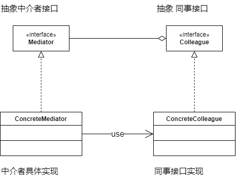

##### 接口类

**中介者：**

```cpp
class Mediator
{
public:
	virtual ~Mediator() {}
	virtual void regist(Collegue* collegue) = 0;
	virtual void sendMessage(string message, Collegue* collegue) = 0;
};
```


**同事接口：**

```cpp
class Collegue
{
public:
	Collegue()
		: m_pMediator(nullptr)
	{
	}

	virtual ~Collegue() 
	{
		m_pMediator = nullptr;
	}

	void setMediator(Mediator* mediator)
	{
		if (mediator != m_pMediator)
			m_pMediator = mediator;
	}

	virtual void sendMessage(string message) = 0;
	virtual void getMessage(string message) = 0;

protected:
	Mediator* m_pMediator;
};
```


##### 接口实现

**中介者实现：**

```cpp
class ERPMediator : public Mediator
{
public:
	virtual void regist(Collegue* collegue) override
	{
		m_oCollegues.push_back(collegue);
	}

	virtual void sendMessage(string message, Collegue* collegue) override
	{
		for each (auto var in m_oCollegues)
		{
			if (var != collegue)
			{
				var->getMessage(message);
			}
		}
	}

private:
	list<Collegue*> m_oCollegues;
};
```


**同事接口实现：**

```cpp
// 生产部员工
class ProductionColleague : public Collegue
{
public:
	ProductionColleague(string name)
		: Collegue()
	{

	}

	void sendMessage(string message) override
	{
		cout << "【生产部】" << name << " 发送消息：" << endl;
		cout << message << endl;
		m_pMediator->sendMessage(message, this);
	}

	void getMessage(string message) override
	{
		cout << "【生产部】" << name << " 收到消息：" << endl;
		cout << message << endl;
	}

private:
	string name;
};

// 人事部员工
class PersonnelColleague : public Collegue
{
public:
	PersonnelColleague(string name)
		: Collegue()
	{

	}

	void sendMessage(string message) override
	{
		cout << "【人事部】" << name << " 发送消息：" << endl;
		cout << message << endl;
		m_pMediator->sendMessage(message, this);
	}

	void getMessage(string message) override
	{
		cout << "【人事部】" << name << " 收到消息：" << endl;
		cout << message << endl;
	}

private:
	string name;
};
```


##### main函数

```cpp
int main(int argc, char* argv[])
{
	ERPMediator oERPMediator;

	PersonnelColleague oXiaoFang("小芳");
	oXiaoFang.setMediator(&oERPMediator);

	ProductionColleague oXiaoLi("小李");
	oXiaoLi.setMediator(&oERPMediator);

	oERPMediator.regist(&oXiaoLi);
	oERPMediator.regist(&oXiaoFang);

	oXiaoFang.sendMessage("中秋不放假了， 大家多加班！！！");

	oXiaoLi.sendMessage("生产个妹，罢工！！！");

	return 0;
}
```


**结果：**


#### 感悟

中介者模式是一个不太常用模式，主体思想是将网状关系，转变为星形关系。

将网状关系的复杂性，收容到一个类中；

这使得其他类变得简单，同时也有中介者类复杂化的代价。


#### 代码位置

https://github.com/su-dd/learning/tree/main/src/design_pattern/Meditor

### 观察者模式

上篇通过EAP（中介者），完成了各部门间的沟通混乱的问题。 有些部门的工作情况需要有别的部门的工作结果觉得。 事例： 公司希望做0库存挤压，这时需要生产部门可以随时响应销售情况。

#### 场景分析

这里的场景是 生产部门对 销售部门的随时响应，不不是销售部门有什么事就可以指派生产部门。

而是说明，在某一个生产部门需要的关注的点上要及时的通知生产部门，以便生产部门可以及时的做出调整。

这里的提示是针对销售的业务做的提示； 生产部门的响应也是基于生产的业务上做出调整。

#### 实现思路


##### 接口类

观察者接口：

```cpp
class AddObServer
{
public:
	~AddObServer() {}

	virtual void doAdd(int number) = 0;
};
```


观察者管理类接口：

```cpp
class Subject
{
public:
	Subject() {}
	~Subject() {}
	
	void addObServer(AddObServer* observer)
	{
		m_oAddObServer.push_back(observer);
	}

	void removeObServer(AddObServer* observer)
	{
		m_oAddObServer.remove(observer);
	}

protected:
	list<AddObServer*> m_oAddObServer;
};
```


##### 实现类

观察者接口实现：

```cpp
class MarketingDepartment : public Subject
{
public:
	MarketingDepartment()
		: Subject() {}

	~ MarketingDepartment() {}

	void sell(int number)
	{
		cout << "市场部买了 " << number << " 根冰棍！" << endl;
		for (auto var : m_oAddObServer)
		{
			var->doAdd(number);
		}
	}
};
```


观察者管理类接口实现：

```cpp
class ProductDepartment : public AddObServer
{
public:
	ProductDepartment()
		: AddObServer() {}

	~ProductDepartment() {}

	virtual void doAdd(int number) override
	{
		cout << "生产部门：准备生产 " << number << " 根冰棍。" << endl;
	}
};
```


##### main函数

```cpp
int main(int argc, char* argv[])
{
	MarketingDepartment oMarketingDepartment;
	ProductDepartment oProductDepartment;

	oMarketingDepartment.addObServer(&oProductDepartment);

	oMarketingDepartment.sell(2);
	return 0;
}
```


运行结果：


#### 感悟

观察者模式是一个常见的设计模式。

**优点：** 1、建立了触发机制，为了解决一些响应式的业务流。

2、调用者和被调用者进行了抽象解耦，调用者将不知情自己将调用什么。

当有业务需要用【每当...... 就.....】 描述时，可以考虑使用观察者模式。

如果不希望调用者被阻塞，可以才有异步模式执行触发器。

**局限：** 1、需要避免循环调用 观察者模式也是一个需要谨慎使用的模式，由于观察者模式的响应式触发；导致难以在代码中追查到完整的业务流。

试想如果一个业务完全有触发器堆砌的程序，整个程序的业务就处于：A触发B，B触发C，C触发...的链式触发中。 当多个业务链有交叉时，如何让复杂业务不做循环调用这种简单要求也会变成世纪难题。

2、一个事件上挂的触发器太多，可能导致原来代码的效率下降。

3、观察者无法知道需要观察对象的状态，需要提供额外的能力实现。


#### 代码位置

https://github.com/su-dd/learning/tree/main/src/design_pattern/Observer


### 状态模式

春去秋来，岁月如梭，又过了几天；随着市场变化，啃得鸡公司准备研发一款跨时代的产品：盒装冰淇淋。并且决定随着时间变化不断推出新的产品，已持续维持市场竞争力。

鉴于之前的自动化流水线已经产能过剩，希望可以利用过剩产能；以减少投入。

#### 场景分析

这里做一个思考：冰淇淋流水线在做冰棍或是盒装冰淇淋时，只需要在需要在组装打包环节使用不同的方式。

这时我们可以建不同的两个打包组装模块： 冰棍打包模块、盒装冰淇淋打包模块

这两个模块都对流水线中的半成品进行打包组装，并传递给下一个模块。

流水线可以通过动态的切换不同的模块完成不同的生产任务，而不用停止整个生产线，已做生产状态调整。

#### 实现思路


##### 接口

```cpp
class State
{
public:
	virtual ~State() {}

	virtual void doPackage() = 0;
};
```


##### 上下文

```cpp
class ProductContext
{
public:
	ProductContext()
		: m_pState(nullptr)
	{
	}

	~ProductContext()
	{
		m_pState = nullptr;
	}

	void setState(State* state)
	{
		if (m_pState != state)
			m_pState = state;
	}

	void doProduct()
	{
		if (nullptr == m_pState)
		{
			cout << "请设置生成状态!" << endl;
			return;
		}
		cout << "温度维持系统启动：" << endl;
		cout << "原料进入...." << endl;
		m_pState->doPackage();
	}
private:
	State* m_pState;
};
```


##### 接口实现

```cpp
class IceCreamState : public State
{
public:
	IceCreamState()
		: State()
	{}

	virtual ~IceCreamState() {}

	virtual void doPackage() override
	{
		cout << "包装为 普通冰淇淋！" << endl;
	}
};
```


```cpp
class BoxIceCreamState : public State
{
public:
	BoxIceCreamState()
		: State()
	{}

	virtual ~BoxIceCreamState() {}

	virtual void doPackage() override
	{
		cout << "包装为 普通冰淇淋！" << endl;
	}
};
```


##### main函数

```cpp
int main(int argc, char* argv[])
{
	ProductContext oProductContext;
	oProductContext.doProduct();

	BoxIceCreamState oBoxIceCreamState;
	oProductContext.setState(&oBoxIceCreamState);
	oProductContext.doProduct();

	IceCreamState oIceCreamState;
	oProductContext.setState(&oIceCreamState);
	oProductContext.doProduct();

	return 0;
}
```


运行结果：


#### 感悟

状态模式是解决：当对象的行为随着对象的属性变化而变化的情况，采用的方式是将不同的行为进行封装。

什么时候需要状态模式： 当面类中代码中存在大量if判断，并且if判断的业务条件相同。

**优点：** 1、将于特定的条件相关的代码集中到一个类里面，有力的减少了if判断；且利用对一个业务统一修改。

2、无需修改上下文即可引入新的状态。

**缺点：**

1、状态模式需要上下文环境类有良好的设计，对设计要求较高。


#### 代码位置

https://github.com/su-dd/learning/tree/main/src/design_pattern/State

### 建造者模式

随着盒装冰淇淋越来越好卖，啃得鸡的信心越来越高。老板要得做一个大号的盒装冰淇淋 --> 冰淇淋蛋糕。

领导一句话，生产部门跑断腿。

分析发现：

> 冰淇淋蛋糕的组成有
>
> 必选项：蛋糕坯层、冰淇淋层
>
> 可选项：水果装饰、巧克力碎装饰、冰淇淋裱花装饰

产品部准备生产的产品有：【草莓 冰淇淋裱花蛋糕】、【抹茶 巧克力碎蛋糕】

原本的冰淇淋生产线完全不能适应，需要新的生产线。

老板觉得啃得鸡商标的溢价肯定能赚的盆满钵满；于是不经同意，还不计投入。


#### 场景分析

这里不同于之前的冰棍模式在于，这里的产品的工艺是繁琐的。

这里代码重点要维护的复杂度，是产品的生产过程；而产品的结果都是冰淇淋蛋糕这个单一概念。


#### 标准实现


##### 需要生产的产品

```cpp
class IceCreamCake
{
public:
	IceCreamCake(string cakeBillet, string IceCream)
		: m_cakeBillet(cakeBillet), m_IceCream(IceCream)
		, m_fruit(""), m_chocolate(""), m_decoration("")
	{
	}
	~IceCreamCake() {}

	void taste()
	{
		if (m_fruit != "")
			cout << m_fruit << "的 ";
		if (m_chocolate != "")
			cout << m_chocolate << "的 ";
		if (m_decoration != "")
			cout << m_decoration << "的 ";
		cout << m_cakeBillet << "的 " << m_IceCream << "的 " << "蛋糕";
	}

	void setFruit(string fruit)
	{
		m_fruit = fruit;
	}

	void setChocolate(string chocolate)
	{
		m_chocolate = chocolate;
	}

	void setDecoration(string decoration)
	{
		m_decoration = decoration;
	}

private:
	string m_cakeBillet;// 必选项： 蛋糕坯层
	string m_IceCream;	// 必选项： 冰淇淋层
	string m_fruit;		// 可选项：水果装饰
	string m_chocolate;	// 可选项：巧克力碎装饰
	string m_decoration;// 可选项：冰淇淋裱花装饰
};
```


##### 接口类

```cpp
class Builder
{
public:
	Builder(string cakeBillet, string IceCream)
		: m_pIceCreamCake(new IceCreamCake(cakeBillet, IceCream))
	{
	}

	virtual ~Builder() 
	{
		delete m_pIceCreamCake;
		m_pIceCreamCake = nullptr;
	}

	IceCreamCake* getProduct()
	{
		return m_pIceCreamCake;
	}

	virtual void setFruit() {}
	virtual void setChocolate() {}
	virtual void setDecoration() {}
	
protected:
	IceCreamCake* m_pIceCreamCake;
};
```


##### 实现类

```cpp
class ChocolateCakeBuilder : public Builder
{
public:
	ChocolateCakeBuilder(string cakeBillet, string IceCream)
		: Builder(cakeBillet, IceCream)
	{
	}

	virtual ~ChocolateCakeBuilder()
	{
	}

	virtual void setChocolate()override
	{
		m_pIceCreamCake->setChocolate("巧克力");
	}
};
```


##### 指挥者

```cpp
class Director
{
public:
	Director(Builder *builder)
		: m_pBuilder(builder)
	{
	}

	void makeCake()
	{
		m_pBuilder->setFruit();
		m_pBuilder->setChocolate();
		m_pBuilder->setDecoration();
	}

private:
	Builder* m_pBuilder;
};
```

##### main函数

```cpp
int main(int argc, char *argv[])
{
    ChocolateCakeBuilder oBuilder("可可蛋糕坯", "奶油冰淇淋");
    Director oDirector(&oBuilder);
    oDirector.makeCake();
    IceCreamCake *pCake = oBuilder.getProduct();
    pCake->taste();
    return 0;
}
```


**运行结果：**


#### 感悟

**作用：** 建造者是为了将对应的构造和对象的使用分离；

主要应对复杂的创建场景，如 参数不固定，参数见相互影响 等。

**条件定义：** 一般当一个类的构成超过4个参数，且部分参数可有可无时，就认为这个类的构造已经足够复杂；可以考虑使用建造者模式，来代替多个构造函数的定义。

**问题：** 有时，我们只有一个类的构造十分复杂；使用建造者模式就导致类膨胀的厉害。

这时我们可以考虑使用 **局部类**，来实现 简化的建造者模式。

##### 简化建造者实现类

```cpp
class IceCreamCake
{
public:
	class Builder
	{
	public:
		Builder(string cakeBillet, string IceCream)
			: m_cakeBillet(cakeBillet), m_IceCream(IceCream) , m_fruit(""), m_chocolate(""), m_decoration("")
		{}
		~Builder() {}

		Builder& setFruit(string fruit)
		{
			this->m_fruit = fruit;
			return *this;
		}

		Builder& setChocolate(string chocolate)
		{
			this->m_chocolate = chocolate;
			return *this;
		}

		Builder& setDecoration(string decoration)
		{
			this->m_decoration = decoration;
			return *this;
		}

		IceCreamCake* builer()
		{
			return new IceCreamCake(this);
		}

	private:
		string m_cakeBillet;// 必选项： 蛋糕坯层
		string m_IceCream;	// 必选项： 冰淇淋层
		string m_fruit;		// 可选项：水果装饰
		string m_chocolate;	// 可选项：巧克力碎装饰
		string m_decoration;// 可选项：冰淇淋裱花装饰
		friend class IceCreamCake;
	};
public:
	~IceCreamCake() {}

	void taste()
	{
		if (m_fruit != "")
			cout << m_fruit << "的 ";
		if (m_chocolate != "")
			cout << m_chocolate << "的 ";
		if (m_decoration != "")
			cout << m_decoration << "的 ";
		cout << m_cakeBillet << "的 " << m_IceCream << "的 " << "蛋糕";
	}
private:
	IceCreamCake(Builder* builder)
		: m_cakeBillet(""), m_IceCream(""), m_fruit(""), m_chocolate(""), m_decoration("")
	{
		this->m_cakeBillet = builder->m_cakeBillet;
		this->m_IceCream = builder->m_IceCream;
		this->m_fruit = builder->m_fruit;
		this->m_chocolate = builder->m_chocolate;
		this->m_decoration = builder->m_decoration;
	}

private:
	string m_cakeBillet;// 必选项： 蛋糕坯层
	string m_IceCream;	// 必选项： 冰淇淋层
	string m_fruit;		// 可选项：水果装饰
	string m_chocolate;	// 可选项：巧克力碎装饰
	string m_decoration;// 可选项：冰淇淋裱花装饰
};
```


##### 简化建造者main函数

```cpp
int main(int argc, char *argv[])
{
    IceCreamCake* pIceCreamCake = IceCreamCake::Builder("可可蛋糕坯", "奶油冰淇淋")
        .setChocolate("巧克力")
        .builer();
    pIceCreamCake->taste();
    return 0;
}
```


**运行结果：**


这里我们简化了，指挥者 和 接口类； 同时使用 局部类的方式，将建筑者类至于产品类内部。这样有效的减少了类的膨胀。


#### 代码位置

https://github.com/su-dd/learning/tree/main/src/design_pattern/Builder


### 设计模式整体回顾

终于写完了经典的23中设计模式，往事不堪回首。
这篇对这23中做一个总结，以便在后续需要时方便识别哪种是需要的设计模式。

#### 创建型

描述对象如何创建，是为了将对象的创建与使用分离。

包括6种：单例、原型、简单工厂、工厂方法、抽象工厂、建造者。

##### 简单工厂

简单的将对象的创建与使用分离 **特点：**

1. 产品是有限的、已知的。
2. 工厂类可以直用静态方法，所以可隐藏构造函数（构造函数私有化）
3. 创建方法理论上只依赖产品列表，所以可以创建各种实例，不限于只一类。（这是一个危险的实现）

**问题:**

1. 添加新产品需要修改已经完成的工厂方法。
2. 客户需要知道产品列表和功能直接的关系，增加复杂度。

##### 工厂

**特点/优点：**

1、工厂类可以不实例化，使用静态工厂类。

2、延时创建，使用类再不确定是否要创建产品时，可以通过拿着产品的工厂方法。再需要时再创建。 实现延时创建。

**问题：**

1、随着产品的增加，工厂也不断的增加，可能造成对象的爆发。

2、客户需要关注每个工厂的不同才能获得想要的产品，可能增加维护成本。

##### 抽象工厂

抽象工厂其实并不是一个复杂概念，其实抽象工厂就是工厂模式的一般现象，工厂模式就是抽象工厂的个例。

**特点/优点：**

抽象工厂想要新增一个套餐是简单的，但是想要在套餐中新增一个项就比较不友好。

**问题：**

抽象工厂适用于整套的替换场景中。

##### 建造者

**优点：** 建造者是为了将对应的构造和对象的使用分离；

主要应对复杂的创建场景，如 参数不固定，参数见相互影响 等。

**条件定义：** 一般当一个类的构成超过4个参数，且部分参数可有可无时，就认为这个类的构造已经足够复杂；可以考虑使用建造者模式，来代替多个构造函数的定义。

**问题：** 有时，我们只有一个类的构造十分复杂；使用建造者模式就导致类膨胀的厉害。

这时我们可以考虑使用 **局部类**，来实现 简化的建造者模式。

##### 单列模式

| 种类     | 实现                                | 优点                                                    | 缺点                                                         |
| -------- | ----------------------------------- | ------------------------------------------------------- | ------------------------------------------------------------ |
| 饿汉单例 | 1、使用静态区对象，确保只有一份实例 | 1、多线程，单线程可以用统一的方式处理 2、无加锁，效率高 | 1、程序运行时需要加载暂时无用的内存，可能影响效率 2、静态对象的初始化由系统决定，如果初始化依赖静态对象，可能导致异常。 |
| 懒汉单例 | 1、通过判空的方法，确保只有一份实例 | 1、程序运行时不用加载多余的数据                         | 1、第一次加载可能不够快 2、代码相对复杂                      |

##### 原型模式

原型模式的本质是通过深copy的方式生成对象，不用受构造函数的约束（可不用引入具体头文件）。

优点 / 使用场景：

1. 性能优化的场景中，当一共从头建造是需要消耗大量资源（如需要大量的IO操作，权限申请等）
2. 安全要求场景中，不向外暴露头文件，再一写情况下比较安全。

组合使用方式：

- 可以和工厂模式结合使用，作为工厂模式创建

缺点：

- 对于类中含有容器对象【如组合模式】不够友好
- 对类中对象由外部传递时，不够友好

#### 结构型

描述类或对象如何组织成更大结构 包括7种：代理、适配器、桥接、装饰、外观、享元、组合。

##### 装饰

**使用场景：**

不想增加子类（或者需要增加子类的数量比较多）时，想扩展类能力。

**优点：**

装饰类和被装饰类可以独立发展，而不会相互耦合。

有效的分割核心职责和非核心职责

可动态地扩展一个实现类的功能（【套娃】使用），减少了类的数量

**注意点：**

装饰模式一般是构造函数中传入被装饰的对象。

装饰模式是的目的是为了给现有对象增强能力，但是不管怎么增强，不会改变对象的本质。（这点很重要，后面会在代理中做比较）

**缺点：**

多层包装的装饰类，出BUG，要一层一层查。如：游戏角色的装扮，如果一共20层装饰者，工作量大。

##### 代理

代理模式是一个自由度特别高的模式，也是一个不容易被辨识的模式。 **场景：**

客户和要使用的对象之间的复杂性，当我们规划了两个实体A和B后，发现：

1、A和B之间的调用关系复杂；

2、调用在业务上不属于A或者B的。

我们就需要代理来处理这部分的复杂性，代理通过添加中间层的方式在A和B之间添加了一层新的扩展封装。

spring aop 是现在比较有名的代理模式实现。

##### 桥接

**优点：**

1、从两个维度拆分多重基础类，极大的减少了类个数。

2、两个维度可以独立变化，而不影响另一个维度。

**缺点：**

1、外在使用时会更复杂。

对比代理，装饰者，我们发现这三这外在使用时，有类似的使用方式。

**这样对注重点做对比：**

代理：增加不属于原对象的功能。

装饰者：对原有功能的增强，增强后还是原有功能。

桥模式：拆分两个维度，以简化原实现。

##### 外观

外观模式通过提供统一的面板，隐藏了子系统、子模块的具体实现。系统的**封装性和易用性得到提升**，可以阻止新人对不熟悉模块的错误使用。

同时增加新的接口也需要修改面板，相对而言面板本身容易被影响，**扩展性下降**。

##### 享元

享元模式的目的是通过减少对象的创建，来达到减少内存，提供效率的目的；

它设计的重点在于HashMap是使用，我们需要为HashMap找到一个唯一的特征值。

HashMap一般放在享元工厂中管理。

**优点：** 提高对象复用率，提高效率

适用场景：

1. 大量相似或相同对象。
2. 这些对象占用大量内存，或影响效率。
3. 不同对象对外部执行无影响

使用时需要区分 **内蕴状态** 和 **外蕴状态**

> 内蕴状态(Internal State)：存储在享元对象内部且不会随环境改变而改变。因此内蕴状态并可以共享。 外蕴状态(External State)：是随环境改变而改变的、不可以共享的状态。

##### 组合

组合模式又叫 “部分整体模式”，这个名字可以更好的表达这个模式想要解决的问题。

及：事物的 部分和整体具有高度相似性。

在组合模式中，每个节点的类定义中，都可以继续包含一组和自己相同的对象；

叶子节点的定义不是必须，但叶子节点一般是必然存在的（数据是有限的）。

##### 适配器

1、从上述的可知适配器的本质是为了去处理由于某种原因，不能被修改代码的部分。如果我们可以修改目标代码，不建议使用适配器。

2、上述场景为单向调用场景；在实际的场景中还有很多是两个模块相互使用。同时，他们又是不可以被改动的情况。这时我们需要使用双向适配器。这时主要使用**类适配器**。

#### 行为型

描述类或对象之间如何协作完成任务

包括11种：模板方法、策略、命令、职责链、状态、观察者、中介者、迭代器、访问者、备忘录、解释器。

##### 模板方法

如果行为的模板是相同的，可以用父类封装行为的框架；子类扩展可变的部分。

**优点：** 1、更好的代码复用性；2、父类封装控制，子类实现细节；实现更可控

**缺点：** 1、类的增加，导致实现更复杂

##### 策略

策略模式的本质是对算法的封装，使算法的使用者和算法本身可以自由变化。

**优点：** 1、扩展性好；2、可以自由切换策略，对象复用性高

**缺点：** 所有算法都需要暴露给客户段，维护成本变高

可以考虑结合简单工厂，对策略本身也进行一层封装；减少暴露。

##### 命令

命令模式主要实现了调用者和接受者之间的解构。

**场景1：** 1、调用者在一些不知道接受者的情况，或不能操作调用者的情况。

eg: 界面上有多个按钮控件，分别实现不同的业务功能。

一般界面控制使用一些公共组件；界面控件不知道具体业务使用类，且我们不能操作界面控件的内部实现。

**场景2：** 1、调用者和接受者执行的生命周期不同；接受者执行时，调用者已经被释放。

eg: 数据库系统的撤销、恢复、更新。

数据库根据命令进行撤销、恢复、更新；数据库系统的需要根据自身情况完成数据维护。如果调用者一直等等数据库的返回，可能导致阻塞。同时调用者也不可能提供 撤销、恢复 需要的状态，命令+备忘录可以很好的满足这里的需求。

**同策略模式的区别：**

简单类别：

命令模式是处理将不同的事情用同一种方式去统一调用，策略模式是处理同一件事情的不同处理方式。

命令模式：命令实例中自己拿着接收者实例。所以命令可操作的对象其实不拘束为一个对象，甚至可以不局限为同一类对象。

策略模式：策略实例无接受者实例，是对一件事的不同做法。

##### 职责链

职责链模式 是为了 分离 **发送方** 和 **接收方**； 所以需要在设计时，也尽可能减少耦合。

**纯的职责链模式**：一个请求必须被某一个处理者对象所接收，且一个具体处理者对某个请求的处理只能采用以下两种行为之一：自己处理（承担责任）；把责任推给下家处理。

但是小明的问题里还有一个是: 雪糕有点化了,这里用**纯的职责链模式**就不能胜任。及需要：

**不纯的职责链模式**：允许出现某一个具体处理者对象在承担了请求的一部分责任后又将剩余的责任传给下家的情况，且一个请求可以最终不被任何接收端对象所接收。

##### 状态

状态模式是解决：当对象的行为随着对象的属性变化而变化的情况，采用的方式是将不同的行为进行封装。

什么时候需要状态模式： 当面类中代码中存在大量if判断，并且if判断的业务条件相同。

**优点：** 1、将于特定的条件相关的代码集中到一个类里面，有力的减少了if判断；且利用对一个业务统一修改。

2、无需修改上下文即可引入新的状态。

**缺点：**

1、状态模式需要上下文环境类有良好的设计，对设计要求较高。

##### 观察者

**优点：** 1、建立了触发机制，为了解决一些响应式的业务流。

2、调用者和被调用者进行了抽象解耦，调用者将不知情自己将调用什么。

当有业务需要用【每当...... 就.....】 描述时，可以考虑使用观察者模式。

如果不希望调用者被阻塞，可以才有异步模式执行触发器。

**局限：** 1、需要避免循环调用 观察者模式也是一个需要谨慎使用的模式，由于观察者模式的响应式触发；导致难以在代码中追查到完整的业务流。

试想如果一个业务完全有触发器堆砌的程序，整个程序的业务就处于：A触发B，B触发C，C触发...的链式触发中。 当多个业务链有交叉时，如何让复杂业务不做循环调用这种简单要求也会变成世纪难题。

2、一个事件上挂的触发器太多，可能导致原来代码的效率下降。

3、观察者无法知道需要观察对象的状态，需要提供额外的能力实现。

##### 中介者

中介者模式是一个不太常用模式，主体思想是将网状关系，转变为星形关系。

将网状关系的复杂性，收容到一个类中；

这使得其他类变得简单，同时也有中介者类复杂化的代价。

##### 迭代器

迭代器模式又叫游标模式是一种常见模式，行为型设计模式的一种。几乎每种语言，会实现自己的迭代器。

在代码编程中，常常需要聚合对象来存放一组数据；

迭代器可以依次访问聚合对象内部的各个元素，同时又不暴露聚合对象的内部表示；

一般做业务开发时，并不需要实现迭代器模式；如果需要做公共组件，基础组件时，封装迭代器可能会被使用。

##### 访问者

访问者模式有利于支持资源结构稳定，使用方式变化的场景；如资源为内部结构，不可直接操作；这时需要添加方法；

**优点：** 增加一个功能的实现类，影响很小。

**缺点：** 增加一个资源的实现类，影响较大。

##### 备忘录

备忘录是为系统的运行提供了后悔药；让系统可以在需要的时机，可以回到希望的状态。

常见的应用场景：撤销恢复，游戏存档，数据库事务等。

当一个对象的所有信息都需要进入备忘录，我们可以思考使用 ： 原型模式 + 备忘录模式

通过原型模式的自copy，我们不会丢失任何数据；并可以将 备忘录中 的**备忘录使用者**和**备忘录**统一。

##### 解释器

解决发生频率很高，但规则可明细的场景。

**优点：**

良好的扩展性，可以不断定义新的表达式来实现新的业务。

**缺点：**

容易引起类膨胀，需要较强的类管理能力。


## DDD领域设计

### 初识DDD

#### DDD来源介绍

​领域建模和设计的重要性在很早之前就被一些软件开发人员所发现 ，Eric Evans将其定义为领域驱动设计（Domain-Driven Design，简称DDD）；近些年来这种自顶而下的设计方式越发被推崇。

本文以代码为引，从小处入手；同大家一起学习DDD。

#### DDD架构的核心

**提倡以业务为核心，解耦外部依赖，分离业务复杂度和技术复杂度。**

#### DDD适用场景

DDD虽好，但不要贪杯。在实践DDD时，有两个点需要明确。

1、**领域模型对设计能力要求很高，没把握用好，一个错误的抽象还不如不抽象，宁可不要用，也不要滥用，不要为了DDD而DDD。**

理解：DDD的学习和使用是有代价的，一个零DDD基础的团队，不要期望在一个项目中完美的使用DDD；应该是一步一步的引入DDD的思想。

2、**只有复杂的系统才需要系统DDD。**

理解：DDD是为了治理业务而生的。

这里的复杂分为三个层次：

1. 业务间有复杂的联动关系。
   
2. 系统需要持续维护，业务不断演化
   
3. 需要隔离技术复杂度的场景。

ddd的便捷，是基于业务抽象被不断复用的。如果业务抽象没有复用的必要，也没有系统引入ddd的必要。

只需要使用一次的工具，不需要系统引入ddd。
#### 阅读前提

了解面向对象

#### DDD基础概念概览

<iframe src="https://www.processon.com/view/link/629309f41efad45e083c557d" width="100%" height="800" frameborder="0" scrolling="No" leftmargin="0" topmargin="0"></iframe>


### 统一语言

领域模型的战略部分：

概念: 统一语言、子域划分、限界上下文

方法：原文分析、四色模型、事件风暴

#### 生长出来的概念

1948年6月21日上午11点，在曼彻斯特大学，存储程序的计算机第一次在电子内存中存储了一段软件并成功执行了该软件。

软件的复杂度已经超出很多人的想想。WinXP,Win7代码月4千万行，win11代码已经为5千万行。

为了可以更好的治理代码，我们管理的代码的思想也在不断变化。

从【字节码】--> 【汇编】-->【面向过程】-->【面向对象】

**领域模型**本质上是**面向对象**方法的更为深入的使用。

这里先回顾什么是面向对象：

面向对象的基本逻辑就是将现实事务映射到代码中，在此基础上提出了封装、继承、多态。符合面向对象的代码会以更亲近软件开发者思考认知的方式运行，以更接近人类认知事物的方式进行生长。

随着软件行业的不断细分，软件需求一般不是开发者自行发现；而是由客户，产品经理等角色去提出。

领域模型解决的是让软件以更符合业务需求的方式去产生。

#### 统一语言（UBIQUITOUS LANGUAGE）

统一语言是领域模型的第一步，也是会一直贯彻在整个过程中。

由于语言上存在鸿沟，领域专家们只能模糊地描述他们想要的东西，开发人员虽然努力去理解一个自己不熟悉的领域但也只能形成模糊的认识，结果就是各说各的话，或者都是一知半解，最后到上线前才会发现漏了这个漏了那个。

统一语言是指统一 产品、开发、测试等参与者，对业务认知统一。它是指通过浓缩后的领域语言。可表现为图，可以使用UML等方式；


### 贫血模型和充血模型

在领域模型的概念里，两种定义方式。

方式1 ： **失血模型**、**贫血模型**、**充血模型**、**涨血模型** 四种概念。

方式2：**贫血模型**、**充血模型** 两个概念。

这里以 方式2做阐述。 这里认为：过多的概念并不能支持好的代码的产出，从简单的概念里阐述好的行为和不好的行为即可。

#### 贫血模型vs充血模型

**贫血模型**：也称贫血领域对象，指仅用作数据载体，而没有行为和动作的领域对象。

**充血模型**：也称充血领域对象，同时定义数据和行为的领域对象。

个人理解：

贫血模型：提供基本的数据支持，不包含实际业务逻辑。

充血模型：提供数据支持，同时提供具体业务逻辑支持。

#### 举例说明

如：计算学生的BMI。

**贫血模型：**

```java
class Student {
    Long id;
    double height;
    double weight;

    public double getHeight() {...}
	public double getWeight() {...}
};

class ClassService {
    public double getBMIByStudentId(long id) {...}
};
```

**充血模型：**

```java
class Student {
    Long id;
    double height;
    double weight;

    public double getHeight() {...}
	public double getWeight() {...}
    public double getBMI() {...}
}
```

对比两者代码，容易发现：

1. 贫血模型的业务，放在Service中。
2. 充血模型的业务，放在DP中。

从业务重用上看：

充血模型，业务重用的最小个体是DP。

贫血模型，业务重用的最小个体为Service。如果Service包含其他业务就会导致不必要的依赖。

#### 面向对象的角度

从OO的角度去审视贫血模型和充血模型，会发现：

贫血模型的本质是在一堆数据上建立一个一个业务流程，是一个面向过程的实现方式。

充血模型既有数据也有对应的行为，这是面向对象的。

#### 如何选择

我们知道充血模型即要抽象属性，也要抽象行为；会比贫血模型更难设计。所以在选用时也有相应的偏好，或者有结合使用的情况。

 如果业务只是简单的CRUD，或者CRUD可以解决90%的业务情况。推荐使用贫血模型。其实大量的项目都是这样的简单项目。

但是如果在做复杂的项目，拥有复杂的业务时，我们就需要使用充血模型；

**DDD是基于好的抽象，宁愿不抽象，也不要固执的做出不合理的抽象。**

### 值对象、DP


这篇详细介绍 值对象、DP 的含义，以及如何使用DP优化现有代码。

#### 值对象
首先了解第一个概念：值对象

《实现领域驱动设计》定义：

> 描述了领域中的一件东西
> 
> 不可变的
> 
> 将不同的相关属性组合成了一个概念整体
> 
> 当度量和描述改变时，可以用另外一个值对象予以替换
> 
> 可以和其他值对象进行相等性比较
> 
> 不会对协作对象造成副作用

简单来说：以对象的形式，在DDD中起到值的作用。

这里做一个类比的理解, 如果将一个复杂系统比做一个简单的程序。
```cpp
#include <iostream>
using namespace std;
int main()
{
    ***

    int a = 3;
    int b = 4;
    cout << a+b << endl;

    ***
    return 0;
}
```
上述代码中的int类型的a、b，就可以近似的理解为值对象。

#### DP（Domain Primitive）

DP是在特定领域、拥有精准定义、可以自我验证、拥有行为的值对象（ValueObject）。 它是领域的最小组成部分。

DP三原则：
 - 让隐性的概念显性化
 - 让隐性的上下文显性化
 - 封装多对象行为

DP比较抽象，下面以实例的方式具体的介绍DP。
#### 实例要求
一个简单的注册业务要求：

> 1、参数为 客户姓名、手机号、地区；需要 校验姓名、手机号、地区信息的有效性。
> 
> 2、根据手机号的归属地和所属运营商，查询得到关联的销售组信息，该销售组ID将作为用户的一个属性。
> 
> 3、据用户信息，构建用户对象；并存入数据库；

#### 常见代码
```java
public class User {
    String name;
    String phone;
    String address;
    Long repId;
}

public class UserServiceImpl implements UserService {

    public User register(String name, String phone, String address) 
      throws ValidationException {
        // 校验逻辑
        if (name == null || name.length() == 0) {
            throw new ValidationException("name");
        }
        if (phone == null || !isValidPhoneNumber(phone)) {
            throw new ValidationException("phone");
        }
        // 此处省略address的校验逻辑

        // 取电话号里的区号，然后通过区号找到区域内的SalesRep
        String areaCode = null;
        String[] areas = new String[]{"0571", "021", "010"};
        for (int i = 0; i < phone.length(); i++) {
            String prefix = phone.substring(0, i);
            if (Arrays.asList(areas).contains(prefix)) {
                areaCode = prefix;
                break;
            }
        }
        //找到销售负责人（SalesRep）
        SalesRep rep = salesRepRepo.findRep(areaCode);

        // 最后创建用户，落盘，然后返回
        User user = new User();
        user.name = name;
        user.phone = phone;
        user.address = address;
        if (null != rep) {
          user.repId = rep.id;
        }

        return userRepo.save(user);
    }

    private boolean isValidPhoneNumber(String phone) {
        String pattern = "^0[1-9]{2,3}-?\\d{8}$";
        return phone.matches(pattern);
    }
}
```
找找问题？

#### 认知问题
##### 1、接口调用错误不能在前期识别

具体来说调用函数：
```java
public User register(String name, String phone, String address) 
```
传参的错误,我们无法在编译前期知道,只能在业务运行到这来时，通过调试发现。

常见错误有：
- 参数顺序搞错


##### 2、大量的数据校验逻辑，导致的不稳定性
```java
// 校验逻辑
if (name == null || name.length() == 0) {
    throw new ValidationException("name");
}
if (phone == null || !isValidPhoneNumber(phone)) {
    throw new ValidationException("phone");
}
// 此处省略address的校验逻辑
```
代码这里已经有三个逻辑判断，这里存在如下问题：
1. 代码的位置不合适，当业务判断发生变化时，需要【修改】、【测试】注册逻辑。
2. 代码复用不方便。例：号码可能被多个阶段使用，这里需要多份代码。
3. 多个判断，测试用例条件翻倍。
4. 业务异常和校验异常不能被合理区分。

##### 3、胶水代码的存在，导致业务代码不清晰
> 从一些入参里抽取一部分数据，然后调用一个外部依赖获取更多的数据，然后从新的数据中再抽取部分数据用作其他的作用


```java
// 取电话号里的区号，然后通过区号找到区域内的SalesRep
String areaCode = null;
String[] areas = new String[]{"0571", "021", "010"};
for (int i = 0; i < phone.length(); i++) {
    String prefix = phone.substring(0, i);
    if (Arrays.asList(areas).contains(prefix)) {
        areaCode = prefix;
        break;
    }
}
```
这段代码，就是一段截取区号的代码。本质上不应是独属于属于注册用户业务。对于这样的代码就需要被封装起来。

```java
//从号码中获取区号
private static String findAreaCode(String phone) {
    for (int i = 0; i < phone.length(); i++) {
        String prefix = phone.substring(0, i);
        if (isAreaCode(prefix)) {
            return prefix;
        }
    }
    return null;
}
//判断该区号是否存在
private static boolean isAreaCode(String prefix) {
    String[] areas = new String[]{"0571", "021"};
    return Arrays.asList(areas).contains(prefix);
}
```
原代码的调用：
```java
//获取区号
String areaCode = findAreaCode(phone);
//找到区号负责人
SalesRep rep = salesRepRepo.findRep(areaCode);
```
但即便这样，胶水痕迹依然存在；获取区号的能力，不应属于注册用户的service。

#### 代码优化实例
这里我们使用DP的思想来，优化源代码。

##### 让隐性的概念显性化
首先是【让隐性的概念显性化】；从代码上看，不难发现这段代码隐藏三个概念：name，phone，address
```java
public User register(String name, String phone, String address) 
```
以phone举例，对phone进行概念显性化。就是对phone进行封装。

接口改为:
```java
public User register(Name name, PhoneNum phone, Address address) 

// 调用：
register(new Name("小张"), new PhoneNum("123**1"), new Address("上海市 黄浦区 南京路 110号")) 
```

解决了第一个问题【**接口调用错误不能在前期识别**】，
同时可以在构造函数中添加有效性判断，以简化和解决第二个问题【**大量的数据校验逻辑**】
区号为电话号码的属性，应该封装到【PhoneNumber】中，这时就解决了第三个问题【**业务代码不清晰**】


原代码的调用：
```java
//找到区号负责人
SalesRep rep = salesRepRepo.findRep(phone.getAreaCode());
```

##### 让隐性的上下文显性化

> 什么是：上下文？
> 限界上下文是一个边界，领域模型便存在在这个边界之内。当模型被一个显示的边界所包围时，其中每个概念的含义便是确定的了。因此，限界上下文主要是一个语义上的边界。

这句话表示的比较抽象，给一个简单的解释：前提，基础。

举个例子：比较下两个地址
```java
new Address("上海市 黄浦区 南京路 110号");
new Address("南京路 110号");
```
地址一，我们很容易找到； 地址二，如果对于上海容易找到，但对于全国就难以确定了。 

这里 【上海市，黄浦区】就是 【南京路 110号】 的前提。

同理，如果存在两个上海市，那么我们就需要【中国】这样的前提。

因此我们需要将这些上下文显现的定义下来：
```java
public class Address {
  private final String country;
  private final String province;
  private final String city;
  ...
}
```

##### 封装多对象行为
这里指，一个DP可以封装多个DP的行为；及鼓励DP的重用。
希望Address和PhoneNumber，可以被重用；以减少重复代码。

如Address和PhoneNumber，现在用于注册。如果这是一个电商系统，也可以用于商品的寄送。

#### 最终代码比较

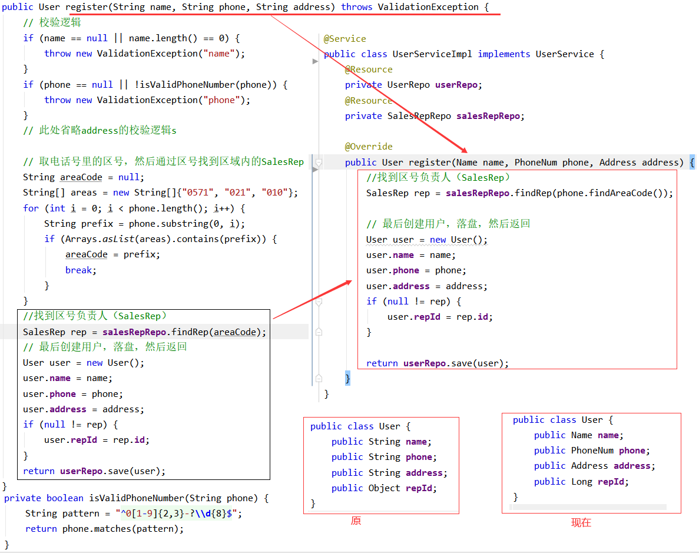

#### git代码

https://github.com/su-dd/learning/tree/main/src/spring/ddd/05Demo

实例参考：https://blog.csdn.net/weixin_42596778/article/details/118938934


### 实体、领域服务、应用服务

这一节，主要通过实例的方式；解读：实体、领域服务、应用服务。

#### 实例要求
> 1、参数为 客户姓名、手机号；需要 校验姓名、手机号、地区信息的有效性；**并且需要做实名认证。**
> 
> 2、**根据得到的实名信息，按照一定逻辑计算得出该用户的标签，该标签将作为用户的一个属性**
> 
> 3、根据手机号的归属地和所属运营商，查询得到关联的销售组信息，该销售组ID将作为用户的一个属性。
> 
> 4、**根据用户信息，构建用户对象和福利对象，并查询风控是否通过。**
> 
> 5、若通过，用户失去新客身份，且可以查询到福利信息，数据落库。
若不通过，用户保持新客身份，但查询不到福利信息，数据落库。


#### 常见代码
```java
public class UserServiceImpl implements UserService {
    @Resource
    private UserMapper userMapper;
    @Resource
    private SalesMapper salesMapper;
    @Resource
    private RewardMapper rewardMapper;
    @Autowired
    private TelecomRealnameService telecomRealnameService;
    @Autowired
    private RiskControlService riskControlService;
    @Override
    public UserDO register(Name name, PhoneNumber phone) throws ValidationException {
        //参数合法性校验已在PhoneNumber中处理
        //参数一致性校验
        TelecomInfoDTO telecomInfoDTO = telecomRealnameService.getRealnameInfo(phone.getPhone());
        if (!name.getName().equals(telecomInfoDTO.getName())) {
            throw new ValidationException("phone : " + phone.getPhone());
        }
        //计算用户标签
        String label = getLabel(telecomInfoDTO);
        //计算销售组
        String salesId = getSalesId(phone);
        //返回身份证
        String idCard = telecomInfoDTO.getIdCard();
        // 用户
        UserDO userDO = new UserDO(idCard, name.getName(), phone.getPhone(), label, salesId);
        // 对应新客奖励
        RewardDO rewardDO = new RewardDO(idCard,label);
        // 检查风控（查看库存等）
        if( !riskControlService.check(idCard, label)) {
            userDO.setNew(true);
            rewardDO.setAvailable(false);
        } else {
            userDO.setNew(false);
            rewardDO.setAvailable(true) ;
        }
        //存储信息
        rewardMapper.insert(rewardDO) ;
        return userMapper.insert(userDO);
    }

    private String getLabel(TelecomInfoDTO dto){
        //本地逻辑处理
        return "";
    }

    // 销售组ID
    private String getSalesId(PhoneNumber phone) {
        SalesDO salesDO = salesMapper.select(phone.getAreaCode(), phone.getOperatorCode());
        if (salesDO != null){
            return salesDO.getSalesId();
        }
        return null;
    }
}  
```
找找问题？

#### 认识问题
**核心问题：大量的外部依赖**

这里可能要问：什么叫外部依赖？

**内部：** 当前业务范围

特征：

1、由当前业务自行控制。

2、业务不变的情况下，是基本不会变动的，不可变动的。

**外部：** 当前业务范围外

特征：

1、不受当前业务控制。

2、业务不变的情况下，是可变动的，易变动的。

##### 1、 数据库相关

数据库、数据表Scheme、ORM都属于外部依赖，都是外部依赖。

如:

当前使用是: MySql，后随业务发展，公司环境等等，换成：MongoDB。

当前是：user表 和 reward表 是拆分的，后面由于别的业务存储的影响，需要改为一张表存储；或者需要增加字段。

当前使用是: MyBatis，后面为了安全等原因，需要换位公司内统一使用的ORM，或者改为 JPA，或者 Hibernate。

##### 2、外部系统提供的功能

外部系统提供的功能，大多的表现方式为RPC；

如：当前的实名制验证，是依赖电信提供的服务。

后面可能是换成移动，或者联通。

##### 3、其他业务

顾名思义，就是不属于当前业务的；同时属于当前系统的部分。

如:  新客奖励相关 和 注册业务没有比如关系。

新客奖励，可能是指当前的一种优惠，后期可能就取消了，或者更换了。

#### 代码优化

代码优化的思路也很简单。现在的代码，本质上是**面向数据对象编程**；而要做的是**面向接口编程**，也就是大家习以为常的**提接口**。

**接口**的可以理解为是**规则、协议**；将**接口**以业务需要的方式做定义；由于业务的稳定，也就达到了**接口稳定**的目的。

优化后的代码：

##### 1、将实名验证部分抽离


这里的RealnameInfo，上篇学的**DP**。整个实名认证封装为一个接口：
```java
public interface RealnameService {
    RealnameInfo get(Name name, PhoneNumber phoneNumber) throws ValidationException;
}

@Service
public class RealnameServiceImpl implements RealnameService {

    @Override
    public RealnameInfo get(Name name, PhoneNumber phoneNumber) throws ValidationException {
        return new RealnameInfo(name, phoneNumber);
    }
}
```

##### 2、将数据相关的进行抽提


**a、创建数据库相关操作的接口**
```java
// 接口
public interface UserRepo {
    User save(User user);
}

// 实现
@Component
public class UserRepoImpl implements UserRepo {
    @Resource
    UserMapper userMapper;
    @Override
    public User save(User user) {
        UserDO userDO = UserBuilder.toDO(user);
        userMapper.save(userDO);
        return UserBuilder.toEntity(userDO);
    }
}
```

**b、抽离User相关业务，填充到User**
User业务抽提出来
```java
public class User {
    // 用户id
    private String userId;
    // 用户名称
    private Name name;
    // 用户手机，DP
    private PhoneNumber phone;
    //用户标签，DP
    private Label label;
    //绑定销售id,DP
    private Sales sales;
    // 标志是否为新用户，默认为false
    private Boolean fresh = false;
    // 销售查询接口
    private SalesRepo salesRepo;
    //构造方法
    public User(RealnameInfo info, PhoneNumber phone) throws ValidationException {
        this.name = info.getName();
        this.phone = phone;
        this.label = info.getLabel();

        this.salesRepo = SpringContextUtil.getBean(com.demo20.case2.repository.SalesRepo.class);
        this.sales = salesRepo.find(phone);
    }

    public void fresh() {
        this.fresh = true;
    }
}
```

这里的User就是**实体**；

**实体**是有状态，在领域模型中具有唯一性；

为了在它的连续变化中，有效的追踪它，它必须有一个**唯一标志**。

##### 3、抽离其他业务

这里的新客礼物，本质上是对现有的User做检查，并同时更新其他的系统状态。

这里就不好放在User实体内，如果强行放在User实体内，就会引起User的业务不稳定。

这里抽提出一个用于User检查的service。

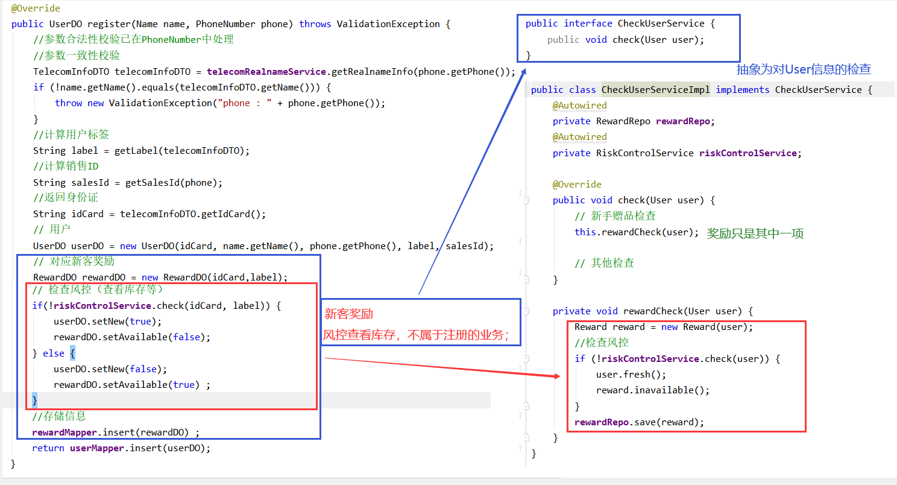

这里的 CheckUserService 就是**领域服务**。

**领域服务**：为了解决不好在一个实体内解决的业务问题，它一定是**无状态**的。

##### 4、最终的调用代码
发现最终的调用代码是没有业务实现的。
```java
public class UserServiceImpl implements UserService {
    @Autowired
    private UserRepo userRepo;
    @Autowired
    private CheckUserService checkUserService;
    @Autowired
    private RealnameService realnameService;

    @Override
    public User register(Name name, PhoneNumber phone) throws ValidationException {
        // 查询实名信息(实名信息验证)
        RealnameInfo realnameInfo = realnameService.get(name, phone);
        // 构造对象
        User user = new User(realnameInfo, phone);
        // 检查User对象
        checkUserService.check(user);
        return userRepo.save(user);
    }
}
```
这里的UserService, 就是**应用服务**。

**应用服务**：是用来表达用例和用户故事（User Story)的主要手段。

应用层经过应用服务接口来暴露系统的所有功能。在应用服务的实现中，它负责**编排和转发**，它将要实现的功能委托给一个或多个领域对象来实现，它自己只负责处理业务用例的执行顺序以及结果的拼装。经过这样一种方式，它隐藏了领域层的复杂性及其内部实现机制。

**应用服务**：应该是很薄的一层。

#### git代码

https://github.com/su-dd/learning/tree/main/src/spring/ddd/20Demo


本文案例参照：https://www.bilibili.com/video/BV1Ci4y1978C?spm_id_from=333.88O.my_history.page.click

### 基于Cola的初步实践

这一节，主要是介绍CQRS、基于COLA的分包方式。

希望将领域模型的理论，应用到实战。 

既然要应用到实战，这里不经要问一个问题： **距离实战，还有多少差距？**

#### 业务要求

> 1、活动策划可以查看所有用户信息，并可以通过，手机号码、姓名、销售信息 里的一个或多个来查找用户，显示姓名，号码。
> 
> 2、活动策划可以查看用户的详细信息，显示：姓名，号码，新手福利信息；并修改用户的新手福利。
> 
> 3、用户可以自行注销账号。

#### 常见代码

**应用服务：**
```java
@Service
public class UserServiceImpl implements UserService {
    @Autowired
    private UserRepo userRepo;
    @Autowired
    private CheckUserService checkUserService;
    @Autowired
    private RealnameService realnameService;

    @Override
    public UserDTO register(Name name, PhoneNumber phone) throws ValidationException {
        // 查询实名信息(实名信息验证)
        RealnameInfo realnameInfo = realnameService.get(name, phone);
        // 构造对象
        User user = new User(realnameInfo, phone);
        // 检查User对象
        checkUserService.check(user);
        return new UserDTO(userRepo.save(user));
    }

    @Override
    public List<UserDTO> findList(UserParamDTO userParamDTO) {
        List<User> userList = userRepo.find(userParamDTO);
        List<UserDTO> userDTOList = new ArrayList<>();
        userList.forEach(user -> {
            userDTOList.add(new UserDTO(user));
        });
        return userDTOList;
    }

    @Override
    public UserDTO find(UserParamDTO userParamDTO) {
        if (null == userParamDTO.getUserId() || userParamDTO.getUserId().length() == 0) {
            return null;
        }
        User user = userRepo.findById(userParamDTO.getUserId());
        if (null != user) {
            return new UserDTO(user);
        }
        return null;
    }

    @Override
    public UserDTO setFresh(UserParamDTO userParamDTO) {
        if (null == userParamDTO.getUserId() || userParamDTO.getUserId().length() == 0) {
            return null;
        }
        User user = userRepo.findById(userParamDTO.getUserId());
        if (null != user) {
            // 设置用户为新客身份，以便发送新手礼包
            user.setFresh(true);
            // 检查User对象
            checkUserService.check(user);
            return new UserDTO(user);
        }
        return null;
    }

    @Override
    public Boolean deleteOne(UserParamDTO userParamDTO) {
        if (null == userParamDTO.getUserId() || userParamDTO.getUserId().length() == 0) {
            return false;
        }
        return userRepo.delete(userParamDTO.getUserId());
    }
}
```

#### 认识问题

**1、前两章的问题，这里再次出现**

解决办法，回顾前两篇内容。


**2、随着不断的提取概念，经典的3层结构不能很好的容纳这些概念。**


**3、多个请求使用一个DTO，导致DTO臃肿**

现在的UserParamDTO，被多个业务使用。导致DTO的臃肿，在传输中需要填充并不需要的字段。

后续维护者，不知道DTO的成员变量有几重业务意义；只能不断膨胀。

同时应用服务不断被修改，有业务外流的风险；也不符合开闭原则。

```java
@Data
public class UserParamDTO implements Serializable {
    // 用户id
    private String userId;
    // 用户名称
    private String name;
    // 用户手机
    private String phone;
    //绑定销售id
    private String salesId;
    // 标志是否为新用户，默认为false
    private Boolean fresh;
}
```

#### 1、解决分包不清晰

相对经典的3层架构而言，DDD也有自己的分层架构方式。

DDD的经典4层架构：**用户接口层**，**应用层**，**领域层**，**基础设施层**

与原3层架构，对照如下。


用于DDD分层的复杂性比较高，如： 具体代码如何划分，如何归属。

这里推荐使用Cola的分层方式。

目前Cola已经到4.0时代，经过4个版本的沉淀；笔者认为它已经是一个非常完善的架构方式。

##### Cola 4.0 架构/框架

COLA 4.0 架构分成COLA架构和COLA组件两个部分：

1.  COLA架构：关注应用架构的定义和构建，提升应用质量。

2.  COLA组件：提供应用开发所需要的可复用组件，提升研发效率。


COLA架构各个包结构的简要功能描述，如下表所示：

| 层次       | 包名        | 功能                            | 必选 |
| :--------- | :---------- | :------------------------------ | :--- |
| Adapter层  | web         | 处理页面请求的Controller        | 否   |
| Adapter层  | wireless    | 处理无线端的适配                | 否   |
| Adapter层  | wap         | 处理wap端的适配                 | 否   |
| App层      | executor    | 处理request，包括command和query | 是   |
| App层      | consumer    | 处理外部message                 | 否   |
| App层      | scheduler   | 处理定时任务                    | 否   |
| Domain层   | model       | 领域模型                        | 否   |
| Domain层   | ability     | 领域能力，包括DomainService     | 否   |
| Domain层   | gateway     | 领域网关，解耦利器              | 是   |
| Infra层    | gatewayimpl | 网关实现                        | 是   |
| Infra层    | mapper      | ibatis数据库映射                | 否   |
| Infra层    | config      | 配置信息                        | 否   |
| Client SDK | api         | 服务对外透出的API               | 是   |
| Client SDK | dto         | 服务对外的DTO                   | 是   |

##### 分包后工程结构
1、首先是**用户接口层**和**应用层**的填充。


2、**领域层**的填充


3、**基础设施层** 的填充


#### 2、解决DTO臃肿问题

当前的DTO运行方式为：


单一的DTO，在DDD中适配多个业务。DTO不断的被复杂化。

为了解决这个问题，这里引入一个概念：

**CQRS（Command and Query Responsibility Segregation）命令和查询责任隔离**

为了解决传统DTO在DDD中的问题，提出了根据读写职责不同，把领域模型切分为command和query两个部分：


Command端与Query端都通过Application Service 进入系统，共享同一个数据库，但Command端只写入状态，Query端只读取状态。

**代码分包方式：**


**定义和执行体：**

```java
// 参数
@Data
public class RegisterUserCmd extends Command {
    // 用户名称
    private String name;
    // 用户手机
    private String phone;
}

// 执行
@Component
public class RegisterUserCmdExe {
    @Autowired
    private UserGateWay userGateWay;
    @Autowired
    private CheckUserService checkUserService;
    @Autowired
    private RealnameService realnameService;

    public SingleResponse<UserDetailCO> execute(RegisterUserCmd registerUserCmd) {
        try {
            // 查询实名信息(实名信息验证)
            RealnameInfo realnameInfo = realnameService.get(new Name(registerUserCmd.getName()), new PhoneNumber(registerUserCmd.getPhone()));
            // 构造对象
            User user = new User(realnameInfo, new PhoneNumber(registerUserCmd.getPhone()));
            // 检查User对象
            checkUserService.check(user);
            return SingleResponse.of(new UserDetailCO(userGateWay.save(user)));
        } catch (ValidationException e) {
            e.printStackTrace();
            return SingleResponse.buildFailure("401", e.getMessage());
        }
    }
}

// 返回值
@Data
public class UserDetailCO implements Serializable {
    // 用户id
    private String userId;
    // 用户名称
    private String name;
    // 用户手机
    private String phone;
    //用户标签
    private String label;
    //绑定销售id
    private String salesId;
    // 标志是否为新用户，默认为false
    private Boolean fresh;

    public UserDetailCO(User user) {
        this.userId = user.getUserId();
        this.name = user.getName().getName();
        this.phone = user.getPhone().getPhone();
        this.label = user.getLabel().toString();
        this.salesId = user.getSales().getSalesId();
        this.fresh = user.getFresh();
    }
}

```

**调用代码：**

```java
@Service
public class UserServiceImpl implements UserService {
    @Autowired
    RegisterUserCmdExe registerUserCmdExe;
    @Autowired
    FindUsersQryExe findUsersQryExe;
    @Autowired
    FindUserQryExe findUserQryExe;
    @Autowired
    FreshUserCmdExe freshUserCmdExe;
    @Autowired
    DeleteUserCmdExe deleteUserCmdExe;

    @Override
    public SingleResponse<UserDetailCO> register(RegisterUserCmd registerUserCmd)  {
        return registerUserCmdExe.execute(registerUserCmd);
    }

    @Override
    public MultiResponse<UserSimpleCO> findList(FindUsersQry findUsersQry) {
        return findUsersQryExe.execute(findUsersQry);
    }

    @Override
    public SingleResponse<UserDetailCO> find(FindUserQry findUserQry) {
        return findUserQryExe.execute(findUserQry);
    }

    @Override
    public SingleResponse<UserDetailCO> setFresh(FreshUserCmd freshUserCmd) {
        return freshUserCmdExe.execute(freshUserCmd);
    }

    @Override
    public Response deleteOne(DeleteUserCmd deleteUserCmd) {
        return deleteUserCmdExe.execute(deleteUserCmd);
    }
}
```
封装完成后，任何一个业务的参数变化，只会影响自己的业务情况。

应用服务不会因为业务的变化而变化，具体的业务组织交个每个业务执行体做； 更符合单一职责。

#### Git代码

https://github.com/su-dd/learning/tree/main/src/spring/ddd/30Demo
#### Cola组件介绍

COLA 组件：提供了一些框架级别的功能，提供应用开发所需要的可复用组件，提升研发效率。

| 组件名称                         | 功能                                             | 版本  | 依赖              |
| :------------------------------- | :----------------------------------------------- | :---- | :---------------- |
| cola-component-dto               | 定义了DTO格式，包括分页                          | 1.0.0 | 无                |
| cola-component-exception         | 定义了异常格式，主要有BizException和SysException | 1.0.0 | 无                |
| cola-component-statemachine      | 状态机组件                                       | 1.0.0 | 无                |
| cola-component-domain-starter    | Spring托管的领域实体组件                         | 1.0.0 | 无                |
| cola-component-catchlog-starter  | 异常处理和日志组件                               | 1.0.0 | exception,dto组件 |
| cola-component-extension-starter | 扩展点组件                                       | 1.0.0 | 无                |
| cola-component-test-container    | 测试容器组件                                     | 1.0.0 | 无                |

## JAVA

### 环境

#### 认识JDK和JRE

> JRE (Java Runtime Environment) ：是Java程序的运行时环境，包含 JVM 和运行时所需要的 核心类库 。
> JDK (Java Development Kit)：是Java程序开发工具包，包含 JRE 和开发人员使用的工具。
> 我们想要运行一个已有的Java程序，那么只需安装 JRE 即可。
> 我们想要开发一个全新的Java程序，那么必须安装 JDK 。  
>


#### 内存划分

Java中内存分为5个部分：栈、堆、方法区、本地方法区、寄存器

栈（虚拟机栈）：局部变量，java方法；用完就释放。（java的方法是通过压栈出栈的方执行的）

堆：存储new出来的东西，用完后有垃圾回收器释放。

方法区：主要存 类元数据、常量 等等

本地方法栈：作用同虚拟机栈，提供的是Native方法服务；即提供非Java方法的使用。本地方法可以通过 JNI(Java Native Interface)来访问虚拟机运行时的数据区，甚至可以调用寄存器，具有和 JVM 相同的能力和权限

寄存器：CPU使用的位置。

#### Java8前-内存


#### Java8后-内存

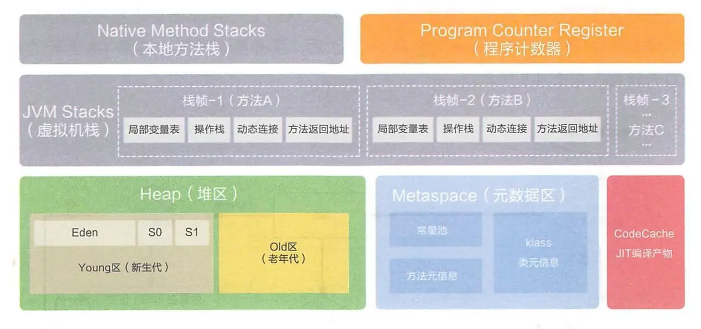

### 基础语法

#### 命名规则

> **标识符**
>
> 指在程序中，我们自己定义内容。比如类的名字、方法的名字和变量的名字等等，都是标识符。

> **命名规则： 硬性要求**
>
> - 标识符可以包含 英文字母26个(区分大小写) 、 0-9数字 、 $（美元符号） 和 _（下划线） 。
> - 标识符不能以数字开头。
> -  标识符不能是关键字。   


>   **命名规范： 软性建议**
>
>   - 类名规范：首字母大写，后面每个单词首字母大写（大驼峰式）。
>   - 方法名规范： 首字母小写，后面每个单词首字母大写（小驼峰式）。
>   - 变量名规范：全部小写。  

#### 基本类型

8个基本类型

| 数据类型     | 关键字         | 内存占用 | 取值范围               |
| ------------ | -------------- | -------- | ---------------------- |
| 字节型       | byte           | 1个字节  | -128~127               |
| 短整型       | short          | 2个字节  | -32768~32767           |
| 整型         | int（默认）    | 4个字节  | -2的31次方~2的31次方-1 |
| 长整型       | long           | 8个字节  | -2的63次方~2的63次方-1 |
| 单精度浮点数 | float          | 4个字节  | 1.4013E-45~3.4028E+38  |
| 双精度浮点数 | double（默认） | 8个字节  | 4.9E-324~1.7977E+308   |
| 字符型       | char           | 2个字节  | 0-65535                |
| 布尔类型     | boolean        | 1个字节  | true，false            |

#### 类

**入口函数为：main函数**

```java
public class HelloWorld {
    public static void main(String[] args) {
        System.out.println("Hello World !");
    }
}
```

**类中包括 ：静态代码块，构造方法，成员变量、成员方法、类变量、类方法**

执行顺序为：

​	静态代码 > 构造方法 > 成员方法

​	静态代码 > 类方法

>  静态代码在构造函数 和 本类的main方法之前执行，且只执行一次；可以用做初始化静态数据等工作。
>
> PS：main方法可以认为是一个特殊的类方法


**默认构造**

> 同C++：
>
> 如果你不提供构造方法，系统会给出无参数构造方法。
>
> 如果你提供了构造方法，系统将不再提供无参数构造方法。  


**抽象类，抽象方法**

> abstract修饰的方法就是抽象方法，抽象方法没有方法体。
>
>  如果一个类存在抽象方法，则这个类为抽象类，需要用**abstract **修饰。
>
> 抽象类不可以实例化对象，需要一个子类继承这个类，实现所有的抽象方法，才能实例对象。

```Java
// abstract修饰的类需要
public abstract class Animal {
	public abstract void run()；
}

public class Cat extends Animal {
    @Override // 标识 方法重写 子类中出现与父类一模一样的方法；（可以用于编译检测）
    public void run() {
        System.out.println("Cat eat ... ");
    }
}
```

成员变量的默认值：

|          | 数据类型                       | 默认值   |
| -------- | ------------------------------ | -------- |
| 基本类型 | 整数（byte，short，int，long） | 0        |
|          | 浮点数（float，double）        | 0.0      |
|          | 字符（char）                   | '\u0000' |
|          | 布尔（boolean）                | false    |
| 引用类型 | 数组，类，接口                 | null     |

**Demo**:

```java
$[Person.java]
public class Person {
    // 成员变量
    private String name;
    // 类变量
    public static String nation;
    // 静态代码块
    static {
        System.out.println("Person static !");
        nation = "中国";
    }
    // 类方法
    public static String getNation() {
        return nation;
    }
    // main方法
    public static void main(String[] args) {
        System.out.println("Person main running ... ");
        Person person = new Person();
    }
    // 无参构造
    public Person() {
        System.out.println("无参构造");
    }
    // 有参构造
    public Person(String name) {
        System.out.println("有参构造");
        this.name = name;
    }
    // 成员方法
    public String getName() {
        return name;
    }
    public void setName(String name) {
        this.name = name;
    }
}
/*
Person static !
Person main running ... 
无参构造
*/
```

```java
public class Demo {
    public static void main(String[] args) {
        System.out.println("Demo->main方法执行。。。 ");
        Person person1 = new Person();
        Person person2 = new Person("张三", "男", 18);
    }
}
/*
Demo->main方法执行。。。 
Person static !
中国
无参构造
有参构造
*/
```

#### 继承

**类继承**

> 关键字：extends，Java是单继承的（这点有别C++）。


**接口实现**

> 关键字： interface（接口）、 implements（实现）
>
> 1. 无法定义成员变量，但是可以定义常量，其值不可以改变，默认使用public static final修饰。
> 2. 没有构造方法，不能创建对象。
> 3. 没有静态代码块。  

**一个类可是实现多个接口**

> 1. 实现所有抽象方法的类才能实例化，如果没没有实例化所有的接口即为抽象类
> 2. 多个接口存在同一个抽象方法，实现一次即可

```java
class 类名 [extends 父类名] implements 接口名1,接口名2,接口名3... {
	// 重写接口中抽象方法【必须】
	// 重写接口中默认方法【不重名时可选】
}
```

**接口之间可以继承**

> 1. 一个接口可以继承一个接口，并添加自己的方法
> 2. 一个接口也可以继承多个接口

```java
public interface 接口名 extends 接口名1,接口名2,接口名3... {
}
```

**默认方法 & 静态方法 **

```java
默认方法：使用 default 修饰，不可省略，供子类调用或者子类重写。
静态方法：使用 static 修饰，供接口直接调用。
public interface InterFaceName {
	public default void method() {
		// 执行语句
	}
	public static void method2() {
		// 执行语句
	}
}
```

> **私有方法和私有静态方法**
> 私有方法：使用 private 修饰，供 **接口中** 的默认方法或者静态方法调用。  


**类型转换  **

**基础类型** ：基础类型之间的转换，如char类型转为int;为**强制转换**

```java
int a = (int) word
```


**向上转型** ：子类类型向父类类型向上转换的过程  ,如用一个父类引用指向一个子类对象  ；为**默认转换**

```java
父类类型 变量名 = new 子类类型();
如：Animal a = new Cat();
```

**向下转型** ：父类类型向子类类型向下转换的过程，  为**强制转换**

```java
子类类型 变量名 = (子类类型) 父类变量名;
如:Cat c =(Cat) a;
```

**判断类型**

向下转型存在危险；

方式一：

用**instanceof** 判断类型。

```java
// 基础类型不能这么处理
if (animal instanceof Cat)
{
    Cat c =(Cat) animal;
}
```

方式二：

用**isInstance** 判断

```java
String str = "abcd";
//自身类.class.isInstance(自身实例或子类实例)  返回true 
System.out.println(String.class.isInstance(str)); //true;
```

方式三：

用**isAssignableFrom**

```java
String str = "abcd";
// 自身类.class.isAssignableFrom(自身类或子类.class)  返回true
System.out.println(String.class.isAssignableFrom(str.getClass())); //true;
```

#### this 和super

在Java中我们也会遇到一些问题，如在子类构造中调用父类的构造函数；在子类调用父类的方法；获得当前对象的引用。。

> super ：代表父类的存储空间标识(可以理解为父亲的引用)。
> this ：代表当前对象的引用(谁调用就代表谁)。  

**用法一：访问成员**

```java
this.成员变量 ‐‐ 本类的
super.成员变量 ‐‐ 父类的
this.成员方法名() ‐‐ 本类的
super.成员方法名() ‐‐ 父类的	
```

**用法二：访问成员**

```java
this(...) ‐‐ 本类的构造方法
super(...) ‐‐ 父类的构造方法
```

> 子类的每个构造方法中均有默认的super()，调用父类的空参构造。手动调用父类构造会覆盖默认的super()。
> super() 和 this() 都必须是在构造方法的第一行，所以不能同时出现。  

### 稍微复杂一些的语法

#### 内部类

将一个类A定义在另一个类B里面，里面的那个类A就称为内部类，B则称为外部类  

```java
class 外部类 {
	class 内部类{
	}
}
```

**访问特点**

> 内部类可以直接访问外部类的成员，包括私有成员。
> 外部类要访问内部类的成员，必须要建立内部类的对象。  

内部类仍然是一个独立的类，在编译之后会内部类会被编译成独立的.class文件，但是前面冠以外部类的类名
和  $ 符号 。

比如，Person$Leg.class  

```java
public class Person {
	private boolean live;

    public class Leg {
        public void run() {
            if (live) {
                System.out.println("running .... ");
            } else {
                System.out.println("dead");
            }
        }
    }
    public Person() {
        this.live = true;
    }
    public Person(boolean live) {
        this.live = live;
    }
    public boolean isLive() {
        return live;
    }
    public void setLive(boolean live) {
        this.live = live;
    }
}
```

```Java
public class Demo {
    public static void main(String[] args) {
        Person person = new Person();
        Person.Leg leg1 = person.new Leg();
        leg1.run();
    }
}
```


#### 匿名内部类

内部类的简化写法。它的本质是一个 **带具体实现的 ** **父类或者父接口的**  匿名的 **子类对象**。
开发中，最常用到的内部类就是匿名内部类了。

>  要素：
>
> 1. 父类 或 父接口
> 2. 子类实现

```java
new 父类名或者接口名(){
    // 方法重写
    @Override
    public void method() {
    // 执行语句
    }
};  
```

```java
public interface Eat {
    public abstract void eat();
}
public class Demo {
    public static void main(String[] args) {
        Eat eat = new Eat() {
            @Override
            public void eat() {
                System.out.println("eat fruit");
            }
        };
        eat.eat();
    }
}
```


### JavaBean


JavaBean 是 Java语言编写类的一种标准规范。符合 JavaBean 的类，要求类必须是具体的和公共的，并且具有无
参数的构造方法，提供用来操作成员变量的 set 和 get 方法。  

```java
public class ClassName{
//成员变量
//构造方法
//无参构造方法【必须】
//有参构造方法【建议】
//成员方法
//getXxx()
//setXxx()
}
```


### Java容器

#### Collection 集合

##### 1 集合体系结构

- 集合类的特点

  提供一种存储空间可变的存储模型，存储的瓣容量可以随时发生改变

- 集合类的体系图


##### 2 Collection集合概述和基本使用

- Collection集合概述
  - 是单例集合的顶层接口 ,它表示一组对象,这些对象也称为Collection的元素
  - JDK不提供此接口的任何直接实现,它提供更具体的子接口(如Set和List)实现

- Collection集合基本使用

```java
public class CollectionDemo {
    public static void main(String[] args) {
        //创建collection集合的对象
        Collection<String> c = new ArrayList<String>();
        //添加元素：boolean add(E e)
        c.add("hello");
        c.add("worid");
        c.add("java");
        //输出集合对象
        System.out.println(c);
    }
}
```

##### 3 Collection集合的常用方法

| **方法名**                 | **说明**                          |
| -------------------------- | --------------------------------- |
| boolean add(E e)           | 添加元素                          |
| boolean remove(Object o)   | 从集合中移除指定的元素            |
| void clear()               | 清空集合中的元素                  |
| boolean contains(Object o) | 判断集合中是否 g 旨定的元素       |
| boolean isEmpty()          | 判断集合是否为空                  |
| int size()                 | 集合的长度,也就是集合中元素的个数 |

 

##### 4 Collection集合的遍历

- 迭代器的介绍
  - 迭代器,集合的专用
  - Iterator iterator():返回此集合中元素的迭代器,通过集合的iterator。方法得到
  - 迭代器是通过集合的iterator。方法得到的,所以我们说它是依赖于集合而存在的

- Collection集合的遍历

```java
public class IteratorDemo {
    public static void main(String[] args) {
        //创建集合对象
        Collection<String> c = new ArrayList<String>();
        //添加元素
        c.add("hello");
        c.add("world");
        c.add("java");
        c.add("javaee");

        //Iterator<E> iterator():返回此集合中兀素的迭代器,通过集合的iterator()方法得到
        Iterator<String> it = c.iterator();
        //用whi1e循环改进元素的判断和获取
        while (it.hasNext()) {
            String s =it.next();
            System.out.println(s);
        }
    }
}
```

#### List

##### 1 List集合概述和特点

- List集合概述
  - 有序集合（也称为序列），用户可以精确控制列表中每个元素的插入位置。用户可以通过整数索引访问元 素,并搜索列表中的元素
  - 与Set集合不同，列表通常允许重复的元素

- List集合特点
  - 有索引
  - 可以存储重素
  - 元素存取有序

##### 2 List集合的特有方法

| **方法名**                     | **描述**                               |
| ------------------------------ | -------------------------------------- |
| void add(int index, E element) | 在此集合中的指定位置插/M旨定的元素     |
| E remove(int index)            | 删除指定索引处的元素,返回被删除的元素  |
| E set(int index, E element)    | 修改J旨定索引处的元素,返回被修改的元素 |
| E get(int index)               | 返回指定索引处的元素                   |

##### 3 List集合子类的特点

- ArrayList 集合
  - 底层是数组结构实现,查询快、增删慢

- LinkedList集合
  - 底层是链表结构实现,查询慢、增删快
  - 特有方法

| **LinkedList 特有方法 方法名** | **说明**                         |
| ------------------------------ | -------------------------------- |
| public void addFirst(E e)      | 在该列券头插涌定的元素           |
| public void addLast(E e)       | 樹旨定的元素斷到此列表的末尾     |
| public E getFirst()            | 返回此列表中的第一个元素         |
| public E getLast()             | 返回此列表中的最后一个元素       |
| public E removeFirst()         | 从此列表中删除并返回第一个元素   |
| public E removeLast()          | 从此列表中删除并返回最后一个元素 |

##### 4 集合的案例-List集合存储学生对象并遍历

- 案例需求  

  创建一个存储学生对象的集合,存储3个学生对象,使用程序实现在控制台遍历该集合  

- 代码实现  

```java
public class Student {
    private String name;
    private int age;
    public Student(){

    }
    public Student(String name,int age){
        this.name=name;this.age=age;
    }
    public String getName(){
        return name;
    }
    public void setName(String name){
        this.name=name;
    }
    public int getAge(){
        return age;
    }
    public void setAge(int age){
        this.age=age;
    }
}
```

- 测试类  

```java
public class ListDemo {
    public static void main(String[] args) {

        //创建List集合对象
        List<Student> list=new ArrayList<Student>();

        //创建学生对象
        Student s1 = new Student("林青霞",30);
        Student s2 = new Student("张曼玉",35);
        Student s3 = new Student("王祖贤",33);

        //把学生添加到集合
        list.add(s1);
        list.add(s2);
        list.add(s3);

        //迭代器方式
        Iterator<Student> it=list.iterator();
        while (it.hasNext()) {
            Student s = it.next();
            System.out.println(s.getName()+","+s.getAge());
        }

        System.out.println("--------");

        //for循环方式
        for(int i=0; i < list.size(); i++) {
            Student s = list.get(i);
            System.out.println(s.getName()+","+s.getAge());
        }
    }
}

```

##### 5 并发修改异常

- 出现的原因
  
  - 迭代器遍历的过程中，通过集合对象修改了集合中的元素，造成了迭代器获取元素中判断预期修改值和实际修改值不一致，则会出现：ConcurrentModificationException
- 解决的方案
  - 用for循环遍历,然后用集合对象做对应的操作即可
  - 使用列表迭代器ListIterator
    - 通过List集合的listlterator()方法得到,所以说它是Li st集合特有的迭代器
    - 用于允许程序员沿任一方向遍历的列表迭代器,在迭代期间修改列表,并获取列表中迭代器的当前位置
- 示例代码

```java
public class ListDemo2 {
    public static void main(String[] args) {
        // 创建集合对象
        List<String> list = new ArrayList<>();

        // 添加元素
        list.add("hello");
        list.add("world");

        //迭代器方式
        Iterator<String> it=list.iterator();
        while (it.hasNext()) {
            String s = it.next();
            if (s.equals("world")) {
                //list.add("java");  //ConcurrentModificationException
            }
        }

        // for循环方式
        for(int i=0; i < list.size(); i++) {
            String s = list.get(i);
            if (s.equals("world")) {
                list.add("java");
            }
        }

        //获取列表迭代器
        ListIterator<String> lit = list.listIterator();
        while (lit.hasNext()) {
            String s = lit.next();
            if(s.equals("world")) {
                lit.add("javaee");
            }
        }

        // 输出集合对象
        System.out.println(list);
    }
}
```


##### 6 增强for循环

- 定义格式
``` java
for(元素数据类型变量名:数组/集合对象名){
循环体;
}
```

- 示例代码
```java
public class ForDemo {
    public static void main(String[] args) {
        int[] arr = {1, 2, 3, 4, 5};
        for (int i : arr) {
            System.out.println(i);
        }
        System.out.println("--------");
        String[] strArray = {"hello", "world", "java"};
        for (String s : strArray) {
            System.out.println(s);
        }
        System.out.println("--------");
        List<String> list = new ArrayList<String>();
        list.add("hello");
        list.add("world");
        list.add("java");
        for (String s : list) {
            System.out.println(s);
        }
        System.out.println("--------");
        // 内部原理是一个Iterator迭代器
        for(String s : list) {
            if(s.equals("world")) {
        //        list.add("javaee"); //ConcurrentModificationException
            }
        }
    }
}
```

#### set

##### 1 Set集合概述和特点
- Set集合的特点
   - 元素存取无序
   - 没有索引、只能通过迭代器或增强for循环遍历
   - 不能存储重复元素  

##### 2 Java哈希值
- 哈希值简介
   - 是JDK根据对象的地址或者字符串或者数字算出来的int类型的数值
- 如何获取哈希值
   - Object类中的 public int hashCode()：返回对象的哈希码值
- 哈希值的特点
   - 同一个对象多次调用 hashCode() 方法，返回的哈希值是相同的
   - 默认情况下，不同对象的哈希值是不同的。而重写hashCode()方法，可以实现让不同对象的哈希值相同  

##### 3 HashSet集合概述和特点

- HashSet集合的特点
	- 底层数据结构是哈希表
	- 对集合的迭代顺序不作任何保证，也就是说不保证存储和取出的元素顺序一致
    - 没有带索引的方法，所以不能使用普通for循环遍历
    - 由于是Set集合，所以是不包含重复元素的集合  
    - HashSet存储逻辑：
        
        
  
- 案例需求
  - 创建一个存储学生对象的集合，存储多个学生对象，使用程序实现在控制台遍历该集合
  - 要求：学生对象的成员变量值相同，我们就认为是同一个对象  
- 学生类：
```java
public class Student {
    private String name;
    private int age;
    public Student() {
    }
    public Student(String name, int age) {
        this.name = name;
        this.age = age;
    }
    public String getName() {
        return name;
    }
    public void setName(String name) {
        this.name = name;
    }
    public int getAge() {
        return age;
    }
    public void setAge(int age) {
        this.age = age;
    }
    @Override
    public boolean equals(Object o) {
        if (this == o)
            return true;
        if (o == null || getClass() != o.getClass())
            return false;
        Student student = (Student) o;
        if (age != student.age)
            return false;
        return name != null ? name.equals(student.name) : student.name == null;
    }
    @Override
    public int hashCode() {
        int result = name != null ? name.hashCode() : 0;
        result = 31 * result + age;
        return result;
    }
}
```

- 测试类
```java
public class HashSetDemo {
    public static void main(String[] args) {
        //创建HashSet集合对象
        HashSet<Student> hs = new HashSet<Student>();
        //创建学生对象
        Student s1 = new Student("林青霞", 30);
        Student s2 = new Student("张曼玉", 35);
        Student s3 = new Student("王祖贤", 33);
        Student s4 = new Student("王祖贤", 33);
        Student s5 = new Student("", 33);
        Student s6 = new Student("", 33);
        //把学生添加到集合
        hs.add(s1);
        hs.add(s2);
        hs.add(s3);
        hs.add(s4);
        hs.add(s5);
        hs.add(s6);
        hs.add(new Student());
        hs.add(new Student());
        //遍历集合(增强for)
        for (Student s : hs) {
            System.out.println(s.getName() + "," + s.getAge());
        }
    }
}
```


##### 4 LinkedHashSet集合概述和特点

- LinkedHashSet集合特点
  - 哈希表和链表实现的Set接口，具有可预测的迭代次序
  - 由链表保证元素有序，也就是说元素的存储和取出顺序是一致的
  - 由哈希表保证元素唯一，也就是说没有重复的元素  

- 测试类

```java
public class LinkedHashSetDemo {
    public static void main(String[] args) {
        //创建集合对象
        LinkedHashSet<String> linkedHashSet = new LinkedHashSet<String>();
        //添加元素
        linkedHashSet.add("hello");
        linkedHashSet.add("world");
        linkedHashSet.add("java");
        linkedHashSet.add("world");
        //遍历集合
        for(String s : linkedHashSet) {
            System.out.println(s);
        }
    }
}
```

  


##### 5 TreeSet集合概述和特点

- TreeSet集合概述
  - 元素有序，可以按照一定的规则进行排序，具体排序方式取决于构造方法
    - TreeSet(Comparator comparator) ：根据指定的比较器进行排序
    - TreeSet()：根据其元素的自然排序进行排序
  - 没有带索引的方法，所以不能使用普通for循环遍历
  - 由于是Set集合，所以不包含重复元素的集合  

- 案例需求
  - 存储学生对象并遍历
  - 要求：按照年龄从小到大排序，年龄相同时，按照姓名的字母顺序排序


###### 5.1 比较器排序Comparator

```java
public class TreeSetDemo {
    public static void main(String[] args) {
        // 创建集合对象
        TreeSet<Student> ts = new TreeSet<Student>(new Comparator<Student>() {
            @Override
            public int compare(Student o1, Student o2) {
                int num = o1.getAge() - o2.getAge();
                int num2 = num == 0 ? o1.getName().compareTo(o2.getName()) : num;
                return num2;
            }
        });

        //把学生添加到集合
        ts.add(new Student("xishi", 29));
        ts.add(new Student("wangzhaojun", 28));
        ts.add(new Student("diaochan", 30));
        ts.add(new Student("yangyuhuan", 33));
        ts.add(new Student("linqingxia",33));
        ts.add(new Student("linqingxia",33));

        //遍历集合
        for (Student s : ts) {
            System.out.println(s.getName() + "," + s.getAge());
        }
    }
}
```

###### 5.2 自然排序Comparable

- 学生类

```java
public class Student2 implements Comparable<Student2> {
    private String name;
    private int age;
    public Student2() {
    }
    public Student2(String name, int age) {
        this.name = name;
        this.age = age;
    }
    public String getName() {
        return name;
    }
    public void setName(String name) {
        this.name = name;
    }
    public int getAge() {
        return age;
    }
    public void setAge(int age) {
        this.age = age;
    }
    @Override
    public int compareTo(Student2 student2) {
        int num = this.getAge() - student2.getAge();
        int num2 = num == 0 ? this.getName().compareTo(student2.getName()): num;
        return num2;
    }
}
```

- 测试类

```java
public class TreeSetDemo2 {
    public static void main(String[] args) {
        //创建集合对象
        TreeSet<Student2> ts = new TreeSet<Student2>();
        //把学生添加到集合
        ts.add(new Student2("xishi", 29));
        ts.add(new Student2("wangzhaojun", 28));
        ts.add(new Student2("diaochan", 30));
        ts.add(new Student2("yangyuhuan", 33));
        ts.add(new Student2("linqingxia",33));
        ts.add(new Student2("linqingxia",33));
        //遍历集合
        for (Student2 s : ts) {
            System.out.println(s.getName() + "," + s.getAge());
        }
    }
}
```

  
#### map

##### 1 Map集合概述和特点

- Map集合概述

  ```java
   interface Map<K,V> K：键的类型；V：值的类型
  ```


- Map集合的特点

  - 键值对映射关系
  - 一个键对应一个值
  - 键不能重复，值可以重复
  - 元素存取无序  

- 基本方法介绍  

| 方法名                              | 说明                         |
	| -------------------------- | -------------------------------|
	| V put(K key,V value)                | 添加元素            |
	| V remove(Object key)                | 根据键删除键值对元素   |
	| void clear()                        | 移除所有的键值对元素   |
	| boolean containsKey(Object key)     | 判断集合是否包含指定的键  |
	| boolean containsValue(Object value) | 判断集合是否包含指定的值 |
	| boolean isEmpty()                   | 判断集合是否为空   |
	| int size()             | 集合的长度，也就是集合中键值对的个数 |

- 获取方法

 |  方法名 | 说明  |
  | ----------| -------- |
  | V get(Object key)  | 根据键获取值    |
  | Set keySet()  | 获取所有键的集合   |
  | Collection values()   | 获取所有值的集合  |
  | Set<Map.Entry<K,V>> entrySet()  |  获取所有键值对对象的集合 |

#####  2  遍历Map

- Set< K > keySet()，获取所有键的集合。
- Set<Map.Entry<K,V>> entrySet()，获取所有键值对对象的集合 。

```java
public class MapDemo {
    public static void main(String[] args) {
        //创建集合对象
        Map<String, String> map = new HashMap<String, String>();

        //添加元素
        map.put("张无忌", "赵敏");
        map.put("郭靖", "黄蓉");
        map.put("杨过", "小龙女");

        //获取所有键的集合。用keySet()方法实现
        Set<String> keySet = map.keySet();

        //遍历键的集合，获取到每一个键。用增强for实现
        for (String key : keySet) {
            //根据键去找值。用get(Object key)方法实现
            String value = map.get(key);
            System.out.println(key + "," + value);
        }

        System.out.println("-----------------------------");
        
        //获取所有键值对对象的集合
        Set<Map.Entry<String, String>> entries = map.entrySet();

        //遍历键值对对象的集合，得到每一个键值对对象
        for (Map.Entry<String, String> me : entries) {
            //根据键值对对象获取键和值
            String key = me.getKey();
            String value = me.getValue();
            System.out.println(key + "," + value);
        }
    }
}
```


##### 3 Properties特点

- Properties介绍

  - 是一个Map体系的集合类
  - Properties可以保存到流中或从流中加载
  - 属性列表中的每个键及其对应的值都是一个字符串  

- 特有方法  


  | 方法名| 说明 |
  | :-------------: | :----------------------------------: |
  | Object setProperty(String key, String value) | 设置集合的键和值，都是String类型，底层调用 Hashtable方法 put |
  | String getProperty(String key)  | 使用此属性列表中指定的键搜索属性 |
  | Set stringPropertyNames()  | 从该属性列表中返回一个不可修改的键集，其中键及其对应的 值是字符串 |
  

- 示例代码

```java
public class PropertiesDemo1 {
    public static void main(String[] args) {
        //创建集合对象
        Properties prop = new Properties();

        //存储元素
        prop.put("001", "林青霞");
        prop.put("002", "张曼玉");
        prop.setProperty("003", "王祖贤");

        //遍历集合
        Set<String> keySet = prop.stringPropertyNames();
        for (String key : keySet) {
            String value = prop.getProperty(key);
            System.out.println(key + "," + value);
        }
    }
}
```

###### 3.1 Properties和IO流相结合的方法

- 和IO流结合的方法

| 方法名                                        | 说明                                                         |
| --------------------------------------------- | ------------------------------------------------------------ |
| void load(InputStream inStream)               | 从输入字节流读取属性列表（键和元素对）                       |
| void load(Reader reader)                      | 从输入字符流读取属性列表（键和元素对）                       |
| void store(OutputStream out, String comments) | 将此属性列表（键和元素对）写入此 Properties表中，以适合于使用 load(InputStream)方法的格式写入输出字节流 |
| void store(Writer writer, String comments)    | 将此属性列表（键和元素对）写入此 Properties表中，以适合使用 load(Reader) |

- 示例代码

```java

public class PropertiesDemo2 {
    public static void main(String[] args) throws IOException {
        PropertiesDemo2 demo = new PropertiesDemo2();
        //把集合中的数据保存到文件
        demo.myStore();
        //把文件中的数据加载到集合
        demo.myLoad();
    }

    private void myLoad() throws IOException {
        Properties prop = new Properties();
        FileReader fr = new FileReader(this.getClass().getResource("/Stream/fw.txt").getPath());
        prop.load(fr);
        // 也可以
        //prop.load(this.getClass().getResourceAsStream("/Stream/fw.txt"));
        fr.close();
        System.out.println(prop);
    }

    private void myStore() throws IOException {
        Properties prop = new Properties();
        prop.setProperty("001", "林青霞");
        prop.setProperty("002", "张曼玉");
        prop.setProperty("003", "王祖贤");

        FileWriter fw = new FileWriter(this.getClass().getResource("/Stream/fw.txt").getPath());
        prop.store(fw, null);
        fw.close();
    }
}
```


### 泛型和数据结构

#### 1 泛型概述和好处

- 泛型概述

  > 是JDK5中引入的特性，它提供了编译时类型安全检测机制，该机制允许在编译时检测到非法的类型。
  >
  > 它的本质是参数化类型，也就是说所操作的数据类型被指定为一个参数。
  >
  > 一提到参数，最熟悉的就是定义方法时有形参，然后调用此方法时传递实参。
  >
  > 那么参数化类型怎么理解呢？
  >
  > 顾名思义，就是将类型由原来的具体的类型参数化，然后在使用/调用时传入具体的类型。
  >
  > 这种参数类型可以用在类、方法和接口中，分别被称为泛型类、泛型方法、泛型接口

- 泛型定义格式
	- <类型>：				指定一种类型的格式。这里的类型可以看成是形参
	- <类型1,类型2…>：指定多种类型的格式，多种类型之间用逗号隔开。
  > 这里的类型可以看成是形参将来具体调用时候给定的类型可以看成是实参，
  >
  > 并且实参的类型只能是引用数据类型

- 泛型的好处

  - 把运行时期的问题提前到了编译期间
  - 避免了强制类型转换  

#### 2 泛型类

- 定义格式  

  ```java
  修饰符 class 类名<类型> { }
  ```

- 示例代码

  - 泛型类

    ```java
    public class Generic<T> {
        private T t;
    
        public T getT() {
            return t;
        }
    
        public void setT(T t) {
            this.t = t;
        }
    }
    ```

  - 测试类

    ```java
    public class GenericDemo {
        public static void main(String[] args) {
            Generic<String> g1 = new Generic<String>();
            g1.setT("林青霞");
            System.out.println(g1.getT());
    
            Generic<Integer> g2 = new Generic<Integer>();
            g2.setT(30);
            System.out.println(g2.getT());
    
            Generic<Boolean> g3 = new Generic<Boolean>();
            g3.setT(true);
            System.out.println(g3.getT());
        }
    }
    ```

#### 3 泛型方法

- 定义格式 

  ```java
  修饰符 <类型> 返回值类型 方法名(类型 变量名) { }
  ```

- 示例代码  

  - 泛型函数

    ```java
    public class Generic {
        public <T> void show(T t) {
            System.out.println(t);
        }
    }
    ```

  - 测试类

    ```java
    public class GenericDemo {
        public static void main(String[] args) {
            Generic g = new Generic();
            g.show("林青霞");
            g.show(30);
            g.show(true);
            g.show(12.34);
        }
    }
    ```

#### 4 泛型接口

- 定义格式 

  ```java
  修饰符 interface 接口名<类型> { }
  ```

**示例代码**

- 泛型接口

```java
  public interface Generic<T> {
      void show(T t);
}
```

- 接口实现
  
```java
public class GenericImpl<T> implements Generic<T>{
    @Override
    public void show(T t) {
        System.out.println(t);
    }
}
  ```
  
- 测试类
  
```java
public class GenericDemo {
    public static void main(String[] args) {
      Generic<String> g1 = new GenericImpl<String>();
        g1.show("林青霞");

        Generic<Integer> g2 = neGenericImpl<Integer>();
        g2.show(30);
    }
}
```

#### 5 类型通配符

- 类型通配符的作用
    - 为了表示各种泛型List的父类，可以使用类型通配符
  
- 类型通配符的分类
  - 类型通配符：<\?>
    - List<\?>：表示元素类型未知的List，它的元素可以匹配任何的类型
    - 这种带通配符的List仅表示它是各种泛型List的父类，并不能把元素添加到其中
  - 类型通配符上限：<\? extends 类型>
    - List<\? extends Number>：它表示的类型是Number或者其子类型
  - 类型通配符下限：<\? super 类型>
    - List<\? super Number>：它表示的类型是Number或者其父类型  
  
```java
  public class GenericDemo {
      public static void main(String[] args) {
          //类型通配符：<?>
          List<?> list1 = new ArrayList<Object>();
          List<?> list2 = new ArrayList<Number>();
          List<?> list3 = new ArrayList<Integer>();
          System.out.println("--------");
          //类型通配符上限：<? extends 类型> 
          // List<? extends Number> list4 = new ArrayList<Object>();
          List<? extends Number> list5 = new ArrayList<Number>();
          List<? extends Number> list6 = new ArrayList<Integer>();
          System.out.println("--------");
          
          //类型通配符下限：<? super 类型>
          List<? super Number> list7 = new ArrayList<Object>();
          List<? super Number> list8 = new ArrayList<Number>();
          // List<? super Number> list9 = new ArrayList<Integer>();
      }
  }
```

#### 可变参数

##### 1 可变参数介绍

可变参数又称参数个数可变，用作方法的形参出现，那么方法参数个数就是可变的了

- 可变参数定义格式

  ```java
  修饰符 返回值类型 方法名(数据类型… 变量名) { }
  ```

- 可变参数的注意事项

  - 这里的变量其实是一个数组
  - 如果一个方法有多个参数，包含可变参数，可变参数要放在最后

##### 可变参数的使用 

- Arrays工具类中有一个静态方法：
  - public static List asList(T... a)：返回由指定数组支持的固定大小的列表
  - 返回的集合不能做增删操作，可以做修改操作
- List接口中有一个静态方法：
  - public static List of(E... elements)：返回包含任意数量元素的不可变列表
  - 返回的集合不能做增删改操作
- Set接口中有一个静态方法：
  - public static Set of(E... elements) ：返回一个包含任意数量元素的不可变集合
  - 在给元素的时候，不能给重复的元素
  - 返回的集合不能做增删操作，没有修改的方法  

#### 数据结构

##### 1 数据结构之栈和队列

- 栈结构
  - 先进后出

- 队列结构
  - 先进先出

##### 2 数据结构之数组和链表

- 数组结构
  - 查询快、增删慢

- 队列结构
  - 查询慢、增删快

### 反射

#### 框架
 半成品软件。可以在框架的基础上进行软件开发，简化编码

#### 反射
将类的各个组成部分封装为其他对象，这就是反射机制

好处：
1. 可以在程序运行过程中，操作这些对象。
2. 可以解耦，提高程序的可扩展性。

#### 获取Class对象的方式

Class.forName("全类名")：将字节码文件加载进内存，返回Class对象
>多用于配置文件，将类名定义在配置文件中。读取文件，加载类

类名.class：通过类名的属性class获取
> 多用于参数的传递

对象.getClass()：getClass()方法在Object类中定义着。
> 多用于对象的获取字节码的方式

结论：

同一个字节码文件(*.class)在一次程序运行过程中，只会被加载一次，不论通过哪一种方式获取Class对象都是同一个。

#### Class对象功能

获取成员变量

```java
Field[] getFields() ：获取所有public修饰的成员变量
Field getField(String name)   获取指定名称的 public修饰的成员变量
Field[] getDeclaredFields()  获取所有的成员变量，不考虑修饰符
Field getDeclaredField(String name)
```
  
获取构造方法

```java
Constructor<?>[] getConstructors()  
Constructor<T> getConstructor(类<?>... parameterTypes)  

Constructor<T> getDeclaredConstructor(类<?>... parameterTypes)  
Constructor<?>[] getDeclaredConstructors()
```

获取成员方法

```java
Method[] getMethods()  
Method getMethod(String name, 类<?>... parameterTypes)  

Method[] getDeclaredMethods()  
Method getDeclaredMethod(String name, 类<?>... parameterTypes)
```

获取全类名
```java
String getName()  
```

#### Field：成员变量

设置值
```java
void set(Object obj, Object value)  
```
   
获取值
```java
get(Object obj) 
```

忽略访问限修饰符的安全检查
```java
setAccessible(true):暴力反射
```

#### Constructor:构造方法

创建对象：
```java
T newInstance(Object... initargs)
```
如果使用空参数构造方法创建对象，操作可以简化：Class对象的newInstance方法

#### Metod：方法对象

执行方法：

```java
Object invoke(Object obj, Object... args)
```

获取方法名称：String getName:获取方法名

### JUnit单元测试

#### 测试分类

1. 黑盒测试：不需要写代码，给输入值，看程序是否能够输出期望的值。
2. 白盒测试：需要写代码的。关注程序具体的执行流程。

#### Junit使用：白盒测试
**步骤：**
1. 定义一个测试类(测试用例)
	* 建议：
		* 测试类名：被测试的类名Test		CalculatorTest
		* 包名：xxx.xxx.xx.test		cn.itcast.test
2. 定义测试方法：可以独立运行
	* 建议：
		* 方法名：test测试的方法名		testAdd()  
		* 返回值：void
		* 参数列表：空参
3. 给方法加@Test
4. 导入junit依赖环境

**判定结果：**
* 红色：失败
* 绿色：成功
* 一般我们会使用断言操作来处理结果
	* Assert.assertEquals(期望的结果,运算的结果);
* 补充：
	* @Before:
		* 修饰的方法会在测试方法之前被自动执行
	* @After:
		* 修饰的方法会在测试方法执行之后自动被执行


## Spring

### Spring初识

#### 1、Spring是什么

Spring是分层的 Java SE/EE应用 full-stack 轻量级开源框架，以 IoC（Inverse Of Control：反转控制）和 AOP（Aspect Oriented Programming：面向切面编程）为内核。

提供了展现层 SpringMVC和持久层 Spring JDBCTemplate以及业务层事务管理等众多的企业级应用技术，还能整合开源世界众多著名的第三方框架和类库，逐渐成为使用最多的Java EE 企业应用开源框架

#### 2、Spring发展历程

Rod Johnson （ Spring 之父）

2017 年 9 月份发布了 Spring 的最新版本 Spring5.0 通用版（GA）

#### 3、Spring的优势

方便解耦，简化开发

AOP 编程的支持

声明式事务的支持

方便程序的测试

#### 4、Spring的体系结构


### Spring_Xml配置

#### 1、导入Spring包坐标

```xml
    <properties>
        <maven.compiler.source>1.8</maven.compiler.source>
        <maven.compiler.target>1.8</maven.compiler.target>
    </properties>

    <dependencies>
        <dependency>
            <groupId>org.springframework</groupId>
            <artifactId>spring-context</artifactId>
            <version>5.2.8.RELEASE</version>
        </dependency>
    </dependencies>
```

#### 2、创建Spring配置文件

路径:src/main/resources/applicationContext.xml

```md
Demo
 |__src
	|__main
	|	|_java
	|	|_resources
	|		|__applicationContext.xml
	|__test


```

内容：

```xml
<?xml version="1.0" encoding="UTF-8"?>
<beans xmlns="http://www.springframework.org/schema/beans"
       xmlns:xsi="http://www.w3.org/2001/XMLSchema-instance"
       xsi:schemaLocation="http://www.springframework.org/schema/beans http://www.springframework.org/schema/beans/spring-beans.xsd">

</beans>
```

#### 3、一个简单的类和对应配置

类：

```java
package com.study;

public class Student {
    public void study() {
        System.out.println("always study...");
    }
}
```

在Spring配置文件中配置：

```xml
<?xml version="1.0" encoding="UTF-8"?>
<beans xmlns="http://www.springframework.org/schema/beans"
       xmlns:xsi="http://www.w3.org/2001/XMLSchema-instance"
       xsi:schemaLocation="http://www.springframework.org/schema/beans http://www.springframework.org/schema/beans/spring-beans.xsd">

    <bean id="student" class="com.study.Student"/>
</beans>
```

#### 4、依赖注入，Bean实例化

##### 4.1 ClassPathXmlApplicationContext

路径参数：

对于 ClassPathXmlApplicationContext 的使用：

1. 默认使用：项目的 classpath 路径； `classpath:` 前缀是可加可不加的 。
2. 如果要使用绝对路径 , 需要加上 `file:` , 前缀表示这是绝对路径。
3. 如果是两个以上 , 可以使用字符串数组 ；或者使用通配符（正则表达）

代码：

```java
package com.study;

import javafx.application.Application;
import org.springframework.context.ApplicationContext;
import org.springframework.context.support.ClassPathXmlApplicationContext;

public class Main1 {
    public static void main(String[] args) {
        ApplicationContext applicationContext = new ClassPathXmlApplicationContext("applicationContext.xml");
        //ApplicationContext applicationContext = new ClassPathXmlApplicationContext("file:E:/applicationContext.xml");
        //ApplicationContext applicationContext = new ClassPathXmlApplicationContext(new String[]{"applicationContext.xml","SpringTest.xml"});
        //ApplicationContext applicationContext = new ClassPathXmlApplicationContext("classpath:/*.xml");
        Student student = (Student) applicationContext.getBean("student");
        student.study();
    }
}
```


##### 4.2 FileSystemXmlApplicationContext 

路径参数：

1. 默认使用：项目的根路径，没有盘符的是项目工作路径 
2. 有盘符表示的是文件绝对路径 ，`file:` 可加可不加。
3. 如果要使用 classpath 路径 , 需要前缀 `classpath:`。
4. 如果是两个以上 , 可以使用字符串数组 ；或者使用通配符（正则表达）

代码：

```java
package com.study;

import org.springframework.context.ApplicationContext;
import org.springframework.context.support.FileSystemXmlApplicationContext;

public class Main2 {
    public static void main(String[] args) {

        ApplicationContext applicationContext = new FileSystemXmlApplicationContext("src/main/resources/applicationContext.xml");
        //ApplicationContext applicationContext = new FileSystemXmlApplicationContext("classpath:applicationContext.xml");
        //ApplicationContext applicationContext = new FileSystemXmlApplicationContext(new String[]{"classpath:applicationContext.xml","classpath:SpringTest.xml"});
        //ApplicationContext applicationContext = new FileSystemXmlApplicationContext("classpath:/*.xml");
        Student student = (Student) applicationContext.getBean("student");
        student.study();
    }
}
```


#### 5、Demo

https://github.com/su-dd/learning/tree/main/src/spring/base/Demo1

### Spring_IOC的XML实现

#### 1 Spring初识Bean

##### 1.1 JavaBean的定义

`百度百科：`JavaBean 是一种JAVA语言写成的可重用组件。为写成JavaBean，类必须是具体的和公共的，并且具有无参数的[构造器](https://baike.baidu.com/item/构造器/9844976)。JavaBean 通过提供符合一致性设计模式的公共方法将内部域暴露成员属性，set和get方法获取。众所周知，属性名称符合这种模式，其他Java 类可以通过自省机制(反射机制)发现和操作这些JavaBean 的属性。

`RUMNOOB.com:`JavaBean 是特殊的 Java 类，使用 Java 语言书写，并且遵守 JavaBean API 规范。

接下来给出的是 JavaBean 与其它 Java 类相比而言独一无二的特征：

- 提供一个默认的无参构造函数。
- 需要被序列化并且实现了 Serializable 接口。
- 可能有一系列可读写属性。
- 可能有一系列的 getter 或 **setter** 方法。

##### 1.2 SpringBean

SpringBean是受Spring管理的对象，所有能受Spring容器管理的对象都可以成为SpringBean。

基本配置：

```xml
<bean id="student" class="com.study.Student"/>
```

id：Bean实例在Spring容器中唯一标识

class：Bean的全限定名称


#### 2 SpringBean实例化

##### 2.1 SpringBean的范围

**Xml属性：**scope

**Bean有两种方式：**

1. singleton

   - 实例个数：1个
   - 创建时机：当Spring核心文件被加载时，创建

2. prototype

   - 实例个数：多个

   - 创建时机：当调用getBean()方法时实例化Bean

**xml配置Demo：**

```xml
<bean id="school" class="com.study.instantiation.School" scope="singleton"></bean>
<bean id="student" class="com.study.instantiation.Student" scope="prototype"></bean>
```


##### 2.2 SpringBean的生命周期

singleton：

- 对象创建：当应用加载，创建容器时，对象就被创建了

- 对象运行：只要容器在，对象一直活着
- 对象销毁：当应用卸载，销毁容器时，对象就被销毁了

prototype：

- 对象创建：当使用对象时，创建新的对象实例
- 对象运行：只要对象在使用中，就一直活着
- 对象销毁：当对象长时间不用时，被 Java 的垃圾回收器回收了

init-method：指定类中的初始化方法名称

destroy-method：指定类中销毁方法名称

**xml配置Demo：**

```xml
<bean id="school" class="com.study.instantiation.School" scope="singleton" init-method="initValue" destroy-method="destroyValue"></bean>
```


##### 2.3 SpringBean的创建方式

1. 使用构造函数，如果没有对应的构造函数将创建失败。

   **如无参构造Demo：**

   ```xml
   <bean id="school" class="com.study.instantiation.School"></bean>
   ```

   

2. 使用工厂实例化

   - 静态工厂方法

     ```java
     public class StaticFactoryBean {
         public static UserDao createSchool(){    
         return new School();
         }
     }
     ```

     ```xml
     <bean id="staticFactorySchool" class="com.study.instantiation.StaticFactoryBean" factory-method="createSchool"/>
     ```

   - 工厂实例的方法

     ```java
     public class DynamicFactoryBean {
         public School createSchool() {
             return new School();
         }
     }
     ```

     ```xml
     <bean id="dynamicFactoryBean" class="com.study.instantiation.DynamicFactoryBean"/>
     <bean id="dynamicFactorySchool" factory-bean="dynamicFactoryBean" factory-method="createSchool"/>
     ```


#### 3 SpringBean依赖注入

##### 3.1 构造函数注入

标签：constructor-arg

常用属性：

	- name：参数名
	- value：值，用于简单类型
	- ref：引用，用于引用类型，引用标记为bean的id

注意点：

​	通过构造函数创建Bean实例，所以需要对应的构造函数。


**XmlDemo:**

```xml
<bean id="information112" class="com.study.injection.Information">
    <constructor-arg name="phoneNum" value="112"/>
</bean>

<bean id="studentXiaoMing" class="com.study.injection.Student">
    <constructor-arg name="name" value="小明"/>
    <constructor-arg name="age" value="16"/>
    <constructor-arg name="information" ref="information112"/>
</bean>
```


##### 3.2 set方法注入

标签：property

常用属性：

 - name：参数名
 - value：值，用于简单类型
 - ref：引用，用于引用类型，引用标记为bean的id

注意点：

​	通过无参构造创建Bean实例，所以需要无参构造。通过set函数注入，所以需要set函数（PS时机操作，不写set也行；搜索结果为通过反射直接赋值了）。


**XmlDemo:**

```xml
<!--  需要无参构造  -->
<bean id="studentXiaoHong" class="com.study.injection.Student">
    <property name="name" value="小红"/>
    <property name="age" value="16"/>
    <property name="information" ref="information110"/>
</bean>
```

##### 3.3 P命名空间注入

beans标签增加属性引用P命名空间  `xmlns:p="http://www.springframework.org/schema/p"`

实际效果：

```xml
<beans xmlns="http://www.springframework.org/schema/beans"
       xmlns:xsi="http://www.w3.org/2001/XMLSchema-instance"
       xmlns:p="http://www.springframework.org/schema/p"
       xsi:schemaLocation="http://www.springframework.org/schema/beans http://www.springframework.org/schema/beans/spring-beans.xsd">
</beans>
```

P命名空间的本质也是Set方法注入，所以注意点也同Set方法注入。


**XmlDemo：**

```xml
<bean id="studentXiaoFang" class="com.study.injection.Student" p:name="小芳" p:age="15" p:information-ref="information110"/>
```

于P命名空间相对的有一个C命名空间，本质上就是构造方法注入；


##### 3.4 不同类型注入

注入的类基本可以分为3种：基本类型，引用类类，集合类型。

上述注入方式中已经演示了：基本类型和引用类型，分别使用`value`和`ref`属性；这里主要演示集合类型。

**List集合：**

标签：list

**XmlDemo:**

```xml
<property name="studentNames">
    <list>
        <value>小红</value>
        <value>小明</value>
        <value>小芳</value>
        <value>小王</value>
    </list>
</property>
<property name="mathClass">
    <list>
        <bean id="studentXiaoWang" class="com.study.injection.Student" p:name="小王" p:age="17" p:information-ref="information112"/>
        <ref bean="studentXiaoMing"/>
    </list>
</property>
```


**Map集合：**

标签：map

**XmlDemo：**

```xml
<property name="studentMap">
    <map>
        <entry key="小明" value-ref="studentXiaoMing"/>
        <entry key="小红" value-ref="studentXiaoHong"/>
        <entry key="小芳" value-ref="studentXiaoFang"/>
        <entry key="小王" value-ref="studentXiaoWang"/>
    </map>
</property>
```


**Properties：**

标签：props

**XmlDemo：**

```xml
<property name="classTeacher">
	<props>
    	<prop key="math">大王</prop>
        <prop key="chinese">大明</prop>
        <prop key="english">大芳</prop>
    </props>
</property>
```


#### 4引入其他配置文件

使用import导入

```xml
<import resource="appliactionContext-Student.xml"/>
```


#### 5 Demo

https://github.com/su-dd/learning/tree/main/src/spring/base/Demo2


### Spring_AOP的XML实现

#### 1 SpringAOP的实现

AOP的本质是通过对原对象的介入，去增强原对象的功能。

SpringAOP是在运行期，通过动态代理技术生成代理对象实现的。

常用的动态代理技术：JDK代理，cglib代理 （具体理论在后面文章中讨论，本章关注使用）


#### 2 AOP的Maven坐标

```xml
    <dependencies>
        <dependency>
            <groupId>org.springframework</groupId>
            <artifactId>spring-context</artifactId>
            <version>5.2.8.RELEASE</version>
        </dependency>
        <!--    aspectj的织入    -->
        <dependency>
            <groupId>org.aspectj</groupId>
            <artifactId>aspectjweaver</artifactId>
            <version>1.9.6</version>
        </dependency>
    </dependencies>
```


#### 3 AOP的术语

SpringAOP的实现就是通过代理对象替换掉原对象，同时增强原有类的功能。这里涉及了一些术语：

| 术语                 | 逻辑                                                                                                                                   |
| -------------------- | -------------------------------------------------------------------------------------------------------------------------------------- |
| Target（目标对象）   | 代理的目标对象                                                                                                                         |
| Proxy （代理）       | 一个类被 AOP 织入增强后，就产生一个结果代理类                                                                                          |
| Joinpoint（连接点）  | 所谓连接点是指那些被拦截到的点。在spring中,这些点指的是方法，因为spring只支持方法类型的连接点                                          |
| Pointcut（切入）     | 所谓切入是指我们要对哪些 Joinpoint 进行拦截的定义                                                                                      |
| Advice（通知/ 增强） | 所谓通知是指拦截到 Joinpoint 之后所要做的事情就是通知                                                                                  |
| Aspect（切面）       | 是切入和通知/ 增强的结合   【Pointcut + Advice】                                                                                       |
| Weaving（织入）      | 是指把Advice应用到目标对象来创建新的代理对象的过程。Spring采用动态代理织入，而AspectJ采用编译期织入和类装载期织入 【形成Aspect的过程】 |

#### 4 XML配置

##### 4.1 Beans属性

增加属性`xmlns:aop`

```xml
xmlns:aop="http://www.springframework.org/schema/aop"
```

属性`xsi:schemaLocation`增加值

```xml
http://www.springframework.org/schema/aop http://www.springframework.org/schema/aop/spring-aop.xsd
```

**XMLDemo:**

```xml
<beans xmlns="http://www.springframework.org/schema/beans"
       xmlns:xsi="http://www.w3.org/2001/XMLSchema-instance"
       xmlns:aop="http://www.springframework.org/schema/aop"
       xsi:schemaLocation="
       http://www.springframework.org/schema/aop http://www.springframework.org/schema/aop/spring-aop.xsd
       http://www.springframework.org/schema/beans http://www.springframework.org/schema/beans/spring-beans.xsd">
</beans>
```


##### 4.2 简单的Demo讲解

**XmlDemo:**

```xml
<aop:config>
    <aop:aspect ref="studentAspect">
        <aop:before method="before" pointcut="execution(public void com.study.aop.Student.study())"/>
    </aop:aspect>
</aop:config>
```

`aop:config`：引入aop配置

`aop:aspect`：配置一个aop切面类

`aop:before`：配置前置增强/通知，`method`增强使用的函数

**切点：**

标记：`aop:before`的`pointcut`属性。

切点表达式：`execution([修饰符] 返回值类型 包名.类名.方法名(参数))`

	- 访问修饰符可省略
	- 返回值类型、包名、类名、方法名可以使用星号*  代表任意
	- 包名与类名之间一个点 . 代表当前包下的类，两个点 .. 表示当前包及其子包下的类
	- 参数列表可以使用两个点 .. 表示任意个数，任意类型的参数列表

**xmlDemo：**

```xml
<aop:before method="before" pointcut="execution(public void com.study.aop.Student.study())"/>
<aop:before method="before" pointcut="execution(void com.study.aop.Student.study())"/>
<aop:before method="before" pointcut="execution(* com.study.aop.Student.study())"/>
<aop:before method="before" pointcut="execution(* com.study.aop.Student.*(..))"/>
<aop:before method="before" pointcut="execution(* com.study.aop..*.*(..))"/>
<aop:before method="before" pointcut="execution(* *..*.*(..))"/>
```


##### 4.3 通知/增强的类型

`aop:通知类型`标记：

	- `method`：切面类中方法名
	- `pointcut`：切点表达式
	- `pointcut-ref`：切点引用

`aop:pointcut`标记：

```xml
<aop:pointcut id="test" expression="public void com.study.aop.Student.study()"/>
```

**标签类型：**

| 标签                  | 作用             | 运行时机               |
| --------------------- | ---------------- | ---------------------- |
| `aop:before`          | 指定前置通知     | 切入点执行之前         |
| `aop:after-returning` | 指定后置通知     | 切入点执行之后         |
| `aop:around`          | 指定环绕通知     | 切入点执行前后都执行   |
| `aop:after-throwing`  | 指定异常抛出通知 | 切入点异常抛出时       |
| `aop:after`           | 指定最终通知     | 无论是否抛出异常都执行 |

备注：`aop:around` 的实际效果是覆盖了原来的运行方法，通过`ProceedingJoinPoint`调用原方法

```java
public void around(ProceedingJoinPoint jp) throws Throwable {
    System.out.println("around, 环绕增强 ... ");

    Object[] args=jp.getArgs();
    if(args.length>0){
        System.out.print("Arguments passed: " );
        for (int i = 0; i < args.length; i++) {
            System.out.print("arg "+(i+1)+": "+args[i]);
        }
    }
    jp.proceed(args);
    System.out.println("around, 运行完 ... ");
}
```

可以认为：`aop:around`是其他所有标记 + 切入点 的集合。


##### 4.4 aop:declare-parents

为一个已知的API添加一个新的功能

对于我们不能修改类代码，只能通过外部包装的情况。如果通过之前的AOP前置或后置通知，又不太合理，最简单的办法就是实现某个我们自定义的接口，这个接口包含了想要添加的方法。

但是JAVA不是一门动态的语言，无法再编译后动态添加新的功能，这时就可以使用 `aop:declare-parents`

**XmlDemo:**

```xml
<aop:declare-parents 
                     types-matching="com.study.aop.Student" 
                     implement-interface="com.study.aop.imp.People" 
                     delegate-ref="studentAspect"/>
```

属性：

- `types-matching`：待增强类的表达式，支持通配符
- `implement-interface`：引入增强的方法所在的接口
- `delegate-ref`：引入增强的实现bean的id
- `default-impl`：引入增强的实现类的全路径名称（使用该方式，无需把增强类的`Bean`注入到Spring容器中）

 注：`delegate-ref`和`default-impl`仍选一个实现即可


##### 4.5 向增强函数传参数

切入函数不是一成不变的，有很大的可能性是需要根据切入点的参数而发生不同的变化。

##### 4.5.1 通过 JoinPoint(推荐)

切点类和切点函数：

```java
public class StudentAspect {
	public void before(JoinPoint joinPoint) {
        Object[] args = joinPoint.getArgs();
        System.out.println("before, 前置增强 ... " + args[0]);
    }
}
```

xml：

```xml
<aop:config>
    <aop:aspect ref="studentAspect">
        <aop:before method="before" pointcut="execution(void com.study.aop.Student.study(..))"/>
    </aop:aspect>
</aop:config>
```


###### 4.5.2 通过xml配置

切点类和切点函数：

```java
public class StudentAspect implements People {
    public void after(String course, String teacher) {
        System.out.println("after-returning, 后置增强 ... ");
    }
}
```

xml:

```xml
<aop:config>
    <aop:aspect ref="studentAspect">
        <aop:after-returning method="after" pointcut="execution( * com.study.aop.Student.study(String,String)) and args(course, teacher)"/>
    </aop:aspect>
</aop:config>
```


#### 5 Demo

https://github.com/su-dd/learning/tree/main/src/spring/base/Demo3

### Spring_IOC的注解实现

#### 1 基本定义

随着Spring程序的日益增大，Xml注解文件也会变得繁杂不易维护。所以注解开发成为你Spring的趋势。

基础定义在`Spring DI和IoC理解` 和 `Spring IoC的Xml配置`已经阐述清楚，不做赘述。


#### 2 Xml配置

##### 2.1 Beas属性

添加属性： `xmlns:context`

```xml
xmlns:context="http://www.springframework.org/schema/context"
```

属性`xsi:schemaLocation`数据增加：

```xml
http://www.springframework.org/schema/context http://www.springframework.org/schema/context/spring-context.xsd
```

##### 2.2 组价扫描

标签：`context:component-scan`

```xml
<context:component-scan base-package="com.study"/>
```

**XmlDemo:**

```xml
<beans xmlns="http://www.springframework.org/schema/beans"
       xmlns:xsi="http://www.w3.org/2001/XMLSchema-instance"
       xmlns:context="http://www.springframework.org/schema/context"
       xsi:schemaLocation="
       http://www.springframework.org/schema/context http://www.springframework.org/schema/context/spring-context.xsd
       http://www.springframework.org/schema/beans http://www.springframework.org/schema/beans/spring-beans.xsd">
    <!--  组价扫描  -->
    <context:component-scan base-package="com.study"/>
</beans>
```


#### 3 注解

##### 3.1 实例化Bean

对应Xml的`<bean>`标签， 标识需要Spring进行实例化

| 注解          | 说明                              |作用位置 |
| ------------- | ------------------------- | --------- |
| `@Component`  | 使用在类上用于实例化Bean          |类声明上|
| `@Controller` | 使用在web层类上用于实例化Bean     |类声明上|
| `@Service`    | 使用在service层类上用于实例化Bean |类声明上|
| `@Repository` | 使用在dao层类上用于实例化Bean     |类声明上|

**Demo:**

```java
@Component("school")
public class School {
    public School() {
        System.out.println("——运行 School 无参构造——");
    }
}
```


##### 3.2 设置Bean范围

对应Xml的`<bean>`标签的`scope`属性

| 注解     | 说明               | 作用位置 |
| -------- | ------------------ | --------- |
| `@Scope` | 标注Bean的作用范围 |类声明上|

**Demo:**

```java
@Component("school")
@Scope("prototype")
public class School {
    public School() {
        System.out.println("——运行 School 无参构造——");
    }
}
```


##### 3.3 设置Bean的初始化和销毁

对应Xml的`<bean>`标签的属性`init-method` 、`destroy-method`

| 注解             | 说明          |作用位置 |
| ---------------- | --------------------------- | --------- |
| `@PostConstruct` | 使用在方法上标注该方法是Bean的初始化方法 |函数上|
| `@PreDestroy`    | 使用在方法上标注该方法是Bean的销毁方法   |函数上|

**Demo:**

```java
@Component("school")
@Scope("singleton")
public class School {
    public School() {
        System.out.println("——运行 School 无参构造——");
    }

    @PostConstruct
    public void initValue() {
        System.out.println("——运行 School 初始化函数——");
    }

    @PreDestroy
    public void destroyValue() {
        System.out.println("——运行 School 销毁函数——");
    }
}
```


##### 3.4 依赖注入

| 注解        | 说明                 |作用位置 |
| ----------- | -------------------- | --------- |
| `@Value`   | 注入普通属性                                   |set函数上、或者 参数上|
| `@Autowired` | 使用在字段上用于根据类型依赖注入（byType） |set函数上、或者 参数上|
| `@Qualifier` | 结合@Autowired一起使用用于根据名称进行依赖注入（byName） |set函数上、或者 参数上|
| `@Resource` | 相当于@Autowired+@Qualifier，按照名称进行注入（byName） |set函数上、或者 参数上|

###### 3.4.1 `@Value`

```java
@Service("information110")
public class Information110 implements Information {
    private String phone;
    @Value("110")
    public void setPhone(String phone) {
        this.phone = phone;
    }
}
```


###### 3.4.2 `@Autowired`

按照类型注册

```java
@Service("information110")
public class Information110 implements Information {
    ...省略...
}

@Controller("studentXiaoHong")
public class StudentXiaoHong implements Student {
    @Autowired
    private Information110 information;
}
```


###### 3.4.3 `@Qualifier`

配合@Autowired一起使用，按照名称注入

```java
@Controller("studentXiaoHong")
public class StudentXiaoHong implements Student {
    private Information110 information;
    
    @Autowired
    @Qualifier("information110")
    public void setInformation(Information information) {
        this.information = information;
    }
}
```


###### 3.4.4 `@Resource`

`@Resource `默认是按照名称去注入

```java
@Controller("studentXiaoHong")
public class StudentXiaoHong implements Student {
    @Resource
    private Information information110;
}
```

使用`name`属性按照名称注入

```java
@Controller("studentXiaoHong")
public class StudentXiaoHong implements Student {
    @Resource(name = "information110")
    private Information information;
}
```

使用`type`属性按照l类型注入

```java
@Controller("studentXiaoHong")
public class StudentXiaoHong implements Student {
    @Resource(type = com.study.injection.info.impl.Information110.class)
    private Information information;
}
```


#### 4 新注解

使用上面的注解还不能全部替代xml配置文件，还需要下面的注解

| 注解            | 说明                                                         |
| --------------- | ------------------------------------------------------------ |
| @ComponentScan  | 用于指定 Spring   在初始化容器时要扫描的包。                 |
| @Configuration  | 用于指定当前类是一个 Spring   配置类，当创建容器时会从该类上加载注解 |
| @Bean           | 使用在方法上，标注将该方法的返回值存储到 Spring 容器中       |
| @PropertySource | 用于加载   .properties  文件中的配置                         |
| @Import         | 用于导入其他配置类                                           |

##### 4.1 组件扫描 `@ComponentScan`

在上面我们是通过组件扫描，知道组件的位置

```xml
<!--  组价扫描  -->
<context:component-scan base-package="com.study.newAnnotation"/>
```

标记需要配合AnnotationConfigApplicationContext使用：

```java
@ComponentScan(value = "com.study.newAnnotation")
public class MainScanConfig {
}
public class MainApp {
    public static void main(String[] args) {
        ApplicationContext applicationContext = new AnnotationConfigApplicationContext(MainScanConfig.class);
        Information information = (Information) applicationContext.getBean("information110");
        System.out.println(information.info());

    }
}
```


##### 4.2 `@Configuration`和`@Bean`

某些XMl配置的用法，通过以上的方式我们不能实现。如对于一个类创建不同的对象。 这是可以使用`@Configuration`和`@Bean`

`@Configuration`：指定对象是 Bean 定义的源。本质上是一个`@Component`。

`@Bean`：等价于Xml的`<bean>`，可以同任何`@Component`一起使用。但是通常只和`@Configuration`一起使用。`@Bean`默认是单例的，可以通过`@Scope`设置范围。

​	属性：

- `name`：等价于Xml里`<bean>`的`<id>`，自定义名称
- `initMethod` :等价于Xml里`<bean>`的`<init-method>`，指定初始化函数
- `destroyMethod ` :等价于Xml里`<bean>`的`<destroy-method >`，指定释放处理函数
- `autowireCandidate`：标准是否常用自动注入，两个值： true，false
- `autowire`：自动注入，有3个值：Autowire.NO ，Autowire.BY_NAME ，Autowire.BY_TYPE

```java
@ComponentScan(value = "com.study.newAnnotation")
public class MainScanConfig {
    @Bean(name = "information110")
    public Information getInformation110(){
        return new Information("110");
    }
}
```


##### 4.3 `@Import`

导入配置类，同xml的`<import>`

```java
@Import(ServiceConfig.class)
@Import({ServiceConfig.class, RepositoryConfig.class})
```


##### 4.4 `@PropertySource`

加载properties文件的配置,同Xml的`< context:property-placeholder>`

```java
@PropertySource("classpath:info.properties")
public class DataSourceConfiguration {
    @Value("${jdbc.xiaoming}")
    private String phone;
}
```


#### 5、 容器的注解注入

##### 5.1 @Autowired 或者 @Resource

`@Order`可指定顺序， 对有顺序的容器有效

StudentXiaoHong.java

```java
@Order(1)
@Controller("studentXiaoHong")
public class StudentXiaoHong implements Student {

    @Value("小红")
    private String name;

    public String getName() {
        return name;
    }

    public void setName(String name) {
        this.name = name;
    }

    @Override
    public String toString() {
        return "StudentXiaoHong{" +
                "name='" + name + '\'' +
                '}';
    }
}
```

StudentXiMing.java

```java
@Order(2)
@Controller("studentXiMing")
public class StudentXiMing implements Student {
    private String name;

    public String getName() {
        return name;
    }

    @Value("小明")
    public void setName(String name) {
        this.name = name;
    }

    @Override
    public String toString() {
        return "Student{" +
                "name='" + name + '\'' +
                '}';
    }
}
```

School.java

```java
public class School {
    @Autowired
    private List<Student> studentList;

    @Resource
    private Map<String, Student> studentMap;

    @Override
    public String toString() {
        return "School{" +
                "studentList=" + studentList +
                ", studentMap=" + studentMap +
                '}';
    }
}
```

数据：

```markdown
School
{
	studentList=
	[
		StudentXiaoHong{name='小红'},
		Student{name='小明'}
	],
	
	studentMap=
	{
		studentXiMing=Student{name='小明'},
		studentXiaoHong=StudentXiaoHong{name='小红'}
	}
}
```


这种注入只能对Bean有效果，普通类型不能注入。


#### 6 Git路径

https://github.com/su-dd/learning/tree/main/src/spring/base/Demo4


### Spring_AOP的注解实现

#### 1 基础认知

Spring AOP的基础在**SpringAOP的Xml配置 **已经做了详细的介绍。请移步**SpringAOP的Xml配置**


#### 2 Xml配置

xml中增加 `<aop:aspectj-autoproxy>`

```xml
<!--aop的自动代理-->
<aop:aspectj-autoproxy></aop:aspectj-autoproxy>
```


#### 3 注解

| 标签              | 作用             | 运行时机               |
| ----------------- | ---------------- | ---------------------- |
| `@Aspect`         | 标注切面类     |          |
| `@Before`         | 指定前置通知     | 切入点执行之前         |
| `@AfterReturning` | 指定后置通知     | 切入点执行之后         |
| `@Around`         | 指定环绕通知     | 切入点执行前后都执行   |
| `@AfterThrowing`  | 指定异常抛出通知 | 切入点异常抛出时       |
| `@After`          | 指定最终通知     | 无论是否抛出异常都执行 |
| `@Pointcut`       | 指定切点     | |
| `@DeclareParents`   |指定添加新接口||


Demo:

```java
@Component("studentAspect")
@Aspect
public class StudentAspect implements People {

    @DeclareParents(value = "com.study.aop.Student", defaultImpl = com.study.aop.imp.StudentAspect.class)
    public People people;

    @Before("execution(void com.study.aop.Student.study(..))")
    public void before(JoinPoint joinPoint) {
        //System.out.println(joinPoint.getSignature().getName());
        System.out.println("before, 前置增强 ... " + joinPoint.getArgs()[0]);
    }

    //@AfterReturning(pointcut = "execution( * com.study.aop.Student.study(String,String)) && args(course, teacher)")
    @AfterReturning(pointcut = "execution( * com.study.aop.Student.study(String,String)) && args(course, teacher)", argNames = "course, teacher")
    public void after(String course, String teacher) {
        System.out.println("after-returning, 后置增强 ... " + teacher);
    }

    @Around(value = "execution( * com.study.aop.Student.study(..))")
    public void around(ProceedingJoinPoint joinPoint) throws Throwable {
        System.out.println("around, 环绕增强 ... ");

        Object[] args = joinPoint.getArgs();
        if (args.length > 0) {
            System.out.print("Arguments passed: " );
            for (int i = 0; i < args.length; i++) {
                System.out.print("arg "+(i+1)+": "+args[i]);
            }
        }

        joinPoint.proceed(args);

        System.out.println("around, 运行完 ... ");
    }

    @AfterThrowing(value = "execution( * com.study.aop.Student.study(..))")
    public void throwing() {
        System.out.println("after-throwing, 异常增强 ... ");
    }

    @After(value = "StudentAspect.pointcut(course, teacher)", argNames = "teacher, course")
    public void afterAll(String teacher, String course) {
        System.out.println("after, 最终通知增强 ... " + course + "_" + teacher);
    }


    @Override
    public void eat() {
        System.out.println("吃 吃 吃，就知道吃 ... ");
    }


    @Pointcut(value = "execution( * com.study.aop.Student.study(String,String)) && args(p1, p2)", argNames = "p1, p2")
    public void pointcut(String p1, String p2){}
}
```

#### 4 Git路径

https://github.com/su-dd/learning/tree/main/src/spring/base/Demo5

### spring_restful注解

#### 1、说明

springboot 是国内最常用的web框架，因为它的http server功能是最重要的。本文列举了一些现在通用的restful形式的接口所需要的注解

#### 2、@RequestMapping

**@RequestMapping** 注解用于请求地址的解析，是最常用的一种注解

源码如下：

```java
@Target({ElementType.TYPE, ElementType.METHOD})
@Retention(RetentionPolicy.RUNTIME)
@Documented
@Mapping
public @interface RequestMapping {
    String name() default "";

    @AliasFor("path")
    String[] value() default {};

    @AliasFor("value")
    String[] path() default {};

    RequestMethod[] method() default {};

    String[] params() default {};

    String[] headers() default {};

    String[] consumes() default {};

    String[] produces() default {};
}
```

- **@Target** 表示，此注解可以用在类和方法上；
- **@Retention(RetentionPolicy.RUNTIME)** 表示，测注解保留到程序运行时，即程序运行时此注解有效；

该注解的参数如下：

##### 2.1、name

为映射设置名称

##### 2.2、path和value

- **path** ，顾名思义，运行时，它能够得到地址；
- 该属性是一个字符串数组，表示，可以同时映射多个地址；

而之所以把path和value写在一起，是因为这两个属性的作用的相同的。可以看到，这两个属性都使用spring的注解 **@AliasFor** 互相修饰，表示这两个属性互为别名

这里之所以使用 **value** 属性，是因为，java注解中，如果有多个属性，而使用时，又不指定参数名，则默认传递给 **value** 熟悉。所以，这里使用别名的作用是，使用时可以不使用属性名，直接使用值来表示地址

spring框架中的注解都会有value属性

```java
@RequestMapping("/index")
public String index(){
	return "hello";
}
```

如上例，表示，“/index” 以为没有指定属性名，属于传递给了value属性，也就是path属性

###### 2.2.1、@pathVariable

使用path映射url的path，但是对于同一个类型的url，只是path不同，但是处理方式不一样，如果各自写一个方法的话，就显得很多余了，所以可以使用path变量

- 变量使用中括号修饰，配合注解 **@PathVariable** 一起使用，可以得到传入的path；
- 这里还可以使用正则表达式对变量允许的值进行过滤；

示例：

```java
@RequestMapping(value="/index/{name}")
public String index(){
	return "bbb";
}
```

上例中，可以映射path为 /index/xxxx 等的url

```java
@RequestMapping(value="/index/{name:[a-z]}")
public String index(){
	return "bbb";
}
```

上例中，使用了正则表达式，[a-z] 表示a-z的一个字符，所以，只能映射/index/a等，二级目录只是一个字母的url

##### 2.3、method

故名思议，表示，http请求使用的方法，它的类型是 **RequestMethod** 数组，**RequestMethod** 是一个枚举，源码如下：

```java
public enum RequestMethod {
    GET,
    HEAD,
    POST,
    PUT,
    PATCH,
    DELETE,
    OPTIONS,
    TRACE;

    private RequestMethod() {
    }
}
```

可以看到，它是包含一系列HTTP方法的枚举类型

而类型是数组表示，它可以指定该接口/类可以监听多种方法

##### 2.4、params和header

**params** 参数用于过滤请求，根据该参数值，只将符合条件的请求传递到该方法/类中

如果有多个参数，则参数之间是 **与** 的关系

示例：

```java
@RequestMapping(value="/index", params = "age=12")
public String index(){
	return "bbb";
}

@RequestMapping(value="/index", params = {"age=13,name=ab"})
public String index2(){
	return "ccc";
}
```

上例中，index() 映射请求中，参数age为12的请求

index2() 方法映射请求中，参数age为13且name为ab的请求

**headers** 参数的效果和 **params** 类似，区别是**header** 过滤的是HTTP协议中的header参数

示例：

```java
@RequestMapping(value="/index", headers="content-type=text/html")
public String index2(){
	return "aaa";
}
```

##### 2.5、consumes和produces

**consumes** 用于过滤请求内容类型（**Content-Type** 值）

**produces** 用于指定返回值类型

**Content-Type** 在HTTP协议的消息头中用于表示资源的媒体类型，**consumes** 的作用就是根据参数过滤

```java
@RequestMapping(value = "/index", consumes = "application/json")
public String index3(){
	return "aaa";
}
```

#### 3、@PathVariable

**@PathVariable** 用于接口的参数获取

在上文的2.2.1中，path变量配合此注解，可以得到传入的path

**@PathVariable** 只有name和value两个参数，互为别名，使用时需要传入一个name

示例：

```java
@RequestMapping(value="/index/{name}")
public String index(@PathVariable("name") String myName){
	return "bbb";
}
```

**@PathVariable** 的参数 **name** 的要和 **@RequestMapping** 的 path 参数中的path变量一致

上例中，myName 参数的值为url的二级path

#### 4、@RequestParam

**@RequestParam** 用于 **通过接受表单形式的参数**，即传入的参数必须可以是拼接在URL后面的key-value，也可以是body里面的表单形式的key-value

源码如下：

```java
@Target({ElementType.PARAMETER})
@Retention(RetentionPolicy.RUNTIME)
@Documented
public @interface RequestParam {
    @AliasFor("name")
    String value() default "";

    @AliasFor("value")
    String name() default "";

    boolean required() default true;

    String defaultValue() default "\n\t\t\n\t\t\n\ue000\ue001\ue002\n\t\t\t\t\n";
}
```

可见，**@RequestParam** 特性如下：

- 需要传三个参数：name/value、required和defaultValue，name表示参数名，reuqired表示此参数是否必须传入，defaultValue表示默认值；
- 若不指定默认值，则未传的参数会设为nul；

###### 示例1：url 传参

```java
@RequestMapping(value="/index")
public String index(@RequestParam("name") Integer name){
	return "bbb";
}
```

需要注意的是，如果参数类型设置为基本的数据类型，而请求又没有传参的话，会报错，因为基本数据类型没有null类型，所以使用Java包装类即可

###### 示例2：body中form形式的传参

需要注意的是，HTTP协议body中传参的形式有多种，这里需要分别处理

默认接受以文本的形式传递的参数，也有的软件叫 **raw**

若传参的形式不同，接口需要设置 HTTP 协议头的 **Content-Type** 的值来接受参数，即，spring 中使用 **@RequestMapping** 的 **consumes** 属性


```java
@RequestMapping(value="/index2", 
                consumes="application/x-www-form-urlencoded")
public String index2(
    @RequestParam("name") String myName, 
    @RequestParam("age") Integer age){
	return "bbb";
}
```

这里使用了 key-value 键值对的表单形式，**@RequestParam** 可以忽略，简化成如下代码，效果相同

```java
@RequestMapping(value="/index2", 
                consumes="application/x-www-form-urlencoded")
public String index2(String name, Integer age){
	return "bbb";
}
```

但是，如果参数过多，则函数的参数列表就会很长，所以这里可以封装成一个类

```java
public class People {
    private Integer id;
    private String name;
    private Integer age;
    //忽略getter和setter
}
 @RequestMapping(value="/index2", 
                 consumes="application/x-www-form-urlencoded")
    public String index2(People people){
        return "bbb";
    }
```

并且，此时无需使用注解，spring 会自动拼装类

#### 5、@RequestBody

**@RequestBody** 接受的body内的单一参数，即非表单形式的参数，因为，其也就不能接收GET方法的传参了

其源码如下：

```java
@Target({ElementType.PARAMETER})
@Retention(RetentionPolicy.RUNTIME)
@Documented
public @interface RequestBody {
    boolean required() default true;
}
```

**@RequestBody** 有一个属性 required，默认true，表示单一参数是否必须传入

**示例1：**

**raw** 的方式
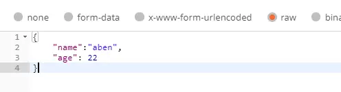

```java
@RequestMapping(value="/index")
public String index(@RequestBody String requestParam){
	return "bbb";
}
```

上例中，可以接受到以raw方式传递的参数

**示例2：**

**x-www-form-urlencoded** 的方式

**x-www-form-urlencoded** 是一种把表单数据编码成单一数据的格式，所以可以使用 **@RequestBody** 来获取

```java
@RequestMapping(value="/index2", consumes="application/x-www-form-urlencoded")
public String index2(@RequestBody String requestParam){
	return "bbb";
}
```

**示例3：**

**@RequestBody** 能够将单一形式的参数转换成Java类，这需要参数的key和java类的属性一对一相同，不同的属性则设置为null

```java
@RequestMapping(value="/index")
public String index(@RequestBody Product product){
	return "aaa";
}
```

如上，执行后，controller 内的参数能够自动解析raw方式的传参

#### 6、@ResponseBody

**@ResponseBody** 注解的作用是将 java 对象转换位 json 格式的数据

声明如下：

```java
@Target({ElementType.TYPE, ElementType.METHOD})
@Retention(RetentionPolicy.RUNTIME)
@Documented
public @interface ResponseBody {
}
```

由此可知

- 该注解可以用在类和方法上；
- 程序运行时有效；
- 无参数属性；

**@ResponseBody** 注解可以将 controller 方法返回的 java 对象通过适当的转换器转换成指定的格式，并返回到 http response 的 body 区内，通常返回 json 和 xml

使用该注解后，不会走视图处理器，而是直接将数据写入到流中，效果等同于使用 response 对象输出指定格式的数据


### Spring定时任务


#### @EnableScheduling

在启动类上加@EnableScheduling注解；允许支持定时器。

```java
@SpringBootApplication
@EnableScheduling //允许支持定时器了
public class SpringbootWebsocketSpringdataJpaApplication {

    public static void main(String[] args) {
        SpringApplication.run(SpringbootWebsocketSpringdataJpaApplication.class, args);
    }
}
```

#### @Scheduled

在函数上添加@Scheduled注解；以添加task任务。要注意的是，需要在被识别为组件的类中使用；如：@Component注解的类。

```java
@Component
public class TestScheduler {
    @Scheduled(cron="0/30 * * * * ?")
    private void task(){
        System.err.println("这句话每30秒打印一次");
    }
}
```

#### fixed定时语法

明确间隔时间

|参数|作用|
|---|--|
|fixedDelay|上一次执行完毕时间点之后多长时间再执行|
|fixedDelayString|上一次执行完毕时间点之后多长时间再执行|
|fixedRate|上一次开始执行时间点之后多长时间再执行|
|fixedRateString|上一次开始执行时间点之后多长时间再执行|
|initialDelay|第一次延迟多长时间后再执行|
|initialDelayString|第一次延迟多长时间后再执行|

```java
@Component
public class TestScheduler {

    @Scheduled(fixedDelay=5000)
    private void task1(){
        System.err.println("执行完成后，5s再执行。");
    }

    @Scheduled(fixedDelayString='5000')
    private void task2(){
        System.err.println("执行完成后，5s再执行。");
    }

    @Scheduled(fixedRate=5000)
    private void task3(){
        System.err.println("执行开始后，5s再执行。");
    }

    @Scheduled(fixedRateString='5000')
    private void task4(){
        System.err.println("执行开始后，5s再执行。");
    }

    @Scheduled(initialDelay=10000, fixedRateString='5000')
    private void task5(){
        System.err.println("第一次为延时10s后执行;以后为：执行开始后，5s再执行。");
    }
}
```


#### crond定时语法

**cron表达式语法：[秒] [分] [小时] [日] [月] [周] [年]**

> 注：[年]不是必须的域，可以省略[年]，则一共6个域

|序号|说明|是否必填|允许填的值|允许通配符|
|--|--|--|--|--|
|1|秒|	是|	0~59|	, - * /|
|2|分|	是|	0~59|	, - * /|
|3|时|  是|0~23	|, - * /|
|4|日|	是|	1~31|	, - * ? / L W|
|5|月|	是|	1-12或JAN-DEC	|, - * /|
|6|周|	是|	1-7或SUN-SAT	|, - * ? / L W|
|7|年|	否|	empty 或1970-2099	|, - * /|

##### 通配符说明
1. *表示所有值。 例如:在分的字段上设置 *,表示每一分钟都会触发。
2. ? 表示不指定值。使用的场景为不需要关心当前设置这个字段的值。例如:要在每月的10号触发一个操作，但不关心是周几，所以需要周位置的那个字段设置为”?” 具体设置为 0 0 0 10 * ?
3. -表示区间。例如 在小时上设置 “10-12”,表示 10,11,12点都会触发。
4. , 表示指定多个值，例如在周字段上设置 “MON,WED,FRI” 表示周一，周三和周五触发
5. / 用于递增触发。如在秒上面设置”5/15” 表示从5秒开始，每增15秒触发(5,20,35,50)。 在月字段上设置’1/3’所示每月1号开始，每隔三天触发一次。
6. L 表示最后的意思。在日字段设置上，表示当月的最后一天(依据当前月份，如果是二月还会依据是否是润年[leap]), 在周字段上表示星期六，相当于”7”或”SAT”。如果在”L”前加上数字，则表示该数据的最后一个。例如在周字段上设置”6L”这样的格式,则表示“本月最后一个星期五”
7. W 表示离指定日期的最近那个工作日(周一至周五). 例如在日字段上置”15W”，表示离每月15号最近的那个工作日触发。如果15号正好是周六，则找最近的周五(14号)触发, 如果15号是周未，则找最近的下周一(16号)触发.如果15号正好在工作日(周一至周五)，则就在该天触发。如果指定格式为 “1W”,它则表示每月1号往后最近的工作日触发。如果1号正是周六，则将在3号下周一触发。(注，”W”前只能设置具体的数字,不允许区间”-“)。
8. #序号(表示每月的第几个周几)，例如在周字段上设置”6#3”表示在每月的第三个周六.注意如果指定”#5”,正好第五周没有周六，则不会触发该配置(用在母亲节和父亲节再合适不过了) ；小提示：’L’和 ‘W’可以一组合使用。如果在日字段上设置”LW”,则表示在本月的最后一个工作日触发；周字段的设置，若使用英文字母是不区分大小写的，即MON与mon相同。

示例：

	每隔5秒执行一次：*/5 * * * * ?

	每隔1分钟执行一次：0 */1 * * * ?
	
	每天23点执行一次：0 0 23 * * ?
	
	每天凌晨1点执行一次：0 0 1 * * ?
	
	每月1号凌晨1点执行一次：0 0 1 1 * ?
	
	每月最后一天23点执行一次：0 0 23 L * ?
	
	每周星期天凌晨1点实行一次：0 0 1 ? * L
	
	在26分、29分、33分执行一次：0 26,29,33 * * * ?
	
	每天的0点、13点、18点、21点都执行一次：0 0 0,13,18,21 * * ?


### Spring动态定时任务


#### 思路
动态定时任务要求，可以动态的增加、删除、开始、结束定时任务；所以使用注解的方式是一定不行的。

这里需要使用 **ThreadPoolTaskScheduler**  定时线程池； 任务以**Runnable** 的形式加载。

Runnable可以多种形式加载，这里使用适用性最好的cron表达式作为定时规则。

#### 代码实现
1、任务执行

这里简化代码，体现主体思路：
```java
public Response start(Long taskId) {
    try {
        Task task = schedulerTaskMapper.findById(taskId);
        //获取并实例化Runnable任务类
        TaskRunnable taskRunnable = taskRunnableMapper.findById(task.getRunnableId());
        Class<?> clazz = Class.forName(taskRunnable.getClasspath());
        Taskable runnable = (Taskable)clazz.newInstance();
        //Cron表达式
        CronTrigger cron = new CronTrigger(task.getExpr());
        //执行，并put到runTasks
        TaskSchedulerServiceImpl.runTasks.put(
                taskId, Objects.requireNonNull(this.threadPoolTaskScheduler.schedule(runnable, cron)));
        task.setStatus(new Long(1));
        schedulerTaskMapper.update(task);
        return Response.buildSuccess();
    } catch (ClassNotFoundException | InstantiationException | IllegalAccessException e) {
        e.printStackTrace();
        return Response.buildFailure("400", "任务启动失败");
    }
}
```

2、停止任务

```java
public Response stop(Long taskId) {
    if (!TaskSchedulerServiceImpl.runTasks.containsKey(taskId)) {
        return Response.buildSuccess();
    }
    TaskSchedulerServiceImpl.runTasks.get(taskId).cancel(true);
    TaskSchedulerServiceImpl.runTasks.remove(taskId);
    Task task = schedulerTaskMapper.findById(taskId);
    task.setStatus(new Long(0));
    schedulerTaskMapper.update(task);
    return Response.buildSuccess();
}
```

3、保存任务
```java
public Response save(TaskDTO taskDTO) {
    Task task = new Task();
    BeanUtils.copyProperties(taskDTO, task);
    if ((null == task.getId()) || (null == schedulerTaskMapper.findById(task.getId()))) {
        task.setId(null);
        schedulerTaskMapper.add(task);
    } else {
        this.stop(task.getId());
        schedulerTaskMapper.update(task);
    }
    return Response.buildSuccess();
}
```

4、删除任务
```java
public Response delete(Long taskId) {
    this.stop(taskId);
    schedulerTaskMapper.delete(taskId);
    return Response.buildSuccess();
}
```

https://github.com/su-dd/learning/tree/main/src/spring/topic/40Demo
#### API介绍
ThreadPoolTaskScheduler有多种方式执行Runnable：

1. schedule(Runnable task, Date stateTime)，在指定时间执行一次定时任务

2. schedule(Runnable task, Trigger trigger)，动态创建指定表达式cron的定时任务

3. scheduleAtFixedRate(Runnable task, Date startTime, long period)，从指定的时间开始以指定间隔时间（以毫秒为单位）执行一次任务，间隔时间为前一次执行开始到下一次任务开始时间

4. scheduleAtFixedRate(Runnable task, long period)，从现在开始以指定间隔时间（以毫秒为单位）执行一次任务，间隔时间为前一次执行开始到下一次任务开始时间

5. scheduleWithFixedDelay(Runnable task, Date startTime, long delay)，从指定的时间开始以指定间隔时间（以毫秒为单位）执行一次任务，间隔时间为前一次执行完成到下一次任务开始时间

6. scheduleWithFixedDelay(Runnable task, Duration delay)，从现在开始以指定间隔时间（以毫秒为单位）执行一次任务，间隔时间为前一次执行完成到下一次任务开始时间

### Spring注册失败


#### 问题描述
当使用 **@AutoWired** 标记类的 **成员变量a** 做自动注入时，当我们使用new的方式创建**类对象A**时，就会发现**A**中的**a** 为空。
强行使用**a**，就会报错: java.lang.NullPointerException

例：任务A对任务B的调用，代码如下

```java
@Component
public class TaskA {

    @Autowired
    TaskB taskB;

    void run() {
        System.out.println("TaskA is run");
        taskB.run();
    }
}
```

```java
@Component
public class TaskB {

    void run() {
        System.out.println("TaskB is run");
    }
}
```
调用A的方式：
```java
@SpringBootApplication
public class Demo40 implements CommandLineRunner {
    @Autowired
    TaskA taskA;

    @Override
    public void run(String... args) throws Exception {
        // 方式1：@Autowired注解的对象进行调用
        System.out.println("test1:");
        taskA.run();
    }

    public static void main(String[] args) {
        SpringApplication.run(Demo40.class, args);

        System.out.println("test2:");
        // 方式2: new初始化的变量进行调用
        try {
            TaskA task = new TaskA();
            task.run();
        } catch (Exception e) {
            e.printStackTrace();
        }
    }
}
```

结果：
```
test1:
TaskA is run
TaskB is run
test2:
TaskA is run
java.lang.NullPointerException
	at com.spring.demo40.TaskA.run(TaskA.java:14)
	at com.spring.demo40.Demo40.main(Demo40.java:27)
```

#### 原因

**依赖注入的主要目的是让容器去产生一个对象的实例，然后交给spring容器管理，在整个生命周期中使用他们，更加方便灵活。**

@Autowired是根据类型进行自动装配，并且是从容器中获取实例并进行注入，我们称之为依赖注入。
     
而new()是直接创建一个新的对象。

这个是他们最本质的区别，一个是从spring容器获取，一个是直接创建新对象。即Autowired是全局实例，而new创建的是仅可以在当前类使用。

#### 思路
既然New不是使用spring容器获取，那就意味着：如果通过Spring容器获取，就可以随时随地创建程序需要的对象。

这是我们需要引入：**ApplicationContextAware**

```java
public interface ApplicationContextAware extends Aware {
    void setApplicationContext(ApplicationContext var1) throws BeansException;
}
```

程序启动后，Spring容器会检测容器中的所有Bean，如果发现某个Bean实现了ApplicationContextAware接口，Spring容器会在创建该Bean之后，自动调用该Bean的 **setApplicationContextAware()** 方法，并将容器 **ApplicationContext** 本身作为参数传给该方法。

如果这时将，ApplicationContext 存入变量中，后面就可以直接使用，ApplicationContext实例来进行从Spring容器取对象的操作。


#### 代码方案：
```java

/**
 * 动态加载Bean
 */
@Component
public class SpringContextUtil implements ApplicationContextAware {
    // Spring应用上下文
    private static ApplicationContext applicationContext;

    @Override
    public void setApplicationContext(ApplicationContext applicationContext) throws BeansException {
        SpringContextUtil.applicationContext = applicationContext;
    }

    public static ApplicationContext getApplicationContext() {
        return applicationContext;
    }

    public static Object getBean(String name) throws BeansException {
        return applicationContext.getBean(name);
    }

    public static  <T> T getBean(Class<T> requiredType) {
        return applicationContext.getBean(requiredType);
    }
}

```

**使用方式：**
```java
System.out.println("test3:");
// 方式3: 通过SpringContext封装创建
try {
    TaskA task = SpringContextUtil.getBean(TaskA.class);
    task.run();
} catch (Exception e) {
    e.printStackTrace();
}

System.out.println("test4:");
// 方式4: 通过SpringContext封装创建
try {
    TaskA task = (TaskA) SpringContextUtil.getBean("taskA");
    task.run();
} catch (Exception e) {
    e.printStackTrace();
}
```

https://github.com/su-dd/learning/tree/main/src/spring/topic/40Demo


### SpringAPI文档knife4j

#### knife4j背景介绍

knife4j是为Java MVC框架集成Swagger生成Api文档的增强解决方案；

Knife4j的前身是swagger-bootstrap-ui,前身swagger-bootstrap-ui是一个纯swagger-ui的ui皮肤项目。

但是随着项目的发展,面对越来越多的个性化需求,不得不编写后端Java代码以满足新的需求；因此,项目正式更名为knife4j,取名knife4j是希望她能像一把匕首一样小巧,轻量,并且功能强悍。
<!--more-->
#### 功能
地址Url为：**服务布置url/doc.html**

例：127.0.0.1/demo/doc.html

1、接口文档显示


2、接口调试


3、Swagger Models


4、支持导出离线Markdown、Html功能


#### 教程
1、在maven项目的pom.xml中引入Knife4j的依赖包：
```xml
<dependency>
    <groupId>com.github.xiaoymin</groupId>
    <artifactId>knife4j-spring-boot-starter</artifactId>
    <version>2.0.7</version>
</dependency>
```

2、创建Swagger配置依赖
```java
@Configuration
@EnableSwagger2WebMvc
public class Knife4jConfiguration {

    @Bean(value = "defaultApi2")
    public Docket defaultApi2() {
        Docket docket=new Docket(DocumentationType.SWAGGER_2)
                .apiInfo(new ApiInfoBuilder()
                        //.title("swagger-bootstrap-ui-demo RESTful APIs")
                        .description("## swagger-bootstrap-ui-demo RESTful APIs")
                        .termsOfServiceUrl("http://www.xx.com/")
                        .contact("xx@qq.com")
                        .version("1.0")
                        .build())
                //分组名称
                .groupName("2.X版本")
                .select()
                //这里指定Controller扫描包路径
                .apis(RequestHandlerSelectors.basePackage("com.glodon.controller"))
                .paths(PathSelectors.any())
                .build();
        return docket;
    }
}
```

3、代码常用注解
> @Api：用在controller类，描述API接口
> 
> @ApiOperation：描述接口方法
> 
> @ApiModel：描述对象
> 
> @ApiModelProperty：描述对象属性
> 
> @ApiImplicitParams：描述接口参数
> 
> @ApiResponses：描述接口响应
> 
> @ApiIgnore：忽略接口方法

```java
@Api(tags = "文件处理")  // 制定api分类名称
@Slf4j
@Controller
public class FilePublisherController {

    @ApiOperation(value = "上传")  // 制定api接口名称
    @ApiImplicitParams({
            @ApiImplicitParam(name = "UserID", value = "用户Id", defaultValue = "123456", required = true, dataType = "String", paramType="header")
    }) // 参数定义
    @PostMapping("/UploadFile")
    @ResponseBody
    public CommonResult uploadFile(HttpServletRequest request, @RequestParam("file") MultipartFile file, HttpServletResponse response) {

    }

    @ApiOperation(value = "下载")
    @PostMapping("/DownLoadFile")
    @ResponseBody
    public CommonResult downLoadFile(@RequestBody ParseFileMessage parseFileMsg, HttpServletRequest request, HttpServletResponse response){
    }
}
```


## 工具

- cmake
	- [简述](tool/cmake/1.CMake简述.md)
	- [详解](tool/cmake/2.CMake详解.md)

- Git
  - [Git基础与命令](tool/git/10.Git基础与命令.md)
  - [Git分支-分支原理](tool/git/20.Git分支-分支原理.md)
  - [Git分支的新建与合并-分支操作](tool/git/30.Git分支的新建与合并-分支操作.md)
  - [Git分支管理-查看分支](tool/git/40.Git分支管理-查看分支.md)
  - [Git分支开发工作流](tool/git/50.Git分支开发工作流.md)
  - [Git分支-远程分支](tool/git/60.Git分支-远程分支.md)
  - [Git分支-变基](tool/git/70.Git分支-变基.md)
  - [Git工具-查看修订版本](tool/git/80.Git工具-查看修订版本.md)
  - [Git工具-交互式暂存](tool/git/90.Git工具-交互式暂存.md)
  - [Git工具-重写历史](tool/git/100.Git工具-重写历史.md)
  - [Git工具-重置揭密](tool/git/110.Git工具-重置揭密.md)

- [nvm](tool/nvm/1.NVM使用.md)

## 沟通
- [《我不是教你诈》](readbook/我不是教你诈/我不是教你诈.md)
- [《掌控谈话》](readbook/掌控谈话/掌控谈话.md)

## 参考

 [COLA 4.0：应用架构的最佳实践](https://links.jianshu.com/go?to=https%3A%2F%2Fblog.csdn.net%2Fsignificantfrank%2Farticle%2Fdetails%2F110934799)

[knife4j官网](https://doc.xiaominfo.com/knife4j/)

[Swagger官网](https://swagger.io/docs/)

<https://en.cppreference.com/w/cpp/20>

