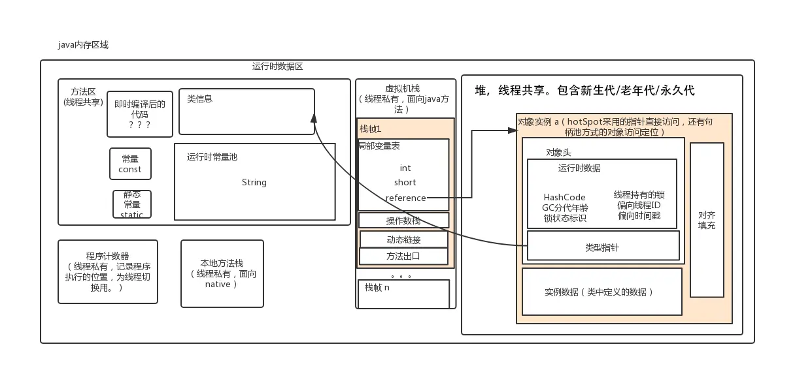

## 环境

### 认识JDK和JRE

> JRE (Java Runtime Environment) ：是Java程序的运行时环境，包含 JVM 和运行时所需要的 核心类库 。
> JDK (Java Development Kit)：是Java程序开发工具包，包含 JRE 和开发人员使用的工具。
> 我们想要运行一个已有的Java程序，那么只需安装 JRE 即可。
> 我们想要开发一个全新的Java程序，那么必须安装 JDK 。  
>


### 内存划分

Java中内存分为5个部分：栈、堆、方法区、本地方法区、寄存器

栈（虚拟机栈）：局部变量，java方法；用完就释放。（java的方法是通过压栈出栈的方执行的）

堆：存储new出来的东西，用完后有垃圾回收器释放。

方法区：主要存 类元数据、常量 等等

本地方法栈：作用同虚拟机栈，提供的是Native方法服务；即提供非Java方法的使用。本地方法可以通过 JNI(Java Native Interface)来访问虚拟机运行时的数据区，甚至可以调用寄存器，具有和 JVM 相同的能力和权限

寄存器：CPU使用的位置。

### Java8前-内存


### Java8后-内存


## 基础语法

### 命名规则

> **标识符**
>
> 指在程序中，我们自己定义内容。比如类的名字、方法的名字和变量的名字等等，都是标识符。

> **命名规则： 硬性要求**
>
> - 标识符可以包含 英文字母26个(区分大小写) 、 0-9数字 、 $（美元符号） 和 _（下划线） 。
> - 标识符不能以数字开头。
> -  标识符不能是关键字。   


>   **命名规范： 软性建议**
>
>   - 类名规范：首字母大写，后面每个单词首字母大写（大驼峰式）。
>   - 方法名规范： 首字母小写，后面每个单词首字母大写（小驼峰式）。
>   - 变量名规范：全部小写。  

### 基本类型

8个基本类型

| 数据类型     | 关键字         | 内存占用 | 取值范围               |
| ------------ | -------------- | -------- | ---------------------- |
| 字节型       | byte           | 1个字节  | -128~127               |
| 短整型       | short          | 2个字节  | -32768~32767           |
| 整型         | int（默认）    | 4个字节  | -2的31次方~2的31次方-1 |
| 长整型       | long           | 8个字节  | -2的63次方~2的63次方-1 |
| 单精度浮点数 | float          | 4个字节  | 1.4013E-45~3.4028E+38  |
| 双精度浮点数 | double（默认） | 8个字节  | 4.9E-324~1.7977E+308   |
| 字符型       | char           | 2个字节  | 0-65535                |
| 布尔类型     | boolean        | 1个字节  | true，false            |

### 类

**入口函数为：main函数**

```java
public class HelloWorld {
    public static void main(String[] args) {
        System.out.println("Hello World !");
    }
}
```

**类中包括 ：静态代码块，构造方法，成员变量、成员方法、类变量、类方法**

执行顺序为：

​	静态代码 > 构造方法 > 成员方法

​	静态代码 > 类方法

>  静态代码在构造函数 和 本类的main方法之前执行，且只执行一次；可以用做初始化静态数据等工作。
>
> PS：main方法可以认为是一个特殊的类方法


**默认构造**

> 同C++：
>
> 如果你不提供构造方法，系统会给出无参数构造方法。
>
> 如果你提供了构造方法，系统将不再提供无参数构造方法。  


**抽象类，抽象方法**

> abstract修饰的方法就是抽象方法，抽象方法没有方法体。
>
>  如果一个类存在抽象方法，则这个类为抽象类，需要用**abstract **修饰。
>
> 抽象类不可以实例化对象，需要一个子类继承这个类，实现所有的抽象方法，才能实例对象。

```Java
// abstract修饰的类需要
public abstract class Animal {
	public abstract void run()；
}

public class Cat extends Animal {
    @Override // 标识 方法重写 子类中出现与父类一模一样的方法；（可以用于编译检测）
    public void run() {
        System.out.println("Cat eat ... ");
    }
}
```

成员变量的默认值：

|          | 数据类型                       | 默认值   |
| -------- | ------------------------------ | -------- |
| 基本类型 | 整数（byte，short，int，long） | 0        |
|          | 浮点数（float，double）        | 0.0      |
|          | 字符（char）                   | '\u0000' |
|          | 布尔（boolean）                | false    |
| 引用类型 | 数组，类，接口                 | null     |

**Demo**:

```java
$[Person.java]
public class Person {
    // 成员变量
    private String name;
    // 类变量
    public static String nation;
    // 静态代码块
    static {
        System.out.println("Person static !");
        nation = "中国";
    }
    // 类方法
    public static String getNation() {
        return nation;
    }
    // main方法
    public static void main(String[] args) {
        System.out.println("Person main running ... ");
        Person person = new Person();
    }
    // 无参构造
    public Person() {
        System.out.println("无参构造");
    }
    // 有参构造
    public Person(String name) {
        System.out.println("有参构造");
        this.name = name;
    }
    // 成员方法
    public String getName() {
        return name;
    }
    public void setName(String name) {
        this.name = name;
    }
}
/*
Person static !
Person main running ... 
无参构造
*/
```

```java
public class Demo {
    public static void main(String[] args) {
        System.out.println("Demo->main方法执行。。。 ");
        Person person1 = new Person();
        Person person2 = new Person("张三", "男", 18);
    }
}
/*
Demo->main方法执行。。。 
Person static !
中国
无参构造
有参构造
*/
```

### 继承

**类继承**

> 关键字：extends，Java是单继承的（这点有别C++）。


**接口实现**

> 关键字： interface（接口）、 implements（实现）
>
> 1. 无法定义成员变量，但是可以定义常量，其值不可以改变，默认使用public static final修饰。
> 2. 没有构造方法，不能创建对象。
> 3. 没有静态代码块。  

**一个类可是实现多个接口**

> 1. 实现所有抽象方法的类才能实例化，如果没没有实例化所有的接口即为抽象类
> 2. 多个接口存在同一个抽象方法，实现一次即可

```java
class 类名 [extends 父类名] implements 接口名1,接口名2,接口名3... {
	// 重写接口中抽象方法【必须】
	// 重写接口中默认方法【不重名时可选】
}
```

**接口之间可以继承**

> 1. 一个接口可以继承一个接口，并添加自己的方法
> 2. 一个接口也可以继承多个接口

```java
public interface 接口名 extends 接口名1,接口名2,接口名3... {
}
```

**默认方法 & 静态方法 **

```java
默认方法：使用 default 修饰，不可省略，供子类调用或者子类重写。
静态方法：使用 static 修饰，供接口直接调用。
public interface InterFaceName {
	public default void method() {
		// 执行语句
	}
	public static void method2() {
		// 执行语句
	}
}
```

> **私有方法和私有静态方法**
> 私有方法：使用 private 修饰，供 **接口中** 的默认方法或者静态方法调用。  


**类型转换  **

**基础类型** ：基础类型之间的转换，如char类型转为int;为**强制转换**

```java
int a = (int) word
```


**向上转型** ：子类类型向父类类型向上转换的过程  ,如用一个父类引用指向一个子类对象  ；为**默认转换**

```java
父类类型 变量名 = new 子类类型();
如：Animal a = new Cat();
```

**向下转型** ：父类类型向子类类型向下转换的过程，  为**强制转换**

```java
子类类型 变量名 = (子类类型) 父类变量名;
如:Cat c =(Cat) a;
```

**判断类型**

向下转型存在危险；

方式一：

用**instanceof** 判断类型。

```java
// 基础类型不能这么处理
if (animal instanceof Cat)
{
    Cat c =(Cat) animal;
}
```

方式二：

用**isInstance** 判断

```java
String str = "abcd";
//自身类.class.isInstance(自身实例或子类实例)  返回true 
System.out.println(String.class.isInstance(str)); //true;
```

方式三：

用**isAssignableFrom**

```java
String str = "abcd";
// 自身类.class.isAssignableFrom(自身类或子类.class)  返回true
System.out.println(String.class.isAssignableFrom(str.getClass())); //true;
```

### this 和super

在Java中我们也会遇到一些问题，如在子类构造中调用父类的构造函数；在子类调用父类的方法；获得当前对象的引用。。

> super ：代表父类的存储空间标识(可以理解为父亲的引用)。
> this ：代表当前对象的引用(谁调用就代表谁)。  

**用法一：访问成员**

```java
this.成员变量 ‐‐ 本类的
super.成员变量 ‐‐ 父类的
this.成员方法名() ‐‐ 本类的
super.成员方法名() ‐‐ 父类的	
```

**用法二：访问成员**

```java
this(...) ‐‐ 本类的构造方法
super(...) ‐‐ 父类的构造方法
```

> 子类的每个构造方法中均有默认的super()，调用父类的空参构造。手动调用父类构造会覆盖默认的super()。
> super() 和 this() 都必须是在构造方法的第一行，所以不能同时出现。  

## 稍微复杂一些的语法

### 内部类

将一个类A定义在另一个类B里面，里面的那个类A就称为内部类，B则称为外部类  

```java
class 外部类 {
	class 内部类{
	}
}
```

**访问特点**

> 内部类可以直接访问外部类的成员，包括私有成员。
> 外部类要访问内部类的成员，必须要建立内部类的对象。  

内部类仍然是一个独立的类，在编译之后会内部类会被编译成独立的.class文件，但是前面冠以外部类的类名
和  $ 符号 。

比如，Person$Leg.class  

```java
public class Person {
	private boolean live;

    public class Leg {
        public void run() {
            if (live) {
                System.out.println("running .... ");
            } else {
                System.out.println("dead");
            }
        }
    }
    public Person() {
        this.live = true;
    }
    public Person(boolean live) {
        this.live = live;
    }
    public boolean isLive() {
        return live;
    }
    public void setLive(boolean live) {
        this.live = live;
    }
}
```

```Java
public class Demo {
    public static void main(String[] args) {
        Person person = new Person();
        Person.Leg leg1 = person.new Leg();
        leg1.run();
    }
}
```


### 匿名内部类

内部类的简化写法。它的本质是一个 **带具体实现的 ** **父类或者父接口的**  匿名的 **子类对象**。
开发中，最常用到的内部类就是匿名内部类了。

>  要素：
>
> 1. 父类 或 父接口
> 2. 子类实现

```java
new 父类名或者接口名(){
    // 方法重写
    @Override
    public void method() {
    // 执行语句
    }
};  
```

```java
public interface Eat {
    public abstract void eat();
}
public class Demo {
    public static void main(String[] args) {
        Eat eat = new Eat() {
            @Override
            public void eat() {
                System.out.println("eat fruit");
            }
        };
        eat.eat();
    }
}
```


## JavaBean


JavaBean 是 Java语言编写类的一种标准规范。符合 JavaBean 的类，要求类必须是具体的和公共的，并且具有无
参数的构造方法，提供用来操作成员变量的 set 和 get 方法。  

```java
public class ClassName{
//成员变量
//构造方法
//无参构造方法【必须】
//有参构造方法【建议】
//成员方法
//getXxx()
//setXxx()
}
```


## Java容器

### Collection 集合

#### 1 集合体系结构

- 集合类的特点

  提供一种存储空间可变的存储模型，存储的瓣容量可以随时发生改变

- 集合类的体系图


#### 2 Collection集合概述和基本使用

- Collection集合概述
  - 是单例集合的顶层接口 ,它表示一组对象,这些对象也称为Collection的元素
  - JDK不提供此接口的任何直接实现,它提供更具体的子接口(如Set和List)实现

- Collection集合基本使用

```java
public class CollectionDemo {
    public static void main(String[] args) {
        //创建collection集合的对象
        Collection<String> c = new ArrayList<String>();
        //添加元素：boolean add(E e)
        c.add("hello");
        c.add("worid");
        c.add("java");
        //输出集合对象
        System.out.println(c);
    }
}
```

#### 3 Collection集合的常用方法

| **方法名**                 | **说明**                          |
| -------------------------- | --------------------------------- |
| boolean add(E e)           | 添加元素                          |
| boolean remove(Object o)   | 从集合中移除指定的元素            |
| void clear()               | 清空集合中的元素                  |
| boolean contains(Object o) | 判断集合中是否 g 旨定的元素       |
| boolean isEmpty()          | 判断集合是否为空                  |
| int size()                 | 集合的长度,也就是集合中元素的个数 |

 

#### 4 Collection集合的遍历

- 迭代器的介绍
  - 迭代器,集合的专用
  - Iterator iterator():返回此集合中元素的迭代器,通过集合的iterator。方法得到
  - 迭代器是通过集合的iterator。方法得到的,所以我们说它是依赖于集合而存在的

- Collection集合的遍历

```java
public class IteratorDemo {
    public static void main(String[] args) {
        //创建集合对象
        Collection<String> c = new ArrayList<String>();
        //添加元素
        c.add("hello");
        c.add("world");
        c.add("java");
        c.add("javaee");

        //Iterator<E> iterator():返回此集合中兀素的迭代器,通过集合的iterator()方法得到
        Iterator<String> it = c.iterator();
        //用whi1e循环改进元素的判断和获取
        while (it.hasNext()) {
            String s =it.next();
            System.out.println(s);
        }
    }
}
```

### List

#### 1 List集合概述和特点

- List集合概述
  - 有序集合（也称为序列），用户可以精确控制列表中每个元素的插入位置。用户可以通过整数索引访问元 素,并搜索列表中的元素
  - 与Set集合不同，列表通常允许重复的元素

- List集合特点
  - 有索引
  - 可以存储重素
  - 元素存取有序

#### 2 List集合的特有方法

| **方法名**                     | **描述**                               |
| ------------------------------ | -------------------------------------- |
| void add(int index, E element) | 在此集合中的指定位置插/M旨定的元素     |
| E remove(int index)            | 删除指定索引处的元素,返回被删除的元素  |
| E set(int index, E element)    | 修改J旨定索引处的元素,返回被修改的元素 |
| E get(int index)               | 返回指定索引处的元素                   |

#### 3 List集合子类的特点

- ArrayList 集合
  - 底层是数组结构实现,查询快、增删慢

- LinkedList集合
  - 底层是链表结构实现,查询慢、增删快
  - 特有方法

| **LinkedList 特有方法 方法名** | **说明**                         |
| ------------------------------ | -------------------------------- |
| public void addFirst(E e)      | 在该列券头插涌定的元素           |
| public void addLast(E e)       | 樹旨定的元素斷到此列表的末尾     |
| public E getFirst()            | 返回此列表中的第一个元素         |
| public E getLast()             | 返回此列表中的最后一个元素       |
| public E removeFirst()         | 从此列表中删除并返回第一个元素   |
| public E removeLast()          | 从此列表中删除并返回最后一个元素 |

#### 4 集合的案例-List集合存储学生对象并遍历

- 案例需求  

  创建一个存储学生对象的集合,存储3个学生对象,使用程序实现在控制台遍历该集合  

- 代码实现  

```java
public class Student {
    private String name;
    private int age;
    public Student(){

    }
    public Student(String name,int age){
        this.name=name;this.age=age;
    }
    public String getName(){
        return name;
    }
    public void setName(String name){
        this.name=name;
    }
    public int getAge(){
        return age;
    }
    public void setAge(int age){
        this.age=age;
    }
}
```

- 测试类  

```java
public class ListDemo {
    public static void main(String[] args) {

        //创建List集合对象
        List<Student> list=new ArrayList<Student>();

        //创建学生对象
        Student s1 = new Student("林青霞",30);
        Student s2 = new Student("张曼玉",35);
        Student s3 = new Student("王祖贤",33);

        //把学生添加到集合
        list.add(s1);
        list.add(s2);
        list.add(s3);

        //迭代器方式
        Iterator<Student> it=list.iterator();
        while (it.hasNext()) {
            Student s = it.next();
            System.out.println(s.getName()+","+s.getAge());
        }

        System.out.println("--------");

        //for循环方式
        for(int i=0; i < list.size(); i++) {
            Student s = list.get(i);
            System.out.println(s.getName()+","+s.getAge());
        }
    }
}

```

#### 5 并发修改异常

- 出现的原因
  
  - 迭代器遍历的过程中，通过集合对象修改了集合中的元素，造成了迭代器获取元素中判断预期修改值和实际修改值不一致，则会出现：ConcurrentModificationException
- 解决的方案
  - 用for循环遍历,然后用集合对象做对应的操作即可
  - 使用列表迭代器ListIterator
    - 通过List集合的listlterator()方法得到,所以说它是Li st集合特有的迭代器
    - 用于允许程序员沿任一方向遍历的列表迭代器,在迭代期间修改列表,并获取列表中迭代器的当前位置
- 示例代码

```java
public class ListDemo2 {
    public static void main(String[] args) {
        // 创建集合对象
        List<String> list = new ArrayList<>();

        // 添加元素
        list.add("hello");
        list.add("world");

        //迭代器方式
        Iterator<String> it=list.iterator();
        while (it.hasNext()) {
            String s = it.next();
            if (s.equals("world")) {
                //list.add("java");  //ConcurrentModificationException
            }
        }

        // for循环方式
        for(int i=0; i < list.size(); i++) {
            String s = list.get(i);
            if (s.equals("world")) {
                list.add("java");
            }
        }

        //获取列表迭代器
        ListIterator<String> lit = list.listIterator();
        while (lit.hasNext()) {
            String s = lit.next();
            if(s.equals("world")) {
                lit.add("javaee");
            }
        }

        // 输出集合对象
        System.out.println(list);
    }
}
```


#### 6 增强for循环

- 定义格式
``` java
for(元素数据类型变量名:数组/集合对象名){
循环体;
}
```

- 示例代码
```java
public class ForDemo {
    public static void main(String[] args) {
        int[] arr = {1, 2, 3, 4, 5};
        for (int i : arr) {
            System.out.println(i);
        }
        System.out.println("--------");
        String[] strArray = {"hello", "world", "java"};
        for (String s : strArray) {
            System.out.println(s);
        }
        System.out.println("--------");
        List<String> list = new ArrayList<String>();
        list.add("hello");
        list.add("world");
        list.add("java");
        for (String s : list) {
            System.out.println(s);
        }
        System.out.println("--------");
        // 内部原理是一个Iterator迭代器
        for(String s : list) {
            if(s.equals("world")) {
        //        list.add("javaee"); //ConcurrentModificationException
            }
        }
    }
}
```

### set

#### 1 Set集合概述和特点
- Set集合的特点
   - 元素存取无序
   - 没有索引、只能通过迭代器或增强for循环遍历
   - 不能存储重复元素  

#### 2 Java哈希值
- 哈希值简介
   - 是JDK根据对象的地址或者字符串或者数字算出来的int类型的数值
- 如何获取哈希值
   - Object类中的 public int hashCode()：返回对象的哈希码值
- 哈希值的特点
   - 同一个对象多次调用 hashCode() 方法，返回的哈希值是相同的
   - 默认情况下，不同对象的哈希值是不同的。而重写hashCode()方法，可以实现让不同对象的哈希值相同  

#### 3 HashSet集合概述和特点

- HashSet集合的特点
	- 底层数据结构是哈希表
	- 对集合的迭代顺序不作任何保证，也就是说不保证存储和取出的元素顺序一致
    - 没有带索引的方法，所以不能使用普通for循环遍历
    - 由于是Set集合，所以是不包含重复元素的集合  
    - HashSet存储逻辑：
        
        
  
- 案例需求
  - 创建一个存储学生对象的集合，存储多个学生对象，使用程序实现在控制台遍历该集合
  - 要求：学生对象的成员变量值相同，我们就认为是同一个对象  
- 学生类：
```java
public class Student {
    private String name;
    private int age;
    public Student() {
    }
    public Student(String name, int age) {
        this.name = name;
        this.age = age;
    }
    public String getName() {
        return name;
    }
    public void setName(String name) {
        this.name = name;
    }
    public int getAge() {
        return age;
    }
    public void setAge(int age) {
        this.age = age;
    }
    @Override
    public boolean equals(Object o) {
        if (this == o)
            return true;
        if (o == null || getClass() != o.getClass())
            return false;
        Student student = (Student) o;
        if (age != student.age)
            return false;
        return name != null ? name.equals(student.name) : student.name == null;
    }
    @Override
    public int hashCode() {
        int result = name != null ? name.hashCode() : 0;
        result = 31 * result + age;
        return result;
    }
}
```

- 测试类
```java
public class HashSetDemo {
    public static void main(String[] args) {
        //创建HashSet集合对象
        HashSet<Student> hs = new HashSet<Student>();
        //创建学生对象
        Student s1 = new Student("林青霞", 30);
        Student s2 = new Student("张曼玉", 35);
        Student s3 = new Student("王祖贤", 33);
        Student s4 = new Student("王祖贤", 33);
        Student s5 = new Student("", 33);
        Student s6 = new Student("", 33);
        //把学生添加到集合
        hs.add(s1);
        hs.add(s2);
        hs.add(s3);
        hs.add(s4);
        hs.add(s5);
        hs.add(s6);
        hs.add(new Student());
        hs.add(new Student());
        //遍历集合(增强for)
        for (Student s : hs) {
            System.out.println(s.getName() + "," + s.getAge());
        }
    }
}
```


#### 4 LinkedHashSet集合概述和特点

- LinkedHashSet集合特点
  - 哈希表和链表实现的Set接口，具有可预测的迭代次序
  - 由链表保证元素有序，也就是说元素的存储和取出顺序是一致的
  - 由哈希表保证元素唯一，也就是说没有重复的元素  

- 测试类

```java
public class LinkedHashSetDemo {
    public static void main(String[] args) {
        //创建集合对象
        LinkedHashSet<String> linkedHashSet = new LinkedHashSet<String>();
        //添加元素
        linkedHashSet.add("hello");
        linkedHashSet.add("world");
        linkedHashSet.add("java");
        linkedHashSet.add("world");
        //遍历集合
        for(String s : linkedHashSet) {
            System.out.println(s);
        }
    }
}
```

  


#### 5 TreeSet集合概述和特点

- TreeSet集合概述
  - 元素有序，可以按照一定的规则进行排序，具体排序方式取决于构造方法
    - TreeSet(Comparator comparator) ：根据指定的比较器进行排序
    - TreeSet()：根据其元素的自然排序进行排序
  - 没有带索引的方法，所以不能使用普通for循环遍历
  - 由于是Set集合，所以不包含重复元素的集合  

- 案例需求
  - 存储学生对象并遍历
  - 要求：按照年龄从小到大排序，年龄相同时，按照姓名的字母顺序排序


##### 5.1 比较器排序Comparator

```java
public class TreeSetDemo {
    public static void main(String[] args) {
        // 创建集合对象
        TreeSet<Student> ts = new TreeSet<Student>(new Comparator<Student>() {
            @Override
            public int compare(Student o1, Student o2) {
                int num = o1.getAge() - o2.getAge();
                int num2 = num == 0 ? o1.getName().compareTo(o2.getName()) : num;
                return num2;
            }
        });

        //把学生添加到集合
        ts.add(new Student("xishi", 29));
        ts.add(new Student("wangzhaojun", 28));
        ts.add(new Student("diaochan", 30));
        ts.add(new Student("yangyuhuan", 33));
        ts.add(new Student("linqingxia",33));
        ts.add(new Student("linqingxia",33));

        //遍历集合
        for (Student s : ts) {
            System.out.println(s.getName() + "," + s.getAge());
        }
    }
}
```

##### 5.2 自然排序Comparable

- 学生类

```java
public class Student2 implements Comparable<Student2> {
    private String name;
    private int age;
    public Student2() {
    }
    public Student2(String name, int age) {
        this.name = name;
        this.age = age;
    }
    public String getName() {
        return name;
    }
    public void setName(String name) {
        this.name = name;
    }
    public int getAge() {
        return age;
    }
    public void setAge(int age) {
        this.age = age;
    }
    @Override
    public int compareTo(Student2 student2) {
        int num = this.getAge() - student2.getAge();
        int num2 = num == 0 ? this.getName().compareTo(student2.getName()): num;
        return num2;
    }
}
```

- 测试类

```java
public class TreeSetDemo2 {
    public static void main(String[] args) {
        //创建集合对象
        TreeSet<Student2> ts = new TreeSet<Student2>();
        //把学生添加到集合
        ts.add(new Student2("xishi", 29));
        ts.add(new Student2("wangzhaojun", 28));
        ts.add(new Student2("diaochan", 30));
        ts.add(new Student2("yangyuhuan", 33));
        ts.add(new Student2("linqingxia",33));
        ts.add(new Student2("linqingxia",33));
        //遍历集合
        for (Student2 s : ts) {
            System.out.println(s.getName() + "," + s.getAge());
        }
    }
}
```

  
### map

#### 1 Map集合概述和特点

- Map集合概述

  ```java
   interface Map<K,V> K：键的类型；V：值的类型
  ```


- Map集合的特点

  - 键值对映射关系
  - 一个键对应一个值
  - 键不能重复，值可以重复
  - 元素存取无序  

- 基本方法介绍  

| 方法名                              | 说明                         |
	| -------------------------- | -------------------------------|
	| V put(K key,V value)                | 添加元素            |
	| V remove(Object key)                | 根据键删除键值对元素   |
	| void clear()                        | 移除所有的键值对元素   |
	| boolean containsKey(Object key)     | 判断集合是否包含指定的键  |
	| boolean containsValue(Object value) | 判断集合是否包含指定的值 |
	| boolean isEmpty()                   | 判断集合是否为空   |
	| int size()             | 集合的长度，也就是集合中键值对的个数 |

- 获取方法

 |  方法名 | 说明  |
  | ----------| -------- |
  | V get(Object key)  | 根据键获取值    |
  | Set keySet()  | 获取所有键的集合   |
  | Collection values()   | 获取所有值的集合  |
  | Set<Map.Entry<K,V>> entrySet()  |  获取所有键值对对象的集合 |

####  2  遍历Map

- Set< K > keySet()，获取所有键的集合。
- Set<Map.Entry<K,V>> entrySet()，获取所有键值对对象的集合 。

```java
public class MapDemo {
    public static void main(String[] args) {
        //创建集合对象
        Map<String, String> map = new HashMap<String, String>();

        //添加元素
        map.put("张无忌", "赵敏");
        map.put("郭靖", "黄蓉");
        map.put("杨过", "小龙女");

        //获取所有键的集合。用keySet()方法实现
        Set<String> keySet = map.keySet();

        //遍历键的集合，获取到每一个键。用增强for实现
        for (String key : keySet) {
            //根据键去找值。用get(Object key)方法实现
            String value = map.get(key);
            System.out.println(key + "," + value);
        }

        System.out.println("-----------------------------");
        
        //获取所有键值对对象的集合
        Set<Map.Entry<String, String>> entries = map.entrySet();

        //遍历键值对对象的集合，得到每一个键值对对象
        for (Map.Entry<String, String> me : entries) {
            //根据键值对对象获取键和值
            String key = me.getKey();
            String value = me.getValue();
            System.out.println(key + "," + value);
        }
    }
}
```


#### 3 Properties特点

- Properties介绍

  - 是一个Map体系的集合类
  - Properties可以保存到流中或从流中加载
  - 属性列表中的每个键及其对应的值都是一个字符串  

- 特有方法  


  | 方法名| 说明 |
  | :-------------: | :----------------------------------: |
  | Object setProperty(String key, String value) | 设置集合的键和值，都是String类型，底层调用 Hashtable方法 put |
  | String getProperty(String key)  | 使用此属性列表中指定的键搜索属性 |
  | Set stringPropertyNames()  | 从该属性列表中返回一个不可修改的键集，其中键及其对应的 值是字符串 |
  

- 示例代码

```java
public class PropertiesDemo1 {
    public static void main(String[] args) {
        //创建集合对象
        Properties prop = new Properties();

        //存储元素
        prop.put("001", "林青霞");
        prop.put("002", "张曼玉");
        prop.setProperty("003", "王祖贤");

        //遍历集合
        Set<String> keySet = prop.stringPropertyNames();
        for (String key : keySet) {
            String value = prop.getProperty(key);
            System.out.println(key + "," + value);
        }
    }
}
```

##### 3.1 Properties和IO流相结合的方法

- 和IO流结合的方法

| 方法名                                        | 说明                                                         |
| --------------------------------------------- | ------------------------------------------------------------ |
| void load(InputStream inStream)               | 从输入字节流读取属性列表（键和元素对）                       |
| void load(Reader reader)                      | 从输入字符流读取属性列表（键和元素对）                       |
| void store(OutputStream out, String comments) | 将此属性列表（键和元素对）写入此 Properties表中，以适合于使用 load(InputStream)方法的格式写入输出字节流 |
| void store(Writer writer, String comments)    | 将此属性列表（键和元素对）写入此 Properties表中，以适合使用 load(Reader) |

- 示例代码

```java

public class PropertiesDemo2 {
    public static void main(String[] args) throws IOException {
        PropertiesDemo2 demo = new PropertiesDemo2();
        //把集合中的数据保存到文件
        demo.myStore();
        //把文件中的数据加载到集合
        demo.myLoad();
    }

    private void myLoad() throws IOException {
        Properties prop = new Properties();
        FileReader fr = new FileReader(this.getClass().getResource("/Stream/fw.txt").getPath());
        prop.load(fr);
        // 也可以
        //prop.load(this.getClass().getResourceAsStream("/Stream/fw.txt"));
        fr.close();
        System.out.println(prop);
    }

    private void myStore() throws IOException {
        Properties prop = new Properties();
        prop.setProperty("001", "林青霞");
        prop.setProperty("002", "张曼玉");
        prop.setProperty("003", "王祖贤");

        FileWriter fw = new FileWriter(this.getClass().getResource("/Stream/fw.txt").getPath());
        prop.store(fw, null);
        fw.close();
    }
}
```


## 泛型和数据结构

### 1 泛型概述和好处

- 泛型概述

  > 是JDK5中引入的特性，它提供了编译时类型安全检测机制，该机制允许在编译时检测到非法的类型。
  >
  > 它的本质是参数化类型，也就是说所操作的数据类型被指定为一个参数。
  >
  > 一提到参数，最熟悉的就是定义方法时有形参，然后调用此方法时传递实参。
  >
  > 那么参数化类型怎么理解呢？
  >
  > 顾名思义，就是将类型由原来的具体的类型参数化，然后在使用/调用时传入具体的类型。
  >
  > 这种参数类型可以用在类、方法和接口中，分别被称为泛型类、泛型方法、泛型接口

- 泛型定义格式
	- <类型>：				指定一种类型的格式。这里的类型可以看成是形参
	- <类型1,类型2…>：指定多种类型的格式，多种类型之间用逗号隔开。
  > 这里的类型可以看成是形参将来具体调用时候给定的类型可以看成是实参，
  >
  > 并且实参的类型只能是引用数据类型

- 泛型的好处

  - 把运行时期的问题提前到了编译期间
  - 避免了强制类型转换  

### 2 泛型类

- 定义格式  

  ```java
  修饰符 class 类名<类型> { }
  ```

- 示例代码

  - 泛型类

    ```java
    public class Generic<T> {
        private T t;
    
        public T getT() {
            return t;
        }
    
        public void setT(T t) {
            this.t = t;
        }
    }
    ```

  - 测试类

    ```java
    public class GenericDemo {
        public static void main(String[] args) {
            Generic<String> g1 = new Generic<String>();
            g1.setT("林青霞");
            System.out.println(g1.getT());
    
            Generic<Integer> g2 = new Generic<Integer>();
            g2.setT(30);
            System.out.println(g2.getT());
    
            Generic<Boolean> g3 = new Generic<Boolean>();
            g3.setT(true);
            System.out.println(g3.getT());
        }
    }
    ```

### 3 泛型方法

- 定义格式 

  ```java
  修饰符 <类型> 返回值类型 方法名(类型 变量名) { }
  ```

- 示例代码  

  - 泛型函数

    ```java
    public class Generic {
        public <T> void show(T t) {
            System.out.println(t);
        }
    }
    ```

  - 测试类

    ```java
    public class GenericDemo {
        public static void main(String[] args) {
            Generic g = new Generic();
            g.show("林青霞");
            g.show(30);
            g.show(true);
            g.show(12.34);
        }
    }
    ```

### 4 泛型接口

- 定义格式 

  ```java
  修饰符 interface 接口名<类型> { }
  ```

**示例代码**

- 泛型接口

```java
  public interface Generic<T> {
      void show(T t);
}
```

- 接口实现
  
```java
public class GenericImpl<T> implements Generic<T>{
    @Override
    public void show(T t) {
        System.out.println(t);
    }
}
  ```
  
- 测试类
  
```java
public class GenericDemo {
    public static void main(String[] args) {
      Generic<String> g1 = new GenericImpl<String>();
        g1.show("林青霞");

        Generic<Integer> g2 = neGenericImpl<Integer>();
        g2.show(30);
    }
}
```

### 5 类型通配符

- 类型通配符的作用
    - 为了表示各种泛型List的父类，可以使用类型通配符
  
- 类型通配符的分类
  - 类型通配符：<\?>
    - List<\?>：表示元素类型未知的List，它的元素可以匹配任何的类型
    - 这种带通配符的List仅表示它是各种泛型List的父类，并不能把元素添加到其中
  - 类型通配符上限：<\? extends 类型>
    - List<\? extends Number>：它表示的类型是Number或者其子类型
  - 类型通配符下限：<\? super 类型>
    - List<\? super Number>：它表示的类型是Number或者其父类型  
  
```java
  public class GenericDemo {
      public static void main(String[] args) {
          //类型通配符：<?>
          List<?> list1 = new ArrayList<Object>();
          List<?> list2 = new ArrayList<Number>();
          List<?> list3 = new ArrayList<Integer>();
          System.out.println("--------");
          //类型通配符上限：<? extends 类型> 
          // List<? extends Number> list4 = new ArrayList<Object>();
          List<? extends Number> list5 = new ArrayList<Number>();
          List<? extends Number> list6 = new ArrayList<Integer>();
          System.out.println("--------");
          
          //类型通配符下限：<? super 类型>
          List<? super Number> list7 = new ArrayList<Object>();
          List<? super Number> list8 = new ArrayList<Number>();
          // List<? super Number> list9 = new ArrayList<Integer>();
      }
  }
```

### 可变参数

#### 1 可变参数介绍

可变参数又称参数个数可变，用作方法的形参出现，那么方法参数个数就是可变的了

- 可变参数定义格式

  ```java
  修饰符 返回值类型 方法名(数据类型… 变量名) { }
  ```

- 可变参数的注意事项

  - 这里的变量其实是一个数组
  - 如果一个方法有多个参数，包含可变参数，可变参数要放在最后

#### 可变参数的使用 

- Arrays工具类中有一个静态方法：
  - public static List asList(T... a)：返回由指定数组支持的固定大小的列表
  - 返回的集合不能做增删操作，可以做修改操作
- List接口中有一个静态方法：
  - public static List of(E... elements)：返回包含任意数量元素的不可变列表
  - 返回的集合不能做增删改操作
- Set接口中有一个静态方法：
  - public static Set of(E... elements) ：返回一个包含任意数量元素的不可变集合
  - 在给元素的时候，不能给重复的元素
  - 返回的集合不能做增删操作，没有修改的方法  

### 数据结构

#### 1 数据结构之栈和队列

- 栈结构
  - 先进后出

- 队列结构
  - 先进先出

#### 2 数据结构之数组和链表

- 数组结构
  - 查询快、增删慢

- 队列结构
  - 查询慢、增删快

## 反射

### 框架
 半成品软件。可以在框架的基础上进行软件开发，简化编码

### 反射
将类的各个组成部分封装为其他对象，这就是反射机制

好处：
1. 可以在程序运行过程中，操作这些对象。
2. 可以解耦，提高程序的可扩展性。

### 获取Class对象的方式

Class.forName("全类名")：将字节码文件加载进内存，返回Class对象
>多用于配置文件，将类名定义在配置文件中。读取文件，加载类

类名.class：通过类名的属性class获取
> 多用于参数的传递

对象.getClass()：getClass()方法在Object类中定义着。
> 多用于对象的获取字节码的方式

结论：

同一个字节码文件(*.class)在一次程序运行过程中，只会被加载一次，不论通过哪一种方式获取Class对象都是同一个。

### Class对象功能

获取成员变量

```java
Field[] getFields() ：获取所有public修饰的成员变量
Field getField(String name)   获取指定名称的 public修饰的成员变量
Field[] getDeclaredFields()  获取所有的成员变量，不考虑修饰符
Field getDeclaredField(String name)
```
  
获取构造方法

```java
Constructor<?>[] getConstructors()  
Constructor<T> getConstructor(类<?>... parameterTypes)  

Constructor<T> getDeclaredConstructor(类<?>... parameterTypes)  
Constructor<?>[] getDeclaredConstructors()
```

获取成员方法

```java
Method[] getMethods()  
Method getMethod(String name, 类<?>... parameterTypes)  

Method[] getDeclaredMethods()  
Method getDeclaredMethod(String name, 类<?>... parameterTypes)
```

获取全类名
```java
String getName()  
```

### Field：成员变量

设置值
```java
void set(Object obj, Object value)  
```
   
获取值
```java
get(Object obj) 
```

忽略访问限修饰符的安全检查
```java
setAccessible(true):暴力反射
```

### Constructor:构造方法

创建对象：
```java
T newInstance(Object... initargs)
```
如果使用空参数构造方法创建对象，操作可以简化：Class对象的newInstance方法

### Metod：方法对象

执行方法：

```java
Object invoke(Object obj, Object... args)
```

获取方法名称：String getName:获取方法名

## JUnit单元测试

### 测试分类

1. 黑盒测试：不需要写代码，给输入值，看程序是否能够输出期望的值。
2. 白盒测试：需要写代码的。关注程序具体的执行流程。

### Junit使用：白盒测试
**步骤：**
1. 定义一个测试类(测试用例)
	* 建议：
		* 测试类名：被测试的类名Test		CalculatorTest
		* 包名：xxx.xxx.xx.test		cn.itcast.test
2. 定义测试方法：可以独立运行
	* 建议：
		* 方法名：test测试的方法名		testAdd()  
		* 返回值：void
		* 参数列表：空参
3. 给方法加@Test
4. 导入junit依赖环境

**判定结果：**
* 红色：失败
* 绿色：成功
* 一般我们会使用断言操作来处理结果
	* Assert.assertEquals(期望的结果,运算的结果);
* 补充：
	* @Before:
		* 修饰的方法会在测试方法之前被自动执行
	* @After:
		* 修饰的方法会在测试方法执行之后自动被执行

