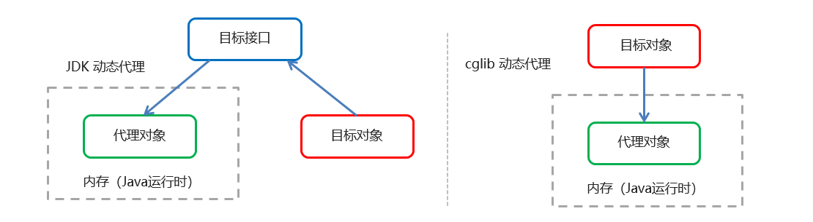

## Spring初识

### 1、Spring是什么

Spring是分层的 Java SE/EE应用 full-stack 轻量级开源框架，以 IoC（Inverse Of Control：反转控制）和 AOP（Aspect Oriented Programming：面向切面编程）为内核。

提供了展现层 SpringMVC和持久层 Spring JDBCTemplate以及业务层事务管理等众多的企业级应用技术，还能整合开源世界众多著名的第三方框架和类库，逐渐成为使用最多的Java EE 企业应用开源框架

### 2、Spring发展历程

Rod Johnson （ Spring 之父）

2017 年 9 月份发布了 Spring 的最新版本 Spring5.0 通用版（GA）

### 3、Spring的优势

方便解耦，简化开发

AOP 编程的支持

声明式事务的支持

方便程序的测试

### 4、Spring的体系结构


## Spring_Xml配置

### 1、导入Spring包坐标

```xml
    <properties>
        <maven.compiler.source>1.8</maven.compiler.source>
        <maven.compiler.target>1.8</maven.compiler.target>
    </properties>

    <dependencies>
        <dependency>
            <groupId>org.springframework</groupId>
            <artifactId>spring-context</artifactId>
            <version>5.2.8.RELEASE</version>
        </dependency>
    </dependencies>
```

### 2、创建Spring配置文件

路径:src/main/resources/applicationContext.xml

```md
Demo
 |__src
	|__main
	|	|_java
	|	|_resources
	|		|__applicationContext.xml
	|__test


```

内容：

```xml
<?xml version="1.0" encoding="UTF-8"?>
<beans xmlns="http://www.springframework.org/schema/beans"
       xmlns:xsi="http://www.w3.org/2001/XMLSchema-instance"
       xsi:schemaLocation="http://www.springframework.org/schema/beans http://www.springframework.org/schema/beans/spring-beans.xsd">

</beans>
```

### 3、一个简单的类和对应配置

类：

```java
package com.study;

public class Student {
    public void study() {
        System.out.println("always study...");
    }
}
```

在Spring配置文件中配置：

```xml
<?xml version="1.0" encoding="UTF-8"?>
<beans xmlns="http://www.springframework.org/schema/beans"
       xmlns:xsi="http://www.w3.org/2001/XMLSchema-instance"
       xsi:schemaLocation="http://www.springframework.org/schema/beans http://www.springframework.org/schema/beans/spring-beans.xsd">

    <bean id="student" class="com.study.Student"/>
</beans>
```

### 4、依赖注入，Bean实例化

#### 4.1 ClassPathXmlApplicationContext

路径参数：

对于 ClassPathXmlApplicationContext 的使用：

1. 默认使用：项目的 classpath 路径； `classpath:` 前缀是可加可不加的 。
2. 如果要使用绝对路径 , 需要加上 `file:` , 前缀表示这是绝对路径。
3. 如果是两个以上 , 可以使用字符串数组 ；或者使用通配符（正则表达）

代码：

```java
package com.study;

import javafx.application.Application;
import org.springframework.context.ApplicationContext;
import org.springframework.context.support.ClassPathXmlApplicationContext;

public class Main1 {
    public static void main(String[] args) {
        ApplicationContext applicationContext = new ClassPathXmlApplicationContext("applicationContext.xml");
        //ApplicationContext applicationContext = new ClassPathXmlApplicationContext("file:E:/applicationContext.xml");
        //ApplicationContext applicationContext = new ClassPathXmlApplicationContext(new String[]{"applicationContext.xml","SpringTest.xml"});
        //ApplicationContext applicationContext = new ClassPathXmlApplicationContext("classpath:/*.xml");
        Student student = (Student) applicationContext.getBean("student");
        student.study();
    }
}
```


#### 4.2 FileSystemXmlApplicationContext 

路径参数：

1. 默认使用：项目的根路径，没有盘符的是项目工作路径 
2. 有盘符表示的是文件绝对路径 ，`file:` 可加可不加。
3. 如果要使用 classpath 路径 , 需要前缀 `classpath:`。
4. 如果是两个以上 , 可以使用字符串数组 ；或者使用通配符（正则表达）

代码：

```java
package com.study;

import org.springframework.context.ApplicationContext;
import org.springframework.context.support.FileSystemXmlApplicationContext;

public class Main2 {
    public static void main(String[] args) {

        ApplicationContext applicationContext = new FileSystemXmlApplicationContext("src/main/resources/applicationContext.xml");
        //ApplicationContext applicationContext = new FileSystemXmlApplicationContext("classpath:applicationContext.xml");
        //ApplicationContext applicationContext = new FileSystemXmlApplicationContext(new String[]{"classpath:applicationContext.xml","classpath:SpringTest.xml"});
        //ApplicationContext applicationContext = new FileSystemXmlApplicationContext("classpath:/*.xml");
        Student student = (Student) applicationContext.getBean("student");
        student.study();
    }
}
```


### 5、Demo

https://github.com/su-dd/learning/tree/main/src/spring/base/Demo1

## Spring_IOC的XML实现

### 1 Spring初识Bean

#### 1.1 JavaBean的定义

`百度百科：`JavaBean 是一种JAVA语言写成的可重用组件。为写成JavaBean，类必须是具体的和公共的，并且具有无参数的[构造器](https://baike.baidu.com/item/构造器/9844976)。JavaBean 通过提供符合一致性设计模式的公共方法将内部域暴露成员属性，set和get方法获取。众所周知，属性名称符合这种模式，其他Java 类可以通过自省机制(反射机制)发现和操作这些JavaBean 的属性。

`RUMNOOB.com:`JavaBean 是特殊的 Java 类，使用 Java 语言书写，并且遵守 JavaBean API 规范。

接下来给出的是 JavaBean 与其它 Java 类相比而言独一无二的特征：

- 提供一个默认的无参构造函数。
- 需要被序列化并且实现了 Serializable 接口。
- 可能有一系列可读写属性。
- 可能有一系列的 getter 或 **setter** 方法。

#### 1.2 SpringBean

SpringBean是受Spring管理的对象，所有能受Spring容器管理的对象都可以成为SpringBean。

基本配置：

```xml
<bean id="student" class="com.study.Student"/>
```

id：Bean实例在Spring容器中唯一标识

class：Bean的全限定名称


### 2 SpringBean实例化

#### 2.1 SpringBean的范围

**Xml属性：**scope

**Bean有两种方式：**

1. singleton

   - 实例个数：1个
   - 创建时机：当Spring核心文件被加载时，创建

2. prototype

   - 实例个数：多个

   - 创建时机：当调用getBean()方法时实例化Bean

**xml配置Demo：**

```xml
<bean id="school" class="com.study.instantiation.School" scope="singleton"></bean>
<bean id="student" class="com.study.instantiation.Student" scope="prototype"></bean>
```


#### 2.2 SpringBean的生命周期

singleton：

- 对象创建：当应用加载，创建容器时，对象就被创建了

- 对象运行：只要容器在，对象一直活着
- 对象销毁：当应用卸载，销毁容器时，对象就被销毁了

prototype：

- 对象创建：当使用对象时，创建新的对象实例
- 对象运行：只要对象在使用中，就一直活着
- 对象销毁：当对象长时间不用时，被 Java 的垃圾回收器回收了

init-method：指定类中的初始化方法名称

destroy-method：指定类中销毁方法名称

**xml配置Demo：**

```xml
<bean id="school" class="com.study.instantiation.School" scope="singleton" init-method="initValue" destroy-method="destroyValue"></bean>
```


#### 2.3 SpringBean的创建方式

1. 使用构造函数，如果没有对应的构造函数将创建失败。

   **如无参构造Demo：**

   ```xml
   <bean id="school" class="com.study.instantiation.School"></bean>
   ```

   

2. 使用工厂实例化

   - 静态工厂方法

     ```java
     public class StaticFactoryBean {
         public static UserDao createSchool(){    
         return new School();
         }
     }
     ```

     ```xml
     <bean id="staticFactorySchool" class="com.study.instantiation.StaticFactoryBean" factory-method="createSchool"/>
     ```

   - 工厂实例的方法

     ```java
     public class DynamicFactoryBean {
         public School createSchool() {
             return new School();
         }
     }
     ```

     ```xml
     <bean id="dynamicFactoryBean" class="com.study.instantiation.DynamicFactoryBean"/>
     <bean id="dynamicFactorySchool" factory-bean="dynamicFactoryBean" factory-method="createSchool"/>
     ```


### 3 SpringBean依赖注入

#### 3.1 构造函数注入

标签：constructor-arg

常用属性：

	- name：参数名
	- value：值，用于简单类型
	- ref：引用，用于引用类型，引用标记为bean的id

注意点：

​	通过构造函数创建Bean实例，所以需要对应的构造函数。


**XmlDemo:**

```xml
<bean id="information112" class="com.study.injection.Information">
    <constructor-arg name="phoneNum" value="112"/>
</bean>

<bean id="studentXiaoMing" class="com.study.injection.Student">
    <constructor-arg name="name" value="小明"/>
    <constructor-arg name="age" value="16"/>
    <constructor-arg name="information" ref="information112"/>
</bean>
```


#### 3.2 set方法注入

标签：property

常用属性：

 - name：参数名
 - value：值，用于简单类型
 - ref：引用，用于引用类型，引用标记为bean的id

注意点：

​	通过无参构造创建Bean实例，所以需要无参构造。通过set函数注入，所以需要set函数（PS时机操作，不写set也行；搜索结果为通过反射直接赋值了）。


**XmlDemo:**

```xml
<!--  需要无参构造  -->
<bean id="studentXiaoHong" class="com.study.injection.Student">
    <property name="name" value="小红"/>
    <property name="age" value="16"/>
    <property name="information" ref="information110"/>
</bean>
```

#### 3.3 P命名空间注入

beans标签增加属性引用P命名空间  `xmlns:p="http://www.springframework.org/schema/p"`

实际效果：

```xml
<beans xmlns="http://www.springframework.org/schema/beans"
       xmlns:xsi="http://www.w3.org/2001/XMLSchema-instance"
       xmlns:p="http://www.springframework.org/schema/p"
       xsi:schemaLocation="http://www.springframework.org/schema/beans http://www.springframework.org/schema/beans/spring-beans.xsd">
</beans>
```

P命名空间的本质也是Set方法注入，所以注意点也同Set方法注入。


**XmlDemo：**

```xml
<bean id="studentXiaoFang" class="com.study.injection.Student" p:name="小芳" p:age="15" p:information-ref="information110"/>
```

于P命名空间相对的有一个C命名空间，本质上就是构造方法注入；


#### 3.4 不同类型注入

注入的类基本可以分为3种：基本类型，引用类类，集合类型。

上述注入方式中已经演示了：基本类型和引用类型，分别使用`value`和`ref`属性；这里主要演示集合类型。

**List集合：**

标签：list

**XmlDemo:**

```xml
<property name="studentNames">
    <list>
        <value>小红</value>
        <value>小明</value>
        <value>小芳</value>
        <value>小王</value>
    </list>
</property>
<property name="mathClass">
    <list>
        <bean id="studentXiaoWang" class="com.study.injection.Student" p:name="小王" p:age="17" p:information-ref="information112"/>
        <ref bean="studentXiaoMing"/>
    </list>
</property>
```


**Map集合：**

标签：map

**XmlDemo：**

```xml
<property name="studentMap">
    <map>
        <entry key="小明" value-ref="studentXiaoMing"/>
        <entry key="小红" value-ref="studentXiaoHong"/>
        <entry key="小芳" value-ref="studentXiaoFang"/>
        <entry key="小王" value-ref="studentXiaoWang"/>
    </map>
</property>
```


**Properties：**

标签：props

**XmlDemo：**

```xml
<property name="classTeacher">
	<props>
    	<prop key="math">大王</prop>
        <prop key="chinese">大明</prop>
        <prop key="english">大芳</prop>
    </props>
</property>
```


### 4引入其他配置文件

使用import导入

```xml
<import resource="appliactionContext-Student.xml"/>
```


### 5 Demo

https://github.com/su-dd/learning/tree/main/src/spring/base/Demo2


## Spring_AOP的XML实现

### 1 SpringAOP的实现

AOP的本质是通过对原对象的介入，去增强原对象的功能。

SpringAOP是在运行期，通过动态代理技术生成代理对象实现的。

常用的动态代理技术：JDK代理，cglib代理 （具体理论在后面文章中讨论，本章关注使用）



### 2 AOP的Maven坐标

```xml
    <dependencies>
        <dependency>
            <groupId>org.springframework</groupId>
            <artifactId>spring-context</artifactId>
            <version>5.2.8.RELEASE</version>
        </dependency>
        <!--    aspectj的织入    -->
        <dependency>
            <groupId>org.aspectj</groupId>
            <artifactId>aspectjweaver</artifactId>
            <version>1.9.6</version>
        </dependency>
    </dependencies>
```


### 3 AOP的术语

SpringAOP的实现就是通过代理对象替换掉原对象，同时增强原有类的功能。这里涉及了一些术语：

| 术语                 | 逻辑                                                                                                                                   |
| -------------------- | -------------------------------------------------------------------------------------------------------------------------------------- |
| Target（目标对象）   | 代理的目标对象                                                                                                                         |
| Proxy （代理）       | 一个类被 AOP 织入增强后，就产生一个结果代理类                                                                                          |
| Joinpoint（连接点）  | 所谓连接点是指那些被拦截到的点。在spring中,这些点指的是方法，因为spring只支持方法类型的连接点                                          |
| Pointcut（切入）     | 所谓切入是指我们要对哪些 Joinpoint 进行拦截的定义                                                                                      |
| Advice（通知/ 增强） | 所谓通知是指拦截到 Joinpoint 之后所要做的事情就是通知                                                                                  |
| Aspect（切面）       | 是切入和通知/ 增强的结合   【Pointcut + Advice】                                                                                       |
| Weaving（织入）      | 是指把Advice应用到目标对象来创建新的代理对象的过程。Spring采用动态代理织入，而AspectJ采用编译期织入和类装载期织入 【形成Aspect的过程】 |

### 4 XML配置

#### 4.1 Beans属性

增加属性`xmlns:aop`

```xml
xmlns:aop="http://www.springframework.org/schema/aop"
```

属性`xsi:schemaLocation`增加值

```xml
http://www.springframework.org/schema/aop http://www.springframework.org/schema/aop/spring-aop.xsd
```

**XMLDemo:**

```xml
<beans xmlns="http://www.springframework.org/schema/beans"
       xmlns:xsi="http://www.w3.org/2001/XMLSchema-instance"
       xmlns:aop="http://www.springframework.org/schema/aop"
       xsi:schemaLocation="
       http://www.springframework.org/schema/aop http://www.springframework.org/schema/aop/spring-aop.xsd
       http://www.springframework.org/schema/beans http://www.springframework.org/schema/beans/spring-beans.xsd">
</beans>
```


#### 4.2 简单的Demo讲解

**XmlDemo:**

```xml
<aop:config>
    <aop:aspect ref="studentAspect">
        <aop:before method="before" pointcut="execution(public void com.study.aop.Student.study())"/>
    </aop:aspect>
</aop:config>
```

`aop:config`：引入aop配置

`aop:aspect`：配置一个aop切面类

`aop:before`：配置前置增强/通知，`method`增强使用的函数

**切点：**

标记：`aop:before`的`pointcut`属性。

切点表达式：`execution([修饰符] 返回值类型 包名.类名.方法名(参数))`

	- 访问修饰符可省略
	- 返回值类型、包名、类名、方法名可以使用星号*  代表任意
	- 包名与类名之间一个点 . 代表当前包下的类，两个点 .. 表示当前包及其子包下的类
	- 参数列表可以使用两个点 .. 表示任意个数，任意类型的参数列表

**xmlDemo：**

```xml
<aop:before method="before" pointcut="execution(public void com.study.aop.Student.study())"/>
<aop:before method="before" pointcut="execution(void com.study.aop.Student.study())"/>
<aop:before method="before" pointcut="execution(* com.study.aop.Student.study())"/>
<aop:before method="before" pointcut="execution(* com.study.aop.Student.*(..))"/>
<aop:before method="before" pointcut="execution(* com.study.aop..*.*(..))"/>
<aop:before method="before" pointcut="execution(* *..*.*(..))"/>
```


#### 4.3 通知/增强的类型

`aop:通知类型`标记：

	- `method`：切面类中方法名
	- `pointcut`：切点表达式
	- `pointcut-ref`：切点引用

`aop:pointcut`标记：

```xml
<aop:pointcut id="test" expression="public void com.study.aop.Student.study()"/>
```

**标签类型：**

| 标签                  | 作用             | 运行时机               |
| --------------------- | ---------------- | ---------------------- |
| `aop:before`          | 指定前置通知     | 切入点执行之前         |
| `aop:after-returning` | 指定后置通知     | 切入点执行之后         |
| `aop:around`          | 指定环绕通知     | 切入点执行前后都执行   |
| `aop:after-throwing`  | 指定异常抛出通知 | 切入点异常抛出时       |
| `aop:after`           | 指定最终通知     | 无论是否抛出异常都执行 |

备注：`aop:around` 的实际效果是覆盖了原来的运行方法，通过`ProceedingJoinPoint`调用原方法

```java
public void around(ProceedingJoinPoint jp) throws Throwable {
    System.out.println("around, 环绕增强 ... ");

    Object[] args=jp.getArgs();
    if(args.length>0){
        System.out.print("Arguments passed: " );
        for (int i = 0; i < args.length; i++) {
            System.out.print("arg "+(i+1)+": "+args[i]);
        }
    }
    jp.proceed(args);
    System.out.println("around, 运行完 ... ");
}
```

可以认为：`aop:around`是其他所有标记 + 切入点 的集合。


#### 4.4 aop:declare-parents

为一个已知的API添加一个新的功能

对于我们不能修改类代码，只能通过外部包装的情况。如果通过之前的AOP前置或后置通知，又不太合理，最简单的办法就是实现某个我们自定义的接口，这个接口包含了想要添加的方法。

但是JAVA不是一门动态的语言，无法再编译后动态添加新的功能，这时就可以使用 `aop:declare-parents`

**XmlDemo:**

```xml
<aop:declare-parents 
                     types-matching="com.study.aop.Student" 
                     implement-interface="com.study.aop.imp.People" 
                     delegate-ref="studentAspect"/>
```

属性：

- `types-matching`：待增强类的表达式，支持通配符
- `implement-interface`：引入增强的方法所在的接口
- `delegate-ref`：引入增强的实现bean的id
- `default-impl`：引入增强的实现类的全路径名称（使用该方式，无需把增强类的`Bean`注入到Spring容器中）

 注：`delegate-ref`和`default-impl`仍选一个实现即可


#### 4.5 向增强函数传参数

切入函数不是一成不变的，有很大的可能性是需要根据切入点的参数而发生不同的变化。

#### 4.5.1 通过 JoinPoint(推荐)

切点类和切点函数：

```java
public class StudentAspect {
	public void before(JoinPoint joinPoint) {
        Object[] args = joinPoint.getArgs();
        System.out.println("before, 前置增强 ... " + args[0]);
    }
}
```

xml：

```xml
<aop:config>
    <aop:aspect ref="studentAspect">
        <aop:before method="before" pointcut="execution(void com.study.aop.Student.study(..))"/>
    </aop:aspect>
</aop:config>
```


##### 4.5.2 通过xml配置

切点类和切点函数：

```java
public class StudentAspect implements People {
    public void after(String course, String teacher) {
        System.out.println("after-returning, 后置增强 ... ");
    }
}
```

xml:

```xml
<aop:config>
    <aop:aspect ref="studentAspect">
        <aop:after-returning method="after" pointcut="execution( * com.study.aop.Student.study(String,String)) and args(course, teacher)"/>
    </aop:aspect>
</aop:config>
```


### 5 Demo

https://github.com/su-dd/learning/tree/main/src/spring/base/Demo3

## Spring_IOC的注解实现

### 1 基本定义

随着Spring程序的日益增大，Xml注解文件也会变得繁杂不易维护。所以注解开发成为你Spring的趋势。

基础定义在`Spring DI和IoC理解` 和 `Spring IoC的Xml配置`已经阐述清楚，不做赘述。


### 2 Xml配置

#### 2.1 Beas属性

添加属性： `xmlns:context`

```xml
xmlns:context="http://www.springframework.org/schema/context"
```

属性`xsi:schemaLocation`数据增加：

```xml
http://www.springframework.org/schema/context http://www.springframework.org/schema/context/spring-context.xsd
```

#### 2.2 组价扫描

标签：`context:component-scan`

```xml
<context:component-scan base-package="com.study"/>
```

**XmlDemo:**

```xml
<beans xmlns="http://www.springframework.org/schema/beans"
       xmlns:xsi="http://www.w3.org/2001/XMLSchema-instance"
       xmlns:context="http://www.springframework.org/schema/context"
       xsi:schemaLocation="
       http://www.springframework.org/schema/context http://www.springframework.org/schema/context/spring-context.xsd
       http://www.springframework.org/schema/beans http://www.springframework.org/schema/beans/spring-beans.xsd">
    <!--  组价扫描  -->
    <context:component-scan base-package="com.study"/>
</beans>
```


### 3 注解

#### 3.1 实例化Bean

对应Xml的`<bean>`标签， 标识需要Spring进行实例化

| 注解          | 说明                              |作用位置 |
| ------------- | ------------------------- | --------- |
| `@Component`  | 使用在类上用于实例化Bean          |类声明上|
| `@Controller` | 使用在web层类上用于实例化Bean     |类声明上|
| `@Service`    | 使用在service层类上用于实例化Bean |类声明上|
| `@Repository` | 使用在dao层类上用于实例化Bean     |类声明上|

**Demo:**

```java
@Component("school")
public class School {
    public School() {
        System.out.println("——运行 School 无参构造——");
    }
}
```


#### 3.2 设置Bean范围

对应Xml的`<bean>`标签的`scope`属性

| 注解     | 说明               | 作用位置 |
| -------- | ------------------ | --------- |
| `@Scope` | 标注Bean的作用范围 |类声明上|

**Demo:**

```java
@Component("school")
@Scope("prototype")
public class School {
    public School() {
        System.out.println("——运行 School 无参构造——");
    }
}
```


#### 3.3 设置Bean的初始化和销毁

对应Xml的`<bean>`标签的属性`init-method` 、`destroy-method`

| 注解             | 说明          |作用位置 |
| ---------------- | --------------------------- | --------- |
| `@PostConstruct` | 使用在方法上标注该方法是Bean的初始化方法 |函数上|
| `@PreDestroy`    | 使用在方法上标注该方法是Bean的销毁方法   |函数上|

**Demo:**

```java
@Component("school")
@Scope("singleton")
public class School {
    public School() {
        System.out.println("——运行 School 无参构造——");
    }

    @PostConstruct
    public void initValue() {
        System.out.println("——运行 School 初始化函数——");
    }

    @PreDestroy
    public void destroyValue() {
        System.out.println("——运行 School 销毁函数——");
    }
}
```


#### 3.4 依赖注入

| 注解        | 说明                 |作用位置 |
| ----------- | -------------------- | --------- |
| `@Value`   | 注入普通属性                                   |set函数上、或者 参数上|
| `@Autowired` | 使用在字段上用于根据类型依赖注入（byType） |set函数上、或者 参数上|
| `@Qualifier` | 结合@Autowired一起使用用于根据名称进行依赖注入（byName） |set函数上、或者 参数上|
| `@Resource` | 相当于@Autowired+@Qualifier，按照名称进行注入（byName） |set函数上、或者 参数上|

##### 3.4.1 `@Value`

```java
@Service("information110")
public class Information110 implements Information {
    private String phone;
    @Value("110")
    public void setPhone(String phone) {
        this.phone = phone;
    }
}
```


##### 3.4.2 `@Autowired`

按照类型注册

```java
@Service("information110")
public class Information110 implements Information {
    ...省略...
}

@Controller("studentXiaoHong")
public class StudentXiaoHong implements Student {
    @Autowired
    private Information110 information;
}
```


##### 3.4.3 `@Qualifier`

配合@Autowired一起使用，按照名称注入

```java
@Controller("studentXiaoHong")
public class StudentXiaoHong implements Student {
    private Information110 information;
    
    @Autowired
    @Qualifier("information110")
    public void setInformation(Information information) {
        this.information = information;
    }
}
```


##### 3.4.4 `@Resource`

`@Resource `默认是按照名称去注入

```java
@Controller("studentXiaoHong")
public class StudentXiaoHong implements Student {
    @Resource
    private Information information110;
}
```

使用`name`属性按照名称注入

```java
@Controller("studentXiaoHong")
public class StudentXiaoHong implements Student {
    @Resource(name = "information110")
    private Information information;
}
```

使用`type`属性按照l类型注入

```java
@Controller("studentXiaoHong")
public class StudentXiaoHong implements Student {
    @Resource(type = com.study.injection.info.impl.Information110.class)
    private Information information;
}
```


### 4 新注解

使用上面的注解还不能全部替代xml配置文件，还需要下面的注解

| 注解            | 说明                                                         |
| --------------- | ------------------------------------------------------------ |
| @ComponentScan  | 用于指定 Spring   在初始化容器时要扫描的包。                 |
| @Configuration  | 用于指定当前类是一个 Spring   配置类，当创建容器时会从该类上加载注解 |
| @Bean           | 使用在方法上，标注将该方法的返回值存储到 Spring 容器中       |
| @PropertySource | 用于加载   .properties  文件中的配置                         |
| @Import         | 用于导入其他配置类                                           |

#### 4.1 组件扫描 `@ComponentScan`

在上面我们是通过组件扫描，知道组件的位置

```xml
<!--  组价扫描  -->
<context:component-scan base-package="com.study.newAnnotation"/>
```

标记需要配合AnnotationConfigApplicationContext使用：

```java
@ComponentScan(value = "com.study.newAnnotation")
public class MainScanConfig {
}
public class MainApp {
    public static void main(String[] args) {
        ApplicationContext applicationContext = new AnnotationConfigApplicationContext(MainScanConfig.class);
        Information information = (Information) applicationContext.getBean("information110");
        System.out.println(information.info());

    }
}
```


#### 4.2 `@Configuration`和`@Bean`

某些XMl配置的用法，通过以上的方式我们不能实现。如对于一个类创建不同的对象。 这是可以使用`@Configuration`和`@Bean`

`@Configuration`：指定对象是 Bean 定义的源。本质上是一个`@Component`。

`@Bean`：等价于Xml的`<bean>`，可以同任何`@Component`一起使用。但是通常只和`@Configuration`一起使用。`@Bean`默认是单例的，可以通过`@Scope`设置范围。

​	属性：

- `name`：等价于Xml里`<bean>`的`<id>`，自定义名称
- `initMethod` :等价于Xml里`<bean>`的`<init-method>`，指定初始化函数
- `destroyMethod ` :等价于Xml里`<bean>`的`<destroy-method >`，指定释放处理函数
- `autowireCandidate`：标准是否常用自动注入，两个值： true，false
- `autowire`：自动注入，有3个值：Autowire.NO ，Autowire.BY_NAME ，Autowire.BY_TYPE

```java
@ComponentScan(value = "com.study.newAnnotation")
public class MainScanConfig {
    @Bean(name = "information110")
    public Information getInformation110(){
        return new Information("110");
    }
}
```


#### 4.3 `@Import`

导入配置类，同xml的`<import>`

```java
@Import(ServiceConfig.class)
@Import({ServiceConfig.class, RepositoryConfig.class})
```


#### 4.4 `@PropertySource`

加载properties文件的配置,同Xml的`< context:property-placeholder>`

```java
@PropertySource("classpath:info.properties")
public class DataSourceConfiguration {
    @Value("${jdbc.xiaoming}")
    private String phone;
}
```


### 5、 容器的注解注入

#### 5.1 @Autowired 或者 @Resource

`@Order`可指定顺序， 对有顺序的容器有效

StudentXiaoHong.java

```java
@Order(1)
@Controller("studentXiaoHong")
public class StudentXiaoHong implements Student {

    @Value("小红")
    private String name;

    public String getName() {
        return name;
    }

    public void setName(String name) {
        this.name = name;
    }

    @Override
    public String toString() {
        return "StudentXiaoHong{" +
                "name='" + name + '\'' +
                '}';
    }
}
```

StudentXiMing.java

```java
@Order(2)
@Controller("studentXiMing")
public class StudentXiMing implements Student {
    private String name;

    public String getName() {
        return name;
    }

    @Value("小明")
    public void setName(String name) {
        this.name = name;
    }

    @Override
    public String toString() {
        return "Student{" +
                "name='" + name + '\'' +
                '}';
    }
}
```

School.java

```java
public class School {
    @Autowired
    private List<Student> studentList;

    @Resource
    private Map<String, Student> studentMap;

    @Override
    public String toString() {
        return "School{" +
                "studentList=" + studentList +
                ", studentMap=" + studentMap +
                '}';
    }
}
```

数据：

```markdown
School
{
	studentList=
	[
		StudentXiaoHong{name='小红'},
		Student{name='小明'}
	],
	
	studentMap=
	{
		studentXiMing=Student{name='小明'},
		studentXiaoHong=StudentXiaoHong{name='小红'}
	}
}
```


这种注入只能对Bean有效果，普通类型不能注入。


### 6 Git路径

https://github.com/su-dd/learning/tree/main/src/spring/base/Demo4


## Spring_AOP的注解实现

### 1 基础认知

Spring AOP的基础在**SpringAOP的Xml配置 **已经做了详细的介绍。请移步**SpringAOP的Xml配置**


### 2 Xml配置

xml中增加 `<aop:aspectj-autoproxy>`

```xml
<!--aop的自动代理-->
<aop:aspectj-autoproxy></aop:aspectj-autoproxy>
```


### 3 注解

| 标签              | 作用             | 运行时机               |
| ----------------- | ---------------- | ---------------------- |
| `@Aspect`         | 标注切面类     |          |
| `@Before`         | 指定前置通知     | 切入点执行之前         |
| `@AfterReturning` | 指定后置通知     | 切入点执行之后         |
| `@Around`         | 指定环绕通知     | 切入点执行前后都执行   |
| `@AfterThrowing`  | 指定异常抛出通知 | 切入点异常抛出时       |
| `@After`          | 指定最终通知     | 无论是否抛出异常都执行 |
| `@Pointcut`       | 指定切点     | |
| `@DeclareParents`   |指定添加新接口||


Demo:

```java
@Component("studentAspect")
@Aspect
public class StudentAspect implements People {

    @DeclareParents(value = "com.study.aop.Student", defaultImpl = com.study.aop.imp.StudentAspect.class)
    public People people;

    @Before("execution(void com.study.aop.Student.study(..))")
    public void before(JoinPoint joinPoint) {
        //System.out.println(joinPoint.getSignature().getName());
        System.out.println("before, 前置增强 ... " + joinPoint.getArgs()[0]);
    }

    //@AfterReturning(pointcut = "execution( * com.study.aop.Student.study(String,String)) && args(course, teacher)")
    @AfterReturning(pointcut = "execution( * com.study.aop.Student.study(String,String)) && args(course, teacher)", argNames = "course, teacher")
    public void after(String course, String teacher) {
        System.out.println("after-returning, 后置增强 ... " + teacher);
    }

    @Around(value = "execution( * com.study.aop.Student.study(..))")
    public void around(ProceedingJoinPoint joinPoint) throws Throwable {
        System.out.println("around, 环绕增强 ... ");

        Object[] args = joinPoint.getArgs();
        if (args.length > 0) {
            System.out.print("Arguments passed: " );
            for (int i = 0; i < args.length; i++) {
                System.out.print("arg "+(i+1)+": "+args[i]);
            }
        }

        joinPoint.proceed(args);

        System.out.println("around, 运行完 ... ");
    }

    @AfterThrowing(value = "execution( * com.study.aop.Student.study(..))")
    public void throwing() {
        System.out.println("after-throwing, 异常增强 ... ");
    }

    @After(value = "StudentAspect.pointcut(course, teacher)", argNames = "teacher, course")
    public void afterAll(String teacher, String course) {
        System.out.println("after, 最终通知增强 ... " + course + "_" + teacher);
    }


    @Override
    public void eat() {
        System.out.println("吃 吃 吃，就知道吃 ... ");
    }


    @Pointcut(value = "execution( * com.study.aop.Student.study(String,String)) && args(p1, p2)", argNames = "p1, p2")
    public void pointcut(String p1, String p2){}
}
```

### 4 Git路径

https://github.com/su-dd/learning/tree/main/src/spring/base/Demo5

## spring_restful注解

### 1、说明

springboot 是国内最常用的web框架，因为它的http server功能是最重要的。本文列举了一些现在通用的restful形式的接口所需要的注解

### 2、@RequestMapping

**@RequestMapping** 注解用于请求地址的解析，是最常用的一种注解

源码如下：

```java
@Target({ElementType.TYPE, ElementType.METHOD})
@Retention(RetentionPolicy.RUNTIME)
@Documented
@Mapping
public @interface RequestMapping {
    String name() default "";

    @AliasFor("path")
    String[] value() default {};

    @AliasFor("value")
    String[] path() default {};

    RequestMethod[] method() default {};

    String[] params() default {};

    String[] headers() default {};

    String[] consumes() default {};

    String[] produces() default {};
}
```

- **@Target** 表示，此注解可以用在类和方法上；
- **@Retention(RetentionPolicy.RUNTIME)** 表示，测注解保留到程序运行时，即程序运行时此注解有效；

该注解的参数如下：

#### 2.1、name

为映射设置名称

#### 2.2、path和value

- **path** ，顾名思义，运行时，它能够得到地址；
- 该属性是一个字符串数组，表示，可以同时映射多个地址；

而之所以把path和value写在一起，是因为这两个属性的作用的相同的。可以看到，这两个属性都使用spring的注解 **@AliasFor** 互相修饰，表示这两个属性互为别名

这里之所以使用 **value** 属性，是因为，java注解中，如果有多个属性，而使用时，又不指定参数名，则默认传递给 **value** 熟悉。所以，这里使用别名的作用是，使用时可以不使用属性名，直接使用值来表示地址

spring框架中的注解都会有value属性

```java
@RequestMapping("/index")
public String index(){
	return "hello";
}
```

如上例，表示，“/index” 以为没有指定属性名，属于传递给了value属性，也就是path属性

##### 2.2.1、@pathVariable

使用path映射url的path，但是对于同一个类型的url，只是path不同，但是处理方式不一样，如果各自写一个方法的话，就显得很多余了，所以可以使用path变量

- 变量使用中括号修饰，配合注解 **@PathVariable** 一起使用，可以得到传入的path；
- 这里还可以使用正则表达式对变量允许的值进行过滤；

示例：

```java
@RequestMapping(value="/index/{name}")
public String index(){
	return "bbb";
}
```

上例中，可以映射path为 /index/xxxx 等的url

```java
@RequestMapping(value="/index/{name:[a-z]}")
public String index(){
	return "bbb";
}
```

上例中，使用了正则表达式，[a-z] 表示a-z的一个字符，所以，只能映射/index/a等，二级目录只是一个字母的url

#### 2.3、method

故名思议，表示，http请求使用的方法，它的类型是 **RequestMethod** 数组，**RequestMethod** 是一个枚举，源码如下：

```java
public enum RequestMethod {
    GET,
    HEAD,
    POST,
    PUT,
    PATCH,
    DELETE,
    OPTIONS,
    TRACE;

    private RequestMethod() {
    }
}
```

可以看到，它是包含一系列HTTP方法的枚举类型

而类型是数组表示，它可以指定该接口/类可以监听多种方法

#### 2.4、params和header

**params** 参数用于过滤请求，根据该参数值，只将符合条件的请求传递到该方法/类中

如果有多个参数，则参数之间是 **与** 的关系

示例：

```java
@RequestMapping(value="/index", params = "age=12")
public String index(){
	return "bbb";
}

@RequestMapping(value="/index", params = {"age=13,name=ab"})
public String index2(){
	return "ccc";
}
```

上例中，index() 映射请求中，参数age为12的请求

index2() 方法映射请求中，参数age为13且name为ab的请求

**headers** 参数的效果和 **params** 类似，区别是**header** 过滤的是HTTP协议中的header参数

示例：

```java
@RequestMapping(value="/index", headers="content-type=text/html")
public String index2(){
	return "aaa";
}
```

#### 2.5、consumes和produces

**consumes** 用于过滤请求内容类型（**Content-Type** 值）

**produces** 用于指定返回值类型

**Content-Type** 在HTTP协议的消息头中用于表示资源的媒体类型，**consumes** 的作用就是根据参数过滤

```java
@RequestMapping(value = "/index", consumes = "application/json")
public String index3(){
	return "aaa";
}
```

### 3、@PathVariable

**@PathVariable** 用于接口的参数获取

在上文的2.2.1中，path变量配合此注解，可以得到传入的path

**@PathVariable** 只有name和value两个参数，互为别名，使用时需要传入一个name

示例：

```java
@RequestMapping(value="/index/{name}")
public String index(@PathVariable("name") String myName){
	return "bbb";
}
```

**@PathVariable** 的参数 **name** 的要和 **@RequestMapping** 的 path 参数中的path变量一致

上例中，myName 参数的值为url的二级path

### 4、@RequestParam

**@RequestParam** 用于 **通过接受表单形式的参数**，即传入的参数必须可以是拼接在URL后面的key-value，也可以是body里面的表单形式的key-value

源码如下：

```java
@Target({ElementType.PARAMETER})
@Retention(RetentionPolicy.RUNTIME)
@Documented
public @interface RequestParam {
    @AliasFor("name")
    String value() default "";

    @AliasFor("value")
    String name() default "";

    boolean required() default true;

    String defaultValue() default "\n\t\t\n\t\t\n\ue000\ue001\ue002\n\t\t\t\t\n";
}
```

可见，**@RequestParam** 特性如下：

- 需要传三个参数：name/value、required和defaultValue，name表示参数名，reuqired表示此参数是否必须传入，defaultValue表示默认值；
- 若不指定默认值，则未传的参数会设为nul；

##### 示例1：url 传参

```java
@RequestMapping(value="/index")
public String index(@RequestParam("name") Integer name){
	return "bbb";
}
```

需要注意的是，如果参数类型设置为基本的数据类型，而请求又没有传参的话，会报错，因为基本数据类型没有null类型，所以使用Java包装类即可

##### 示例2：body中form形式的传参

需要注意的是，HTTP协议body中传参的形式有多种，这里需要分别处理

默认接受以文本的形式传递的参数，也有的软件叫 **raw**

若传参的形式不同，接口需要设置 HTTP 协议头的 **Content-Type** 的值来接受参数，即，spring 中使用 **@RequestMapping** 的 **consumes** 属性


```java
@RequestMapping(value="/index2", 
                consumes="application/x-www-form-urlencoded")
public String index2(
    @RequestParam("name") String myName, 
    @RequestParam("age") Integer age){
	return "bbb";
}
```

这里使用了 key-value 键值对的表单形式，**@RequestParam** 可以忽略，简化成如下代码，效果相同

```java
@RequestMapping(value="/index2", 
                consumes="application/x-www-form-urlencoded")
public String index2(String name, Integer age){
	return "bbb";
}
```

但是，如果参数过多，则函数的参数列表就会很长，所以这里可以封装成一个类

```java
public class People {
    private Integer id;
    private String name;
    private Integer age;
    //忽略getter和setter
}
 @RequestMapping(value="/index2", 
                 consumes="application/x-www-form-urlencoded")
    public String index2(People people){
        return "bbb";
    }
```

并且，此时无需使用注解，spring 会自动拼装类

### 5、@RequestBody

**@RequestBody** 接受的body内的单一参数，即非表单形式的参数，因为，其也就不能接收GET方法的传参了

其源码如下：

```java
@Target({ElementType.PARAMETER})
@Retention(RetentionPolicy.RUNTIME)
@Documented
public @interface RequestBody {
    boolean required() default true;
}
```

**@RequestBody** 有一个属性 required，默认true，表示单一参数是否必须传入

**示例1：**

**raw** 的方式


```java
@RequestMapping(value="/index")
public String index(@RequestBody String requestParam){
	return "bbb";
}
```

上例中，可以接受到以raw方式传递的参数

**示例2：**

**x-www-form-urlencoded** 的方式

**x-www-form-urlencoded** 是一种把表单数据编码成单一数据的格式，所以可以使用 **@RequestBody** 来获取

```java
@RequestMapping(value="/index2", consumes="application/x-www-form-urlencoded")
public String index2(@RequestBody String requestParam){
	return "bbb";
}
```

**示例3：**

**@RequestBody** 能够将单一形式的参数转换成Java类，这需要参数的key和java类的属性一对一相同，不同的属性则设置为null

```java
@RequestMapping(value="/index")
public String index(@RequestBody Product product){
	return "aaa";
}
```

如上，执行后，controller 内的参数能够自动解析raw方式的传参

### 6、@ResponseBody

**@ResponseBody** 注解的作用是将 java 对象转换位 json 格式的数据

声明如下：

```java
@Target({ElementType.TYPE, ElementType.METHOD})
@Retention(RetentionPolicy.RUNTIME)
@Documented
public @interface ResponseBody {
}
```

由此可知

- 该注解可以用在类和方法上；
- 程序运行时有效；
- 无参数属性；

**@ResponseBody** 注解可以将 controller 方法返回的 java 对象通过适当的转换器转换成指定的格式，并返回到 http response 的 body 区内，通常返回 json 和 xml

使用该注解后，不会走视图处理器，而是直接将数据写入到流中，效果等同于使用 response 对象输出指定格式的数据


## Spring定时任务


### @EnableScheduling

在启动类上加@EnableScheduling注解；允许支持定时器。

```java
@SpringBootApplication
@EnableScheduling //允许支持定时器了
public class SpringbootWebsocketSpringdataJpaApplication {

    public static void main(String[] args) {
        SpringApplication.run(SpringbootWebsocketSpringdataJpaApplication.class, args);
    }
}
```

### @Scheduled

在函数上添加@Scheduled注解；以添加task任务。要注意的是，需要在被识别为组件的类中使用；如：@Component注解的类。

```java
@Component
public class TestScheduler {
    @Scheduled(cron="0/30 * * * * ?")
    private void task(){
        System.err.println("这句话每30秒打印一次");
    }
}
```

### fixed定时语法

明确间隔时间

|参数|作用|
|---|--|
|fixedDelay|上一次执行完毕时间点之后多长时间再执行|
|fixedDelayString|上一次执行完毕时间点之后多长时间再执行|
|fixedRate|上一次开始执行时间点之后多长时间再执行|
|fixedRateString|上一次开始执行时间点之后多长时间再执行|
|initialDelay|第一次延迟多长时间后再执行|
|initialDelayString|第一次延迟多长时间后再执行|

```java
@Component
public class TestScheduler {

    @Scheduled(fixedDelay=5000)
    private void task1(){
        System.err.println("执行完成后，5s再执行。");
    }

    @Scheduled(fixedDelayString='5000')
    private void task2(){
        System.err.println("执行完成后，5s再执行。");
    }

    @Scheduled(fixedRate=5000)
    private void task3(){
        System.err.println("执行开始后，5s再执行。");
    }

    @Scheduled(fixedRateString='5000')
    private void task4(){
        System.err.println("执行开始后，5s再执行。");
    }

    @Scheduled(initialDelay=10000, fixedRateString='5000')
    private void task5(){
        System.err.println("第一次为延时10s后执行;以后为：执行开始后，5s再执行。");
    }
}
```


### crond定时语法

**cron表达式语法：[秒] [分] [小时] [日] [月] [周] [年]**

> 注：[年]不是必须的域，可以省略[年]，则一共6个域

|序号|说明|是否必填|允许填的值|允许通配符|
|--|--|--|--|--|
|1|秒|	是|	0~59|	, - * /|
|2|分|	是|	0~59|	, - * /|
|3|时|  是|0~23	|, - * /|
|4|日|	是|	1~31|	, - * ? / L W|
|5|月|	是|	1-12或JAN-DEC	|, - * /|
|6|周|	是|	1-7或SUN-SAT	|, - * ? / L W|
|7|年|	否|	empty 或1970-2099	|, - * /|

#### 通配符说明
1. *表示所有值。 例如:在分的字段上设置 *,表示每一分钟都会触发。
2. ? 表示不指定值。使用的场景为不需要关心当前设置这个字段的值。例如:要在每月的10号触发一个操作，但不关心是周几，所以需要周位置的那个字段设置为”?” 具体设置为 0 0 0 10 * ?
3. -表示区间。例如 在小时上设置 “10-12”,表示 10,11,12点都会触发。
4. , 表示指定多个值，例如在周字段上设置 “MON,WED,FRI” 表示周一，周三和周五触发
5. / 用于递增触发。如在秒上面设置”5/15” 表示从5秒开始，每增15秒触发(5,20,35,50)。 在月字段上设置’1/3’所示每月1号开始，每隔三天触发一次。
6. L 表示最后的意思。在日字段设置上，表示当月的最后一天(依据当前月份，如果是二月还会依据是否是润年[leap]), 在周字段上表示星期六，相当于”7”或”SAT”。如果在”L”前加上数字，则表示该数据的最后一个。例如在周字段上设置”6L”这样的格式,则表示“本月最后一个星期五”
7. W 表示离指定日期的最近那个工作日(周一至周五). 例如在日字段上置”15W”，表示离每月15号最近的那个工作日触发。如果15号正好是周六，则找最近的周五(14号)触发, 如果15号是周未，则找最近的下周一(16号)触发.如果15号正好在工作日(周一至周五)，则就在该天触发。如果指定格式为 “1W”,它则表示每月1号往后最近的工作日触发。如果1号正是周六，则将在3号下周一触发。(注，”W”前只能设置具体的数字,不允许区间”-“)。
8. #序号(表示每月的第几个周几)，例如在周字段上设置”6#3”表示在每月的第三个周六.注意如果指定”#5”,正好第五周没有周六，则不会触发该配置(用在母亲节和父亲节再合适不过了) ；小提示：’L’和 ‘W’可以一组合使用。如果在日字段上设置”LW”,则表示在本月的最后一个工作日触发；周字段的设置，若使用英文字母是不区分大小写的，即MON与mon相同。

示例：

	每隔5秒执行一次：*/5 * * * * ?

	每隔1分钟执行一次：0 */1 * * * ?
	
	每天23点执行一次：0 0 23 * * ?
	
	每天凌晨1点执行一次：0 0 1 * * ?
	
	每月1号凌晨1点执行一次：0 0 1 1 * ?
	
	每月最后一天23点执行一次：0 0 23 L * ?
	
	每周星期天凌晨1点实行一次：0 0 1 ? * L
	
	在26分、29分、33分执行一次：0 26,29,33 * * * ?
	
	每天的0点、13点、18点、21点都执行一次：0 0 0,13,18,21 * * ?


## Spring动态定时任务


### 思路
动态定时任务要求，可以动态的增加、删除、开始、结束定时任务；所以使用注解的方式是一定不行的。

这里需要使用 **ThreadPoolTaskScheduler**  定时线程池； 任务以**Runnable** 的形式加载。

Runnable可以多种形式加载，这里使用适用性最好的cron表达式作为定时规则。

### 代码实现
1、任务执行

这里简化代码，体现主体思路：
```java
public Response start(Long taskId) {
    try {
        Task task = schedulerTaskMapper.findById(taskId);
        //获取并实例化Runnable任务类
        TaskRunnable taskRunnable = taskRunnableMapper.findById(task.getRunnableId());
        Class<?> clazz = Class.forName(taskRunnable.getClasspath());
        Taskable runnable = (Taskable)clazz.newInstance();
        //Cron表达式
        CronTrigger cron = new CronTrigger(task.getExpr());
        //执行，并put到runTasks
        TaskSchedulerServiceImpl.runTasks.put(
                taskId, Objects.requireNonNull(this.threadPoolTaskScheduler.schedule(runnable, cron)));
        task.setStatus(new Long(1));
        schedulerTaskMapper.update(task);
        return Response.buildSuccess();
    } catch (ClassNotFoundException | InstantiationException | IllegalAccessException e) {
        e.printStackTrace();
        return Response.buildFailure("400", "任务启动失败");
    }
}
```

2、停止任务

```java
public Response stop(Long taskId) {
    if (!TaskSchedulerServiceImpl.runTasks.containsKey(taskId)) {
        return Response.buildSuccess();
    }
    TaskSchedulerServiceImpl.runTasks.get(taskId).cancel(true);
    TaskSchedulerServiceImpl.runTasks.remove(taskId);
    Task task = schedulerTaskMapper.findById(taskId);
    task.setStatus(new Long(0));
    schedulerTaskMapper.update(task);
    return Response.buildSuccess();
}
```

3、保存任务
```java
public Response save(TaskDTO taskDTO) {
    Task task = new Task();
    BeanUtils.copyProperties(taskDTO, task);
    if ((null == task.getId()) || (null == schedulerTaskMapper.findById(task.getId()))) {
        task.setId(null);
        schedulerTaskMapper.add(task);
    } else {
        this.stop(task.getId());
        schedulerTaskMapper.update(task);
    }
    return Response.buildSuccess();
}
```

4、删除任务
```java
public Response delete(Long taskId) {
    this.stop(taskId);
    schedulerTaskMapper.delete(taskId);
    return Response.buildSuccess();
}
```

https://github.com/su-dd/learning/tree/main/src/spring/topic/40Demo
### API介绍
ThreadPoolTaskScheduler有多种方式执行Runnable：

1. schedule(Runnable task, Date stateTime)，在指定时间执行一次定时任务

2. schedule(Runnable task, Trigger trigger)，动态创建指定表达式cron的定时任务

3. scheduleAtFixedRate(Runnable task, Date startTime, long period)，从指定的时间开始以指定间隔时间（以毫秒为单位）执行一次任务，间隔时间为前一次执行开始到下一次任务开始时间

4. scheduleAtFixedRate(Runnable task, long period)，从现在开始以指定间隔时间（以毫秒为单位）执行一次任务，间隔时间为前一次执行开始到下一次任务开始时间

5. scheduleWithFixedDelay(Runnable task, Date startTime, long delay)，从指定的时间开始以指定间隔时间（以毫秒为单位）执行一次任务，间隔时间为前一次执行完成到下一次任务开始时间

6. scheduleWithFixedDelay(Runnable task, Duration delay)，从现在开始以指定间隔时间（以毫秒为单位）执行一次任务，间隔时间为前一次执行完成到下一次任务开始时间

## Spring注册失败


### 问题描述
当使用 **@AutoWired** 标记类的 **成员变量a** 做自动注入时，当我们使用new的方式创建**类对象A**时，就会发现**A**中的**a** 为空。
强行使用**a**，就会报错: java.lang.NullPointerException

例：任务A对任务B的调用，代码如下

```java
@Component
public class TaskA {

    @Autowired
    TaskB taskB;

    void run() {
        System.out.println("TaskA is run");
        taskB.run();
    }
}
```

```java
@Component
public class TaskB {

    void run() {
        System.out.println("TaskB is run");
    }
}
```
调用A的方式：
```java
@SpringBootApplication
public class Demo40 implements CommandLineRunner {
    @Autowired
    TaskA taskA;

    @Override
    public void run(String... args) throws Exception {
        // 方式1：@Autowired注解的对象进行调用
        System.out.println("test1:");
        taskA.run();
    }

    public static void main(String[] args) {
        SpringApplication.run(Demo40.class, args);

        System.out.println("test2:");
        // 方式2: new初始化的变量进行调用
        try {
            TaskA task = new TaskA();
            task.run();
        } catch (Exception e) {
            e.printStackTrace();
        }
    }
}
```

结果：
```
test1:
TaskA is run
TaskB is run
test2:
TaskA is run
java.lang.NullPointerException
	at com.spring.demo40.TaskA.run(TaskA.java:14)
	at com.spring.demo40.Demo40.main(Demo40.java:27)
```

### 原因

**依赖注入的主要目的是让容器去产生一个对象的实例，然后交给spring容器管理，在整个生命周期中使用他们，更加方便灵活。**

@Autowired是根据类型进行自动装配，并且是从容器中获取实例并进行注入，我们称之为依赖注入。
     
而new()是直接创建一个新的对象。

这个是他们最本质的区别，一个是从spring容器获取，一个是直接创建新对象。即Autowired是全局实例，而new创建的是仅可以在当前类使用。

### 思路
既然New不是使用spring容器获取，那就意味着：如果通过Spring容器获取，就可以随时随地创建程序需要的对象。

这是我们需要引入：**ApplicationContextAware**

```java
public interface ApplicationContextAware extends Aware {
    void setApplicationContext(ApplicationContext var1) throws BeansException;
}
```

程序启动后，Spring容器会检测容器中的所有Bean，如果发现某个Bean实现了ApplicationContextAware接口，Spring容器会在创建该Bean之后，自动调用该Bean的 **setApplicationContextAware()** 方法，并将容器 **ApplicationContext** 本身作为参数传给该方法。

如果这时将，ApplicationContext 存入变量中，后面就可以直接使用，ApplicationContext实例来进行从Spring容器取对象的操作。


### 代码方案：
```java

/**
 * 动态加载Bean
 */
@Component
public class SpringContextUtil implements ApplicationContextAware {
    // Spring应用上下文
    private static ApplicationContext applicationContext;

    @Override
    public void setApplicationContext(ApplicationContext applicationContext) throws BeansException {
        SpringContextUtil.applicationContext = applicationContext;
    }

    public static ApplicationContext getApplicationContext() {
        return applicationContext;
    }

    public static Object getBean(String name) throws BeansException {
        return applicationContext.getBean(name);
    }

    public static  <T> T getBean(Class<T> requiredType) {
        return applicationContext.getBean(requiredType);
    }
}

```

**使用方式：**
```java
System.out.println("test3:");
// 方式3: 通过SpringContext封装创建
try {
    TaskA task = SpringContextUtil.getBean(TaskA.class);
    task.run();
} catch (Exception e) {
    e.printStackTrace();
}

System.out.println("test4:");
// 方式4: 通过SpringContext封装创建
try {
    TaskA task = (TaskA) SpringContextUtil.getBean("taskA");
    task.run();
} catch (Exception e) {
    e.printStackTrace();
}
```

https://github.com/su-dd/learning/tree/main/src/spring/topic/40Demo


## SpringAPI文档knife4j

### knife4j背景介绍

knife4j是为Java MVC框架集成Swagger生成Api文档的增强解决方案；

Knife4j的前身是swagger-bootstrap-ui,前身swagger-bootstrap-ui是一个纯swagger-ui的ui皮肤项目。

但是随着项目的发展,面对越来越多的个性化需求,不得不编写后端Java代码以满足新的需求；因此,项目正式更名为knife4j,取名knife4j是希望她能像一把匕首一样小巧,轻量,并且功能强悍。
<!--more-->
### 功能
地址Url为：**服务布置url/doc.html**

例：127.0.0.1/demo/doc.html

1、接口文档显示


2、接口调试


3、Swagger Models


4、支持导出离线Markdown、Html功能


### 教程
1、在maven项目的pom.xml中引入Knife4j的依赖包：
```xml
<dependency>
    <groupId>com.github.xiaoymin</groupId>
    <artifactId>knife4j-spring-boot-starter</artifactId>
    <version>2.0.7</version>
</dependency>
```

2、创建Swagger配置依赖
```java
@Configuration
@EnableSwagger2WebMvc
public class Knife4jConfiguration {

    @Bean(value = "defaultApi2")
    public Docket defaultApi2() {
        Docket docket=new Docket(DocumentationType.SWAGGER_2)
                .apiInfo(new ApiInfoBuilder()
                        //.title("swagger-bootstrap-ui-demo RESTful APIs")
                        .description("## swagger-bootstrap-ui-demo RESTful APIs")
                        .termsOfServiceUrl("http://www.xx.com/")
                        .contact("xx@qq.com")
                        .version("1.0")
                        .build())
                //分组名称
                .groupName("2.X版本")
                .select()
                //这里指定Controller扫描包路径
                .apis(RequestHandlerSelectors.basePackage("com.glodon.controller"))
                .paths(PathSelectors.any())
                .build();
        return docket;
    }
}
```

3、代码常用注解
> @Api：用在controller类，描述API接口
> 
> @ApiOperation：描述接口方法
> 
> @ApiModel：描述对象
> 
> @ApiModelProperty：描述对象属性
> 
> @ApiImplicitParams：描述接口参数
> 
> @ApiResponses：描述接口响应
> 
> @ApiIgnore：忽略接口方法

```java
@Api(tags = "文件处理")  // 制定api分类名称
@Slf4j
@Controller
public class FilePublisherController {

    @ApiOperation(value = "上传")  // 制定api接口名称
    @ApiImplicitParams({
            @ApiImplicitParam(name = "UserID", value = "用户Id", defaultValue = "123456", required = true, dataType = "String", paramType="header")
    }) // 参数定义
    @PostMapping("/UploadFile")
    @ResponseBody
    public CommonResult uploadFile(HttpServletRequest request, @RequestParam("file") MultipartFile file, HttpServletResponse response) {

    }

    @ApiOperation(value = "下载")
    @PostMapping("/DownLoadFile")
    @ResponseBody
    public CommonResult downLoadFile(@RequestBody ParseFileMessage parseFileMsg, HttpServletRequest request, HttpServletResponse response){
    }
}
```
