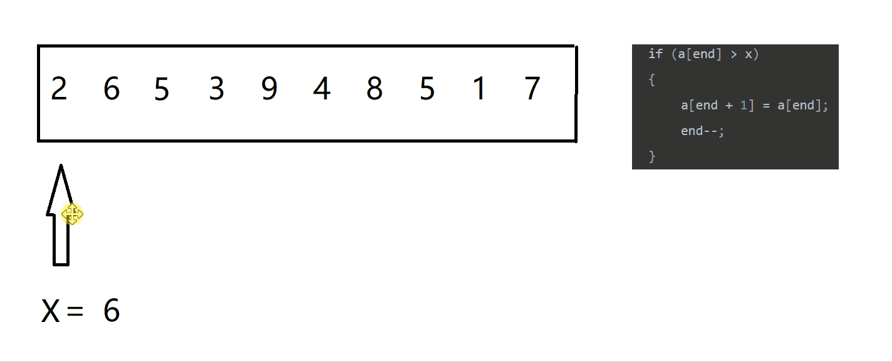
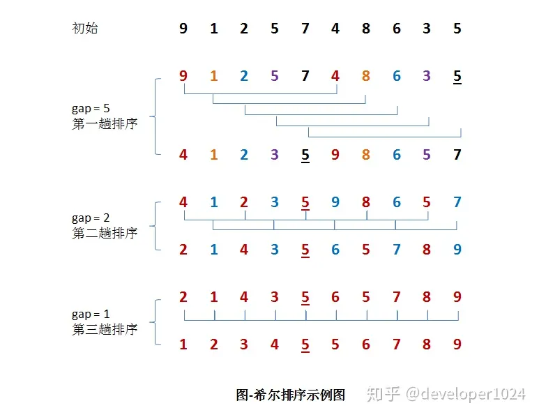
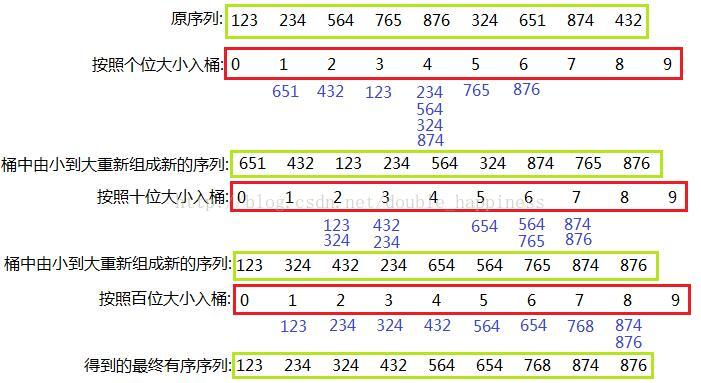
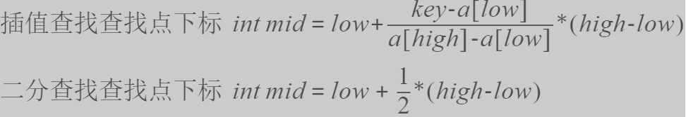
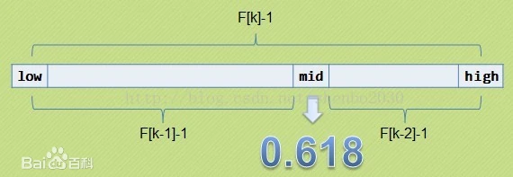

### 算法思想

基础思路： 枚举、递推、递归、

| 算法 | 思想 | 应用 |
| ---- | ---- | ---- |
| [分治法](https://zh.wikipedia.org/wiki/%E5%88%86%E6%B2%BB%E6%B3%95) | 把一个复杂的问题分成两个或更多的相同或相似的子问题，直到最后子问题可以简单的直接求解，原问题的解即子问题的解的合并 | [循环赛日程安排问题](https://github.com/huihut/interview/tree/master/Problems/RoundRobinProblem)、排序算法（快速排序、归并排序） |
| [动态规划](https://zh.wikipedia.org/wiki/%E5%8A%A8%E6%80%81%E8%A7%84%E5%88%92) | 通过把原问题分解为相对简单的子问题的方式求解复杂问题的方法，适用于有重叠子问题和最优子结构性质的问题 | [背包问题](https://github.com/huihut/interview/tree/master/Problems/KnapsackProblem)、斐波那契数列 |
| [贪心法](https://zh.wikipedia.org/wiki/%E8%B4%AA%E5%BF%83%E6%B3%95) | 一种在每一步选择中都采取在当前状态下最好或最优（即最有利）的选择，从而希望导致结果是最好或最优的算法 | 旅行推销员问题（最短路径问题）、最小生成树、哈夫曼编码 |
| [回溯法](https://zh.wikipedia.org/wiki/%E5%9B%9E%E6%BA%AF%E6%B3%95) | 一种可以找出所有（或一部分）解的一般性算法，尤其适用于[约束满足问题](https://zh.wikipedia.org/wiki/%E7%B4%84%E6%9D%9F%E6%BB%BF%E8%B6%B3%E5%95%8F%E9%A1%8C "约束满足问题")（在解决约束满足问题时，我们逐步构造更多的候选解，并且在确定某一部分候选解不可能补全成正确解之后放弃继续搜索这个部分候选解本身及其可以拓展出的子候选解，转而测试其他的部分候选解） | [八皇后问题](https://zh.wikipedia.org/wiki/%E5%85%AB%E7%9A%87%E5%90%8E%E9%97%AE%E9%A2%98)、深度优先搜索、0-1背包问题、正则表达式匹配 |

[95% 的算法都是基于这 6 种算法思想 - 知乎 (zhihu.com)](https://zhuanlan.zhihu.com/p/428479862)

## 排序


| 排序算法 | 平均时间复杂度 | 最差时间复杂度 | 空间复杂度 | 数据对象稳定性 | 思路 |
| ---- | ---- | ---- | ---- | ---- | ---- |
| [冒泡排序](#冒泡排序) | O(n2) | O(n2) | O(1) | 稳定 | （无序区，有序区）  <br>从无序区透过交换找出最大元素放到有序区前端 |
| [选择排序](#选择排序) | O(n2) | O(n2) | O(1) | 数组不稳定、链表稳定 | （有序区，无序区）<br>在无序区里找一个最小的元素跟在有序区的后面。对数组：比较得多，换得少 |
| [插入排序](#插入排序) | O(n2) | O(n2) | O(1) | 稳定 | （有序区，无序区）<br>把无序区的第一个元素插入到有序区的合适的位置。对数组：比较得少，换得多 |
| [快速排序](#快速排序) | O(n*log2n) | O(n2) | O(log2n) | 不稳定 | （小数，基准元素，大数）  <br>在区间中随机挑选一个元素作基准，将小于基准的元素放在基准之前，大于基准的元素放在基准之后，再分别对小数区与大数区进行排序 |
| [堆排序](#堆排序) | O(n*log2n) | O(n*log2n) | O(1) | 不稳定 | （最大堆，有序区）  <br>从堆顶把根卸出来放在有序区之前，再恢复堆 |
| [归并排序](#归并排序) | O(n*log2n) | O(n*log2n) | O(n) | 稳定 | 把数据分为两段，从两段中逐个选最小的元素移入新数据段的末尾。 <br>可从上到下或从下到上进行 |
| [希尔排序](#希尔排序) | O(n*log2n) | O(n2) | O(1) | 不稳定 | 每一轮按照事先决定的间隔进行插入排序，间隔会依次缩小，最后一次一定要是1 |
| [计数排序](#计数排序) | O(n+m) | O(n+m) | O(n+m) | 稳定 | 统计小于等于该元素值的元素的个数i，于是该元素就放在目标数组的索引i位（i≥0） |
| [桶排序](#桶排序) | O(n) | O(n) | O(m) | 稳定 | 将值为i的元素放入i号桶，最后依次把桶里的元素倒出来 |
| [基数排序](#基数排序) | O(k*n) | O(n2) |  | 稳定 | 一种多关键字的排序算法，可用桶排序实现 |

> 1. 均按从小到大排列 
> 2. k代表数值中的"数位"个数
> 3. n代表数据规模 
> 4. m代表数据的最大值减最小值

[排序算法 - 维基百科，自由的百科全书 (wikipedia.org)](https://zh.wikipedia.org/wiki/%E6%8E%92%E5%BA%8F%E7%AE%97%E6%B3%95)


### 冒泡排序

**算法：**
> 数据：（无序区，有序区）。
> 
> 从无序区通过交换找出最大元素放到有序区前端。

**步骤：**
1. 比较相邻的元素。如果第一个比第二个大，就交换它们两个。
2. 对每一对相邻元素作同样的工作，从开始第一对到结尾的最后一对。这步做完后，最后的元素会是最大的数。
3. 针对所有的元素重复以上的步骤，除了最后一个。
4. 持续每次对越来越少的元素重复上面的步骤，直到没有任何一对数字需要比较。

[Sort_Bubble](https://github.com/su-dd/learning/blob/main/src/algorithm/sort/Sort_Bubble.h)

```cpp
// 模板方法实现冒泡
template<typename T>
void sort_bubble(std::vector<T> &array)
{
	int len = array.size();
	for (int i = 0; i < len - 1; i ++)
	{
		for (int j = 0; j < len - 1 - i; j++)
		{
			if (array[j] > array[j + 1])
			{
				std::swap(array[j], array[j + 1]);
			}
		}
	}
}
```

### 选择排序

**算法：**
> 数据：（有序区，无序区）
> 
> 在无序区里找一个最小的元素跟在有序区的后面。对数组：比较得多，换得少

**步骤：**
1. 在未排序序列中找到最小（大）元素，存放到排序序列的起始位置
2. 从剩余未排序元素中继续寻找最小（大）元素，然后放到已排序序列的末尾
3. 以此类推，直到所有元素均排序完毕

[选择排序](https://github.com/su-dd/learning/blob/main/src/algorithm/sort/Sort_Selection.h)
```cpp
// 升序的选择排序
template<typename T>
void sort_select(std::vector<T>& array)
{
	int len = array.size();
	for (int i = 0; i < len - 1; i++) {
		int min = i;
		for (int j = i + 1; j < len; j++)
		{
			if (array[j] < array[min])
				min = j;
		}
		if (i != min)
			std::swap(array[i], array[min]);
	}
}
```

### 插入排序

**算法：**
> 数据：（有序区，无序区）。
> 
> 把无序区的第一个元素插入到有序区的合适的位置。对数组：比较得少，换得多。

**步骤：**
1. 从第一个元素开始，该元素可以认为已经被排序
2. 取出下一个元素，在已经排序的元素序列中从后向前扫描
3. 如果该元素（已排序）大于新元素，将该元素移到下一位置
4. 重复步骤3，直到找到已排序的元素小于或者等于新元素的位置
5. 将新元素插入到该位置后
6. 重复步骤2~5



[插入排序](https://github.com/su-dd/learning/blob/main/src/algorithm/sort/Sort_Insert.h)

```cpp
template<typename T>
void sort_insert(std::vector<T>& array)
{
	for (int i = 1; i < array.size(); i++)
	{
		T temp = array[i];
		for (int k = i - 1; k >= 0; k--)
		{
			if (temp < array[k])
			{
				array[k + 1] = array[k];
				array[k] = temp;
			}
			else
				break;
		}
	}
}
```


### 快速排序

**算法：**
> 数据：（小数，基准元素，大数）。
> 
> 在区间中随机挑选一个元素作基准，将小于基准的元素放在基准之前，大于基准的元素放在基准之后，再分别对小数区与大数区进行排序。

**步骤：**
1. 选取第一个数为基准
2. 将比基准小的数交换到前面，比基准大的数交换到后面
3. 对左右区间重复第二步，直到各区间只有一个数

[快速排序](https://github.com/su-dd/learning/blob/main/src/algorithm/sort/Sort_Quick.h)

```cpp
// 快速排序（递归）
template<typename T>
void sort_quick_recursive(std::vector<T>& array, int start, int end)
{
    if (start >= end) return;
    T mid = array[end]; // 标志数据
    int left = start, right = end - 1;
    while (left < right)
    {
        while (array[left] < mid && left < right)
            left++;
        while (array[right] >= mid && left < right)
            right--;
        std::swap(array[left], array[right]);
    }

    // 这时 left和right的值相同，判断当前值和mid（标志数据）的大小；做交换，保障顺序
    if (array[left] > mid)       
        std::swap(array[left], array[end]);

    sort_quick_recursive(array, start, left - 1);
    sort_quick_recursive(array, left + 1, end);
}

template<typename T>
void sort_quick_recursion(std::vector<T>& array)
{
    sort_quick_recursive<int>(array, 0, array.size() - 1);
}

// 快速排序（迭代）
struct Range {
    int start, end;
    Range(int s = 0, int e = 0) {
        start = s, end = e;
    }
};

// 整数或浮点数皆可使用,若要使用物件(class)时必须设定"小于"(<)、"大于"(>)、"不小于"(>=)的运算子功能
template <typename T> 
void sort_quick_iterate(std::vector<T> &array) {
    int len = array.size();
    std::stack<Range> rangeStack;
    rangeStack.emplace(0, len - 1);

    while (!rangeStack.empty()) {
        Range curRange = rangeStack.top();
        rangeStack.pop();

        if (curRange.start >= curRange.end)
            continue;

        T mid = array[curRange.end];   // 标志数据

        int left = curRange.start, right = curRange.end - 1;

        while (left < right) 
        {
            while (array[left] < mid && left < right) 
                left++;
            while (array[right] >= mid && left < right)
                right--;

            if (left < right)
                std::swap(array[left], array[right]);
        }

        // 这时 left和right的值相同，判断当前值和mid（标志数据）的大小；做交换，保障顺序
        if (array[left] > mid)
            std::swap(array[left], array[curRange.end]);

        // 模拟递归
        rangeStack.emplace(curRange.start, left - 1);
        rangeStack.emplace(left + 1, curRange.end);
    }
}
```

### 堆排序

**算法：**
> 数据：（最大堆，有序区）  
> 
> 从堆顶把根卸出来放在有序区之前，再恢复堆

 通堆是通过一维数组来实现的，在数组起始位置为0的情形中：
1. 父节点i的左子节点在位置(2i+1)
2. 父节点i的右子节点在位置(2i+2)
3. 子节点i的父节点在位置 (i-1)/2

**步骤：**
1. 将当前排序调整为堆的结构
2. 将堆定数据取出，交换到有序取的最前面
3. 将剩下的堆回复到堆的结构
4. 重复2~3步骤

[堆排序](https://github.com/su-dd/learning/blob/main/src/algorithm/sort/Sort_Heap.h)

```cpp

template<typename T>
void max_heapify(std::vector<T> &array, int parentIndex)    // 大顶堆调整
{
    // 建立 父节点指针位置 和 子节点指针位置
    int dadIndex = parentIndex;
    int sonIndex = dadIndex * 2 + 1;
    int maxIndex = array.size() - 1;
    while (sonIndex <= maxIndex)
    { // 若 子节点指针位置 在范围內才做比较
        if (sonIndex + 1 <= maxIndex && array[sonIndex] > array[sonIndex + 1]) // 先比较两个子节点大小，选择小的
            sonIndex++;
        if (array[dadIndex] < array[sonIndex]) // 如果 父节点 < 子节点 代表调整完成，直接跳出函数
            return;
        else 
        {   // 否则较换父子內容再继续子节点和孙节点比较
            std::swap(array[dadIndex], array[sonIndex]);
            // 因为这里的循环是从树的叶子节点开始的，但当处理dadIndex时，他下面已经是堆了，所以只需要对dadIndex的值进行处理
            dadIndex = sonIndex;                
            sonIndex = dadIndex * 2 + 1;
        }
    }
}

template<typename T>
void sort_heap(std::vector<T>& array)
{   
    // 建立堆结构
    // 初始化，i从最后一个父节点开始调整
    int maxIndex = array.size() - 1;
    for (int i = (maxIndex - 1) / 2; i >= 0; i--)
        max_heapify(array, i);

    // 先将第一个元素和已经排好的元素前一位做较换，再从新调整(刚调整的元素之前的元素)，直到排序完成
    for (int i = maxIndex; i > 0; i--)
    {
        std::swap(array[0], array[i]);  // 取堆定数据交换到有序区
        max_heapify(array, 0);
    }
}
```


### 归并排序

**算法：**
	把数据分为两段，从两段中逐个选最小的元素移入新数据段的末尾。 
	可从上到下或从下到上进行
	
**递归法（Top-down）**
1. 申请空间，使其大小为两个已经排序序列之和，该空间用来存放合并后的序列
2. 设定两个指针，最初位置分别为两个已经排序序列的起始位置
3. 比较两个指针所指向的元素，选择相对小的元素放入到合并空间，并移动指针到下一位置
4. 重复步骤3直到某一指针到达序列尾
5. 将另一序列剩下的所有元素直接复制到合并序列尾

[归并排序](https://github.com/su-dd/learning/blob/main/src/algorithm/sort/Sort_Merge.h)

```cpp
template<typename T>
void sort_merge_recursive(std::vector<T>& array, std::vector<T>& temp, int start, int end)
{
	if (start >= end)
		return;

	int len = end - start;
	int mid = len / 2 + start;
	int start1 = start, end1 = mid;
	int start2 = mid + 1, end2 = end;
	sort_merge_recursive(array, temp, start1, end1);
	sort_merge_recursive(array, temp, start2, end2);
	
	int k = start;
	while (start1 <= end1 && start2 <= end2)
		temp[k++] = (array[start1] <= array[start2] ? array[start1++] : array[start2++]);

	while (start1 <= end1)
		temp[k++] = array[start1++];
		
	while (start2 <= end2)
		temp[k++] = array[start2++];

	for (int k = start; k <= end; k++)	// 将排序好的数据，回到array中，以便后续使用
		array[k] = temp[k];
}

//整数或浮点数皆可使用,若要使用物件(class)时必须设定"小于"(<)的运算子功能
template<typename T>
void sort_merge_recursion(std::vector<T> &array)
{
	std::vector<T> temp(array);
	sort_merge_recursive(array, temp, 0, array.size() - 1);
}
```


**迭代法（Bottom-up）**

原理如下（假设序列共有n个元素）：
1. 将序列每相邻两个数字进行归并操作，形成ceil(n/2)个序列，排序后每个序列包含两/一个元素
2. 若此时序列数不是1个则将上述序列再次归并，形成ceil(n/4)个序列，每个序列包含四/三个元素
3. 重复步骤2，直到所有元素排序完毕，即序列数为1

```cpp
//整数或浮点数皆可使用,若要使用物件(class)时必须设定"小于"(<)的运算子功能
template<typename T>
void sort_merge_iterate(std::vector<T> &array) {
	std::vector<T> temp(array);
	int len = array.size();
	// seg 为合并的区间大小，从1开始，后面每次乘2
	for (int seg = 1; seg < len; seg += seg)
	{
		for (int start = 0; start < len; start += seg + seg) 
		{
			int low = start;
			int mid = std::min(start + seg, len);
			int high = std::min(start + seg + seg, len);

			int start1 = low, end1 = mid;
			int start2 = mid, end2 = high;

			int k = low;
			while (start1 < end1 && start2 < end2)
				temp[k++] = array[start1] <= array[start2] ? array[start1++] : array[start2++];
			while (start1 < end1)
				temp[k++] = array[start1++];
			while (start2 < end2)
				temp[k++] = array[start2++];

			// 将排序好的数据，回到array中，以便后续使用
			for (int k = low; k < high; k++)
				array[k] = temp[k];
		}
	}
}
```


### 希尔排序

**算法：**
	先将整个待排元素序列分割成若干个子序列（由相隔某个“增量”的元素组成的）分别进行直接插入排序，然后依次缩减增量再进行排序，待整个序列中的元素基本有序（增量足够小）时，再对全体元素进行一次直接插入排序



**步骤：**
1. 先取一个小于n的整数d1作为第一个增量，把文件的全部记录分成d1个组。  
2.  所有距离为d1的倍数的记录放在同一个组中，在各组内进行直接插入排序。 
3.  取第二个增量d2小于d1重复上述的分组和排序，直至所取的增量dt=1(dt小于dt-l小于…小于d2小于d1)，即所有记录放在同一组中进行直接插入排序为止。

[希尔排序](https://github.com/su-dd/learning/blob/main/src/algorithm/sort/Sort_Shell.h)

```cpp
template<typename T>
void shell_sort(std::vector<T> array) {
    int len = array.size();

    int h = 1;
    while (h < len / 3) // 寻找一个合适的增量
    {
        h = 3 * h + 1;
    }

    while (h >= 1) 
    {
        for (int i = h; i < len; i++) // 共划分出 （len - 1 - h）个数组
        {
            // 按h作为增量，划分的子序列中做插入排序;
            // 这里的插入排序，是最开始只取两个保证有序，再慢慢添加
            for (int j = i; j >= h && temp < array[j - h]; j -= h)  
            {
                std::swap(array[j], array[j - h]);
            }
        }
        h = h / 3;
    }
}
```

### 计数排序

**算法：** 
	统计小于等于该元素值的元素的个数i，于是该元素就放在目标数组的索引i位（i≥0）。
	
计数排序基于一个假设:

	待排序数列的所有数均为整数，且出现在（0，k）的区间之内。

	如果 k（待排数组的最大值） 过大则会引起较大的空间复杂度，一般是用来排序 0 到 100 之间的数字的最好的算法，但是它不适合按字母顺序排序人名。

	计数排序不是比较排序，排序的速度快于任何比较排序算法。

	时间复杂度为 O（n+k），空间复杂度为 O（n+k）

**步骤：**
1. 找出待排序的数组中最大和最小的元素
2. 统计数组中每个值为 i 的元素出现的次数，存入数组 C 的第 i 项
3. 对所有的计数累加（从 C 中的第一个元素开始，每一项和前一项相加）
4. 反向填充目标数组：将每个元素 i 放在新数组的第 C[i] 项，每放一个元素就将 C[i] 减去 1

[计数排序](https://github.com/su-dd/learning/blob/main/src/algorithm/sort/Sort_Count.h)

```cpp
#include <vector>
#include <algorithm>

// 计数排序
void sort_count(std::vector<int>& vecRaw, std::vector<int>& vecObj)
{
	// 确保待排序容器非空
	if (vecRaw.size() == 0)
		return;

	// 使用 vecRaw 的最大值 + 1 作为计数容器 countVec 的大小 (加1，后数字下标 和 需要排序的值整合对应)
	int vecCountLength = (*max_element(begin(vecRaw), end(vecRaw))) + 1;
	std::vector<int> vecCount(vecCountLength, 0);

	// 统计每个键值出现的次数
	for (int i = 0; i < vecRaw.size(); i++)
		vecCount[vecRaw[i]]++;

	// 后面的键值出现的位置为前面所有键值出现的次数之和
	for (int i = 1; i < vecCountLength; i++)
		vecCount[i] += vecCount[i - 1];

	// 将键值放到目标位置
	for (int i = vecRaw.size(); i > 0; i--)	// 此处逆序是为了保持相同键值的稳定性
		vecObj[--vecCount[vecRaw[i - 1]]] = vecRaw[i - 1];
}

```

### 桶排序

**算法：**
	将数组分到有限数量的桶里。每个桶再个别排序（有可能再使用别的排序算法或是以递归方式继续使用桶排序进行排序）。
	
	当要被排序的数组内的数值是均匀分配的时候，桶排序使用线性时间 Θ(n)

**步骤：**
1. 设置一个定量的数组当作空桶子。
2. 寻访序列，并且把项目一个一个放到对应的桶子去。
3. 对每个不是空的桶子进行排序。
4. 从不是空的桶子里把项目再放回原来的序列中。

[桶排序](https://github.com/su-dd/learning/blob/main/src/algorithm/sort/Sort_Bucket.h)

```cpp
// 假设数据分布在[0，100)之间，每个桶内部用链表表示，在数据入桶的同时插入排序。然后把各个桶中的数据合并。

const int BUCKET_NUM = 10;

struct ListNode 
{
	explicit ListNode(int i = 0) :mData(i), mNext(NULL) {}
	ListNode* mNext;
	int mData;
};

ListNode* insertBucket(ListNode* head, int val)
{
	ListNode dummyNode;		// 引入空Node ，是为了解决val插在最前面的情况
	ListNode* newNode = new ListNode(val);
	ListNode* pre, * curr;
	dummyNode.mNext = head;
	pre = &dummyNode;
	curr = head;
	while (NULL != curr && curr->mData <= val)	// 这里等号需要存在，否则就不稳定了
	{
		pre = curr;
		curr = curr->mNext;
	}
	newNode->mNext = curr;
	pre->mNext = newNode;
	return dummyNode.mNext;
}


ListNode* mergeBucket(ListNode* head1, ListNode* head2) 
{
	ListNode dummyNode;
	ListNode* dummy = &dummyNode;
	while (NULL != head1 && NULL != head2)
	{
		// 相同是 数值 ，只能在同一个桶里； 所以这里的判断是否带等会，不重要
		if (head1->mData < head2->mData)
		{
			dummy->mNext = head1;
			head1 = head1->mNext;
		}
		else
		{
			dummy->mNext = head2;
			head2 = head2->mNext;
		}
		dummy = dummy->mNext;
	}
	if (NULL != head1) dummy->mNext = head1;
	if (NULL != head2) dummy->mNext = head2;

	return dummyNode.mNext;
}

void sort_bucket(std::vector<int> &array)
{
	int len = array.size();

	std::vector<ListNode*> buckets(BUCKET_NUM, (ListNode*)(0));

	for (int i = 0; i < len; ++i)
	{
		int index = array[i] / BUCKET_NUM;
		ListNode* head = buckets.at(index);
		buckets.at(index) = insertBucket(head, array[i]);
	}

	ListNode* head = buckets.at(0);
	for (int i = 1; i < BUCKET_NUM; ++i)
	{
		head = mergeBucket(head, buckets.at(i));
	}

	for (int i = 0; i < len; ++i) {
		array[i] = head->mData;
		head = head->mNext;
	}
}
```

### 基数排序

**基数排序：**

	一种多关键字的排序算法，是桶排序的扩展。		

**基本思想：** 取得所有数的数位并统一为相同的长度，数位较短的数字前面补零。

从低位开始排序，分别放入0~9个队列中，然后采用先进先出的原则进行收集；
按照高位排序，然后在收集；依次类推，直到最高位，最终得到排好序的数列。
对于数值偏小的一组序列，该算法速度非常快，时间复杂度可以达到线性。

**理解：**
1. 没一次的排序，都是一次分组排序；使得当前位上的数据有序；
2. 高位比低位权重更重，所以防止后面。

**步骤：**
1. 取得数组中的最大数并取得位数；
2. 对数位较短的数进行前面补零；
3. 从个位开始分配，根据位值（0-9）分别放在（0-9）号桶中；
4. 收集数据放在（0 ~ 9）号桶中的数据按顺序放到数组中；
5. 重复3 ~ 4过程，直到最高位，即可完成排序。



[基数排序](https://github.com/su-dd/learning/blob/main/src/algorithm/sort/Sort_Radix.h)

```cpp
// 辅助函数，求数据的最大位数
int maxbit(int data[], int n)
{
    int maxData = data[0];		///< 最大数
    /// 先求出最大数，再求其位数，这样有原先依次每个数判断其位数，稍微优化点。
    for (int i = 1; i < n; ++i)
    {
        if (maxData < data[i])
            maxData = data[i];
    }

    int d = 1;
    int p = 10;
    while (maxData >= p)
    {
        //p *= 10; // Maybe overflow
        maxData /= 10;
        ++d;
    }
    return d;
}

// 基数排序
void sort_radix(int data[], int n)
{
    int d = maxbit(data, n);
    int* tmp = new int[n];
    int* count = new int[10]; //计数器
    int index = 0;
    int radix = 1;
    for (int i = 1; i <= d; i++) //进行d次排序
    {
        //每次分配前清空计数器
        for (int j = 0; j < 10; j++)
            count[j] = 0; 

        for (int j = 0; j < n; j++)
        {
            index = (data[j] / radix) % 10; //统计每个桶中的记录数
            count[index]++;
        }

        for (int j = 1; j < 10; j++)
        {
            count[j] = count[j - 1] + count[j]; //将tmp中的位置依次分配给每个桶
        }

        for (int j = n - 1; j >= 0; j--) //将所有桶中记录依次收集到tmp中
        {
            index = (data[j] / radix) % 10;
            tmp[count[index] - 1] = data[j];
            count[index]--;
        }

        for (int j = 0; j < n; j++) //将临时数组的内容复制到data中
        {
            data[j] = tmp[j];
        }
        radix = radix * 10;
    }
    delete[] tmp;
    delete[] count;
}
```

## 查找

| 查找算法 | 平均时间复杂度 | 空间复杂度 | 查找条件 |
| ---- | ---- | ---- | ---- |
| [顺序查找](#顺序查找) | O(n) | O(1) | 无序或有序 |
| [二分查找（折半查找）](#二分查找) | O(log2n) | O(1) | 有序 |
| [插值查找](#插值查找) | O(log2(log2n)) | O(1) | 有序 |
| [斐波那契查找](#斐波那契查找) | O(log2n) | O(1) | 有序 |
| [哈希查找](#哈希查找) | O(1) | O(n) | 无序或有序 |
| [二叉查找树（二叉搜索树查找）](#二叉查找树) | O(log2n) |  |  |
| [红黑树](#红黑树) | O(log2n) |  |  |
| [2-3树](#2-3树) | O(log2n - log3n) |  |  |
| [B树/B+树](#B树/B+树) | O(log2n) |  |  |


### 顺序查找

[SequentialSearch](https://github.com/huihut/interview/blob/master/Algorithm/SequentialSearch.h)

**常规做法：**
```cpp
// 顺序查找
int SequentialSearch(vector<int>& v, int k) {
	for (int i = 0; i < v.size(); ++i)
		if (v[i] == k)
			return i;
	return -1;
}
```

**减少判断的做法：**
```cpp
/* The following is a Sentinel Search Algorithm which only performs 
    just one test in each loop iteration thereby reducing time complexity */

int BetterSequentialSearch(vector<int>& v, int k) {
    int last = v[v.size()-1];
    v[v.size()-1] = k;
    int i = 0;
	while (v[i]!= k)
        	i++;
    v[v.size()-1] = last;
    if(i < v.size()-1 || v[v.size()-1] == k)
        return i;
    return -1;
}
```


### 二分查找

二分查找（折半查找）：对于已排序，若无序，需要先排序

**步骤：**

（1）key值与第mid=（low+high）/2相等，mid位置的元素即为所求；

（2）key值大于第mid=（low+high）/2，则令 low=mid+1；

（3）key值小于第mid=（low+high）/2，则令high=mid-1。


[BinarySearch](https://github.com/huihut/interview/blob/master/Algorithm/BinarySearch.h)

**递归：**

```cpp
// 递归
int BinarySearch2(vector<int> v, int value, int low, int high)
{
	if (low > high)
		return -1;
	int mid = low + (high - low) / 2;
	if (v[mid] == value)
		return mid;
	else if (v[mid] > value)
		return BinarySearch2(v, value, low, mid - 1);
	else
		return BinarySearch2(v, value, mid + 1, high);
}
```

**迭代：**
```cpp
// 非递归
int BinarySearch(vector<int> v, int value , int low, int high) {
	if (v.size() <= 0) {
		return -1;
	}
	while (low <= high) {
		int mid = low + (high - low) / 2;
		if (v[mid] == value) {
			return mid;
		}
		else if (v[mid] > value) {
			high = mid - 1;
		}
		else {
			low = mid + 1;
		}
	}

	return -1;
}

```

### 插值查找

**插值查找基于二分查找**，不同的是插值查找每次从自适应mid处开始查找，提高查找效率。



插值查找是一种在**有序数组**（前提条件）中查找某一特定元素的查找算法。

插值查找的本质是认为：值在空间中均匀分布；通过

[InsertionSearch](https://github.com/huihut/interview/blob/master/Algorithm/InsertionSearch.h)

**递归：**
```cpp
int InsertionSearch(int a[], int value, int low, int high)
{
    if (low < high)
    {
        return -1;
    }
    int mid = low + (value - a[low]) / (a[high] - a[low]) * (high - low);
    if (a[mid] == value)
        return mid;
    if (a[mid] > value)
        return InsertionSearch(a, value, low, mid - 1);
    if (a[mid] < value)
        return InsertionSearch(a, value, mid + 1, high);
}
```

**迭代：**
```cpp
int InsertionSearch2(int a[], int value, int low, int high)
{
    while (low < high)
    {
        int mid = low + (value - a[low]) / (a[high] - a[low]) * (high - low);
        if (a[mid]) == value)
        {
            return mid;
        }
        else if (a[mid] > value)
        {
            hig = mid - 1;
        }
        else
        {
            low = mid + 1;
        }
    }
    return -1;
}

```

### 斐波那契数列查找

**斐波那契数列：** 又称"兔子数列"，是数学家 莱昂纳多·斐波那契 提出的兔子繁殖问题而引入。数值为：`0、1、1、2、3、5、8、13、21、34……`

数学上定义为：`F(0)=1，F(1)=1, F(n)=F(n - 1)+F(n - 2)（n ≥ 2，n ∈ N*`

**黄金分割：**

指事物各部分间一定的数学比例关系，即将整体一分为二，较大部分与较小部分之比等于整体与较大部分之比，其比值约为1:0.618或1.618:1。0.618被公认为最具有审美意义的比例数字，这个数值的作用不仅仅体现在诸如绘画、雕塑、音乐、建筑等艺术领域，而且在管理、工程设计等方面也有着不可忽视的作用。

**斐波那契数列和黄金分割：**

随着斐波那契数列的递增，前后两个数的比值会越来越接近0.618，利用这个特性，我们就可以将黄金比例运用到查找技术中：

> 就是让数列的大小按黄金比例进行缩减



**已经证明，斐波那契搜索是一种函数估值次数最少的最优搜索方法**


[FibonacciSearch](https://github.com/huihut/interview/blob/master/Algorithm/FibonacciSearch.cpp)

```cpp
/*构造一个斐波那契数组*/
const static int FibonacciArray[47] = {
    0,          1,          1,          2,          3,          5,          8,          13,         21,         34,
    55,         89,         144,        233,        377,        610,        987,        1597,       2584,       4181,
    6765,       10946,      17711,      28657,      46368,      75025,      121393,     196418,     317811,     514229,
    832040,     1346269,    2178309,    3524578,    5702887,    9227465,    14930352,   24157817,   39088169,   63245986,
    102334155,  165580141,  267914296,  433494437,  701408733,  1134903170, 1836311903
};

/*定义斐波那契查找法*/  
int FibonacciSearch(int *a, int n, int key)  //a为要查找的数组,n为要查找的数组长度,key为要查找的关键字
{
    int low=0;
    int high=n-1;
    
    int index = 0;  // 记录在斐波那契数列的位置
    while(n > FibonacciArray[index]-1)//计算n位于斐波那契数列的位置
        ++index;
    
    int * temp;//将数组a扩展到F[k]-1的长度
    temp = new int[FibonacciArray[index] - 1];
    memcpy(temp,a,n*sizeof(int));
    for (int i = n; i < FibonacciArray[index] - 1;++i)
        temp[i]=a[n-1];
    
    while(low <= high)
    {
        int mid = low + FibonacciArray[index - 1] - 1;
        if (key < temp[mid])
        {
            high = mid - 1;
            index -= 1;
        }
        else if(key > temp[mid])
        {
            low = mid + 1;
            index -= 2;
        }
        else
        {
           if(mid < n)
               return mid; //若相等则说明mid即为查找到的位置
           else
               return n-1; //若mid>=n则说明是扩展的数值,返回n-1
        }
    }  
    delete [] temp;
    return -1;
}
```


### 哈希查找

哈希查找也叫散列查找，整个散列查找过程大概分两步：

1. 在存储时通过散列函数计算记录的散列地址，并按此散列地址存储该记录。
2. 当查找时，一样通过散列函数计算记录的散列地址，然后访问散列地址的记录。

**散列函数的构造方法**
（1）直接定址法

取关键字的某个线性函数值为散列地址

> f(key)=a×key+b
> 
*需要事先知道关键字的分布情况，适合查找表较小且连续的情况。*

（2）数字分析法

使用关键字的一部分来计算散列存储的位置。

> *适合处理关键字位数较大的情况。*

（3）平方取中法

假设关键字是1234，那它的平方就是1522756，再抽取中间的3位就是277

> *适合不知道关键字的分布，而位数又不是很大的情况。*

（4）折叠法

将关键字从左到右分割成位数相等的几个部分，然后将这几部分叠加求和，并按散列表表长，取后几位作为散列地址。比如关键字是9876543210，散列表表长为三位，我们将它分成四组，987|654|321|0，然后将他们叠加求和等于1962，再求后三位得到散列地址962。

> *适合事先不知道关键字的分布，关键字位数叫多的情况。*

（5）除留余数法   

此方法为最常用的构造散列函数的方法。

> f(key)=key mod p

**处理冲突散列的方法**

（1）开放定址法

开放定址法就是一旦出现了冲突，就去寻找下一个空的散列地址，只要散列地址够大，空的散列地址总会被找到。

> fi(key)=(f(key)+di) MOD m (di=1,2,3,.....m−1)

（2）再散列函数法

事先准备多几个散列函数

> fi=RHi(key) (i=1,2,...k)
> 
> 这里的RHi就是不同的散列函数

（3）链地址法

将所有同关键字的记录存储在一个单链表中，称这种表为同义词子表，在散列表中只存储所有同义词子表的头指针。

[HashTable](https://github.com/huihut/interview/blob/master/DataStructure/HashTable.cpp)

### 二叉查找树

**算法:**

在二叉搜索树b中查找x的过程为：
1. 若b是空树，则搜索失败，否则：
2. 若x等于b的根节点的数据域之值，则查找成功；否则：
3. 若x小于b的根节点的数据域之值，则搜索左子树；否则：
4. 查找右子树。 

[BSTSearch](https://github.com/huihut/interview/blob/master/Algorithm/BSTSearch.h)

```cpp
bool SearchBST(BiTree T, KeyType key, BiTree f, BiTree &p){

  if(!T) { //查找不成功
    p=f;
    return false;
  }
  else if (key == T->data.key) { //查找成功
    p=T;
    return true;
  }
  else if (key < T->data.key) //在左子树中继续查找
    return SearchBST(T->lchild, key, T, p);
  else //在右子树中继续查找
    return SearchBST(T->rchild, key, T, p);
}
```

### 红黑树

[RedBlackTree](https://github.com/huihut/interview/blob/master/DataStructure/RedBlackTree.cpp)
### 2-3树

### B树/B+树

## 图搜索

| 图搜索算法 | 数据结构 | 遍历时间复杂度 | 空间复杂度 |
| ---- | ---- | ---- | ---- |
| [BFS广度优先搜索](#BFS广度优先搜索) | 邻接矩阵  <br>邻接链表 | O(\|v\|2)  <br>O(\|v\|+\|E\|) | O(\|v\|2)  <br>O(\|v\|+\|E\|) |
| [DFS深度优先搜索](#DFS深度优先搜索) | 邻接矩阵  <br>邻接链表 | O(\|v\|2)  <br>O(\|v\|+\|E\|) | O(\|v\|2)  <br>O(\|v\|+\|E\|) |

### BFS广度优先搜索

[BFS广度优先搜索](https://zh.wikipedia.org/wiki/%E5%B9%BF%E5%BA%A6%E4%BC%98%E5%85%88%E6%90%9C%E7%B4%A2)

### DFS深度优先搜索

[DFS深度优先搜索](https://zh.wikipedia.org/wiki/%E6%B7%B1%E5%BA%A6%E4%BC%98%E5%85%88%E6%90%9C%E7%B4%A2)

## 经典算法题

### 背包问题


### 旅行推销员问题


### 八皇后问题


### 水滴问题


### 限流算法


### 令牌桶


### 