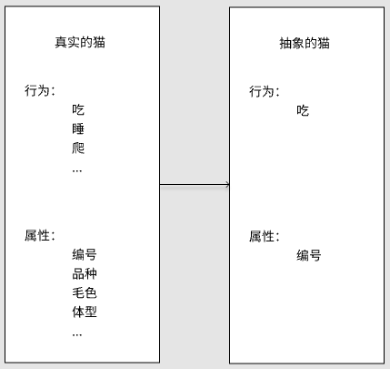

## HelloWorld
传说一切语言的第一个程序都是“HelloWorld！”

如下为C++的：

```cpp
#include <iostream>

int main(int argc, char* argv[])
{
 std::cout << "Hello World!" << std::endl;
    return 0;
}
```

简单做一个认识吧：
### main函数

函数的格式:

```cpp
返回值类型 函数名(参数类型 参数， ... )
{
  函数体
}
```

c++程序都是由main函数开始的;

main函数的返回值类型一般为int类型，返回0表示执行成功。

例：

```cpp
int main(int argc, char* argv[])
{
 *****
  return 0;
}
```

### 基本输入输出

有输入和输出的程序才有意义。

C++的基本输入输出流为：cin 和 cout

需要：

1、引入头文件

```cpp
#include <iostream>
```

2、使用命名空间：std

```cpp
using namespace std;

或

std::cout
std::cin
```


**代码：**

```cpp
#include <iostream>
#include <string>
using namespace std;
int main(int argc, char* argv[])
{
 cout << "Hello World!" << endl;

 cout << "请输入你的名字：";
 string name;
 cin >> name;
 cout << "你好！" << name << endl;

 return 0;
}
```


**运行：**


### 变量&注释


#### 注释

C++ 支持单行注释和多行注释。注释中的所有字符会被 C++ 编译器忽略。

C++ 注释一般有两种：

// - 一般用于单行注释。

/*...*/ - 一般用于多行注释。

#### 变量

C++中，变量是程序运行中需要申请的存储空间的助记符；编译完成的程序中是不存在变量的。

声明一个变量，即从申请了一个存储空间；初始化一个变量，即给存储空间一个值。


## 基础概念

### 函数 & 参数 & 返回值

回到熟悉的Hello World,来学习一下函数、的概念。


函数的一般形式为：

```cpp
返回值类型 函数名(参数列表)
{
  函数体
}
```


例：封装两个int相加的函数，并使用

```cpp
int add(int a, int b)
{
 return a + b;
}

int main(int argc, char* argv[])
{
 int a = add(1, 2);
 cout << a << endl;
 return 0;
}
```


结果：

> 3

### 变量 & 作用域

在 【HelloWorld】中 第一次说到【变量 】，这里再一次提，主要想讲解 作用域是什么。

#### 作用域：全局变量，局部变量，形参

作用域：简易理解，一个`{}`决定了一个作用域。如果不在任何`{}`,就是全局。

作用域和变量的关系，具体有以下几点：

1. 变量的作用域为：从变量定义开始，到对应的`}` 为止；
2. 变量只在其作用域内有效；
3. 同一个作用域，不能定义两个相同的变量；
4. 当使用一个变量a时，发现当前位置有两个不同的作用域都有a的声明定义；a取声明最近的一个。

具体可以结合以下代码理解：

```cpp
#include <iostream>
using namespace std;

int b = 2; // b 为 全局变量

int add(int a, int b) // a、b 为 形式参数（简称：形参）
{
 cout << "函数 ： " << endl;
 cout << "a ： " << a << endl;
 cout << "b ： " << b << endl;
 return a + b;
}

int main(int argc, char* argv[])  // argc、argv 为 形式参数（简称：形参）
{
 int a = 1; // a 为 局部变量；

 {
  int a = add(b, 1); // a 为 局部变量； b 为 全局变量
  cout << "a ： " << a << endl;
 }

 cout << "a ： " << a << endl;
 return 0;
}
```


结果：

> 函数 ：
>
> a ： 2
>
> b ： 1
>
> a ： 3
>
> a ： 1

名词解释：

**全局变量：** 函数外部的变量，不在任何`{}`内的变量。

**局部变量：** 存在某个`{}`内部的变量。

**形参：** 函数的参数


## 基础类型

### 基础类型

C++的基础数据类型有：

bool ： 处理 布尔类型 值 true 或 false；

char ： 处理 字符类型数据；

int ：处理 整型 数据

float ：处理 浮点数

double ： 处理 双精度浮点数

wchar_t（宽字符型）：如果常量以 L（仅当大写时）开头，则表示它是一个宽字符常量（例如 L’x’），此时它必须存储在 wchar_t 类型的变量中。否则，它就是一个窄字符常量（例如 ‘x’），此时它可以存储在 char 类型的简单变量中。

void ： 空类型


#### 修饰符

除此外，还有类型修饰符：signed、unsigned、long 和 short

可以被类型修饰符修饰的类型有：int char 和 double

其中：

int 可以被 signed、unsigned、long 和 short 修饰 char 可以被 signed、unsigned 修饰 double 可以被 long 修饰

如果只写：signed、unsigned、long 和 short 等价于： signed int、unsigned int、long int 和 short int


#### 范围

不同的编译器，数据类型的大小不同

```cpp
#include <iostream>
#include <limits>
using namespace std;
int main(int argc, char* argv[])
{
    cout << "bool:\t\t\t" << sizeof(bool) << "\t字节\t" << "范围:" << numeric_limits<bool>::min() << "~" << numeric_limits<bool>::max() << endl;
    cout << "char:\t\t\t" << sizeof(char) << "\t字节\t" << "范围:" << (int)numeric_limits<char>::min() << "~" << (int)numeric_limits<char>::max() << endl;
    cout << "signed char:\t\t" << sizeof(signed char) << "\t字节\t" << "范围:" << (int)numeric_limits<signed char>::min() << "~" << (int)numeric_limits<signed char>::max() << endl;
    cout << "unsigned char:\t\t" << sizeof(unsigned char) << "\t字节\t" << "范围:" << (int)numeric_limits<unsigned char>::min() << "~" << (int)numeric_limits<unsigned char>::max() << endl;
    cout << "int:\t\t\t" << sizeof(int) << "\t字节\t" << "范围:" << numeric_limits<int>::min() << "~" << numeric_limits<int>::max() << endl;
    cout << "signed int:\t\t" << sizeof(signed int) << "\t字节\t" << "范围:" << numeric_limits<signed int>::min() << "~" << numeric_limits<signed int>::max() << endl;
    cout << "signed:\t\t\t" << sizeof(signed) << "\t字节\t" << "范围:" << numeric_limits<signed>::min() << "~" << numeric_limits<signed>::max() << endl;
    cout << "unsigned int:\t\t" << sizeof(unsigned int) << "\t字节\t" << "范围:" << numeric_limits<unsigned int>::min() << "~" << numeric_limits<unsigned int>::max() << endl;
    cout << "unsigned:\t\t" << sizeof(unsigned) << "\t字节\t" << "范围:" << numeric_limits<unsigned>::min() << "~" << numeric_limits<unsigned>::max() << endl;
    cout << "short int:\t\t" << sizeof(short int) << "\t字节\t" << "范围:" << numeric_limits<short int>::min() << "~" << numeric_limits<short int>::max() << endl;
    cout << "short:\t\t\t" << sizeof(short) << "\t字节\t" << "范围:" << numeric_limits<short>::min() << "~" << numeric_limits<short>::max() << endl;
    cout << "signed short int:\t" << sizeof(signed short int) << "\t字节\t" << "范围:" << numeric_limits<signed short int>::min() << "~" << numeric_limits<signed short int>::max() << endl;
    cout << "unsigned short int:\t" << sizeof(unsigned short int) << "\t字节\t" << "范围:" << numeric_limits<unsigned short int>::min() << "~" << numeric_limits<unsigned short int>::max() << endl;
    cout << "long int:\t\t" << sizeof(long int) << "\t字节\t" << "范围:" << numeric_limits<long int>::min() << "~" << numeric_limits<long int>::max() << endl;
    cout << "long:\t\t\t" << sizeof(long) << "\t字节\t" << "范围:" << numeric_limits<long>::min() << "~" << numeric_limits<long>::max() << endl;
    cout << "signed long int:\t" << sizeof(signed long int) << "\t字节\t" << "范围:" << numeric_limits<signed long int>::min() << "~" << numeric_limits<unsigned long int>::max() << endl;
    cout << "unsigned long int:\t" << sizeof(unsigned long int) << "\t字节\t" << "范围:" << numeric_limits<unsigned long int>::min() << "~" << numeric_limits<unsigned long int>::max() << endl;
    cout << "float:\t\t\t" << sizeof(float) << "\t字节\t" << "范围:" << numeric_limits<float>::min() << "~" << numeric_limits<float>::max() << endl;
    cout << "double:\t\t\t" << sizeof(double) << "\t字节\t" << "范围:" << numeric_limits<double>::min() << "~" << numeric_limits<double>::max() << endl;
    cout << "long double:\t\t" << sizeof(long double) << "\t字节\t" << "范围:" << numeric_limits<long double>::min() << "~" << numeric_limits<long double>::max() << endl;
    cout << "wchar_t:\t\t" << sizeof(wchar_t) << "\t字节\t" << "范围:" << numeric_limits<wchar_t>::min() << "~" << numeric_limits<wchar_t>::max() << endl;
 return 0;
}
```


**使用：**  Microsoft Visual C++ x86 


**使用：** Microsoft Visual C++ x64 


**使用:** Ubuntu GCC 


### 基础运算符

| 优先权 | 运算符 | 说明 | 结合性 |
| :--: | :--: | :--- | :--: |
| 1 | () | 括号 | 由左至右 |
| 2 | !、-、++、-- | 逻辑运算符NOT、算术运算符负号、递增、递减 | 由右至左 |
| 3 | *、/、% | 算术运算符的乘法、除法、余数 | 由左至右 |
| 4 | +、- | 算术运算符加法、减法 | 由左至右 |
| 5 | <<、>>、>>> | 位操作子左移、右移、无符号右移 | 由左至右 |
| 6 | >、>=、<、<= | 关系运算符大于、大于等于、小于、小于等于 | 由左至右 |
| 7 | ==、!= | 关系运算符等于、不等于 | 由左至右 |
| 8 | & | 位操作子AND | 由左至右 |
| 9 | ^ | 位操作子XOR | 由左至右 |
| 10 | \| | 位操作子OR | 由左至右 |
| 11 | && | 逻辑运算符AND | 由左至右 |
| 12 | \|\| | 逻辑运算符OR | 由左至右 |
| 13 | ?: | 条件控制运算符 | 由右至左 |
| 14 | =、op= | 指定运算符 | 由右至左 |

**op=** 这里指： += 、 -= 、 *= 、 \= 、 %= 、 &= 、 ^= 、 |=

### 引用

在前面一篇我们知道，变量是内存地址的一个名字；引用是给一个已经有名称的内存地址，再起一个名字。

看下面代码，做一下深入理解：

```cpp
/*
* 引用
* 类型 & 引用变量名 = 引用实体；
*/
void test1()
{
 int a = 1;  // 声明并初始化 int 类型变量 a
 int& b = a;  // 定义引用类型 b，指向 变量a
 cout << b << endl;
 int& c = b;  // 定义引用类型 b，指向 变量b
 cout << c << endl;

 cout << &a << endl; // 输出a的内存地址
 cout << &b << endl; // 输出b的内存地址
 cout << &c << endl; // 输出c的内存地址
}
```


**结果：**

> 1
>
> 1
>
> 0x7fffffffe464
>
> 0x7fffffffe464
>
> 0x7fffffffe464

引用 不是新定义一个变量，而 是给已存在变量取了一个别名 ，编译器不会为引用变量开辟内存空间，它和它引用的变量共用同一块内存空间。


### 指针&指针初始化

指针（pointer）是 C++中的一个核心概念；是c++中常见的用来存在内存的一种工具。

理解指针有两个点：

1. 指针本身是一个大小等于int类型的变量。
2. 指针内存储着它指向的值的地址。

```cpp
void test1()
{
 int a = 1; // 声明并初始化 int 类型变量 a
 int* ptr;  // 声明int类型指针 ptr
 ptr = &a;  // 让指针ptr指向 变量a 的地址
 cout << ptr  << endl; // 输出 指针指向的地址
 cout << *ptr << endl; // 输出 指针指向的地址的值
 cout << &ptr << endl; // 输出 指针的地址
}
```


**结果：**

> 0x7fffffffe46c
>
> 1
>
> 0x7fffffffe470

以上demo，指针是指向**栈对象**，其实在正式的编程工作中，指针大多是指向**堆对象**的。

*栈对象 和 堆对象的区别，我们会在后续讲解。*

**堆对象** 的 创建 和 释放 是需要特殊的关键字；

C++中 一共有两对关键字：

**malloc**，**free** （C++，兼容C；所以可以用C的关键字）

**new**，**delete** （C++新增，常用这一对）

**这里注意：** free 和 delete 是 释放指针指向地址的内存，这时指针依然指向对应地址，不为空。

这时需要给指针赋空值，否则后续无法判断指针指向的位置是否有效，就会形成野指针。

同理，在声明一个指针是，通常就应该初始化；如果暂不确定值，可以赋空，防止野指针。

#### malloc & free

malloc 和 free 的一般形式：

```cpp
void *malloc(size_t size) 
void free(void *ptr)
```

malloc 分配指定大小为 size字节的内存空间，返回一个指向该空间的void*指针。 由于返回 void* 指针，所以需要强制类型转换后才能引用其中的值。

free 释放一个由 malloc 所分配的内存空间。ptr 指向一个要释放内存的内存块， 该指针应当是之前调用 malloc 的返回值。

```cpp
void test3()
{
 int* ptr = nullptr; // 通常指针变量声明时，就应该初始化；如果暂不确定值，可以赋空，防止野指针。
 ptr = (int*)malloc(sizeof(int)); // 申请一个int大小的堆内存，并进行强制类型转换
 *ptr = 1; // 对ptr指向的位置赋值
 cout << *ptr << endl; // 输出
 free(ptr);
  ptr = nullptr;
}
```


**结果：**

> 1
>
> 0x55555556aeb0
>
> 0x55555556aeb0


#### new & delete

new & delete 的一般形式：

```cpp
类型* 指针名 = new 类型();
delete 指针名
```


new 按照类型的大小，分配内存。 delete 释放指针指向地址的内存，这是指针依然指向对应地址，不为空。 通常会在 delete 后，增加一个 给指针变量赋空的操作；防止野指针。

```cpp
void test4()
{
 int* ptr = new int(4); // 声明并初始化 int类型 指针 ptr
 cout << ptr << endl; // 输出 ptr 指向的地址
 cout << *ptr << endl; // 输出 ptr 指向地址的值
 delete ptr;
 cout << ptr << endl; // 输出 ptr 指向的地址
 cout << *ptr << endl; // 输出 ptr 指向地址的值
  ptr = nullptr;
}
```


**结果：**

> 0x55555556aeb0
>
> 4
>
> 0x55555556aeb0
>
> 1431655786


### 数组

以int类型举例：

当声明一个int类型的变量a，是在内存中声明了一个int类型大小（4Byte，32Bit）的内存

当声明一个int类型的数组array，是在内存中声明了一组连续的int类型大小（4Byte，32Bit）的内存


#### 基本操作（初始化和下标访问）

数据申明的基本形式：

```cpp
类型  参数[数量]
```

访问数组时，使用数组下标，下标从0开始。

##### 初始化1

已知数组大小，和所有元素的值。

```cpp
void demo()
{
  int array[2] = { 1, 2 };
  cout << array[0] << endl;
  cout << array[1] << endl;
}
```

**结果：**

> 1
>
> 2

这种情况下也可以省略数组大小不写，结果等价。

##### 初始化2

已知数组大小，和有元素的值，且值相同。

```cpp
void demo()
{
  int array[2] = { 1 };
  cout << array[0] << endl;
  cout << array[1] << endl;
}
```

**结果：**
> 1
> 1
##### 初始化3
已知数组大小，值暂不清晰。

```cpp
void demo()
{
  int array[2];
  array[0] = 0;
  array[1] = 1;
  cout << array[0] << endl;
  cout << array[1] << endl;
}
```

##### 未初始化

未初始化的数据为当前内存位置存的随机值（内存中本来的值）。

存在两种为初始的情况： 1、数组刚声明，未赋值。 2、数组访问下标越界，虽然还是可以访问，但是值为随机值。

```cpp
void demo()
{
  int array1[2];
  cout << array1[0] << endl;
  cout << array1[1] << endl;

  int array2[2] = {0};
  cout << array2[0] << endl;
  cout << array2[1] << endl;
  cout << array2[2] << endl;
}
```

**结果：**

```text
-135408993
32767

0
0
-135408993
```

#### 栈数组和堆数组（数组动态分配）

**栈数组：内容存储在栈中的数组。** 上面的demo其实就是栈数组。 这样的数组有一个弊端，需要在写代码时，就定义好数组大小。

如果我们暂时不知道数组的大小；需要在运行时决定数组大小，就需要堆数组；对数组大小进行动态分配。

**堆数组：内容存储在堆中的数组。** C++如果想把内存分配到堆上，就需要使用 C++操作堆的两组关键字：

**malloc**，**free** （C++，兼容C；所以可以用C的关键字）

**new**，**delete** （C++新增，常用这一对）

具体理解查看下面的demo：

##### malloc & free

```cpp
void demo5()
{
 int n = 2; // 定义数组的大小
 int* grade = (int*)malloc(sizeof(int) * n); // 创建数组 数组大小：int类型的大小 * n 。

  cout << sizeof(grade) << endl; // 输出 grade 大小
 cout << grade << endl;  // 输出：指针的执行的位置
 cout << &grade[0] << endl; // 输出：数组0号位的位置 
 cout << &grade[1] << endl; // 输出：数组1号位的位置

 // 输出默认值
 cout << grade[0] << endl;
 cout << grade[1] << endl;

 grade[0] = 0; // 给数组0号位赋值
 grade[1] = 1; // 给数组1号位赋值
 // 输出 赋值后结果
 cout << grade[0] << endl;
 cout << grade[1] << endl;

 free(grade);
}
```


**结果：**

> 8
>
> 0x55555556aeb0
>
> 0x55555556aeb0
>
> 0x55555556aeb4
>
> 0
>
> 0
>
> 0
>
> 1

##### new & delete

需要注意的是 数组的操作符方式为： new\[\] 和 delete\[\]

一般形式为：

```cpp
类型* 指针名 = new 类型[n]; // n 为数组个数
delete[] 指针名
```

```cpp
void demo6()
{
 int n = 3; // 定义数组的大小
 int* grade = new int[n]; // 创建数组 数组大小：int类型的大小 * n 。

  cout << sizeof(grade) << endl; // 输出 grade 大小
 cout << grade << endl;  // 输出：指针的执行的位置
 cout << &grade[0] << endl; // 输出：数组0号位的位置 
 cout << &grade[1] << endl; // 输出：数组1号位的位置

 // 输出默认值
 cout << grade[0] << endl;
 cout << grade[1] << endl;

 grade[0] = 0; // 给数组0号位赋值
 grade[1] = 1; // 给数组1号位赋值
 // 输出 赋值后结果
 cout << grade[0] << endl;
 cout << grade[1] << endl;

 delete[] grade;
}
```


**结果：**

> 8
>
> 0x55555556aeb0
>
> 0x55555556aeb0
>
> 0x55555556aeb4
>
> 0
>
> 0
>
> 0
>
> 1

##### 指针和数组的关系

从以上demo可以发现：堆数组是用指针的方式操作数组；来实现在运行期再决定数组大小的目的。

现在的问题是 为什么我们可以这么做嗯？

这是因为编译器在处理指针的 `[n]`,`++`,`--`,`+ n`,`- n` 操作时，是按 **对应类型大小** 的 往上或往下找到第**n**个位置。

即 指针，可以通过这样的方式操作连续内存，这恰好和数据契合；所以我们可以用指针来操作数组。

但指针和数组是两个概念。


### 常用语句

C++ 常用语句有：

1、赋值语句

2、条件语句

3、循环语句

4、try...catch...throw

#### 赋值语句

一般形式为：

```text
value = exp;
```


value 为变量，exp为可求值的表达式。

例：

```text
int a = 0;

a = 1 + 1;
```


第一句 初始一个int类型变量a，并赋值为0； 第二句 求1 + 1 的值，并赋给 a；


#### 条件语句

##### if else

一般形式为：

```cpp
if (exp)
{
  // 程序代码
}
else
{
  // 程序代码
}
```


exp 为求值为bool 类型的表达式。 程序代码中可以继续嵌套 if else 已完成复杂逻辑判断。

如果只有为true的条件需要特殊的程序代码：

```cpp
if (exp)
{
  // 程序代码
}
```


如果有多个并列的不同条件：

```cpp
if (exp1)
{
  // 程序代码
}
else if (exp2)
{
  // 程序代码
}
else
{
  // 程序代码
}
```


##### 三元运算符

一般形式：

```cpp
condition ? exp1 : exp2;
```


执行方式为：先执行 condition； condition为true，结果为exp1的值； condition为false，结果为exp2的值。

##### switch

如果我们存在大量使用多个并列的不同条件需要判断，也可以使用switch。

一般形式：

```cpp
switch (exp) {
  case condition_exp1:
    // 程序代码1
    break;
  case condition_exp2:
    // 程序代码2
    break;
  case condition_exp3:
    // 程序代码3
    break;
  default:
    // 程序代码4
    break;
}
```


exp、condition_exp1、condition_exp2 ... 可 计算为 int类型，或者为 枚举类型。

逻辑为：exp求出的值，等于 哪一个 condition_exp；代码就跳转到那里执行，到break为止。

如果没有，就执行 default。

例1：

```cpp
int a = 2;
switch (a)
{
case 1:
 cout << "case 1" << endl;
 break;
case 1 + 1 :
 cout << "case 2" << endl;
 break;
default:
 cout << "case default" << endl;
 break;
}
```


运行结果：

```text
case 2
```


例2：

```cpp
switch (1 + 1)
{
case 1+0:
 cout << "case 1" << endl;
case 2:
 cout << "case 2" << endl;
default:
 cout << "case default" << endl;
 break;
}
```


运行结果：

```text
case 2
case default
```


#### 循环语句

##### while

一般形式：

```cpp
while (condition)
{
  循环体代码
}
```


例：计算 1 + 2 + 3 + ··· + 10 的结果

```cpp
void while_demo()
{
 int i = 1;
 int amont = 0;
 while (i <= 10)
 {
  amont += i;
  i++;
 }
}
```


##### do... while

一般形式：

```cpp
do
{
  循环体代码
} while (condition)
```


例：计算 1 + 2 + 3 + ··· + 10 的结果

```cpp
void do_while_demo()
{
 int i = 1;
 int amont = 0;
 do
 {
  amont += i;
  i++;
 } while (i <= 10);
}
```


##### for

一般形式：

```cpp
for ( init ; condition ; increment )
{
  循环体代码
}
```


例：计算 1 + 2 + 3 + ··· + 10 的结果

```cpp
void for_demo()
{
 int amont = 0;
 for (int i = 1; i <= 10; i++)
 {
  amont += i;
 }
}
```


#### try...catch...throw

当执行一段语句可能发生异常时，就需要将这段代码保护起来。

一般形式：

```cpp
try
{
  保护块代码:
  包含：
    throw
  
}
cacth (ExceptionName e1)
{
  cacth块代码1：处理异常1的情况
}
cacth (ExceptionName e2)
{
  cacth块代码2：处理异常2的情况
}
cacth (...)
{
  cacth块代码 ... ：处理剩下的所有异常
}
```

throw : 抛出异常 try : 执行保护代码中，一般包含throw catch : 接收处理异常


##### Demo & 理解throw

throw 在未被命中前，将跳过后续的所有代码；如果一直没有被处理，就会被系统接收，导致当前程序崩溃。

**demo1：** 正常命中异常

```cpp
void try_catch_deom()
{
 try
 {
  cout << "This is before throw" << endl;
  throw 1;
  cout << "This is after throw" << endl;
 }
 catch (int num)
 {
  cout << "This is catch int" << endl;
 }
}


int main(int argc, char* argv[])
{
 try_catch_deom();
 cout << "this is after demo" << endl;

 return 0;
}
```

**结果：**

> This is before throw
> This is catch int
> this is after demo

**demo2：** 由...命中异常

```cpp
void try_catch_deom()
{
 try
 {
  cout << "This is before throw" << endl;
  throw 1.1;
  cout << "This is after throw" << endl;
 }
 catch (int num)
 {
  cout << "This is catch int" << endl;
 }
}

int main(int argc, char* argv[])
{
 try
 {
  try_catch_deom();
  cout << "this is after demo" << endl;
 }
 catch (...)
 {
  cout << "This is catch ..." << endl;
 }
 return 0;
}
```

**结果：**

> This is before throw
> This is catch ...


**demo3:** 无接收

```cpp
int main(int argc, char* argv[])
{
  throw 1;
 return 0;
}
```

结果：程序崩溃


## 结构体联合体

### 总述

之前了解过 int，char，bool，loog 等基础类型，**结构体**和**联合体** 都是C++继承兼容C的一种自定义类型的方式。

**结构体 (struct)：** 将几个变量的内存组合在一起；长度为所有变量长度之和。

**联合体 (union)：** 让几个变量使用同一段内存；长度为内存占用最大的参数。

*值得注意的是：这里的**变量**，可以是基础类型，也可是自定义类型。*

### 结构体 (struct)

一般形式：

```cpp
struct 结构体名称
{
    结构体
};
```


举例：定义一个同学类型，并使用

```cpp
#include <iostream>
#include <cstring>
using namespace std;

// 声明结构体 Student
struct Student
{
 char name[20]; // 姓名
 int age;  // 年龄
 double height; // 身高 cm
 double weight; // 体重 kg
};


int main(int argc, char* argv[])
{
 Student a; // 定义同学：a
 strcpy(a.name, "小红");
 a.age = 4;
 a.height = 100;
 a.weight = 20.03;
 
 cout << "姓名：" << a.name << endl;
 cout << "年龄：" << a.age << endl;
 cout << "身高：" << a.height << endl;
 cout << "体重：" << a.weight << endl;

 return 0;
}
```

**结果：**

> 姓名：小红
>
> 年龄：4
>
> 身高：100
>
> 体重：20.03


我们还可以在声明结构体的同时去定义对象：

```cpp
struct 结构体名称
{
    结构体
} 变量名1, 变量名2 ... 变量名n;
```


例：

```cpp
// 声明结构体 Student
struct Student
{
 char name[20]; // 姓名
 int age;  // 年龄
 double height; // 身高 cm
 double weight; // 体重 kg
} a; // 定义全局对象 同学：a
```

### 联合体 (union)

一般形式：

```cpp
union 结构体名称
{
    结构体
};
```


这里也支持同时去定义对象：

```cpp
union 结构体名称
{
    结构体
} 变量名1, 变量名2 ... 变量名n;
```


联合体会几个变量使用同一段内存，可结合下面一段代码理解。

例：给以上同学类型再加一个学号

```cpp
#include <iostream>
#include <cstring>
using namespace std;

// 声明结构体 Student
struct Student
{
 int num;  // 学号
 char name[20]; // 姓名
 int age;  // 年龄
 double height; // 身高 cm
 double weight; // 体重 kg
};

union StudentU
{
 Student student;
 int key;
};

int main(int argc, char* argv[])
{
 StudentU a; // 定义同学：a
 a.student.num = 101; // 学号为1
 strcpy(a.student.name, "小红");
 a.student.age = 4;
 a.student.height = 100;
 a.student.weight = 20.03;
 
 cout << "关键值：" << a.key << endl;

 return 0;
}
```

**结果：**

> 关键值：101


可以看到我们没有对 **key** 赋值，但是 **key** 里面存了我们想要的东西；取的是**num**对应的内存中的值。

联合体多用于网络编程，如果希望做相关开发工作，可以看看理解相关概念。

## 类的封装、继承、多态

首先，简单的认知一下类：C++不同于C的一种自定义类型的方式。

类（Class） 是 C++ 和 C 的最重要区别，C++ 的早期命名就是 C with Class。

类的存在给C++ 带来了面向对象 ，封装、继承、多态为类的三大特性。

在学习Class的具体使用方式前，我们必须先对面向对象的核心概念有大致的认知。大家可以通过：

面向对象的核心概念 ，后面再通过代码理解。

### 类的封装

**定义：** 将抽象出的 **数据**、**行为** 进行有机结合；隐藏细节，指对外提供特定功能的接口 的动作

封装可以分级向外提供访问权限：public、protected、private。

要完成封装，需要做两件事：

1. 从实体猫中 抽象 出我们需要的猫的行为和属性。
2. 将抽象的结果，转换为代码： 类 

#### 抽象

定义: 从众多的事物中抽取出共同的、本质性的特征，而舍弃其非本质的特征的过程。 衡量特征是否为本质特征，要看编程的目的。

举例：我们想看关注一群猫吃的动作

这时我们的抽象：



当我们只关注猫的吃这个动作时，猫的其他属性和动作对我们而言就没有意义了。

#### 类

定义：类是抽象化后的成果。

一般形式：

```cpp
class 类名称
{
public:
  公开的行为定义[函数定义]
protected:
  保护的行为定义[函数定义]
private:
  私有的行为定义[函数定义]
public:
  公开的属性定义[变量定义]
protected:
  保护的属性定义[变量定义]
private:
  私有的属性定义[变量定义]
};  // 一定注意这里有一个`;`，实际编码中常见的错误；会导致一些无法预知的编译错误。
```

**关键字解读：**

> class：类定义关键字
> public、protected、private ：限定函数、属性的使用范围的关键字， 范围 public > protected > private
> 封装时范围说明：
> public：类内部可以访问、子类可访问、类外部可访问
> protected：类内部可以访问、子类可访问
> private：类内部可以访问
> 如果 类 声明时未使用范围的关键字进行标注 函数、属性； 默认为 private
> *public、protected、private在继承上的使用，呆呆 会在下面 见 继承 中讲解*

例：上面的猫的抽象得到类
```cpp
class Cat   // 声明一个类
{
public:
 void eat()
 {
  cout << "猫:" << num << " 在吃鱼 " << endl;
 }
public:
 int num;
};
```

#### 对象
定义：类的实例化结果就是对象。
例：
```cpp
#include <iostream>
#include <cstring>
using namespace std;

class Cat
{
public:
 void eat()
 {
  cout << "猫:" << num << " 在吃鱼 " << endl;
 }
public:
 int num;
};

int main(int argc, char* argv[])
{
 Cat cat;    // 声明一个对象
 cat.num = 1;
 cat.eat();
 return 0;
}
```

**结果：**

> 猫:1 在吃鱼

#### this指针

this指针是类的成员函数的一个隐藏参数，处于形参链表的第一位;它指向当前类对象。

例：

```cpp
class Cat
{
public:
 void eat()
 {
  cout << "猫:" << this->num << " 在吃鱼 " << endl;
 }
public:
 int num;
};
```

#### 构造函数 & 析构函数

构造和析构是类中两个重要的概念；

**构造函数** ：用于初始化类对象，在对象初始化（new 或 直接对象创建）时调用。 **析构函数** ：用于对象资源释放，在对象释放（delete 或 出作用域时对象直接释放）时调用。

一般形式：

```cpp
class ClassName
{
public:
  ClassName(参数列表) // 函数名 必须同类名
    : 初始化列表      // 在初始化列表阶段，对象内存还没建立完成；this是不存在的
  {
    函数体            // this 可使用
  }

  ~ ClassName()      // 函数名 必须同类名; 同时 在前面加上 `~`
  {
    函数体            // this 可使用
  }
};
```

例：

```cpp
#include <iostream>
#include <cstring>
using namespace std;

class Cat
{
public:
 Cat(int num)
  : m_num(num)
 {
  cout << "猫: " << this->m_num << " 出生了" << endl;
 }

 ~Cat()
 {
  cout << "猫: " << this->m_num << " 嗝屁了" << endl;
 }

 void eat()
 {
  cout << "猫: " << this->m_num << " 在吃鱼 " << endl;
 }
public:
 int m_num;
};

int main(int argc, char* argv[])
{
 { // 添加作用域，让 cat析构
  Cat cat(1);
  cat.eat();
 }

 Cat *pCat = new Cat(2);
 pCat->eat();
 delete pCat;

 return 0;
}
```

**结果：**

> 猫: 1 出生了
> 猫: 1 在吃鱼
> 猫: 1 嗝屁了
> 猫: 2 出生了
> 猫: 2 在吃鱼
> 猫: 2 嗝屁了

### 类的继承

**定义：** 描述父子类的关系，子类继承于父类；子类就是父类的一种特例，子类拥有父类的所有信息

继承的方式一般有：public、protected、private

一般形式：

```cpp
class 子类 : public\protected\private 父类
{
 类实现;
};
```

**关键词解释：**

> public、protected、private ：限定函数、属性的使用范围的关键字
> 范围: public > protected > private

**继承时时范围说明：**

|     访问方式     |      public       | protected | private |
| :--------------: | :---------------: | :-------: | :-----: |
|   子类访问父类   | public、protected |  public   | 无权限  |
| 子类对象访问父类 |      public       |  无权限   | 无权限  |

例：
```cpp
#include <iostream>
#include <cstring>
using namespace std;

class Pet
{
public:
 Pet(int num)
  : m_num(num)
 {
  cout << "宠物: " << this->getNum() << " 出生了" << endl;
 }

 ~Pet()
 {
  cout << "宠物: " << this->getNum() << " 嗝屁了" << endl;
 }

 void eat()
 {
  cout << "宠物: " << this->m_num << " 在吃食物 " << endl;
 }

protected:
 int getNum()
 {
  return m_num;
 }

private:
 int m_num;
};


class Cat : public Pet
{
public:
 Cat(int num)
  : Pet(num)
 {
  cout << "猫: " << this->getNum() << " 出生了" << endl;
 }

 ~Cat()
 {
  cout << "猫: " << getNum() << " 嗝屁了" << endl;
 }
};

int main(int argc, char* argv[])
{
 { // 添加作用域，让 cat析构
  Cat cat(1);
  cat.eat();
 }
 return 0;
}
```

**结果：**

> 宠物: 1 出生了
>
> 猫: 1 出生了
>
> 宠物: 1 在吃食物
>
> 猫: 1 嗝屁了
>
> 宠物: 1 嗝屁了

### 类的多态

**定义：** 为不同数据类型的实体提供统一接口，并表现出不同的行为。多态是针对行为（函数）的知识

一般认为多态有 ：重载(overload)、隐藏(hide)、覆盖(override) 三种情况

#### 重载（overload）

**定义：**

> **条件1：** 同一个类中
>
> **条件2：** 相同函数名
>
> **条件3：** 参数不同(参数类型，或参数个数)
>
> **结果：** 函数调用由传入参数决定

例：

```cpp
class Cat
{
public:
 Cat(int num)
  : m_num(num)
 {
  cout << "猫: " << this->m_num << " 出生了" << endl;
 }

 ~Cat()
 {
  cout << "猫: " << this->m_num << " 嗝屁了" << endl;
 }

 void eat(int weight)
 {
  cout << "(int)猫: " << this->m_num << " 吃了 " << weight << " kg 鱼 " << endl;
 }

 void eat(double weight)
 {
  cout << "(double)猫: " << this->m_num << " 吃了 " << weight << " kg 鱼 " << endl;
 }

public:
 int m_num;
};

int main(int argc, char* argv[])
{
 Cat* pCat = new Cat(2);
 pCat->eat(1);
 pCat->eat(1.3);
 delete pCat;

 return 0;
}
```

这里呆呆两次调用了eat方法，只是传入参数的类型不同；对应的结果也不相同。

**结果：**

> 猫: 2 出生了
>
> (int)猫: 2 吃了 1 kg 鱼
>
> (double)猫: 2 吃了 1.3 kg 鱼
>
> 猫: 2 嗝屁了

*这里可能会有疑问：如果是函数名、参数相同，返回值不同会是什么情况？*

*呆呆这里需要提醒大家：在一个类中，C++类中不能声明两个 函数名和参数都相同的函数。*

#### 隐藏 （hide）

**定义：** 隐藏是子类对父类的一种覆盖隐藏的行为，对象是 同名的标识符（函数和属性）； 如果子类中存在和父类相同的标识符，且不构成覆盖（override），则是隐藏。

##### 属性隐藏

> **条件1：** 两个类呈 父子关系； class A 继承 class B
>
> **条件1：** A、B 中存在同名属性： attitude
>
> **使用：** 使用Class A 创建一个对象，赋值给A类型的变量； 使用attitude
>
> **结果：** 使用的是 A 中的 属性

例：

```cpp
#include <iostream>
#include <cstring>
using namespace std;

class Pet
{
public:
 Pet(int num)
  : m_num(num) {}

 ~Pet() { }

public:
 int m_num;
};


class Cat : public Pet
{
public:
 Cat(int num)
  : Pet(num)   // 父类的m_num 赋值为num
  , m_num(100) // 子类的m_num 赋值为 100
 { }

 ~Cat() { }

public:
 int m_num;
};

int main(int argc, char* argv[])
{
 Cat* pCat = new Cat(2);  // 创建 Cat对象赋值给 Cat变量
 cout << pCat->m_num << endl;// 输出Cat变量的m_num
 delete pCat;

 Pet* pPet = new Cat(2);  // 创建 Cat对象赋值给 Pet变量
 cout << pPet->m_num << endl;// 输出Pet变量的m_num
 delete pPet;

 return 0;
}
```

**结果：**

> 100
>
> 2

**这里可以发现，父子类的属性都是存在内存中的；我们可以分别使用父子类的变量，去访问他们的属性**

##### 行为隐藏（函数隐藏）

> **条件1：** 两个类呈 父子关系； class A 继承 class B
>
> **条件2：** A、B 中存在同名函数： fun
>
> **条件3：** A、B中的fun不呈覆盖逻辑
>
> **使用：** 使用Class A 创建一个对象，赋值给A类型的变量； 使用fun
>
> **结果：** 使用的是 A 中的 函数

例：

```cpp
#include <iostream>
#include <cstring>
using namespace std;

class Pet
{
public:
 void eat() // 定义eat函数
 {
  cout << "Pet eat!!!" << endl;
 }
};


class Cat : public Pet
{
public:
 void eat(int num) // 子类声明了同名eat函数，就会隐藏父类eat
 {
  cout << "Cat eat!!!" << endl;
 }
};

int main(int argc, char* argv[])
{
 Cat* pCat = new Cat();
 // pCat->eat(); // eat() 函数被隐藏，无法被调用
 pCat->eat(1);
 delete pCat;

 Pet* pPet = new Cat();
 pPet->eat();
 delete pPet;

 return 0;
}
```

**结果：**

> Cat eat!!!
>
> Pet eat!!!

#### 覆盖 （override）

**定义：**

> **条件1：** 两个类呈 父子关系； class A 继承 class B
>
> **条件2：** A、B中存在函数 fun（fun_a、fun_b）：函数名、函数参数完全相同，返回值相同 或 为父子关系（fun_a 的返回值 是 fun_b的返回值的子类）
>
> **条件3：** Class B 的 函数 有virtual修饰符
>
> **使用：** 使用Class A 创建一个对象，赋值给B类型的变量； 调用 fun
>
> **结果：** 调用结果为 Class A 定义的 fun_a

这里用virtual标识的函数，又称 **虚函数**

例：

```cpp
#include <iostream>
#include <cstring>
using namespace std;

class Pet
{
public:
 Pet(int num)
  : m_num(num) {}

 // 需要注意的是：类成员中存在一个虚函数，那析构函数一定要是虚函数
 // 这是一个编程习惯，后续有机会；再讲解
 virtual ~Pet() { } 
 // 父类的 virtual 是必须的
 virtual void eat()
 {
  cout << "宠物: " << this->m_num << " 在吃食物 " << endl;
 }

protected:
 int m_num;
};

class Cat : public Pet
{
public:
 Cat(int num)
  : Pet(num) { }

 ~Cat() { }
 // 子类的 virtual 和 override 关键字可以省略； 
 // virtual: 添加上增加可读性
 // override: 添加上可以帮助编译器做编译器检查
 virtual void eat() override
 {
  cout << "猫: " << this->m_num << " 在吃食物 " << endl;
 }
};

int main(int argc, char* argv[])
{
 // 这里使用 Cat 类 创建一个 Pet类型 的 变量 pCat
 Pet* pCat = new Cat(2);
 pCat->eat();
 delete pCat;

 return 0;
}
```

**虽然 pCat类型是Pet，但是它的内存中存储的是 Cat类的对象；这时由于覆盖的特性，调用的是Cat类的函数**

结果：

> 猫: 2 在吃食物

#### 综述

重载（overload）：描述的是一个类的同名函数使用规则

隐藏（hide）：描述的是父子类的同名函数，同名属性的使用规则

覆盖（override）：描述的是父子类的**虚函数**使用规则

**呆呆在这里提醒：在正式的编程生产时，函数的隐藏（hide）特性是不被提倡的；**

> 即：子类不要有和父类相同名称的函数；
>
> > 解决方案：
> >
> > 1. 业务意义相同使用父类
> > 2. 业务意义不相同，重命名；子类单独实现

**这会干扰编程设计，一个对象在不同的变量状态下，可能行为结果不同**

#### 扩展认知

多态还可以分为：

变量多态：基础类型变量可以被赋值基础类型对象，也可以被赋值派生类型对象。

函数多态：相同的函数调用（函数名和实参数表），传递给一个对象变量a，可以有不同的行为。行为由变量a的类型决定。

也可以分为：

动态多态：在运行期决定的多态，主要为通过虚继承的方式，实现父类，不同子类的实现不同；即override。

静态多态：在编译期决定的多态

> 静态多态分为：非参数化多态和参数化多态
>
> > **非参数化多态**：函数重载，运算符重载；即overload
> >
> > **参数化多态**：把类型做出参数的多态，泛型编程

## 抽象类接口

### 接口定义
硬件类接口：指同一计算机不同功能层之间的通信规则称为接口

软件类接口：指对协定进行定义的引用类型。其他类型实现接口，以保证它们支持某些操作。接口指定必须由类提供的成员或实现它的其他接口。与类相似，接口可以包含方法、属性、索引器和事件作为成员。

来自 [百度百科](https://baike.baidu.com/item/接口/15422203?fr=aladdin)

由上可以发现：接口只定义规则，不能创建对象实现业务。

呆呆对接口的理解

对外：一个协议，用于和程序的其他部分通信; 告知程序的其他部分，这里的功能有什么

对内：一个规则，用于告知所有的子类功能要做什么

### 纯虚函数

一般形式：

```text
class 类名
{
范围修饰符:
 virtual 返回值 函数名(参数列表) = 0; // 纯虚函数

};
```

如上：

类中 一个函数 符合： 有 virtual修饰符、有“=0”、无函数实现体； 就是纯虚函数

如果一个类中有纯虚函数，那么这个类就无法事例化

### C++的接口

依据接口的定义，可以用C++纯虚函数来完成：C++中接口的定义

定义

严格定义：如果一个类中的函数都是纯虚函数，这个类就是接口类

宽松定义：如果一个类中的函数存在纯虚函数，这个类就是接口类

相对而言，呆呆更偏向使用严格定义；这样能更好的使用面向接口编程的概念。宽松定义，更多的可能是对已有复杂代码的一种妥协。

例：

```cpp
#include <iostream>
#include <cstring>
using namespace std;

// 定义一个 Pet 接口
class Pet
{
public:
 virtual ~Pet() {} // 虚析构 是必须的，防止内存泄漏
 virtual void eat() = 0; // 纯虚函数
};

// 实现一个Cat
class Cat : public Pet
{
public:
 virtual void eat() override // 子类声明了同名eat函数，就会隐藏父类eat
 {
  cout << "Cat eat!!!" << endl;
 }
};

int main(int argc, char* argv[])
{
 Pet* pPet = new Cat();
 pPet->eat();
 delete pPet;
 return 0;
}
```

**结果：**

> Cat eat!!!
## 枚举和枚举类

> 枚举
> 定义：枚举（enumeration）是一个自定义类型的方式。
> 作用：限定变量的取值范围为数个明确命名的常量（枚举项（enumerator））。


关键字：
c++11 之前 **enum**
c++11 之后 **enum**, **enum class**, **enum struct**

### enum 不限范围的枚举类型

**一般形式1：**

```cpp
enum 类型名 // 【类型名】 为新的数据类型；
{
  类型1,         // 【类型1】为符号常量，默认从0开始; 【类型1】= 0
  类型2 = 常量表达式,    // 符号常量，也可以被表达式赋值； 【类型2】= 2
  类型3          // 符号常量的值是顺延的；   【类型3】= 3
};
```


例：定义weekday 并使用

```cpp
#include <iostream>
#include <cstring>
using namespace std;

enum Weekday
{
  Mon,
  Tues,
  Wed,
  Thur,
  Fri,
  Sat,
  Sun
};

class Cat
{
public:
 void eat(Weekday day)
 {
    switch (day)
    {
    case Mon:
      cout << "This is Mon， I want fish;" << endl;
      break;
    case 1:
      cout << "This is Tues， I want fish;" << endl;
      break;
    case Wed:
      cout << "This is Wed， I want fish;" << endl;
      break;
    case Thur:
      cout << "This is Thur， I want fish;" << endl;
      break;
    case Fri:
      cout << "This is Fri， I want fish;" << endl;
      break;
    default:
      cout << "I want fish, everyday!" << endl;
      break;
    }
 }
};

int main(int argc, char* argv[])
{
  Cat oCat;
  oCat.eat(0);
 
  oCat.eat(Weekday::Tues);
 
  Weekday oDay1 = Wed;
  oCat.eat(oDay1);
 
  Weekday& oDay2 = oDay1;
  oDay2 = Thur;
  oCat.eat(oDay2);
 
  return 0;
}
```

**结果：**

> This is Mon， I want fish;
> This is Tues， I want fish;
> This is Wed， I want fish;
> This is Thur， I want fish;
#### 局限

**1、** enum的枚举类型是 C++98版本就引入的，呆呆之前说过 C++有作用域的概念，但在这里有点小特殊；我们发现可以在 main 函数中直接使用 Mon。

这就意味着：枚举的声明已经突破了作用域的范围；一旦定义了枚举就无法定义同名类，同名变量。

**2、** 隐式转换问题，由上代码事例可发现；枚举 和 int 可以无障碍的隐式转换；这可能让一些**笔误**逃过编译器的探查，导致一些未知的问题。

*ps: 并不是每个编译器都可以正常的隐式转换，如果使用新版编译器，可减少对应错误*

### enum class

`enum class` 是 `C++11` 提出的，可完美解决以上问题

一般形式：

```cpp
enum class 类型名 // 【类型名】 为新的数据类型；
{
  类型1,         // 【类型1】为符号常量，默认从0开始; 【类型1】= 0
  类型2 = 常量表达式,    // 符号常量，也可以被表达式赋值； 【类型2】= 2
  类型3          // 符号常量的值是顺延的；   【类型3】= 3
};
```

例：

```cpp
enum class Weekday
{
  Mon,
  Tues,
  Wed,
  Thur,
  Fri,
  Sat,
  Sun
};
```

由于使用了 `class` 关键字，所以做类似其他类一样做前置申明
总结，枚举类有以下3个优点：
笔记
1. 降低命名空间污染
2. 避免发生隐式转换
3. 可以前置声明

## 头文件

### 头文件的作用

C/C++ 编译采用分离编译模式。在一个项目中，有多个源文件存在，但是它们总会有一些相同的内容，比如 `用户自定义类型`、`全局变量`、`全局函数的声明`等。将这些内容抽取出来放到头文件中，提供给各个源文件包含，就可以避免相同内容的重复书写，提高编程效率和代码安全性。

所以，设立头文件的主要目的是：提供全局变量、全局函数的声明或公用数据类型的定义，从而实现分离编译和代码复用。

概括地说，头文件有如下三个作用：


#### 加强类型检查，提高类型安全性

使用头文件，可有效地保证自定义类型的一致性。虽然，在语法上，同一个数据类型（如一个 class）在不同的源文件中书写多次是允许的，程序员认为他们是同一个自定义类型，但是，由于数据类型不具有外部连接特性，编译器并不关心该类型的多个版本之间是否一致，这样有可能会导致逻辑错误的发生。考察如下程序。

```cpp
//source1.cpp
#include <iostream>

class A {
private:
	char num;
public:
	A();
	void show();
};

void A::show(){ std::cout<<num<<std::endl;}

void see(A& a){a.show();}
//end source1.cpp
```


```cpp
//source2.cpp
#include <iostream>

class A {
private:
	int num;
public:
	A(){num=5;};
	void show();
};

void see(A& a);

int main() {
	A a;
	see(a);
}
//end source2.cpp
```


这个程序能够顺利通过编译并正确的运行，在构成项目的两个源文件中，对class A的定义出现了一点小小的不一致。两个源文件中，成员变量num一个是char类型，一个是int类型，这就导致输出了一个特殊的字符。

如果将 class A 的定义放到一个头文件中，用到class A的源文件都包含这个头文件，可以绝对保证数据类型的一致性和安全性。


#### 减少公用代码的重复书写，提高编程效率

程序开发过程中，对某些数据类型或者接口进行修改是在所难免的，使用头文件，只需要修改头文件中的内容，就可以保证修改在所有源文件中生效，从而避免了繁琐易错的重复修改。


#### 提供保密和代码重用的手段

头文件也是 C++ 代码重用机制中不可缺少的一种手段，在很多场合，源代码不便（或不准）向用户公布，只要向用户提供头文件和二进制库即可。用户只需要按照头文件的接口声明来调用库函数，而不必关心接口的具体实现，编译器会从库中连接相应的实现代码。


### 头文件的用法

#### 头文件的内容

头文件包含的是多个源文件的公用内容，因此，全局函数原型声明、全局变量声明、自定义宏和类型等应该放在头文件中。规范的头文件允许被多个源文件包含而不会引发编译错误，所以全局变量的定义、外部变量的定义、全局函数的定义、在类体之外的类成员函数的定义等只能出现一次的内容不应该放在头文件中。

#### 使用系统提供的头文件

C 语言提供的头文件都是以 .h 结尾的，如标准库头文件 stdio.h 等。C++ 语言最初的目的是成为一个“更好的 C”，所以 C++ 沿用了 C 头文件的命名习惯，将头文件后面加上 .h 标志。随着 C++ 语言的发展，C++ 加入了全新的标准库，为了避免与 C 发生冲突，C++ 引入了名字空间来避免名称冲突，也去掉了头文件的 .h 后缀。于是，在一段时间里，很多头文件有两个版本，一个以 .h 结尾，而另一则不是，如iostream.h（位于全局名字空间）和 iostream（位于名字空间 std）。程序员编写程序也有不同的选择，很多 C++ 源程序以这样的语句开始：

```cpp
#include <iostream.h>
```

而另一些，则以这样的两条语句开始：

```cpp
#include <iostream>
using namespace std;
```

这种现象有些混乱，于是 C++ 标准委员会规定，旧 C 头文件（如 stdio.h）和 C++ 中新的 C 头文件（如 cstdio）继续使用，但是旧的 C++ 头文件（如 iostream.h）已被废弃，一律采用 C++ 新标准规定的头文件（如 iostream）。另外，在包含系统头文件的时候，应该使用尖括号（<>）而不是双引号（“”）。

例如应该这样包含头文件 iostream：

```cpp
#include <iostream>
```

而不是这样：

```cpp
#include “iostream”
```

双引号`“”`用来包含自定义的头文件，用它来包含系统头文件是一种不良的编程习惯。原因是编译器遇到双引号包裹的头文件默认为用户自定义头文件，从项目目录下查找，查找不到才会到系统目录中查找，如果存在与系统头文件同名的用户自定义头文件，则会出现不符合预期的错误。

#### 避免头文件被重复包含

C++ 中，如全局变量的定义、全局函数的定义等在项目中只能出现一次。有的可以出现多次，但在一个源文件中只能出现一次，如class的定义等，还有的在一个源文件中可以出现多次，如函数声明等。由于事先无法无法确定头文件的内容，应该避免在一个源文件中对同一头文件包含多次，以免引起重定义错误。考察如下程序。

```cpp
// header1.h
class A {
	int num;
public:
	A();
	void show();
};
// end header1.h
```

```cpp
// header2.h
#include “header1.h”
class B {
	A a;
public:
    void disp();
};
// end header2.h
```

```cpp
// main.cpp
#include <iostream>
#include “header1.h”
#include “header2.h”
A::A() {
    num=5;
}
void A::show(){std::cout<<num<<std::endl;}
int main() {
	A a;
	a.show();
}
// end main.cpp
```

这个程序无法通过编译，原因是 class A 在源文件 main.cpp 中被定义了两次，这是由于头文件 header2.h 包含了 header.1，在源文件 main.cpp 包含了 header2.h，也包含了 header1.h，这就导致 header1.h 在main.cpp 中被包含了两次，也就造成了 class A 重复定义。

一个头文件被别的源文件重复包含是经常发生的，如何避免某个头文件被重复包含呢？利用条件编译轻松解决。在头文件的开始加入：

```cpp
#ifndef HEADER_NAME
#define HEADER_NAME
```

在头文件的结尾加上：

```cpp
#endif
```

`HEADER_NAME` 可以为任意内容，只要能够唯一标识当前头文件即可，建议使用头文件的名称。将这些条件编译预处理指令加入上面的示例程序中的两个头文件，问题即可解决。此外，也可以使用`#paragma once`预处理指令来实现，但这种方法并非所有编译器都支持，考虑到代码的可移植性，建议使用条件编译预处理指令。

阅读以上示例代码，需要注意以下几点：

（1）条件编译指令`#ifndef` `HEADER_NAME`和`#endif`的意思是：如果条件编译标志 `HEADER_NAME` 没有定义的话，则编译 `#ifndef` 和 `#endif` 之间的程序段，否则就忽略它。头文件 `header1.h` 只要被包含一次，条件编译标志宏 `HEADER_NAME` 就会被定义，这样就不会被再次包含

（2）`iostream` 是标准库中的头文件，所以被包含时使用尖括号 `<>`，而 `header1.h` 和 `header2.h` 是用户自定义的头文件，被包含时使用`双引号`


### 常用c++头文件

[cplusplus.com/reference/](https://cplusplus.com/reference/)

#### 容器

```cpp
#include <vector>//STL动态数组容器 
#include <list> //STL线性列表容器 
#include <map> //STL映射容器 
#include <set> //STL集合容器 
#include <queue> //STL队列送容器 
#include <stack> //STL堆栈容器 
#include <deque> //STL双端队列容器 
```

#### 常用算法

```cpp
#include <algorithm>//STL通用算法 
```

#### 输入、输出

```cpp
#include <fstream> //文件输入或者输出 
#include <iomanip>// 参数化输入输出 
#include <ios>//基本输入输出支持 
#include <iosfwd> //输入输出系统使用的前置声明 
#include <iostream> //数据流输入数据流输出 
#include <istream> //基本输入流 
#include <ostream> //基本输出流 
#include <sstream> //基于字符串的流 
#include <streambuf> //底层输入输出支持 
```

#### 其他

```cpp
#include <stdexcept> //标准异常类 
#include <exception> //异常处理类 

#include <limits> //定义各种数据类型最值常量 
#include <cmath> //定义数学函数 
#include <complex>//复数类 

#include <cctype> //字符处理 
#include <cerrno> //定义错误码 
#include <clocale> //定义本地化函数 
#include <cwchar>//宽字符处理及输入或者输出 
#include <cwctype> //宽字符分类
#include <cstdio> //定义输入输出函数 
#include <cstdlib> //定义杂项函数内存分配函数 
#include <cstring> //字符串处理 
#include <ctime> //定义关于时间的函数 

#include <functional>// STL定义运算函数(代替运算符) 
#include <string> //字符串类 
#include <utility> //STL通用模板类 
#include <bitset> //STL位集容器 

//C99
#include <complex.h> //复数处理 
#include <fenv.h> //浮点环境 
#include <inttypes.h> //整数格式转换 
#include <stdbool.h> //布尔环境 
#include <stdint.h> //整数环境 
#include <tgmath.h> //通用类型数学宏
```

## C++11


### 01C++11的类型推导详解--auto&decltype
#### auto & decltype

关于C++11新特性，最先提到的肯定是类型推导，C++11引入了auto和decltype关键字，使用他们可以在编译期就推导出变量或者表达式的类型，方便开发者编码也简化了代码。

##### auto

auto可以让编译器在编译器就推导出变量的类型，话不多说上代码：

```cpp
auto a = 10; // 10是int型，可以自动推导出a是int

int i = 10;
auto b = i; // b是int型

auto d = 2.0; // d是double型
```

这就是auto的基本用法，可以通过=右边的类型推导出变量的类型。

auto推导规则

直接看代码

代码1：

```cpp
int i = 10;
auto a = i, &b = i, *c = &i; // a是int，b是i的引用，c是i的指针，auto就相当于int
auto d = 0, f = 1.0; // error，0和1.0类型不同，对于编译器有二义性，没法推导
auto e; // error，使用auto必须马上初始化，否则无法推导类型
```

代码2：

```cpp
void func(auto value) {} // error，auto不能用作函数参数

class A {
    auto a = 1; // error，在类中auto不能用作非静态成员变量
    static auto b = 1; // error，这里与auto无关，正常static int b = 1也不可以
    static const auto c = 1; // ok
};

void func2() {
    int a[10] = {0};
    auto b = a; // ok
    auto c[10] = a; // error，auto不能定义数组，可以定义指针
    vector<int> d;
    vector<auto> f = d; // error，auto无法推导出模板参数
}
```

总结一下auto的限制：

- auto的使用必须马上初始化，否则无法推导出类型
- auto在一行定义多个变量时，各个变量的推导不能产生二义性，否则编译失败
- auto不能用作函数参数
- 在类中auto不能用作非静态成员变量
- auto不能定义数组，可以定义指针
- auto无法推导出模板参数

再看这段代码：

```cpp
int i = 0;
auto *a = &i; // a是int*
auto &b = i; // b是int&
auto c = b; // c是int，忽略了引用

const auto d = i; // d是const int
auto e = d; // e是int

const auto& f = e; // f是const int&
auto &g = f; // g是const int&
```

首先介绍下cv是指const 和volatile

- 在不声明为引用或指针时，auto会忽略等号右边的引用类型和cv限定
- 在声明为引用或者指针时，auto会保留等号右边的引用和cv属性
什么时候使用auto

这里没有绝对答案，只能说一下我自己的理解，个人认为在不影响代码代码可读性的前提下尽可能使用auto是蛮好的，复杂类型就使用auto，int、double这种就没有必要使用auto了吧，看下面这段代码：

```cpp
auto func = [&] {
        cout << "xxx";
}; // 对于func你难道不使用auto吗，反正我是不关心lambda表达式究竟是什么类型。

auto asyncfunc = std::async(std::launch::async, func);
// 对于asyncfunc你难道不使用auto吗，我是懒得写std::futurexxx等代码，而且我也记不住它返回的究竟是什么...
```

 ##### decltype

上面介绍auto用于推导变量类型，而decltype则用于推导表达式类型，这里只用于编译器分析表达式的类型，表达式实际不会进行运算，上代码：

```cpp
int func() { return 0; }
decltype(func()) i; // i为int类型

int x = 0;
decltype(x) y; // y是int类型
decltype(x + y) z; // z是int类型
```

注意：decltype不会像auto一样忽略引用和cv属性，decltype会保留表达式的引用和cv属性

```cpp
const int &i = 1;
int a = 2;
decltype(i) b = 2; // b是const int&
```

decltype推导规则

对于decltype(exp)有

- exp是表达式，decltype(exp)和exp类型相同
- exp是函数调用，decltype(exp)和函数返回值类型相同
- 其它情况，若exp是左值，decltype(exp)是exp类型的左值引用

```cpp
int a = 0, b = 0;
decltype(a + b) c = 0; // c是int，因为(a+b)返回一个右值
decltype(a += b) d = c;// d是int&，因为(a+=b)返回一个左值

d = 20;
cout << "c " << c << endl; // 输出c 20
```

关于左值和右值知识点后续程序喵会介绍的，请关注哦~

#### auto和decltype的配合使用

auto和decltype一般配合使用在推导函数返回值的类型问题上。

下面这段代码

```cpp
template<typename T, typename U>
return_value add(T t, U u) { // t和v类型不确定，无法推导出return_value类型
    return t + u;
}
```

上面代码由于t和u类型不确定，那如何推导出返回值类型呢，我们可能会想到这种

```cpp
template<typename T, typename U>
decltype(t + u) add(T t, U u) { // t和u尚未定义
    return t + u;
}
```

这段代码在C++11上是编译不过的，因为在decltype(t +u)推导时，t和u尚未定义，就会编译出错，所以有了下面的叫做返回类型后置的配合使用方法：

```cpp
template<typename T, typename U>
auto add(T t, U u) -> decltype(t + u) {
    return t + u;
}
```

返回值后置类型语法就是为了解决函数返回制类型依赖于参数但却难以确定返回值类型的问题。


### 02.C++11列表初始化
C++11新增了列表初始化的概念。

在C++11中可以直接在变量名后面加上初始化列表来进行对象的初始化。

```cpp
struct A {
public:
   A(int) {}
private:
    A(const A&) {}
};
int main() {
   A a(123);
   A b = 123; // error
   A c = { 123 };
   A d{123}; // c++11

   int e = {123};
   int f{123}; // c++11

   return 0;
}
```

列表初始化也可以用在函数的返回值上

```cpp
std::vector<int> func() {
   return {};
}
```

**列表初始化的一些规则**：

首先说下聚合类型可以进行直接列表初始化，这里需要了解什么是聚合类型：

1. 类型是一个普通数组，如int[5]，char[]，double[]等

2. 类型是一个类，且满足以下条件：
   - 没有用户声明的构造函数
   - 没有用户提供的构造函数(允许显示预置或弃置的构造函数)
   - 没有私有或保护的非静态数据成员
   - 没有基类
   - 没有虚函数
   - 没有{}和=直接初始化的非静态数据成员
   - 没有默认成员初始化器

```cpp
struct A {
   int a;
   int b;
   int c;
   A(int, int){}
};
int main() {
   A a{1, 2, 3};// error，A有自定义的构造函数，不能列表初始化
}
```

上述代码类A不是聚合类型，无法进行列表初始化，必须以自定义的构造函数来构造对象。

```cpp
struct A {
int a;
   int b;
   virtual void func() {} // 含有虚函数，不是聚合类
};

struct Base {};
struct B : public Base { // 有基类，不是聚合类
int a;
   int b;
};

struct C {
   int a;
   int b = 10; // 有等号初始化，不是聚合类
};

struct D {
   int a;
   int b;
private:
   int c; // 含有私有的非静态数据成员，不是聚合类
};

struct E {
int a;
   int b;
   E() : a(0), b(0) {} // 含有默认成员初始化器，不是聚合类
};
```

上面列举了一些不是聚合类的例子，对于一个聚合类型，使用列表初始化相当于对其中的每个元素分别赋值；对于非聚合类型，需要先自定义一个对应的构造函数，此时列表初始化将调用相应的构造函数。

#### std::initializer_list

我们平时开发使用STL过程中可能发现它的初始化列表可以是任意长度，大家有没有想过它是怎么实现的呢，答案是std::initializer_list，看下面这段示例代码：

```cpp
struct CustomVec {
   std::vector<int> data;
   CustomVec(std::initializer_list<int> list) {
       for (auto iter = list.begin(); iter != list.end(); ++iter) {
           data.push_back(*iter);
      }
  }
};
```

我想通过上面这段代码大家可能已经知道STL是如何实现的任意长度初始化了吧，这个std::initializer_list其实也可以作为函数参数。

注意：std::initializer_list\<T\>，它可以接收任意长度的初始化列表，但是里面必须是相同类型T，或者都可以转换为T。

#### 列表初始化的好处

个人认为列表初始化的好处如下：

1. 方便，且基本上可以替代括号初始化

2. 可以使用初始化列表接受任意长度

3. 可以防止类型窄化，避免精度丢失的隐式类型转换

- 什么是类型窄化，列表初始化通过禁止下列转换，对隐式转化加以限制：

- 从浮点类型到整数类型的转换

- 从 long double 到 double 或 float 的转换，以及从 double 到 float 的转换，除非源是常量表达式且不发生溢出

- 从整数类型到浮点类型的转换，除非源是其值能完全存储于目标类型的常量表达式

- 从整数或无作用域枚举类型到不能表示原类型所有值的整数类型的转换，除非源是其值能完全存储于目标类型的常量表达式

示例：

```cpp
int main() {
   int a = 1.2; // ok
   int b = {1.2}; // error

   float c = 1e70; // ok
   float d = {1e70}; // error

   float e = (unsigned long long)-1; // ok
   float f = {(unsigned long long)-1}; // error
   float g = (unsigned long long)1; // ok
   float h = {(unsigned long long)1}; // ok

   const int i = 1000;
   const int j = 2;
   char k = i; // ok
   char l = {i}; // error

   char m = j; // ok
   char m = {j}; // ok，因为是const类型，这里如果去掉const属性，也会报错
}
```

打印如下：

```txt
test.cc:24:17: error: narrowing conversion of ‘1.2e+0’ from ‘double’ to ‘int’ inside { } [-Wnarrowing]
    int b = {1.2};
                ^
test.cc:27:20: error: narrowing conversion of ‘1.0000000000000001e+70’ from ‘double’ to ‘float’ inside { } [-Wnarrowing]
     float d = {1e70};

test.cc:30:38: error: narrowing conversion of ‘18446744073709551615’ from ‘long long unsigned int’ to ‘float’ inside { } [-Wnarrowing]
    float f = {(unsigned long long)-1};
                                     ^
test.cc:36:14: warning: overflow in implicit constant conversion [-Woverflow]
    char k = i;
             ^
test.cc:37:16: error: narrowing conversion of ‘1000’ from ‘int’ to ‘char’ inside { } [-Wnarrowing]
    char l = {i};
```

关于列表初始化的所有知识点就是这些，如有遗漏或者遗漏的大家积极留言哈，请持续关注~


### 03.C++11左值引用、右值引用、移动语义、完美转发
众所周知C++11新增了右值引用，谈右值引用我们也可以扩展一些相关概念：

左值
右值
纯右值
将亡值
左值引用
右值引用
移动语义
完美转发
返回值优化
我们下面会一一介绍：

#### 左值、右值

**概念1：**

左值：可以放到等号左边的东西叫左值。

右值：不可以放到等号左边的东西就叫右值。

**概念2：**

左值：可以取地址并且有名字的东西就是左值。

右值：不能取地址的没有名字的东西就是右值。

**举例：**

```cpp
int a = b + c;
```

a是左值，a有变量名，也可以取地址，可以放到等号左边, 表达式b+c的返回值是右值，没有名字且不能取地址，&(b+c)不能通过编译，而且也不能放到等号左边。

```cpp
int a = 4; // a是左值，4作为普通字面量是右值
```

左值一般有：

- 函数名和变量名
- 返回左值引用的函数调用
- 前置自增自减表达式++i、--i
- 由赋值表达式或赋值运算符连接的表达式(a=b, a += b等)
- 解引用表达式*p

#### 纯右值、将亡值

纯右值和将亡值都属于右值。

##### 纯右值

运算表达式产生的临时变量、不和对象关联的原始字面量、非引用返回的临时变量、lambda表达式等都是纯右值。

**举例：**

- 除字符串字面值外的字面值
- 返回非引用类型的函数调用
- 后置自增自减表达式i++、i--
- 算术表达式(a+b, a*b, a&&b, a==b等)
- 取地址表达式等(&a)

##### 将亡值

将亡值是指C++11新增的和右值引用相关的表达式，通常指将要被移动的对象、T&&函数的返回值、std::move函数的返回值、转换为T&&类型转换函数的返回值，将亡值可以理解为即将要销毁的值，通过“盗取”其它变量内存空间方式获取的值，在确保其它变量不再被使用或者即将被销毁时，可以避免内存空间的释放和分配，延长变量值的生命周期，常用来完成移动构造或者移动赋值的特殊任务。

举例：

```cpp
class A {
    xxx;
};
A a;
auto c = std::move(a); // c是将亡值
auto d = static_cast<A&&>(a); // d是将亡值
```

#### 左值引用、右值引用

根据名字大概就可以猜到意思，左值引用就是对左值进行引用的类型，右值引用就是对右值进行引用的类型，他们都是引用，都是对象的一个别名，并不拥有所绑定对象的堆存，所以都必须立即初始化。

```cpp
type &name = exp; // 左值引用
type &&name = exp; // 右值引用
```

##### 左值引用

看代码：

```cpp
int a = 5;
int &b = a; // b是左值引用
b = 4;
int &c = 10; // error，10无法取地址，无法进行引用
const int &d = 10; // ok，因为是常引用，引用常量数字，这个常量数字会存储在内存中，可以取地址
```

可以得出结论：对于左值引用，等号右边的值必须可以取地址，如果不能取地址，则会编译失败，或者可以使用const引用形式，但这样就只能通过引用来读取输出，不能修改数组，因为是常量引用。

##### 右值引用

如果使用右值引用，那表达式等号右边的值需要时右值，可以使用std::move函数强制把左值转换为右值。

```cpp
int a = 4;
int &&b = a; // error, a是左值
int &&c = std::move(a); // ok
```

#### 移动语义

谈移动语义前，我们首先需要了解深拷贝与浅拷贝的概念

##### 深拷贝、浅拷贝

直接拿代码举例:

```cpp
class A {
public:
    A(int size) : size_(size) {
        data_ = new int[size];
    }
    A(){}
    A(const A& a) {
        size_= a.size_;
        data_= a.data_;
        cout << "copy " << endl;
    }
    ~A() {
        delete[] data_;
    }
    int *data_;
    int size_;
};
int main() {
    A a(10);
    A b = a;
    cout << "b " << b.data_ << endl;
    cout << "a " << a.data_ << endl;
    return 0;
}
```

上面代码中，两个输出的是相同的地址，a和b的data_指针指向了同一块内存，这就是浅拷贝，只是数据的简单赋值，那再析构时data_内存会被释放两次，导致程序出问题，这里正常会出现double free导致程序崩溃的，但是不知道为什么我自己测试程序却没有崩溃，能力有限，没搞明白，无论怎样，这样的程序肯定是有隐患的，如何消除这种隐患呢，可以使用如下深拷贝：

```cpp
class A {
public:
    A(int size) : size_(size) {
        data_ = new int[size];
    }
    A(){}
    A(const A& a) {
        size_= a.size_;
        data_= new int[size_];
        // need memcpy
        cout << "copy " << endl;
    }
    ~A() {
        delete[] data_;
    }
    int *data_;
    int size_;
};
int main() {
    A a(10);
    A b = a;
    cout << "b " << b.data_ << endl;
    cout << "a " << a.data_ << endl;
    return 0;
}
```

深拷贝就是再拷贝对象时，如果被拷贝对象内部还有指针引用指向其它资源，自己需要重新开辟一块新内存存储资源，而不是简单的赋值。

聊完了深拷贝浅拷贝我们可以聊聊移动语义啦：

移动语义， 可以理解为转移所有权，之前的拷贝是对于别人的资源，自己重新分配一块内存存储复制过来的资源，而对于移动语义，类似于转让或者资源窃取的意思，对于那块资源，转为自己所拥有，别人不再拥有也不会再使用，通过C++11新增的移动语义可以省去很多拷贝负担，怎么利用移动语义呢，是通过移动构造函数。

```cpp
class A {
public:
    A(int size) : size_(size) {
        data_ = new int[size];
    }
    A(){}
    A(const A& a) {
        size_= a.size_;
        data_= new int[size_];
        // need memcpy
        cout << "copy " << endl;
    }
    A(A&& a) {
        this->data_ = a.data_;
        a.data_ = nullptr;
        cout << "move " << endl;
    }
    ~A() {
        if (data_!= nullptr) {
            delete[] data_;
        }
    }
    int *data_;
    int size_;
};
int main() {
    A a(10);
    A b = a;
    A c = std::move(a); // 调用移动构造函数
    return 0;
}
```

如果不使用std::move()，会有很大的拷贝代价，使用移动语义可以避免很多无用的拷贝，提供程序性能，C++所有的STL都实现了移动语义，方便我们使用。例如：

```cpp
std::vector<string> vecs;
...
std::vector<string> vecm = std::move(vecs); // 免去很多拷贝
```

注意：移动语义仅针对于那些实现了移动构造函数的类的对象，对于那种基本类型int、float等没有任何优化作用，还是会拷贝，因为它们实现没有对应的移动构造函数。

#### 完美转发和万能引用
完美转发指可以写一个接受任意实参的函数模板  ，并转发到其它函数，目标函数会收到与转发函数完全相同的实参，转发函数实参是左值那目标函数实参也是左值，转发函数实参是右值那目标函数实参也是右值。那如何实现完美转发呢，答案是使用std::forward()。

```cpp
void PrintV(int &t) {
    cout << "lvalue" << endl;
}

void PrintV(int &&t) {
    cout << "rvalue" << endl;
}

template<typename T>
void Test(T &&t) {
    PrintV(t);
    PrintV(std::forward<T>(t));

    PrintV(std::move(t));
}

int main() {
    Test(1); // lvalue rvalue rvalue
    int a = 1;
    Test(a); // lvalue lvalue rvalue
    Test(std::forward<int>(a)); // lvalue rvalue rvalue
    Test(std::forward<int&>(a)); // lvalue lvalue rvalue
    Test(std::forward<int&&>(a)); // lvalue rvalue rvalue
    return 0;
}
```

**Test(1)**：1是右值，模板中T &&t这种为万能引用，右值1传到Test函数中变成了右值引用，但是调用PrintV()时候，t变成了左值，因为它变成了一个拥有名字的变量，所以打印lvalue，而PrintV(std::forward(t))时候，会进行完美转发，按照原来的类型转发，所以打印rvalue，PrintV(std::move(t))毫无疑问会打印rvalue。

**Test(a)**：a是左值，模板中T &&这种为万能引用，左值a传到Test函数中变成了左值引用，所以有代码中打印。
**Test(std::forward(a))**：转发为左值还是右值，依赖于T，T是左值那就转发为左值，T是右值那就转发为右值。

#### 返回值优化

返回值优化(RVO)是一种C++编译优化技术，当函数需要返回一个对象实例时候，就会创建一个临时对象并通过复制构造函数将目标对象复制到临时对象，这里有复制构造函数和析构函数会被多余的调用到，有代价，而通过返回值优化，C++标准允许省略调用这些复制构造函数。

**那什么时候编译器会进行返回值优化呢?**

- return的值类型与函数的返回值类型相同
- return的是一个局部对象

看几个例子:
示例1：
```cpp
std::vector<int> return_vector(void) {
    std::vector<int> tmp {1,2,3,4,5};
    return tmp;
}
std::vector<int> &&rval_ref = return_vector();
```

不会触发RVO，拷贝构造了一个临时的对象，临时对象的生命周期和rval_ref绑定，等价于下面这段代码：

```cpp
const std::vector<int>& rval_ref = return_vector();
```

示例2：

```cpp
std::vector<int>&& return_vector(void) {
    std::vector<int> tmp {1,2,3,4,5};
    return std::move(tmp);
}

std::vector<int> &&rval_ref = return_vector();
```

这段代码会造成运行时错误，因为rval_ref引用了被析构的tmp。讲道理来说这段代码是错的，但我自己运行过程中却成功了，我没有那么幸运，这里不纠结，继续向下看什么时候会触发RVO。

示例3：

```cpp
std::vector<int> return_vector(void)
{
    std::vector<int> tmp {1,2,3,4,5};
    return std::move(tmp);
}
std::vector<int> &&rval_ref = return_vector();
```

和示例1类似，std::move一个临时对象是没有必要的，也会忽略掉返回值优化。

最好的代码：

```cpp
std::vector<int> return_vector(void)
{
    std::vector<int> tmp {1,2,3,4,5};
    return tmp;
}

std::vector<int> rval_ref = return_vector();
```

这段代码会触发RVO，不拷贝也不移动，不生成临时对象。


### 04.C++11的占位符std-placeholders
#### std::placeholders

C++11的新特性：占位符std::placeholders，其定义如下：

```cpp
namespace placeholders {
  extern /* unspecified */ _1;
  extern /* unspecified */ _2;
  extern /* unspecified */ _3;
  // ...
}
```


其中\_1, \_2, \_3是未指定的数字对象，用于function的bind中。 \_1用于代替回调函数中的第一个参数，\ _2用于代替回调函数中的第二个参数，以此类推。使用的例子如下：

```cpp
#include <functional>
#include <string>
#include <iostream>

void goodbye(const std::string& s)
{
    std::cout << "Goodbye " << s << '\n';
}

class Object {
public:
    void hello(const std::string& s)
    {
        std::cout << "Hello " << s << '\n';
    }
};

int main(int argc, char* argv[])
{
    typedef std::function<void(const std::string&)> ExampleFunction;
    Object instance;
    std::string str("World");
    ExampleFunction f = std::bind(&Object::hello, &instance, 
                                  std::placeholders::_1);
    // equivalent to instance.hello(str)
    f(str);
    f = std::bind(&goodbye, std::placeholders::_1);

    // equivalent to goodbye(str)
    f(str);    
    return 0;
}
```
#### std::is_placeholder

std::is_placeholder 用于判断T是否为占位符，它有一个成员变量value。如果T是placeholder类型，value的值为1代表 \_1，2代表 \_2；如果T不是，则value为0。示例如下：

```cpp
#include <iostream>     // std::cout, std::boolalpha
#include <functional>   // std::is_placeholder, std::placeholders

int main () {
  using namespace std::placeholders;  // introduces _1

  std::cout << std::is_placeholder<decltype(_1)>::value << '\n';
  std::cout << std::is_placeholder<decltype(_2)>::value << '\n';
  std::cout << std::is_placeholder<int>::value << '\n';

  return 0;
}
//输出：
1
2
0

```

#### std::is_bind_expression
判断是否是bind表达式，有value成员，返回值是true或false，其示例如下：

```cpp
#include <iostream>     // std::cout, std::boolalpha
#include <functional>   // std::bind, std::plus, std::placeholders, std::is_bind_expression

int main () {
  using namespace std::placeholders;  // introduces _1
  auto increase_int = std::bind (std::plus<int>(),_1,1);

  std::cout << std::boolalpha;
  std::cout << std::is_bind_expression<decltype(increase_int)>::value << '\n';

  return 0;
}
//输出
true
```


### 05.C++11新特性std-function和lambda表达式

c++11新增了std::function、std::bind、lambda表达式等封装使函数调用更加方便。

#### std::function

讲std::function前首先需要了解下什么是可调用对象

满足以下条件之一就可称为可调用对象：

- 是一个函数指针
- 是一个具有operator()成员函数的类对象(传说中的仿函数)，lambda表达式
- 是一个可被转换为函数指针的类对象
- 是一个类成员(函数)指针
- bind表达式或其它函数对象

而std::function就是上面这种可调用对象的封装器，可以把std::function看做一个函数对象，用于表示函数这个抽象概念。

std::function的实例可以存储、复制和调用任何可调用对象，存储的可调用对象称为std::function的目标，若std::function不含目标，则称它为空，调用空的std::function的目标会抛出std::bad_function_call异常。

使用参考如下实例代码：

```cpp
#include <functional>
#include <iostream>

std::function<void(int)> f; // 这里表示function的对象f的参数是int，返回值是void

struct Foo {
   Foo(int num) : num_(num) {}
   void print_add(int i) const { std::cout << num_ + i << '\n'; }
   int num_;
};

void print_num(int i) { std::cout << i << '\n'; }

struct PrintNum {
   void operator()(int i) const { std::cout << i << '\n'; }
};

int main() {
   // 存储自由函数
   std::function<void(int)> f_display = print_num;
   f_display(-9);

   // 存储 lambda
   std::function<void()> f_display_42 = []() { print_num(42); };
   f_display_42();

   // 存储到 std::bind 调用的结果
   std::function<void()> f_display_31337 = std::bind(print_num, 31337);
   f_display_31337();

   // 存储到成员函数的调用
   std::function<void(const Foo&, int)> f_add_display = &Foo::print_add;
   const Foo foo(314159);
   f_add_display(foo, 1);
   f_add_display(314159, 1);

   // 存储到数据成员访问器的调用
   std::function<int(Foo const&)> f_num = &Foo::num_;
   std::cout << "num_: " << f_num(foo) << '\n';

   // 存储到成员函数及对象的调用
   using std::placeholders::_1;
   std::function<void(int)> f_add_display2 = std::bind(&Foo::print_add, foo, _1);
   f_add_display2(2);

   // 存储到成员函数和对象指针的调用
   std::function<void(int)> f_add_display3 = std::bind(&Foo::print_add, &foo, _1);
   f_add_display3(3);

   // 存储到函数对象的调用
   std::function<void(int)> f_display_obj = PrintNum();
   f_display_obj(18);
}
```

从上面可以看到std::function的使用方法，当给std::function填入合适的参数表和返回值后，它就变成了可以容纳所有这一类调用方式的函数封装器。std::function还可以用作回调函数，或者在C++里如果需要使用回调那就一定要使用std::function，特别方便，这方面的使用方式大家可以读下我之前写的关于线程池和定时器相关的文章。

#### std::bind

使用std::bind可以将可调用对象和参数一起绑定，绑定后的结果使用std::function进行保存，并延迟调用到任何我们需要的时候。

std::bind通常有两大作用：

- 将可调用对象与参数一起绑定为另一个std::function供调用
- 将n元可调用对象转成m(m < n)元可调用对象，绑定一部分参数，这里需要使用std::placeholders

具体示例：

```cpp
#include <functional>
#include <iostream>
#include <memory>

void f(int n1, int n2, int n3, const int& n4, int n5) {
   std::cout << n1 << ' ' << n2 << ' ' << n3 << ' ' << n4 << ' ' << n5 << std::endl;
}

int g(int n1) { return n1; }

struct Foo {
   void print_sum(int n1, int n2) { std::cout << n1 + n2 << std::endl; }
   int data = 10;
};

int main() {
   using namespace std::placeholders;  // 针对 _1, _2, _3...

   // 演示参数重排序和按引用传递
   int n = 7;
   // （ _1 与 _2 来自 std::placeholders ，并表示将来会传递给 f1 的参数）
   auto f1 = std::bind(f, _2, 42, _1, std::cref(n), n);
   n = 10;
   f1(1, 2, 1001);  // 1 为 _1 所绑定， 2 为 _2 所绑定，不使用 1001
                    // 进行到 f(2, 42, 1, n, 7) 的调用

   // 嵌套 bind 子表达式共享占位符
   auto f2 = std::bind(f, _3, std::bind(g, _3), _3, 4, 5);
   f2(10, 11, 12);  // 进行到 f(12, g(12), 12, 4, 5); 的调用

   // 绑定指向成员函数指针
   Foo foo;
   auto f3 = std::bind(&Foo::print_sum, &foo, 95, _1);
   f3(5);

   // 绑定指向数据成员指针
   auto f4 = std::bind(&Foo::data, _1);
   std::cout << f4(foo) << std::endl;

   // 智能指针亦能用于调用被引用对象的成员
   std::cout << f4(std::make_shared<Foo>(foo)) << std::endl;
}
```

**lambda表达式**

lambda表达式可以说是c++11引用的最重要的特性之一，它定义了一个匿名函数，可以捕获一定范围的变量在函数内部使用，一般有如下语法形式：

```cpp
auto func = [capture] (params) opt -> ret { func_body; };
```

其中func是可以当作lambda表达式的名字，作为一个函数使用，capture是捕获列表，params是参数表，opt是函数选项(mutable之类)， ret是返回值类型，func_body是函数体。

一个完整的lambda表达式：

```cpp
auto func1 = [](int a) -> int { return a + 1; };
auto func2 = [](int a) { return a + 2; };
cout << func1(1) << " " << func2(2) << endl;
```

如上代码，很多时候lambda表达式返回值是很明显的，c++11允许省略表达式的返回值定义。

lambda表达式允许捕获一定范围内的变量：

- \[]不捕获任何变量
- \[&]引用捕获，捕获外部作用域所有变量，在函数体内当作引用使用
- \[=]值捕获，捕获外部作用域所有变量，在函数内内有个副本使用
- \[=, &a]值捕获外部作用域所有变量，按引用捕获a变量
- \[a]只值捕获a变量，不捕获其它变量
- \[this]捕获当前类中的this指针

lambda表达式示例代码：

```cpp
int a = 0;
auto f1 = [=](){ return a; }; // 值捕获
acout << f1() << endl;

auto f2 = [=]() { return a++; }; // 修改按值捕获的外部变量，error
auto f3 = [=]() mutable { return a++; };
```

代码中的f2是编译不过的，因为我们修改了按值捕获的外部变量，其实lambda表达式就相当于是一个仿函数，仿函数是一个有operator()成员函数的类对象，这个operator()默认是const的，所以不能修改成员变量，而加了mutable，就是去掉const属性。

还可以使用lambda表达式自定义stl的规则，例如自定义sort排序规则：

```cpp
struct A {
    int a;
    int b;
};

int main() {
    vector<A> vec;
    std::sort(vec.begin(), vec.end(), [](const A &left, const A &right) {
        return left.a < right.a; });
}
```

#### 总结

std::function和std::bind使得我们平时编程过程中封装函数更加的方便，而lambda表达式将这种方便发挥到了极致，可以在需要的时间就地定义匿名函数，不再需要定义类或者函数等，在自定义STL规则时候也非常方便，让代码更简洁，更灵活，提高开发效率。

### 06.C++11的mutable和volatile

C++中修饰数据可变的关键字有三个：`const`、`volatile`和`mutable`。`const`比较好理解，表示其修饰的内容不可改变（至少编译期不可改变），而`volatile`和`mutable`恰好相反，指示数据总是可变的。`mutable`和`volatile均`可以和`const`搭配使用，但两者在使用上有比较大差别。
#### mutable

mutable只能作用在类成员上，指示其数据总是可变的。不能和const 同时修饰一个成员，但能配合使用：const修饰的方法中，mutable修饰的成员数据可以发生改变，除此之外不应该对类/对象带来副作用。

考虑一个mutable的使用场景：呼叫系统中存有司机(Driver)的信息，为了保护司机的隐私，司机对外展现的联系号码每隔五分钟从空闲号码池更新一次。根据需求，Driver类的实现如下伪代码：

```cpp
class Driver {
private:
  ...
  // real phone number
  string phone;
  // display phone number
  mutable string displayPhone;

public:
  string getDisplayPhone() const {
    if (needUpdate()) {
      lock.lock();
      if (needUpdate()) {
        updateDisplayPhone(); // displayPhone在这里被改变
      }
      lock.unlock();
    }
    return displayPhone;
  }
};
```

在上述代码中，const方法中不允许对常规成员进行变动，但mutable成员不受此限制。对Driver类来说，其固有属性（姓名、年龄、真实手机号等）未发生改变，符合const修饰。mutable让一些随时可变的展示属性能发生改变，达到了灵活编程的目的。


#### volatile

volatile用于修饰成员或变量，指示其修饰对象可能随时变化，编译器不要对所修饰变量进行优化（缓存），每次取值应该直接读取内存。由于volatile的变化来自运行期，其可以与const一起使用。两者一起使用可能让人费解，如果考虑场景就容易许多：CPU和GPU通过映射公用内存中的同一块，GPU可能随时往共享内存中写数据。对CPU上的程序来说，const修饰变量一直是右值，所以编译通过。但其变量内存中的值在运行期间可能随时在改变，volatile修饰是正确做法。

在多线程环境下，volatile可用作内存同步手段。例如多线程爆破密码：

```cpp
volatile bool found = false;

void run(string target) {
  while (!found) {
    // 计算字典口令的哈希
    if (target == hash) {
      found = true;
      break;
    }
  }
}
```

在volatile的修饰下，每次循环都会检查内存中的值，达到同步的效果。

需要注意的是，volatile的值可能随时会变，期间会导致非预期的结果。例如下面的例子求平方和：

```cpp
double square(volatile double a, volatile double b) {
  return (a + b) * (a + b);
}
```

a和b都是随时可变的，所以上述代码中的第一个a + b可能和第二个不同，导致出现非预期的结果。这种情况下，正确做法是将值赋予常规变量，然后再相乘：

```cpp
double square(volatile double a, volatile double b) {
  double c = a + b;
  return c * c;
}
```


#### 总结

mutable只能用与类变量，不能与const同时使用；在const修饰的方法中，mutable变量数值可以发生改变；

volatile只是运行期变量的值随时可能改变，这种改变即可能来自其他线程，也可能来自外部系统


#### 参照资料

https://zhuanlan.zhihu.com/p/455490651

### 07.C++11智能指针

很多人谈到c++，说它特别难，可能有一部分就是因为c++的内存管理吧，不像java那样有虚拟机动态的管理内存，在程序运行过程中可能就会出现内存泄漏，然而这种问题其实都可以通过c++11引入的智能指针来解决，相反我还认为这种内存管理还是c++语言的优势，因为尽在掌握。

c++11引入了三种智能指针：

- std::shared_ptr
- std::weak_ptr
- std::unique_ptr

#### shared_ptr

shared_ptr使用了引用计数，每一个shared_ptr的拷贝都指向相同的内存，每次拷贝都会触发引用计数+1，每次生命周期结束析构的时候引用计数-1，在最后一个shared_ptr析构的时候，内存才会释放。

使用方法如下：

```cpp
struct ClassWrapper {
    ClassWrapper() {
        cout << "construct" << endl;
        data = new int[10];
    }
    ~ClassWrapper() {
        cout << "deconstruct" << endl;
        if (data != nullptr) {
            delete[] data;
        }
    }
    void Print() {
        cout << "print" << endl;
    }
    int* data;
};

void Func(std::shared_ptr<ClassWrapper> ptr) {
    ptr->Print();
}

int main() {
    auto smart_ptr = std::make_shared<ClassWrapper>();
    auto ptr2 = smart_ptr; // 引用计数+1
    ptr2->Print();
    Func(smart_ptr); // 引用计数+1
    smart_ptr->Print();
    ClassWrapper *p = smart_ptr.get(); // 可以通过get获取裸指针
    p->Print();
    return 0;
}
```

智能指针还可以自定义删除器，在引用计数为0的时候自动调用删除器来释放对象的内存，代码如下：

```cpp
std::shared_ptr<int> ptr(new int, [](int *p){ delete p; });
```


##### 关于shared_ptr有几点需要注意

• 不要用一个裸指针初始化多个shared_ptr，会出现double_free导致程序崩溃

• 通过shared_from_this()返回this指针，不要把this指针作为shared_ptr返回出来，因为this指针本质就是裸指针，通过this返回可能 会导致重复析构，不能把this指针交给智能指针管理。

```cpp
class A {
    shared_ptr<A> GetSelf() {
       return shared_from_this();
       // return shared_ptr<A>(this); 错误，会导致double free
    }  
};
```

- 尽量使用make_shared，少用new。
- 不要delete get()返回来的裸指针。
- 不是new出来的空间要自定义删除器。
- 要避免循环引用，循环引用导致内存永远不会被释放，造成内存泄漏。

```cpp
using namespace std;
struct A;
struct B;

struct A {
   std::shared_ptr<B> bptr;
   ~A() {
       cout << "A delete" << endl;
  }
};

struct B {
   std::shared_ptr<A> aptr;
   ~B() {
       cout << "B delete" << endl;
   }
};

int main() {
   auto aaptr = std::make_shared<A>();
   auto bbptr = std::make_shared<B>();
   aaptr->bptr = bbptr;
   bbptr->aptr = aaptr;
   return 0;
}
```


上面代码，产生了循环引用，导致aptr和bptr的引用计数为2，离开作用域后aptr和bptr的引用计数-1，但是永远不会为0，导致指针永远不会析构，产生了内存泄漏，如何解决这种问题呢，答案是使用weak_ptr。

#### weak_ptr

weak_ptr是用来监视shared_ptr的生命周期，它不管理shared_ptr内部的指针，它的拷贝的析构都不会影响引用计数，纯粹是作为一个旁观者监视shared_ptr中管理的资源是否存在，可以用来返回this指针和解决循环引用问题。

- 作用1：返回this指针，上面介绍的shared_from_this()其实就是通过weak_ptr返回的this指针，这里参考我之前写的源码分析shared_ptr实现的文章，最后附上链接。
- 作用2：解决循环引用问题。

```cpp
struct A;
struct B;

struct A {
   std::shared_ptr<B> bptr;
   ~A() {
       cout << "A delete" << endl;
   }
   void Print() {
       cout << "A" << endl;
   }
};

struct B {
   std::weak_ptr<A> aptr; // 这里改成weak_ptr
   ~B() {
       cout << "B delete" << endl;
   }
   void PrintA() {
       if (!aptr.expired()) { // 监视shared_ptr的生命周期
           auto ptr = aptr.lock();
           ptr->Print();
      }
   }
};

int main() {
   auto aaptr = std::make_shared<A>();
   auto bbptr = std::make_shared<B>();
   aaptr->bptr = bbptr;
   bbptr->aptr = aaptr;
   bbptr->PrintA();
   return 0;
}
输出：
A
A delete
B delete
```


#### unique_ptr

std::unique_ptr是一个独占型的智能指针，它不允许其它智能指针共享其内部指针，也不允许unique_ptr的拷贝和赋值。使用方法和shared_ptr类似，区别是不可以拷贝：

```cpp
using namespace std;

struct A {
   ~A() {
       cout << "A delete" << endl;
   }
   void Print() {
       cout << "A" << endl;
   }
};


int main() {
   auto ptr = std::unique_ptr<A>(new A);
   auto tptr = std::make_unique<A>(); // error, c++11还不行，需要c++14
   std::unique_ptr<A> tem = ptr; // error, unique_ptr不允许移动
   ptr->Print();
   return 0;
}
```

unique_ptr也可以像shared_ptr一样自定义删除器，使用方法和shared_ptr相同。


### 08.C++11的模板改进

C++11关于模板有一些细节的改进：

- 模板的右尖括号
- 模板的别名
- 函数模板的默认模板参数


#### 模板的右尖括号

C++11之前是不允许两个右尖括号出现的，会被认为是右移操作符，所以需要中间加个空格进行分割，避免发生编译错误。

```cpp
int main() { 
	std::vector<std::vector<int>> a; // error
    std::vector<std::vector<int> > b; // ok
}
```

这个我之前都不知道，我开始学编程的时候就已经是C++11的时代啦。


#### 模板的别名

C++11引入了using，可以轻松的定义别名，而不是使用繁琐的typedef。

```cpp
typedef std::vector<std::vector<int>> vvi; // before c++11
using vvi = std::vector<std::vector<int>>; // c++11
```

使用using明显简洁并且易读，大家可能之前也见过使用typedef定义函数指针之类的操作，那烂代码我就不列出来了，反正我是看不懂也不想看...以后都可以使用using，额还是列出来吧。

```cpp
typedef void (*func)(int, int); // 啥玩意，看不懂
using func = void (*)(int, int); // 起码比typedef容易看的懂吧
```

上面的代码使用using起码比typedef容易看的懂一些吧，但是我还是看不懂，因为我从来不用这种来表示函数指针，用std::function()、std::bind()、std::placeholder()、lambda表达式它不香吗。


#### 函数模板的默认模板参数

C++11之前只有类模板支持默认模板参数，函数模板是不支持默认模板参数的，C++11后都支持。

```cpp
template <typename T, typename U=int>class A {    T value;  };
template <typename T=int, typename U> // errorclass A {    T value;  };
```

类模板的默认模板参数必须从右往左定义，而函数模板则没有这个限制。

```cpp
template <typename R, typename U=int>R func1(U val) {   return val;}
template <typename R=int, typename U>R func2(U val) {   return val;}
int main() {
	cout << func1<int, double>(99.9) << endl; // 99
    cout << func1<double, double>(99.9) << endl; // 99.9
    cout << func1<double>(99.9) << endl; // 99.9
    cout << func1<int>(99.9) << endl; // 99
    cout << func2<int, double>(99.9) << endl; // 99
    cout << func1<double, double>(99.9) << endl; // 99.9
    cout << func2<double>(99.9) << endl; // 99.9
    cout << func2<int>(99.9) << endl; // 99
    return 0;
}
```

对于函数模板，参数的填充顺序是从左到右的。

**参考资料**

> 《深入应用C++11：代码优化与工程级应用》

> https://blog.csdn.net/tennysonsky/article/details/77817027

> https://blog.csdn.net/wf19930209/article/details/79309881?utm_medium=distribute.pc_relevant_t0.none-task-blog-BlogCommendFromBaidu-1&depth_1-utm_source=distribute.pc_relevant_t0.none-task-blog-BlogCommendFromBaidu-1

关于C++11对于模板的改进就讲到这里，请继续关注~

### 09.C++11新特性之线程相关


c++11关于并发引入了好多好东西，这里按照如下顺序介绍：
- std::thread相关
- std::mutex相关
- std::lock相关
- std::atomic相关
- std::call_once相关
- volatile相关
- std::condition_variable相关
- std::future相关
- async相关

#### std::thread相关

c++11之前你可能使用pthread_xxx来创建线程，繁琐且不易读，c++11引入了std::thread来创建线程，支持对线程join或者detach。


直接看代码：

```cpp
#include <iostream>
#include <thread>

using namespace std;

int main() {
   auto func = []() {
       for (int i = 0; i < 10; ++i) {
           cout << i << " ";
      }
       cout << endl;
  };
   std::thread t(func);
   if (t.joinable()) {
       t.detach();
  }
   auto func1 = [](int k) {
       for (int i = 0; i < k; ++i) {
           cout << i << " ";
      }
       cout << endl;
  };
   std::thread tt(func1, 20);
   if (tt.joinable()) { // 检查线程可否被join
       tt.join();
  }
   return 0;
}
```

上述代码中，函数func和func1运行在线程对象t和tt中，从刚创建对象开始就会新建一个线程用于执行函数，调用join函数将会阻塞主线程，直到线程函数执行结束，线程函数的返回值将会被忽略。如果不希望线程被阻塞执行，可以调用线程对象的detach函数，表示将线程和线程对象分离。

如果没有调用join或者detach函数，假如线程函数执行时间较长，此时线程对象的生命周期结束调用析构函数清理资源，这时可能会发生错误，这里有两种解决办法，一个是调用join()，保证线程函数的生命周期和线程对象的生命周期相同，另一个是调用detach()，将线程和线程对象分离，这里需要注意，如果线程已经和对象分离，那我们就再也无法控制线程什么时候结束了，不能再通过join来等待线程执行完。

这里可以对thread进行封装，避免没有调用join或者detach可导致程序出错的情况出现：

```cpp
class ThreadGuard {
  public:
   enum class DesAction { join, detach };

   ThreadGuard(std::thread&& t, DesAction a) : t_(std::move(t)), action_(a){};

   ~ThreadGuard() {
       if (t_.joinable()) {
           if (action_ == DesAction::join) {
               t_.join();
          } else {
               t_.detach();
          }
  }
  }

   ThreadGuard(ThreadGuard&&) = default;
   ThreadGuard& operator=(ThreadGuard&&) = default;

   std::thread& get() { return t_; }

  private:
   std::thread t_;
   DesAction action_;
};

int main() {
   ThreadGuard t(std::thread([]() {
       for (int i = 0; i < 10; ++i) {
           std::cout << "thread guard " << i << " ";
      }
       std::cout << std::endl;}), ThreadGuard::DesAction::join);
   return 0;
}
```

`c++11`还提供了获取线程id，或者系统`cpu`个数，获取 `thread native_handle`，使得线程休眠等功能

```cpp
std::thread t(func);
cout << "当前线程ID " << t.get_id() << endl;
cout << "当前cpu个数 " << std::thread::hardware_concurrency() << endl;
auto handle = t.native_handle();// handle可用于pthread相关操作
std::this_thread::sleep_for(std::chrono::seconds(1));
```


#### std::mutex相关

std::mutex是一种线程同步的手段，用于保存多线程同时操作的共享数据。

mutex分为四种：

- std::mutex：独占的互斥量，不能递归使用，不带超时功能
- std::recursive_mutex：递归互斥量，可重入，不带超时功能
- std::timed_mutex：带超时的互斥量，不能递归
- std::recursive_timed_mutex：带超时的互斥量，可以递归使用

拿一个 std::mutex 和 std::timed_mutex 举例吧，别的都是类似的使用方式：

**std::mutex:**

```cpp
#include <iostream>
#include <mutex>
#include <thread>

using namespace std;
std::mutex mutex_;

int main() {
   auto func1 = [](int k) {
       mutex_.lock();
       for (int i = 0; i < k; ++i) {
           cout << i << " ";
      }
       cout << endl;
       mutex_.unlock();
  };
   std::thread threads[5];
   for (int i = 0; i < 5; ++i) {
       threads[i] = std::thread(func1, 200);
  }
   for (auto& th : threads) {
       th.join();
  }
   return 0;
}
```

**std::timed_mutex：**

```cpp
#include <iostream>
#include <mutex>
#include <thread>
#include <chrono>

using namespace std;
std::timed_mutex timed_mutex_;

int main() {
   auto func1 = [](int k) {
       timed_mutex_.try_lock_for(std::chrono::milliseconds(200));
       for (int i = 0; i < k; ++i) {
           cout << i << " ";
      }
       cout << endl;
       timed_mutex_.unlock();
  };
   std::thread threads[5];
   for (int i = 0; i < 5; ++i) {
       threads[i] = std::thread(func1, 200);
  }
   for (auto& th : threads) {
       th.join();
  }
   return 0;
}
```

#### std::lock相关

这里主要介绍两种RAII方式的锁封装，可以动态的释放锁资源，防止线程由于编码失误导致一直持有锁。

c++11主要有std::lock_guard和std::unique_lock两种方式，使用方式都类似，如下：

```cpp
#include <iostream>
#include <mutex>
#include <thread>
#include <chrono>

using namespace std;
std::mutex mutex_;

int main() {
   auto func1 = [](int k) {
       // std::lock_guard<std::mutex> lock(mutex_);
       std::unique_lock<std::mutex> lock(mutex_);
       for (int i = 0; i < k; ++i) {
           cout << i << " ";
      }
       cout << endl;
  };
   std::thread threads[5];
   for (int i = 0; i < 5; ++i) {
       threads[i] = std::thread(func1, 200);
  }
   for (auto& th : threads) {
       th.join();
  }
   return 0;
}
```

std::lock_gurad相比于std::unique_lock更加轻量级，少了一些成员函数，std::unique_lock类有unlock函数，可以手动释放锁，所以条件变量都配合std::unique_lock使用，而不是std::lock_guard，因为条件变量在wait时需要有手动释放锁的能力，具体关于条件变量后面会讲到。

#### std::atomic相关

c++11提供了原子类型std::atomic\<T>，理论上这个T可以是任意类型，但是我平时只存放整形，别的还真的没用过，整形有这种原子变量已经足够方便，就不需要使用std::mutex来保护该变量啦。看一个计数器的代码

```cpp
struct OriginCounter { // 普通的计数器
   int count;
   std::mutex mutex_;
   void add() {
       std::lock_guard<std::mutex> lock(mutex_);
       ++count;
  }

   void sub() {
       std::lock_guard<std::mutex> lock(mutex_);
       --count;
  }

   int get() {
       std::lock_guard<std::mutex> lock(mutex_);
       return count;
  }
};

struct NewCounter { // 使用原子变量的计数器
   std::atomic<int> count;
   void add() {
       ++count;
       // count.store(++count);这种方式也可以
  }

   void sub() {
       --count;
       // count.store(--count);
  }

   int get() {
       return count.load();
  }
};
```

是不是使用原子变量更加方便了呢？

#### std::call_once相关

c++11提供了std::call_once来保证某一函数在多线程环境中只调用一次，它需要配合std::once_flag使用，直接看使用代码吧：

```cpp
std::once_flag onceflag;

void CallOnce() {
   std::call_once(onceflag, []() {
       cout << "call once" << endl;
  });
}

int main() {
   std::thread threads[5];
   for (int i = 0; i < 5; ++i) {
       threads[i] = std::thread(CallOnce);
  }
   for (auto& th : threads) {
       th.join();
  }
   return 0;
}
```

volatile相关

貌似把volatile放在并发里介绍不太合适，但是貌似很多人都会把volatile和多线程联系在一起，那就一起介绍下吧。

volatile通常用来建立内存屏障，volatile修饰的变量，编译器对访问该变量的代码通常不再进行优化，看下面代码：

```cpp
int *p = xxx;
int a = *p;
int b = *p;
```

a和b都等于p指向的值，一般编译器会对此做优化，把*p的值放入寄存器，就是传说中的工作内存(不是主内存)，之后a和b都等于寄存器的值，但是如果中间p地址的值改变，内存上的值改变啦，但a,b还是从寄存器中取的值(不一定，看编译器优化结果)，这就不符合需求，所以在此对p加volatile修饰可以避免进行此类优化。


**注意：** volatile不能解决多线程安全问题，针对特种内存才需要使用volatile，它和atomic的特点如下：

• std::atomic用于多线程访问的数据，且不用互斥量，用于并发编程中

• volatile用于读写操作不可以被优化掉的内存，用于特种内存中

#### std::condition_variable相关

条件变量是c++11引入的一种同步机制，它可以阻塞一个线程或者个线程，直到有线程通知或者超时才会唤醒正在阻塞的线程，条件变量需要和锁配合使用，这里的锁就是上面介绍的std::unique_lock。

这里使用条件变量实现一个CountDownLatch

```cpp
class CountDownLatch {
   public:
    explicit CountDownLatch(uint32_t count) : count_(count);

    void CountDown() {
        std::unique_lock<std::mutex> lock(mutex_);
        --count_;
        if (count_ == 0) {
            cv_.notify_all();
        }
    }

    void Await(uint32_t time_ms = 0) {
        std::unique_lock<std::mutex> lock(mutex_);
        while (count_ > 0) {
            if (time_ms > 0) {
                cv_.wait_for(lock, std::chrono::milliseconds(time_ms));
            } else {
                cv_.wait(lock);
            }
        }
    }

    uint32_t GetCount() const {
        std::unique_lock<std::mutex> lock(mutex_);
      return count_;
    }

   private:
    std::condition_variable cv_;
    mutable std::mutex mutex_;
    uint32_t count_ = 0;
};
```

关于条件变量其实还涉及到通知丢失和虚假唤醒问题，因为不是本文的主题，这里暂不介绍，大家有需要可以留言。

#### std::future相关

c++11关于异步操作提供了future相关的类，主要有std::future、std::promise和std::packaged_task，std::future比std::thread高级些，std::future作为异步结果的传输通道，通过get()可以很方便的获取线程函数的返回值，std::promise用来包装一个值，将数据和future绑定起来，而std::packaged_task则用来包装一个调用对象，将函数和future绑定起来，方便异步调用。而std::future是不可以复制的，如果需要复制放到容器中可以使用std::shared_future。

**std::promise与std::future配合使用**

```cpp
#include <functional>
#include <future>
#include <iostream>
#include <thread>

using namespace std;

void func(std::future<int>& fut) {
    int x = fut.get();
    cout << "value: " << x << endl;
}

int main() {
    std::promise<int> prom;
    std::future<int> fut = prom.get_future();
    std::thread t(func, std::ref(fut));
    prom.set_value(144);
    t.join();
    return 0;
}
```

**std::packaged_task与std::future配合使用**

```cpp
#include <functional>
#include <future>
#include <iostream>
#include <thread>

using namespace std;

int func(int in) {
    return in + 1;
}

int main() {
    std::packaged_task<int(int)> task(func);
    std::future<int> fut = task.get_future();
    std::thread(std::move(task), 5).detach();
    cout << "result " << fut.get() << endl;
    return 0;
}
```

更多关于future的使用可以看我之前写的关于线程池和定时器的文章。

**三者之间的关系**

std::future用于访问异步操作的结果，而std::promise和std::packaged_task在future高一层，它们内部都有一个future，promise包装的是一个值，packaged_task包装的是一个函数，当需要获取线程中的某个值，可以使用std::promise，当需要获取线程函数返回值，可以使用std::packaged_task。

#### async相关

async是比future，packaged_task，promise更高级的东西，它是基于任务的异步操作，通过async可以直接创建异步的任务，返回的结果会保存在future中，不需要像packaged_task和promise那么麻烦，关于线程操作应该优先使用async，看一段使用代码：

```cpp
#include <functional>
#include <future>
#include <iostream>
#include <thread>

using namespace std;

int func(int in) { return in + 1; }

int main() {
    auto res = std::async(func, 5);
    // res.wait();
    cout << res.get() << endl; // 阻塞直到函数返回
    return 0;
}
```

使用async异步执行函数是不是方便多啦。

async具体语法如下：

```
async(std::launch::async | std::launch::deferred, func, args...);
```

第一个参数是创建策略：

- std::launch::async表示任务执行在另一线程
- std::launch::deferred表示延迟执行任务，调用get或者wait时才会执行，不会创建线程，惰性执行在当前线程。

如果不明确指定创建策略，以上两个都不是async的默认策略，而是未定义，它是一个基于任务的程序设计，内部有一个调度器(线程池)，会根据实际情况决定采用哪种策略。

若从 std::async 获得的 std::future 未被移动或绑定到引用，则在完整表达式结尾， std::future的析构函数将阻塞直至异步计算完成，实际上相当于同步操作：

```cpp
std::async(std::launch::async, []{ f(); }); // 临时量的析构函数等待 f()
std::async(std::launch::async, []{ g(); }); // f() 完成前不开始
```

**注意：** 关于async启动策略这里网上和各种书籍介绍的五花八门，这里会以cppreference为主。

• 有时候我们如果想真正执行异步操作可以对async进行封装，强制使用std::launch::async策略来调用async。

```cpp
template <typename F, typename... Args>
inline auto ReallyAsync(F&& f, Args&&... params) {
    return std::async(std::launch::async, std::forward<F>(f), std::forward<Args>(params)...);
}
```

#### 总结

- std::thread使线程的创建变得非常简单，还可以获取线程id等信息。
- std::mutex通过多种方式保证了线程安全，互斥量可以独占，也可以重入，还可以设置互斥量的超时时间，避免一直阻塞等锁。
- std::lock通过RAII技术方便了加锁和解锁调用，有std::lock_guard和std::unique_lock。
- std::atomic提供了原子变量，更方便实现实现保护，不需要使用互斥量
- std::call_once保证函数在多线程环境下只调用一次，可用于实现单例。
- volatile常用于读写操作不可以被优化掉的内存中。
- std::condition_variable提供等待的同步机制，可阻塞一个或多个线程，等待其它线程通知后唤醒。
- std::future用于异步调用的包装和返回值。
- async更方便的实现了异步调用，异步调用优先使用async取代创建线程。

## C++14

### 函数返回值类型推导

C++14对函数返回类型推导规则做了优化，先看一段代码：  

```cpp

#include <iostream>

using namespace std;

auto func(int i) {
   return i;
}

int main() {
   cout << func(4) << endl;
   return 0;
}

```


使用C++11编译：  

```txt
~/test$ g++ test.cc -std=c++11
test.cc:5:16: error: ‘func’ function uses ‘auto’ type specifier without trailing return type
auto func(int i) {
               ^
test.cc:5:16: note: deduced return type only available with -std=c++14 or -std=gnu++14
```

上面的代码使用C++11是不能通过编译的，通过编译器输出的信息也可以看见这个特性需要到C++14才被支持。  

返回值类型推导也可以用在模板中：  

```cpp
#include <iostream>
using namespace std;

template<typename T> auto func(T t) { return t; }

int main() {
   cout << func(4) << endl;
   cout << func(3.4) << endl;
   return 0;
}
```

**注意**：

**函数内如果有多个return语句，它们必须返回相同的类型，否则编译失败**

```cpp
auto func(bool flag) {
    if (flag) return 1;
    else return 2.3; // error
}
// inconsistent deduction for auto return type: ‘int’ and then ‘double’
```

**如果return语句返回初始化列表，返回值类型推导也会失败**

```cpp
auto func() {
   return {1, 2, 3}; // error returning initializer list
}
```

**如果函数是虚函数，不能使用返回值类型推导**

```cpp
struct A {
// error: virtual function cannot have deduced return type
virtual auto func() { return 1; }
}
```

**返回类型推导可以用在前向声明中，但是在使用它们之前，翻译单元中必须能够得到函数定义**

```cpp
auto f();               // declared, not yet defined
auto f() { return 42; } // defined, return type is int

int main() {
cout << f() << endl;
}
```

**返回类型推导可以用在递归函数中，但是递归调用必须以至少一个返回语句作为先导，以便编译器推导出返回类型。**

```cpp
auto sum(int i) {
   if (i == 1)
       return i;              // return int
   else
       return sum(i - 1) + i; // ok
}
```

### lambda参数auto

在C++11中，lambda表达式参数需要使用具体的类型声明：  

```cpp
auto f = [] (int a) { return a; }
```

在C++14中，对此进行优化，lambda表达式参数可以直接是auto：  

```cpp
auto f = [] (auto a) { return a; };
cout << f(1) << endl;
cout << f(2.3f) << endl;
```

### 变量模板

C++14支持变量模板：  

```cpp
template<class T>
constexpr T pi = T(3.1415926535897932385L);

int main() {
   cout << pi<int> << endl; // 3
   cout << pi<double> << endl; // 3.14159
   return 0;
}
```

  
### 别名模板

C++14也支持别名模板：  

```cpp
template<typename T, typename U>
struct A {
   T t;
   U u;
};

template<typename T>
using B = A<T, int>;

int main() {
   B<double> b;
   b.t = 10;
   b.u = 20;
   cout << b.t << endl;
   cout << b.u << endl;
   return 0;
}
```

### constexpr的限制

C++14相较于C++11对constexpr减少了一些限制：

**C++11中constexpr函数可以使用递归，在C++14中可以使用局部变量和循环**

```cpp
constexpr int factorial(int n) { // C++14 和 C++11均可
   return n <= 1 ? 1 : (n * factorial(n - 1));
}
```

在C++14中可以这样做：  

```cpp

constexpr int factorial(int n) { // C++11中不可，C++14中可以
   int ret = 0;
   for (int i = 0; i < n; ++i) {
       ret += i;
  }
   return ret;
}
```

**C++11中constexpr函数必须必须把所有东西都放在一个单独的return语句中，而constexpr则无此限制**

```cpp
constexpr int func(bool flag) { // C++14 和 C++11均可
   return 0;
}
```

在C++14中可以这样：  

```cpp

constexpr int func(bool flag) { // C++11中不可，C++14中可以
   if (flag) return 1;
   else return 0;
}
```

### deprecated标记

C++14中增加了deprecated标记，修饰类、变、函数等，当程序中使用到了被其修饰的代码时，编译时被产生警告，用户提示开发者该标记修饰的内容将来可能会被丢弃，尽量不要使用。  

```cpp
struct [[deprecated]] A { };

int main() {
    A a;
    return 0;
}
```

当编译时，会出现如下警告：  

```cpp
~/test$ g++ test.cc -std=c++14
test.cc: In function ‘int main()’:
test.cc:11:7: warning: ‘A’ is deprecated [-Wdeprecated-declarations]
     A a;
       ^
test.cc:6:23: note: declared here
 struct [[deprecated]] A {
```

### 二进制字面量与整形字面量分隔符

C++14引入了二进制字面量，也引入了分隔符，防止看起来眼花哈~  

```cpp
int a = 0b0001'0011'1010;
double b = 3.14'1234'1234'1234;
```

### std::make_unique

我们都知道C++11中有std::make_shared，却没有std::make_unique，在C++14已经改善。  

```cpp
struct A {};
std::unique_ptr<A> ptr = std::make_unique<A>();
```

### std::shared_timed_mutex与std::shared_lock

C++14通过std::shared_timed_mutex和std::shared_lock来实现读写锁，保证多个线程可以同时读，但是写线程必须独立运行，写操作不可以同时和读操作一起进行。

实现方式如下：  

```cpp
struct ThreadSafe {
    mutable std::shared_timed_mutex mutex_;
    int value_;

    ThreadSafe() {
        value_ = 0;
    }

    int get() const {
        std::shared_lock<std::shared_timed_mutex> loc(mutex_);
        return value_;
    }

    void increase() {
        std::unique_lock<std::shared_timed_mutex> lock(mutex_);
        value_ += 1;
    }
};
```

为什么是timed的锁呢，因为可以带超时时间，具体可以自行查询相关资料哈，网上有很多。  

### std::integer_sequence

```cpp
template<typename T, T... ints>
void print_sequence(std::integer_sequence<T, ints...> int_seq)
{
    std::cout << "The sequence of size " << int_seq.size() << ": ";
    ((std::cout << ints << ' '), ...);
    std::cout << '\n';
}

int main() {
    print_sequence(std::integer_sequence<int, 9, 2, 5, 1, 9, 1, 6>{});
    return 0;
}

输出：7 9 2 5 1 9 1 6
```

**std::integer_sequence**和**std::tuple**的配合使用：  

```cpp

template <std::size_t... Is, typename F, typename T>
auto map_filter_tuple(F f, T& t) {
    return std::make_tuple(f(std::get<Is>(t))...);
}

template <std::size_t... Is, typename F, typename T>
auto map_filter_tuple(std::index_sequence<Is...>, F f, T& t) {
    return std::make_tuple(f(std::get<Is>(t))...);
}

template <typename S, typename F, typename T>
auto map_filter_tuple(F&& f, T& t) {
    return map_filter_tuple(S{}, std::forward<F>(f), t);
}
```

### std::exchange
直接看代码吧：  

```cpp

int main() {
    std::vector<int> v;
    std::exchange(v, {1,2,3,4});
    cout << v.size() << endl;
    for (int a : v) {
        cout << a << " ";
    }
    return 0;
}
```

看样子貌似和std::swap作用相同，那它俩有什么区别呢？

可以看下exchange的实现：  

```cpp
template<class T, class U = T>
constexpr T exchange(T& obj, U&& new_value) {
    T old_value = std::move(obj);
    obj = std::forward<U>(new_value);
    return old_value;
}
```

可以看见new_value的值给了obj，而没有对new_value赋值，这里相信您已经知道了它和swap的区别了吧！  

### std::quoted
C++14引入std::quoted用于给字符串添加双引号，直接看代码：  

```cpp
int main() {
    string str = "hello world";
    cout << str << endl;
    cout << std::quoted(str) << endl;
    return 0;
}
```

编译&输出：  

```cpp
~/test$ g++ test.cc -std=c++14
~/test$ ./a.out
hello world
"hello world"
```

关于C++14，我们今天先说到这里
## C++17

### 构造函数模板推导
在C++17前构造一个模板类对象需要指明类型：
```cpp
pair<int, double> p(1, 2.2); // before c++17
```
C++17就不需要特殊指定，直接可以推导出类型，代码如下：
```cpp
pair p(1, 2.2); // c++17 自动推导
vector v = {1, 2, 3}; // c++17
```

### 结构化绑定

通过结构化绑定，对于tuple、map等类型，获取相应值会方便很多，看代码：

```cpp
std::tuple<int, double> func() {
   return std::tuple(1, 2.2);
}

int main() {
   auto[i, d] = func(); //是C++11的tie吗？更高级
   cout << i << endl;
   cout << d << endl;
}

//==========================
void f() {
   map<int, string> m = {
    {0, "a"},
    {1, "b"},  
  };
   for (const auto &[i, s] : m) {
       cout << i << " " << s << endl;
  }
}

// ====================
int main() {
   std::pair a(1, 2.3f);
   auto[i, f] = a;
   cout << i << endl; // 1
   cout << f << endl; // 2.3f
   return 0;
}
```

结构化绑定还可以改变对象的值，使用引用即可：
```cpp
// 进化，可以通过结构化绑定改变对象的值
int main() {
   std::pair a(1, 2.3f);
   auto& [i, f] = a;
   i = 2;
   cout << a.first << endl; // 2
}
```

注意结构化绑定不能应用于constexpr
```cpp
constexpr auto[x, y] = std::pair(1, 2.3f); // compile error, C++20可以
```

结构化绑定不止可以绑定pair和tuple，还可以绑定数组和结构体等。
```cpp
int array[3] = {1, 2, 3};
auto [a, b, c] = array;
cout << a << " " << b << " " << c << endl;

// 注意这里的struct的成员一定要是public的
struct Point {
   int x;
   int y;
};
Point func() {
   return {1, 2};
}
const auto [x, y] = func();
```

这里其实可以实现自定义类的结构化绑定，代码如下：
```cpp
// 需要实现相关的tuple_size和tuple_element和get<N>方法。
class Entry {
public:
   void Init() {
       name_= "name";
       age_ = 10;
  }

   std::string GetName() const { return name_; }
   int GetAge() const { return age_; }
private:
   std::string name_;
   int age_;
};

template <size_t I>
auto get(const Entry& e) {
   if constexpr (I == 0) return e.GetName();
   else if constexpr (I == 1) return e.GetAge();
}

namespace std {
   template<> struct tuple_size<Entry> : integral_constant<size_t, 2> {};
   template<> struct tuple_element<0, Entry> { using type = std::string; };
   template<> struct tuple_element<1, Entry> { using type = int; };
}

int main() {
   Entry e;
   e.Init();
   auto [name, age] = e;
   cout << name << " " << age << endl; // name 10
   return 0;
}
```

### if-switch语句初始化

C++17前if语句需要这样写代码：
```cpp
int a = GetValue();
if (a < 101) {
   cout << a;
}
C++17之后可以这样：

// if (init; condition)

if (int a = GetValue()); a < 101) {
   cout << a;
}

string str = "Hi World";
if (auto [pos, size] = pair(str.find("Hi"), str.size()); pos != string::npos) {
   std::cout << pos << " Hello, size is " << size;
}
```

使用这种方式可以尽可能约束作用域，让代码更简洁，但是可读性略有下降。

### 内联变量
C++17前只有内联函数，现在有了内联变量，我们印象中C++类的静态成员变量在头文件中是不能初始化的，但是有了内联变量，就可以达到此目的：
```cpp
// header file
struct A {
   static const int value;  
};
inline int const A::value = 10;

// ==========或者========
struct A {
   inline static const int value = 10;
}
```

### 折叠表达式

C++17引入了折叠表达式使可变参数模板编程更方便：
```cpp
template <typename ... Ts>
auto sum(Ts ... ts) {
   return (ts + ...);
}
int a {sum(1, 2, 3, 4, 5)}; // 15
std::string a{"hello "};
std::string b{"world"};
cout << sum(a, b) << endl; // hello world
```

### constexpr lambda表达式

C++17前lambda表达式只能在运行时使用，C++17引入了constexpr lambda表达式，可以用于在编译期进行计算。
```cpp
int main() { // c++17可编译
   constexpr auto lamb = [] (int n) { return n * n; };
   static_assert(lamb(3) == 9, "a");
}
```

注意

constexpr函数有如下限制：

函数体不能包含汇编语句、goto语句、label、try块、静态变量、线程局部存储、没有初始化的普通变量，不能动态分配内存，不能有new delete等，不能虚函数。

### namespace嵌套
```cpp
namespace A {
   namespace B {
       namespace C {
           void func();
      }
  }
}

// c++17，更方便更舒适
namespace A::B::C {
   void func();)
}
```

### __has_include预处理表达式

可以判断是否有某个头文件，代码可能会在不同编译器下工作，不同编译器的可用头文件有可能不同，所以可以使用此来判断：
```cpp
## if defined __has_include
## if__has_include(<charconv>)
## define has_charconv 1
## include <charconv>
## endif
## endif

std::optional<int> ConvertToInt(const std::string& str) {
   int value{};
## ifdef has_charconv
   const auto last = str.data() + str.size();
   const auto res = std::from_chars(str.data(), last, value);
   if (res.ec == std::errc{} && res.ptr == last) return value;
## else
   // alternative implementation...
   其它方式实现
## endif
   return std::nullopt;
}
```

在lambda表达式用\*this捕获对象副本

正常情况下，lambda表达式中访问类的对象成员变量需要捕获this，但是这里捕获的是this指针，指向的是对象的引用，正常情况下可能没问题，但是如果多线程情况下，函数的作用域超过了对象的作用域，对象已经被析构了，还访问了成员变量，就会有问题。
```cpp
struct A {
   int a;
   void func() {
       auto f = [this] {
           cout << a << endl;
      };
       f();
  }  
};
int main() {
   A a;
   a.func();
   return 0;
}
```

所以C++17增加了新特性，捕获*this，不持有this指针，而是持有对象的拷贝，这样生命周期就与对象的生命周期不相关啦。
```cpp
struct A {
   int a;
   void func() {
       auto f = [*this] { // 这里
           cout << a << endl;
      };
       f();
  }  
};
int main() {
   A a;
   a.func();
   return 0;
}
```

### 新增Attribute

我们可能平时在项目中见过__declspec__, __attribute__ , \#pragma指示符，使用它们来给编译器提供一些额外的信息，来产生一些优化或特定的代码，也可以给其它开发者一些提示信息。

例如：
```cpp
struct A { short f[3]; } __attribute__((aligned(8)));

void fatal() __attribute__((noreturn));
```

在C++11和C++14中有更方便的方法：

\[\[carries_dependency\]\] 让编译期跳过不必要的内存栅栏指令
\[\[noreturn\]\] 函数不会返回
\[\[deprecated\]\] 函数将弃用的警告
```cpp
[[noreturn]] void terminate() noexcept;
[[deprecated("use new func instead")]] void func() {}
```

C++17又新增了三个：

\[\[fallthrough\]\]：用在switch中提示可以直接落下去，不需要break，让编译期忽略警告
```cpp
switch (i) {}
    case 1:
        xxx; // warning
    case 2:
        xxx;
        [[fallthrough]];      // 警告消除
    case 3:
        xxx;
       break;
}
```

使得编译器和其它开发者都可以理解开发者的意图。

\[\[nodiscard\]\] ：表示修饰的内容不能被忽略，可用于修饰函数，标明返回值一定要被处理
```cpp
[[nodiscard]] int func();
void F() {
    func(); // warning 没有处理函数返回值
}
```

\[\[maybe_unused\]\] ：提示编译器修饰的内容可能暂时没有使用，避免产生警告
```cpp
void func1() {}
[[maybe_unused]] void func2() {} // 警告消除
void func3() {
    int x = 1;
    [[maybe_unused]] int y = 2; // 警告消除
}
```
### 字符串转换

新增from_chars函数和to_chars函数，直接看代码：
```cpp
## include <charconv>

int main() {
    const std::string str{"123456098"};
    int value = 0;
    const auto res = std::from_chars(str.data(), str.data() + 4, value);
    if (res.ec == std::errc()) {
        cout << value << ", distance " << res.ptr - str.data() << endl;
    } else if (res.ec == std::errc::invalid_argument) {
        cout << "invalid" << endl;
    }
    str = std::string("12.34);
    double val = 0;
    const auto format = std::chars_format::general;
    res = std::from_chars(str.data(), str.data() + str.size(), value, format);

    str = std::string("xxxxxxxx");
    const int v = 1234;
    res = std::to_chars(str.data(), str.data() + str.size(), v);
    cout << str << ", filled " << res.ptr - str.data() << " characters \n";
    // 1234xxxx, filled 4 characters
}
```

### std::variant

C++17增加std::variant实现类似union的功能，但却比union更高级，举个例子union里面不能有string这种类型，但std::variant却可以，还可以支持更多复杂类型，如map等，看代码：
```cpp
int main() { // c++17可编译
    std::variant<int, std::string> var("hello");
    cout << var.index() << endl;
    var = 123;
    cout << var.index() << endl;

    try {
        var = "world";
        std::string str = std::get<std::string>(var); // 通过类型获取值
        var = 3;
        int i = std::get<0>(var); // 通过index获取对应值
        cout << str << endl;
        cout << i << endl;
    } catch(...) {
        // xxx;
    }
    return 0;
}
```

注意

一般情况下variant的第一个类型一般要有对应的构造函数，否则编译失败：
```cpp
struct A {
    A(int i){}
};
int main() {
    std::variant<A, int> var; // 编译失败
}
```

如何避免这种情况呢，可以使用std::monostate来打个桩，模拟一个空状态。
```cpp
std::variant<std::monostate, A> var; // 可以编译成功
```

### std::optional

我们有时候可能会有需求，让函数返回一个对象，如下：
```cpp
struct A {};
A func() {
    if (flag) return A();
    else {
        // 异常情况下，怎么返回异常值呢，想返回个空呢
    }
}

```
有一种办法是返回对象指针，异常情况下就可以返回nullptr啦，但是这就涉及到了内存管理，也许你会使用智能指针，但这里其实有更方便的办法就是std::optional。
```cpp
std::optional<int> StoI(const std::string &s) {
    try {
        return std::stoi(s);
    } catch(...) {
        return std::nullopt;
    }
}

void func() {
    std::string s{"123"};
    std::optional<int> o = StoI(s);
    if (o) {
        cout << *o << endl;
    } else {
        cout << "error" << endl;
    }
}
```

### std::any

C++17引入了any可以存储任何类型的单个值，见代码：
```cpp
int main() { // c++17可编译
    std::any a = 1;
    cout << a.type().name() << " " << std::any_cast<int>(a) << endl;
    a = 2.2f;
    cout << a.type().name() << " " << std::any_cast<float>(a) << endl;
    if (a.has_value()) {
        cout << a.type().name();
    }
    a.reset();
    if (a.has_value()) {
        cout << a.type().name();
    }
    a = std::string("a");
    cout << a.type().name() << " " << std::any_cast<std::string>(a) << endl;
    return 0;
}
```

### std::apply

使用std::apply可以将tuple展开作为函数的参数传入，见代码：
```cpp
int add(int first, int second) { return first + second; }

auto add_lambda = [](auto first, auto second) { return first + second; };

int main() {
    std::cout << std::apply(add, std::pair(1, 2)) << '\n';
    std::cout << add(std::pair(1, 2)) << "\n"; // error
    std::cout << std::apply(add_lambda, std::tuple(2.0f, 3.0f)) << '\n';
}
```

### std::make_from_tuple

使用make_from_tuple可以将tuple展开作为构造函数参数
```cpp
struct Foo {
    Foo(int first, float second, int third) {
        std::cout << first << ", " << second << ", " << third << "\n";
    }
};
int main() {
   auto tuple = std::make_tuple(42, 3.14f, 0);
   std::make_from_tuple<Foo>(std::move(tuple));
}
```

### std::string_view

通常我们传递一个string时会触发对象的拷贝操作，大字符串的拷贝赋值操作会触发堆内存分配，很影响运行效率，有了string_view就可以避免拷贝操作，平时传递过程中传递string_view即可。
```cpp
void func(std::string_view stv) { cout << stv << endl; }

int main(void) {
    std::string str = "Hello World";
    std::cout << str << std::endl;

    std::string_view stv(str.c_str(), str.size());
    cout << stv << endl;
    func(stv);
    return 0;
}
```

### as_const

C++17使用as_const可以将左值转成const类型
```cpp
std::string str = "str";
const std::string& constStr = std::as_const(str);
```

### file_system

C++17正式将file_system纳入标准中，提供了关于文件的大多数功能，基本上应有尽有，这里简单举几个例子：
```cpp
namespace fs = std::filesystem;
fs::create_directory(dir_path);
fs::copy_file(src, dst, fs::copy_options::skip_existing);
fs::exists(filename);
fs::current_path(err_code);
std::shared_mutex
```

C++17引入了shared_mutex，可以实现读写锁
## C++20

### 语言特性

#### 比较运算<=>

对于 (a <=> b)，如果a > b ，则运算结果>0，如果a < b，则运算结果<0，如果a\==b，则运算结果等于0，注意下，运算符的结果类型会根据a和b的类型来决定，所以我们平时使用时候最好直接用auto，方便快捷。

```cpp
## include <compare>
## include <iostream>

int main() {
    double foo = 0.0;
    double bar = 1.0;
    auto res = foo <=> bar;
    if (res < 0)
        std::cout << "foo is less than bar";
    else if (res == 0)
        std::cout << "foo and bar are equal";
    else if (res > 0)
        std::cout << "foo is greater than bar";
}
```

输出：
```text
foo is less than bar
```

指定初始化（cppreference中列出来了这项，但是我没搞明白多了啥特性???知道的老铁请打在评论区）：
```cpp
struct A { int x; int y; int z; };
A a{.y = 2, .x = 1}; // error; designator order does not match declaration order
A b{.x = 1, .z = 2};
```

这种乱序初始化方式在C语言中可以，但是在C++中是不可以的，C++里一定要按顺序初始化。

for循环括号里可以初始化：

```cpp
## include <iostream>
## include <vector>

int main() {
    std::vector<int> v = {0, 1, 2, 3, 4, 5};
    for (const int& i : v) // access by const reference
        std::cout << i << ' ';
    std::cout << '\n';
    for (auto i : v) // access by value, the type of i is int
        std::cout << i << ' ';
    std::cout << '\n';
    for (auto n = v.size(); auto i : v) // the init-statement (C++20)
        std::cout << --n + i << ' ';
    std::cout << '\n';
}
```

多了一个char8_t类型，和普通的char没区别，就是容易区分出具体大小而已，就像int32_t与int一样。

\[\[no_unique_address\]\]：看着貌似没啥用，没具体关注...

\[\[likely\]\]和\[\[unlikely\]\]：在分支预测时，用于告诉编译器哪个分支更容易被执行，哪个不容易执行，方便编译器做优化。
```cpp
constexpr long long fact(long long n) noexcept {
    if (n > 1) [[likely]]
        return n * fact(n - 1);
    else [[unlikely]]
        return 1;
}
```

lambda表达式的捕获

C++20之前\[=\]会隐式捕获this，而C++20需要显式捕获，这样\[=, this\]
```cpp
struct S2 { void f(int i); };
void S2::f(int i)
{
    [=]{};          // OK: by-copy capture default
    [=, &i]{};      // OK: by-copy capture, except i is captured by reference
    [=, *this]{};   // until C++17: Error: invalid syntax
                    // since c++17: OK: captures the enclosing S2 by copy
    [=, this] {};   // until C++20: Error: this when = is the default
                    // since C++20: OK, same as [=]
}
```

lambda表达式可以使用模板：
```cpp
// generic lambda, operator() is a template with two parameters
auto glambda = []<class T>(T a, auto&& b) { return a < b; };

// generic lambda, operator() is a template with one parameter pack
auto f = []<typename ...Ts>(Ts&& ...ts) {
   return foo(std::forward<Ts>(ts)...);
};
```

#### consteval

consteval修饰的函数只会在编译期间执行，如果不能编译期间执行，则编译失败。

```cpp
consteval int f() { return 42; }
```

#### constint

断言一个变量有静态初始化，即零初始化和常量初始化，否则程序是有问题的。

```cpp
const char *g() { return "dynamic initialization"; }
constexpr const char*f(bool p) { return p ? "constant initializer" : g(); }

constinit const char *c = f(true); // OK
// constinit const char*d = f(false); // error
```

删除了在很多上下文中需要使用typename来消除类型歧义的要求

```cpp
template<typename IterT>
void workWithIterator(IterT it){
    typename std::iterator_traits<IterT>::value_type tmp(*it); // C++20前
    std::iterator_traits<IterT>::value_type tmp(*it); // C++20
}
```

结构体直接初始化：

```cpp
T object {arg1, arg2, ... }; // C++11
T object { .designator = arg1 , .designator { arg2 } ... }; // C++20
```
### 协程

协程具体是什么不做过多介绍，它最大的特点就是可以使用顺序代码的逻辑执行异步的任务，让我们写异步代码非常的方便。

如果一个函数的定义有以下任何一种情况，那么它就是协程：

1. 使用co_await操作符暂停执行，直到恢复

```cpp
task<> tcp_echo_server() {
  char data[1024];
  for (;;) {
    size_t n = co_await socket.async_read_some(buffer(data));
    co_await async_write(socket, buffer(data, n));
  }
}
```
2. 使用关键字co_yield暂停执行，返回一个值

```cpp
generator<int> iota(int n = 0) {
  while(true)
    co_yield n++;
}
```
3. 使用关键字co_return完成执行，返回一个值
```cpp
lazy<int> f() {
  co_return 7;
}
```

每个协程都必须有一个返回类型来满足以下的许多要求。

示例代码：
```cpp
## include <coroutine>
## include <iostream>
## include <stdexcept>
## include <thread>

auto switch_to_new_thread(std::jthread& out) {
  struct awaitable {
    std::jthread*p_out;
    bool await_ready() { return false; }
    void await_suspend(std::coroutine_handle<> h) {
      std::jthread& out =*p_out;
      if (out.joinable())
        throw std::runtime_error("Output jthread parameter not empty");
      out = std::jthread([h] { h.resume(); });
      // Potential undefined behavior: accessing potentially destroyed *this
      // std::cout << "New thread ID: " << p_out->get_id() << '\n';
      std::cout << "New thread ID: " << out.get_id() << '\n'; // this is OK
    }
    void await_resume() {}
  };
  return awaitable{&out};
}

struct task{
  struct promise_type {
    task get_return_object() { return {}; }
    std::suspend_never initial_suspend() { return {}; }
    std::suspend_never final_suspend() noexcept { return {}; }
    void return_void() {}
    void unhandled_exception() {}
  };
};

task resuming_on_new_thread(std::jthread& out) {
  std::cout << "Coroutine started on thread: " << std::this_thread::get_id() << '\n';
  co_await switch_to_new_thread(out);
  // awaiter destroyed here
  std::cout << "Coroutine resumed on thread: " << std::this_thread::get_id() << '\n';
}

int main() {
  std::jthread out;
  resuming_on_new_thread(out);
}
```

限制：

协程不能使用可变参数、普通返回语句或占位符返回类型(auto或Concept)。Constexpr函数、构造函数、析构函数和主函数不能是协程。

Modules：直接看代码
```cpp
// helloworld.cpp
export module helloworld;  // module declaration
import <iostream>;         // import declaration

export void hello() {      // export declaration
    std::cout << "Hello world!\n";
}
// main.cpp
import helloworld;  // import declaration

int main() {
    hello();
}
```

modules使用方式和include差不多，但modules使用比include头文件速度更快，C++全球开发者大会中，C++之父贴出来过测试数据，modules效率比include高了25倍。

图片

using 可以引用enum
```cpp
enum class Animal {
  kCat,
  kGog  
};
int main() {
    Animal animal;
    using enum Animal;
    switch(animal) {
        case kCat:
            break;
    }
}
```

Constraints and concepts约束和概念

类模板、函数模板和非模板函数(通常是类模板的成员)可以与一个约束相关联，这个约束指定了对模板实参的要求，这些实参可用于选择最合适的函数重载和模板特化。

这些需求的命名被称为概念。每个概念都是一个谓词，在编译时计算，并成为模板接口的一部分，在那里它被用作约束：

```cpp
## include <string>
## include <cstddef>
## include <concepts>

template<typename T>
concept Hashable = requires(T a) {
    { std::hash<T>{}(a) } -> std::convertible_to<std::size_t>;
};

struct meow {};

// Constrained C++20 function template:
template<Hashable T>
void f(T) {}

int main() {
  using std::operator""s;
  f("abc"s); // OK, std::string satisfies Hashable
  //f(meow{}); // Error: meow does not satisfy Hashable
}
```
缩写函数模板

```cpp
void f1(auto); // same as template<class T> void f(T)
void f2(C1 auto); // same as template<C1 T> void f2(T), if C1 is a concept
void f3(C2 auto...); // same as template<C2... Ts> void f3(Ts...), if C2 is a concept
void f4(const C3 auto*, C4 auto&); // same as template<C3 T, C4 U> void f4(const T*, U&);
template <class T, C U>
void g(T x, U y, C auto z); // same as template<class T, C U, C W> void g(T x, U y, W z);

```
新的library特性

std::format系列

std::format可用于替代printf，它的目的是补充现有的c++ I/O流库，并重用它的一些基础设施，如用户定义类型的重载插入操作符。
```cpp

std::string message = std::format("The answer is {}.", 42);

```
增加日历和时区的支持

增加了std::atomic：让智能指针线程安全

source_location：可作为__LINE__ 、__func__这些宏的替代：

```cpp
## include <iostream>
## include <string_view>
## include <source_location>

void log(const std::string_view message,
         const std::source_location& location = std::source_location::current())
{
    std::cout << "info: "
              << location.file_name() << "("
              << location.line() << ":"
              << location.column() << ") `"
              << location.function_name() << "` "
              << message << '\n';
}

int main(int, char*[])
{
    log("Hello world!");
}
```
span：类模板span可以表示一个片段。

```cpp
## include <algorithm>
## include <cstddef>
## include <iostream>
## include <span>

template<class T, std::size_t N> [[nodiscard]]
constexpr auto slide(std::span<T,N> s, std::size_t offset, std::size_t width) {
    return s.subspan(offset, offset + width <= s.size() ? width : 0U);
}

template<class T, std::size_t N, std::size_t M> [[nodiscard]]
constexpr bool starts_with(std::span<T,N> data, std::span<T,M> prefix) {
    return data.size() >= prefix.size()
        && std::equal(prefix.begin(), prefix.end(), data.begin());
}

template<class T, std::size_t N, std::size_t M> [[nodiscard]]
constexpr bool ends_with(std::span<T,N> data, std::span<T,M> suffix) {
    return data.size() >= suffix.size()
        && std::equal(data.end() - suffix.size(), data.end(),
                      suffix.end() - suffix.size());
}

template<class T, std::size_t N, std::size_t M> [[nodiscard]]
constexpr bool contains(std::span<T,N> span, std::span<T,M> sub) {
    return std::search(span.begin(), span.end(), sub.begin(), sub.end())
        != span.end();
}

void print(const auto& seq) {
    for (const auto& elem : seq) std::cout << elem << ' ';
    std::cout << '\n';
}

int main()
{
    constexpr int a[] { 0, 1, 2, 3, 4, 5, 6, 7, 8 };
    constexpr int b[] { 8, 7, 6 };

    for (std::size_t offset{}; ; ++offset) {
        constexpr std::size_t width{6};
        auto s = slide(std::span{a}, offset, width);
        if (s.empty())
            break;
        print(s);
    }
 
    static_assert(starts_with(std::span{a}, std::span{a,4})
        && starts_with(std::span{a+1, 4}, std::span{a+1,3})
        && !starts_with(std::span{a}, std::span{b})
        && !starts_with(std::span{a,8}, std::span{a+1,3})
        && ends_with(std::span{a}, std::span{a+6,3})
        && !ends_with(std::span{a}, std::span{a+6,2})
        && contains(std::span{a}, std::span{a+1,4})
        && !contains(std::span{a,8}, std::span{a,9}));
}
```
endian：可获取当前平台是大端序还是小端序

```cpp
## include <bit>
## include <iostream>

int main() {

    if constexpr (std::endian::native == std::endian::big) {
        std::cout << "big-endian" << '\n';
    }
    else if constexpr (std::endian::native == std::endian::little) {
        std::cout << "little-endian"  << '\n';
    }
    else {
        std::cout << "mixed-endian"  << '\n';
    }

}
```
make_shared 支持构造数组

std::remove_cvref看名字就知道，去除CV，去除引用

```cpp
## include <iostream>
## include <type_traits>

int main()
{
    std::cout << std::boolalpha
              << std::is_same_v<std::remove_cvref_t<int>, int> << '\n'
              << std::is_same_v<std::remove_cvref_t<int&>, int> << '\n'
              << std::is_same_v<std::remove_cvref_t<int&&>, int> << '\n'
              << std::is_same_v<std::remove_cvref_t<const int&>, int> << '\n'
              << std::is_same_v<std::remove_cvref_t<const int[2]>, int[2]> << '\n'
              << std::is_same_v<std::remove_cvref_t<const int[&](2)>, int[2]> << '\n'
              << std::is_same_v<std::remove_cvref_t<int(int)>, int(int)> << '\n';
}
```
结果全是true
std::to_address：获得由p表示的地址，而不形成对p所指向的对象的引用。

线程同步：

barrier：屏障

latch：CountDownLatch

counting_semaphore：信号量

std::jthread：之前的std::thread在析构时如果没有join或者detach会crash，而jthread在析构时会自动join。jthread也可以取消线程：request_stop()。

C++20也引进了一些中断线程执行的相关类：

stop_token：查询线程是否中断

stop_source：请求线程停止运行

stop_callback：stop_token执行时，可以触发的回调函数

basic_osyncstream：它是对std::basic_syncbuf的再包装，直接使用std::cout多线程下可能出现数据交叉，osyncstream不会发生这种情况。

```cpp
{
    std::osyncstream synced_out(std::cout); // synchronized wrapper for std::cout
    synced_out << "Hello, ";
    synced_out << "World!";
    synced_out << std::endl; // flush is noted, but not yet performed
    synced_out << "and more!\n";
} // characters are transferred and std::cout is flushed
```
string的系列操作

string::starts_with

string::ends_with

string_view::starts_with

string::view::ends_with

```cpp
## include <iostream>
## include <string_view>
## include <string>

template <typename PrefixType>
void test_prefix_print(const std::string& str, PrefixType prefix)
{
    std::cout << '\'' << str << "' starts with '" << prefix << "': " <<
        str.starts_with(prefix) << '\n';
}

int main()
{
    std::boolalpha(std::cout);
    auto helloWorld = std::string("hello world");

    test_prefix_print(helloWorld, std::string_view("hello"));
 
    test_prefix_print(helloWorld, std::string_view("goodbye"));
 
    test_prefix_print(helloWorld, 'h');
 
    test_prefix_print(helloWorld, 'x');
}
std::assume_aligned

template< std::size_t N, class T >
[[nodiscard]] constexpr T*assume_aligned(T* ptr);
```
指定多少字节对齐，来进一步生成有效的代码。

```cpp
void f(int*p) {
   int* p1 = std::assume_aligned<256>(p);
   // Use p1, not p, to ensure benefit from the alignment assumption.
   // However, the program has undefined behavior if p is not aligned
   // regardless of whether p1 is used.
}
```
bind_front：和使用std::bind绑定第一个参数效果相同

std::ssize：signed size

```cpp
## include <iostream>
## include <vector>
## include <iterator>

int main()
{
    std::vector<int> v = { 3, 1, 4 };
    std::cout << std::size(v) << '\n';

    int a[] = { -5, 10, 15 };
    std::cout << std::size(a) << '\n';
 
    // since C++20 the signed size (ssize) can avail
    auto i = std::ssize(v);
    for (--i; i != -1; --i) {
        std::cout << v[i] << ' ';
    }
    std::cout << "\n" "i = " << i << '\n';
}
```
midpoint 函数计算中位数

lerp函数计算线性差值：

```cpp
constexpr double lerp( double a, double b, double t) noexcept {
    return a + t * (b - a);
}
```
Ranges库：ranges库提供了用于处理元素范围的组件，包括各种视图适配器。表示连续元素或者连续元素的片段。

```cpp
## include <ranges>
## include <iostream>

int main()
{
    auto const ints = {0,1,2,3,4,5};
    auto even = [](int i) { return 0 == i % 2; };
    auto square = [](int i) { return i * i; };

    // "pipe" syntax of composing the views:
    for (int i : ints | std::views::filter(even) | std::views::transform(square)) {
        std::cout << i << ' ';
    }
 
    std::cout << '\n';
 
    // a traditional "functional" composing syntax:
    for (int i : std::views::transform(std::views::filter(ints, even), square)) {
        std::cout << i << ' ';
    }
}
```
输出：
0 4 16
0 4 16
std::is_bounded_array：检查数组是不是有界

std::is_unbounded_array

```cpp
## include <iostream>
## include <type_traits>

class A {};

int main()
{
    std::cout << std::boolalpha;
    std::cout << std::is_bounded_array_v<A> << '\n';
    std::cout << std::is_bounded_array_v<A[]> << '\n';
    std::cout << std::is_bounded_array_v<A[3]> << '\n';
    std::cout << std::is_bounded_array_v<float> << '\n';
    std::cout << std::is_bounded_array_v<int> << '\n';
    std::cout << std::is_bounded_array_v<int[]> << '\n';
    std::cout << std::is_bounded_array_v<int[3]> << '\n';
}
```
在numbers头文件中定义了一些数学常量：

e

log2e

log10e

pi

inv_pi

inv_sqrtpi

ln2

ln10

sqrt2

sqrt3

inv_sqrt3

egamma

phi

贴一张cppreference的截图：

图片


## 面试题

### const
#### 作用

1. 修饰变量，说明该变量不可以被改变；
2. 修饰指针，分为指向常量的指针（pointer to const）和自身是常量的指针（常量指针，const pointer）；
3. 修饰引用，指向常量的引用（reference to const），用于形参类型，即避免了拷贝，又避免了函数对值的修改；
4. 修饰成员函数，说明该成员函数内不能修改成员变量。

#### const 的指针与引用

- 指针
    - 指向常量的指针（pointer to const）
    - 自身是常量的指针（常量指针，const pointer）
- 引用
    - 指向常量的引用（reference to const）
    - 没有 const reference，因为引用只是对象的别名，引用不是对象，不能用 const 修饰

> （为了方便记忆可以想成）被 const 修饰（在 const 后面）的值不可改变，如下文使用例子中的 `p2`、`p3`

#### 使用

const 使用

```c
// 类
class A
{
private:
    const int a;                // 常对象成员，可以使用初始化列表或者类内初始化

public:
    // 构造函数
    A() : a(0) { };
    A(int x) : a(x) { };        // 初始化列表

    // const可用于对重载函数的区分
    int getValue();             // 普通成员函数
    int getValue() const;       // 常成员函数，不得修改类中的任何数据成员的值
};

void function()
{
    // 对象
    A b;                        // 普通对象，可以调用全部成员函数
    const A a;                  // 常对象，只能调用常成员函数
    const A *p = &a;            // 指针变量，指向常对象
    const A &q = a;             // 指向常对象的引用

    // 指针
    char greeting[] = "Hello";
    char* p1 = greeting;                // 指针变量，指向字符数组变量
    const char* p2 = greeting;          // 指针变量，指向字符数组常量（const 后面是 char，说明指向的字符（char）不可改变）
    char* const p3 = greeting;          // 自身是常量的指针，指向字符数组变量（const 后面是 p3，说明 p3 指针自身不可改变）
    const char* const p4 = greeting;    // 自身是常量的指针，指向字符数组常量
}

// 函数
void function1(const int Var);           // 传递过来的参数在函数内不可变
void function2(const char* Var);         // 参数指针所指内容为常量
void function3(char* const Var);         // 参数指针为常量
void function4(const int& Var);          // 引用参数在函数内为常量

// 函数返回值
const int function5();      // 返回一个常数
const int* function6();     // 返回一个指向常量的指针变量，使用：const int *p = function6();
int* const function7();     // 返回一个指向变量的常指针，使用：int* const p = function7();
```

#### 宏定义 `#define` 和 `const` 常量

|宏定义 `#define`  |const 常量  |
|---|---|
|宏定义，相当于字符替换|常量声明|
|预处理器处理|编译器处理|
|无类型安全检查|有类型安全检查|
|不分配内存|要分配内存|
|存储在代码段|存储在数据段|
|可通过 `#undef` 取消|不可取消| 

### static

#### 作用

1. 修饰普通变量，修改变量的存储区域和生命周期，使变量存储在静态区，在 main 函数运行前就分配了空间，如果有初始值就用初始值初始化它，如果没有初始值系统用默认值初始化它。
2. 修饰普通函数，表明函数的作用范围，仅在定义该函数的文件内才能使用。在多人开发项目时，为了防止与他人命名空间里的函数重名，可以将函数定位为 static。
3. 修饰成员变量，修饰成员变量使所有的对象只保存一个该变量，而且不需要生成对象就可以访问该成员。
4. 修饰成员函数，修饰成员函数使得不需要生成对象就可以访问该函数，但是在 static 函数内不能访问非静态成员。

### this 指针

1. `this` 指针是一个隐含于每一个非静态成员函数中的特殊指针。它指向调用该成员函数的那个对象。
2. 当对一个对象调用成员函数时，编译程序先将对象的地址赋给 `this` 指针，然后调用成员函数，每次成员函数存取数据成员时，都隐式使用 `this` 指针。
3. 当一个成员函数被调用时，自动向它传递一个隐含的参数，该参数是一个指向这个成员函数所在的对象的指针。
4. `this` 指针被隐含地声明为: `ClassName *const this`，这意味着不能给 `this` 指针赋值；在 `ClassName` 类的 `const` 成员函数中，`this` 指针的类型为：`const ClassName* const`，这说明不能对 `this` 指针所指向的这种对象是不可修改的（即不能对这种对象的数据成员进行赋值操作）；
5. `this` 并不是一个常规变量，而是个右值，所以不能取得 `this` 的地址（不能 `&this`）。
6. 在以下场景中，经常需要显式引用 `this` 指针：
    1. 为实现对象的链式引用；
    2. 为避免对同一对象进行赋值操作；
    3. 在实现一些数据结构时，如 `list`。

### inline 内联函数

#### 特征

- 相当于把内联函数里面的内容写在调用内联函数处；
- 相当于不用执行进入函数的步骤，直接执行函数体；
- 相当于宏，却比宏多了类型检查，真正具有函数特性；
- 编译器一般不内联包含循环、递归、switch 等复杂操作的内联函数；
- 在类声明中定义的函数，除了虚函数的其他函数都会自动隐式地当成内联函数。

#### 使用

inline 使用

```c
// 声明1（加 inline，建议使用）
inline int functionName(int first, int second,...);

// 声明2（不加 inline）
int functionName(int first, int second,...);

// 定义
inline int functionName(int first, int second,...) {/****/};

// 类内定义，隐式内联
class A {
    int doA() { return 0; }         // 隐式内联
}

// 类外定义，需要显式内联
class A {
    int doA();
}
inline int A::doA() { return 0; }   // 需要显式内联
```

#### 编译器对 inline 函数的处理步骤

1. 将 inline 函数体复制到 inline 函数调用点处；
2. 为所用 inline 函数中的局部变量分配内存空间；
3. 将 inline 函数的的输入参数和返回值映射到调用方法的局部变量空间中；
4. 如果 inline 函数有多个返回点，将其转变为 inline 函数代码块末尾的分支（使用 GOTO）。

#### 优缺点

优点

1. 内联函数同宏函数一样将在被调用处进行代码展开，省去了参数压栈、栈帧开辟与回收，结果返回等，从而提高程序运行速度。
2. 内联函数相比宏函数来说，在代码展开时，会做安全检查或自动类型转换（同普通函数），而宏定义则不会。
3. 在类中声明同时定义的成员函数，自动转化为内联函数，因此内联函数可以访问类的成员变量，宏定义则不能。
4. 内联函数在运行时可调试，而宏定义不可以。

缺点

1. 代码膨胀。内联是以代码膨胀（复制）为代价，消除函数调用带来的开销。如果执行函数体内代码的时间，相比于函数调用的开销较大，那么效率的收获会很少。另一方面，每一处内联函数的调用都要复制代码，将使程序的总代码量增大，消耗更多的内存空间。
2. inline 函数无法随着函数库升级而升级。inline函数的改变需要重新编译，不像 non-inline 可以直接链接。
3. 是否内联，程序员不可控。内联函数只是对编译器的建议，是否对函数内联，决定权在于编译器。

#### 虚函数（virtual）可以是内联函数（inline）吗？

> [Are "inline virtual" member functions ever actually "inlined"?](http://www.cs.technion.ac.il/users/yechiel/c++-faq/inline-virtuals.html)

- 虚函数可以是内联函数，内联是可以修饰虚函数的，但是当虚函数表现多态性的时候不能内联。
- 内联是在编译期建议编译器内联，而虚函数的多态性在运行期，编译器无法知道运行期调用哪个代码，因此虚函数表现为多态性时（运行期）不可以内联。
- `inline virtual` 唯一可以内联的时候是：编译器知道所调用的对象是哪个类（如 `Base::who()`），这只有在编译器具有实际对象而不是对象的指针或引用时才会发生。

虚函数内联使用

```c
#include <iostream>  
using namespace std;
class Base
{
public:
	inline virtual void who()
	{
		cout << "I am Base\n";
	}
	virtual ~Base() {}
};
class Derived : public Base
{
public:
	inline void who()  // 不写inline时隐式内联
	{
		cout << "I am Derived\n";
	}
};

int main()
{
	// 此处的虚函数 who()，是通过类（Base）的具体对象（b）来调用的，编译期间就能确定了，所以它可以是内联的，但最终是否内联取决于编译器。 
	Base b;
	b.who();

	// 此处的虚函数是通过指针调用的，呈现多态性，需要在运行时期间才能确定，所以不能为内联。  
	Base *ptr = new Derived();
	ptr->who();

	// 因为Base有虚析构函数（virtual ~Base() {}），所以 delete 时，会先调用派生类（Derived）析构函数，再调用基类（Base）析构函数，防止内存泄漏。
	delete ptr;
	ptr = nullptr;

	system("pause");
	return 0;
} 
```

### volatile

```c
volatile int i = 10; 
```

- volatile 关键字是一种类型修饰符，用它声明的类型变量表示可以被某些编译器未知的因素（操作系统、硬件、其它线程等）更改。所以使用 volatile 告诉编译器不应对这样的对象进行优化。
- volatile 关键字声明的变量，每次访问时都必须从内存中取出值（没有被 volatile 修饰的变量，可能由于编译器的优化，从 CPU 寄存器中取值）
- const 可以是 volatile （如只读的状态寄存器）
- 指针可以是 volatile

### explicit（显式）关键字

- explicit 修饰构造函数时，可以防止隐式转换和复制初始化
- explicit 修饰转换函数时，可以防止隐式转换，但 [按语境转换](https://zh.cppreference.com/w/cpp/language/implicit_conversion) 除外

explicit 使用

```c
struct A
{
	A(int) { }
	operator bool() const { return true; }
};

struct B
{
	explicit B(int) {}
	explicit operator bool() const { return true; }
};

void doA(A a) {}

void doB(B b) {}

int main()
{
	A a1(1);		// OK：直接初始化
	A a2 = 1;		// OK：复制初始化
	A a3{ 1 };		// OK：直接列表初始化
	A a4 = { 1 };		// OK：复制列表初始化
	A a5 = (A)1;		// OK：允许 static_cast 的显式转换 
	doA(1);			// OK：允许从 int 到 A 的隐式转换
	if (a1);		// OK：使用转换函数 A::operator bool() 的从 A 到 bool 的隐式转换
	bool a6(a1);		// OK：使用转换函数 A::operator bool() 的从 A 到 bool 的隐式转换
	bool a7 = a1;		// OK：使用转换函数 A::operator bool() 的从 A 到 bool 的隐式转换
	bool a8 = static_cast<bool>(a1);  // OK ：static_cast 进行直接初始化

	B b1(1);		// OK：直接初始化
	B b2 = 1;		// 错误：被 explicit 修饰构造函数的对象不可以复制初始化
	B b3{ 1 };		// OK：直接列表初始化
	B b4 = { 1 };		// 错误：被 explicit 修饰构造函数的对象不可以复制列表初始化
	B b5 = (B)1;		// OK：允许 static_cast 的显式转换
	doB(1);			// 错误：被 explicit 修饰构造函数的对象不可以从 int 到 B 的隐式转换
	if (b1);		// OK：被 explicit 修饰转换函数 B::operator bool() 的对象可以从 B 到 bool 的按语境转换
	bool b6(b1);		// OK：被 explicit 修饰转换函数 B::operator bool() 的对象可以从 B 到 bool 的按语境转换
	bool b7 = b1;		// 错误：被 explicit 修饰转换函数 B::operator bool() 的对象不可以隐式转换
	bool b8 = static_cast<bool>(b1);  // OK：static_cast 进行直接初始化

	return 0;
}
```

### friend 友元类和友元函数

- 能访问私有成员
- 破坏封装性
- 友元关系不可传递
- 友元关系的单向性
- 友元声明的形式及数量不受限制

### using

#### using 声明

一条 `using 声明` 语句一次只引入命名空间的一个成员。它使得我们可以清楚知道程序中所引用的到底是哪个名字。如：

```c
using namespace_name::name;
```

#### 构造函数的 using 声明

在 C++11 中，派生类能够重用其直接基类定义的构造函数。

```c
class Derived : Base {
public:
    using Base::Base;
    /* ... */
};
```

如上 using 声明，对于基类的每个构造函数，编译器都生成一个与之对应（形参列表完全相同）的派生类构造函数。生成如下类型构造函数：

```c
Derived(parms) : Base(args) { }
```

#### using 指示

`using 指示` 使得某个特定命名空间中所有名字都可见，这样我们就无需再为它们添加任何前缀限定符了。如：

```c
using namespace_name name;
```

#### 尽量少使用 `using 指示` 污染命名空间

> 一般说来，使用 using 命令比使用 using 编译命令更安全，这是由于它**只导入了指定的名称**。如果该名称与局部名称发生冲突，编译器将**发出指示**。using编译命令导入所有的名称，包括可能并不需要的名称。如果与局部名称发生冲突，则**局部名称将覆盖名称空间版本**，而编译器**并不会发出警告**。另外，名称空间的开放性意味着名称空间的名称可能分散在多个地方，这使得难以准确知道添加了哪些名称。

using 使用

尽量少使用 `using 指示`

```c
using namespace std;
```

应该多使用 `using 声明`

```c
int x;
std::cin >> x ;
std::cout << x << std::endl;
```

或者

```c
using std::cin;
using std::cout;
using std::endl;
int x;
cin >> x;
cout << x << endl;
```

### :: 范围解析运算符

#### 分类

1. 全局作用域符（`::name`）：用于类型名称（类、类成员、成员函数、变量等）前，表示作用域为全局命名空间
2. 类作用域符（`class::name`）：用于表示指定类型的作用域范围是具体某个类的
3. 命名空间作用域符（`namespace::name`）:用于表示指定类型的作用域范围是具体某个命名空间的

**:: 使用**

```c
int count = 11;         // 全局（::）的 count

class A {
public:
	static int count;   // 类 A 的 count（A::count）
};
int A::count = 21;

void fun()
{
	int count = 31;     // 初始化局部的 count 为 31
	count = 32;         // 设置局部的 count 的值为 32
}

int main() {
	::count = 12;       // 测试 1：设置全局的 count 的值为 12

	A::count = 22;      // 测试 2：设置类 A 的 count 为 22

	fun();		        // 测试 3

	return 0;
}
```
