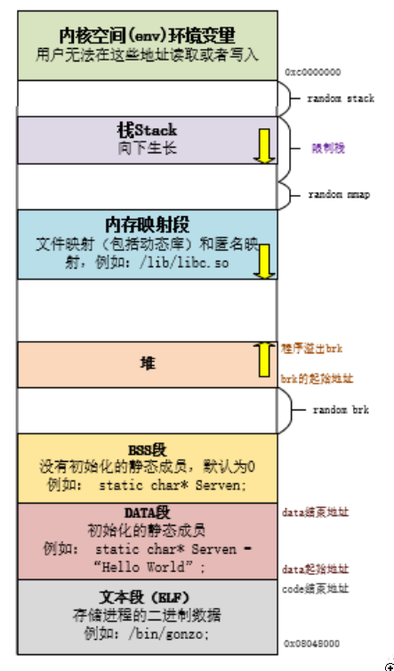

## 编译过程

一个程序从.c文本文件成为一个可执行文件需要进行四个过程。

**一：预编译过程 --> 做语法上的校验，文件补充等**
.c文件经过预编译成为.i文件。预编译过程主要处理源代码文件中那些以“#”开头的预编译指令，如#include,#define等。
linux环境下的指令为:gcc -E main.c -o main.i 。
主要处理规则为：
1.展开所有的宏定义；
2.处理#if,#endif等预编译指令；
3.将#include\<\>包含的文件插入到相应位置；
4.删除所有的注释；
5.添加行号和文件名标识；
6.保留所有的\#pragma编译器指令。

**二：编译过程 --> 生成汇编**
.i文件经过编译成为.s文件。编译过程形成的是汇编文件。
linux环境下的指令为:gcc -S main.i -o main.s 。

**三：汇编过程 --> 二进制文件**
.i文件经过该过程成为.o目标文件，目标文件里都是机器可以理解的二进制代码。
linux环境下的指令为：gcc -c main.s -o main.o 。

**四：链接过程 --> 生成可执行文件**
.o文件经过链接才能形成最终的可执行文件。
linux环境下的指令为：gcc -o main main.o 。

## 深入理解：C++内存分配

程序一般都是在内存中跑的，这章主要讲c++程序运行时的内存分配问题。

讲解包括：内存申请使用的关键字、各种变量在内存中的位置、程序代码在内存中的位置。

这篇会从网络中多篇文档中汲取能量，如果未能罗列引用望海涵

### 什么是内存模型

内存模型就是一种语言它独特的管理者一套程序的机制

C语言会将内存区域划分成堆、栈、静态全局变量区、常量区；

C++则分为堆、栈、自由存储区、全局/静态变量区、常量存储区；

划分的目的是为了能够方便编译器的管理和运行

### 内存的分类

| 分类标准    | 分区数量                                        |
| :---------- | :---------------------------------------------- |
| 两大分区    | 代码区、数据区                                  |
| 四大分区    | 代码区、全局区（全局/静态存储区）、栈区、堆区   |
| c语言分区   | 堆、栈、静态全局变量区、常量区                  |
| c++语言分区 | 堆、栈、自由存储区、全局/静态变量区、常量存储区 |

内存模型根据生命周期的不同分区 自由存储区、动态区、静态区 我们就按照C++语言的内存划分区域来讲解内存管理机制



**文本段（ELF）：** 主要用于存放我们编写的代码，但是不是按照代码文本的形式存放，而是将代码文本编译成二进制代码，存放的是二进制代码，在编译时就已经确定这个区域存放的内容是什么了，并且这个区域是只读区域

**DATA段：** 这个区域主要用于存放编译阶段（非运行阶段时）就能确定的数据，也就是初始化的静态变量、全局变量和常量，这个区域是可读可写的。这也就是我们通常说的静态存储区

**BSS段：** 这个区域存放的是未曾初始化的静态变量、全局变量，但是不会存放常量，因为常量在定义的时候就一定会赋值了。未初始化的全局变量和静态变量，编译器在编译阶段都会将其默认为0

**HEAP（堆）：** 这个区域实在运行时使用的，主要是用来存放程序员分配和释放内存，程序结束时操作系统会对其进行回收，（程序员分配内存像malloc、free、new、delete）都是在这个区域进行的

**STACK（栈）：** 存放函数的参数值和局部变量，这个区域的数据是由编译器来自己分配和释放的，只要执行完这个函数，那么这些参数值和变量都会被释放掉

**内核空间（env）环境变量：** 这个区域是系统内部的区域，我们是不可编辑的

### 各分区例程

#### 全局/静态存储区

这个区域有两个段，分别是 `BSS段` 和 `DATA段` ，均存放着`全局变量`和`静态变量`（包括`全局静态变量`和`局部静态变量`）

其中 BSS存放的是程序员编写的**未初始化**的 `全局变量` 和 `静态变量` 而DATA存放**已经初始化**的全局变量、静态变量和常量。

这其中C和C++的BSS还有区别，区别就是：C中的BSS段分为高地址和低地址，高地址是存放全局变量，低地址是存放静态未初始化

```cpp
#include<iostream>
using namespace std;

/*定义全局变量*/
int serven_1;                       // 定义未初始化的全局变量
int serven_2 = 2;                   // 定义初始化的全局变量

static int serven_3;                // 定义未初始化的静态变量
static int serven_4 = 4;            // 定义初始化的静态变量

int main(int argc, char *argv[])
{
    cout<<"BSS:"<<endl;
    cout<<"The address of serven_1:"<<&serven_1<<", The data of serven_1:"<<serven_1<<endl;
    cout<<"The address of serven_3:"<<&serven_3<<", The data of serven_3:"<<serven_3<<endl;

    cout<<"DATA:"<<endl;
    cout<<"The address of serven_2:"<<&serven_2<<", The data of serven_2:"<<serven_2<<endl;
    cout<<"The address of serven_4:"<<&serven_4<<", The data of serven_4:"<<serven_4<<endl;

    return 0;
}
```


**运行结果：**

```text
BSS:
The address of serven_1:00007FF7F3C2E180, The data of serven_1:0
The address of serven_3:00007FF7F3C2E184, The data of serven_3:0
DATA:
The address of serven_2:00007FF7F3C2E000, The data of serven_2:2
The address of serven_4:00007FF7F3C2E004, The data of serven_4:4
```


**结果分析：** 程序定义了两个全局变量 `serven_1` 和 `serven_2` ，两个静态变量 `serven_3` 和 `serven_4` ，其中 `serven_2` 和 `serven_4` 是初始化的，所以 `serven_1` 和 `serven_3` 是存放在 `BSS段` ，并且编译器会将这两个未初始化的变量默认初始化为 `0` ；而 `serven_2` 和 `serven_4` 这两个变量是初始化的，存放在 `DATA段`

#### 常量区

上面说到常量是存放在DATA段区域的，下面我们来看一下例子：

```cpp
#include<iostream>
using namespace std;

/*定于全局常量*/
const char* serven_5 ="serven";

int main(int argc, char *argv[])
{
    const char* serven_6 ="serven";
    char * serven_7 = "serven";
    char * serven_8 = serven_7;
    char s[]="serven";
    char s2[]="serven";
    s[1]='1';
    *s='1';
    cout<<"The address of serven_5:"<<&serven_5<<", The data of serven_5:"<<serven_5<<endl;
    cout<<"The address of serven_6:"<<&serven_6<<", The data of serven_6:"<<serven_6<<endl;
    cout<<"The address of serven_7:"<<&serven_7<<", The data of serven_7:"<<serven_7<<endl;
    cout<<"The address of serven_8:"<<&serven_8<<", The data of serven_8:"<<serven_8<<endl;

    cout<<"The address of s:"<<s<<", The data of s:"<<s<<endl;
    cout<<"The address of s2:"<<s2<<", The data of s2:"<<s2<<endl;

    printf("The Pointer of serven_5 :%p\n",serven_5);
    printf("The Pointer of serven_6 :%p\n",serven_6);
    printf("The Pointer of serven_7 :%p\n",serven_7);
    printf("The Pointer of serven_8 :%p\n",serven_8);
    printf("The Pointer of s :%p\n",s);
    printf("The Pointer of s2 :%p\n",s2);

    return 0;
}
```

**Release运行结果：**

```text
The address of serven_5:00007FF6558F5008, The data of serven_5:serven
The address of serven_6:00000096D82FFE60, The data of serven_6:serven
The address of serven_7:00000096D82FFE68, The data of serven_7:serven
The address of serven_8:00000096D82FFE70, The data of serven_8:serven
The address of s:11rven, The data of s:11rven
The address of s2:serven, The data of s2:serven
The Pointer of serven_5 :00007FF6558F32B0
The Pointer of serven_6 :00007FF6558F32B0
The Pointer of serven_7 :00007FF6558F32B0
The Pointer of serven_8 :00007FF6558F32B0
The Pointer of s :00000096D82FFE78
The Pointer of s2 :00000096D82FFE80
```

*这里需要注意的是上面的结果是release的输出，debug的结果并不一定相同。*

**结果解析：**

变量 `serven_5` 是常量，存储在 `DATA段` 区域， `serven_6` 是局部的常量、 `serven_7` 和 `serven_8` 是局部的变量指针，他们都是指向一个常量 “serven”，这个常量存储在常量区的，也就是存储在DATA区域，可以看到在后面打印serven_5~serven_8的时候的地址都是一样的，都是存储在DATA区域。

而 `s` 和 `s2` 是局部变量，存储在栈区域，可以看到代码中打印出来的指针都是在栈区域里面。

总结就是： `s` 和 `s2` 是定义在局部函数里面的变量，所以存放在栈区域，`serven_6` ~ `serven_8` 是定义在局部里面的指针，指向的是常量，所以指向的常量存放在DATA区域，而指针本身存放在栈中

#### 栈（Stack）区域

栈区域是编译器自动根据变量进行分配的，不是由程序员进行开辟的，所以编译器即会自动分配也会将其释放，这个区域主要存放函数的参数值、局部变量、形参等等。

```cpp
#include<iostream>
using namespace std;

void TEST(int ser_x, int ser_y, int ser_z){
    int serven_9 = 9;
    int serven_10 = 10;
    int serven_11 = 11;
    printf("The Pointer of ser_x is: %p\n",&ser_x);
    printf("The Pointer of ser_y is: %p\n",&ser_y);
    printf("The Pointer of ser_z is: %p\n",&ser_z);
    printf("The Pointer of serven_9(TEST) is: %p\n",&serven_9);
    printf("The Pointer of serven_10(TEST) is: %p\n",&serven_10);
    printf("The Pointer of serven_11(TEST) is: %p\n",&serven_11);
}

int main(int argc, char *argv[])
{
    int serven_9 = 9;
    int serven_10 = 10;
    int serven_11 = 11;

    printf("The Pointer of serven_9(MAIN) is: %p\n",&serven_9);
    printf("The Pointer of serven_10(MAIN) is: %p\n",&serven_10);
    printf("The Pointer of serven_11(MAIN) is: %p\n",&serven_11);
    TEST(serven_9, serven_10,serven_11);

    int serven_12 = 12;
    printf("The Pointer of serven_12 is: %p\n",&serven_12);

    return 0;
}
```


**Debug运行结果：**

```text
The Pointer of serven_9(MAIN) is: 0000002338fff9ac
The Pointer of serven_10(MAIN) is: 0000002338fff9a8
The Pointer of serven_11(MAIN) is: 0000002338fff9a4
The Pointer of ser_x is: 0000002338fff980
The Pointer of ser_y is: 0000002338fff988
The Pointer of ser_z is: 0000002338fff990
The Pointer of serven_9(TEST) is: 0000002338fff96c
The Pointer of serven_10(TEST) is: 0000002338fff968
The Pointer of serven_11(TEST) is: 0000002338fff964
The Pointer of serven_12(MAIN) is: 0000002338fff9a0
```


*这里注意：release版本，对局部变量有优化，结果就不同了*

**结果解析：** 首先我们先来看一下这个图，是内存管理机制里面的栈，可以看到main函数中定义的变量`serven_9` ~ `serven_11`分别入栈，而且入栈的顺序是从高地址到低地址，每个变量占用4个字节，所以地址相差也就是4个字节

然后就是形参入栈，**形参入栈顺序是从右往左入栈**，所以`ser_z~ser_x`的地址也是依次递减的

最后就是TEST函数里面的局部变量，将局部变量`serven_9 ~ serven_11`依次入栈，并且地址也是一次递减

而且可以看到`serven_12`的地址和`serven_11`是隔壁，由此可以看出，栈的先进后出，也就是调用完函数TEST后会把局部变量`serven_11（TEST）~serven_9（TEST）`、`serv_x~ser_z`全部出栈，然后再将`serven_12`入栈。


但是，我们可以发现了定义`serven_11`之后的调用函数，函数的形参入栈的地址与s`erven_11`定义时的地址相差很远，大概有三个字节，这三个字节中有一个是`serven_11`，那么多出来两个字节是什么呢？

这是因为在调用函数的时候会进行一些操作：

首先我们需要了解几个概念：`栈帧`、`寄存器esp`、`寄存器ebp`

`栈帧`:每个函数有自己的栈帧，栈帧中维持着所需要的各种信息（包括参数、返回地址、参数个数、其它） `寄存器esp`: 保存当前栈帧的栈顶 `寄存器ebp`: 保存当前栈帧的栈底

那么函数在栈入参时候的结构为：

函数的局部变量：（ebp）最右参数->中间参数->最左参数->返回地址->运行时参数（esp）；

#### 堆（Heap）区域

这个区域是由程序员来进行分配内存和释放内存用的，当我们使用malloc/free、new/delete（这是在自由存储区上分配和释放的，某种意义上来说呢，起始自由存储区是堆的一个子集）。

在这里要注意的是，我们申请了空间内存一定要释放，如果没有释放那就会导致内存的泄露，后果很严重！！！你遇到过的电脑蓝屏也许就是内存泄漏引起的。

#### 堆和栈的区别

| 比较类别 | 堆 | 栈 |
| :--- | :--- | :--- |
| 管理方式 | 由程序员分配和释放 | 编译器自动管理 |
| 空间大小 | 最大可达4GB | 空间有限 |
| 产生碎片 | 会造成空间碎片 | 不会 |
| 生长方向 | 向上生长（低地址-高地址） | 向下生长（高地址-低地址） |
| 分配方式 | malloc、new、calloc、realloc | 编译器管理 |
| 分配效率 | 低 | 高 |


#### 堆和自由存储区的区别

自由存储区其实上是一个逻辑概念

堆是物理概念。

#### malloc/free和new/delete的区别

（1）new、delete是C++中的操作符，而malloc和free是标准库函数。操作符可以在类的内部重载，malloc/free不行，唯一的关联只是在默认情况下new/delete调用malloc/free

（2）malloc/free(只是分配内存，不能执行构造函数，不能执行析构函数)，new/free。

（3）new返回的是指定类型的指针，并且可以自动计算所申请内存的大小。而 malloc需要我们计算申请内存的大小，并且在返回时强行转换为实际类型的指针。

#### C++中new/delete的工作过程

**申请的是普通的内置类型的空间：**

（1）调用 C++标准库中 operator new函数，传入大小。（如果申请的是0byte则强制转化成1byte）

（2）申请相对应的空间，如果没有足够的空间或其他问题且没有定义_new_hanlder，那么会抛出bad_alloc的异常并结束程序,如果定义了_new_hanlder回调函数，那么会一直不停的调用这个函数直到问题被解决为止

（3）返回申请到的内存的首地址.

**申请的是类空间：**

（1）如果是申请的是0byte，强制转换为1byte

（2）申请相对应的空间，如果没有足够的空间或其他问题且没有定义_new_hanlder，那么会抛出bad_alloc的异常并结束程序

（3）如果定义了_new_hanlder回调函数，那么会一直不停的调用这个函数直到问题被解决为止。

（4）如果这个类没有定义任何构造函数，析构函数，且编译器没有合成，那么下面的步骤跟申请普通的内置类型是一样的。

（5）如果有构造函数或者析构函数，那么会调用一个库函数，具体什么库函数依编译器不同而不同，这个库函数会回调类的构造函数。

（6）如果在构造函数中发生异常，那么会释放刚刚申请的空间并返回异常

（7）返回申请到的内存的首地址

delete 与new相反，会先调用析构函数再去释放内存（delete 实际调用 operator delete）

operator new\[\]的形参是 sizeof(T)*N+4就是总大小加上一个4(用来保存个数);空间中前四个字节保存填充长度。然后执行N次operator new

operator delete\[\] 类似；

## 深入理解：变量

### 变量

变量是程序中一个重要的概念。

在了解概念前先，看一段简单的程序。

```cpp
int a = 0;
int main(int argc, char* argv[])
{
	int b = 1;
	int c = a + b;
}
```

程序的结果也很明了：

```cpp
c 为 1
```

问题：变量a、b、c是以什么样的形式存在于程序中的嗯？


#### vs编译器汇编

这里是win32的x86汇编：

```text
--- E:\github\githubDemo\C++相关\104_变量\main.cpp ---------------------------------
int a = 0;
int main()
{
00F61470  push        ebp  
00F61471  mov         ebp,esp  
00F61473  sub         esp,8  
	int b = 1;
00F61476  mov         dword ptr [b],1  
	int c = a + b;
00F6147D  mov         eax,dword ptr [a (0F69138h)]  
00F61482  add         eax,dword ptr [b]  
00F61485  mov         dword ptr [c],eax  
}
00F61488  xor         eax,eax  
00F6148A  mov         esp,ebp  
00F6148C  pop         ebp  
00F6148D  ret  
--- 无源文件 -----------------------------------------------------------------------
```

这里主要关注mov和ptr，mov是汇编中的数据传输指令；ptr为pointer（指针）的缩写。

```text
	int b = 1;
00F61476  mov         dword ptr [b],1   
```


这里的汇编的意思就是，给内存地址等于 “b寄存器的值” 得位置 存上值 1

明显b是我们的变量。Vs编译器上，我们看到似乎存在一个寄存器b。

即程序运行时存在一个名为变量名的地址位置， 可大致直接理解为一个寄存器。


#### gcc编译器汇编

ubuntu64位汇编：gcc编译器

```cpp
main():

0x0000555555555129  endbr64  
0x000055555555512d  push   %rbp 
0x000055555555512e  mov    %rsp,%rbp 
0x0000555555555131  movl   $0x1,-0x8(%rbp) 
0x0000555555555138  mov    0x2ed6(%rip),%edx        ## 0x555555558014 <a> 
0x000055555555513e  mov    -0x8(%rbp),%eax 
0x0000555555555141  add    %edx,%eax 
0x0000555555555143  mov    %eax,-0x4(%rbp) 
0x0000555555555146  mov    $0x0,%eax 
0x000055555555514b  pop    %rbp 
0x000055555555514c  ret   
```


在这里我们看到： 对于栈变量（b、c），我们是直接使用其在栈中的相对地址位置。 对于全局变量（a），程序是提前分配了一个地址位置，我们也是直接操作的地址。

可见在gcc编译器中，变量只存在于程序的代码编程阶段；在编译器中就会转换为地址，不在存在。这也是我们常用的理解方式。

#### 总结

综上，变量在c++程序中只存在于代码编辑阶段；在程序中表现为地址。


## 在Windows下生成Dump文件

Dump 文件是进程的内存镜像 , 可以把程序的执行状态通过调试器保存到dump文件中 ; Dump 文件是用来给驱动程序编写人员调试驱动程序用的 , 这种文件必须用专用工具软件打开 , 比如使用 WinDbg , VisualStudio 打开 ;

当我们的程序发布出去之后 , 在客户机上是无法跟踪自己代码的 BUG 的 , 所以 Dump 文件对于我们来说特别有用 ; 我们可以通过 .dmp 文件把出现 BUG 的情况再现 , 然后再现客户环境 (包括堆栈调用等情况) , 设置源码调试路径 , 可以找到出现 BUG 的语句 ;

C++ 程序设置生成 Dump 文件的代码如下 :

```cpp
#include "stdafx.h"
#include "Windows.h"
#include "DbgHelp.h"

int GenerateMiniDump(PEXCEPTION_POINTERS pExceptionPointers)
{
    // 定义函数指针
    typedef BOOL(WINAPI * MiniDumpWriteDumpT)(
        HANDLE,
        DWORD,
        HANDLE,
        MINIDUMP_TYPE,
        PMINIDUMP_EXCEPTION_INFORMATION,
        PMINIDUMP_USER_STREAM_INFORMATION,
        PMINIDUMP_CALLBACK_INFORMATION
        );
    // 从 "DbgHelp.dll" 库中获取 "MiniDumpWriteDump" 函数
    MiniDumpWriteDumpT pfnMiniDumpWriteDump = NULL;
    HMODULE hDbgHelp = LoadLibrary(_T("DbgHelp.dll"));
    if (NULL == hDbgHelp)
    {
        return EXCEPTION_CONTINUE_EXECUTION;
    }
    pfnMiniDumpWriteDump = (MiniDumpWriteDumpT)GetProcAddress(hDbgHelp, "MiniDumpWriteDump");

    if (NULL == pfnMiniDumpWriteDump)
    {
        FreeLibrary(hDbgHelp);
        return EXCEPTION_CONTINUE_EXECUTION;
    }
    // 创建 dmp 文件件
    TCHAR szFileName[MAX_PATH] = {0};
    TCHAR* szVersion = _T("DumpDemo_v1.0");
    SYSTEMTIME stLocalTime;
    GetLocalTime(&stLocalTime);
    wsprintf(szFileName, L"%s-%04d%02d%02d-%02d%02d%02d.dmp",
        szVersion, stLocalTime.wYear, stLocalTime.wMonth, stLocalTime.wDay,
        stLocalTime.wHour, stLocalTime.wMinute, stLocalTime.wSecond);
    HANDLE hDumpFile = CreateFile(szFileName, GENERIC_READ | GENERIC_WRITE, 
        FILE_SHARE_WRITE | FILE_SHARE_READ, 0, CREATE_ALWAYS, 0, 0);
    if (INVALID_HANDLE_VALUE == hDumpFile)
    {
        FreeLibrary(hDbgHelp);
        return EXCEPTION_CONTINUE_EXECUTION;
    }
    // 写入 dmp 文件
    MINIDUMP_EXCEPTION_INFORMATION expParam;
    expParam.ThreadId = GetCurrentThreadId();
    expParam.ExceptionPointers = pExceptionPointers;
    expParam.ClientPointers = FALSE;
    pfnMiniDumpWriteDump(GetCurrentProcess(), GetCurrentProcessId(), 
        hDumpFile, MiniDumpWithDataSegs, (pExceptionPointers ? &expParam : NULL), NULL, NULL);
    // 释放文件
    CloseHandle(hDumpFile);
    FreeLibrary(hDbgHelp);
    return EXCEPTION_EXECUTE_HANDLER;

}

LONG WINAPI ExceptionFilter(LPEXCEPTION_POINTERS lpExceptionInfo)
{
    // 这里做一些异常的过滤或提示
    if (IsDebuggerPresent())
    {
        return EXCEPTION_CONTINUE_SEARCH;
    }
    return GenerateMiniDump(lpExceptionInfo);
}

int main()
{
    // 加入崩溃dump文件功能
    SetUnhandledExceptionFilter(ExceptionFilter);
    // 使程序崩溃产生 Dump 文件
    int *p = NULL;
    *p=1;
}

```


## RAII

**RAII**，全称为 Resource Acquisition Is Initialization，直译为**资源获取即初始化**。

这是C++的一个编程技术或者说是一种编程哲学。

**其核心思想是将对象的生命周期（对象的创建和销毁）与资源的生命周期（资源的获取和释放）绑定在一起。**


在C++中，RAII主要通过对象构造函数和析构函数来实现。当创建一个对象时，我们可以在构造函数中获取资源，比如**动态分配内存**、打开文件、**获取锁**等。

当对象不再需要时，我们可以通过析构函数来释放这些资源。

这种方式的**优点**是，它可以自动管理资源的生命周期，防止资源泄露。

因为C++有确定的析构函数调用时间（当对象离开其作用域时），所以我们可以确保在适当的时间释放资源。

这也可以防止因为异常或早期返回而导致的资源泄露。

**例：**

```cpp
class File {  
public:  
    File(const std::string& filename) {  
        // 打开文件  
        file_ = fopen(filename.c_str(), "r");  
        if (!file_) {  
            throw std::runtime_error("Failed to open file");  
        }  
    }  
      
    ~File() {  
        // 关闭文件  
        fclose(file_);  
    }  
      
private:  
    FILE* file_;  
};
```

### ScopeExit

当退出作用域时，做一些相应的操作；如，资源管理

**实现方案1：**

```cpp
class ScopeExit {
   public:
    ScopeExit() = default;

    ScopeExit(const ScopeExit&) = delete;
    void operator=(const ScopeExit&) = delete;

    ScopeExit(ScopeExit&&) = default;
    ScopeExit& operator=(ScopeExit&&) = default;

    template <typename F, typename... Args>
    ScopeExit(F&& f, Args&&... args) {
        func_ = std::bind(std::forward<F>(f), std::forward<Args>(args)...);
    }

    ~ScopeExit() {
        if (func_) {
            func_();
        }
    };

   private:
    std::function<void()> func_;
};

#define _CONCAT(a, b) a##b
#define _MAKE_SCOPE_(line) ScopeExit _CONCAT(defer, line) = [&]()

#undef SCOPE_GUARD
#define SCOPE_GUARD _MAKE_SCOPE_(__LINE__)
```

**实现方案2：**

```cpp
template <class ReleaseFun>
class ScopeGuard
{
public:
    ScopeGuard(ReleaseFun fun)
        : m_releaseFun(fun)
    {}
    ~ScopeGuard()
    {
        m_releaseFun();
    }

private:
    ReleaseFun m_releaseFun;
};

class ScopeGuardOnExit{};
template <typename ReleaseFun>
ScopeGuard<ReleaseFun> operator+(ScopeGuardOnExit, ReleaseFun &&fn)
{
    return ScopeGuard<ReleaseFun>(fn);
}

#define _JOINT(s1, s2) s1##s2
#define JOINT(s1, s2) _JOINT(s1, s2)
#define VARIABLE(str) JOINT(str, __LINE__)

#define SCOPE_GUARD \
    auto VARIABLE(SCOPE_EXIT_STATE) = ScopeGuardOnExit() + [&]()
```


**使用如下：**

```cpp
void test()
{
	int *pInt = new int(9);
	SCOPE_GUARD
	{
		delete pInt;
	};
	int a = *pInt + 1; 
}
```


## CPU缓存和多线程

### CPU缓存

查看一张常见的电脑架构图：

在主存和CPU之间通过总线进行连接；随着CPU散热问题的无法解决，摩尔定律的逐渐失效，多核CPU走向历史舞台；

由于存储器的成本问题（越快的存储器，一般越小，越贵；排序为：**寄存器**、**L1 cache**、**L2 cache**、**L3 cache**、**主存**（内存）和**硬盘**）；

根据 **程序的局部性原理**，CPU和主存之间，渐渐发展处三级缓存的结构；通过合理的缓存方式，可以近似达到直接使用快速存储器的性能的同时，大大减少成本。 


#### 缓存原理


**cache line（缓存行）** 是缓存进行管理的最小存储单元，也叫缓存块，每个 cache line 包含 **Flag**、**Tag** 和 **Data** ，通常 Data 大小是 **64 字节**，但不同型号 CPU 的 Flag 和 Tag 可能不相同。从内存向缓存加载数据是按整个缓存行加载的，一个缓存行和一个相同大小的**内存块**对应。


缓存是按照矩阵方式排列(M × N)，横向是**组(Set)**，纵向是**路(Way)**。每一个元素是缓存行(cache line)。

那么给定一个虚拟地址 **addr** 如何在缓存中定位它呢？首先把它所在的**组号**找到，即：

```cpp
//右移6位是因为 Block Offset 占 addr 的低 6 位，Data 为 64 字节
Set Index = (addr >> 6) % M;
```

然后遍历该组所有的路，找到 **cache line** 中的 **Tag** 与 **addr** 中 **Tag** 相等为止，所有路都没有匹配成功，那么缓存未命中。

```text
整个缓存容量 = 组数 × 路数 × 缓存行大小

缓存组数 = 整个缓存容量 ÷ 路数 ÷ 缓存行大小
```

#### MESI协议

cahce line 示意：


[MESI Protocol](https://link.zhihu.com/?target=https%3A//en.wikipedia.org/wiki/MESI_protocol)中cache line的四种状态：


[MESI Protocol](https://link.zhihu.com/?target=https%3A//en.wikipedia.org/wiki/MESI_protocol)中CPU之间的六种消息：


#### CPU执行

cpu、cache 执行示意图：


- **store buffer：** cache line 修改的缓存，对应CPU的 Writeback
- **invalidate queue：** cache line 失效的缓存，对应CPU的 Invalidate

为了约束与store buffer和invalidate queue相关的操作，用到了smp_mb()。

也就是说，CPU执行指令中如果遇到了smp_mb()，则需要处理store buffer和invalidate queue。

即在这条指令之前所有的内存操作的结果，都在这个指令之后的内存操作指令被执行之前，写入到内存中。

有些CPU提供了更为细分的内存屏障，包括” read memory barrier”和” write memory barrier”，前者只会处理invalidate queue，而后者只会处理store buffer，其函数可分别记为smp_rmb()和smp_wmb()。显然，只处理其中之一肯定比同时处理二者效率要高，当然，约束就更少，可能的行为也就越多。

##### Demo1
```cpp
int a=0; // 存在CPU0和CPU1中
int b=0; // 存在CPU0中

// CPU0
a = 1;// A
b = 1;//B

// CPU1
while(b == 0) continue;//C
assert(a == 1);  //D
```

运行分析：（这是对所有情况中的一种进行分析）
1. `CPU0` 执行 `a = 1`， 发现 `a` 在 `cache line` 中，状态为`shared`; 发送 `Invalidate消息`给其他CPU，将 a=1 写入 `store buffer`
2. `CPU0` 执行 `b = 1`， 发现 `b` 在 `cache line` 中，状态为`exclusive`或`modified`;但`store buffer`有值将 b=1 写入 `store buffer`
3. `CPU1` 执行while循环，发现 `b` 不在 `cache line` 中， 发送`Read消息`给其他CPU
4. `CPU1`收到`CPU0`的`Invalidate消息`，将其加人 `invalidate queue`，返回 `Invalidate Acknowledge消息`
5. `CPU0` 收到 `Invalidate Acknowledge消息`，将 `a` 的`cache line`改为 `exclusive`状态
6. `CPU0`将`store buffer`的值都写到`cache line`
7. `CPU0`收到`Read消息`，返回`Read Response消息` ，将b的`cache line` 状态改完`shared`,这里b为1
8. `CPU1`收到`Read Response消息`，将消息中的`cache line`放入自身的`cache`
9. `CPU1` 执行while循环，发现 `b=1`，while循环结束
10. `CPU1` 执行assert，发现a在cache中，且值为0，assert fails
11. `CPU1` 执行`invalidate queue`，将a的`cache line`移除

我们这里发现，D错误的原因是 `invalidate queue`，没有及时被处理

##### Demo2
```cpp
int a=0; // 存在CPU0和CPU1中
int b=0; // 存在CPU0中

// CPU0
a = 1;// A
smp_mb();
b = 1;//B

// CPU1
while(b == 0) continue;//C
assert(a == 1);  //D
```

运行分析：（这是对所有情况中的一种进行分析）
1. `CPU0` 执行 `a = 1`， 发现 `a` 在 `cache line` 中，状态为`shared`; 发送 `Invalidate消息`给其他CPU，将 a=1 写入 `store buffer`
2. `CPU1` 执行while循环，发现 `b` 不在 `cache line` 中， 发送`Read消息`给其他CPU
3. `CPU1`收到`CPU0`的`Invalidate消息`，将其加人 `invalidate queue`，返回 `Invalidate Acknowledge消息`
4. `CPU0` 收到 `Invalidate Acknowledge消息`，将 `a` 的`cache line`改为 `exclusive`状态；执行`smp_mb()`,将`store buffer`的值都写到`cache line`
6.  `CPU0` 执行 `b = 1`， 发现 `b` 在 `cache line` 中，状态为`exclusive`或`modified`;且`store buffer`没有值；因此，直接将 b=1 写入 `cache line`
7. `CPU0`收到`Read消息`，返回`Read Response消息` ，将b的`cache line` 状态改完`shared`,这里b为1
8. `CPU1`收到`Read Response消息`，将消息中的`cache line`放入自身的`cache`
9. `CPU1` 执行while循环，发现 `b=1`，while循环结束
10. `CPU1` 执行assert，发现a在cache中，且值为0，assert fails
11. `CPU1` 执行`invalidate queue`，将a的`cache line`移除

我们这里发现，D错误的原因是 `invalidate queue`，没有及时被处理；

当前情况给CPU0 加 内存栅栏无效。

##### Demo3
```cpp
int a=0; // 存在CPU0和CPU1中
int b=0; // 存在CPU0中

// CPU0
a = 1;// A
smp_mb();
b = 1;//B

// CPU1
while(b == 0) continue;//C
smp_mb();
assert(a == 1);  //D
```

运行分析：（这是对所有情况中的一种进行分析）
1. `CPU0` 执行 `a = 1`， 发现 `a` 在 `cache line` 中，状态为`shared`; 发送 `Invalidate消息`给其他CPU，将 a=1 写入 `store buffer`
2. `CPU1` 执行while循环，发现 `b` 不在 `cache line` 中， 发送`Read消息`给其他CPU
3. `CPU1`收到`CPU0`的`Invalidate消息`，将其加人 `invalidate queue`，返回 `Invalidate Acknowledge消息`
4. `CPU0` 收到 `Invalidate Acknowledge消息`，将 `a` 的`cache line`改为 `exclusive`状态；执行`smp_mb()`,将`store buffer`的值都写到`cache line`
6.  `CPU0` 执行 `b = 1`， 发现 `b` 在 `cache line` 中，状态为`exclusive`或`modified`;且`store buffer`没有值；因此，直接将 b=1 写入 `cache line`
7. `CPU0`收到`Read消息`，返回`Read Response消息` ，将b的`cache line` 状态改完`shared`,这里b为1
8. `CPU1`收到`Read Response消息`，将消息中的`cache line`放入自身的`cache`
9. `CPU1` 执行while循环，发现 `b=1`，while循环结束
10. `CPU1`执行`smp_mb()`，处理`invalidate queue`内的消息；`Invalidate消息`被处理，`a` 移出`cache line`
11. `CPU1` 执行assert，发现a不在cache中；发送`Read消息`
12. `CPU0`收到`Read消息`，返回`Read Response消息` ，将a的`cache line` 状态改完`shared`,这里a为1
13. `CPU1`收到`Read Response消息`，将消息中的`cache line`放入自身的`cache`
14.  `CPU1`载入a，a为1，assert成功

我们这里发现，D正常；这里我们发现，程序能否正常执行的关键是缓存是否一致是否达成。

我们保证局部的 Sequential Consistency（顺序一致性），即可保证程序正常进行。

#### 源码解析

```cpp
        #define barrier() __asm__ __volatile__("": : :"memory")
        #define mb() alternative("lock; addl $0,0(%%esp)", "mfence", X86_FEATURE_XMM2)
        #define rmb() alternative("lock; addl $0,0(%%esp)", "lfence", X86_FEATURE_XMM2)
#ifdef CONFIG_SMP
        #define smp_mb()        mb()
        #define smp_rmb()        rmb()
        #define smp_wmb()        wmb()
        #define smp_read_barrier_depends()        read_barrier_depends()
        #define set_mb(var, value) do { (void) xchg(&var, value); } while (0)
#else
        #define smp_mb()        barrier()
        #define smp_rmb()        barrier()
        #define smp_wmb()        barrier()
        #define smp_read_barrier_depends()        do { } while(0)
        #define set_mb(var, value) do { var = value; barrier(); } while (0)
#endif
```

1. `set_mb()`, `mb()`, `barrier()` 函数追踪到底，就是`__asm__  __volatile__("" ::: "memory")`  而这行代码就是内存屏障
2. `__asm__`用于指示编译器在此插入汇编语句
3. `__volatile__`用于告诉编译器，**严禁将此处的汇编语句与其它的语句重组合优化**。即：**原原本本按原来的样子处理这这里的汇编**
4. memory 强制 gcc 编译器假设 RAM 所有内存单元均被汇编指令修改，这样 cpu 中的 registers 和 cache 中已缓存的内存单元中的数据将作废。cpu 将不得不在需要的时候重新读取内存中的数据。这就阻止了 cpu 又将 registers, cache 中的数据用于去优化指令，而避免去访问内存
5. `"":::` 表示这是个空指令。barrier() 不用在此插入一条串行化汇编指令

### 伪共享（false sharing）

从上面，可以知晓Date的通常大小为64字节；

> 1字 = 8字节 ； 1字节 = 8位， 

一个int类型的占用4字节，缓存加载时是按一整个cache line进行加载的；这样更符合程序的局部性原理；

这是如果有两个 相邻的 int 类型a，b；如果线程1，需要使用a，线程1所在CPU核心会将a、b，加载到同一个cache line；

这时线程2如果需要修改b，发现b已经被加载，会发生b失效信号给线程1所在的CPU核心，并被响应。这样导致变量a也被失效。

这就是所谓的伪共享，线程1和线程2操作各自的变量，结果实际运行时类时却排队进行。

例，long类型为8字节，两个long，可以放入一个cache line；下面代码就可能发生为伪共享

```cpp
```cpp
struct S {
    long long a;
    long long b;
} s;
std::thread t1([&]() {
    for(int i = 0; i < 100000000; i++)
        s.a++;
});
std::thread t2([&]() {
    for(int i = 0; i < 100000000; i++)
        s.b++;
});
```

改善方式：通过在两个变量中间增加内容，隔开数据；中间增加64字节，这样怎么分配也不会再同一个cache line

```cpp
struct S {
    long long a;
    long long noop[8];
    long long b;
} s;
```


### C++11  Memory Order

memory order 主要是 限制编译器以及CPU对单线程当中的指令执行顺序进行重排的程度（此外还包括对cache的控制方法）。

这种限制，决定了以atomic操作为基准点（边界），对其之前后的内存访问命令，能够在多大的范围内自由重排（或者反过来，需要施加多大的保序限制），也被称为**栅栏**。从而形成了6种模式。它本身与多线程无关，是限制的单一线程当中指令执行顺序。


C++11的内存模型共有6种，分四类。其中一致性的减弱会伴随着性能的增强。

#### 同步

##### 同步点
对于一个原子类型变量a，如果a在线程1中进行store(写)操作，在线程2中进行load(读)操作，则线程1的store和线程2的load构成原子变量a的一对`同步点`，其中的store操作和load操作就分别是一个`同步点`。

可以看出，`同步点`具有三个条件：

- 必须是一对原子变量操作中的一个，且一个操作是store，另一个操作是load；
- 这两个操作必须针对同一个原子变量；
- 这两个操作必须分别在两个线程中。

##### synchronized-with(同步)
对于一对`同步点`来说，当写操作写入一个值x后，另一个同步点的读操作在某一时刻读到了这个变量的值x，则此时就认为这两个`同步点`之间发生了`同步`关系。

`同步`关系具有两方面含义：

- 针对的是一对同步点之间的一种状态的描述；
- 只有当读取的值是另一个同步点写入的值的时候，这两个同步点之间才发生`同步`；

#### Sequential Consistency

对应标记为：**memory_order_seq_cst**

atomic默认的模型是顺序一致性的，这种模型对程序的执行结果有两个要求：

- 每个处理器的执行顺序和代码中的顺序一样。
- 所有处理器都只能看到一个单一的操作执行顺序。

即单线程中按照代码顺序，多线程之间按照一个全局统一顺序，具体什么顺序按照时间片的分配。

原子信号通知到所有的CPU


**Demo：**

```cpp
// 顺序一致

std::atomic<bool> x,y;
std::atomic<int> z;
void write_x()
{
   x.store(true,std::memory_order_seq_cst);//A
}

void write_y()
{
    y.store(true,std::memory_order_seq_cst);//B
}

void read_x_then_y()
{
    while(!x.load(std::memory_order_seq_cst));//C
    if(y.load(std::memory_order_seq_cst))//D
        ++z;
}

void read_y_then_x()
{
    while(!y.load(std::memory_order_seq_cst));//E
    if(x.load(std::memory_order_seq_cst))  //F
        ++z;
}

int main()
{
    x=false;
    y=false;
    z=0;
    std::thread a(write_x);
    std::thread b(write_y);
    std::thread c(read_x_then_y);
    std::thread d(read_y_then_x);
    a.join();
    b.join();
    c.join();
    d.join();
    assert(z.load()!=0);
}
```
上代码的A、B、C、D、E、F ；6条指令的执行顺序：C一定在D之前，E一定在F之前，所以可以是 ABCDEF，ACBEDF 等


#### Acquire-Release

原子操作有三类：

- 读：在读取的过程中，读取位置的内容不会发生任何变动。
- 写：在写入的过程中，其他执行线程不会看到部分写入的结果。
- 读‐修改‐写：读取内存、修改数值、然后写回内存，整个操作的过程中间不会有其他写入操作插入，其他执行线程不会看到部分写入的结果。

 Acquire-Release模型，原子信号通知到相关线程的CPU

##### memory_order_acquire&memory_order_release
**memory_order_acquire：获得操作**，在读取某原子对象时，当前线程的任何**后面的读写操作**都不允许重排到这个操作的**前面**去，并且其他线程在对同一个原子对象释放**之前的所有内存写入**都在**当前线程可见**。

**memory_order_release：释放操作**，在写入某原子对象时，当前线程的任何**前面的读写操作**都不允许重排到这个操作的**后面**去，并且当前线程的所有内存**写入**都在对同一个原子对象进行获取的**其他线程可见**。


**Demo：**
```cpp
bool f=false;
atomic<bool> g=false;

// thread1
f=true//A
g.store(true, memory_order_release);//B

// thread2
while(!g.load(memory_order_ acquire));//C
assert(f));//D
```

这里可以发现f是同步点，由于C做了循环，所以执行顺序一定是 ABCD；

这就保障了 D部分的正确执行；即A的操作对D可见

##### memory_order_acq_rel

**memory_order_acq_rel：获得释放操作**，一个**读‐修改‐写操作同时具有获得语义和释放语义**，即它**前后的任何读写操作都不允许重排**，并且其他线程在对同一个原子对象释放之前的所有内存写入都在当前线程可见，当前线程的所有内存写入都在对同一个原子对象进行获取的其他线程可见


**Demo**

```cpp
bool f=false;
atomic<bool> g=false;
bool h=false;

// thread1
f=true//A
g.store(true, memory_order_release);//B 

// thread2
while(!g.load(memory_order_acquire);//C
assert(f));//D
assert(h);//E

//thread3
h=true;//F
while(!g.load(memory_order_acq_rel);//G
assert(f));//H
```

由前面的知识知道：
	A一定在B前面，C,一定在D、E前面，F、G、H的顺序一定是 F、G、H

由于C，G为循环，所以，B一定在C前面，B一定在G前面

所以：D、E、H都不会触发


#### Release-Consume

Acquire-Release可以保证线程之间的Synchronizes-With（同步）关系，同时也约束了同一个线程中的前后语句执行顺序。

Release-Consume 不会限制线程中其他变量的顺序重排，不会顺带强制其前后其他指令（无依赖关系）的顺序。避免了其他指令强制顺序带来的额外开销


**Demo1**
```cpp
bool f=false;
atomic<bool> g=false;

// thread1
f=true//A
g.store(true, memory_order_release);//B

// thread2
while(!g.load(memory_order_consume);//C
assert(f));//D
```

当前代码中，A、B之间无依赖，C、D之间无依赖；所以D可能断言失败

**Demo2**
```cpp
bool f=false;
atomic<bool> g=false;

// thread1
f=true//A
g.store(f, memory_order_release);//B   g依赖于f

// thread2
while(!g.load(memory_order_consume);//C
assert(f));//D
```

当前代码中：变量g依赖于f，所以线程1里A在B前面，同时会导致线程2里C在D前面。D的断言就不会触发。

这里存在一个隐藏的关系：C在D前面；这使得代码难以维护，一般不推荐使用。

#### Relaxed

**memory_order_relaxed：** 仅保证load()和store()是原子操作，除此之外，不提供任何跨线程的同步，乱序执行依然有。

即单线程中，除了代码提供的依赖关系外，没有什么关系


**Demo1**
```cpp
atomic<bool> f=false;
atomic<bool> g=false;

// thread1
f.store(true, memory_order_relaxed);//A
g.store(true, memory_order_relaxed);//B

// thread2
while(!g.load(memory_order_relaxed));//C  
assert(f.load(memory_order_relaxed));//D
```
当前，A、B没有依赖关系，C、D没有依赖关系。C由于是循环，可以确定，A、C的关系。D可能断言失败

**Demo2**
```cpp
atomic<bool> f=false;
atomic<bool> g=false;

// thread1
f.store(true, memory_order_relaxed);//A
g.store(f, memory_order_relaxed);//B

// thread2
while(!g.load(memory_order_relaxed));//C  
assert(f.load(memory_order_relaxed));//D
```
当前A、B存在依赖关系，C由于是循环，可以确定，A、C的关系；但线程C、D没有依赖关系。D可能断言失败

**参考：**

[C++11内存模型完全解读-从硬件层面和内存模型规则层面双重解读_acquire relaxed-CSDN博客](https://blog.csdn.net/weixin_43376501/article/details/108006586)

[C++11新特性内存模型总结详解--一篇秒懂_c++11 内存模型-CSDN博客](https://blog.csdn.net/baochunlei1/article/details/122952057)

[C++11内存模型-腾讯云开发者社区-腾讯云 (tencent.com)](https://cloud.tencent.com/developer/article/1942213)

[MESI协议-缓存一致性协议_meis一致性协中的excludee与chi中的unique-CSDN博客](https://blog.csdn.net/younger_china/article/details/103821657)

[为什么需要内存屏障 - 知乎 (zhihu.com)](https://zhuanlan.zhihu.com/p/55767485)

[C++11中的内存模型上篇 - 内存模型基础 - codedump的网络日志](https://www.codedump.info/post/20191214-cxx11-memory-model-1/#%E6%9D%BE%E5%BC%9B%E5%9E%8B%E5%86%85%E5%AD%98%E6%A8%A1%E5%9E%8Brelaxed-memory-models)


## 原子操作、锁、CAS

### 原子操作

定义1：所谓原子操作，是指独立不可细分的操作。

这种不可细分，一般指的是执行上的不可细分，再细分会发生运行问题。

定义2：为了保证运行正确，有一组操作要不一起发生，或不发生，不可再拆分。这就是一个原子操作

> 这里的不可拆分的衡量标准：如果有其他线程进行，会导致执行错误

### 锁的思想

用于解决多个线程同时操作数据带来的安全性，正确性问题。

提到锁一般划分为两种思想：

> **悲观锁：** 假定会发生并发冲突，屏蔽一切可能违反数据完整性的操作。
> 
> **乐观锁：** 假设不会发生并发冲突，每次不加锁而是假设没有冲突而去完成某项操作，只在提交操作时检查是否违反数据完整性。

### CAS（Compare And Swap）

悲观锁，大多是需要系统底层的支持；乐观锁是一种业务实现方式，一般使用CAS的方式实现。

CAS操作包含三个操作数——内存位置（V）、预期原值（A）、新值(B)。

认为位置V应该包含值A；如果包含该值，则将B放到这个位置；否则，不要更改该位置，只告诉我这个位置现在的值即可

CAS 操作基于 CPU 提供的原子操作指令实现，及通过一条处理器指令保证了原子性操作

具体看下面**锁的底层支持**

#### ABA问题

**问题描述：**

程序的运行需要时间，线程1读取内存指为A，线程2对内存进行操作由A改成B，再改成A；这时线程1继续后面的操作，发现内存没有变（其实线程B已经做了操作），继续操作，可能导致未知错误；这就是ABA问题。

这个问题，在C++使用指针的情况下，更加的难以发觉。

C++：线程1，读取指针A指向地址a；线程2，对指针A操作后，依旧指向a，但内容已经发生变化

这里的操作可是是直接的指针操作，也可以是 内存重用技术，释放地址a后，重新申请了地址a

**问题解决：**

通常ABA问题是通过版本号version来解决，每次操作版本号加1，**及在compare阶段不仅要比较期望值A和地址V中的实际值，还要比较变量的版本号Version是否一致。**

### 锁的底层支持

各种锁作用的位置是不同的，可以归纳分别作用于： 临界区、CPU、内存、cache


首先CPU提供一系列的原语指令，CAS为其中之一

> 这些指令如下所示：
> （1）测试并设置（Tetst-and-Set）
> （2）获取并增加（Fetch-and-Increment）
> （3）交换（Swap）
> （4）比较并交换（Compare-and-Swap）
> （5）加载链接/条件存储（Load-Linked/Store-Conditional）

各编译器，对这些原语做上自己的封装，就有了**原子操作 atomic** 。

**乐观锁:** CAS算法，或者原子操作应用到业务代码中；再加上Version版本号控制，解决ABA问题；就是一个标准的乐观锁


**临界区锁的本质：**  **在计算机里本质上就是一块内存空间。** 当这个空间被赋值为1的时候表示加锁了，被赋值为0的时候表示解锁了，仅此而已。多个线程抢一个锁，就是抢着要把这块内存赋值为1。在一个多核环境里，内存空间是共享的。每个核上各跑一个线程，那如何保证一次只有一个线程成功抢到锁呢？

**通过CPU一条原子操作，及通过一条处理器指令保证了原子性操作**

**自旋锁：** 如此通过一条原子操作，控制临界区的方式，就是自旋锁

**互斥锁：** 需要再此基础上，加线程调度

#### 关于多核读写的锁定

现在都是多核 CPU 处理器，每个 CPU 处理器内维护了一块字节的内存，每个内核内部维护着一块字节的缓存，当多线程并发读写时，就会出现缓存数据不一致的情况。

此时，处理器提供：

- **总线锁定**

当一个处理器要操作共享变量时，在 BUS 总线上发出一个 Lock 信号，其他处理就无法操作这个共享变量了。

缺点很明显，总线锁定在阻塞其它处理器获取该共享变量的操作请求时，也可能会导致大量阻塞，从而增加系统的性能开销。

- **缓存锁定**

后来的处理器都提供了缓存锁定机制，也就说当某个处理器对缓存中的共享变量进行了操作，其他处理器会有个嗅探机制，将其他处理器的该共享变量的缓存失效，待其他线程读取时会重新从主内存中读取最新的数据，基于 MESI 缓存一致性协议来实现的。

现代的处理器基本都支持和使用的缓存锁定机制。

**注意：**

有如下两种情况处理器不会使用缓存锁定：

1. 当操作的数据跨多个缓存行，或没被缓存在处理器内部，则处理器会使用总线锁定。
2. 有些处理器不支持缓存锁定，比如：Intel x86 和 Pentium 处理器也会调用总线锁定。


### 各种类型同步策略

#### 原子操作

原子操作就是由CPU底层提供的CAS机制实现的，各个编译器根据这个特点实现了各自的原子操作函数。

- C语言，C11的头文件<stdatomic.h>。由GNU提供了对应的__sync系列函数完成原子操作。
- C++11，STL 提供了atomic 系列函数。

```cpp
#include <atomic>
using atomic_Int = std::atomic<int>;
void test_atomicInt_add(atomic_Int &x)
{
	x.fetch_add(1);

	// 下面是用CAS实现的等价操作
    int oldValue, newValue = 0;
    do
    {
	    oldValue = x.load();
        newValue = oldValue + 1;
    } while (!x.compare_exchange_strong(oldValue, newValue));
}
```

#### 乐观锁

乐观锁不是真实意义上的锁，是业务实现了CAS算法。完成同步操作，一般使用Version解决ABA问题

```cpp
class OptimisticLock
{
public:
    OptimisticLock(std::string new_data) : data(new_data), version(0) {}
    bool update(std::string new_data, int expected_version);
    std::string get_data() const { return data; }
    int get_version() const { return version.load(); }

private:
    std::string data;
    atomic_Int version;
};

// 通过CAS算法，更新数据
bool OptimisticLock::update(std::string new_data, int expected_version)
{
    if (version.compare_exchange_strong(expected_version, expected_version + 1))
    {
        data = new_data;
        return true;
    }
    return false;
}
```

> 乐观锁适用于写少读多的场景
> 
> CAS的使用，在写入频繁的情况下，可能会导致CPU繁忙

#### 自旋锁

使用CAS算法，加上循环做的锁；会一直占用在CPU上，线程处于用户态，不会进入内核态，减少了用户态和内核态切换的成本；同时如果长时间获得不了资源会导致CPU忙等。

```cpp
#include <atomic>

class SpinLock
{
public:
    SpinLock() : m_flag(false) {}
    void lock();
    bool try_lock();
    void unlock();

private:
    std::atomic_bool m_flag;
};

void SpinLock::lock()
{
    bool expected = false;
    // 这里一直循环到m_flag为false，才会成功设置m_flag为true
    // 一直循环就是锁住了，直到解锁
    while (!m_flag.compare_exchange_weak(expected, true, std::memory_order_acquire))
    {
        expected = false;
    }
}

bool SpinLock::try_lock()
{
    bool expected = false;
    return m_flag.compare_exchange_strong(expected, true, std::memory_order_acquire);
}

void SpinLock::unlock()
{
    m_flag.store(false, std::memory_order_release);
}
```

#### 互斥锁

互斥锁（Mutex）是一种常见的线程同步机制，以下罗列了8中使用方式

```cpp
#include <iostream>
#include <thread>
#include <mutex>
#include <unistd.h>

// 常见使用方式
void thread_func1(int id, std::mutex &mtx)
{
    for (int i = 0; i < 2; ++i)
    {
        mtx.lock();
        std::cout << "thread_func1 " << id << " acquired lock and prints " << i << std::endl;
        mtx.unlock();
    }
}

// 可以通过try_lock作为自旋锁使用
void thread_func2(int id, std::mutex &mtx)
{
    for (int i = 0; i < 2; ++i)
    {
        while (!mtx.try_lock())
        {
            // 这里可以自旋等待，直到获得锁
            std::cout << "thread_func2 " << id << " is waiting for lock..." << std::endl;
            sleep(1); // 自旋时也可以使用 sleep() 函数，usleep() 函数 做睡眠
        }
        std::cout << "thread_func2 " << id << " acquired lock and prints " << i << std::endl;
        mtx.unlock();
    }
}

// std::lock_guard 通过RAII（Resource Acquisition Is Initialization）的方式使用
void thread_func3(int id, std::mutex &mtx)
{
    for (int i = 0; i < 2; ++i)
    {
        std::lock_guard<std::mutex> lock(mtx);
        std::cout << "thread_func3 " << id << " acquired lock and prints " << i << std::endl;
    }
}

//  std::unique_lock也是RAII，但可以做一些 延迟加锁，提前释放，等灵活使用方式；但比较重
void thread_func4(int id, std::mutex &mtx)
{
    for (int i = 0; i < 2; ++i)
    {
        std::unique_lock<std::mutex> lock(mtx);
        std::cout << "thread_func4 " << id << " acquired lock and prints " << i << std::endl;
    }
}

void thread_func5(int id, std::mutex &mtx1, std::mutex &mtx2)
{
    for (int i = 0; i < 2; ++i)
    {
        std::lock(mtx1, mtx2);
        // std::adopt_lock作用是声明互斥量已在本线程锁定，std::lock_guard只是保证互斥量在作用域结束时被释放
        std::lock_guard<std::mutex> lock1(mtx1, std::adopt_lock);
        std::lock_guard<std::mutex> lock2(mtx2, std::adopt_lock);
        std::cout << "thread_func5 " << id << " acquired locks and prints " << i << std::endl;
    }
}

void thread_func6(int id, std::mutex &mtx1, std::mutex &mtx2)
{
    for (int i = 0; i < 2; ++i)
    {
        // std::defer_lock 用于延迟锁定，直到调用lock()函数时才真正锁定互斥量
        std::unique_lock<std::mutex> lock1(mtx1, std::defer_lock);
        std::unique_lock<std::mutex> lock2(mtx2, std::defer_lock);
        std::lock(lock1, lock2);
        std::cout << "thread_func6 " << id << " acquired locks and prints " << i << std::endl;
    }
}

void thread_func7(int id, std::mutex &mtx1, std::mutex &mtx2)
{
    for (int i = 0; i < 2; ++i)
    {
        if (-1 == std::try_lock(mtx1, mtx2))
        {
            std::lock_guard<std::mutex> lock1(mtx1, std::adopt_lock);
            std::lock_guard<std::mutex> lock2(mtx2, std::adopt_lock);
            std::cout << "thread_func6 " << id << " acquired locks and prints " << i << std::endl;
        }
    }
}
```

#### 条件变量

条件变量（condition variable）用于 **实现多个线程之间同步操作**；当条件不满足时，相关线程一直被阻塞，直到某种条件出现，这些线程才会被唤醒

条件变量是利用线程间共享的全局变量进行同步的一种机制，主要包括两个动作：

- 一个线程因等待"条件变量的条件成立"而挂起；
- 另外一个线程使"条件成立"，给出信号，从而唤醒被等待的线程。


wait函数必选使用 std::unique_lock

```cpp
#include <iostream>
#include <thread>
#include <mutex>
#include <condition_variable>

void thread_func1(std::condition_variable &cv, std::mutex &mtx, bool &ready)
{
    std::unique_lock<std::mutex> lck(mtx);
    std::cout << "thread_func1: waiting ..." << std::endl;
    cv.wait(lck, [&]()
            { return ready; });
    std::cout << "thread_func1: waiting done." << std::endl;
}

void thread_func2(std::condition_variable &cv, std::mutex &mtx, bool &ready)
{
    // Wait for 1 second before notifying the condition variable
    std::this_thread::sleep_for(std::chrono::milliseconds(1000));

    std::unique_lock<std::mutex> lck(mtx);
    ready = true;

    std::cout << "thread_func2: notifying ..." << std::endl;
    cv.notify_one();
    std::cout << "thread_func2: notified." << std::endl;
}

void thread_func3(std::condition_variable &cv, std::mutex &mtx, bool &ready)
{
    // Wait for 1 second before notifying the condition variable
    std::this_thread::sleep_for(std::chrono::milliseconds(1000));
    {
        std::lock_guard<std::mutex> lck(mtx);
        ready = true;
    }
    std::cout << "thread_func3: notifying ..." << std::endl;
    cv.notify_one();
    std::cout << "thread_func3: notified." << std::endl;
}

```

#### 读写锁

读写锁又叫共享独占锁，**当读写锁以读模式锁住时，它是以共享模式锁住的；当它以写模式锁住时，它是以独占模式锁住的**

1. 当读写锁处于**写加锁**状态时，在其解锁之前，**所有尝试对其加锁的线程都会被阻塞；**  
2. 当读写锁处于**读加锁**状态时，所有**试图以读模式对其加锁的线程都可以得到访问权**，但是如果**想以写模式对其加锁，线程将阻塞**。

C++17，会直接提供 `shared_mutex`可以直接使用

```cpp
#include <shared_mutex> // C++17 for shared_lock and shared_mutex

void read_operation(std::shared_mutex &mtx)
{
    std::shared_lock<std::shared_mutex> lock(mtx);
    // read operation
    std::cout << "thread " << std::this_thread::get_id() << "Reading data..." << std::endl;
}

void write_operation(std::shared_mutex &mtx)
{
    std::unique_lock<std::shared_mutex> lock(mtx);
    // write operation
    std::cout << "thread " << std::this_thread::get_id() << "Writing data..." << std::endl;
}
```

如果使用的是C++11，可以选择自己封装一个

```cpp
#include <atomic>
#include <mutex>
#include <condition_variable> //用于条件变量
class SharedLock
{
public:
    SharedLock() : m_shared_count(0), m_exclusive_count(0), m_in_exclusive(false) {}

    void lock();
    void unlock();

    void shared_lock();
    void shared_unlock();

private:
    std::atomic_int m_shared_count;
    std::atomic_int m_exclusive_count;
    std::atomic_bool m_in_exclusive;
    std::condition_variable m_cv_shared;
    std::condition_variable m_cv_exclusive;
    std::mutex m_mutex;
};

void SharedLock::lock()
{
    std::unique_lock<std::mutex> lock(m_mutex);
    m_cv_exclusive.wait(
        lock, [this]() -> bool
        { return (m_shared_count.load(std::memory_order_acquire) == 0) && !m_in_exclusive.load(std::memory_order_acquire); });
    m_in_exclusive.store(true, std::memory_order_relaxed);
    m_exclusive_count.fetch_add(1, std::memory_order_relaxed);
}

void SharedLock::unlock()
{
    std::unique_lock<std::mutex> lock(m_mutex);
    if (m_exclusive_count.load(std::memory_order_acquire) > 0)
    {
        m_exclusive_count.fetch_sub(1, std::memory_order_relaxed);
    }

    if (m_exclusive_count.load(std::memory_order_acquire) == 0)
    {
        m_in_exclusive.store(false, std::memory_order_relaxed);
        m_cv_shared.notify_all();
    }
    else
    {
        m_cv_exclusive.notify_one();
    }
}

void SharedLock::shared_lock()
{
    std::unique_lock<std::mutex> lock(m_mutex);
    m_cv_shared.wait(lock, [this]() -> bool
                     { return !m_in_exclusive.load(std::memory_order_acquire); });
    m_shared_count.fetch_add(1, std::memory_order_relaxed);
}

void SharedLock::shared_unlock()
{
    std::unique_lock<std::mutex> lock(m_mutex);
    if (m_shared_count.load(std::memory_order_acquire) > 0)
    {
        m_shared_count.fetch_sub(1, std::memory_order_relaxed);
    }

    if (m_shared_count.load(std::memory_order_acquire) == 0)
    {
        m_cv_exclusive.notify_one();
    }
}


class SharedLockGuard
{
public:
    SharedLockGuard(SharedLock &lock) : m_lock(lock)
    {
        m_lock.shared_lock();
    }

    ~SharedLockGuard()
    {
        m_lock.shared_unlock();
    }

private:
    SharedLock &m_lock;
};

class ExclusiveLockGuard
{
public:
    ExclusiveLockGuard(SharedLock &lock) : m_lock(lock)
    {
        m_lock.lock();
    }

    ~ExclusiveLockGuard()
    {
        m_lock.unlock();
    }

private:
    SharedLock &m_lock;
};

```

### 公平锁和非公平锁

公平锁：多个线程按照申请锁的顺序去获得锁，线程会直接进入队列去排队，永远都是队列的第一位才能得到锁。

- 优点：所有的线程都能得到资源，不会饿死在队列中。
- 缺点：吞吐量会下降很多，队列里面除了第一个线程，其他的线程都会阻塞，cpu唤醒阻塞线程的开销会很大。

非公平锁：多个线程去获取锁的时候，会直接去尝试获取，获取不到，再去进入等待队列，如果能获取到，就直接获取到锁。

- 优点：可以减少CPU唤醒线程的开销，整体的吞吐效率会高点，CPU也不必取唤醒所有线程，会减少唤起线程的数量。
- 缺点：你们可能也发现了，这样可能导致队列中间的线程一直获取不到锁或者长时间获取不到锁，导致饿死。


**参考：**

[锁机制及CAS实现原理(C++) - 知乎 (zhihu.com)](https://zhuanlan.zhihu.com/p/400817892)

[CPU缓存一致性：从理论到实战 - 知乎 (zhihu.com)](https://zhuanlan.zhihu.com/p/641558949)

[C++11 实现读写锁 read_write_mutex_c++11 读写锁-CSDN博客](https://blog.csdn.net/wilson1068/article/details/100766622)

[C++11条件变量condition_variable详解 - 知乎 (zhihu.com)](https://zhuanlan.zhihu.com/p/599172163)

## C++ 二进制兼容及解决办法

### 什么会二进制不兼容


## 变长参数

### 函数变长参数

函数支持变参数，以便在简化调用的同时，支持复杂业务；常见的如`printf`函数

```cpp
__fortify_function int
printf (const char *__restrict __fmt, ...)
{
  return __printf_chk (__USE_FORTIFY_LEVEL - 1, __fmt, __va_arg_pack ());
}

// 使用
printf("my name is %s, age is %d \n", "John", 25);
```

通常，使用`stdarg.h`提供的宏 `va_list`, `va_start`, `va_arg`, `va_end` 让函数支持变长函数，变长参数函数通用形式如下：

```cpp
#include <stdarg.h> // for va_list, va_start, va_arg, va_end
void my_variadic_func(int argc, ...) {
  va_list args;  // 初始化变长参数
  va_start(args, argc); // 指定变参数从`argc`的下一个参数开始
  /* deal with variadic arguments */
  // va_arg(args, int)
  // va_arg(args, char *)
  // 等等
  va_end(args);
}
```

**各宏作用：**

| 宏 | 作用 |
| ---- | ---- |
| va_arg | 访问下一个可变参数函数参数（函数宏） |
| va_copy（C99） | 制作可变参数函数参数（函数宏）的副本 |
| va_end | 结束可变参数函数参数的遍历（函数宏） |
| va_list | 保存va_start，va_arg，va_end和va_copy（typedef）所需的信息 |
| va_start | 允许访问可变参数函数参数（函数宏） |
[C - 变量函数 | Variadic functions ](https://cloud.tencent.com/developer/section/1009758)

自己实现一个简易的 printf 函数：

```cpp
#include <iostream>
#include <stdarg.h> // for va_list, va_start, va_arg, va_end

int myprintf(const char *format, ...)
{
    int len = 0;
    va_list args;            // initialize the argument list
    va_start(args, format);  // set the first argument after format

    while (*format != '\0')
    {
        if (*format == '%')
        {
            switch (*++format)
            {
            case 'd':
                std::cout << va_arg(args, int);
                len += 1;
                break;
            case 's':
                std::cout << va_arg(args, char *);
                len += 1;
                break;
            default:
                std::cout << *format;
                len += 1;
                break;
            }
        }
        else
        {
            std::cout << *format;
            len += 1;
        }
        format++;
    }
    va_end(args); // clean up the argument list
    return len;
}

int main()
{
    myprintf("my name is %s, age is %d \n", "John", 25);
    return 0;
}
```

输出：

```text
my name is John, age is 25 
```

### 模板变长参数

- todo


**参考：**

[C++/C++11中变长参数的使用_c++ variadicmultiply-CSDN博客](https://blog.csdn.net/fengbingchun/article/details/78483471)

[C++中的变长参数 - 穆游 - 博客园 (cnblogs.com)](https://www.cnblogs.com/kevonyang/p/5932059.html)