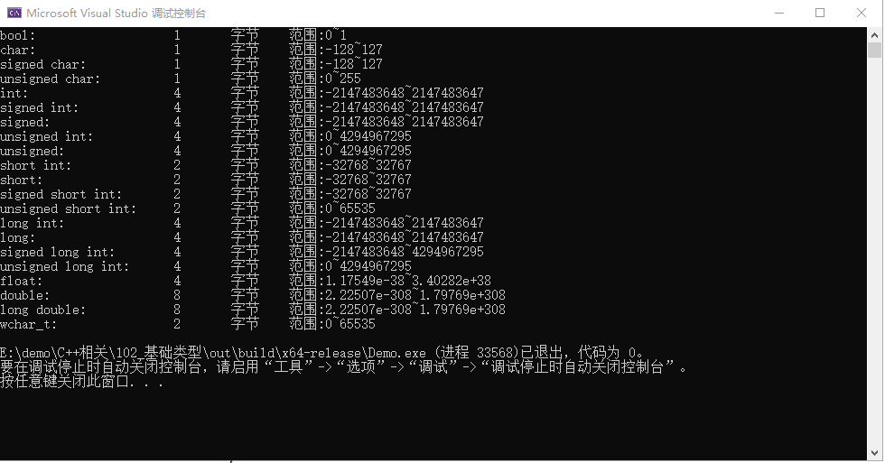
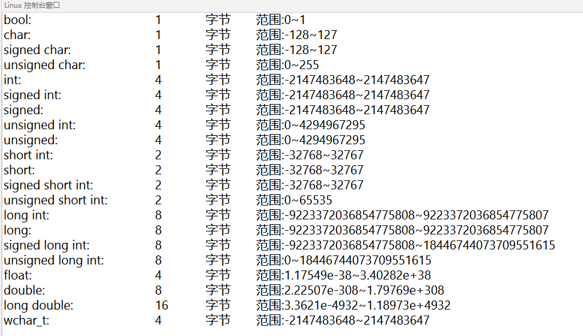

# C++基础语法

## 基础类型

C++的基础数据类型有：

bool ： 处理 布尔类型 值 true 或 false；

char ： 处理 字符类型数据；

int ：处理 整型 数据

float ：处理 浮点数

double ： 处理 双精度浮点数

wchar_t（宽字符型）：如果常量以 L（仅当大写时）开头，则表示它是一个宽字符常量（例如 L’x’），此时它必须存储在 wchar_t 类型的变量中。否则，它就是一个窄字符常量（例如 ‘x’），此时它可以存储在 char 类型的简单变量中。

void ： 空类型


### 修饰符

除此外，还有类型修饰符：signed、unsigned、long 和 short

可以被类型修饰符修饰的类型有：int char 和 double

其中：

int 可以被 signed、unsigned、long 和 short 修饰 char 可以被 signed、unsigned 修饰 double 可以被 long 修饰

如果只写：signed、unsigned、long 和 short 等价于： signed int、unsigned int、long int 和 short int


### 范围

不同的编译器，数据类型的大小不同

```cpp
#include <iostream>
#include <limits>
using namespace std;
int main(int argc, char* argv[])
{
    cout << "bool:\t\t\t" << sizeof(bool) << "\t字节\t" << "范围:" << numeric_limits<bool>::min() << "~" << numeric_limits<bool>::max() << endl;
    cout << "char:\t\t\t" << sizeof(char) << "\t字节\t" << "范围:" << (int)numeric_limits<char>::min() << "~" << (int)numeric_limits<char>::max() << endl;
    cout << "signed char:\t\t" << sizeof(signed char) << "\t字节\t" << "范围:" << (int)numeric_limits<signed char>::min() << "~" << (int)numeric_limits<signed char>::max() << endl;
    cout << "unsigned char:\t\t" << sizeof(unsigned char) << "\t字节\t" << "范围:" << (int)numeric_limits<unsigned char>::min() << "~" << (int)numeric_limits<unsigned char>::max() << endl;
    cout << "int:\t\t\t" << sizeof(int) << "\t字节\t" << "范围:" << numeric_limits<int>::min() << "~" << numeric_limits<int>::max() << endl;
    cout << "signed int:\t\t" << sizeof(signed int) << "\t字节\t" << "范围:" << numeric_limits<signed int>::min() << "~" << numeric_limits<signed int>::max() << endl;
    cout << "signed:\t\t\t" << sizeof(signed) << "\t字节\t" << "范围:" << numeric_limits<signed>::min() << "~" << numeric_limits<signed>::max() << endl;
    cout << "unsigned int:\t\t" << sizeof(unsigned int) << "\t字节\t" << "范围:" << numeric_limits<unsigned int>::min() << "~" << numeric_limits<unsigned int>::max() << endl;
    cout << "unsigned:\t\t" << sizeof(unsigned) << "\t字节\t" << "范围:" << numeric_limits<unsigned>::min() << "~" << numeric_limits<unsigned>::max() << endl;
    cout << "short int:\t\t" << sizeof(short int) << "\t字节\t" << "范围:" << numeric_limits<short int>::min() << "~" << numeric_limits<short int>::max() << endl;
    cout << "short:\t\t\t" << sizeof(short) << "\t字节\t" << "范围:" << numeric_limits<short>::min() << "~" << numeric_limits<short>::max() << endl;
    cout << "signed short int:\t" << sizeof(signed short int) << "\t字节\t" << "范围:" << numeric_limits<signed short int>::min() << "~" << numeric_limits<signed short int>::max() << endl;
    cout << "unsigned short int:\t" << sizeof(unsigned short int) << "\t字节\t" << "范围:" << numeric_limits<unsigned short int>::min() << "~" << numeric_limits<unsigned short int>::max() << endl;
    cout << "long int:\t\t" << sizeof(long int) << "\t字节\t" << "范围:" << numeric_limits<long int>::min() << "~" << numeric_limits<long int>::max() << endl;
    cout << "long:\t\t\t" << sizeof(long) << "\t字节\t" << "范围:" << numeric_limits<long>::min() << "~" << numeric_limits<long>::max() << endl;
    cout << "signed long int:\t" << sizeof(signed long int) << "\t字节\t" << "范围:" << numeric_limits<signed long int>::min() << "~" << numeric_limits<unsigned long int>::max() << endl;
    cout << "unsigned long int:\t" << sizeof(unsigned long int) << "\t字节\t" << "范围:" << numeric_limits<unsigned long int>::min() << "~" << numeric_limits<unsigned long int>::max() << endl;
    cout << "float:\t\t\t" << sizeof(float) << "\t字节\t" << "范围:" << numeric_limits<float>::min() << "~" << numeric_limits<float>::max() << endl;
    cout << "double:\t\t\t" << sizeof(double) << "\t字节\t" << "范围:" << numeric_limits<double>::min() << "~" << numeric_limits<double>::max() << endl;
    cout << "long double:\t\t" << sizeof(long double) << "\t字节\t" << "范围:" << numeric_limits<long double>::min() << "~" << numeric_limits<long double>::max() << endl;
    cout << "wchar_t:\t\t" << sizeof(wchar_t) << "\t字节\t" << "范围:" << numeric_limits<wchar_t>::min() << "~" << numeric_limits<wchar_t>::max() << endl;
 return 0;
}
```


**使用：**Microsoft Visual C++ x86 


**使用：**Microsoft Visual C++ x64 


**使用:** Ubuntu GCC 


## 基础运算符

| 优先权 |    运算符    | 说明                                      |  结合性  |
| :----: | :----------: | :---------------------------------------- | :------: |
|   1    |      ()      | 括号                                      | 由左至右 |
|   2    | !、-、++、-- | 逻辑运算符NOT、算术运算符负号、递增、递减 | 由右至左 |
|   3    |   *、/、%    | 算术运算符的乘法、除法、余数              | 由左至右 |
|   4    |     +、-     | 算术运算符加法、减法                      | 由左至右 |
|   5    | <<、>>、>>>  | 位操作子左移、右移、无符号右移            | 由左至右 |
|   6    | >、>=、<、<= | 关系运算符大于、大于等于、小于、小于等于  | 由左至右 |
|   7    |    ==、!=    | 关系运算符等于、不等于                    | 由左至右 |
|   8    |      &       | 位操作子AND                               | 由左至右 |
|   9    |      ^       | 位操作子XOR                               | 由左至右 |
|   10   |      \|      | 位操作子OR                                | 由左至右 |
|   11   |      &&      | 逻辑运算符AND                             | 由左至右 |
|   12   |     \|\|     | 逻辑运算符OR                              | 由左至右 |
|   13   |      ?:      | 条件控制运算符                            | 由右至左 |
|   14   |    =、op=    | 指定运算符                                | 由右至左 |

**op=** 这里指： += 、 -= 、 *= 、 \= 、 %= 、 &= 、 ^= 、 |=


## 引用

在前面一篇我们知道，变量是内存地址的一个名字；引用是给一个已经有名称的内存地址，再起一个名字。

看下面代码，做一下深入理解：

```cpp
/*
* 引用
* 类型 & 引用变量名 = 引用实体；
*/
void test1()
{
 int a = 1;  // 声明并初始化 int 类型变量 a
 int& b = a;  // 定义引用类型 b，指向 变量a
 cout << b << endl;
 int& c = b;  // 定义引用类型 b，指向 变量b
 cout << c << endl;

 cout << &a << endl; // 输出a的内存地址
 cout << &b << endl; // 输出b的内存地址
 cout << &c << endl; // 输出c的内存地址
}
```


**结果：**

> 1
>
> 1
>
> 0x7fffffffe464
>
> 0x7fffffffe464
>
> 0x7fffffffe464

引用 不是新定义一个变量，而 是给已存在变量取了一个别名 ，编译器不会为引用变量开辟内存空间，它和它引用的变量共用同一块内存空间。


## 指针&指针初始化

指针（pointer）是 C++中的一个核心概念；是c++中常见的用来存在内存的一种工具。

理解指针有两个点：

1. 指针本身是一个大小等于int类型的变量。
2. 指针内存储着它指向的值的地址。

```cpp
void test1()
{
 int a = 1; // 声明并初始化 int 类型变量 a
 int* ptr;  // 声明int类型指针 ptr
 ptr = &a;  // 让指针ptr指向 变量a 的地址
 cout << ptr  << endl; // 输出 指针指向的地址
 cout << *ptr << endl; // 输出 指针指向的地址的值
 cout << &ptr << endl; // 输出 指针的地址
}
```


**结果：**

> 0x7fffffffe46c
>
> 1
>
> 0x7fffffffe470

以上demo，指针是指向**栈对象**，其实在正式的编程工作中，指针大多是指向**堆对象**的。

*栈对象 和 堆对象的区别，我们会在后续讲解。*

**堆对象** 的 创建 和 释放 是需要特殊的关键字；

C++中 一共有两对关键字：

**malloc**，**free** （C++，兼容C；所以可以用C的关键字）

**new**，**delete** （C++新增，常用这一对）

**这里注意：** free 和 delete 是 释放指针指向地址的内存，这时指针依然指向对应地址，不为空。

这时需要给指针赋空值，否则后续无法判断指针指向的位置是否有效，就会形成野指针。

同理，在声明一个指针是，通常就应该初始化；如果暂不确定值，可以赋空，防止野指针。


### malloc & free

malloc 和 free 的一般形式：

```cpp
void *malloc(size_t size) 
void free(void *ptr)
```

1
2

malloc 分配指定大小为 size字节的内存空间，返回一个指向该空间的void*指针。 由于返回 void* 指针，所以需要强制类型转换后才能引用其中的值。

free 释放一个由 malloc 所分配的内存空间。ptr 指向一个要释放内存的内存块， 该指针应当是之前调用 malloc 的返回值。

```cpp
void test3()
{
 int* ptr = nullptr; // 通常指针变量声明时，就应该初始化；如果暂不确定值，可以赋空，防止野指针。
 ptr = (int*)malloc(sizeof(int)); // 申请一个int大小的堆内存，并进行强制类型转换
 *ptr = 1; // 对ptr指向的位置赋值
 cout << *ptr << endl; // 输出
 free(ptr);
  ptr = nullptr;
}
```


**结果：**

> 1
>
> 0x55555556aeb0
>
> 0x55555556aeb0


### new & delete

new & delete 的一般形式：

```cpp
类型* 指针名 = new 类型();
delete 指针名
```


new 按照类型的大小，分配内存。 delete 释放指针指向地址的内存，这是指针依然指向对应地址，不为空。 通常会在 delete 后，增加一个 给指针变量赋空的操作；防止野指针。

```cpp
void test4()
{
 int* ptr = new int(4); // 声明并初始化 int类型 指针 ptr
 cout << ptr << endl; // 输出 ptr 指向的地址
 cout << *ptr << endl; // 输出 ptr 指向地址的值
 delete ptr;
 cout << ptr << endl; // 输出 ptr 指向的地址
 cout << *ptr << endl; // 输出 ptr 指向地址的值
  ptr = nullptr;
}
```


**结果：**

> 0x55555556aeb0
>
> 4
>
> 0x55555556aeb0
>
> 1431655786


## 数组

以int类型举例：

当声明一个int类型的变量a，是在内存中声明了一个int类型大小（4Byte，32Bit）的内存

当声明一个int类型的数组array，是在内存中声明了一组连续的int类型大小（4Byte，32Bit）的内存


### 基本操作（初始化和下标访问）

数据申明的基本形式：

```cpp
类型  参数[数量]
```


访问数组时，使用数组下标，下标从0开始。


#### 初始化1

已知数组大小，和所有元素的值。

```cpp
void demo()
{
  int array[2] = { 1, 2 };
  cout << array[0] << endl;
  cout << array[1] << endl;
}
```


**结果：**

> 1
>
> 2

这种情况下也可以省略数组大小不写，结果等价。


#### 初始化2

已知数组大小，和有元素的值，且值相同。

```cpp
void demo()
{
  int array[2] = { 1 };
  cout << array[0] << endl;
  cout << array[1] << endl;
}
```


**结果：**

> 1
>
> 1


#### 初始化3

已知数组大小，值暂不清晰。

```cpp
void demo()
{
  int array[2];
  array[0] = 0;
  array[1] = 1;
  cout << array[0] << endl;
  cout << array[1] << endl;
}
```


#### 未初始化

未初始化的数据为当前内存位置存的随机值（内存中本来的值）。

存在两种为初始的情况： 1、数组刚声明，未赋值。 2、数组访问下标越界，虽然还是可以访问，但是值为随机值。

```cpp
void demo()
{
  int array1[2];
  cout << array1[0] << endl;
  cout << array1[1] << endl;

  int array2[2] = {0};
  cout << array2[0] << endl;
  cout << array2[1] << endl;
  cout << array2[2] << endl;
}
```


**结果：**

```text
-135408993
32767

0
0
-135408993
```


### 栈数组和堆数组（数组动态分配）

**栈数组：内容存储在栈中的数组。** 上面的demo其实就是栈数组。 这样的数组有一个弊端，需要在写代码时，就定义好数组大小。

如果我们暂时不知道数组的大小；需要在运行时决定数组大小，就需要堆数组；对数组大小进行动态分配。

**堆数组：内容存储在堆中的数组。** C++如果想把内存分配到堆上，就需要使用 C++操作堆的两组关键字：

**malloc**，**free** （C++，兼容C；所以可以用C的关键字）

**new**，**delete** （C++新增，常用这一对）


具体理解查看下面的demo：

#### malloc & free

```cpp
void demo5()
{
 int n = 2; // 定义数组的大小
 int* grade = (int*)malloc(sizeof(int) * n); // 创建数组 数组大小：int类型的大小 * n 。

  cout << sizeof(grade) << endl; // 输出 grade 大小
 cout << grade << endl;  // 输出：指针的执行的位置
 cout << &grade[0] << endl; // 输出：数组0号位的位置 
 cout << &grade[1] << endl; // 输出：数组1号位的位置

 // 输出默认值
 cout << grade[0] << endl;
 cout << grade[1] << endl;

 grade[0] = 0; // 给数组0号位赋值
 grade[1] = 1; // 给数组1号位赋值
 // 输出 赋值后结果
 cout << grade[0] << endl;
 cout << grade[1] << endl;

 free(grade);
}
```


**结果：**

> 8
>
> 0x55555556aeb0
>
> 0x55555556aeb0
>
> 0x55555556aeb4
>
> 0
>
> 0
>
> 0
>
> 1


#### new & delete

需要注意的是 数组的操作符方式为： new[] 和 delete[]

一般形式为：

```cpp
类型* 指针名 = new 类型[n]; // n 为数组个数
delete[] 指针名
```


```cpp
void demo6()
{
 int n = 3; // 定义数组的大小
 int* grade = new int[n]; // 创建数组 数组大小：int类型的大小 * n 。

  cout << sizeof(grade) << endl; // 输出 grade 大小
 cout << grade << endl;  // 输出：指针的执行的位置
 cout << &grade[0] << endl; // 输出：数组0号位的位置 
 cout << &grade[1] << endl; // 输出：数组1号位的位置

 // 输出默认值
 cout << grade[0] << endl;
 cout << grade[1] << endl;

 grade[0] = 0; // 给数组0号位赋值
 grade[1] = 1; // 给数组1号位赋值
 // 输出 赋值后结果
 cout << grade[0] << endl;
 cout << grade[1] << endl;

 delete[] grade;
}
```


**结果：**

> 8
>
> 0x55555556aeb0
>
> 0x55555556aeb0
>
> 0x55555556aeb4
>
> 0
>
> 0
>
> 0
>
> 1


#### 指针和数组的关系

从以上demo可以发现：堆数组是用指针的方式操作数组；来实现在运行期再决定数组大小的目的。

现在的问题是 为什么我们可以这么做嗯？

这是因为编译器在处理指针的 `[n]`,`++`,`--`,`+ n`,`- n` 操作时，是按 **对应类型大小** 的 往上或往下找到第**n**个位置。

即 指针，可以通过这样的方式操作连续内存，这恰好和数据契合；所以我们可以用指针来操作数组。

但指针和数组是两个概念。


## 常用语句

C++ 常用语句有：

1、赋值语句

2、条件语句

3、循环语句

4、try...catch...throw


### 赋值语句

一般形式为：

```text
value = exp;
```


value 为变量，exp为可求值的表达式。

例：

```text
int a = 0;

a = 1 + 1;
```


第一句 初始一个int类型变量a，并赋值为0； 第二句 求1 + 1 的值，并赋给 a；


### 条件语句

#### if else

一般形式为：

```cpp
if (exp)
{
  // 程序代码
}
else
{
  // 程序代码
}
```


exp 为求值为bool 类型的表达式。 程序代码中可以继续嵌套 if else 已完成复杂逻辑判断。

如果只有为true的条件需要特殊的程序代码：

```cpp
if (exp)
{
  // 程序代码
}
```


如果有多个并列的不同条件：

```cpp
if (exp1)
{
  // 程序代码
}
else if (exp2)
{
  // 程序代码
}
else
{
  // 程序代码
}
```


#### 三元运算符

一般形式：

```cpp
condition ? exp1 : exp2;
```


执行方式为：先执行 condition； condition为true，结果为exp1的值； condition为false，结果为exp2的值。

#### switch

如果我们存在大量使用多个并列的不同条件需要判断，也可以使用switch。

一般形式：

```cpp
switch (exp) {
  case condition_exp1:
    // 程序代码1
    break;
  case condition_exp2:
    // 程序代码2
    break;
  case condition_exp3:
    // 程序代码3
    break;
  default:
    // 程序代码4
    break;
}
```


exp、condition_exp1、condition_exp2 ... 可 计算为 int类型，或者为 枚举类型。

逻辑为：exp求出的值，等于 哪一个 condition_exp；代码就跳转到那里执行，到break为止。

如果没有，就执行 default。

例1：

```cpp
int a = 2;
switch (a)
{
case 1:
 cout << "case 1" << endl;
 break;
case 1 + 1 :
 cout << "case 2" << endl;
 break;
default:
 cout << "case default" << endl;
 break;
}
```


运行结果：

```text
case 2
```


例2：

```cpp
switch (1 + 1)
{
case 1+0:
 cout << "case 1" << endl;
case 2:
 cout << "case 2" << endl;
default:
 cout << "case default" << endl;
 break;
}
```


运行结果：

```text
case 2
case default
```


### 循环语句

#### while

一般形式：

```cpp
while (condition)
{
  循环体代码
}
```


例：计算 1 + 2 + 3 + ··· + 10 的结果

```cpp
void while_demo()
{
 int i = 1;
 int amont = 0;
 while (i <= 10)
 {
  amont += i;
  i++;
 }
}
```


#### do... while

一般形式：

```cpp
do
{
  循环体代码
} while (condition)
```


例：计算 1 + 2 + 3 + ··· + 10 的结果

```cpp
void do_while_demo()
{
 int i = 1;
 int amont = 0;
 do
 {
  amont += i;
  i++;
 } while (i <= 10);
}
```


#### for

一般形式：

```cpp
for ( init ; condition ; increment )
{
  循环体代码
}
```


例：计算 1 + 2 + 3 + ··· + 10 的结果

```cpp
void for_demo()
{
 int amont = 0;
 for (int i = 1; i <= 10; i++)
 {
  amont += i;
 }
}
```


### try...catch...throw

当执行一段语句可能发生异常时，就需要将这段代码保护起来。

一般形式：

```cpp
try
{
  保护块代码:
  包含：
    throw
  
}
cacth (ExceptionName e1)
{
  cacth块代码1：处理异常1的情况
}
cacth (ExceptionName e2)
{
  cacth块代码2：处理异常2的情况
}
cacth (...)
{
  cacth块代码 ... ：处理剩下的所有异常
}
```

throw : 抛出异常 try : 执行保护代码中，一般包含throw catch : 接收处理异常


#### Demo & 理解throw

throw 在未被命中前，将跳过后续的所有代码；如果一直没有被处理，就会被系统接收，导致当前程序崩溃。

**demo1：** 正常命中异常

```cpp
void try_catch_deom()
{
 try
 {
  cout << "This is before throw" << endl;
  throw 1;
  cout << "This is after throw" << endl;
 }
 catch (int num)
 {
  cout << "This is catch int" << endl;
 }
}


int main(int argc, char* argv[])
{
 try_catch_deom();
 cout << "this is after demo" << endl;

 return 0;
}
```

**结果：**

> This is before throw
>
> This is catch int
>
> this is after demo


**demo2：** 由...命中异常

```cpp
void try_catch_deom()
{
 try
 {
  cout << "This is before throw" << endl;
  throw 1.1;
  cout << "This is after throw" << endl;
 }
 catch (int num)
 {
  cout << "This is catch int" << endl;
 }
}

int main(int argc, char* argv[])
{
 try
 {
  try_catch_deom();
  cout << "this is after demo" << endl;
 }
 catch (...)
 {
  cout << "This is catch ..." << endl;
 }
 return 0;
}
```

**结果：**

> This is before throw
>
> This is catch ...


**demo3:** 无接收

```cpp
int main(int argc, char* argv[])
{
  throw 1;
 return 0;
}
```

结果：程序崩溃