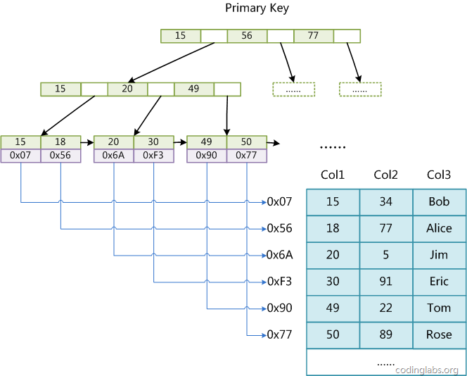
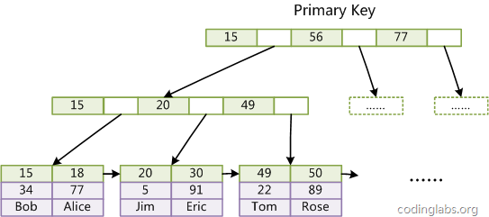
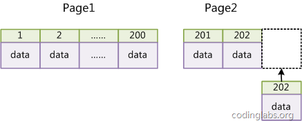
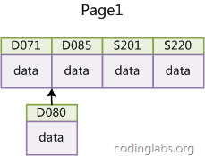

## 数据库基础
### 基本概念

- 数据（data）：描述事物的符号记录称为数据。
- 数据库（DataBase，DB）：是长期存储在计算机内、有组织的、可共享的大量数据的集合，具有永久存储、有组织、可共享三个基本特点。
- 数据库管理系统（DataBase Management System，DBMS）：是位于用户与操作系统之间的一层数据管理软件。
- 数据库系统（DataBase System，DBS）：是有数据库、数据库管理系统（及其应用开发工具）、应用程序和数据库管理员（DataBase Administrator DBA）组成的存储、管理、处理和维护数据的系统。
- 实体（entity）：客观存在并可相互区别的事物称为实体。
- 属性（attribute）：实体所具有的某一特性称为属性。
- 码（key）：唯一标识实体的属性集称为码。
- 实体型（entity type）：用实体名及其属性名集合来抽象和刻画同类实体，称为实体型。
- 实体集（entity set）：同一实体型的集合称为实体集。
- 联系（relationship）：实体之间的联系通常是指不同实体集之间的联系。
- 模式（schema）：模式也称逻辑模式，是数据库全体数据的逻辑结构和特征的描述，是所有用户的公共数据视图。
- 外模式（external schema）：外模式也称子模式（subschema）或用户模式，它是数据库用户（包括应用程序员和最终用户）能够看见和使用的局部数据的逻辑结构和特征的描述，是数据库用户的数据视图，是与某一应用有关的数据的逻辑表示。
- 内模式（internal schema）：内模式也称为存储模式（storage schema），一个数据库只有一个内模式。他是数据物理结构和存储方式的描述，是数据库在数据库内部的组织方式。

### 常用数据模型

- 层次模型（hierarchical model）
- 网状模型（network model）
- 关系模型（relational model）
    - 关系（relation）：一个关系对应通常说的一张表
    - 元组（tuple）：表中的一行即为一个元组
    - 属性（attribute）：表中的一列即为一个属性
    - 码（key）：表中可以唯一确定一个元组的某个属性组
    - 域（domain）：一组具有相同数据类型的值的集合
    - 分量：元组中的一个属性值
    - 关系模式：对关系的描述，一般表示为 `关系名(属性1, 属性2, ..., 属性n)`
- 面向对象数据模型（object oriented data model）
- 对象关系数据模型（object relational data model）
- 半结构化数据模型（semistructure data model）

### 常用 SQL 操作

<table>
  <tr>
    <th>对象类型</th>
    <th>对象</th>
    <th>操作类型</th>
  </tr>
  <tr>
    <td rowspan="4">数据库模式</td>
    <td>模式</td>
    <td><code>CREATE SCHEMA</code></td>
  </tr>
  <tr>
    <td>基本表</td>
    <td><code>CREATE SCHEMA</code>，<code>ALTER TABLE</code></td>
  </tr>
    <tr>
    <td>视图</td>
    <td><code>CREATE VIEW</code></td>
  </tr>
    <tr>
    <td>索引</td>
    <td><code>CREATE INDEX</code></td>
  </tr>
    <tr>
    <td rowspan="2">数据</td>
    <td>基本表和视图</td>
    <td><code>SELECT</code>，<code>INSERT</code>，<code>UPDATE</code>，<code>DELETE</code>，<code>REFERENCES</code>，<code>ALL PRIVILEGES</code></td>
  </tr>
    <tr>
    <td>属性列</td>
    <td><code>SELECT</code>，<code>INSERT</code>，<code>UPDATE</code>，<code>REFERENCES</code>，<code>ALL PRIVILEGES</code></td>
  </tr>
</table>

> SQL 语法教程：[runoob . SQL 教程](http://www.runoob.com/sql/sql-tutorial.html)

- **SELECT** - 从数据库中提取数据
- **UPDATE** - 更新数据库中的数据
- **DELETE** - 从数据库中删除数据
- **INSERT INTO** - 向数据库中插入新数据
- **CREATE DATABASE** - 创建新数据库
- **ALTER DATABASE** - 修改数据库
- **CREATE TABLE** - 创建新表
- **ALTER TABLE** - 变更（改变）数据库表
- **DROP TABLE** - 删除表
- **CREATE INDEX** - 创建索引（搜索键）
- **DROP INDEX** - 删除索引

### 关系型数据库

- 基本关系操作：查询（选择、投影、连接（等值连接、自然连接、外连接（左外连接、右外连接））、除、并、差、交、笛卡尔积等）、插入、删除、修改
- 关系模型中的三类完整性约束：实体完整性、参照完整性、用户定义的完整性

#### 索引

- 数据库索引：顺序索引、B+ 树索引、hash 索引
- [MySQL 索引背后的数据结构及算法原理](http://blog.codinglabs.org/articles/theory-of-mysql-index.html)

### 数据库完整性

- 数据库的完整性是指数据的正确性和相容性。
    - 完整性：为了防止数据库中存在不符合语义（不正确）的数据。
    - 安全性：为了保护数据库防止恶意破坏和非法存取。
- 触发器：是用户定义在关系表中的一类由事件驱动的特殊过程。

### 关系数据理论

- 数据依赖是一个关系内部属性与属性之间的一种约束关系，是通过属性间值的相等与否体现出来的数据间相关联系。
- 最重要的数据依赖：函数依赖、多值依赖。

#### 范式

- 第一范式（1NF）：属性（字段）是最小单位不可再分。
- 第二范式（2NF）：满足 1NF，每个非主属性完全依赖于主键（消除 1NF 非主属性对码的部分函数依赖）。
- 第三范式（3NF）：满足 2NF，任何非主属性不依赖于其他非主属性（消除 2NF 非主属性对码的传递函数依赖）。
- 鲍依斯-科得范式（BCNF）：满足 3NF，任何非主属性不能对主键子集依赖（消除 3NF 主属性对码的部分和传递函数依赖）。
- 第四范式（4NF）：满足 3NF，属性之间不能有非平凡且非函数依赖的多值依赖（消除 3NF 非平凡且非函数依赖的多值依赖）。

### 数据库恢复

- 事务：是用户定义的一个数据库操作序列，这些操作要么全做，要么全不做，是一个不可分割的工作单位。
- 事物的 ACID 特性：原子性、一致性、隔离性、持续性。
- 恢复的实现技术：建立冗余数据 -> 利用冗余数据实施数据库恢复。
- 建立冗余数据常用技术：数据转储（动态海量转储、动态增量转储、静态海量转储、静态增量转储）、登记日志文件。

### 并发控制

- 事务是并发控制的基本单位。
- 并发操作带来的数据不一致性包括：丢失修改、不可重复读、读 “脏” 数据。
- 并发控制主要技术：封锁、时间戳、乐观控制法、多版本并发控制等。
- 基本封锁类型：排他锁（X 锁 / 写锁）、共享锁（S 锁 / 读锁）。
- 活锁死锁：
    - 活锁：事务永远处于等待状态，可通过先来先服务的策略避免。
    - 死锁：事务永远不能结束
        - 预防：一次封锁法、顺序封锁法；
        - 诊断：超时法、等待图法；
        - 解除：撤销处理死锁代价最小的事务，并释放此事务的所有的锁，使其他事务得以继续运行下去。
- 可串行化调度：多个事务的并发执行是正确的，当且仅当其结果与按某一次序串行地执行这些事务时的结果相同。可串行性时并发事务正确调度的准则。

## MySql索引原理

### MyISAM和InnoDB

MyISAM引擎的数据和索引是分开存储的，索引使用的是B+树：



InnoDB的索引也是B+树，在这种方式下索引和数据存在一起。数据作为B+树的叶子节点：




**对比：**

MyISAM：适合读取频繁，写入较少的场景（因为表级锁、B+树叶存地址）

InnoDB：适合并发写入的场景（因为行级锁、B+树叶存记录）

>InnoDB：支持外键和事务，行锁适合高并发，缓存索引和数据，内存要求高（因为要缓存索引和记录），适合存大数据量，增删改性能更优（行级锁高并发），耗费磁盘（因为有多个非聚簇索引，索引可能比记录空间还大）。
>
>MyISAM：不支持外键和事务，表锁不适合高并发，缓存索引和数据地址，内存要求低（因为不用缓存记录），查询性能更优（因为查询时InnoDB要维护MVCC一致，而且多缓存了记录），节省磁盘（因为磁盘不存完整记录）。

| 对比项 | InnoDB | MyISAM |
| ---- | ---- | ---- |
| 特点 | 支持外键和事务 | 不支持外键和事务 |
| 行表锁 | 行锁，操作时只锁某一行，不对其它行有影响， 适合高并发的操作 | 表锁，即使操作一条记录也会锁住整个表，不适合高并发的操作 |
| 缓存 | 缓存索引和数据，对内存要求较高，而且内存大小对性能有决定性的影响 | 只缓存索引，不缓存真实数据 |
| 关注点 | 事务：并发写、事务、更大资源 | 性能：节省资源、消耗少、简单业务、查询快\| |
| 版本 | 5.5及其之后 | 5.5之前 |

### 最左前缀原理

联合索引：MySQL中的索引可以以一定顺序引用多个列，是一个有序元组<a1, a2, …, an>，其中各个元素均为数据表的一列；单列索引可以看成联合索引元素数为1的特例。


**查看索引：**

```sql
SHOW INDEX FROM employees.titles;
+--------+------------+----------+--------------+-------------+-----------+-------------+------+------------+
| Table  | Non_unique | Key_name | Seq_in_index | Column_name | Collation | Cardinality | Null | Index_type |
+--------+------------+----------+--------------+-------------+-----------+-------------+------+------------+
| titles |          0 | PRIMARY  |            1 | emp_no      | A         |        NULL |      | BTREE      |
| titles |          0 | PRIMARY  |            2 | title       | A         |        NULL |      | BTREE      |
| titles |          0 | PRIMARY  |            3 | from_date   | A         |      443308 |      | BTREE      |
| titles |          1 | emp_no   |            1 | emp_no      | A         |      443308 |      | BTREE      |
+--------+------------+----------+--------------+-------------+-----------+-------------+------+------------+
```

**删除索引：**

```sql
ALTER TABLE employees.titles DROP INDEX emp_no;
```

删除后的效果：

```sql
SHOW INDEX FROM employees.titles;
+--------+------------+----------+--------------+-------------+-----------+-------------+------+------------+
| Table  | Non_unique | Key_name | Seq_in_index | Column_name | Collation | Cardinality | Null | Index_type |
+--------+------------+----------+--------------+-------------+-----------+-------------+------+------------+
| titles |          0 | PRIMARY  |            1 | emp_no      | A         |        NULL |      | BTREE      |
| titles |          0 | PRIMARY  |            2 | title       | A         |        NULL |      | BTREE      |
| titles |          0 | PRIMARY  |            3 | from_date   | A         |      443308 |      | BTREE      |
+--------+------------+----------+--------------+-------------+-----------+-------------+------+------------+
```

最左前缀原理是因为**B+ Tree**的存储方式

#### 情况一：全列匹配

当按照索引中所有列进行精确匹配（这里精确匹配指“=”或“IN”匹配）时，索引可以被用到。

```sql
EXPLAIN SELECT * FROM employees.titles WHERE emp_no='10001' AND title='Senior Engineer' AND from_date='1986-06-26';
+----+-------------+--------+-------+---------------+---------+---------+-------------------+------+-------+
| id | select_type | table  | type  | possible_keys | key     | key_len | ref               | rows | Extra |
+----+-------------+--------+-------+---------------+---------+---------+-------------------+------+-------+
|  1 | SIMPLE      | titles | const | PRIMARY       | PRIMARY | 59      | const,const,const |    1 |       |
+----+-------------+--------+-------+---------------+---------+---------+-------------------+------+-------+
```

这里有一点需要注意，理论上索引对顺序是敏感的，但是由于MySQL的查询优化器会自动调整where子句的条件顺序以使用适合的索引，例如我们将where中的条件顺序颠倒：

```sql
EXPLAIN SELECT * FROM employees.titles WHERE from_date='1986-06-26' AND emp_no='10001' AND title='Senior Engineer';
+----+-------------+--------+-------+---------------+---------+---------+-------------------+------+-------+
| id | select_type | table  | type  | possible_keys | key     | key_len | ref               | rows | Extra |
+----+-------------+--------+-------+---------------+---------+---------+-------------------+------+-------+
|  1 | SIMPLE      | titles | const | PRIMARY       | PRIMARY | 59      | const,const,const |    1 |       |
+----+-------------+--------+-------+---------------+---------+---------+-------------------+------+-------+
```

效果是一样的。

#### 情况二：最左前缀匹配

当查询条件精确匹配索引的左边连续一个或几个列时，如<emp_no>或<emp_no, title>，所以可以被用到，但是只能用到一部分，即条件所组成的最左前缀。

```sql
EXPLAIN SELECT * FROM employees.titles WHERE emp_no='10001';
+----+-------------+--------+------+---------------+---------+---------+-------+------+-------+
| id | select_type | table  | type | possible_keys | key     | key_len | ref   | rows | Extra |
+----+-------------+--------+------+---------------+---------+---------+-------+------+-------+
|  1 | SIMPLE      | titles | ref  | PRIMARY       | PRIMARY | 4       | const |    1 |       |
+----+-------------+--------+------+---------------+---------+---------+-------+------+-------+
```

#### 情况三：查询条件用到了索引中列的精确匹配，但是中间某个条件未提供

这种情况下，左前缀只能到emp_no；中间没有title，即便from_date是精准匹配也不行
```sql
EXPLAIN SELECT * FROM employees.titles WHERE emp_no='10001' AND from_date='1986-06-26';
+----+-------------+--------+------+---------------+---------+---------+-------+------+-------------+
| id | select_type | table  | type | possible_keys | key     | key_len | ref   | rows | Extra       |
+----+-------------+--------+------+---------------+---------+---------+-------+------+-------------+
|  1 | SIMPLE      | titles | ref  | PRIMARY       | PRIMARY | 4       | const |    1 | Using where |
+----+-------------+--------+------+---------------+---------+---------+-------+------+-------------+
```

这时，如果title是可以枚举的，可以用 枚举的方式来处理：

```sql
EXPLAIN SELECT * FROM employees.titles
WHERE emp_no='10001'
AND title IN ('Senior Engineer', 'Staff', 'Engineer', 'Senior Staff', 'Assistant Engineer', 'Technique Leader', 'Manager')
AND from_date='1986-06-26';
+----+-------------+--------+-------+---------------+---------+---------+------+------+-------------+
| id | select_type | table  | type  | possible_keys | key     | key_len | ref  | rows | Extra       |
+----+-------------+--------+-------+---------------+---------+---------+------+------+-------------+
|  1 | SIMPLE      | titles | range | PRIMARY       | PRIMARY | 59      | NULL |    7 | Using where |
+----+-------------+--------+-------+---------------+---------+---------+------+------+-------------+
```
当前情况，就使用了更多的索引。比较两者的效率：

```sql
SHOW PROFILES;
+----------+------------+-------------------------------------------------------------------------------+
| Query_ID | Duration   | Query                                                                         |
+----------+------------+-------------------------------------------------------------------------------+
|       10 | 0.00058000 | SELECT * FROM employees.titles WHERE emp_no='10001' AND from_date='1986-06-26'|
|       11 | 0.00052500 | SELECT * FROM employees.titles WHERE emp_no='10001' AND title IN ...          |
+----------+------------+-------------------------------------------------------------------------------+
```
但这里索引使用的多，并不一定代表是更好的选择，这里的title做了一个range查询，如果title的值很多，可能效果会更差。

#### 情况四：查询条件没有指定索引第一列

由于不是最左前缀，索引这样的查询用不到索引
```sql
EXPLAIN SELECT * FROM employees.titles WHERE from_date='1986-06-26';
+----+-------------+--------+------+---------------+------+---------+------+--------+-------------+
| id | select_type | table  | type | possible_keys | key  | key_len | ref  | rows   | Extra       |
+----+-------------+--------+------+---------------+------+---------+------+--------+-------------+
|  1 | SIMPLE      | titles | ALL  | NULL          | NULL | NULL    | NULL | 443308 | Using where |
+----+-------------+--------+------+---------------+------+---------+------+--------+-------------+
```

#### 情况五：匹配某列的前缀字符串

如果通配符%不出现在开头，则可以用到索引，但根据具体情况不同可能只会用其中一个前缀

```sql
EXPLAIN SELECT * FROM employees.titles WHERE emp_no='10001' AND title LIKE 'Senior%';
+----+-------------+--------+-------+---------------+---------+---------+------+------+-------------+
| id | select_type | table  | type  | possible_keys | key     | key_len | ref  | rows | Extra       |
+----+-------------+--------+-------+---------------+---------+---------+------+------+-------------+
|  1 | SIMPLE      | titles | range | PRIMARY       | PRIMARY | 56      | NULL |    1 | Using where |
+----+-------------+--------+-------+---------------+---------+---------+------+------+-------------+
```

#### 情况六：范围查询

范围列是**最左前缀**可以用到索引，但是范围列后面的列无法用到索引。

```sql
EXPLAIN SELECT * FROM employees.titles WHERE emp_no < '10010' and title='Senior Engineer';
+----+-------------+--------+-------+---------------+---------+---------+------+------+-------------+
| id | select_type | table  | type  | possible_keys | key     | key_len | ref  | rows | Extra       |
+----+-------------+--------+-------+---------------+---------+---------+------+------+-------------+
|  1 | SIMPLE      | titles | range | PRIMARY       | PRIMARY | 4       | NULL |   16 | Using where |
+----+-------------+--------+-------+---------------+---------+---------+------+------+-------------+
```

索引最多用于一个范围列，如果查询条件中有多个范围列；只能识别**最左前缀**

```sql
EXPLAIN SELECT * FROM employees.titles
WHERE emp_no < '10010'
AND title='Senior Engineer'
AND from_date BETWEEN '1986-01-01' AND '1986-12-31';
+----+-------------+--------+-------+---------------+---------+---------+------+------+-------------+
| id | select_type | table  | type  | possible_keys | key     | key_len | ref  | rows | Extra       |
+----+-------------+--------+-------+---------------+---------+---------+------+------+-------------+
|  1 | SIMPLE      | titles | range | PRIMARY       | PRIMARY | 4       | NULL |   16 | Using where |
+----+-------------+--------+-------+---------------+---------+---------+------+------+-------------+
```

MySql中Between并不一定属于范围查询：
```sql
EXPLAIN SELECT * FROM employees.titles
WHERE emp_no BETWEEN '10001' AND '10010'
AND title='Senior Engineer'
AND from_date BETWEEN '1986-01-01' AND '1986-12-31';
+----+-------------+--------+-------+---------------+---------+---------+------+------+-------------+
| id | select_type | table  | type  | possible_keys | key     | key_len | ref  | rows | Extra       |
+----+-------------+--------+-------+---------------+---------+---------+------+------+-------------+
|  1 | SIMPLE      | titles | range | PRIMARY       | PRIMARY | 59      | NULL |   16 | Using where |
+----+-------------+--------+-------+---------------+---------+---------+------+------+-------------+
```
作用于emp_no的Between相当于IN，是多值精确匹配。所以索引为3列

#### 情况七：查询条件中含有函数或表达式

如果查询条件中含有函数或表达式，则MySQL不会为这列使用索引：

```sql
EXPLAIN SELECT * FROM employees.titles WHERE emp_no - 1='10000';
+----+-------------+--------+------+---------------+------+---------+------+--------+-------------+
| id | select_type | table  | type | possible_keys | key  | key_len | ref  | rows   | Extra       |
+----+-------------+--------+------+---------------+------+---------+------+--------+-------------+
|  1 | SIMPLE      | titles | ALL  | NULL          | NULL | NULL    | NULL | 443308 | Using where |
+----+-------------+--------+------+---------------+------+---------+------+--------+-------------+

EXPLAIN SELECT * FROM employees.titles WHERE emp_no='10001' AND left(title, 6)='Senior';
+----+-------------+--------+------+---------------+---------+---------+-------+------+-------------+
| id | select_type | table  | type | possible_keys | key     | key_len | ref   | rows | Extra       |
+----+-------------+--------+------+---------------+---------+---------+-------+------+-------------+
|  1 | SIMPLE      | titles | ref  | PRIMARY       | PRIMARY | 4       | const |    1 | Using where |
+----+-------------+--------+------+---------------+---------+---------+-------+------+-------------+
```

### 索引选择性

索引在加快**查询**速度时，同时加重了 **插入、删除、修改** 的负担；同时MySql在运行时也需要消耗资源维护索引。

所以索引不是越来越好，是否建立索引一般有两个标准：

#### 1、表记录数

记录数比较少时不适合做索引，因为全表扫描就够了；

[【实验】MySQL多少数据需要建立索引_两万多的数据量有必要加索引吗-CSDN博客](https://blog.csdn.net/crxk_/article/details/103213009)

从这篇测试性文章可以看到，1万行数据，能提升忽略不计；大概10万行数据，建立索引能提升8倍；

建议在5万条数据以后，再做索引的打算

#### 2、区分度\选择性

```Math
Index Selectivity = Cardinality / T

- Selectivity：选择性
- Cardinality：不重复的索引值
- T：表记录数
```

区分度低的字段不适合做索引，这是B+Tree的性质决定的；区分度低导致B+Tree的叶子节点过长，不能起到索引的效果；


例：再当前所以情况下，如果做 first_name 和 last_name 的查找就会是全文检索

```sql
EXPLAIN SELECT * FROM employees.employees WHERE first_name='Eric' AND last_name='Anido';

+----+-------------+-----------+------+---------------+------+---------+------+--------+-------------+
| id | select_type | table     | type | possible_keys | key  | key_len | ref  | rows   | Extra       |
+----+-------------+-----------+------+---------------+------+---------+------+--------+-------------+
|  1 | SIMPLE      | employees | ALL  | NULL          | NULL | NULL    | NULL | 300024 | Using where |
+----+-------------+-----------+------+---------------+------+---------+------+--------+-------------+
```

如果要添加索引，可以选择 <first_name> 或 <first_name, last_name> 

```sql
SELECT count(DISTINCT(first_name))/count(*) AS Selectivity FROM employees.employees;
+-------------+
| Selectivity |
+-------------+
|      0.0042 |
+-------------+

SELECT count(DISTINCT(concat(first_name, last_name)))/count(*) AS Selectivity FROM employees.employees;
+-------------+
| Selectivity |
+-------------+
|      0.9313 |
+-------------+
```
明显 <first_name, last_name> 是更好的方式

### 前缀索引

虽然  <first_name, last_name> 的选择性很好，但长度过长；

> InnoDB的情况下：
> 
> B+Tree的索引也不建议太长，因为B+Tree的树节点有大小限制，一般为分页面的大小（通常为16KB）；
> 
> 如果索引值过长，会一个页导致键值较少；从而导致B+Tree的高度增加，效率下降
> 
> 具体上来说在UTF-8编码时：
> 
> ASCII编码的字符，索引长度最大为1000个字节
> 
> 一个汉字占用3个字节，索引长度最大为767个字节

这种情况下，可以考虑前缀索引，例 <first_name, left(last_name, 3)>，<first_name, left(last_name, 4)>

```sql
SELECT count(DISTINCT(concat(first_name, left(last_name, 3))))/count(*) AS Selectivity FROM employees.employees;
+-------------+
| Selectivity |
+-------------+
|      0.7879 |
+-------------+

SELECT count(DISTINCT(concat(first_name, left(last_name, 4))))/count(*) AS Selectivity FROM employees.employees;
+-------------+
| Selectivity |
+-------------+
|      0.9007 |
+-------------+
```

可以看到<first_name, left(last_name, 4)>就非常理想，可以增加前缀索引

```sql
ALTER TABLE employees.employees
ADD INDEX `first_name_last_name4` (first_name, last_name(4));
```

前缀索引兼顾索引大小和查询速度，但是其缺点是不能用于ORDER BY和GROUP BY操作，也不能用于Covering index（即当索引本身包含查询所需全部数据时，不再访问数据文件本身）。

### InnoDB的主键选择与插入优化

在使用InnoDB存储引擎时，如果没有特别的需要，请永远使用一个与业务无关的自增字段作为主键。

InnoDB使用聚集索引，数据记录本身被存于主索引（一颗B+Tree）的叶子节点上。这就要求同一个叶子节点内（大小为一个内存页或磁盘页）的各条数据记录按主键顺序存放，因此每当有一条新的记录插入时，MySQL会根据其主键将其插入适当的节点和位置，如果页面达到装载因子（InnoDB默认为15/16），则开辟一个新的页（节点）。

如果表使用自增主键，那么每次插入新的记录，记录就会顺序添加到当前索引节点的后续位置，当一页写满，就会自动开辟一个新的页。

这样就会形成一个紧凑的索引结构，近似顺序填满。由于每次插入时也不需要移动已有数据，因此效率很高，也不会增加很多开销在维护索引上。



如果使用非自增主键（如果身份证号或学号等），由于每次插入主键的值近似于随机，因此每次新纪录都要被插到现有索引页得中间某个位置：



此时MySQL不得不为了将新记录插到合适位置而移动数据，甚至目标页面可能已经被回写到磁盘上而从缓存中清掉，此时又要从磁盘上读回来，这增加了很多开销，同时频繁的移动、分页操作造成了大量的碎片，得到了不够紧凑的索引结构，后续不得不通过OPTIMIZE TABLE来重建表并优化填充页面。

## MySql优化

[如何进行MySQL调优？一篇文章就够了！-CSDN博客](https://blog.csdn.net/qq_40991313/article/details/131059110)

[MySQL 性能调优的10个方法 - 知乎 (zhihu.com)](https://zhuanlan.zhihu.com/p/39038788)

**参考：**

[huihut/interview](https://github.com/huihut/interview?tab=readme-ov-file#database)

[CodingLabs - MySQL索引背后的数据结构及算法原理](https://blog.codinglabs.org/articles/theory-of-mysql-index.html)