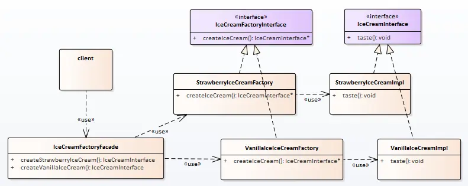
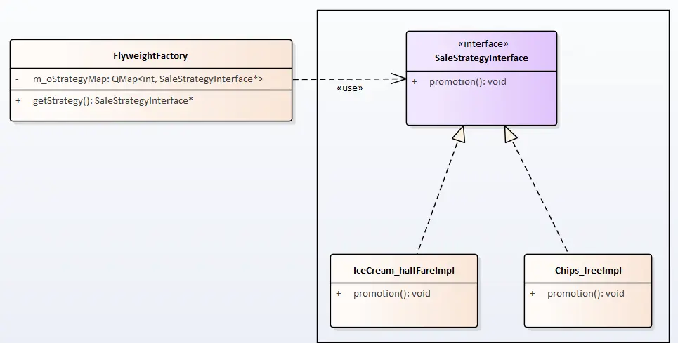
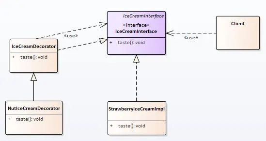
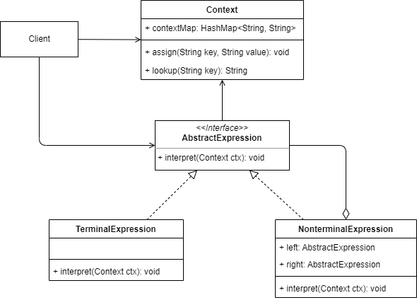
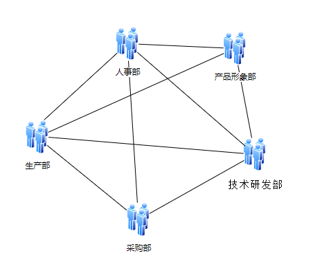
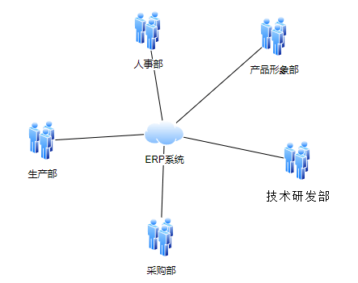
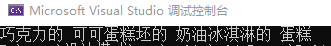

## 设计模式总览

在1994年，由Erich Gamma、Richard Helm、Ralph Johnson 和 John Vlissides 四人合著出版了一本名为 **Design Patterns - Elements of Reusable Object-Oriented Software**的书，这里就是设计模式的起源。

四位作者合成GOF（四人帮，Gang of Four），他们提出的设计模式主要基于面向对象设计原则。

> 对接口编程而不是对实现编程。
>
> 优先使用对象组合而不是继承。

总结来说设计模式是前人总结的经验，用于解决开发过程中常见问题的解决公式。

### 7大基本原则

1. **开闭原则（OCP，Open Close Principle）**

   > 对扩展开放，对修改关闭。
   >
   > 在程序需要进行拓展的时候，不能去修改原有的代码，而是实现一个热插拔的效果。简言之，是为了使程序的扩展性好，易于维护和升级。想要达到这样的效果，我们需要使用**接口和抽象类**。

2. **单一职责原则（SRP，Single Responsibility Principle）**

   > 就一个类而言,应该仅有一个引起它变化的原因；
   >
   > 控制类的粒度、将对象解耦、提高内聚性；注重职责，主要约束类（实现和细节）；

3. **里氏替换原则（LSP，Liskov Substitution Principle）**

   > 任何基类可以出现的地方，子类一定可以出现。
   >
   > 阐述继承复用的原则；开闭原则实现方式；子类继承父类时，尽量不要重写父类方法；（不要破坏继承关系）

4. **依赖倒置原则（DIP，Dependence Inversion Principle）**

   > 接口不应依赖于实现，实现应该依赖于接口。
   >
   > 原则是开闭原则的基础，具体内容：针对接口编程，依赖于抽象而不依赖于具体。

5. **接口隔离原则（ISP，Interface Segregation Principle）**

   > 从子类实现角度，一个子类实现只需要实现那些他需要的接口。
   >
   > 所以我们需要对接口进行分组，这样可以降低类之间的耦合度。

6. **迪米特法则（LoD， Law of Demeter）**

   > 一个实体应当尽量少地与其他实体之间发生相互作用，使得系统功能模块相对独立。

7. **合成复用原则（CRP，Composite Reuse Principle）**

   > 尽量使用合成/聚合的方式，而不是使用继承。

### 设计模型分类

**创建型**：描述对象如何创建，是为了将对象的创建与使用分离。

包括6种：单例、原型、简单工厂、工厂方法、抽象工厂、建造者。

**结构型**：描述类或对象如何组织成更大结构

包括7种：代理、适配器、桥接、装饰、外观、享元、组合。

**行为型**：描述类或对象之间如何协作完成任务

包括11种：模板方法、策略、命令、职责链、状态、观察者、中介者、迭代器、访问者、备忘录、解释器。

共24中设计模式，也由把简单工厂摘出来，为23中设计模式。

### 图解设计模式关系


### 语言选择

作者为C++开发，所以暂定语言为C++。

在进入正题之前，需要先了解两个概念：接口和抽象类。

**定义:**

抽象类：用来捕捉子类的通用特性的，不能被实例化，只能被用作子类的超类，是被用来创建继承层级里子类的模板；

接口：抽象方法的集合，只是一种形式，接口自身不能做任何事情。

**实现：**

C++语言中没有为这两个概念提供直接的关键字。但从实现的角度我们却更容易的知道他们的区别。

抽象类：存在纯虚函数的类。

接口：只存在纯虚函数的类。

C++的override关键字为**virtual**；一个函数使用了**virtual**代表可以被子类重写，但同时它也应该被实现；这样的函数称为**虚函数**。

在**虚函数**的末尾使用 **‘=0’**，这个函数就变成的**纯虚函数**，这时它就不能被实现，只能被子类重写。

## 简单工厂

选择简单工厂作为第一个篇，因为它几乎是最简单的设计模式。

这里想一想我们的冰淇淋贩卖机器，客户不需要知道冰淇淋怎么生成，客户只需要按下对应的按钮即可得到他们想要的产品。


代码如何实现？

### 场景分析

这里不需要实现所有的选项。

简化一下：啃得鸡推出冰淇淋产品，共两款。草莓冰淇淋（产品编号1）和香草冰淇淋（产品编号1），要卖给用户；

简单工厂就可以实现贩卖机的功能。

### 实现思路

实现类图为：


用户不用知道冰淇淋的生产过程；

用户只需要知道：

1. 要的是冰淇淋 （接口）
2. 冰淇淋的贩卖机在哪 （工厂）
3. 冰淇淋的产品列表 （一般会抽象为枚举类型)

### 代码实现

**冰淇淋接口和它的实现**

```cpp
// 冰淇淋接口
class IceCreamInfterface
{
public:
    virtual ~IceCreamInfterface() {}
    virtual void taste() = 0;
};

// 草莓冰淇淋
class StrawberryIceCreamImpl : public IceCreamInfterface
{
public:
    virtual void taste() override
    {
        qDebug() << QStringLiteral("草莓冰淇淋的味道！");
    }
};

// 香草冰淇淋
class VanillaIceCreamImpl : public IceCreamInfterface
{
public:
    virtual void taste() override
    {
        qDebug() << QStringLiteral("香草冰淇淋的味道！");
    }
};
```

**冰淇淋工厂和产品列表**

```cpp
// 冰淇淋工厂
class IceCreamFactory
{
public:
    // 产品列表
    enum ProductList
    {
        StrawberryIceCream,
        VanillaIceCream
    };

public:
    static IceCreamInfterface  createIceCream(ProductList productId)
    {
        IceCreamInfterface *pProduct = nullptr;
        switch (productId)
        {
        case StrawberryIceCream:
            pProduct = new StrawberryIceCreamImpl();
            break;
        case VanillaIceCream:
            pProduct = new VanillaIceCreamImpl();
            break;
        default:
            break;
        }
        return pProduct;
    }
};
```

**客户**

```cpp
int main(int argc, char *argv[])
{
    // 买个草莓味的冰淇淋
    IceCreamInfterface *pIceCream1 =
            IceCreamFactory::createIceCream(IceCreamFactory::StrawberryIceCream);
    pIceCream1->taste();

    // 买个香草味的冰淇淋
    IceCreamInfterface *pIceCream2 =
            IceCreamFactory::createIceCream(IceCreamFactory::VanillaIceCream);
    pIceCream2->taste();

    delete pIceCream1;
    delete pIceCream2;
}
```

### 使用感悟

简单工厂作为创建型设计模式，主要作用也是将对象的创建与使用分离。

#### 简单工厂的特点：

```
1. 产品是有限的、已知的。
2. 工厂类可以直用静态方法，所以可隐藏构造函数（构造函数私有化）
3. 创建方法理论上只依赖产品列表，所以可以创建各种实例，不限于只一类。（这是一个危险的实现）
```

#### 简单工厂的问题

1、添加新产品需要修改已经完成的工厂方法。

2、客户需要知道产品列表和功能直接的关系，增加复杂度。


### 代码路径

https://github.com/su-dd/learning/tree/main/src/design_pattern/SimpleFactory

## 工厂模式

经过大家的努力，啃得鸡的草莓冰淇淋和香草冰淇淋销量不错。

准备继续贩售新的冰淇淋产品，发现每次生产新产品时，都要对之前的工厂（简单工厂）进行改造。

啃得鸡害怕会影响产品品质，希望设计一个发布新产品不会影响原产品生产的工厂。


代码如何实现？


### 场景分析

让我们再想一想冰淇淋工厂的流水线吧；如何再不影响一个流水线的情况下，再多出一种产品嗯？

**造一条新的流水线去生产新产品！**

程序就是好，造流水线没那么花钱。


### 实现思路

实现类图：


这时我们发现如果需要我们有了一个新冰淇淋（产品），那么我们就安排一个新的生产线（工厂）。再也不会影响原了的冰淇淋生产情况了。

### 实现代码

**冰淇淋：**

```cpp
// 冰淇淋接口
class IceCreamInterface
{
public:
    virtual ~IceCreamInterface() {}
    virtual void taste() = 0;
};

// 草莓冰淇淋
class StrawberryIceCreamImpl : public IceCreamInterface
{
public:
    virtual void taste() override
    {
        qDebug() << QStringLiteral("草莓冰淇淋的味道！");
    }
};

// 香草冰淇淋
class VanillaIceCreamImpl : public IceCreamInterface
{
public:
    virtual void taste() override
    {
        qDebug() << QStringLiteral("香草冰淇淋的味道！");
    }
};
```


**冰淇淋工厂：**

```cpp
// 冰淇淋工厂接口
class IceCreamFactoryInterface
{
public:
    virtual ~IceCreamFactoryInterface() {}
    virtual IceCreamInterface * createIceCream() = 0;
};
// 草莓冰淇淋工厂
class StrawberryIceCreamFactory : public IceCreamFactoryInterface
{
public:
    StrawberryIceCreamFactory() {}
    IceCreamInterface * createIceCream()
    {
        return new StrawberryIceCreamImpl();
    }
};
// 香草冰淇淋工厂
class VanillaIceCreamFactory : public IceCreamFactoryInterface
{
public:
    VanillaIceCreamFactory() {}
    IceCreamInterface * createIceCream()
    {
        return new VanillaIceCreamImpl();
    }
};
```


**客户端：**

```cpp
int main(int argc, char *argv[])
{
    IceCreamFactoryInterface* pStrawberryIceCreamFactory =
            new StrawberryIceCreamFactory();

    IceCreamFactoryInterface* pVanillaIceCreamFactory =
            new VanillaIceCreamFactory();

    IceCreamInterface* pStrawberryIceCream = pStrawberryIceCreamFactory->createIceCream();
    IceCreamInterface* pVanillaIceCream = pVanillaIceCreamFactory->createIceCream();

    pStrawberryIceCream->taste();
    pVanillaIceCream->taste();

    delete pStrawberryIceCreamFactory;
    delete pVanillaIceCreamFactory;
    delete pStrawberryIceCream;
    delete pVanillaIceCream;
}
```


### 使用感悟

这里我们解决了简单工厂存在的问题，符合开闭原则的增加产品生产；

但是我们同时引入了新的问题，客户端使用起来很麻烦，对应到现实就是本来一个客户去一个工厂能满足所有的需求，现在客户想要同时买到两种冰淇淋就需要跑两个场；

所有现在我们需一个超市，或者小卖部？

**特点/优点：**

1、工厂类可以不实例化，使用静态工厂类。

2、延时创建，使用类再不确定是否要创建产品时，可以通过拿着产品的工厂方法。再需要时再创建。 实现延时创建。

**问题：**

1、随着产品的增加，工厂也不断的增加，可能造成对象的爆发。

2、客户需要关注每个工厂的不同才能获得想要的产品，可能增加维护成本。

**思考：**

什么是产品，什么是工厂？

由于产品和工厂两个名称的迷惑性，我们可能会下意识的把他们对应到某个实体的映射。（这当然是初学时最快的理解方式）

但产品和工厂的概念中，产品指的是类；类可以是事物，关系等的抽象。


### 代码路径

https://github.com/su-dd/learning/tree/main/src/design_pattern/FactoryMethod

## 外观模式

经过上篇的基建，发现：产品的质量已经可控，但是客户太费鞋（毕竟跑一家工厂买一个产品，鞋累啊）。

如何让用户不那么费鞋嗯？

供货的问题解决后，下面解决的就是经销的问题，一家可以卖各种商品的小卖部是很有必要的。


### 场景分析

小卖部的特性是什么嗯？

小卖部的特性是将所有的功能放到统一位置，以便客户使用。

### 实现思路

实现类图:



### 实现代码

**外观/面板：**

```cpp
class  IceCreamFactoryFacade
{
public:
    IceCreamFactoryFacade()
        : m_pStrawberryIceCreamFactory(new StrawberryIceCreamFactory())
        , m_pVanillaIceCreamFactory(new VanillaIceCreamFactory()) {}

    ~IceCreamFactoryFacade()
    {
        delete m_pStrawberryIceCreamFactory;
        m_pStrawberryIceCreamFactory = nullptr;
        delete m_pVanillaIceCreamFactory;
        m_pVanillaIceCreamFactory = nullptr;
    }

public:
    IceCreamInterface *createStrawberryIceCream()
    {
        return m_pStrawberryIceCreamFactory->createIceCream();
    }

    IceCreamInterface *createVanillaIceCream()
    {
        return m_pVanillaIceCreamFactory->createIceCream();
    }

private:
    IceCreamFactoryInterface *m_pStrawberryIceCreamFactory;
    IceCreamFactoryInterface *m_pVanillaIceCreamFactory;
};
```


**客户端：**

```cpp
#include "IceCreamInterface.h"
#include "IceCreamFactoryFacade.hpp"

int main(int argc, char *argv[])
{
    IceCreamFactoryFacade oIceCreamFactoryFacade;
    IceCreamInterface* pStrawberryIceCream = oIceCreamFactoryFacade.createStrawberryIceCream();
    IceCreamInterface* pVanillaIceCream = oIceCreamFactoryFacade.createVanillaIceCream();

    pStrawberryIceCream->taste();
    pVanillaIceCream->taste();

    delete pStrawberryIceCream;
    delete pVanillaIceCream;
    return 0;
}
```


### 使用感悟

在外观模式的帮助下，现在解决了工厂模式带来的使用不便的问题。

**对比外观+工厂和简单工厂模式，我们发现：**

相同：

1、对使用者隐藏了实现细节

2、提供良好的使用界面

不同：

外观+工厂对新扩展依然有比较好的包容性，但简单工厂相对差一些。

相对的，简单工厂的类实现比较简单，维护更简单。

**对应外观模式自身：**

外观模式通过提供统一的面板，隐藏了子系统、子模块的具体实现。系统的**封装性和易用性得到提升**，可以阻止新人对不熟悉模块的错误使用。

同时增加新的接口也需要修改面板，相对而言面板本身容易被影响，**扩展性下降**。


### 代码位置

https://github.com/su-dd/learning/tree/main/src/design_pattern/Facade

## 单例模式

上篇了解了外观模式，解决了客户端找不到需要访问的功能的困扰。

小卖部是挺好，但是啃得鸡就不干了；我研发的产品，你去卖？ 那我怎么管理服务的标准化（统一提价）。


### 场景分析

小卖部虽好，但如果只有我能开，那就更好了！

单例模式的思路比较简单，就是要求程序运行范围内只有一个对象。

为了这个目的，在不同情况下，需要使用不同的技术来辅助。

### 实现思路

类图：


### 实现代码

单例分为饿汉单例和懒汉单例，下面分别介绍。

#### 饿汉单例

相对来说，饿汉单例更好理解一些。单例的目的是为了保证只有一个对象。所以使用了静态对象进行处理。

同时将类的构造函数，copy构造，赋值构造进行私有化。

这时一个进程中将有且只有一个单例类的对象。

```cpp
#include "IceCreamFactoryFacadeInterface.h"
#include "StrawberryIceCreamFactory.hpp"
#include "VanillaIceCreamFactory.hpp"

class EagerSingletonFactoryFacade : public IceCreamFactoryFacadeInterface
{
private:
    static EagerSingletonFactoryFacade m_oInstance;
private:
    EagerSingletonFactoryFacade()
        : m_pStrawberryIceCreamFactory(new StrawberryIceCreamFactory())
        , m_pVanillaIceCreamFactory(new VanillaIceCreamFactory()) {}

    EagerSingletonFactoryFacade(EagerSingletonFactoryFacade const&);
    EagerSingletonFactoryFacade& operator=(EagerSingletonFactoryFacade const&);

public:
    virtual ~EagerSingletonFactoryFacade() {}

    static IceCreamFactoryFacadeInterface *getInstance()
    {
        return &m_oInstance;
    }

public:
    IceCreamInterface *createStrawberryIceCream() override
    {
        return m_pStrawberryIceCreamFactory->createIceCream();
    }

    IceCreamInterface *createVanillaIceCream() override
    {
        return m_pVanillaIceCreamFactory->createIceCream();
    }
private:
    IceCreamFactoryInterface *m_pStrawberryIceCreamFactory;
    IceCreamFactoryInterface *m_pVanillaIceCreamFactory;
};

// 初始化静态变量
EagerSingletonFactoryFacade EagerSingletonFactoryFacade::m_oInstance;
```


#### 懒汉单例

懒汉单例不同于只处在于，在使用时它才会加载。有懒加载的效果。

主要使用判空方式确保对象只生成一次。

Ps：实例中使用静态的方式存储指针对象，只是为了方便，这并不是规范。

```cpp
#include "IceCreamFactoryFacadeInterface.h"
#include "StrawberryIceCreamFactory.hpp"
#include "VanillaIceCreamFactory.hpp"
#include <QMutex>
#include <QMutexLocker>

class LazySingletonFactoryFacade : public IceCreamFactoryFacadeInterface
{
private:
    static IceCreamFactoryFacadeInterface *m_pInstance;
    static QMutex s_oMutex;
private:
    LazySingletonFactoryFacade()
        : m_pStrawberryIceCreamFactory(new StrawberryIceCreamFactory())
        , m_pVanillaIceCreamFactory(new VanillaIceCreamFactory()) {}
public:
    virtual ~LazySingletonFactoryFacade() {}

    static void freeInstancel()
    {
        if (nullptr != m_pInstance)
        {
            delete m_pInstance;
            m_pInstance = nullptr;
        }
    }

    // 对于单线程
    // 如果当前判断为单进程，我们中需要做简单的判空处理即可
    static IceCreamFactoryFacadeInterface *getInstance_1()
    {
        if (nullptr == m_pInstance)
        {
            m_pInstance = new LazySingletonFactoryFacade();
        }
        return m_pInstance;
    }

    // 对于多线程
    // 对于多线程程序，只做判空不能做到单例的效果，需要加锁
    // 这是最简单的加锁方式，通常不使用，应为效率不够高
    static IceCreamFactoryFacadeInterface *getInstance_2()
    {
        QMutexLocker oLocker(&s_oMutex);
        if (nullptr == m_pInstance)
        {
            m_pInstance = new LazySingletonFactoryFacade();
        }
        return m_pInstance;
    }

    // 对于多线程 - 双重判空
    // 对于多线程，同时使用双重判空的方式处理，以提高效率
    static IceCreamFactoryFacadeInterface *getInstance_3()
    {
        if (nullptr == m_pInstance)
        {
            QMutexLocker oLocker(&s_oMutex);
            if (nullptr == m_pInstance)
            {
                m_pInstance = new LazySingletonFactoryFacade();
            }
        }
        return m_pInstance;
    }

public:
    IceCreamInterface *createStrawberryIceCream() override
    {
        return m_pStrawberryIceCreamFactory->createIceCream();
    }

    IceCreamInterface *createVanillaIceCream() override
    {
        return m_pVanillaIceCreamFactory->createIceCream();
    }
private:
    IceCreamFactoryInterface *m_pStrawberryIceCreamFactory;
    IceCreamFactoryInterface *m_pVanillaIceCreamFactory;
};

// 初始化静态变量
IceCreamFactoryFacadeInterface * LazySingletonFactoryFacade::m_pInstance = nullptr;
QMutex LazySingletonFactoryFacade::s_oMutex(QMutex::Recursive);
```


### 使用感悟

| 种类     | 实现                                | 优点                                                    | 缺点                                                         |
| -------- | ----------------------------------- | ------------------------------------------------------- | ------------------------------------------------------------ |
| 饿汉单例 | 1、使用静态区对象，确保只有一份实例 | 1、多线程，单线程可以用统一的方式处理 2、无加锁，效率高 | 1、程序运行时需要加载暂时无用的内存，可能影响效率 2、静态对象的初始化由系统决定，如果初始化依赖静态对象，可能导致异常。 |
| 懒汉单例 | 1、通过判空的方法，确保只有一份实例 | 1、程序运行时不用加载多余的数据                         | 1、第一次加载可能不够快 2、代码相对复杂                      |


### 代码位置

https://github.com/su-dd/learning/tree/main/src/design_pattern/Singleton

## 原型模式

啃得鸡冰淇淋卖的太好了，别的商家希望也能卖冰淇淋；但是不想自己设计调参。于是clone或者说copy就是一个方案了？


### 场景分析

客户端可以再不用知道对象的具体实现的情况下，新建一个新的对象。那就是客户端只知道接口定义，也就是说是通过接口访问的。

原型模式指通过【现有对象】 是生成一个新对象，而不需要知道他们所属的类。

### 实现思路


类图的设计也可以提一个单独的Prototype接口作为所有类的父类，客户端其实需要的是具有业务意义的类。

### 实现代码

接口：

```cpp
// 冰淇淋接口
class IceCreamInterface
{
public:
    virtual ~IceCreamInterface() {}
    virtual void taste() = 0;
    virtual IceCreamInterface *clone() = 0;
};
```


实现：

```cpp
// 草莓冰淇淋
class StrawberryIceCreamImpl : public IceCreamInterface
{
public:
    virtual void taste() override
    {
        qDebug() << QStringLiteral("草莓冰淇淋的味道！");
    }

    IceCreamInterface *clone()
    {
        return new StrawberryIceCreamImpl();
    }
};
```


### 使用感悟

原型模式的本质是通过深copy的方式生成对象，不用受构造函数的约束（可不用引入具体头文件）。

优点 / 使用场景：

1. 性能优化的场景中，当一共从头建造是需要消耗大量资源（如需要大量的IO操作，权限申请等）
2. 安全要求场景中，不向外暴露头文件，再一些情况下比较安全。

组合使用方式： 可以和工厂模式结合使用，作为工厂模式创建

缺点： 对于类中含有容器对象【如组合模式】不够友好

对类中对象由外部传递时，不够友好

### 代码位置

https://github.com/su-dd/learning/tree/main/src/design_pattern/Prototype


## 抽象工厂

啃得鸡自从产品被抄袭，就很紧张；经过市场部讨论后，希望通过套餐的方式去打动用户。

套餐：（冰淇淋 + 薯条）

现再的问题是套餐产品怎么搞嗯？


### 场景分析

不同于我们之前生产的产品，套餐类产品都是由不同的部分去构成，同一部分再不同套餐中不尽相同；不能在一个工厂内生产所有套餐产品。

所以我们需要多个工厂

抽象工厂是生成一系列对象的方法。

### 实现思路


抽象工厂对比工厂模式，发现工厂是抽象工厂的特例。当抽象工厂的产品只有一种时，就是工厂模式。

### 实现代码

产品1：冰淇淋

```cpp
// 冰淇淋接口
class IceCreamInterface
{
public:
    virtual ~IceCreamInterface() {}
    virtual void taste() = 0;
};

// 香草冰淇淋
class VanillaIceCreamImpl : public IceCreamInterface
{
public:
    virtual void taste() override
    {
        qDebug() << QStringLiteral("香草冰淇淋的味道！");
    }
};

// 草莓冰淇淋
class StrawberryIceCreamImpl : public IceCreamInterface
{
public:
    virtual void taste() override
    {
        qDebug() << QStringLiteral("草莓冰淇淋的味道！");
    }
};
```


产品2：薯条

```cpp
class ChipsInterface
{
public:
    virtual ~ChipsInterface() {}
    virtual void size() = 0;
};

class BigChipsImpl : public ChipsInterface
{
public:
    virtual void size()
    {
        qDebug() << "这个大份的薯条！";
    }
};

class LittleChipsImpl : public ChipsInterface
{
public:
    virtual void size()
    {
        qDebug() << "这个小份的薯条！";
    }
};
```


FactoryProducer:

```cpp
class FactoryProducer
{
public:
    enum Set
    {
        Set1,
        Set2
    };

public:
    FactoryInterface * createSet(Set setNum)
    {
        switch (setNum) {
        case Set1:
            return new Set1FactoryImpl();
        case Set2:
            return new Set2FactoryImpl();
        default:
            return nullptr;
        }
    }
};
```


### 使用感悟

抽象工厂其实并不是一个复杂概念，其实抽象工厂就是工厂模式的一般现象，工厂模式就是抽象工厂的个例。

抽象工厂想要新增一个套餐是简单的，但是想要在套餐中新增一个项就比较不友好。

抽象工厂适用于整套的替换场景中。


### 代码位置

https://github.com/su-dd/learning/tree/main/src/design_pattern/AbstractFactory

## 模板方法

啃得鸡自从通过抽象工厂解决套餐模式后，流量大增；但暂时盈利达到了上限。于是希望节流，发现工厂流程很多重复项，希望可以通过统一生产流程来做到成本优化。


### 场景分析

简化场景，只生产冰淇淋甜筒。我们发现冰淇淋甜筒就是薄饼筒和冰淇淋球的组合。不同口味的冰淇淋，薄饼筒是不变的，换不同的冰淇淋球。

模板方法是一个你在下意识的情况下就会使用的方法。

模板方法的核心思想就是将流程中的细节（变化的地方）；下放到子类中解决。

### 实现思路


### 实现代码

模板方法：

```cpp
class FactoryTemplate
{
public:
    virtual ~FactoryTemplate() {}
    IceCream createIceCream()
    {
        IceCream oIceCream;
        createCone(oIceCream);
        createIceBall(oIceCream);
        return oIceCream;
    }

protected:
    void createCone(IceCream &iceCream)
    {
        iceCream.setCone();
    }

    virtual void createIceBall(IceCream &iceCream) = 0;
};
```


子类：

```cpp
class StrawberryFactory : public FactoryTemplate
{
public:
    virtual ~StrawberryFactory() {}
protected:
    virtual void createIceBall(IceCream &iceCream)
    {
        iceCream.setIceBall(QStringLiteral("草莓"));
    }
};

class VanillaFactory : public FactoryTemplate
{
public:
    virtual ~VanillaFactory() {}
protected:
    virtual void createIceBall(IceCream &iceCream)
    {
        iceCream.setIceBall(QStringLiteral("香草"));
    }
};
```


### 使用感悟

模板方法的基本思路：

基于继承的情况上，封装不变的部分，扩展可变的部分。

优点：1、更好的代码复用性；2、父类封装控制，子类实现细节；实现更可控

缺点：1、类的增加，导致实现更复杂


### 代码位置

https://github.com/su-dd/learning/tree/main/src/design_pattern/Template

## 策略方法

啃得鸡的节流策略很成功，但是节流是有上限的。内卷完了，还是要想想怎么开源。

于是相到通过促销的方式培养用户习惯。

现在有两个促销：

1. 一、三、五 薯条免费
2. 二、四、六 冰淇淋半价


### 场景分析

现在我们有两个需要做的策略，需要随着时间的变化，去执行不同的策略。

执行策略的主体的不变的，行为是变化的。

策略模式是对算法的封装，将一组算法和算法作用的数据分开，使算法可以独立变化。

通过抽提共有接口，每个算法单独封装，算法之间可以相互替换。

### 实现思路


### 实现代码

接口：

```cpp
class SaleStrategyInterface
{
public:
    virtual ~SaleStrategyInterface() {}
    virtual void promotion() = 0;
};
```


实现：

```cpp
class IceCream_halfFareImpl : public SaleStrategyInterface
{
public:
    virtual void promotion() override
    {
        qDebug() << QStringLiteral("冰淇淋半价！");
    }
};

class Chips_freeImpl : public SaleStrategyInterface
{
public:
    virtual void promotion() override
    {
        qDebug() << QStringLiteral("薯条免费！");
    }
};
```


使用:

```cpp
class Shop
{
public:
    Shop():m_pStrategy(nullptr) {}
    ~Shop() {delete m_pStrategy;}
    void sell()
    {
        m_pStrategy->promotion();
    }

    void getStrategy(SaleStrategyInterface *strategy)
    {
        delete m_pStrategy;
        m_pStrategy = strategy;
    }

private:
    SaleStrategyInterface *m_pStrategy;
};
```


### 使用感悟

策略模式的本质是对算法的封装，使算法的使用者和算法本身可以自由变化。

优点：1、扩展性好；2、可以自由切换策略，对象复用性高

缺点：所有算法都需要暴露给客户段，维护成本变高

可以考虑结合简单工厂，对策略本身也进行一层封装；减少暴露。


### 代码位置

https://github.com/su-dd/learning/tree/main/src/design_pattern/Strategy


## 享元模式

啃得鸡通过促销的方式，已经做了一个爆款店铺。现在希望在其他99家点评也使用这样的促销策略。


### 场景分析

现在我们有100家店铺需要做促销，促销方案有2种。如果是每个店自己做自己的，就要200个策略对象。

这当然不是我们希望看到的！

我们希望只要建两个策略对象就可以了，100家店铺共用这两个策略对象。

享元模式又叫"蝇量模式"是一种通过减少创建对象的个数，来降低内存,提供效率的方式；是一种结构化的设计模式。


### 实现思路




### 实现代码

享元工厂

```cpp
class FlyweightFactory
{
public:
    enum StrategyType
    {
        IceCream_halfFare,
        Chips_free
    };
public:
    ~FlyweightFactory()
    {
        qDeleteAll(m_oStrategyMap.values());
    }

    SaleStrategyInterface* getStrategy(StrategyType type)
    {
        if (!m_oStrategyMap.contains(type))
        {
            switch (type)
            {
            case IceCream_halfFare:
                m_oStrategyMap.insert(type, new IceCream_halfFareImpl());
                break;
            case Chips_free:
                m_oStrategyMap.insert(type, new Chips_freeImpl());
                break;
            default:
                break;
            }
        }
        return m_oStrategyMap[type];
    }

private:
    QMap<int, SaleStrategyInterface*> m_oStrategyMap;
};
```


### 使用感悟

享元模式的目的是通过减少对象的创建，来达到减少内存，提供效率的目的；

它设计的重点在于HashMap是使用，我们需要为HashMap找到一个唯一的特征值。

HashMap一般放在享元工厂中管理。

**优点：**提高对象复用率，提高效率

适用场景：

1. 大量相似或相同对象。
2. 这些对象占用大量内存，或影响效率。
3. 不同对象对外部执行无影响


**进一步思考：**

我们之前的实例其实是每种享元对象都最少创建一个，当这些享元对象之间又存在大量相同的数据如何处理？

这时我们需要引入两个概念：

- **内蕴状态(Internal State)**：存储在享元对象内部且不会随环境改变而改变。因此内蕴状态并可以共享。
- **外蕴状态(External State)**：是随环境改变而改变的、不可以共享的状态。

为了解决这个问题，我们要为现有的对象抽去共性，即对内蕴状态归类，成为享元对象的基础（私有对象或基类数据）；

外蕴状态由客户端保存，并在享元对象被创建之后，在需要使用的时候再传入到享元对象内部。

需要保证：外蕴状态与内蕴状态是相互独立的。


**实现举例:**

通过【P指针】的方式，多个对象共用一段内存属性。

这段内存一般为只读属性（外部只提供只读接口，这样可以做多线程安全）。


### 代码路径

https://github.com/su-dd/learning/tree/main/src/design_pattern/Flyweight


## 装饰模式

想想一下，我现在如果想在冰淇淋里面加坚果、葡萄干怎么办？

### 场景分析

当然我们可以在多建几个工厂，穷举每一个类型。

但是也许你也发现了！

我们要的冰淇淋发生了变化，用户其实可以加更多的东西，或者随意搭配。

难道我们还能不断穷举？

即使我们可以，这种穷举也会随着添加种类，枚举的可能性不断增加，工作量是指数级增长的。


**装饰器模式是怎么解决这个问题的？**

装饰器其实是将每种变化封装为一种装饰，可以这直接附加到原对象上，产生一个新对象。用于解决问题。

如加两次装饰器的小明：【小明】 --到--> 【穿裤子的小明】 --到--> 【穿裤子的戴帽子的小明】

这样装饰器可以自由组合叠加。

装饰模式是给一个现有对象添加新功能，同时有不去改变其结构的方式。它可以动态的给对象增加新的功能。


### 实现思路

**类图**



### 实现代码

**基础类:**

```cpp
class StrawberryIceCreamImpl : public IceCreamInterface
{
public:
    virtual void taste() override
    {
        cout << "草莓味冰淇淋" << endl;
    }
};
```


**装饰者基类：**

```cpp
class IceCreamDecorator : public IceCreamInterface
{
public:
    IceCreamDecorator(IceCreamInterface *iceCream)
        : m_pIceCream(iceCream)
    {
    }
    virtual ~IceCreamDecorator()
    {
        delete m_pIceCream;
    }

    virtual void taste() override
    {
        if (m_pIceCream)
        {
            m_pIceCream->taste();
        }
    }

private:
    IceCreamInterface *m_pIceCream;
};
```


**装饰者：**

```cpp
class NutIceCreamDecorator : public IceCreamDecorator
{
public:
    NutIceCreamDecorator(IceCreamInterface *iceCream)
        : IceCreamDecorator(iceCream)
    {
    }

    virtual void taste() override
    {
        std::cout << "带坚果的";
        IceCreamDecorator::taste();
    }
};
```


**客户使用：**

```cpp
int main()
{
	StrawberryIceCreamImpl().taste();
	NutIceCreamDecorator(new StrawberryIceCreamImpl()).taste();
	return 0;
}
```


### 使用感悟

**使用场景：**

不想增加子类（或者需要增加子类的数量比较多）时，想扩展类能力。

**优点：**

装饰类和被装饰类可以独立发展，而不会相互耦合。

有效的分割核心职责和非核心职责

可动态地扩展一个实现类的功能（【套娃】使用），减少了类的数量

**注意点：**

装饰模式一般是构造函数中传入被装饰的对象。

装饰模式是的目的是为了给现有对象增强能力，但是不管怎么增强，不会改变对象的本质。（这点很重要，后面会在代理中做比较）

**缺点：**

多层包装的装饰类，出BUG，要一层一层查。如：游戏角色的装扮，如果一共20层装饰者，工作量大。


### 代码路径

https://github.com/su-dd/learning/tree/main/src/design_pattern/Decorator

## 代理模式

冰淇淋从工厂出来后，一般要经过超市、马路边的小推车等 ，经销代理后，再到达消费者手里；

那为什么要有这样经销代理嗯？

### 场景分析

这里对于消费者而言，目的就是从获得想要的冰淇淋，但是直接从工厂拿对用户而言不方便。所以有了超市。

超市还不能足够的接近客户，就有了马路边的小推车。

超市是为了消费者服务的，小推车也是为消费者服务的。 代理也是为客户服务的。

当希望使用，但无法直接使用，某个对象时；我们就可以考虑代理模式。


### 实现思路


### 实现代码

冰淇淋工厂：

```cpp
class IceCreamFactory : public IceCreamFactoryIntf
{
public:
	IceCreamFactory() {}
	virtual ~IceCreamFactory() {}

	virtual void getIceCream()
	{
		cout << "《冰淇淋》！" << endl;
	}
};
```


工厂代理：

```cpp
class IceCreamFactoryProxy : public IceCreamFactoryIntf
{
public:
	IceCreamFactoryProxy() {}
	virtual ~IceCreamFactoryProxy() {}

	virtual void getIceCream()
	{
		cout << "加价" << endl;
		m_oFactory.getIceCream();
	}

private:
	IceCreamFactory m_oFactory;
};
```


客户调用：

```cpp
int main()
{
	SetConsoleOutputCP(CP_UTF8);
	IceCreamFactoryIntf *p = new IceCreamFactoryProxy();
	p->getIceCream();

	delete p;
	return 0;
}
```


### 感悟

代理模式是一个自由度特别高的模式，也是一个不容易被辨识的模式。

现在去回想：装饰者模式，或者准备在下一章写的桥模式，我们会发现，里面的区别很微妙。

这里来比较装饰者模式 和 代理：

装饰者模式的注重点在于对已有对象的功能增强，特性上可以无限嵌套；

代理注重解决：客户和要使用的对象之间的复杂性，当我们规划了两个实体A和B后，发现A和B之间的调用关系复杂，或者存在业务上不属于A或者B的调用时。

我们就需要代理来处理这部分的复杂性，代理通过添加中间层的方式在A和B之间添加了一层新的扩展封装。

spring aop 是现在比较有名的代理模式实现。


### 代码位置

https://github.com/su-dd/learning/tree/main/src/design_pattern/Proxy


## 桥模式

小商贩多了，也就一味这销售的渠道拓宽了，人们接受了这种商品。 同时也意味着是用**原型**模式做copy的人多了。

这时为了不被虐币驱逐良币，啃得鸡决定：将工厂独立处理，加大产能，压缩价格，打价格战。

啃地鸡冰淇淋代工厂产生了！！！！

各品牌直接把自己的牌子放在啃地鸡，就能拿到自己的产品。问啃地鸡怎么生产？


### 场景分析

啃地鸡待工厂现在生产的冰淇淋有两个维度属性： 品牌，配方。

我们可以使用继承关系，但是随着 品牌，配方 不断的增加。子类的数量呈快速增加的状态。可能增加一个配方，就需要十多个子类，甚至更多 。

但是，如果采用品牌和配方拆开的生产方式，增加一个配方就是一个配方。

当类中存在多层继承时，如果我们发现基础是按两个不同维度展开时，就应该考虑**桥模式**。


### 实现思路

**类图：**


### 实现代码

品牌：

```cpp
// 接口：
class BrandIntf
{
public:
    virtual ~BrandIntf() {}
    virtual void logo() = 0;
};

// 实现
class ABrandImpl : public BrandIntf
{
public:
    void logo()
    {
        cout << "啃得鸡logo";
    }
};

class BBrandImpl : public BrandIntf
{
public:
    void logo()
    {
        cout << "啃得鸭logo";
    }
};
```


冰淇淋：

```cpp
// 接口
class IceCreamIntf
{
public:
    virtual ~IceCreamIntf() {}
    virtual void taste() = 0;
    virtual void setBrand(BrandIntf *brand) = 0;
};

// 实现

class IceCreamImpl
{
public:
    IceCreamImpl() : m_pBrand(nullptr) {}
    virtual ~IceCreamImpl()
    {
        delete m_pBrand;
    }

    virtual void taste()
    {
        m_pBrand->logo();
    }

    virtual void setBrand(BrandIntf *brand)
    {
        if (m_pBrand == brand)
            return;
        if (nullptr != m_pBrand)
            delete m_pBrand;
        m_pBrand = brand;
    }

private:
    BrandIntf *m_pBrand;
};

class StrawberryIceCreamImpl : public IceCreamImpl
{
public:
    virtual void taste()
    {
        IceCreamImpl::taste();
        cout << "草莓冰淇淋！" << endl;
    }
};
```


客户端：

```cpp
int main()
{
    SetConsoleOutputCP(CP_UTF8);
    StrawberryIceCreamImpl oIceCream1;
    oIceCream1.setBrand(new ABrandImpl());
    oIceCream1.taste();

    StrawberryIceCreamImpl oIceCream2;
    oIceCream2.setBrand(new BBrandImpl());
    oIceCream2.taste();

    return 0;
}
```


### 感悟

**优点：**

1、从两个维度拆分多重基础类，极大的减少了类个数。

2、两个维度可以独立变化，而不影响另一个维度。

**缺点：**

1、外在使用时会更复杂。

对比代理，装饰者，我们发现这三这外在使用时，有类似的使用方式。

**这样对注重点做对比：**

代理：增加不属于原对象的功能。

装饰者：对原有功能的增强，增强后还是原有功能。

桥模式：拆分两个维度，以简化原实现。


### 代码位置

https://github.com/su-dd/learning/tree/main/src/design_pattern/Bridge

## 适配器模式

在桥模式这篇中，啃得鸡优化了自己工厂生产模式；使用桥模型，使得冰淇淋口味和品牌（logo）相互独立变化。

现在小厂家有了一点问题，小厂家A只知道自己需要 草莓和香草两种冰淇淋。不希望知道啃得鸡可以帮助贴多少中品牌。

问题：小厂家如何更简单的获得自己的产品嗯？

### 场景分析

对小厂家A而言，只需要草莓和香草两种冰淇淋。

贴自己的logo是默认的，不需要时刻提醒的。

适配器是为了已经适配那些已经稳定的功能，不希望再发生变动的模块；或者我们并无能力改变的，由外部提供的功能。

典型的是对sdk的接入，当我们希望使用某个sdk的功能；但它又不是那么切合时，为了不将程序搞得一团乱麻。

我们通常会考虑使用适配器的方式。


### 实现思路

这里先看下：啃得鸡sdk


sdk最终通过facade的方式将创建的决定权移交给客户端，代码如下。

```cpp
#include "BrandImpl.hpp"
#include "BrandIntf.h"
#include "IceCreamIntf.h"
#include "IceCreamImpl.hpp"


enum Brand { A, B };
enum Taste { Strawberry, Vanilla };

class IceCreamFacade
{
public:
	IceCreamIntf* createIceCream(Taste taste, Brand brand)
	{
		IceCreamIntf* pIceCream = nullptr;
		switch (taste)
		{
		case Strawberry:
			pIceCream = new StrawberryIceCreamImpl();
			break;
		case Vanilla:
			pIceCream = new VanillaIceCreamImpl();
			break;
		default:
			pIceCream = new StrawberryIceCreamImpl();
		}

		switch (brand)
		{
		case A:
			pIceCream->setBrand(new ABrandImpl());
			break;
		case B:
			pIceCream->setBrand(new BBrandImpl());
			break;
		default:			   
			break;
		}
		return pIceCream;
	}

};
```

对于品牌方A而已，只希望选择口味；不希望在每个生产环境都选择一下自己是A。

这里是使用适配器的方式，隔离A不希望知道的信息。一般有两种方式：类适配器，对象适配器


#### 类适配器

通过继承的方式，重写父类函数；以此为client提供更合适的接口。



```cpp
#include "sdk/IceCreamFacade.hpp"

class IceCreamFacadeClassAdapter : public IceCreamFacade
{
public:
	IceCreamIntf* createIceCream(Taste taste)
	{
		return IceCreamFacade::createIceCream(taste, Brand::A);
	}
};
```


#### 对象适配器

通过对象使用的方式，将需要实际的业务执行对象进行包装。以此为client提供更合适的接口。


```cpp
class IceCreamFacadeObjectAdapter
{
public:
	IceCreamFacadeObjectAdapter()
		: m_pIceCreamFacade(new IceCreamFacade())
	{

	}
	virtual ~IceCreamFacadeObjectAdapter()
	{
		delete m_pIceCreamFacade;
		m_pIceCreamFacade = nullptr;
	}

public:
	IceCreamIntf* createIceCream(Taste taste)
	{
		return m_pIceCreamFacade->createIceCream(taste, Brand::A);
	}

private:
	IceCreamFacade* m_pIceCreamFacade;
};
```


### 感悟

1、从上述的可知适配器的本质是为了去处理由于某种原因，不能被修改代码的部分。如果我们可以修改目标代码，不建议使用适配器。

2、上述场景为单向调用场景；在实际的场景中还有很多是两个模块相互使用。同时，他们又是不可以被改动的情况。这时我们需要使用双向适配器。这时主要使用**类适配器**。

**双向适配器：**


### 代码

https://github.com/su-dd/learning/tree/main/src/design_pattern/Adapter

## 迭代器模式

随着消费观的变化，冰淇淋的无人销售变得很有吸引力。

现在有一个问题：无人贩卖机怎么实现按顺序依次卖完某种冰淇淋，并在卖完后告知用户？


### 场景分析

这里简化一下规则，假设贩卖机只贩卖一种冰淇淋。

贩卖机的规则：

1、依次售卖，向用户提供冰淇淋。

2、不能直接让用户打开去拿冰淇淋。

3、当冰淇淋销售完，显示无货。

这里，迭代器就比较合适。


### 实现思路


#### Aggregate

Aggregate接口：

```cpp
template<class Item>
class Aggregate
{
public:
	Aggregate() {}
	virtual ~Aggregate() {}
	virtual void pushData(Item item) {}
	virtual Iterator<Item>* createIterator() { return nullptr; }
	virtual Item* operator[](int index) { return nullptr; }
	virtual int getSize() { return 0; }
};
```


Aggregate接口实现：

```cpp
#include "Aggregate.h"
#include <vector>
#include "ConcreteIterator.h"

template <class Item>
class ConcreteAggregate : public Aggregate<Item>
{
public:
    ConcreteAggregate() {};
    virtual ~ConcreteAggregate() {};

    virtual void pushData(Item item) override;
    virtual Iterator<Item>* createIterator() override;
    virtual Item* operator[](int index);
    virtual int getSize() override;
private:
    std::vector<Item> data;
};

template <class Item>
void ConcreteAggregate<Item>::pushData(Item item)
{
    data.push_back(item);
}

template <class Item>
Iterator<Item>* ConcreteAggregate<Item>::createIterator()
{
    return new ConcreteIterator<Item>(this);
}

template <class Item>
Item* ConcreteAggregate<Item>::operator[](int index)
{
    return &data.at(index);
}

template <class Item>
int ConcreteAggregate<Item>::getSize()
{
    return data.size();
}
```


#### Iterator

Iterator接口：

```cpp
#include "Aggregate.h"
template<class Item>
class Iterator
{
public:
	Iterator() {}
	virtual ~Iterator() {}
	virtual void first() {}
	virtual void next() {}
	virtual Item* curItem() { return nullptr;  }
	virtual bool hasNext() { return false; }
};
```


Iterator接口实现：

```cpp
#include "Iterator.h"
#include "Aggregate.h"

template<class Item>
class ConcreteIterator : public Iterator<Item>
{
public:
	ConcreteIterator(Aggregate<Item> *a) : aggr(a), cur(0) {}
	virtual ~ConcreteIterator(){}

	virtual void first() override;
    virtual void next() override;
    virtual Item* curItem() override;
    virtual bool hasNext() override;
private:
	Aggregate<Item>* aggr;
	int cur;
};

template<class Item>
void ConcreteIterator<Item>::first()
{
    cur = 0;
}

template<class Item>
void ConcreteIterator<Item>::next()
{
    if (cur < aggr->getSize())
        cur++;
}

template<class Item>
Item* ConcreteIterator<Item>::curItem()
{
    if (cur < aggr->getSize())
    {
        return (*aggr)[cur];
    }
    else
    {
        return nullptr;
    }
}

template<class Item>
bool ConcreteIterator<Item>::hasNext()
{
    return cur >= aggr->getSize();
}
```


#### main函数

```cpp
int main(int argc, char* argv[])
{
    Aggregate<std::string>* aggr = new ConcreteAggregate<std::string>();
    aggr->pushData("草莓冰淇淋1");
    aggr->pushData("草莓冰淇淋2");
    aggr->pushData("香草冰淇淋2");
    Iterator<std::string>* it = aggr->createIterator();

    for (it->first(); !it->hasNext(); it->next())
    {
        std::cout << *it->curItem() << std::endl;
    }
    delete it;
    delete aggr;
    return 0;
}
```


### 感悟

迭代器模式又叫游标模式是一种常见模式，行为型设计模式的一种。几乎每种语言，会实现自己的迭代器。

在代码编程中，常常需要聚合对象来存放一组数据；

迭代器可以依次访问聚合对象内部的各个元素，同时又不暴露聚合对象的内部表示；

一般做业务开发时，并不需要实现迭代器模式；如果需要做公共组件，基础组件时，封装迭代器可能会被使用。


### 代码位置

https://github.com/su-dd/learning/tree/main/src/design_pattern/Iterator


## 备忘录模式

前面通过自动贩卖机（迭代器模式），冰淇淋的销售问题变得很好。
于是啃得鸡研发了一条自动化冰淇淋生成线，可以生成多种口味，多种配方的冰淇淋。
每种冰淇淋的销量，目前是不确定的。为了减少不必要的浪费，希望可以根据市场变动，动态调整冰淇淋是生产。

### 场景分析

一条生成线可以完成所有产品的生产的同时，也意味着产品线的复杂。

这里的冰淇淋生产线是自动化的，为电脑控制；

解决思路为：将各种产品的生产参数进行备份、存档。

当需要的时候就可以一键使用。


### 实现思路

**类图**


Originator（原发器）：，可以生成自身状态的快照， 也可以在需要时通过快照恢复自身状态
Memento（备忘录）： 原发器状态快照的值对象 （value object）。 通常做法是将备忘录设为不可变的， 并通过构造函数一次性传递数据。
Caretaker（负责人）： 仅知道 “何时” 和 “为何” 捕捉原发器的状态， 以及何时恢复状态。

### 实现代码

**IceFactoryOriginator:** 备忘录使用类

```cpp
class IceFactoryOriginator
{
public:
	IceFactoryOriginator()
		: m_sflavour("")
		, m_sDryFruit("") {}

	void setFlavour(string flavour)
	{
		this->m_sflavour = flavour; 
	}

	void setDryFruit(string dryFruit) 
	{
		this->m_sDryFruit = dryFruit; 
	}

	IceCream* createCream()
	{
		IceCream *pIceCream = new IceCream(m_sflavour, m_sDryFruit);
		return pIceCream;
	}

	Memento* createMemento()
	{
		return new Memento(m_sflavour, m_sDryFruit);
	}

	void restoreMemento(Memento* memento) 
	{
		m_sflavour = memento->getFlavour();
		m_sDryFruit = memento->getDryFruit();
	}
private:
	string m_sflavour;
	string m_sDryFruit;
};
```


**Memento:** 备忘录

```cpp
class Memento
{
public:
	Memento(string flavour, string dryFruit)
		: m_sflavour(flavour)
		, m_sDryFruit(dryFruit) {}
	string getFlavour() { return m_sflavour; }
	string getDryFruit() { return m_sDryFruit; }
private:
	string m_sflavour;
	string m_sDryFruit;
};
```


**CareTaker:** 备忘录管理类

```cpp
class CareTaker
{
public:
	CareTaker() {}
	~CareTaker() 
	{
		for (auto oIterator = m_oMementos.begin(); oIterator != m_oMementos.end(); ++oIterator)
		{
			delete *oIterator;
		}
		m_oMementos.clear();
	}

	void add(Memento* memento) { this->m_oMementos.push_back(memento); }
	Memento* get(int index) { return this->m_oMementos[index]; }

private:
	vector<Memento*> m_oMementos;
};
```


### 感悟

备忘录是为系统的运行提供了后悔药；让系统可以在需要的时机，可以回到希望的状态。

常见的应用场景：撤销恢复，游戏存档，数据库事务等。

当一个对象的所有信息都需要进入备忘录，我们可以思考使用 ： 原型模式 + 备忘录模式

通过原型模式的自copy，我们不会丢失任何数据；并可以将 备忘录中 的**备忘录使用者**和**备忘录**统一。

**当不希望Caretaker和备忘录直接交换时：**


**当希望存在多个原发器时：**


这时Caretaker不能维护Originator和Memento的关系，不能继续持有Originator；restore功能和Originator对象持有被放到 Memento中，完成了依赖倒置

### 代码路径

https://github.com/su-dd/learning/tree/main/src/design_pattern/Memento


## 命令模式

上一篇备忘录模式，通过对生产参数的备份、存档；解决了自动化冰淇淋生产线 切换生产模式的问题。

但技术员小啃💂 最近过的并不开心，工厂的单子在不断的变化；生产线的生产环境总是需要调整。

生产线的控制随主体一起在工厂，技术员小啃不得不呆在工厂里随时待命；他已经两个月没有回家。

小啃非常希望自己有一个遥控器，可以随时发布指令；一键改变生产线的生产环境就能变成想要的状态。


### 场景分析

在这个场景里有两个角色：技术员小啃、生产线。

技术员小啃是使用者，生产线是被使用者； 由于技术员小啃必须呆在生产线上才能操作生产线，及使用者和被使用者直接耦合。

正常情况下，使用者和被使用者之间是耦合关系的；但这里希望是使用者和被使用者之间不直接产生关系。

为了达到这一目的，如小啃所愿；引入第三个角色：遥控指令

这样构成了，新的调用关系:

> 使用者（小啃）-> 命令（遥控器指令）-> 被使用者（生产线）


### 实现思路


#### main函数（客户端）

具体的命令、命令的接受者、命令的调用者。都是在客户端创建。

```cpp
int main(int argc, char* argv[])
{
	Invoker oInvoker;
	IceFactoryReceiver oIceFactoryReceiver;

	StrawberryCommand oStrawberryCommand(&oIceFactoryReceiver);
	oInvoker.setCommand(&oStrawberryCommand);
	oInvoker.executeCommand();
	oIceFactoryReceiver.createCream().taste();

	VanillalceCommand oVanillalceCommand(&oIceFactoryReceiver);
	oInvoker.setCommand(&oVanillalceCommand);
	oInvoker.executeCommand();
	oIceFactoryReceiver.createCream().taste();
	
	return 0;
}
```


### 接受者

业务的具体实现者；这里是冰淇淋生成线。

```cpp
class IceFactoryReceiver
{
public:
	IceFactoryReceiver()
		: m_sflavour("")
		, m_sDryFruit("") {}

	void setFlavour(string flavour)
	{
		this->m_sflavour = flavour; 
	}

	void setDryFruit(string dryFruit) 
	{
		this->m_sDryFruit = dryFruit; 
	}

	IceCream createCream()
	{
		return IceCream(m_sflavour, m_sDryFruit);
	}

private:
	string m_sflavour;
	string m_sDryFruit;
};
```


#### 命令

这里将草莓、香草两种冰淇淋的生产，封装为命令。可以发现命令中是拿着命令执行的对象实例的。

```cpp
class Command
{
public:
	~Command() {}
	virtual void execute() = 0;
};

// 草莓味命令
class StrawberryCommand : public Command
{
public:
	StrawberryCommand(IceFactoryReceiver* iceFactoryReceiver)
		: m_pIceFactoryReceiver(iceFactoryReceiver) {}

	~StrawberryCommand() { m_pIceFactoryReceiver = nullptr; }

	virtual void execute()
	{
		m_pIceFactoryReceiver->setDryFruit("瓜子");
		m_pIceFactoryReceiver->setFlavour("草莓");
	}
private:
	IceFactoryReceiver* m_pIceFactoryReceiver;
};

// 香草味命令
class VanillalceCommand : public Command
{
public:
	VanillalceCommand(IceFactoryReceiver* iceFactoryReceiver)
		: m_pIceFactoryReceiver(iceFactoryReceiver) {}

	~VanillalceCommand() { m_pIceFactoryReceiver = nullptr; }
	virtual void execute()
	{
		m_pIceFactoryReceiver->setDryFruit("榛子");
		m_pIceFactoryReceiver->setFlavour("香草");
	}
private:
	IceFactoryReceiver* m_pIceFactoryReceiver;
};
```


#### 调用者

调用者负责命令的调用，提供命令统一调用的封装。

```cpp
class Invoker
{
public:
	Invoker() : m_pCommand(nullptr) {}
	~Invoker() {}

	void setCommand(Command *command)
	{
		m_pCommand = command;
	}

	void executeCommand()
	{
		m_pCommand->execute();
	}

private:
	Command * m_pCommand;
};
```


### 感悟

命令模式主要实现了调用者和接受者之间的解构。

**场景1：** 1、调用者在一些不知道接受者的情况，或不能操作调用者的情况。

eg: 界面上有多个按钮控件，分别实现不同的业务功能。

一般界面控制使用一些公共组件；界面控件不知道具体业务使用类，且我们不能操作界面控件的内部实现。

**场景2：** 1、调用者和接受者执行的生命周期不同；接受者执行时，调用者已经被释放。

eg: 数据库系统的撤销、恢复、更新。

数据库根据命令进行撤销、恢复、更新；数据库系统的需要根据自身情况完成数据维护。如果调用者一直等等数据库的返回，可能导致阻塞。同时调用者也不可能提供 撤销、恢复 需要的状态，命令+备忘录可以很好的满足这里的需求。

**同策略模式的区别：**

简单类别：

命令模式是处理将不同的事情用同一种方式去统一调用，策略模式是处理同一件事情的不同处理方式。

命令模式：命令实例中自己拿着接收者实例。所以命令可操作的对象其实不拘束为一个对象，甚至可以不局限为同一类对象。

策略模式：策略实例无接受者实例，是对一件事的不同做法。


### 代码路径

https://github.com/su-dd/learning/tree/main/src/design_pattern/Command


## 组合模式

上篇我们使用命令模式，帮助生产员小啃💂更好的生活。

啃得鸡的生产线通过引入自动生产线，产量激增；但销售线并没办法通过科技爆炸实现销售的激增。

所以啃得鸡决定，把部分商品通过让利的方式给到经销商销售；走薄利多销的方式消化产能。

大经销商，也通过让利的方式将商品给到小经销商;最终给到消费者手中。

代码上怎么实现？


### 场景分析

这里可以看到

> 啃得鸡厂家，对应有N个大经销商 大经销商，对应有N个小经销商 ... 小经销商，对应N个零售商 零售商，对应N个顾客

可以发现在整个销售链是一个树状结构：

厂家 -> n大经销商 -> ... -> n零售商 -> n顾客

厂家扮演了【提供商】，顾客扮演了【消费者】; 其他都同时扮演了两个角色：【消费者】、【提供商】；

在销售的整个链条中，每一层都只关注自己上下游，对其他的并不多过问。

如果将【消费者】、【提供商】抽提为接口就是一个行为 buy; 同时实现类做父子结构嵌套，即完成整个链条的表述。


### 实现思路


#### 接口Component

```cpp
class Component
{
public:
	explicit Component(string key) : m_sKey(key) , m_pParent(nullptr) {}
	virtual ~Component() {}
public:
	virtual void add(string key, Component* component) {}
	virtual void remove(string key) {}
	virtual Component* getParent(){ return m_pParent; }
	virtual void setParent(Component* component) { m_pParent = component; }
	virtual Component* getChild() { return nullptr; }
	virtual void refresh() {}
public:
	virtual int buy(int num) { return 0; }
	virtual int needNum() { return 0;  }

protected:
	string m_sKey;
	Component* m_pParent;
};
```


#### 叶子 Leaf

```cpp
class Leaf : public Component
{
public:
	explicit Leaf(string key) : Component(key) {}
public:
	int buy(int num)
	{
		cout << m_sKey << "购买了" << num << "根雪糕！" << endl;
		return 0;
	}

	int needNum()
	{
		return 1;
	}
};
```


#### 一般节点：Composite

```cpp
class Composite : public Component
{
public:
	Composite(string key) 
		: Component(key)
		, m_nNeedNum(0)
	{
	}

	virtual ~Composite()
	{
		m_oChildren.clear();
	}

public:
	void add(Component* component)
	{
		m_oChildren.push_back(component);
		component->setParent(this);
		refresh();
	}

	void remove(int index)
	{
		m_oChildren.erase(m_oChildren.begin() + index);
		refresh();
	}

	Component* getChild(int index)
	{ 
		return m_oChildren[index];
	}

	void refresh() 
	{
		m_nNeedNum = 0;
		for each (auto var in m_oChildren)
		{
			m_nNeedNum += var->needNum();
		}
		if (nullptr != getParent())
		{
			getParent()->refresh();
		}
	}
public:
	int buy(int num)
	{
		cout << m_sKey << "进货" << num << "根雪糕！" << endl;
		for each (auto var in m_oChildren)
		{
			num -= var->needNum();
			var->buy(var->needNum()) ;
		}
		return num;
	}

	int needNum()
	{
		return m_nNeedNum;
	}

private:
	int m_nNeedNum;
	vector<Component*> m_oChildren;
};
```


#### main函数

```cpp
int main(int argc, char* argv[])
{
	Composite oComposite("厂家");
	Composite oComposite1("代理商");
	Composite oComposite2("零售商1");
	Composite oComposite3("零售商2");
	Leaf oLeaf1("顾客小王");
	Leaf oLeaf2("顾客小李");

	oComposite.add(&oComposite1);
	oComposite1.add(&oComposite2);
	oComposite1.add(&oComposite3);
	oComposite2.add(&oLeaf1);
	oComposite3.add(&oLeaf2);

	oComposite.buy(2);
	return 0;
}
```


运行结果： 


### 感悟

组合模式又叫 “部分整体模式”，这个名字可以更好的表达这个模式想要解决的问题。

及：事物的 部分和整体具有高度相似性。

在组合模式中，每个节点的类定义中，都可以继续包含一组和自己相同的对象；

叶子节点的定义不是必须，但叶子节点一般是必然存在的（数据是有限的）。

#### 关于接口定义

本案例中接口的定义除了唯一的业务接口为 buy外，还包含对节点的操作：add，remove，getChild, getParent等非业务功能定义；

这意味着，可以客户端可以统一的操作叶子节点和根节点，这种方式也叫**透明组合模式**；

这种方式也意味着一个问题，客户端在叶子节点调用 add ，remove等操作导致失败；但客户端不知道，具有一定的安全性问题。

于是为了解决这个问题，又发明出一个**安全组合模式**


这里接口将不存在add ，remove等操作，客户端需要明确知道当前节点的类型才能做对应操作。


### 代码位置

https://github.com/su-dd/learning/tree/main/src/design_pattern/Component


## 职责链模式

通过大小经销商、零售商， 我们重要将雪糕顺利的搬运到客户手中；但现在又出状况了，客户小明并不开心，因为他有冤无处说，不知道和谁说。

事情是这样的，小明下班去买他最喜欢草莓雪糕，发现只有最后一根了；但拿到手发现，雪糕有点化了；好人小明心想最后一根了就将就一下。

结果等打开发现，草莓雪糕包装里面，居然是让他过敏的香草雪糕 😩

这让小明很沮丧，小明想要反馈情况，当不知道找谁合适。


### 场景分析

这里分析一下小明遇到了的问题、问题的解决方、问题的解决办法：

|          问题          |         解决方         |   解决办法   |
| :--------------------: | :--------------------: | :----------: |
|   草莓雪糕只有一根了   |         零售商         | 及时补充雪糕 |
|      雪糕有点化了      | 整个运输线，包括零售商 | 提高冷链能力 |
| 草莓雪糕里装了香草雪糕 |          厂家          | 提供监管能力 |

这里如果小明希望能完整的反馈整个问题，需要知道所有的负责人的联系方式，并逐一将对应的问题反馈。

这对小明而已是困难的，甚至不可实现的；比如，中间的某个经销商就是小明无法联系上的。

这里如果厂家如果可以建立完整的反馈链条，小明就可以直接将自己所有的反馈交给零售商；从而让整个雪糕供给系统活动反馈。


### 实现思路


#### 接口Handler

定义了处理的接口模式

```cpp
class Handler
{
public:
	Handler* getNext() { return next; }
	void setNext(Handler* handler) { next = handler; }

	void handleRequest(Request* request)
	{
		bool handled = false;
		this->handle(request, handled);
		if (!handled)
		{
			getNext()->handleRequest(request);
		}
	}

	virtual void handle(Request* request, bool& handled) = 0;
private:
	Handler* next;
};
```


#### 接口Request

```cpp
class Request
{
public:
	Request(RequestType type, string message)
		: m_Type(type)
		, m_sMessage(message)
	{

	}

	RequestType getType()
	{
		return m_Type;
	}

	string getMessage()
	{
		return m_sMessage;
	}

private:
	RequestType m_Type;
	string m_sMessage;
};
```


#### 具体处理类

```cpp
// 零售商
class RetailerHandler : public Handler
{
public:
	virtual void handle(Request* request, bool& handled)
	{
		if (request->getType() == RequestType::retaile)
		{
			cout << "零售商处理问题：" << request->getMessage() << endl;
			handled = true;
		}
	}
};

// 经销商
class DealerHandler : public Handler
{
public:
	virtual void handle(Request* request, bool& handled)
	{
		if (request->getType() == RequestType::dealer)
		{
			cout << "经销商处理问题：" << request->getMessage() << endl;
			handled = true;
		}
	}
};

// 厂家
class FactoryHandler : public Handler
{
public:
	virtual void handle(Request* request, bool& handled)
	{
		if (request->getType() == RequestType::factory)
		{
			cout << "厂家处理问题：" << request->getMessage() << endl;
			handled = true;
		}
	}
};
```


#### main函数

这里的main

```cpp
int main(int argc, char* argv[])
{
	RetailerHandler oHandler1;
	DealerHandler oHandler2;
	FactoryHandler oHandler3;

	oHandler1.setNext(&oHandler2);
	oHandler2.setNext(&oHandler3);

	Request oRequest1(RequestType::retaile, "雪糕只有一个了");
	oHandler1.handleRequest(&oRequest1);

	Request oRequest2(RequestType::factory, "草莓雪糕袋装了香草雪糕");
	oHandler1.handleRequest(&oRequest2);

	return 0;
};
```


运行结果：


### 感悟

#### 可改进项

这里的Request定义不是应该特别良好的方式。 RequestType 的存在虽然可以明确定义Request的类型，但也导致了**发送方**，需要知道更多想信息。导致耦合的加深，这并不符合职责链去分离 **发送方** 和 **接收方**的初衷。

如果在实际使用中希望通过 RequestType 做明确的划分，可以考虑再做一层封装，做Request的标准生产函数。

#### 用法

当前的职责链使用了：

**纯的职责链模式**：一个请求必须被某一个处理者对象所接收，且一个具体处理者对某个请求的处理只能采用以下两种行为之一：自己处理（承担责任）；把责任推给下家处理。

但是小明的问题里还有一个是: 雪糕有点化了,这里用**纯的职责链模式**就不能胜任。及需要：

**不纯的职责链模式**：允许出现某一个具体处理者对象在承担了请求的一部分责任后又将剩余的责任传给下家的情况，且一个请求可以最终不被任何接收端对象所接收。

总的来说：职责链模式 是为了 分离 **发送方** 和 **接收方**； 所以需要在设计时，也尽可能减少耦合。


### 代码位置

https://github.com/su-dd/learning/tree/main/src/design_pattern/ChainOfResponsibility

## 访问者模式

不知不觉，夏天已经过去；雪糕的效率开始下滑，但是厂房、机器投入了那么多。

啃得鸡开会统一意见：

从各个方面开发雪糕的剩余价值，来增加销量。

吃货小玉提出：吃是雪糕的精髓

> 雪糕：雪糕三吃，油炸雪糕、雪糕饼干、雪糕薯条
>
> 雪糕棍：平平无奇的雪糕棍
>
> 包装： 印吃货教程

神奇小明提出：集邮才是乐趣

> 雪糕：当然还是吃
>
> 雪糕棍：做手工，以挖掘大家对雪糕的消费。
>
> 包装： 印手工制作教程

善良小芳提出：用爱拯救世界

> 雪糕：当然还是吃
>
> 雪糕棍：印个电话号码，便于举报
>
> 包装： 在雪糕包装上印走失儿童的照片、地址信息、父母信息等。


### 场景分析

这里厂家并没有改变自己是生产雪糕这个本质，而是尝试改变大众对雪糕的认知；挖掘新的使用办法。

雪糕主体并没有变化，但使用方式发生变化；

### 实现思路



#### element接口

定义雪糕组成部分的接口，这里注意 Visitor 可以使用声明，而无需引用。

```cpp
class IceCreamPart
{
public:
	virtual ~IceCreamPart() {}
	virtual void accept(Visitor *visitor) = 0;
};
```


#### element的实现类

定义了各个组成部分的实现

```cpp
// 雪糕体
class Body : public IceCreamPart
{
public:
	virtual void accept(Visitor *visitor) override
	{
		visitor->visitor(this);
	}
};

// 雪糕棍
class Stick : public IceCreamPart
{
public:
	virtual void accept(Visitor* visitor) override 
	{
		visitor->visitor(this);
	}
};

// 雪糕包装
class Package : public IceCreamPart
{
public:
	virtual void accept(Visitor* visitor) override
	{
		visitor->visitor(this);
	}
};
```


#### visitor接口

定义雪糕组成部分的访问方式的接口，这里注意 Body、Stick、Package 可以使用声明，而无需引用。

```cpp
class Visitor
{
public:
	virtual ~Visitor() {}

	virtual void visitor(Body* body) = 0;
	virtual void visitor(Stick* body) = 0;
	virtual void visitor(Package* body) = 0;
};
```


#### visitor的实现类

定义了给个部分的不同实现方式

```cpp
// 小玉
class XiaoYuVisitor : public Visitor
{
public:
	virtual void visitor(Body* body) override
	{
		cout << "小玉：把雪糕做出油炸雪糕！" << endl;
	}

	virtual void visitor(Stick* body) override 
	{
		cout << "小玉：雪糕棍，可以送给小明！" << endl;
	}

	virtual void visitor(Package* body) override 
	{
		cout << "小玉：雪糕包装当然印菜品了！" << endl;
	}
};
// 小明
class XiaoMingVisitor : public Visitor
{
public:
	virtual void visitor(Body* body) override 
	{
		cout << "小明：雪糕还是吃了吧" << endl;
	}

	virtual void visitor(Stick* body) override
	{
		cout << "小明：雪糕棍可以做一艘船！" << endl;
	}

	virtual void visitor(Package* body) override 
	{
		cout << "小明：雪糕包装可以教人怎么做船。" << endl;
	}
};
// 小芳
class XiaoFangVisitor : public Visitor
{
public:
	virtual void visitor(Body* body) override 
	{
		cout << "小芳：雪糕还是吃了吧" << endl;
	}

	virtual void visitor(Stick* body) override
	{
		cout << "小芳：雪糕棍可以印上电话" << endl;
	}

	virtual void visitor(Package* body) override
	{
		cout << "小芳：雪糕包装印上走失儿童的信息，希望他们早日回家！" << endl;
	}
};
```


#### ObjectStructure

这里的ObjectStructure 就是雪糕这个主体，他的组成是稳定的，及资源稳定； 雪糕的各个部分可以通过

```cpp
class IceCream
{
public:
	IceCream() {}
	~IceCream() 
	{
		foreach (auto item in IceCreamPartList)
		{
			delete item;
		}
		IceCreamPartList.clear();
	}

	void accept(Visitor* vistor)
	{
		for each (auto item in IceCreamPartList)
		{
			item->accept(vistor);
		}
	}

	void add(IceCreamPart* part) 
	{
		IceCreamPartList.push_back(part);
	}

	void remove(IceCreamPart* part)
	{
		IceCreamPartList.remove(part);
	}

private:
	list<IceCreamPart*> IceCreamPartList;
};
```


#### main函数

```cpp
int main(int argc, char *argv[])
{
    IceCream oIceCream;
    oIceCream.add(new Body());
    oIceCream.add(new Stick());
    oIceCream.add(new Package());

    XiaoYuVisitor oXiaoYu;
    oIceCream.accept(&oXiaoYu);

    XiaoMingVisitor oXiaoMing;
    oIceCream.accept(&oXiaoMing);

    XiaoFangVisitor oXiaoFang;
    oIceCream.accept(&oXiaoFang);

    return 0;
}
```


### 感悟

再一次观察访问者模式的类图： 


**优点：** 增加一个visitor的实现类，影响很小。

**缺点：** 增加一个element的实现类，影响较大。

访问者模式有利于支持资源结构稳定，使用方式变化的场景；如资源为内部结构，不可直接操作；这时需要添加方法；


#### 关于双分派（dispatch）

从代码调用顺序来理解这个概念是比较合适的。



分派1：visitor通过运行时，找到时候执行的子类；这是一次动态分派。

分派2：子类通过overload重载，找到时候的函数；这也是一次动态分派。

两次动态单分派组成了一次动态双分派。


### 代码位置

https://github.com/su-dd/learning/tree/main/src/design_pattern/Visitor


## 解释器模式


上篇讲到用访问者模式，解决 吃货小玉、神奇小明、善良小芳提出的建议。

这里生产部门却犯了难，包装的信息太过复杂：

> 包装： 印手工制作教程
>
> 包装： 印吃货教程
>
> 包装： 在雪糕包装上印走失儿童的照片、地址信息、父母信息等。

生产部分希望可以用统一的方式进行处理。

### 场景分析

如果包装信息是一个固定格式：如 图片 + 介绍

那么可以简单的定义一个数据结构，并循环容器，即可。

当前场景，不同雪糕对信息的要求不同；如手工部分 可能是成品图，加制作视频链接，加广告语。 丢失儿童部分，可能是 儿童照片，基本信息，家人基本信息。

同时，不同的走失儿童，信息的组成可能也不同。所以希望设计一种方式可以方便的设置信息的组成，通过简单的关键字组合。即可完成信息的组成。

如：

> img "手工图片位置" + weblink "网络位置"
>
> img "儿童图片" + phone "123456789"


### 实现思路



> Context: 环境上下文，存放表达式解析过程中需要的信息
>
> AbstractExpression 抽象表达式：定义表达式的一般能力
>
> TerminalExpression: 终结符表达式，用来实现文法中和终结符相关的解释操作，不再包含其它的解释器，如果用组合模式来构建抽象语法树的话，就相当于组合模式中的叶子对象，可以有多种终结符解释器。
>
> NonTerminalExpression: 非终结符表达式,用来实现文法中和非终结符相关的解释操作，通常一个解释器对应一个语法规则，可以包含其它的解释器，如果用组合模式来构建抽象语法树的话，就相当于组合模式中的组合对象，可以有多种非终结符解释器。

#### 抽象表达式

```text
class AbstractExpression
{
public:
	virtual ~AbstractExpression() {}
	virtual string interprete(Context &ctx) = 0;
};
```


#### 终止符表达式

```cpp
class ValueExpression : public AbstractExpression
{
public:
	ValueExpression(string key) 
		: m_key(key)
	{
	}

	virtual string interprete(Context &ctx) override
	{
		return ctx.lookup(m_key);
	}
private:
	string m_key;
};
```


#### 非终止符表达式——单目运算

图片解析：

```cpp
class ImgExpression : public AbstractExpression
{
public:
	ImgExpression(AbstractExpression * expr)
		: m_Expr(expr)
	{
	}

	virtual ~ImgExpression()
	{
		delete m_Expr;
		m_Expr = nullptr;
	}

	virtual string interprete(Context& ctx) override
	{
		return "解析图片：" + m_Expr->interprete(ctx);
	}

private:
	AbstractExpression* m_Expr;
};
```


#### 非终止符表达式——双目运算

加 运算：

```cpp
class PlusOperation : public AbstractExpression
{
public:
	PlusOperation(AbstractExpression* e1, AbstractExpression* e2)
		: m_e1(e1), m_e2(e2)
	{
	}

	virtual ~PlusOperation()
	{
		delete m_e1;
		delete m_e2;
	}

	virtual string interprete(Context& ctx) override
	{
		return m_e1->interprete(ctx) + " and " + m_e2->interprete(ctx);
	}

private:
	AbstractExpression* m_e1;
	AbstractExpression* m_e2;
};
```


#### 环境上下文

```cpp
class Context
{
public:
	void assign(string key, string value)
	{
		m_oContextMap.insert({ key, value });           
	}

	string lookup(string key)
	{
		return m_oContextMap.at(key);
	}

protected:
	map<string, string> m_oContextMap;
};
```


#### main函数

```cpp
int main(int argc, char *argv[])
{
    Context oContext;
    oContext.assign("Img", "img王小二照片");
    oContext.assign("p", "13579");

    PlusOperation oPlus1(new ImgExpression(new ValueExpression("Img")), new PhoneExpression(new ValueExpression("p")));

    cout << oPlus1.interprete(oContext);

    return 0;
}
```


运行结果：


### 思考解答

以上代码完成了简单的解释器模式，但main函数的使用方式会让人感觉不那么舒适。

我们希望的形式：

输入：一个表达式

> 如： img "手工图片位置" + weblink "网络位置" img "儿童图片" + phone "123456789"

输出： 对应的表达式，所表达的含义。

这些其实是只需要两步： 1、拆解表达式，中缀表达式 改为 后缀表达式 2、压栈求值

这是数据结构相关的知识，这里就不详细说明。


### 感悟

解释器模式，其实是用代码实现了一个简版的 “语言”； 以解决发生频率很高，但规则可明细的场景。

一般来说我们不太可能使用解释器模式，笔者目前为止，还没没有在项目中切实的需要过它。

优点：

良好的扩展性，可以不断定义新的表达式来实现新的业务。

缺点：

容易引起类膨胀，需要较强的类管理能力。


### 代码位置

https://github.com/su-dd/learning/tree/main/src/design_pattern/Interpreter


## 中介者模式

经过 吃货小玉、神奇小明、善良小芳 的idea，和大家的共同努力，啃得鸡公司蒸蒸日上。 公司以吃货小玉、神奇小明、善良小芳 为主力成立了产品形象部。

现在公司一共有： 生产部、技术研发部、采购部、人事部、产品形象部

大家的沟通状态是这样的：



常常一件事需要沟通多个部门才能完成，大家又要完成当前的工作，又要推动沟通；导致工作效率极慢。

现在需要解决当前的复杂沟通状态，怎么处理？

### 场景分析

如果要解决当前的复杂状态，需要引入一个中间人；以管理各个部分人员之间的沟通；一般在公司里以ERP系统的方式存在。



### 实现思路


#### 接口类

**中介者：**

```cpp
class Mediator
{
public:
	virtual ~Mediator() {}
	virtual void regist(Collegue* collegue) = 0;
	virtual void sendMessage(string message, Collegue* collegue) = 0;
};
```


**同事接口：**

```cpp
class Collegue
{
public:
	Collegue()
		: m_pMediator(nullptr)
	{
	}

	virtual ~Collegue() 
	{
		m_pMediator = nullptr;
	}

	void setMediator(Mediator* mediator)
	{
		if (mediator != m_pMediator)
			m_pMediator = mediator;
	}

	virtual void sendMessage(string message) = 0;
	virtual void getMessage(string message) = 0;

protected:
	Mediator* m_pMediator;
};
```


#### 接口实现

**中介者实现：**

```cpp
class ERPMediator : public Mediator
{
public:
	virtual void regist(Collegue* collegue) override
	{
		m_oCollegues.push_back(collegue);
	}

	virtual void sendMessage(string message, Collegue* collegue) override
	{
		for each (auto var in m_oCollegues)
		{
			if (var != collegue)
			{
				var->getMessage(message);
			}
		}
	}

private:
	list<Collegue*> m_oCollegues;
};
```


**同事接口实现：**

```cpp
// 生产部员工
class ProductionColleague : public Collegue
{
public:
	ProductionColleague(string name)
		: Collegue()
	{

	}

	void sendMessage(string message) override
	{
		cout << "【生产部】" << name << " 发送消息：" << endl;
		cout << message << endl;
		m_pMediator->sendMessage(message, this);
	}

	void getMessage(string message) override
	{
		cout << "【生产部】" << name << " 收到消息：" << endl;
		cout << message << endl;
	}

private:
	string name;
};

// 人事部员工
class PersonnelColleague : public Collegue
{
public:
	PersonnelColleague(string name)
		: Collegue()
	{

	}

	void sendMessage(string message) override
	{
		cout << "【人事部】" << name << " 发送消息：" << endl;
		cout << message << endl;
		m_pMediator->sendMessage(message, this);
	}

	void getMessage(string message) override
	{
		cout << "【人事部】" << name << " 收到消息：" << endl;
		cout << message << endl;
	}

private:
	string name;
};
```


#### main函数

```cpp
int main(int argc, char* argv[])
{
	ERPMediator oERPMediator;

	PersonnelColleague oXiaoFang("小芳");
	oXiaoFang.setMediator(&oERPMediator);

	ProductionColleague oXiaoLi("小李");
	oXiaoLi.setMediator(&oERPMediator);

	oERPMediator.regist(&oXiaoLi);
	oERPMediator.regist(&oXiaoFang);

	oXiaoFang.sendMessage("中秋不放假了， 大家多加班！！！");

	oXiaoLi.sendMessage("生产个妹，罢工！！！");

	return 0;
}
```


**结果：**


### 感悟

中介者模式是一个不太常用模式，主体思想是将网状关系，转变为星形关系。

将网状关系的复杂性，收容到一个类中；

这使得其他类变得简单，同时也有中介者类复杂化的代价。


### 代码位置

https://github.com/su-dd/learning/tree/main/src/design_pattern/Meditor

## 观察者模式

上篇通过EAP（中介者），完成了各部门间的沟通混乱的问题。 有些部门的工作情况需要有别的部门的工作结果觉得。 事例： 公司希望做0库存挤压，这时需要生产部门可以随时响应销售情况。

### 场景分析

这里的场景是 生产部门对 销售部门的随时响应，不不是销售部门有什么事就可以指派生产部门。

而是说明，在某一个生产部门需要的关注的点上要及时的通知生产部门，以便生产部门可以及时的做出调整。

这里的提示是针对销售的业务做的提示； 生产部门的响应也是基于生产的业务上做出调整。

### 实现思路


#### 接口类

观察者接口：

```cpp
class AddObServer
{
public:
	~AddObServer() {}

	virtual void doAdd(int number) = 0;
};
```


观察者管理类接口：

```cpp
class Subject
{
public:
	Subject() {}
	~Subject() {}
	
	void addObServer(AddObServer* observer)
	{
		m_oAddObServer.push_back(observer);
	}

	void removeObServer(AddObServer* observer)
	{
		m_oAddObServer.remove(observer);
	}

protected:
	list<AddObServer*> m_oAddObServer;
};
```


#### 实现类

观察者接口实现：

```cpp
class MarketingDepartment : public Subject
{
public:
	MarketingDepartment()
		: Subject() {}

	~ MarketingDepartment() {}

	void sell(int number)
	{
		cout << "市场部买了 " << number << " 根冰棍！" << endl;
		for (auto var : m_oAddObServer)
		{
			var->doAdd(number);
		}
	}
};
```


观察者管理类接口实现：

```cpp
class ProductDepartment : public AddObServer
{
public:
	ProductDepartment()
		: AddObServer() {}

	~ProductDepartment() {}

	virtual void doAdd(int number) override
	{
		cout << "生产部门：准备生产 " << number << " 根冰棍。" << endl;
	}
};
```


#### main函数

```cpp
int main(int argc, char* argv[])
{
	MarketingDepartment oMarketingDepartment;
	ProductDepartment oProductDepartment;

	oMarketingDepartment.addObServer(&oProductDepartment);

	oMarketingDepartment.sell(2);
	return 0;
}
```


运行结果：


### 感悟

观察者模式是一个常见的设计模式。

**优点：** 1、建立了触发机制，为了解决一些响应式的业务流。

2、调用者和被调用者进行了抽象解耦，调用者将不知情自己将调用什么。

当有业务需要用【每当...... 就.....】 描述时，可以考虑使用观察者模式。

如果不希望调用者被阻塞，可以才有异步模式执行触发器。

**局限：** 1、需要避免循环调用 观察者模式也是一个需要谨慎使用的模式，由于观察者模式的响应式触发；导致难以在代码中追查到完整的业务流。

试想如果一个业务完全有触发器堆砌的程序，整个程序的业务就处于：A触发B，B触发C，C触发...的链式触发中。 当多个业务链有交叉时，如何让复杂业务不做循环调用这种简单要求也会变成世纪难题。

2、一个事件上挂的触发器太多，可能导致原来代码的效率下降。

3、观察者无法知道需要观察对象的状态，需要提供额外的能力实现。


### 代码位置

https://github.com/su-dd/learning/tree/main/src/design_pattern/Observer


## 状态模式

春去秋来，岁月如梭，又过了几天；随着市场变化，啃得鸡公司准备研发一款跨时代的产品：盒装冰淇淋。并且决定随着时间变化不断推出新的产品，已持续维持市场竞争力。

鉴于之前的自动化流水线已经产能过剩，希望可以利用过剩产能；以减少投入。

### 场景分析

这里做一个思考：冰淇淋流水线在做冰棍或是盒装冰淇淋时，只需要在需要在组装打包环节使用不同的方式。

这时我们可以建不同的两个打包组装模块： 冰棍打包模块、盒装冰淇淋打包模块

这两个模块都对流水线中的半成品进行打包组装，并传递给下一个模块。

流水线可以通过动态的切换不同的模块完成不同的生产任务，而不用停止整个生产线，已做生产状态调整。

### 实现思路


#### 接口

```cpp
class State
{
public:
	virtual ~State() {}

	virtual void doPackage() = 0;
};
```


#### 上下文

```cpp
class ProductContext
{
public:
	ProductContext()
		: m_pState(nullptr)
	{
	}

	~ProductContext()
	{
		m_pState = nullptr;
	}

	void setState(State* state)
	{
		if (m_pState != state)
			m_pState = state;
	}

	void doProduct()
	{
		if (nullptr == m_pState)
		{
			cout << "请设置生成状态!" << endl;
			return;
		}
		cout << "温度维持系统启动：" << endl;
		cout << "原料进入...." << endl;
		m_pState->doPackage();
	}
private:
	State* m_pState;
};
```


#### 接口实现

```cpp
class IceCreamState : public State
{
public:
	IceCreamState()
		: State()
	{}

	virtual ~IceCreamState() {}

	virtual void doPackage() override
	{
		cout << "包装为 普通冰淇淋！" << endl;
	}
};
```


```cpp
class BoxIceCreamState : public State
{
public:
	BoxIceCreamState()
		: State()
	{}

	virtual ~BoxIceCreamState() {}

	virtual void doPackage() override
	{
		cout << "包装为 普通冰淇淋！" << endl;
	}
};
```


#### main函数

```cpp
int main(int argc, char* argv[])
{
	ProductContext oProductContext;
	oProductContext.doProduct();

	BoxIceCreamState oBoxIceCreamState;
	oProductContext.setState(&oBoxIceCreamState);
	oProductContext.doProduct();

	IceCreamState oIceCreamState;
	oProductContext.setState(&oIceCreamState);
	oProductContext.doProduct();

	return 0;
}
```


运行结果：


### 感悟

状态模式是解决：当对象的行为随着对象的属性变化而变化的情况，采用的方式是将不同的行为进行封装。

什么时候需要状态模式： 当面类中代码中存在大量if判断，并且if判断的业务条件相同。

**优点：** 1、将于特定的条件相关的代码集中到一个类里面，有力的减少了if判断；且利用对一个业务统一修改。

2、无需修改上下文即可引入新的状态。

**缺点：**

1、状态模式需要上下文环境类有良好的设计，对设计要求较高。


### 代码位置

https://github.com/su-dd/learning/tree/main/src/design_pattern/State

## 建造者模式

随着盒装冰淇淋越来越好卖，啃得鸡的信心越来越高。老板要得做一个大号的盒装冰淇淋 --> 冰淇淋蛋糕。

领导一句话，生产部门跑断腿。

分析发现：

> 冰淇淋蛋糕的组成有
>
> 必选项：蛋糕坯层、冰淇淋层
>
> 可选项：水果装饰、巧克力碎装饰、冰淇淋裱花装饰

产品部准备生产的产品有：【草莓 冰淇淋裱花蛋糕】、【抹茶 巧克力碎蛋糕】

原本的冰淇淋生产线完全不能适应，需要新的生产线。

老板觉得啃得鸡商标的溢价肯定能赚的盆满钵满；于是不经同意，还不计投入。


### 场景分析

这里不同于之前的冰棍模式在于，这里的产品的工艺是繁琐的。

这里代码重点要维护的复杂度，是产品的生产过程；而产品的结果都是冰淇淋蛋糕这个单一概念。


### 标准实现


#### 需要生产的产品

```cpp
class IceCreamCake
{
public:
	IceCreamCake(string cakeBillet, string IceCream)
		: m_cakeBillet(cakeBillet), m_IceCream(IceCream)
		, m_fruit(""), m_chocolate(""), m_decoration("")
	{
	}
	~IceCreamCake() {}

	void taste()
	{
		if (m_fruit != "")
			cout << m_fruit << "的 ";
		if (m_chocolate != "")
			cout << m_chocolate << "的 ";
		if (m_decoration != "")
			cout << m_decoration << "的 ";
		cout << m_cakeBillet << "的 " << m_IceCream << "的 " << "蛋糕";
	}

	void setFruit(string fruit)
	{
		m_fruit = fruit;
	}

	void setChocolate(string chocolate)
	{
		m_chocolate = chocolate;
	}

	void setDecoration(string decoration)
	{
		m_decoration = decoration;
	}

private:
	string m_cakeBillet;// 必选项： 蛋糕坯层
	string m_IceCream;	// 必选项： 冰淇淋层
	string m_fruit;		// 可选项：水果装饰
	string m_chocolate;	// 可选项：巧克力碎装饰
	string m_decoration;// 可选项：冰淇淋裱花装饰
};
```


#### 接口类

```cpp
class Builder
{
public:
	Builder(string cakeBillet, string IceCream)
		: m_pIceCreamCake(new IceCreamCake(cakeBillet, IceCream))
	{
	}

	virtual ~Builder() 
	{
		delete m_pIceCreamCake;
		m_pIceCreamCake = nullptr;
	}

	IceCreamCake* getProduct()
	{
		return m_pIceCreamCake;
	}

	virtual void setFruit() {}
	virtual void setChocolate() {}
	virtual void setDecoration() {}
	
protected:
	IceCreamCake* m_pIceCreamCake;
};
```


#### 实现类

```cpp
class ChocolateCakeBuilder : public Builder
{
public:
	ChocolateCakeBuilder(string cakeBillet, string IceCream)
		: Builder(cakeBillet, IceCream)
	{
	}

	virtual ~ChocolateCakeBuilder()
	{
	}

	virtual void setChocolate()override
	{
		m_pIceCreamCake->setChocolate("巧克力");
	}
};
```


#### 指挥者

```cpp
class Director
{
public:
	Director(Builder *builder)
		: m_pBuilder(builder)
	{
	}

	void makeCake()
	{
		m_pBuilder->setFruit();
		m_pBuilder->setChocolate();
		m_pBuilder->setDecoration();
	}

private:
	Builder* m_pBuilder;
};
```

#### main函数

```cpp
int main(int argc, char *argv[])
{
    ChocolateCakeBuilder oBuilder("可可蛋糕坯", "奶油冰淇淋");
    Director oDirector(&oBuilder);
    oDirector.makeCake();
    IceCreamCake *pCake = oBuilder.getProduct();
    pCake->taste();
    return 0;
}
```


**运行结果：**



### 感悟

**作用：** 建造者是为了将对应的构造和对象的使用分离；

主要应对复杂的创建场景，如 参数不固定，参数见相互影响 等。

**条件定义：** 一般当一个类的构成超过4个参数，且部分参数可有可无时，就认为这个类的构造已经足够复杂；可以考虑使用建造者模式，来代替多个构造函数的定义。

**问题：** 有时，我们只有一个类的构造十分复杂；使用建造者模式就导致类膨胀的厉害。

这时我们可以考虑使用 **局部类**，来实现 简化的建造者模式。

#### 简化建造者实现类

```cpp
class IceCreamCake
{
public:
	class Builder
	{
	public:
		Builder(string cakeBillet, string IceCream)
			: m_cakeBillet(cakeBillet), m_IceCream(IceCream) , m_fruit(""), m_chocolate(""), m_decoration("")
		{}
		~Builder() {}

		Builder& setFruit(string fruit)
		{
			this->m_fruit = fruit;
			return *this;
		}

		Builder& setChocolate(string chocolate)
		{
			this->m_chocolate = chocolate;
			return *this;
		}

		Builder& setDecoration(string decoration)
		{
			this->m_decoration = decoration;
			return *this;
		}

		IceCreamCake* builer()
		{
			return new IceCreamCake(this);
		}

	private:
		string m_cakeBillet;// 必选项： 蛋糕坯层
		string m_IceCream;	// 必选项： 冰淇淋层
		string m_fruit;		// 可选项：水果装饰
		string m_chocolate;	// 可选项：巧克力碎装饰
		string m_decoration;// 可选项：冰淇淋裱花装饰
		friend class IceCreamCake;
	};
public:
	~IceCreamCake() {}

	void taste()
	{
		if (m_fruit != "")
			cout << m_fruit << "的 ";
		if (m_chocolate != "")
			cout << m_chocolate << "的 ";
		if (m_decoration != "")
			cout << m_decoration << "的 ";
		cout << m_cakeBillet << "的 " << m_IceCream << "的 " << "蛋糕";
	}
private:
	IceCreamCake(Builder* builder)
		: m_cakeBillet(""), m_IceCream(""), m_fruit(""), m_chocolate(""), m_decoration("")
	{
		this->m_cakeBillet = builder->m_cakeBillet;
		this->m_IceCream = builder->m_IceCream;
		this->m_fruit = builder->m_fruit;
		this->m_chocolate = builder->m_chocolate;
		this->m_decoration = builder->m_decoration;
	}

private:
	string m_cakeBillet;// 必选项： 蛋糕坯层
	string m_IceCream;	// 必选项： 冰淇淋层
	string m_fruit;		// 可选项：水果装饰
	string m_chocolate;	// 可选项：巧克力碎装饰
	string m_decoration;// 可选项：冰淇淋裱花装饰
};
```


#### 简化建造者main函数

```cpp
int main(int argc, char *argv[])
{
    IceCreamCake* pIceCreamCake = IceCreamCake::Builder("可可蛋糕坯", "奶油冰淇淋")
        .setChocolate("巧克力")
        .builer();
    pIceCreamCake->taste();
    return 0;
}
```


**运行结果：**


这里我们简化了，指挥者 和 接口类； 同时使用 局部类的方式，将建筑者类至于产品类内部。这样有效的减少了类的膨胀。


### 代码位置

https://github.com/su-dd/learning/tree/main/src/design_pattern/Builder


## 设计模式整体回顾

终于写完了经典的23中设计模式，往事不堪回首。
这篇对这23中做一个总结，以便在后续需要时方便识别哪种是需要的设计模式。

### 创建型

描述对象如何创建，是为了将对象的创建与使用分离。

包括6种：单例、原型、简单工厂、工厂方法、抽象工厂、建造者。

#### 简单工厂

简单的将对象的创建与使用分离 **特点：**

1. 产品是有限的、已知的。
2. 工厂类可以直用静态方法，所以可隐藏构造函数（构造函数私有化）
3. 创建方法理论上只依赖产品列表，所以可以创建各种实例，不限于只一类。（这是一个危险的实现）

**问题:**

1. 添加新产品需要修改已经完成的工厂方法。
2. 客户需要知道产品列表和功能直接的关系，增加复杂度。

#### 工厂

**特点/优点：**

1、工厂类可以不实例化，使用静态工厂类。

2、延时创建，使用类再不确定是否要创建产品时，可以通过拿着产品的工厂方法。再需要时再创建。 实现延时创建。

**问题：**

1、随着产品的增加，工厂也不断的增加，可能造成对象的爆发。

2、客户需要关注每个工厂的不同才能获得想要的产品，可能增加维护成本。

#### 抽象工厂

抽象工厂其实并不是一个复杂概念，其实抽象工厂就是工厂模式的一般现象，工厂模式就是抽象工厂的个例。

**特点/优点：**

抽象工厂想要新增一个套餐是简单的，但是想要在套餐中新增一个项就比较不友好。

**问题：**

抽象工厂适用于整套的替换场景中。

#### 建造者

**优点：** 建造者是为了将对应的构造和对象的使用分离；

主要应对复杂的创建场景，如 参数不固定，参数见相互影响 等。

**条件定义：** 一般当一个类的构成超过4个参数，且部分参数可有可无时，就认为这个类的构造已经足够复杂；可以考虑使用建造者模式，来代替多个构造函数的定义。

**问题：** 有时，我们只有一个类的构造十分复杂；使用建造者模式就导致类膨胀的厉害。

这时我们可以考虑使用 **局部类**，来实现 简化的建造者模式。

#### 单列模式

| 种类     | 实现                                | 优点                                                    | 缺点                                                         |
| -------- | ----------------------------------- | ------------------------------------------------------- | ------------------------------------------------------------ |
| 饿汉单例 | 1、使用静态区对象，确保只有一份实例 | 1、多线程，单线程可以用统一的方式处理 2、无加锁，效率高 | 1、程序运行时需要加载暂时无用的内存，可能影响效率 2、静态对象的初始化由系统决定，如果初始化依赖静态对象，可能导致异常。 |
| 懒汉单例 | 1、通过判空的方法，确保只有一份实例 | 1、程序运行时不用加载多余的数据                         | 1、第一次加载可能不够快 2、代码相对复杂                      |

#### 原型模式

原型模式的本质是通过深copy的方式生成对象，不用受构造函数的约束（可不用引入具体头文件）。

优点 / 使用场景：

1. 性能优化的场景中，当一共从头建造是需要消耗大量资源（如需要大量的IO操作，权限申请等）
2. 安全要求场景中，不向外暴露头文件，再一写情况下比较安全。

组合使用方式：

- 可以和工厂模式结合使用，作为工厂模式创建

缺点：

- 对于类中含有容器对象【如组合模式】不够友好
- 对类中对象由外部传递时，不够友好

### 结构型

描述类或对象如何组织成更大结构 包括7种：代理、适配器、桥接、装饰、外观、享元、组合。

#### 装饰

**使用场景：**

不想增加子类（或者需要增加子类的数量比较多）时，想扩展类能力。

**优点：**

装饰类和被装饰类可以独立发展，而不会相互耦合。

有效的分割核心职责和非核心职责

可动态地扩展一个实现类的功能（【套娃】使用），减少了类的数量

**注意点：**

装饰模式一般是构造函数中传入被装饰的对象。

装饰模式是的目的是为了给现有对象增强能力，但是不管怎么增强，不会改变对象的本质。（这点很重要，后面会在代理中做比较）

**缺点：**

多层包装的装饰类，出BUG，要一层一层查。如：游戏角色的装扮，如果一共20层装饰者，工作量大。

#### 代理

代理模式是一个自由度特别高的模式，也是一个不容易被辨识的模式。 **场景：**

客户和要使用的对象之间的复杂性，当我们规划了两个实体A和B后，发现：

1、A和B之间的调用关系复杂；

2、调用在业务上不属于A或者B的。

我们就需要代理来处理这部分的复杂性，代理通过添加中间层的方式在A和B之间添加了一层新的扩展封装。

spring aop 是现在比较有名的代理模式实现。

#### 桥接

**优点：**

1、从两个维度拆分多重基础类，极大的减少了类个数。

2、两个维度可以独立变化，而不影响另一个维度。

**缺点：**

1、外在使用时会更复杂。

对比代理，装饰者，我们发现这三这外在使用时，有类似的使用方式。

**这样对注重点做对比：**

代理：增加不属于原对象的功能。

装饰者：对原有功能的增强，增强后还是原有功能。

桥模式：拆分两个维度，以简化原实现。

#### 外观

外观模式通过提供统一的面板，隐藏了子系统、子模块的具体实现。系统的**封装性和易用性得到提升**，可以阻止新人对不熟悉模块的错误使用。

同时增加新的接口也需要修改面板，相对而言面板本身容易被影响，**扩展性下降**。

#### 享元

享元模式的目的是通过减少对象的创建，来达到减少内存，提供效率的目的；

它设计的重点在于HashMap是使用，我们需要为HashMap找到一个唯一的特征值。

HashMap一般放在享元工厂中管理。

**优点：** 提高对象复用率，提高效率

适用场景：

1. 大量相似或相同对象。
2. 这些对象占用大量内存，或影响效率。
3. 不同对象对外部执行无影响

使用时需要区分 **内蕴状态** 和 **外蕴状态**

> 内蕴状态(Internal State)：存储在享元对象内部且不会随环境改变而改变。因此内蕴状态并可以共享。 外蕴状态(External State)：是随环境改变而改变的、不可以共享的状态。

#### 组合

组合模式又叫 “部分整体模式”，这个名字可以更好的表达这个模式想要解决的问题。

及：事物的 部分和整体具有高度相似性。

在组合模式中，每个节点的类定义中，都可以继续包含一组和自己相同的对象；

叶子节点的定义不是必须，但叶子节点一般是必然存在的（数据是有限的）。

#### 适配器

1、从上述的可知适配器的本质是为了去处理由于某种原因，不能被修改代码的部分。如果我们可以修改目标代码，不建议使用适配器。

2、上述场景为单向调用场景；在实际的场景中还有很多是两个模块相互使用。同时，他们又是不可以被改动的情况。这时我们需要使用双向适配器。这时主要使用**类适配器**。

### 行为型

描述类或对象之间如何协作完成任务

包括11种：模板方法、策略、命令、职责链、状态、观察者、中介者、迭代器、访问者、备忘录、解释器。

#### 模板方法

如果行为的模板是相同的，可以用父类封装行为的框架；子类扩展可变的部分。

**优点：** 1、更好的代码复用性；2、父类封装控制，子类实现细节；实现更可控

**缺点：** 1、类的增加，导致实现更复杂

#### 策略

策略模式的本质是对算法的封装，使算法的使用者和算法本身可以自由变化。

**优点：** 1、扩展性好；2、可以自由切换策略，对象复用性高

**缺点：** 所有算法都需要暴露给客户段，维护成本变高

可以考虑结合简单工厂，对策略本身也进行一层封装；减少暴露。

#### 命令

命令模式主要实现了调用者和接受者之间的解构。

**场景1：** 1、调用者在一些不知道接受者的情况，或不能操作调用者的情况。

eg: 界面上有多个按钮控件，分别实现不同的业务功能。

一般界面控制使用一些公共组件；界面控件不知道具体业务使用类，且我们不能操作界面控件的内部实现。

**场景2：** 1、调用者和接受者执行的生命周期不同；接受者执行时，调用者已经被释放。

eg: 数据库系统的撤销、恢复、更新。

数据库根据命令进行撤销、恢复、更新；数据库系统的需要根据自身情况完成数据维护。如果调用者一直等等数据库的返回，可能导致阻塞。同时调用者也不可能提供 撤销、恢复 需要的状态，命令+备忘录可以很好的满足这里的需求。

**同策略模式的区别：**

简单类别：

命令模式是处理将不同的事情用同一种方式去统一调用，策略模式是处理同一件事情的不同处理方式。

命令模式：命令实例中自己拿着接收者实例。所以命令可操作的对象其实不拘束为一个对象，甚至可以不局限为同一类对象。

策略模式：策略实例无接受者实例，是对一件事的不同做法。

#### 职责链

职责链模式 是为了 分离 **发送方** 和 **接收方**； 所以需要在设计时，也尽可能减少耦合。

**纯的职责链模式**：一个请求必须被某一个处理者对象所接收，且一个具体处理者对某个请求的处理只能采用以下两种行为之一：自己处理（承担责任）；把责任推给下家处理。

但是小明的问题里还有一个是: 雪糕有点化了,这里用**纯的职责链模式**就不能胜任。及需要：

**不纯的职责链模式**：允许出现某一个具体处理者对象在承担了请求的一部分责任后又将剩余的责任传给下家的情况，且一个请求可以最终不被任何接收端对象所接收。

#### 状态

状态模式是解决：当对象的行为随着对象的属性变化而变化的情况，采用的方式是将不同的行为进行封装。

什么时候需要状态模式： 当面类中代码中存在大量if判断，并且if判断的业务条件相同。

**优点：** 1、将于特定的条件相关的代码集中到一个类里面，有力的减少了if判断；且利用对一个业务统一修改。

2、无需修改上下文即可引入新的状态。

**缺点：**

1、状态模式需要上下文环境类有良好的设计，对设计要求较高。

#### 观察者

**优点：** 1、建立了触发机制，为了解决一些响应式的业务流。

2、调用者和被调用者进行了抽象解耦，调用者将不知情自己将调用什么。

当有业务需要用【每当...... 就.....】 描述时，可以考虑使用观察者模式。

如果不希望调用者被阻塞，可以才有异步模式执行触发器。

**局限：** 1、需要避免循环调用 观察者模式也是一个需要谨慎使用的模式，由于观察者模式的响应式触发；导致难以在代码中追查到完整的业务流。

试想如果一个业务完全有触发器堆砌的程序，整个程序的业务就处于：A触发B，B触发C，C触发...的链式触发中。 当多个业务链有交叉时，如何让复杂业务不做循环调用这种简单要求也会变成世纪难题。

2、一个事件上挂的触发器太多，可能导致原来代码的效率下降。

3、观察者无法知道需要观察对象的状态，需要提供额外的能力实现。

#### 中介者

中介者模式是一个不太常用模式，主体思想是将网状关系，转变为星形关系。

将网状关系的复杂性，收容到一个类中；

这使得其他类变得简单，同时也有中介者类复杂化的代价。

#### 迭代器

迭代器模式又叫游标模式是一种常见模式，行为型设计模式的一种。几乎每种语言，会实现自己的迭代器。

在代码编程中，常常需要聚合对象来存放一组数据；

迭代器可以依次访问聚合对象内部的各个元素，同时又不暴露聚合对象的内部表示；

一般做业务开发时，并不需要实现迭代器模式；如果需要做公共组件，基础组件时，封装迭代器可能会被使用。

#### 访问者

访问者模式有利于支持资源结构稳定，使用方式变化的场景；如资源为内部结构，不可直接操作；这时需要添加方法；

**优点：** 增加一个功能的实现类，影响很小。

**缺点：** 增加一个资源的实现类，影响较大。

#### 备忘录

备忘录是为系统的运行提供了后悔药；让系统可以在需要的时机，可以回到希望的状态。

常见的应用场景：撤销恢复，游戏存档，数据库事务等。

当一个对象的所有信息都需要进入备忘录，我们可以思考使用 ： 原型模式 + 备忘录模式

通过原型模式的自copy，我们不会丢失任何数据；并可以将 备忘录中 的**备忘录使用者**和**备忘录**统一。

#### 解释器

解决发生频率很高，但规则可明细的场景。

**优点：**

良好的扩展性，可以不断定义新的表达式来实现新的业务。

**缺点：**

容易引起类膨胀，需要较强的类管理能力。

