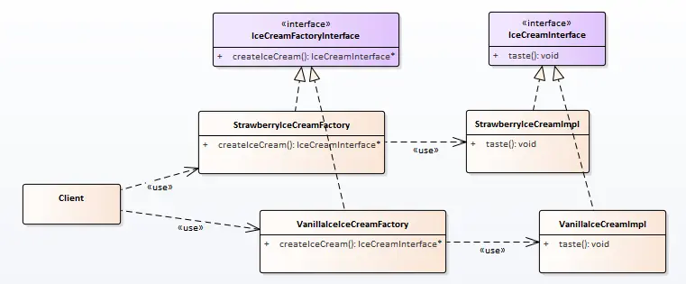

# 工厂模式

经过大家的努力，啃得鸡的草莓冰淇淋和香草冰淇淋销量不错。

准备继续贩售新的冰淇淋产品，发现每次生产新产品时，都要对之前的工厂（简单工厂）进行改造。

啃得鸡害怕会影响产品品质，希望设计一个发布新产品不会影响原产品生产的工厂。


代码如何实现？


## 场景分析

让我们再想一想冰淇淋工厂的流水线吧；如何再不影响一个流水线的情况下，再多出一种产品嗯？

**造一条新的流水线去生产新产品！**

程序就是好，造流水线没那么花钱。


## 实现思路

实现类图：



这时我们发现如果需要我们有了一个新冰淇淋（产品），那么我们就安排一个新的生产线（工厂）。再也不会影响原了的冰淇淋生产情况了。

## 实现代码

**冰淇淋：**

```cpp
// 冰淇淋接口
class IceCreamInterface
{
public:
    virtual ~IceCreamInterface() {}
    virtual void taste() = 0;
};

// 草莓冰淇淋
class StrawberryIceCreamImpl : public IceCreamInterface
{
public:
    virtual void taste() override
    {
        qDebug() << QStringLiteral("草莓冰淇淋的味道！");
    }
};

// 香草冰淇淋
class VanillaIceCreamImpl : public IceCreamInterface
{
public:
    virtual void taste() override
    {
        qDebug() << QStringLiteral("香草冰淇淋的味道！");
    }
};
```


**冰淇淋工厂：**

```cpp
// 冰淇淋工厂接口
class IceCreamFactoryInterface
{
public:
    virtual ~IceCreamFactoryInterface() {}
    virtual IceCreamInterface * createIceCream() = 0;
};
// 草莓冰淇淋工厂
class StrawberryIceCreamFactory : public IceCreamFactoryInterface
{
public:
    StrawberryIceCreamFactory() {}
    IceCreamInterface * createIceCream()
    {
        return new StrawberryIceCreamImpl();
    }
};
// 香草冰淇淋工厂
class VanillaIceCreamFactory : public IceCreamFactoryInterface
{
public:
    VanillaIceCreamFactory() {}
    IceCreamInterface * createIceCream()
    {
        return new VanillaIceCreamImpl();
    }
};
```


**客户端：**

```cpp
int main(int argc, char *argv[])
{
    IceCreamFactoryInterface* pStrawberryIceCreamFactory =
            new StrawberryIceCreamFactory();

    IceCreamFactoryInterface* pVanillaIceCreamFactory =
            new VanillaIceCreamFactory();

    IceCreamInterface* pStrawberryIceCream = pStrawberryIceCreamFactory->createIceCream();
    IceCreamInterface* pVanillaIceCream = pVanillaIceCreamFactory->createIceCream();

    pStrawberryIceCream->taste();
    pVanillaIceCream->taste();

    delete pStrawberryIceCreamFactory;
    delete pVanillaIceCreamFactory;
    delete pStrawberryIceCream;
    delete pVanillaIceCream;
}
```


## 使用感悟

这里我们解决了简单工厂存在的问题，符合开闭原则的增加产品生产；

但是我们同时引入了新的问题，客户端使用起来很麻烦，对应到现实就是本来一个客户去一个工厂能满足所有的需求，现在客户想要同时买到两种冰淇淋就需要跑两个场；

所有现在我们需一个超市，或者小卖部？

**特点/优点：**

1、工厂类可以不实例化，使用静态工厂类。

2、延时创建，使用类再不确定是否要创建产品时，可以通过拿着产品的工厂方法。再需要时再创建。 实现延时创建。

**问题：**

1、随着产品的增加，工厂也不断的增加，可能造成对象的爆发。

2、客户需要关注每个工厂的不同才能获得想要的产品，可能增加维护成本。

**思考：**

什么是产品，什么是工厂？

由于产品和工厂两个名称的迷惑性，我们可能会下意识的把他们对应到某个实体的映射。（这当然是初学时最快的理解方式）

但产品和工厂的概念中，产品指的是类；类可以是事物，关系等的抽象。


## 代码路径

https://github.com/su-dd/learning/tree/main/src/design_pattern/FactoryMethod