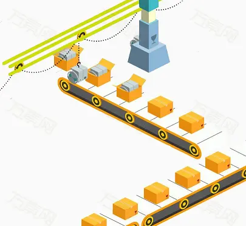

# 模板方法

啃得鸡自从通过抽象工厂解决套餐模式后，流量大增；但暂时盈利达到了上限。于是希望节流，发现工厂流程很多重复项，希望可以通过统一生产流程来做到成本优化。



## 场景分析

简化场景，只生产冰淇淋甜筒。我们发现冰淇淋甜筒就是薄饼筒和冰淇淋球的组合。不同口味的冰淇淋，薄饼筒是不变的，换不同的冰淇淋球。

模板方法是一个你在下意识的情况下就会使用的方法。

模板方法的核心思想就是将流程中的细节（变化的地方）；下放到子类中解决。

## 实现思路


## 实现代码

模板方法：

```cpp
class FactoryTemplate
{
public:
    virtual ~FactoryTemplate() {}
    IceCream createIceCream()
    {
        IceCream oIceCream;
        createCone(oIceCream);
        createIceBall(oIceCream);
        return oIceCream;
    }

protected:
    void createCone(IceCream &iceCream)
    {
        iceCream.setCone();
    }

    virtual void createIceBall(IceCream &iceCream) = 0;
};
```


子类：

```cpp
class StrawberryFactory : public FactoryTemplate
{
public:
    virtual ~StrawberryFactory() {}
protected:
    virtual void createIceBall(IceCream &iceCream)
    {
        iceCream.setIceBall(QStringLiteral("草莓"));
    }
};

class VanillaFactory : public FactoryTemplate
{
public:
    virtual ~VanillaFactory() {}
protected:
    virtual void createIceBall(IceCream &iceCream)
    {
        iceCream.setIceBall(QStringLiteral("香草"));
    }
};
```


## 使用感悟

模板方法的基本思路：

基于继承的情况上，封装不变的部分，扩展可变的部分。

优点：1、更好的代码复用性；2、父类封装控制，子类实现细节；实现更可控

缺点：1、类的增加，导致实现更复杂


## 代码位置

https://github.com/su-dd/learning/tree/main/src/design_pattern/Template