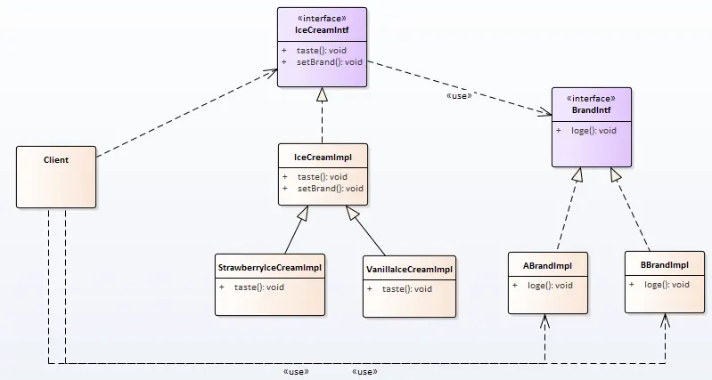

# 桥模式

小商贩多了，也就一味这销售的渠道拓宽了，人们接受了这种商品。 同时也意味着是用**原型**模式做copy的人多了。

这时为了不被虐币驱逐良币，啃得鸡决定：将工厂独立处理，加大产能，压缩价格，打价格战。

啃地鸡冰淇淋代工厂产生了！！！！

各品牌直接把自己的牌子放在啃地鸡，就能拿到自己的产品。问啃地鸡怎么生产？


## 场景分析

啃地鸡待工厂现在生产的冰淇淋有两个维度属性： 品牌，配方。

我们可以使用继承关系，但是随着 品牌，配方 不断的增加。子类的数量呈快速增加的状态。可能增加一个配方，就需要十多个子类，甚至更多 。

但是，如果采用品牌和配方拆开的生产方式，增加一个配方就是一个配方。

当类中存在多层继承时，如果我们发现基础是按两个不同维度展开时，就应该考虑**桥模式**。


## 实现思路

**类图：**




## 实现代码

品牌：

```cpp
// 接口：
class BrandIntf
{
public:
    virtual ~BrandIntf() {}
    virtual void logo() = 0;
};

// 实现
class ABrandImpl : public BrandIntf
{
public:
    void logo()
    {
        cout << "啃得鸡logo";
    }
};

class BBrandImpl : public BrandIntf
{
public:
    void logo()
    {
        cout << "啃得鸭logo";
    }
};
```


冰淇淋：

```cpp
// 接口
class IceCreamIntf
{
public:
    virtual ~IceCreamIntf() {}
    virtual void taste() = 0;
    virtual void setBrand(BrandIntf *brand) = 0;
};

// 实现

class IceCreamImpl
{
public:
    IceCreamImpl() : m_pBrand(nullptr) {}
    virtual ~IceCreamImpl()
    {
        delete m_pBrand;
    }

    virtual void taste()
    {
        m_pBrand->logo();
    }

    virtual void setBrand(BrandIntf *brand)
    {
        if (m_pBrand == brand)
            return;
        if (nullptr != m_pBrand)
            delete m_pBrand;
        m_pBrand = brand;
    }

private:
    BrandIntf *m_pBrand;
};

class StrawberryIceCreamImpl : public IceCreamImpl
{
public:
    virtual void taste()
    {
        IceCreamImpl::taste();
        cout << "草莓冰淇淋！" << endl;
    }
};
```


客户端：

```cpp
int main()
{
    SetConsoleOutputCP(CP_UTF8);
    StrawberryIceCreamImpl oIceCream1;
    oIceCream1.setBrand(new ABrandImpl());
    oIceCream1.taste();

    StrawberryIceCreamImpl oIceCream2;
    oIceCream2.setBrand(new BBrandImpl());
    oIceCream2.taste();

    return 0;
}
```


## 感悟

**优点：**

1、从两个维度拆分多重基础类，极大的减少了类个数。

2、两个维度可以独立变化，而不影响另一个维度。

**缺点：**

1、外在使用时会更复杂。

对比代理，装饰者，我们发现这三这外在使用时，有类似的使用方式。

**这样对注重点做对比：**

代理：增加不属于原对象的功能。

装饰者：对原有功能的增强，增强后还是原有功能。

桥模式：拆分两个维度，以简化原实现。


## 代码位置

https://github.com/su-dd/learning/tree/main/src/design_pattern/Bridge