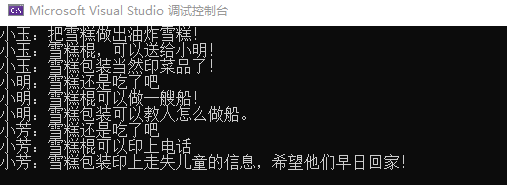

# 访问者模式

不知不觉，夏天已经过去；雪糕的效率开始下滑，但是厂房、机器投入了那么多。

啃得鸡开会统一意见：

从各个方面开发雪糕的剩余价值，来增加销量。

吃货小玉提出：吃是雪糕的精髓

> 雪糕：雪糕三吃，油炸雪糕、雪糕饼干、雪糕薯条
>
> 雪糕棍：平平无奇的雪糕棍
>
> 包装： 印吃货教程

神奇小明提出：集邮才是乐趣

> 雪糕：当然还是吃
>
> 雪糕棍：做手工，以挖掘大家对雪糕的消费。
>
> 包装： 印手工制作教程

善良小芳提出：用爱拯救世界

> 雪糕：当然还是吃
>
> 雪糕棍：印个电话号码，便于举报
>
> 包装： 在雪糕包装上印走失儿童的照片、地址信息、父母信息等。


## 场景分析

这里厂家并没有改变自己是生产雪糕这个本质，而是尝试改变大众对雪糕的认知；挖掘新的使用办法。

雪糕主体并没有变化，但使用方式发生变化；


## 实现思路


### element接口

定义雪糕组成部分的接口，这里注意 Visitor 可以使用声明，而无需引用。

```cpp
class IceCreamPart
{
public:
	virtual ~IceCreamPart() {}
	virtual void accept(Visitor *visitor) = 0;
};
```


### element的实现类

定义了各个组成部分的实现

```cpp
// 雪糕体
class Body : public IceCreamPart
{
public:
	virtual void accept(Visitor *visitor) override
	{
		visitor->visitor(this);
	}
};

// 雪糕棍
class Stick : public IceCreamPart
{
public:
	virtual void accept(Visitor* visitor) override 
	{
		visitor->visitor(this);
	}
};

// 雪糕包装
class Package : public IceCreamPart
{
public:
	virtual void accept(Visitor* visitor) override
	{
		visitor->visitor(this);
	}
};
```


### visitor接口

定义雪糕组成部分的访问方式的接口，这里注意 Body、Stick、Package 可以使用声明，而无需引用。

```cpp
class Visitor
{
public:
	virtual ~Visitor() {}

	virtual void visitor(Body* body) = 0;
	virtual void visitor(Stick* body) = 0;
	virtual void visitor(Package* body) = 0;
};
```


### visitor的实现类

定义了给个部分的不同实现方式

```cpp
// 小玉
class XiaoYuVisitor : public Visitor
{
public:
	virtual void visitor(Body* body) override
	{
		cout << "小玉：把雪糕做出油炸雪糕！" << endl;
	}

	virtual void visitor(Stick* body) override 
	{
		cout << "小玉：雪糕棍，可以送给小明！" << endl;
	}

	virtual void visitor(Package* body) override 
	{
		cout << "小玉：雪糕包装当然印菜品了！" << endl;
	}
};
// 小明
class XiaoMingVisitor : public Visitor
{
public:
	virtual void visitor(Body* body) override 
	{
		cout << "小明：雪糕还是吃了吧" << endl;
	}

	virtual void visitor(Stick* body) override
	{
		cout << "小明：雪糕棍可以做一艘船！" << endl;
	}

	virtual void visitor(Package* body) override 
	{
		cout << "小明：雪糕包装可以教人怎么做船。" << endl;
	}
};
// 小芳
class XiaoFangVisitor : public Visitor
{
public:
	virtual void visitor(Body* body) override 
	{
		cout << "小芳：雪糕还是吃了吧" << endl;
	}

	virtual void visitor(Stick* body) override
	{
		cout << "小芳：雪糕棍可以印上电话" << endl;
	}

	virtual void visitor(Package* body) override
	{
		cout << "小芳：雪糕包装印上走失儿童的信息，希望他们早日回家！" << endl;
	}
};
```


### ObjectStructure

这里的ObjectStructure 就是雪糕这个主体，他的组成是稳定的，及资源稳定； 雪糕的各个部分可以通过

```cpp
class IceCream
{
public:
	IceCream() {}
	~IceCream() 
	{
		foreach (auto item in IceCreamPartList)
		{
			delete item;
		}
		IceCreamPartList.clear();
	}

	void accept(Visitor* vistor)
	{
		for each (auto item in IceCreamPartList)
		{
			item->accept(vistor);
		}
	}

	void add(IceCreamPart* part) 
	{
		IceCreamPartList.push_back(part);
	}

	void remove(IceCreamPart* part)
	{
		IceCreamPartList.remove(part);
	}

private:
	list<IceCreamPart*> IceCreamPartList;
};
```


### main函数

```cpp
int main(int argc, char *argv[])
{
    IceCream oIceCream;
    oIceCream.add(new Body());
    oIceCream.add(new Stick());
    oIceCream.add(new Package());

    XiaoYuVisitor oXiaoYu;
    oIceCream.accept(&oXiaoYu);

    XiaoMingVisitor oXiaoMing;
    oIceCream.accept(&oXiaoMing);

    XiaoFangVisitor oXiaoFang;
    oIceCream.accept(&oXiaoFang);

    return 0;
}
```





## 感悟

再一次观察访问者模式的类图： 

**优点：** 增加一个visitor的实现类，影响很小。

**缺点：** 增加一个element的实现类，影响较大。

访问者模式有利于支持资源结构稳定，使用方式变化的场景；如资源为内部结构，不可直接操作；这时需要添加方法；


### 关于双分派（dispatch）

从代码调用顺序来理解这个概念是比较合适的。


分派1：visitor通过运行时，找到时候执行的子类；这是一次动态分派。

分派2：子类通过overload重载，找到时候的函数；这也是一次动态分派。

两次动态单分派组成了一次动态双分派。


## 代码位置

https://github.com/su-dd/learning/tree/main/src/design_pattern/Visitor
