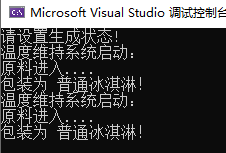

# 状态模式

春去秋来，岁月如梭，又过了几天；随着市场变化，啃得鸡公司准备研发一款跨时代的产品：盒装冰淇淋。并且决定随着时间变化不断推出新的产品，已持续维持市场竞争力。

鉴于之前的自动化流水线已经产能过剩，希望可以利用过剩产能；以减少投入。

## 场景分析

这里做一个思考：冰淇淋流水线在做冰棍或是盒装冰淇淋时，只需要在需要在组装打包环节使用不同的方式。

这时我们可以建不同的两个打包组装模块： 冰棍打包模块、盒装冰淇淋打包模块

这两个模块都对流水线中的半成品进行打包组装，并传递给下一个模块。

流水线可以通过动态的切换不同的模块完成不同的生产任务，而不用停止整个生产线，已做生产状态调整。

## 实现思路


### 接口

```cpp
class State
{
public:
	virtual ~State() {}

	virtual void doPackage() = 0;
};
```


### 上下文

```cpp
class ProductContext
{
public:
	ProductContext()
		: m_pState(nullptr)
	{
	}

	~ProductContext()
	{
		m_pState = nullptr;
	}

	void setState(State* state)
	{
		if (m_pState != state)
			m_pState = state;
	}

	void doProduct()
	{
		if (nullptr == m_pState)
		{
			cout << "请设置生成状态!" << endl;
			return;
		}
		cout << "温度维持系统启动：" << endl;
		cout << "原料进入...." << endl;
		m_pState->doPackage();
	}
private:
	State* m_pState;
};
```


### 接口实现

```cpp
class IceCreamState : public State
{
public:
	IceCreamState()
		: State()
	{}

	virtual ~IceCreamState() {}

	virtual void doPackage() override
	{
		cout << "包装为 普通冰淇淋！" << endl;
	}
};
```


```cpp
class BoxIceCreamState : public State
{
public:
	BoxIceCreamState()
		: State()
	{}

	virtual ~BoxIceCreamState() {}

	virtual void doPackage() override
	{
		cout << "包装为 普通冰淇淋！" << endl;
	}
};
```


### main函数

```cpp
int main(int argc, char* argv[])
{
	ProductContext oProductContext;
	oProductContext.doProduct();

	BoxIceCreamState oBoxIceCreamState;
	oProductContext.setState(&oBoxIceCreamState);
	oProductContext.doProduct();

	IceCreamState oIceCreamState;
	oProductContext.setState(&oIceCreamState);
	oProductContext.doProduct();

	return 0;
}
```


运行结果： 

## 感悟

状态模式是解决：当对象的行为随着对象的属性变化而变化的情况，采用的方式是将不同的行为进行封装。

什么时候需要状态模式： 当面类中代码中存在大量if判断，并且if判断的业务条件相同。

**优点：** 1、将于特定的条件相关的代码集中到一个类里面，有力的减少了if判断；且利用对一个业务统一修改。

2、无需修改上下文即可引入新的状态。

**缺点：**

1、状态模式需要上下文环境类有良好的设计，对设计要求较高。


## 代码位置

仓库位置：[https://github.com/su-dd/demo.git(opens new window)](https://github.com/su-dd/demo.git)

代码位置：[设计模式/State(opens new window)](https://github.com/su-dd/demo/tree/main/设计模式/State)

## 