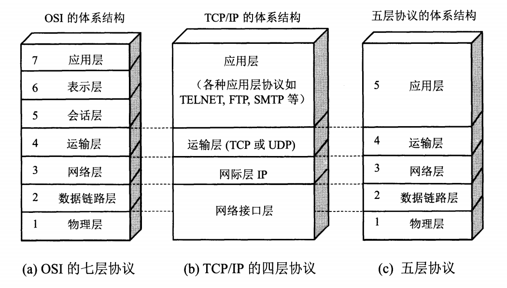
## 各层作用及协议

|分层|作用|协议|
|---|---|---|
|物理层|通过媒介传输比特，确定机械及电气规范（比特 Bit）|RJ45、CLOCK、IEEE802.3（中继器，集线器）|
|数据链路层|将比特组装成帧和点到点的传递（帧 Frame）|PPP、FR、HDLC、VLAN、MAC（网桥，交换机）|
|网络层|负责数据包从源到宿的传递和网际互连（包 Packet）|IP、ICMP、ARP、RARP、OSPF、IPX、RIP、IGRP（路由器）|
|运输层|提供端到端的可靠报文传递和错误恢复（ 段Segment）|TCP、UDP、SPX|
|会话层|建立、管理和终止会话（会话协议数据单元 SPDU）|NFS、SQL、NETBIOS、RPC|
|表示层|对数据进行翻译、加密和压缩（表示协议数据单元 PPDU）|JPEG、MPEG、ASII|
|应用层|允许访问OSI环境的手段（应用协议数据单元 APDU）|FTP、DNS、Telnet、SMTP、HTTP、WWW、NFS|

## 物理层

- 传输数据的单位：比特
- 数据传输系统：源系统（源点、发送器） --> 传输系统 --> 目的系统（接收器、终点）

通道：

- 单向通道（单工通道）：只有一个方向通信，没有反方向交互，如广播
- 双向交替通信（半双工通信）：通信双方都可发消息，但不能同时发送或接收
- 双向同时通信（全双工通信）：通信双方可以同时发送和接收信息

通道复用技术：

- 频分复用（FDM，Frequency Division Multiplexing）：不同用户在不同频带，所用用户在同样时间占用不同带宽资源
- 时分复用（TDM，Time Division Multiplexing）：不同用户在同一时间段的不同时间片，所有用户在不同时间占用同样的频带宽度
- 波分复用（WDM，Wavelength Division Multiplexing）：光的频分复用
- 码分复用（CDM，Code Division Multiplexing）：不同用户使用不同的码，可以在同样时间使用同样频带通信

## 数据链路层

主要信道：

- 点对点信道
- 广播信道

### 点对点信道

- 数据单元：帧

三个基本问题：

- 封装成帧：把网络层的 IP 数据报封装成帧，`SOH - 数据部分 - EOT`
- 透明传输：不管数据部分什么字符，都能传输出去；可以通过字节填充方法解决（冲突字符前加转义字符）
- 差错检测：降低误码率（BER，Bit Error Rate），广泛使用循环冗余检测（CRC，Cyclic Redundancy Check）

点对点协议（Point-to-Point Protocol）：

- 点对点协议（Point-to-Point Protocol）：用户计算机和 ISP 通信时所使用的协议

### 广播信道

广播通信：

- 硬件地址（物理地址、MAC 地址）
- 单播（unicast）帧（一对一）：收到的帧的 MAC 地址与本站的硬件地址相同
- 广播（broadcast）帧（一对全体）：发送给本局域网上所有站点的帧
- 多播（multicast）帧（一对多）：发送给本局域网上一部分站点的帧

## 网络层

- IP（Internet Protocol，网际协议）是为计算机网络相互连接进行通信而设计的协议。
- ARP（Address Resolution Protocol，地址解析协议）
- ICMP（Internet Control Message Protocol，网际控制报文协议）
- IGMP（Internet Group Management Protocol，网际组管理协议）

### IP 网际协议
IP 地址分类：
- `IP 地址 ::= {<网络号>,<主机号>}`

|IP 地址类别|网络号|网络范围|主机号|IP 地址范围|
|---|---|---|---|---|
|A 类|8bit，第一位固定为 0|0 —— 127|24bit|1.0.0.0 —— 127.255.255.255|
|B 类|16bit，前两位固定为 10|128.0 —— 191.255|16bit|128.0.0.0 —— 191.255.255.255|
|C 类|24bit，前三位固定为 110|192.0.0 —— 223.255.255|8bit|192.0.0.0 —— 223.255.255.255|
|D 类|前四位固定为 1110，后面为多播地址||||
|E 类|前五位固定为 11110，后面保留为今后所用|||

IP 数据报格式：

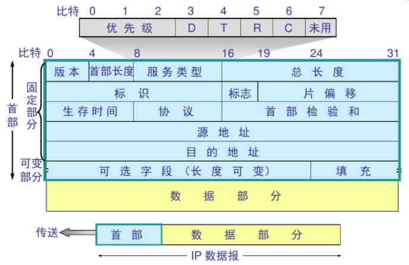

### ICMP 网际控制报文协议

ICMP 报文格式：

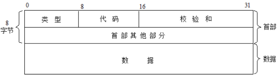
应用：

- PING（Packet InterNet Groper，分组网间探测）测试两个主机之间的连通性
- TTL（Time To Live，生存时间）该字段指定 IP 包被路由器丢弃之前允许通过的最大网段数量

## 运输层

协议：

- TCP（Transmission Control Protocol，传输控制协议）
- UDP（User Datagram Protocol，用户数据报协议）

端口：

不同的应用程序，使用的端口号不同

|应用程序|FTP|TELNET|SMTP|DNS|TFTP|HTTP|HTTPS|SNMP|
|---|---|---|---|---|---|---|---|---|
|端口号|21|23|25|53|69|80|443|161|

### TCP

TCP（Transmission Control Protocol，传输控制协议）是一种面向连接的、可靠的、基于字节流的传输层通信协议，其传输的单位是报文段。

特征：
- 面向连接
- 只能点对点（一对一）通信
- 可靠交互
- 全双工通信
- 面向字节流

TCP 如何保证可靠传输：

- 确认和超时重传
- 数据合理分片和排序
- 流量控制
- 拥塞控制
- 数据校验

TCP 报文结构：

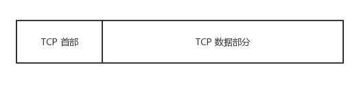
TCP 首部：

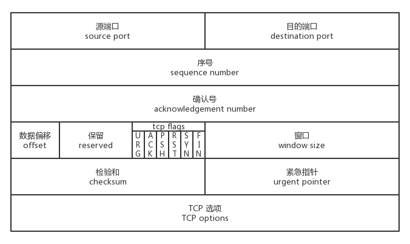TCP：状态控制码（Code，Control Flag），占 6 比特，含义如下：

- URG：紧急比特（urgent），当 `URG＝1` 时，表明紧急指针字段有效，代表该封包为紧急封包。它告诉系统此报文段中有紧急数据，应尽快传送(相当于高优先级的数据)， 且上图中的 Urgent Pointer 字段也会被启用。
- ACK：确认比特（Acknowledge）。只有当 `ACK＝1` 时确认号字段才有效，代表这个封包为确认封包。当 `ACK＝0` 时，确认号无效。
- PSH：（Push function）若为 1 时，代表要求对方立即传送缓冲区内的其他对应封包，而无需等缓冲满了才送。
- RST：复位比特(Reset)，当 `RST＝1` 时，表明 TCP 连接中出现严重差错（如由于主机崩溃或其他原因），必须释放连接，然后再重新建立运输连接。
- SYN：同步比特(Synchronous)，SYN 置为 1，就表示这是一个连接请求或连接接受报文，通常带有 SYN 标志的封包表示『主动』要连接到对方的意思。
- FIN：终止比特(Final)，用来释放一个连接。当 `FIN＝1` 时，表明此报文段的发送端的数据已发送完毕，并要求释放运输连接。
### UDP

UDP（User Datagram Protocol，用户数据报协议）是 OSI（Open System Interconnection 开放式系统互联） 参考模型中一种无连接的传输层协议，提供面向事务的简单不可靠信息传送服务，其传输的单位是用户数据报。

特征：

- 无连接
- 尽最大努力交付
- 面向报文
- 没有拥塞控制
- 支持一对一、一对多、多对一、多对多的交互通信
- 首部开销小

UDP 报文结构：

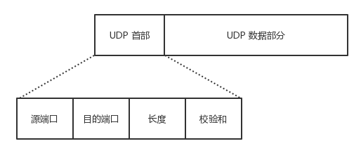

UDP 首部：

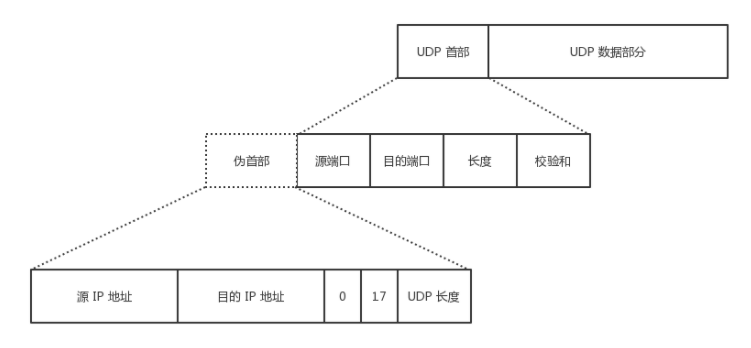

### TCP vs UDP

|  | TCP | UDP |
| ---- | ---- | ---- |
| 首部大小 | 首部开销20字节 | 首部开销8字节 |
| 连接 | 面向连接 | 无连接 |
| 可靠性 | 提供可靠的服务： 通过 TCP 连接传送的数据： 无差错、不丢失、不重复、按序到达 | 尽最大努力交付： 即不保证可靠交付 |
| 逻辑通信信道 | 全双工的可靠信道 | 不可靠信道 |
| 通信方式 | 点到点 | 支持一对一，一对多，多对一和多对多 |
| 数据方式 | 面向字节流（可能出现黏包问题），实际上是 TCP 把数据看成一连串无结构的字节流 | 面向报文的（不会出现黏包问题） |
| 拥塞控制 | 有 | 无，网络出现拥塞不会使源主机的发送速率降低（对实时应用很有用，如 IP 电话，实时视频会议等） |

### TCP黏包问题

TCP 是一个基于字节流的传输服务（UDP 基于报文的），“流” 意味着 TCP 所传输的数据是没有边界的。所以可能会出现两个数据包黏在一起的情况。

**解决方案：**

- 发送定长包。如果每个消息的大小都是一样的，那么在接收对等方只要累计接收数据，直到数据等于一个定长的数值就将它作为一个消息。
- 包头加上包体长度。包头是定长的 4 个字节，说明了包体的长度。接收对等方先接收包头长度，依据包头长度来接收包体。
- 在数据包之间设置边界，如添加特殊符号 `\r\n` 标记。FTP 协议正是这么做的。但问题在于如果数据正文中也含有 `\r\n`，则会误判为消息的边界。
- 使用更加复杂的应用层协议。

### TCP浏览控制

流量控制（flow control）就是让发送方的发送速率不要太快，要让接收方来得及接收。

**方法：** 利用可变窗口进行流量控制

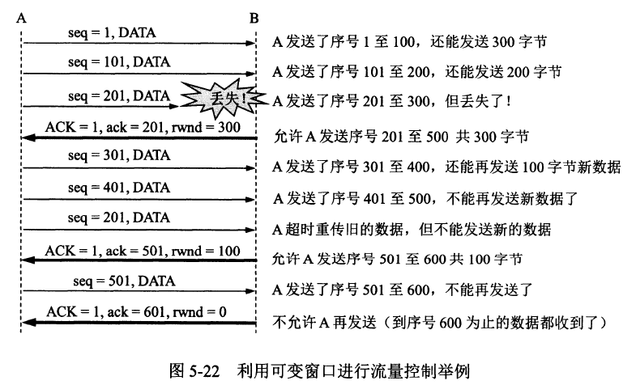

### TCP拥塞控制

拥塞控制就是防止过多的数据注入到网络中，这样可以使网络中的路由器或链路不致过载。

**方法：**

- 慢开始( slow-start )
- 拥塞避免( congestion avoidance )
- 快重传( fast retransmit )
- 快恢复( fast recovery )

**拥塞控制图：**

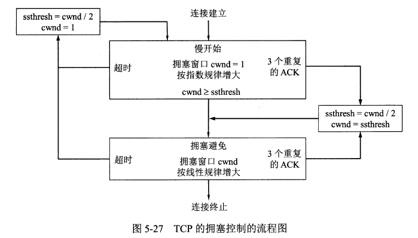

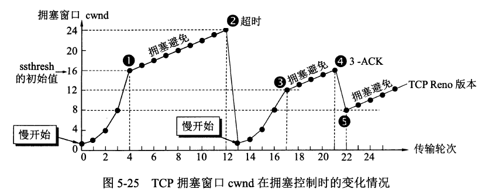
cwnd：Congestion Window，拥塞窗口
ssthresh：Slow Start Threshold，慢启动阈值；一般设置为当前窗口值的一般

慢开始：从1开始
快恢复：按指数增长，做回复，直到ssthresh
拥塞避免：达到ssthresh后，按线性增长；直到超时，或者收到ack；
快重传：

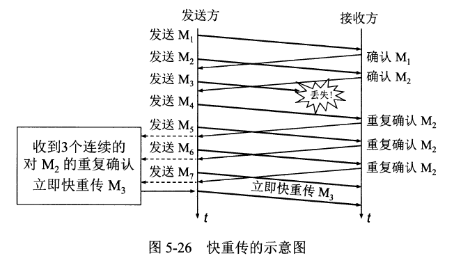

### TCP三次握手

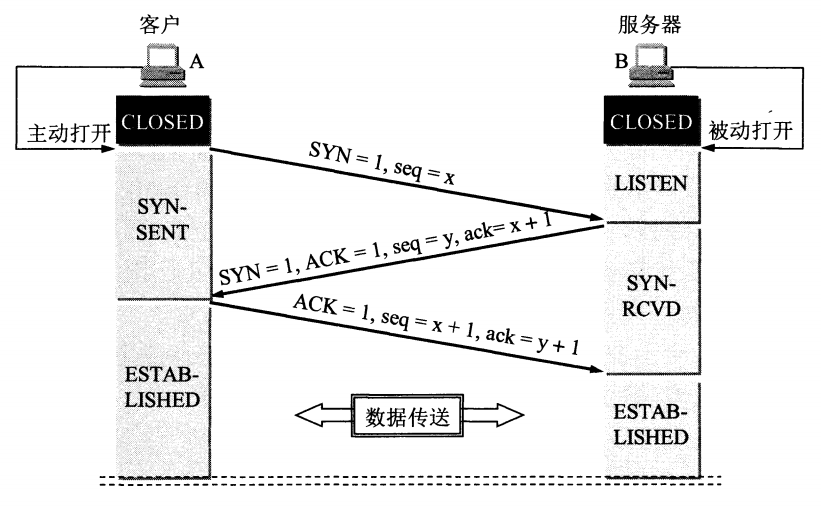

- 1. 客户端发送 SYN 给服务器，说明客户端请求建立连接；
- 2. 服务端收到客户端发的 SYN，并回复 SYN+ACK 给客户端（同意建立连接）；
- 3. 客户端收到服务端的 SYN+ACK 后，回复 ACK 给服务端（表示客户端收到了服务端发的同意报文）；
- 4. 服务端收到客户端的 ACK，连接已建立，可以数据传输。

#### 为什么要进行三次握手？

因为双方都需要确认对方收到了自己发送的序列号，确认过程最少要进行三次通信。

### TCP四次挥手

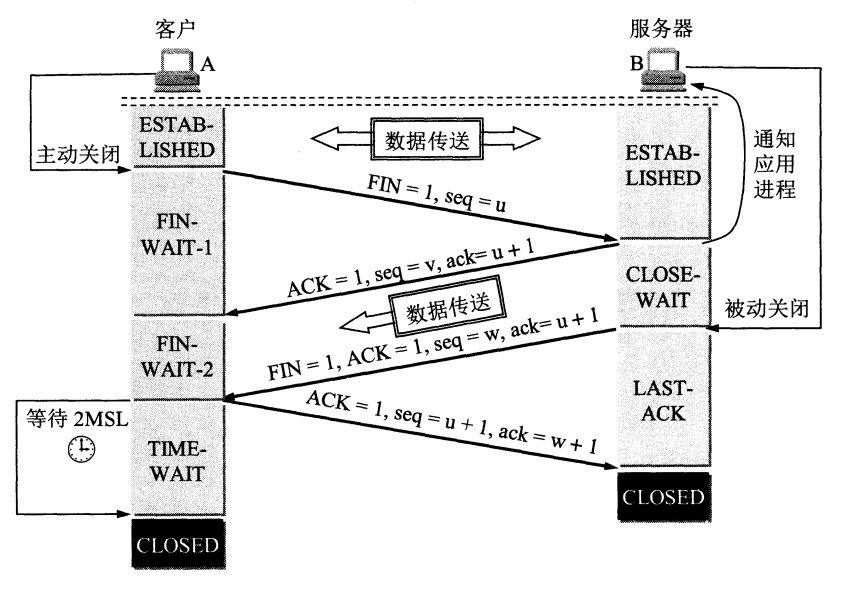
- 1. 客户端发送 FIN 给服务器，说明客户端不必发送数据给服务器了（请求释放从客户端到服务器的连接）；
- 2. 服务器接收到客户端发的 FIN，并回复 ACK 给客户端（同意释放从客户端到服务器的连接）；
- 3. 客户端收到服务端回复的 ACK，此时从客户端到服务器的连接已释放（但服务端到客户端的连接还未释放，并且客户端还可以接收数据）；
- 4. 服务端继续发送之前没发完的数据给客户端；
- 5. 服务端发送 FIN+ACK 给客户端，说明服务端发送完了数据（请求释放从服务端到客户端的连接，就算没收到客户端的回复，过段时间也会自动释放）；
- 6. 客户端收到服务端的 FIN+ACK，并回复 ACK 给服务端（同意释放从服务端到客户端的连接）；
- 7. 服务端收到客户端的 ACK 后，释放从服务端到客户端的连接。

##### 为什么要进行四次挥手？

**TCP 为什么要进行四次挥手？ / 为什么 TCP 建立连接需要三次，而释放连接则需要四次？**

因为 TCP 是全双工模式，客户端请求关闭连接后，客户端向服务端的连接关闭（一二次挥手），服务端继续传输之前没传完的数据给客户端（数据传输），服务端向客户端的连接关闭（三四次挥手）。所以 TCP 释放连接时服务器的 ACK 和 FIN 是分开发送的（中间隔着数据传输），而 TCP 建立连接时服务器的 ACK 和 SYN 是一起发送的（第二次握手），所以 TCP 建立连接需要三次，而释放连接则需要四次。

**为什么 TCP 连接时可以 ACK 和 SYN 一起发送，而释放时则 ACK 和 FIN 分开发送呢？（ACK 和 FIN 分开是指第二次和第三次挥手）**

因为客户端请求释放时，服务器可能还有数据需要传输给客户端，因此服务端要先响应客户端 FIN 请求（服务端发送 ACK），然后数据传输，传输完成后，服务端再提出 FIN 请求（服务端发送 FIN）；而连接时则没有中间的数据传输，因此连接时可以 ACK 和 SYN 一起发送。

**为什么客户端释放最后需要 TIME-WAIT 等待 2MSL 呢？**

- 1. 为了保证客户端发送的最后一个 ACK 报文能够到达服务端。若未成功到达，则服务端超时重传 FIN+ACK 报文段，客户端再重传 ACK，并重新计时。
- 2. 防止已失效的连接请求报文段出现在本连接中。TIME-WAIT 持续 2MSL (Maximum Segment Lifetime，最大报文段生存时间) 可使本连接持续的时间内所产生的所有报文段都从网络中消失，这样可使下次连接中不会出现旧的连接报文段。

### TCP 有限状态机

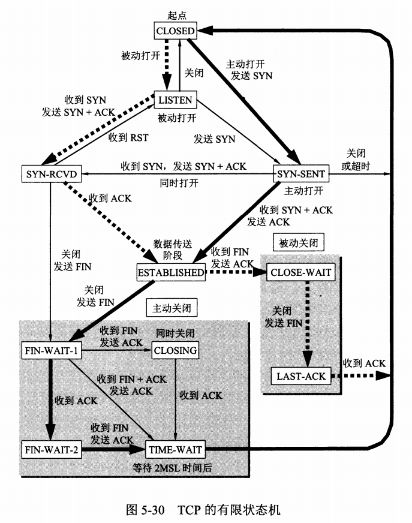

**TCP的11种状态：**
- **CLOSED**：初始时没有任何连接的状态。
- **LISTEN**：服务器监听来自客户端的连接请求(SYN包)。
- **SYN_SENT**：客户端socket执行CONNECT连接，发送SYN包，之后等待来自服务器的SYN ACK包(服务器的连接请求和对客户端连接请求的确认)。
- **SYN_RCVD**：服务端收到客户端的SYN包并发送服务端SYN ACK包，之后等待客户端对连接请求的确认(ACK包)。
- **ESTABLISH**：表示连接建立。客户端发送了最后一个ACK包后进入此状态，服务端接收到ACK包后进入此状态。
- **FIN_WAIT_1**：终止连接的一方（通常是客户机）发送了FIN包后进入此状态，之后等待对方FIN包。
- **CLOSE_WAIT**：（假设服务器）接收到客户机FIN包之后等待关闭的阶段。在接收到对方的FIN包之后，自然是需要立即回复ACK包的，表示已经知道断开请求。但是本方是否立即断开连接（发送FIN包）取决于是否还有数据需要发送给客户端，若还有数据要发送，则在发送FIN包之前均为此状态。
- **FIN_WAIT_2**：客户端接收到服务器的ACK包，但并没有立即接收到服务端的FIN包，进入FIN_WAIT_2状态。此时是半连接状态，即有一方要求关闭连接，等待另一方关闭。
- **LAST_ACK**：服务端发动最后的FIN包，等待最后的客户端ACK包。
- **CLOSING**：当主动关闭方处于FIN_WAIT_1时，被动关闭方的 FIN 先于之前的自己发送的 ACK 到达，主动关闭方就直接FIN_WAIT_1 -> CLOSING，（其实就相当于同时关闭)，然后迟来的 ACK 到达时，主动关闭方就从CLOSING -> TIME_WAIT。
- **TIME_WAIT**：客户端收到服务端的FIN包，并立即发出ACK包做最后的确认，在此之后的2MSL(两倍的最长报文段寿命)时间称为TIME_WAIT状态。

## 应用层

#### DNS

- DNS（Domain Name System，域名系统）是互联网的一项服务。它作为将域名和 IP 地址相互映射的一个分布式数据库，能够使人更方便地访问互联网。DNS 使用 TCP 和 UDP 端口 53。当前，对于每一级域名长度的限制是 63 个字符，域名总长度则不能超过 253 个字符。

域名：

- `域名 ::= {<三级域名>.<二级域名>.<顶级域名>}`，如：`blog.huihut.com`

#### FTP

- FTP（File Transfer Protocol，文件传输协议）是用于在网络上进行文件传输的一套标准协议，使用客户/服务器模式，使用 TCP 数据报，提供交互式访问，双向传输。
- TFTP（Trivial File Transfer Protocol，简单文件传输协议）一个小且易实现的文件传输协议，也使用客户-服务器方式，使用UDP数据报，只支持文件传输而不支持交互，没有列目录，不能对用户进行身份鉴定

#### TELNET

- TELNET （telnet protoco，远程登陆协议）是 TCP/IP 协议族中的一员，是 Internet 远程登陆服务的标准协议和主要方式。它为用户提供了在本地计算机上完成远程主机工作的能力。
    
- HTTP（HyperText Transfer Protocol，超文本传输协议）是用于从 WWW（World Wide Web，万维网）服务器传输超文本到本地浏览器的传送协议。
    
- SMTP（Simple Mail Transfer Protocol，简单邮件传输协议）是一组用于由源地址到目的地址传送邮件的规则，由它来控制信件的中转方式。SMTP 协议属于 TCP/IP 协议簇，它帮助每台计算机在发送或中转信件时找到下一个目的地。
    
- Socket 建立网络通信连接至少要一对端口号（Socket）。Socket 本质是编程接口（API），对 TCP/IP 的封装，TCP/IP 也要提供可供程序员做网络开发所用的接口，这就是 Socket 编程接口。

#### WWW

- WWW（World Wide Web，环球信息网，万维网）是一个由许多互相链接的超文本组成的系统，通过互联网访问
##### URL

- URL（Uniform Resource Locator，统一资源定位符）是因特网上标准的资源的地址（Address）

标准格式：

- `协议类型:[//服务器地址[:端口号]][/资源层级UNIX文件路径]文件名[?查询][#片段ID]`

完整格式：

- `协议类型:[//[访问资源需要的凭证信息@]服务器地址[:端口号]][/资源层级UNIX文件路径]文件名[?查询][#片段ID]`

> 其中【访问凭证信息@；:端口号；?查询；#片段ID】都属于选填项  
> 如：`https://github.com/huihut/interview#cc`

##### HTTP

HTTP（HyperText Transfer Protocol，超文本传输协议）是一种用于分布式、协作式和超媒体信息系统的应用层协议。HTTP 是万维网的数据通信的基础。

请求方法

|方法|意义|
|---|---|
|OPTIONS|请求一些选项信息，允许客户端查看服务器的性能|
|GET|请求指定的页面信息，并返回实体主体|
|HEAD|类似于 get 请求，只不过返回的响应中没有具体的内容，用于获取报头|
|POST|向指定资源提交数据进行处理请求（例如提交表单或者上传文件）。数据被包含在请求体中。POST请求可能会导致新的资源的建立和/或已有资源的修改|
|PUT|从客户端向服务器传送的数据取代指定的文档的内容|
|DELETE|请求服务器删除指定的页面|
|TRACE|回显服务器收到的请求，主要用于测试或诊断|

状态码（Status-Code）

- 1xx：表示通知信息，如请求收到了或正在进行处理
    - 100 Continue：继续，客户端应继续其请求
    - 101 Switching Protocols 切换协议。服务器根据客户端的请求切换协议。只能切换到更高级的协议，例如，切换到 HTTP 的新版本协议
- 2xx：表示成功，如接收或知道了
    - 200 OK: 请求成功
- 3xx：表示重定向，如要完成请求还必须采取进一步的行动
    - 301 Moved Permanently: 永久移动。请求的资源已被永久的移动到新 URL，返回信息会包括新的 URL，浏览器会自动定向到新 URL。今后任何新的请求都应使用新的 URL 代替
- 4xx：表示客户的差错，如请求中有错误的语法或不能完成
    - 400 Bad Request: 客户端请求的语法错误，服务器无法理解
    - 401 Unauthorized: 请求要求用户的身份认证
    - 403 Forbidden: 服务器理解请求客户端的请求，但是拒绝执行此请求（权限不够）
    - 404 Not Found: 服务器无法根据客户端的请求找到资源（网页）。通过此代码，网站设计人员可设置 “您所请求的资源无法找到” 的个性页面
    - 408 Request Timeout: 服务器等待客户端发送的请求时间过长，超时
- 5xx：表示服务器的差错，如服务器失效无法完成请求
    - 500 Internal Server Error: 服务器内部错误，无法完成请求
    - 503 Service Unavailable: 由于超载或系统维护，服务器暂时的无法处理客户端的请求。延时的长度可包含在服务器的 Retry-After 头信息中
    - 504 Gateway Timeout: 充当网关或代理的服务器，未及时从远端服务器获取请求

## Socket编程

**参考：**

[GitHub - huihut/interview.](https://github.com/huihut/interview?tab=readme-ov-file#computer-network)

[Linux Socket编程（不限Linux） - 吴秦 - 博客园 (cnblogs.com)](https://www.cnblogs.com/skynet/archive/2010/12/12/1903949.html)