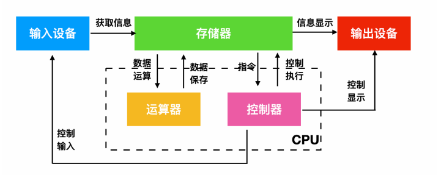
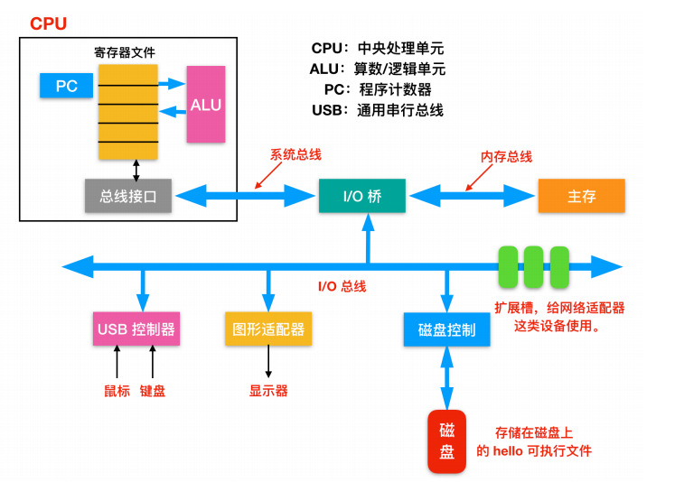
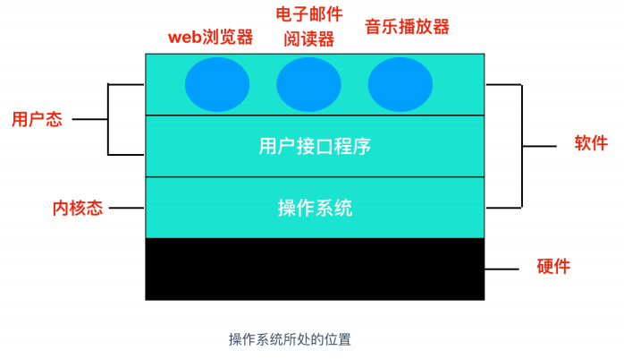

## 现代计算机

### 冯洛伊曼体系

现代计算机，基本都是基于冯洛伊曼的体系：

计算机硬件动重要组成部分有：**运算器、控制器、存储器、输入设备、输出设备**

- `运算器`：运算器最主要的功能是对数据和信息进行加工和运算。它是计算机中执行算数和各种逻辑运算的部件。运算器的基本运算包括加、减、乘、除、移位等操作，这些是由 `算术逻辑单元(Arithmetic&logical Unit)` 实现的。而运算器主要由算数逻辑单元和寄存器构成。
- `控制器`：指按照指定顺序改变主电路或控制电路的部件，它主要起到了控制命令执行的作用，完成协调和指挥整个计算机系统的操作。控制器是由程序计数器、指令寄存器、解码译码器等构成。

> 运算器和控制器共同组成了 CPU

- `存储器`：存储器就是计算机的`记忆设备`，顾名思义，存储器可以保存信息。存储器分为两种，一种是主存，也就是内存，它是 CPU 主要交互对象，还有一种是外存，比如硬盘软盘等。下面是现代计算机系统的存储架构
- `输入设备`：输入设备是给计算机获取外部信息的设备，它主要包括键盘和鼠标。
- `输出设备`：输出设备是给用户呈现根据输入设备获取的信息经过一系列的计算后得到显示的设备，它主要包括显示器、打印机等。

### Intel产品图
Intel基于冯洛伊曼体系，做了更为详细的分类：

- `总线(Buses)`：在整个系统中运行的是称为总线的电气管道的集合，这些总线在组件之间来回传输字节信息。通常总线被设计成传送定长的字节块，也就是 `字(word)`。字中的字节数（字长）是一个基本的系统参数，各个系统中都不尽相同。现在大部分的字都是 4 个字节（32 位）或者 8 个字节（64 位）。
- `I/O 设备(I/O Devices)`：Input/Output 设备是系统和外部世界的连接。上图中有四类 I/O 设备：用于用户输入的键盘和鼠标，用于用户输出的显示器，一个磁盘驱动用来长时间的保存数据和程序。刚开始的时候，可执行程序就保存在磁盘上。
    
> 每个I/O 设备连接 I/O 总线都被称为`控制器(controller)` 或者是 `适配器(Adapter)`。控制器和适配器之间的主要区别在于封装方式。控制器是 I/O 设备本身或者系统的主印制板电路（通常称作主板）上的芯片组。而适配器则是一块插在主板插槽上的卡。无论组织形式如何，它们的最终目的都是彼此交换信息。
    
- `主存(Main Memory)`，主存是一个`临时存储设备`，而不是永久性存储，磁盘是 `永久性存储` 的设备。主存既保存程序，又保存处理器执行流程所处理的数据。从物理组成上说，主存是由一系列 `DRAM(dynamic random access memory)` 动态随机存储构成的集合。逻辑上说，内存就是一个线性的字节数组，有它唯一的地址编号，从 0 开始。一般来说，组成程序的每条机器指令都由不同数量的字节构成，C 程序变量相对应的数据项的大小根据类型进行变化。比如，在 Linux 的 x86-64 机器上，short 类型的数据需要 2 个字节，int 和 float 需要 4 个字节，而 long 和 double 需要 8 个字节。

- `处理器(Processor)`，`CPU(central processing unit)` 或者简单的处理器，是解释（并执行）存储在主存储器中的指令的引擎。处理器的核心大小为一个字的存储设备（或寄存器），称为`程序计数器(PC)`。在任何时刻，PC 都指向主存中的某条机器语言指令（即含有该条指令的地址）。
  
> 从系统通电开始，直到系统断电，处理器一直在不断地执行程序计数器指向的指令，再更新程序计数器，使其指向下一条指令。处理器根据其指令集体系结构定义的指令模型进行操作。在这个模型中，指令按照严格的顺序执行，执行一条指令涉及执行一系列的步骤。处理器从程序计数器指向的内存中读取指令，解释指令中的位，执行该指令指示的一些简单操作，然后更新程序计数器以指向下一条指令。指令与指令之间可能连续，可能不连续（比如 jmp 指令就不会顺序读取）

下面是 CPU 可能执行简单操作的几个步骤
- `加载(Load)`：从主存中拷贝一个字节或者一个字到内存中，覆盖寄存器先前的内容
- `存储(Store)`：将寄存器中的字节或字复制到主存储器中的某个位置，从而覆盖该位置的先前内容
- `操作(Operate)`：把两个寄存器的内容复制到 `ALU(Arithmetic logic unit)`。把两个字进行算术运算，并把结果存储在寄存器中，重写寄存器先前的内容。
- `跳转(jump)`：从指令中抽取一个字，把这个字复制到`程序计数器(PC)` 中，覆盖原来的值

> 算术逻辑单元（ALU）是对数字二进制数执行算术和按位运算的组合数字电子电路。

## 概述

### 定义和目标

定义：**操作系统是**控制管理计算机系统的硬软件，分配调度资源的**系统软件**。

目标：**方便性，有效性（提高系统资源的利用率、提高系统的吞吐量）**，可扩充性，开放性。

简单说：操作系统就是硬件和软件之间的中间层，将解决不同规格硬件的差异，将他们的功能封装为统一的接口

### 基本功能

1. **统一管理计算机资源**：处理器资源，IO设备资源，存储器资源，文件资源;
2. **实现了对计算机资源的抽象**：IO设备管理软件提供读写接口，文件管理软件提供操作文件接;
3. **提供了用户与计算机之间的接口**：GUI（图形用户界面），命令形式，系统调用形式。

### 基本特征

（1）**并行**：指两个或多个事件可以在**同一个时刻**发生，**多核CPU可以实现并行**，一个cpu同一时刻只有一个程序在运行；**即：多核CPU可以同时运行多个指令**

（2）**并发**：指两个或多个事件可以在**同一个时间间隔**发生，用户看起来是每个程序都在运行，实际上是**每个程序都交替执行**；**即：CPU可以切换进程运行**

（3）**共享**：操作系统的中资源可供多个并发的程序共同使用
- **互斥共享**：当资源被程序占用时，其它想使用的程序只能等待。
- **同时访问**：某种资源**并发的**被多个程序访问。

（4）**虚拟**：把一个物理实体转变为若干个逻辑实体
- **时（时间）分复用技术**：资源在时间上进行复用，不同程序并发使用，多道程序分时使用计算机的硬件资源，提高资源的利用率。
- **空（空间）分复用技术**：用来实现虚拟磁盘（物理磁盘虚拟为逻辑磁盘，电脑上的C盘、D盘等）、虚拟内存（在逻辑上扩大程序的存储容量）等，提高资源的利用率，提高编程效率。

（5）**异步**：在多道程序环境下，允许多个进程并发执行，但由于资源等因素的限制，使进程的执行以“停停走走”的方式运行，而且每个进程执行的情况（运行、暂停、速度、完成）也是未知的。

### 中断处理

作用：为了在多道批处理系统中让用户进行交互

**分类**：

1. **内中断**（也叫“异常”、“例外”、“陷入”）------- 信号来源：**CPU内部**，与当前执行指令有关；

2. **外中断**（中断）----------信号来源：**CPU外部**，与当前执行指令无关。如 I/O 完成中断，表示设备输入/输出处理已经完成，处理器能够发送下一个输入/输出请求。此外还有时钟中断、控制台中断等。

**中断产生**：

- 发生中断时，CPU立马**切换到管态**，开展管理工作；（管态又叫特权态，系统态或核心态，是操作系统管理的程序执行时，机器所处的状态。）
- 发生中断后，当前运行的进程回暂停运行，由操作系统内核对中断进行处理；
- 对于不同的中断信号，会进行不同的处理。

**外中断的处理过程：**

1. 每执行完一个指令后，CPU都需要检查当前是否有外部中断 信号；
2. 如果检查到外部中断信号，则需要保护被中断进程的CPU环境（如程序状态字PSW，程序计数器PC、各种通用寄存器）把他们存储在PCB（进程控制块中）；
3. 根据中断信号类型转入相应的中断处理程序；
4. 恢复原进程的CPU环境并退出中断，返回原进程继续执行。

## 进程&线程

## 系统级I/O

## 虚拟内存

## 文件系统

**参考：**

[一篇就学会操作系统（最全操作系统笔记总结） - 知乎 (zhihu.com)](https://zhuanlan.zhihu.com/p/520711525)

[5万字、97 张图总结操作系统核心知识点 - 程序员cxuan - 博客园 (cnblogs.com)](https://www.cnblogs.com/cxuanBlog/p/13297199.html)

[计算机操作系统知识点总结（有这一篇就够了！！！）-CSDN博客](https://blog.csdn.net/Royalic/article/details/119999404)