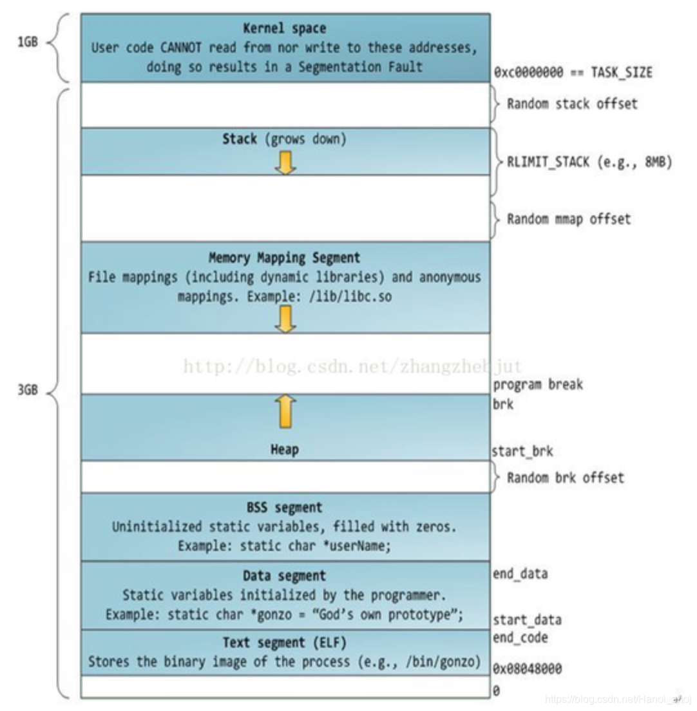
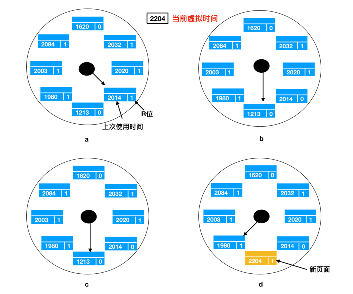
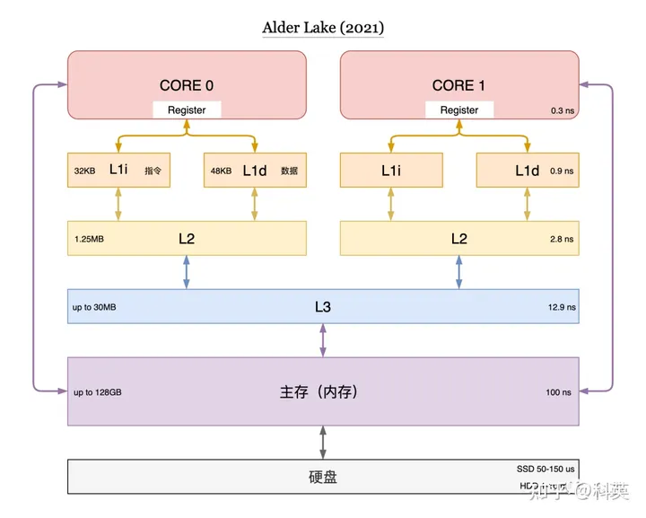
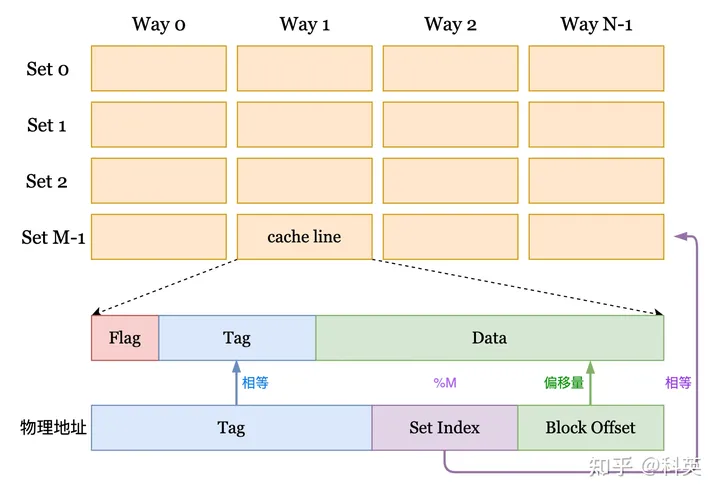

## 现代计算机

### 冯洛伊曼体系

现代计算机，基本都是基于冯洛伊曼的体系：

计算机硬件动重要组成部分有：**运算器、控制器、存储器、输入设备、输出设备**

- `运算器`：运算器最主要的功能是对数据和信息进行加工和运算。它是计算机中执行算数和各种逻辑运算的部件。运算器的基本运算包括加、减、乘、除、移位等操作，这些是由 `算术逻辑单元(Arithmetic&logical Unit)` 实现的。而运算器主要由算数逻辑单元和寄存器构成。
- `控制器`：指按照指定顺序改变主电路或控制电路的部件，它主要起到了控制命令执行的作用，完成协调和指挥整个计算机系统的操作。控制器是由程序计数器、指令寄存器、解码译码器等构成。

> 运算器和控制器共同组成了 CPU

- `存储器`：存储器就是计算机的`记忆设备`，顾名思义，存储器可以保存信息。存储器分为两种，一种是主存，也就是内存，它是 CPU 主要交互对象，还有一种是外存，比如硬盘软盘等。下面是现代计算机系统的存储架构
- `输入设备`：输入设备是给计算机获取外部信息的设备，它主要包括键盘和鼠标。
- `输出设备`：输出设备是给用户呈现根据输入设备获取的信息经过一系列的计算后得到显示的设备，它主要包括显示器、打印机等。

### Intel产品图
Intel基于冯洛伊曼体系，做了更为详细的分类：


- `总线(Buses)`：在整个系统中运行的是称为总线的电气管道的集合，这些总线在组件之间来回传输字节信息。通常总线被设计成传送定长的字节块，也就是 `字(word)`。字中的字节数（字长）是一个基本的系统参数，各个系统中都不尽相同。现在大部分的字都是 4 个字节（32 位）或者 8 个字节（64 位）。
- `I/O 设备(I/O Devices)`：Input/Output 设备是系统和外部世界的连接。上图中有四类 I/O 设备：用于用户输入的键盘和鼠标，用于用户输出的显示器，一个磁盘驱动用来长时间的保存数据和程序。刚开始的时候，可执行程序就保存在磁盘上。
    
> 每个I/O 设备连接 I/O 总线都被称为`控制器(controller)` 或者是 `适配器(Adapter)`。控制器和适配器之间的主要区别在于封装方式。控制器是 I/O 设备本身或者系统的主印制板电路（通常称作主板）上的芯片组。而适配器则是一块插在主板插槽上的卡。无论组织形式如何，它们的最终目的都是彼此交换信息。
    
- `主存(Main Memory)`，主存是一个`临时存储设备`，而不是永久性存储，磁盘是 `永久性存储` 的设备。主存既保存程序，又保存处理器执行流程所处理的数据。从物理组成上说，主存是由一系列 `DRAM(dynamic random access memory)` 动态随机存储构成的集合。逻辑上说，内存就是一个线性的字节数组，有它唯一的地址编号，从 0 开始。一般来说，组成程序的每条机器指令都由不同数量的字节构成，C 程序变量相对应的数据项的大小根据类型进行变化。比如，在 Linux 的 x86-64 机器上，short 类型的数据需要 2 个字节，int 和 float 需要 4 个字节，而 long 和 double 需要 8 个字节。

- `处理器(Processor)`，`CPU(central processing unit)` 或者简单的处理器，是解释（并执行）存储在主存储器中的指令的引擎。处理器的核心大小为一个字的存储设备（或寄存器），称为`程序计数器(PC)`。在任何时刻，PC 都指向主存中的某条机器语言指令（即含有该条指令的地址）。
  
> 从系统通电开始，直到系统断电，处理器一直在不断地执行程序计数器指向的指令，再更新程序计数器，使其指向下一条指令。处理器根据其指令集体系结构定义的指令模型进行操作。在这个模型中，指令按照严格的顺序执行，执行一条指令涉及执行一系列的步骤。处理器从程序计数器指向的内存中读取指令，解释指令中的位，执行该指令指示的一些简单操作，然后更新程序计数器以指向下一条指令。指令与指令之间可能连续，可能不连续（比如 jmp 指令就不会顺序读取）

下面是 CPU 可能执行简单操作的几个步骤
- `加载(Load)`：从主存中拷贝一个字节或者一个字到内存中，覆盖寄存器先前的内容
- `存储(Store)`：将寄存器中的字节或字复制到主存储器中的某个位置，从而覆盖该位置的先前内容
- `操作(Operate)`：把两个寄存器的内容复制到 `ALU(Arithmetic logic unit)`。把两个字进行算术运算，并把结果存储在寄存器中，重写寄存器先前的内容。
- `跳转(jump)`：从指令中抽取一个字，把这个字复制到`程序计数器(PC)` 中，覆盖原来的值

> 算术逻辑单元（ALU）是对数字二进制数执行算术和按位运算的组合数字电子电路。

## 概述

### 定义和目标

定义：**操作系统是**控制管理计算机系统的硬软件，分配调度资源的**系统软件**。

目标：**方便性，有效性（提高系统资源的利用率、提高系统的吞吐量）**，可扩充性，开放性。

简单说：操作系统就是硬件和软件之间的中间层，将解决不同规格硬件的差异，将他们的功能封装为统一的接口


### 基本功能

1. **统一管理计算机资源**：处理器资源，IO设备资源，存储器资源，文件资源;
2. **实现了对计算机资源的抽象**：IO设备管理软件提供读写接口，文件管理软件提供操作文件接;
3. **提供了用户与计算机之间的接口**：GUI（图形用户界面），命令形式，系统调用形式。

### 基本特征

（1）**并行**：指两个或多个事件可以在**同一个时刻**发生，**多核CPU可以实现并行**，一个cpu同一时刻只有一个程序在运行；**即：多核CPU可以同时运行多个指令**

（2）**并发**：指两个或多个事件可以在**同一个时间间隔**发生，用户看起来是每个程序都在运行，实际上是**每个程序都交替执行**；**即：CPU可以切换进程运行**

（3）**共享**：操作系统的中资源可供多个并发的程序共同使用
- **互斥共享**：当资源被程序占用时，其它想使用的程序只能等待。
- **同时访问**：某种资源**并发的**被多个程序访问。

（4）**虚拟**：把一个物理实体转变为若干个逻辑实体
- **时（时间）分复用技术**：资源在时间上进行复用，不同程序并发使用，多道程序分时使用计算机的硬件资源，提高资源的利用率。
- **空（空间）分复用技术**：用来实现虚拟磁盘（物理磁盘虚拟为逻辑磁盘，电脑上的C盘、D盘等）、虚拟内存（在逻辑上扩大程序的存储容量）等，提高资源的利用率，提高编程效率。

（5）**异步**：在多道程序环境下，允许多个进程并发执行，但由于资源等因素的限制，使进程的执行以“停停走走”的方式运行，而且每个进程执行的情况（运行、暂停、速度、完成）也是未知的。


### 中断处理

作用：中断使得计算机系统具备应对突发事件的能力，提高了CPU的工作效率

本质：中断的本质是处理器对外开放的实时受控接口

**分类**：

1. **内中断**（也叫“异常”、“例外”、“陷入”）------- 信号来源：**CPU内部**，与当前执行指令有关；

2. **外中断**（中断）----------信号来源：**CPU外部**，与当前执行指令无关。如 I/O 完成中断，表示设备输入/输出处理已经完成，处理器能够发送下一个输入/输出请求。此外还有时钟中断、控制台中断等。

**中断产生**：

- 发生中断时，CPU立马**切换到管态**，开展管理工作；（管态又叫特权态，系统态或核心态，是操作系统管理的程序执行时，机器所处的状态。）
- 发生中断后，当前运行的进程回暂停运行，由操作系统内核对中断进行处理；
- 对于不同的中断信号，会进行不同的处理。

**外中断的处理过程：**

1. 每执行完一个指令后，CPU都需要检查当前是否有外部中断 信号；
2. 如果检查到外部中断信号，则需要保护被中断进程的CPU环境（如程序状态字PSW，程序计数器PC、各种通用寄存器）把他们存储在PCB（进程控制块中）；
3. 根据中断信号类型转入相应的中断处理程序；
4. 恢复原进程的CPU环境并退出中断，返回原进程继续执行。

## 进程&线程&协程

**简述：**
- `进程`：资源分配的基本单位
- `线程`：调度的基本单位
- `协程`：一个特殊的函数，可以在某个地方挂起，并且可以重新在挂起处继续运行

### 进程

`进程`是操作系统最核心的概念，它是对正在运行中的程序的的一个抽象。操作系统中其他所有的内容都是围绕它展开的。

即便是`多核CPU`，严格意义上，在一个给定瞬间，也只能运行一个`进程`；但在一个时间段，如`1秒`，可以运行多个进程。

> 这里的多核是指 MMU和cache line 公用的多核处理器：
> 
> 
> 在多核的情况下：
> 
> 
> 
> 当一个CPU的的多核使用各自的MMU时，多核CPU可以运行多个进程。
> 
> 现在CPU有不少已经有这样的架构：如 i7
> 
> 

#### 进程模型

一个`进程`就是一个正在执行的程序的实例， 每个`进程`都有自己虚拟的CPU；


当4个拥有各自控制流程（即每个自己的`PC`: `程序计数器`）的进程运行时，`进程`自我感觉是给它分配了一个完整的CPU，其实是使用了 时分复用技术，只有一个`PC`:`物理程序计数器`;

每个程序运行时，其逻辑`PC`会装载到物理`PC`中 ，当需要置换出来时，再将物理`PC`，回写到逻辑`PC`；


**进程之间私有和共享的资源:**

- **私有**：地址空间、全局变量、堆、栈、寄存器
- **共享**：代码段，公共数据，进程目录，进程 ID

#### 进程状态

进程状态有3态和5态只说：
- 3态：`运行态`、`就绪态`、`阻塞态`
- 5态：`运行态`、`就绪态`、`阻塞态`、`新建态`、`终止态`


1. `运行态`：运行态指的就是进程实际占用 CPU 时间片运行时
2. `就绪态`：就绪态指的是可运行，但因为其他进程正在运行而处于就绪状态
3. `阻塞态`：除非某种外部事件发生，否则进程不能运行
4. `新建态`：进程被创建，尚未进入就绪队列
5. `终止态`：进程正常结束，或出现无法克服的错误而终止

### 线程

一个`进程`最少需要有一个`线程`，`多线程`的存在是为了充分利用`多核CPU`的能力；在一个`进程`中可以存在多个`线程`，它们共享进程资源。

#### 线程状态

线程状态基本同进程，核心3态也是：就绪、运行、阻塞


1. **新建：** 创建线程对象  
2. **就绪：** 线程有执行资格，没有执行权  
3. **运行：** 有执行资格，有执行权  
4. **阻塞：** 由于一些操作让线程改变了状态，没有执行资格，没有执行权； 另一些操作可以把它给激活，激活处于就绪状态  
5. **死亡：** 线程对象变成垃圾，等待被回收

#### 线程模型

线程会有程序计数器，用来记录接着要执行哪一条指令；线程实际上 CPU 上调度执行的实体。

一个进程的多个线程，共享同一块内存地址和所有可用数据，这使得线程间的通信更方便

每个线程有自己的堆栈

**一个进程一个线程：**


**一个进程多个线程：**


**线程之间私有和共享的资源**

- **私有**：线程栈，寄存器，程序计数器
- **共享**：堆，地址空间，全局变量，静态变量

#### 线程分类

线程可以分为两大类：

- **用户级线程**：有关线程管理的所有工作都由应用程序完成(使用线程库)，内核意识不到线程的存在
- **内核级线程**：有关线程管理的所有工作都由内核完成，应用程序部分没有进行线程管理的代码


众多线程操作系统中，对多线程的实现并不相同，有的实现了用户级线程，有的实现了内核级线程。

通过`用户线程`和`内核线程`的对应关系，归纳起来有3种实现方式：一对一模型、多对一模型、多对多模型

##### 多对一模型

多对一模型，可称为**用户级线程(ULT，User-Level Thread)**，线程的创建、撤销、同步、通性，都在进程内部完成；无需系统调用，系统也无法感知。

这种实现方式，一般是通过 `线程包`实现


**优势：**
1. 不需要用户态/核心态切换，所以切换速度快
2. 线程调度可以自行定制
3. 可以在任何操作系统上运行，因为对内核透明

**劣势：**
1. 当用户级线程执行一个系统调用时，不仅这个线程会被阻塞，进程中的所有线程都会被阻塞
2. 从CPU角度看，不能并行指令；

为了劣势1，会引入 **jacket**

所谓 jacket，就是把一个产生阻塞的系统调用转化成一个非阻塞的系统调用；

这种方式主要对存在慢速I/O等待的进程有加速效果。

可以绕过I/O等待，先做别的事；如果是CPU密集型程序，这种方式是无效的

##### 一对一模型

一对一模型，可称为**内核级线程（KLT，Kernel-Level Thread）**，操作系统内核能感知到线程

线程的管理工作由操作系统内核完成。调度、切换等由内核负责。因此需要在**用户态**和**内核态**之间切换。


**优势：**
1. 内核可以同时把同一进程中的多个线程调度到多个处理器中同时运行，可以充分使用多核CPU
2. 如果进程中一个线程被阻塞，内核可以调度其它线程

**劣势：**
1. 把控制从一个线程转移到同一进程的另一线程时，需要到内核的状态切换；开销比用户级线程大
2. 线程表存放在操作系统固定的表格控件或堆栈空间，所以内核级线程的数量有限

##### 多对多模型

多对多模型又叫混合模型，是n个用户线程映射到m个内核线程（n>=m）

理论上来说，是可以克服一对一和多对一的问题，达到较为完美的状态


###### POSIX

业界比较成熟的方案：POSIX（Portable Operating System Interface of UNIX，可移植操作系统接口）


它允许程序控制时间上重叠的多个不同的工作流程。每个工作流程都称为一个线程，可以通过调用 POSIX Threads API 来实现对这些流程的创建和控制。可以把它理解为线程的标准。

> POSIX Threads 的实现在许多类似且符合POSIX的操作系统上可用，例如 **FreeBSD、NetBSD、OpenBSD、Linux、macOS、Android、Solaris**，它在现有 Windows API 之上实现了**pthread**。
> 
> IEEE 是世界上最大的技术专业组织，致力于为人类的利益而发展技术。

|线程调用|描述|
|---|---|
|pthread_create|创建一个新线程|
|pthread_exit|结束调用的线程|
|pthread_join|等待一个特定的线程退出|
|pthread_yield|释放 CPU 来运行另外一个线程|
|pthread_attr_init|创建并初始化一个线程的属性结构|
|pthread_attr_destory|删除一个线程的属性结构|

所有的 Pthreads 都有特定的属性，每一个都含有标识符、一组寄存器（包括程序计数器）和一组存储在结构中的属性。这个属性包括堆栈大小、调度参数以及其他线程需要的项目。

### 协程

在操作系统里讨论协程，并不是一个好注意。因为协程并不是操作系统的概念。

提一个问题：协程是否就是用户态线程？

#### 协程模型

协程的基本概念：

1. **暂停和恢复**：协程可以在执行过程中暂停自己，并在之后的某个时间点恢复执行。这种暂停和恢复是由程序员显式地控制的，可以在任何地方发生。
2. **轻量级线程**：与传统的操作系统线程相比，协程更加轻量级，可以在同一个线程中并发执行多个协程，从而减少线程切换的开销。
3. **异步编程**：协程通常用于异步编程，可以在 I/O 操作和其他耗时的任务中进行暂停和恢复，提高程序的并发性能。


#### 有栈协程

有栈协程就是多对一的线程，也就是用户态线程。

#### 无栈协程


TODO:


### 内存占用

先了解内存的结构**32位的内存结构**：

32位机器 的内存空间为4个G（2的32次方），1个G的内核空间后，3个G的进程空间，

主线程栈默认大小为 8M，无最大值限制

可以通过：**ulimit -s** 调整

除此之外还有getrlimit/setrlimit两个函数：

```cpp
int getrlimit(int resource, struct rlimit *rlim);

int setrlimit(int resource, const struct rlimit *rlim);
```

**多线程的情况：**


线程主要是每个分配一个线程栈：一个栈 默认大小为2M，也是最大值

可以通过：**ulimit -s** 调整

除此之外还有getrlimit/setrlimit两个函数：

```cpp
int getrlimit(int resource, struct rlimit *rlim);

int setrlimit(int resource, const struct rlimit *rlim);
```

**协程的情况：**

有栈协程是一个用户态的线程，用户可以**在堆上模拟出协程的栈空间**，当需要进行协程上下文切换的时候，主线程只需要交换栈空间和恢复协程的一些相关的寄存器的状态就可以实现一个用户态的线程上下文切换，没有了从用户态转换到内核态的切换成本，协程的执行也就更加高效。

### 同步&通信

#### 进程之间的通信方式以及优缺点

- 管道
    - 有名管道（FIFO，named pipe）：一种半双工的通信方式，它允许无亲缘关系进程间的通信
        - 优点：可以实现任意关系的进程间的通信
        - 缺点：
            1. 长期存于系统中，使用不当容易出错
            2. 缓冲区有限
    - 无名管道（PIPE）：一种半双工的通信方式，只能在具有亲缘关系的进程间使用（父子进程）
        - 优点：简单方便
        - 缺点：
            1. 局限于单向通信
            2. 只能创建在它的进程以及其有亲缘关系的进程之间
            3. 缓冲区有限
- 信号量（Semaphore）：一个计数器，可以用来控制多个线程对共享资源的访问
    - 优点：可以同步进程
    - 缺点：信号量有限
- 信号（Signal）：一种比较复杂的通信方式，用于通知接收进程某个事件已经发生
- 消息队列（Message Queue）：是消息的链表，存放在内核中并由消息队列标识符标识
    - 优点：可以实现任意进程间的通信，并通过系统调用函数来实现消息发送和接收之间的同步，无需考虑同步问题，方便
    - 缺点：信息的复制需要额外消耗 CPU 的时间，不适宜于信息量大或操作频繁的场合
- 共享内存（Shared Memory）：映射一段能被其他进程所访问的内存，这段共享内存由一个进程创建，但多个进程都可以访问
    - 优点：无须复制，快捷，信息量大
    - 缺点：
        1. 通信是通过将共享空间缓冲区直接附加到进程的虚拟地址空间中来实现的，因此进程间的读写操作的同步问题
        2. 利用内存缓冲区直接交换信息，内存的实体存在于计算机中，只能同一个计算机系统中的诸多进程共享，不方便网络通信
- 套接字（Socket）：可用于不同计算机间的进程通信
    - 优点：
        1. 传输数据为字节级，传输数据可自定义，数据量小效率高
        2. 传输数据时间短，性能高
        3. 适合于客户端和服务器端之间信息实时交互
        4. 可以加密,数据安全性强
    - 缺点：需对传输的数据进行解析，转化成应用级的数据。

#### 线程之间的通信方式

- 锁机制：包括互斥锁/量（mutex）、读写锁（reader-writer lock）、自旋锁（spin lock）、条件变量（condition）
    - 互斥锁/量（mutex）：提供了以排他方式防止数据结构被并发修改的方法。
    - 读写锁（reader-writer lock）：允许多个线程同时读共享数据，而对写操作是互斥的。
    - 自旋锁（spin lock）与互斥锁类似，都是为了保护共享资源。互斥锁是当资源被占用，申请者进入睡眠状态；而自旋锁则循环检测保持者是否已经释放锁。
    - 条件变量（condition）：可以以原子的方式阻塞进程，直到某个特定条件为真为止。对条件的测试是在互斥锁的保护下进行的。条件变量始终与互斥锁一起使用。
- 信号量机制(Semaphore)
    - 无名线程信号量
    - 命名线程信号量
- 信号机制(Signal)：类似进程间的信号处理
- 屏障（barrier）：屏障允许每个线程等待，直到所有的合作线程都达到某一点，然后从该点继续执行。【通过清空  **store buffer：**（cache line 修改的缓存）和 **invalidate queue：**（ cache line 失效的缓存） 来达到在当前位置完成同步】

线程间的通信目的主要是用于线程同步，所以线程没有像进程通信中的用于数据交换的通信机制

> 进程之间的通信方式以及优缺点来源于：[进程线程面试题总结](http://blog.csdn.net/wujiafei_njgcxy/article/details/77098977)

#### 多进程与多线程间的对比、优劣与选择

##### 对比

|对比维度|多进程|多线程|总结|
|---|---|---|---|
|数据共享、同步|数据共享复杂，需要用 IPC；数据是分开的，同步简单|因为共享进程数据，数据共享简单，但也是因为这个原因导致同步复杂|各有优势|
|内存、CPU|占用内存多，切换复杂，CPU 利用率低|占用内存少，切换简单，CPU 利用率高|线程占优|
|创建销毁、切换|创建销毁、切换复杂，速度慢|创建销毁、切换简单，速度很快|线程占优|
|编程、调试|编程简单，调试简单|编程复杂，调试复杂|进程占优|
|可靠性|进程间不会互相影响|一个线程挂掉将导致整个进程挂掉|进程占优|
|分布式|适应于多核、多机分布式；如果一台机器不够，扩展到多台机器比较简单|适应于多核分布式|进程占优|

##### 优劣

|优劣|多进程|多线程|
|---|---|---|
|优点|编程、调试简单，可靠性较高|创建、销毁、切换速度快，内存、资源占用小|
|缺点|创建、销毁、切换速度慢，内存、资源占用大|编程、调试复杂，可靠性较差|

##### 选择

- 需要频繁创建销毁的优先用线程
- 需要进行大量计算的优先使用线程
- 强相关的处理用线程，弱相关的处理用进程
- 可能要扩展到多机分布的用进程，多核分布的用线程
- 都满足需求的情况下，用你最熟悉、最拿手的方式

> 多进程与多线程间的对比、优劣与选择来自：[多线程还是多进程的选择及区别](https://blog.csdn.net/lishenglong666/article/details/8557215)

#### 死锁


##### 原因

- 系统资源不足
- 资源分配不当
- 进程运行推进顺序不合适

##### 产生条件

- 互斥
- 请求和保持
- 不剥夺
- 环路

##### 预防

- 打破互斥条件：改造独占性资源为虚拟资源，大部分资源已无法改造。
- 打破不可抢占条件：当一进程占有一独占性资源后又申请一独占性资源而无法满足，则退出原占有的资源。
- 打破占有且申请条件：采用资源预先分配策略，即进程运行前申请全部资源，满足则运行，不然就等待，这样就不会占有且申请。
- 打破循环等待条件：实现资源有序分配策略，对所有设备实现分类编号，所有进程只能采用按序号递增的形式申请资源。
##### 避免

- 有序资源分配法
- 银行家算法

**有序资源分配法：** 按某种规则系统中的所有资源统一编号（例如打印机为1、磁带机为2、磁盘为3、等等），申请时必须以上升的次序 **（打破循环等待条件）**

**银行家算法：** 系统资源就相当于银行的钱。  银行在放贷的过程中，他会考虑你这个钱是否可以收回。如果预估这个钱是无法回收的，则不会通过这笔贷款。


### 调度

| 分类 | 场景 | 调度方案 |
| ---- | ---- | ---- |
| 批处理(Batch) | 商业领域 | 先来先服务(first-come,first-serverd) <br/><br>最短作业优先(Shortest Job First)<br/><br>最短剩余时间优先(Shortest Remaining Time Next)<br/> |
| 交互式(Interactive) | 交互式用户环境 | 轮询算法(round-robin)<br/><br>优先级调度(priority scheduling)<br/><br>多级反馈队列  |
| 实时(Real time) |  | 硬实时(hard real time)<br/><br>软实时(soft real time) |

## 内存管理&虚拟内存

### 物理内存管理的两种方式

- `位图(bitmap)`
- `空闲列表(free lists)`


上图a、b，为`位图(bitmap)`，c为链表管理

**位图(bitmap)：**

内存可能被划分为小到几个字或大到几千字节的分配单元。每个分配单元对应于位图中的一位，0 表示空闲， 1 表示占用（或者相反）；

内存碎片：**存在进程内内存碎片**

**空闲列表(free lists)：**

维护一个记录已分配内存段和空闲内存段的链表，段会包含进程或者是两个进程的空闲区域；

适配算法：首次适配(first fit)，下次适配(next fit)，最佳适配(best fit)

内存碎片：**存在进程间内存碎片**

### Swap和虚拟内存

#### 区别

Swap技术和虚拟内存都是为了解决进程运行时，内存不足的问题。


### Swap简单介绍

把一个进程完整的调入内存，然后再内存中运行一段时间，再把它放回磁盘。空闲进程会存储在磁盘中，所以这些进程在没有运行时不会占用太多内存。


Swap过程中可能存在多个`空闲区(hole)`，内存会把所有的空闲区尽可能向下移动合并成为一个大的空闲区。这项技术称为`内存紧缩(memory compaction)`。但是这项技术通常不会使用，因为这项技术会消耗很多 CPU 时间。

### 虚拟内存简单介绍

#### 基本思想

每个程序都有自己的地址空间，这个地址空间被划分为多个称为`页面(page)`的块。

每一页都是连续的地址范围。

这些页被映射到物理内存，但并不是所有的页都必须在内存中才能运行程序。当程序引用到一部分在物理内存中的地址空间时，硬件会立刻执行必要的映射。

当程序引用到一部分不在物理内存中的地址空间时，由操作系统负责将缺失的部分装入物理内存并重新执行失败的指令。

虚拟内存技术能够允许应用程序部分的运行在内存中。

#### 分页

大部分使用虚拟内存的系统中都会使用一种 `分页(paging)` 技术。在任何一台计算机上，程序会引用使用一组内存地址。当程序执行

```assembly
MOV REG,1000
```

这条指令时，它会把内存地址为 1000 的内存单元的内容复制到 REG 中（或者相反，这取决于计算机）。地址可以通过索引、基址寄存器、段寄存器或其他方式产生。

这些程序生成的地址被称为 `虚拟地址(virtual addresses)` 并形成`虚拟地址空间(virtual address space)`，在没有虚拟内存的计算机上，系统直接将虚拟地址送到内存中线上，读写操作都使用同样地址的物理内存。**在使用虚拟内存时，虚拟地址不会直接发送到内存总线上**。相反，会使用 `MMU(Memory Management Unit)` 内存管理单元把**虚拟地址映射为物理内存地址**，像下图这样


下面这幅图展示了这种映射是如何工作的


页表给出虚拟地址与物理内存地址之间的映射关系。每一页起始于 4096 的倍数位置，结束于 4095 的位置，所以 4K 到 8K 实际为 4096 - 8191 ，8K - 12K 就是 8192 - 12287

在这个例子中，我们可能有一个 16 位地址的计算机，地址从 0 - 64 K - 1，这些是`虚拟地址`。然而只有 32 KB 的物理地址。所以虽然可以编写 64 KB 的程序，但是程序无法全部调入内存运行，在磁盘上必须有一个最多 64 KB 的程序核心映像的完整副本，以保证程序片段在需要时被调入内存。

#### 分页系统地址映射

内存管理单元（MMU）管理着地址空间和物理内存的转换，其中的页表（Page table）存储着页（程序地址空间）和页框（物理内存空间）的映射表。

一个虚拟地址分成两个部分，一部分存储页面号，一部分存储偏移量。

下图的页表存放着 16 个页，这 16 个页需要用 4 个比特位来进行索引定位。例如对于虚拟地址（0010 000000000100），前 4 位是存储页面号 2，读取表项内容为（110 1），页表项最后一位表示是否存在于内存中，1 表示存在。后 12 位存储偏移量。这个页对应的页框的地址为 （110 000000000100）


### 页面置换算法

| 算法 | 英文 | 评价 |
| ---- | ---- | ---- |
| 最优 | OPT, Optimal replacement algorithm | 不可实现，可以用作基准 |
| 最近最久未使用 | LRU, Least Recently Used | 比较优秀，但是**每次访问都需要更新链表，代价高** |
| 最近未使用 | NRU, Not Recently Used | 和 LRU 算法很相似 |
| 最不经常使用 | NFU, Not Frequently Used | 和 LRU 很类似 |
| 先进先出 | FIFO, First In First Out | 有可能会抛弃重要的页面 |
| 第二次机会 |  | 比 FIFO 有较大的改善 |
| 时钟 | Clock | 实际使用 |
| 老化 | aging | 近似 LRU 的高效算法 |
| 工作集 | Work Set | 实施起来开销很大 |
| 工作集时钟 | WSClock, Work Set Clock | 比较有效的算法 |

整体上总结，老化 和 工作集时钟，是可实现的算法中最好的。

#### 最优

> OPT, Optimal replacement algorithm  

所选择的被换出的页面将是最长时间内不再被访问，通常可以保证获得最低的缺页率。

**是一种理论上的算法**，因为无法知道一个页面多长时间不再被访问。

#### 最近最久未使用

> LRU, Least Recently Used  

虽然无法知道将来要使用的页面情况，但是可以知道过去使用页面的情况。LRU 将最近最久未使用的页面换出。

为了实现 LRU，需要在内存中维护一个所有页面的链表。当一个页面被访问时，将这个页面移到链表表头。这样就能保证链表表尾的页面是最近最久未访问的。

**因为每次访问都需要更新链表，因此这种方式实现的 LRU 代价很高。**

```text
4，7，0，7，1，0，1，2，1，2，6
```


#### 最近未使用

> NRU, Not Recently Used  

每个页面都有两个状态位：R 与 M，当页面被访问时设置页面的 R=1，当页面被修改时设置 M=1。其中 R 位会定时被清零。可以将页面分成以下四类：

- R=0，M=0
- R=0，M=1
- R=1，M=0
- R=1，M=1

当发生缺页中断时，NRU 算法随机地从类编号最小的非空类中挑选一个页面将它换出。

NRU 优先换出已经被修改的脏页面（R=0，M=1），而不是被频繁使用的干净页面（R=1，M=0）

#### 最不常用

> NFU，Not Frequently Used

用一个软件模拟LRU，该算法将每个页面与一个软件计数器相关联。计数器的初值为0。每次时钟中断时，由操作系统扫描内存中所有的页面，将每个页面的R位（它是0或1）加到它的计数器上。这个计数器大体上跟踪了各个页面被访问的频繁程度。发生缺页中断时，则置换计数器值最小的页面。

NFU的缺点是它不从不忘记任何事，比如一个页面之前频繁被访问，导致这个它的计数器很大，但是后来它不被访问了，而它的计数器的值还是很大，所以它一直不会被置换出去。

过于偏重历史使用情况，忽视当前的页面访问模式。

#### 老化

老化算法，思想上接近NRU，实现上接近NFU；是NRU和NFU的改进版。

使用一个“老化寄存器”记录每个页面的使用历史。

操作：

- 在R位被加进之前将计数器右移一位
- 将R位加到计数器最左端的位而不是最右端的位。  

老化算法中的计数器只有有限位数，如果时钟滴答是20ms，8位一般是够用的。假如一个页面160ms没有被访问过，那么它很可能并不重要。

优点是能够近似实现LRU，但需要定期更新每个页面的寄存器。


#### 先进先出

> FIFO, First In First Out  

选择换出的页面是最先进入的页面。

该算法会将那些经常被访问的页面换出，导致缺页率升高。

#### 第二次机会

FIFO 算法可能会把经常使用的页面置换出去，为了避免这一问题，对该算法做一个简单的修改：

当页面被访问 (读或写) 时设置该页面的 R 位为 1。需要替换的时候，检查最老页面的 R 位。如果 R 位是 0，那么这个页面既老又没有被使用，可以立刻置换掉；如果是 1，就将 R 位清 0，并把该页面放到链表的尾端，修改它的装入时间使它就像刚装入的一样，然后继续从链表的头部开始搜索。


####  时钟

> Clock  

第二次机会算法需要在链表中移动页面，降低了效率。时钟算法使用环形链表将页面连接起来，再使用一个指针指向最老的页面。


#### 工作集
> Work Set

一个进程当前正在使用的页面的集合称为它的**工作集**。

若每执行几条指令就产生一次缺页中断，那么就称这个程序发生了颠簸。

在单纯的分页系统中，刚启动进程时，在内存中并没有页面。在CPU试图读取第一条指令时就会产生一次缺页中断，使操作系统装入含有第一条指令的页面，其他由访问全局数据和堆栈引起的缺页中断通常会紧接着发生。一段时间后，进程需要的大部分页面都已经在内存了，进程开始在较少缺页中断的情况下运行。这个策略被称为**请求调页**。

有不少分页系统会设法跟踪进程的工作集，以确保在让进程运行以前，它的工作集就已经在内存中了。该方法称为**工作集模型**，大大减少缺页中断率。在进程前装入其工作集页面也称为**预先调页**。工作集是随时间变化的。

事实上大多数程序会任意访问一小部分页面，工作集随时间缓慢变化。当程序重新开始时，就有可能根据它上次结束时的工作集对要用到的页面做一个合理的推测，预先调页就是在程序运行之前预先装入推测的工作集的页面。

按照以前的方法，定义工作集为前1000万次内存访问所使用过的页面的集合

那么现在就可以这样定义：工作集即是过去10ms中的内存访问所用到的页面的集合。

这样的模型很合适而且更容易实现。要注意到，每个进程只计算它自己的执行时间。因此，如果一个进程在T时刻开始，在(T+100ms)的时刻使用了40msCPU时间，对工作集而言，它的时间就是40ms。

一个程序从它开始执行到当前所实际使用的CPU时间总数通常称作当前实际运行时间。通过这个近似的方法，进程的工作集可以被称为在过去的τ秒实际运行时间中它所访问过的页面的集合。

基于工作集的页面置换算法就是找出一个不在工作集中的页面并淘汰它。每个表项至少包含两条信息：上次使用该页面的近似时间和R（访问位）。

过程：扫描所有的页面检查R位：

>       若（R \=\= 1）
>       
>              设置上次使用时间为当前实际时间，以表示缺页中断时该页面正在被使用
>              
>       若（R \=\= 0 且生存时间\>τ）
>       
>              移出这个页面，该页面在当前时钟滴答中未被访问，不在工作集中，用新的页面置换它。扫描会继续进行以更新剩余的表项。
>              
>       若（R \=\= 0 且生存时间\≤τ）
>       
>              记住最小时间。如果该页面R \=\= 0且生存时间小于或等于τ，则页面仍在工作集中。把页面临时保存下来，但是要记住生存时间最长（“上次使用时间”的最小值）。如果扫描完整个页表却没有找到合适的淘汰的页面，如果找到了一个或多个R \=\= 0的页面，就淘汰生存时间最长的页面。

在最坏的情况下，在当前时钟滴答中，所有的页面都被访问过了，也就是所有的R都为1，因此就随机选择一个页面淘汰，如果有的话最好选一个干净页面。

缺点：当缺页异常发生后，需要扫描整个页表才能确定被淘汰的页面

#### 工作集时钟

> WSClock, Work Set Clock

结合Clock算法，优化后的工作集算法就是工作集时钟；

与时钟算法一样，所需的数据结构是一个以页框为元素的循环表。最初，该表示空的，当装入第一个页面后，把它加到该表中。随着更多的页面加入，它们形成一个环。每个表项包含来自基本工作集算法的上次使用时间，以及R位和M位。

与时钟算法一样，每次缺页中断时，首先检查指针指向的页面。如果R位是1，该页面在当前时钟滴答中就被使用过，那么该页面就不适合被淘汰。然后把该页面的R位置为0，指针指向下一个页面，并重复该算法。

如果R位是0，查看生存时间，如果生存时间大于τ并且该页面是干净的，它就不在工作集中，而且在磁盘上它有一个有效的副本。申请此页框，并把新页面放在其中。如果该页面已经被修改过，就不立即申请此页框，为了避免由于调度写磁盘操作引起的进程切换，指针继续向前走，算法继续对下一个页面进行操作，有可能存在一个旧的而且干净的页面可以立即使用。



工作集时钟页面置换算法的操作：a 和 b给出 R \= 1 时所发生的情形；c 和 d给出 R \= 0 的例子

原则上，所有的页面都有可能因为磁盘I/O在某个时钟周期被调度，为了降低磁盘阻塞，需要设置一个限制，即最大只允许写回n个页面。一旦达到该限制，就不允许调度新的写操作。

指针经过一圈返回它的起点，有两种情况：

- 至少调用了一次写操作
- 没有调用过写操作

对于第一种情况，执行了写操作的页面已经不是干净的了，置换遇到的第一个干净页面，这个页面不一定是第一个被调度写操作的页面，因为硬盘驱动程序为了优化性能可能已经把写操作重排序了。

对于第二种情况，所有的页面都在工作集中，否则将至少执行了一个写操作。由于缺乏额外的信息，一个简单的方法就是随便置换一个干净的页面来使用，扫描中需要记录干净页面的位置。如果不存在干净页面，就选定当前页面并把它协会磁盘。

## CPU3级缓存

速度快的存储硬件成本高、容量小，速度慢的成本低、容量大。为了权衡成本和速度，计算机存储分了很多层次，扬长避短，有**寄存器**、**L1 cache**、**L2 cache**、**L3 cache**、**主存**（内存）和**硬盘**等


根据程序的**空间局部性**和**时间局部性**原理，缓存命中率可以达到 **70～90%** 。因此，增加缓存可以让整个存储系统的性能接近寄存器，并且每字节的成本都接近内存，甚至是磁盘。

所以缓存是存储体系结构的灵魂。

### 缓存原理

**cache line（缓存行）** 是缓存进行管理的最小存储单元，也叫缓存块，每个 cache line 包含 **Flag**、**Tag** 和 **Data** ，通常 Data 大小是 **64 字节**，但不同型号 CPU 的 Flag 和 Tag 可能不相同。从内存向缓存加载数据是按整个缓存行加载的，一个缓存行和一个相同大小的**内存块**对应。


缓存是按照矩阵方式排列(M × N)，横向是**组(Set)**，纵向是**路(Way)**。每一个元素是缓存行(cache line)。

那么给定一个虚拟地址 **addr** 如何在缓存中定位它呢？首先把它所在的**组号**找到，即：

```cpp
//右移6位是因为 Block Offset 占 addr 的低 6 位，Data 为 64 字节
Set Index = (addr >> 6) % M;
```

然后遍历该组所有的路，找到 **cache line** 中的 **Tag** 与 **addr** 中 **Tag** 相等为止，所有路都没有匹配成功，那么缓存未命中。

```text
整个缓存容量 = 组数 × 路数 × 缓存行大小

缓存组数 = 整个缓存容量 ÷ 路数 ÷ 缓存行大小
```


## 文件系统

- Windows：FCB 表 + FAT + 位图
- Unix：inode + 混合索引 + 成组链接


**参考：**

https://github.com/huihut/interview

[一篇就学会操作系统（最全操作系统笔记总结） - 知乎 (zhihu.com)](https://zhuanlan.zhihu.com/p/520711525)

[5万字、97 张图总结操作系统核心知识点 - 程序员cxuan - 博客园 (cnblogs.com)](https://www.cnblogs.com/cxuanBlog/p/13297199.html)

[计算机操作系统知识点总结（有这一篇就够了！！！）-CSDN博客](https://blog.csdn.net/Royalic/article/details/119999404)

[用户级线程和内核级线程，你分得清吗？ - 知乎 (zhihu.com)](https://zhuanlan.zhihu.com/p/87272557)

[一文读懂什么是进程、线程、协程 - 回首笑人间 - 博客园 (cnblogs.com)](https://www.cnblogs.com/Survivalist/p/11527949.html)

[posix是什么都不知道，还好意思说你懂Linux？ - 知乎 (zhihu.com)](https://zhuanlan.zhihu.com/p/392588996)

[一文读懂什么是进程、线程、协程 - 回首笑人间 - 博客园 (cnblogs.com)](https://www.cnblogs.com/Survivalist/p/11527949.html)

[浅谈有栈协程与无栈协程 - 知乎 (zhihu.com)](https://zhuanlan.zhihu.com/p/347445164)

[有栈协程和无栈协程-腾讯云开发者社区-腾讯云 (tencent.com)](https://cloud.tencent.com/developer/article/1888257)

[十年大佬讲述，操作系统内存管理(图文详解) - 知乎 (zhihu.com)](https://zhuanlan.zhihu.com/p/495709005)

[CPU缓存一致性：从理论到实战 - 知乎 (zhihu.com)](https://zhuanlan.zhihu.com/p/641558949)