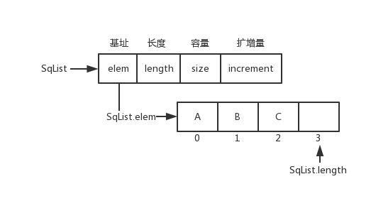
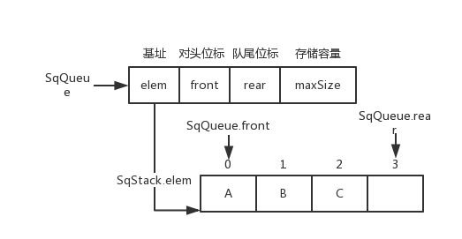
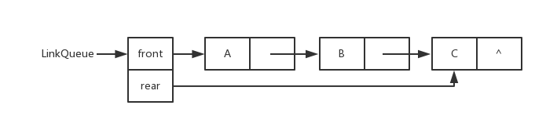
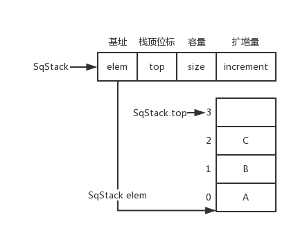
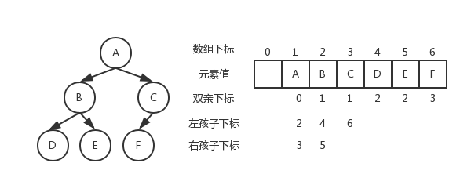
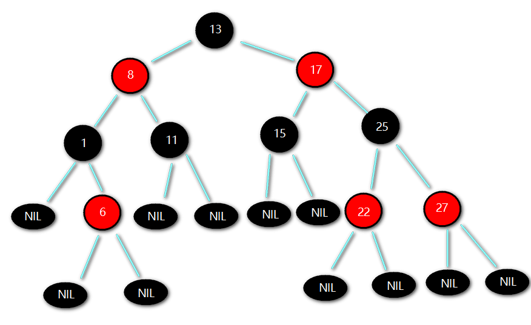
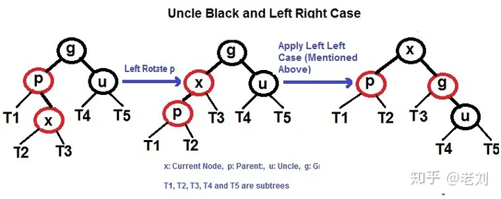
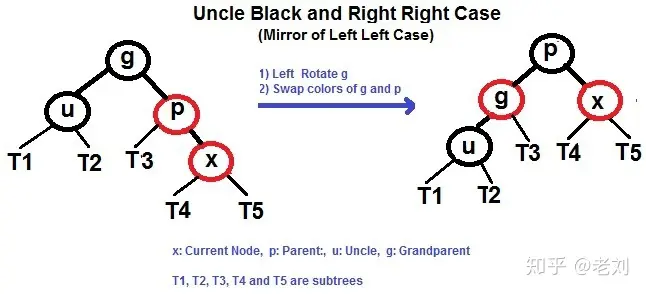
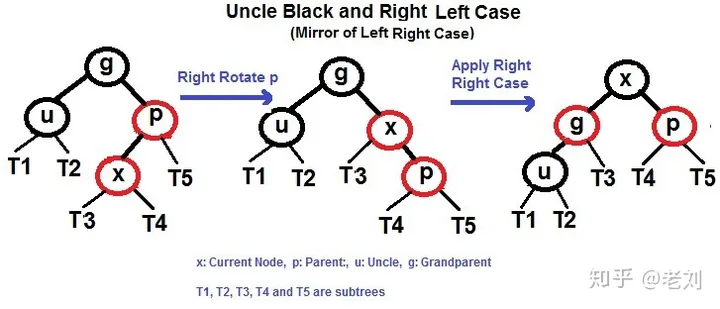
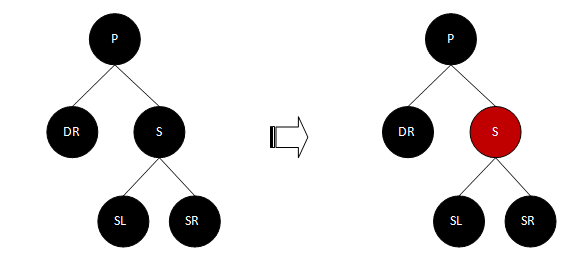

## 定义

数据结构分为**逻辑结构**和**物理结构**。  

- 逻辑结构：指数据元素之间逻辑关系的数据结构，这里的逻辑关系是指数据元素之间的前后间关系，与数据在计算机中的存储位置无关。
- 物理结构：指数据的逻辑结构在计算机存储空间中的存放形式称为数据的物理结构，也叫做存储结构。

### 逻辑结构
数据的**逻辑结构**主要分为**线性结构**和**非线性结构**。  

- 线性结构：数据结构的元素之间存在一对一线性关系，所有结点都最多只有一个直接前趋结点和一个直接后继结点。常见的有数组、队列、链表、栈。
- 非线性结构：各个结点之间具有多个对应关系，一个结点可能有多个直接前趋结点和多个直接后继结点。常见的有多维数组、广义表、树结构和图结构等。

### 物理结构
数据的**物理结构**（以后我都统一称存储结构），表示数据元素之间的逻辑关系，一种数据结构的逻辑结构根据需要可以表示成多种存储结构，常用的存储结构有：  

- **顺序存储**：存储顺序是连续的，在内存中用一组地址连续的存储单元依次存储线性表的各个数据元素。
- **链式存储**：在内存中的存储元素不一定是连续的，用任意地址的存储单元存储元素，元素节点存放数据元素以及通过指针指向相邻元素的地址信息。
- **索引存储**：除建立存储结点信息外，还建立附加的索引表来标识节点的地址。索引表由若干索引项组成。
- **散列存储**：又称Hash存储，由节点的关键码值决定节点的存储地址。

## 线性结构

### 数组（Array）

一种使用连续内存，存储线性数据的结构。


#### 顺序表（Sequence List）
用数组实现了队列List的功能模板，并可动态扩容

[SqList.cpp](https://github.com/su-dd/learning/blob/main/src/DataStructure/SqList.cpp)
顺序表数据结构和图片
```cpp
//顺序列表的类型
typedef struct {
    ElemType *elem; // 队列首指针
    int length;     // 队列中元素个数
    int size;       // 队列大小
    int increment;  // 扩增大小
} SqList;
```


### 链表（Linked List）

一种使用非连续内存，存储线性数据的结构。

在内存的的表现为：

数据结构：
```cpp
typedef struct LNode {
    ElemType data;
    struct LNode *next;
} LNode, *LinkList;
```
##### 单链表（Link List）

##### 双向链表（Du-Link-List）

##### 循环链表（Cir-Link-List）


### 队列（Queue）

一种先进先出（FIFO，First in First out）的线性结构；


#### 数组队列
数据结构
```cpp
typedef struct {
	ElemType * elem;
	int front;
	int rear;
	int maxSize;
}SqQueue;
```

**非循环队列**

```cpp
SqQueue.rear++
```

**循环队列**

```cpp
SqQueue.rear = (SqQueue.rear + 1) % SqQueue.maxSize
```

#### 链队列



### 栈（Stack）

一种后进先出（LIFO，Last in First out）的线性结构；


#### 顺序栈

用数组实现了栈的功能模板，并可动态扩容

[SqStack.cpp](https://github.com/su-dd/learning/blob/main/src/DataStructure/SqStack.cpp)
顺序栈数据结构和图片
```cpp
//顺序栈的类型
typedef struct {
    ElemType *elem; // 栈底指针
    int top;        // 栈顶
    int size;       // 当前大小
    int increment;  // 扩增
} SqSrack;
```


## 非线性结构
### 树（Tree）

树形结构是一种层级式的数据结构，由顶点（节点）和连接它们的边组成。  
数的结构特点是：  

- 每个节点有零个或多个子节点；
- 没有父节点的节点称为根节点；
- 每一个非根节点有且只有一个父节点；
- 除了根节点外，每个子节点可以分为多个不相交的子树。

#### 二叉树
- 每个结点最多有两颗子树，结点的度最大为2。
- 左子树和右子树是有顺序的，次序不能颠倒。
- 即使某结点只有一个子树，也要区分左右子树。
- 每个结点的值均大于其左子树上任意一个结点的值。比如 根结点的值。根结点100大于其左子树上的30，18和16。
- 每个结点的值均小于其右子树上任意 一个结点的值。比如根结点 100 小于其右子树上的 120、130 和 135。


##### 存储结构

[BinaryTree.cpp](https://github.com/su-dd/learning/blob/main/src/DataStructure/BinaryTree.cpp)

二叉树数据结构

```c
typedef struct BiTNode
{
    TElemType data;
    struct BiTNode *lchild, *rchild;
}BiTNode, *BiTree;
```

##### 顺序存储

二叉树顺序存储图片



##### 链式存储

二叉树链式存储图片


##### 遍历方式

**DLR--前序遍历**

根在前，从左往右，一棵树的根永远在左子树前面，左子树又永远在右子树前面 


```cpp
	void pre_order(BiTree Node)//前序遍历递归算法
	{
		if (Node == NULL)
			return;
		printf("%c ", Node->data);//显示节点数据，可以更改为其他操作。在前面
		pre_order(Node->lchild);
		pre_order(Node->rchild);
	}****
```

**LDR--中序遍历**

根在中，从左往右，一棵树的左子树永远在根前面，根永远在右子树前面


```cpp
	void middle_order(BiTree Node)//中序遍历递归算法
	{
		if (Node == NULL)
			return;
		middle_order(Node->lchild);
		printf("%c ", Node->data);// 显示节点数据，可以更改为其他操作。在中间
		middle_order(Node->rchild);
	}
```

**LRD--后序遍历**

根在后，从左往右，一棵树的左子树永远在右子树前面，右子树永远在根前面


```cpp
	void post_order(BiTree Node)//后序遍历递归算法
	{
		if (Node == NULL)
			return;
		post_order(Node->lchild);
		post_order(Node->rchild);
		printf("%c ", Node->data);// 显示节点数据，可以更改为其他操作。在最后
	}
```

**层次遍历**

一层一层的遍历当前树；

一般通过中间容器存储一个层级的节点，实现层级变量


#### 满二叉树

除最后一层无任何子节点外，每一层上的所有结点都有两个子结点二叉树。或者说：一个二叉树，如果每一个层的结点数都达到最大值，则这个二叉树就是满二叉树。或者说，如果一个二叉树的层数为K，且结点总数是(2^k) -1 ，则它就是满二叉树。


#### 完全二叉树

完全二叉树是效率很高的数据结构，完全二叉树是由满二叉树而引出来的。对于深度为K的，有n个结点的二叉树，当且仅当其每一个结点都与深度为K的满二叉树中编号从1至n的结点一一对应时称之为完全二叉树。

或者说：若设二叉树的深度为h，除第 h 层外，其它各层 (1～h-1) 的结点数都达到最大个数，第 h 层所有的结点都连续集中在最左边，这就是完全二叉树。


#### 堆（Heap）

堆比较特殊，是一种图的树形结构。被用于实现“优先队列”(priority queues)，优先队列是一种数据结构，可以自由添加数据，但取出数据时要从最小值开始按顺 序取出。在堆的树形结构中，各个顶点被称为“结点”(node)，数据就存储在这些结点中。  

只要满足下面两个特点的树形结构就是堆：  

- 堆是一个完全二叉树（所谓完全二叉树就是除了最后一层其他层的节点个数都是满的）。
- 大顶堆：根 >= 左 && 根 >= 右
- 小顶堆：根 <= 左 && 根 <= 右


#### 二叉查找树（二叉排序树，二叉搜索树）

值：左 < 根 < 右

1. 若左子树不空，则左子树上所有结点的值均小于它的根结点的值；  
2. 若右子树不空，则右子树上所有结点的值均大于它的根结点的值；  
3. 左、右子树也分别为二叉排序树；  

##### 二叉搜索树的搜索性能

在最好的情况下，二叉搜索树的查找效率比较高，是 O(logn)，其访问性能近似于二分法；

但最差时候会是 O(n)，比如插入的元素是有序的，生成的二叉搜索树就是一个链表，树的一条腿特变长，这种情况下，需要遍历全部元素才行


##### 删除
- 删除节点是树叶，则直接删除；
- 删除的节点只有一个子节点，此时只需要将删除节点的上一个节点的指向该节点的指针指向该节点唯一的子节点；
- 删除的节点有两个子节点（递归）
	- 将该节点右子树中最小的一个节点的值覆盖该节点中的值，然后再删除该节点的右子树中的最小的那个子节点
	- 将该节点左子树中最大的一个节点的值覆盖该节点中的值，然后再删除该节点的左子树中的最大的那个子节点

#### 平衡二叉树（AVL树）

[AVLTree.cpp](https://github.com/su-dd/learning/blob/main/src/DataStructure/AVLTree.cpp)

定义：| 左子树树高 - 右子树树高 | <= 1

平衡二叉树的提出就是为了保证树不至于出现二叉查找树的极端一条腿长现象，尽量保证两条腿平衡。因此它的定义如下：

定义：平衡二叉树要么是一棵空树，要么保证左右子树的高度之差不大于 1，并且子树也必须是一棵平衡二叉树。


**查找效率为：**


##### 最小失衡树

平衡二叉树插入新结点导致失衡的子树：

##### 右旋左旋

  

**图解代码**


##### 调整

**LL型**（根的左孩子的左子树插入导致不平衡）：根的左孩子右旋


**RR型**（根的右孩子的右子树插入导致不平衡）：根的右孩子左旋


**LR型**（根的左孩子的右子树插入导致不平衡）：根的左孩子左旋，再右旋


**RL型**（根的右孩子的左子树插入导致不平衡）：右孩子的左子树右旋，再左旋


##### 删除

1. 删除的节点有右子树，将该节点右子树中最小的一个节点的值覆盖该节点中的值；
2. 删除的节点只有左子树，此时只需要将删除节点的上一个节点的指向该节点的指针指向该节点唯一的子节点；
3. 删除节点是树叶，则直接删除；
4. 计算AVL的高度，做旋转调整

#### 红黑树

[RedBlackTree.cpp](https://github.com/su-dd/learning/blob/main/src/DataStructure/RedBlackTree.cpp)

首先红黑树（RBT）先是一个二叉搜索树（BST），他是解决二叉搜索树单链情况，区别于二叉平衡树（AVL）的另一种办法；

##### 红黑树的特征是什么？

可以按照括号里边的分类，记住 红黑树的几个原则：

- （**颜色属性**）性质1：节点非黑即红
- （**根属性**）性质2：根节点一定是黑色
- （**叶子属性**）性质3：叶子节点（NIL）一定是黑色
- （**红色属性**）性质4：每个红色节点的两个子节点，都为黑色。(从每个叶子到根的所有路径上不能有两个连续的红色节点)
- **（黑色属性）性质5：** 从任一节点到其每个叶子的所有路径，都包含相同数目的黑色节点。



**红色属性** 说明，红色节点的孩子，一定是黑色。 但是，RBTree 黑色节点的孩子，可以是红色，也可以是黑色；

**黑色属性**，可以理解为**平衡特征**， 如果满足不了平衡特征，就要进行平衡操作。

**新插入的节点一定是红色，且新节点的Parent也是红色；这时，需要调整**
##### 调整

设我们插入的新节点为 X

 **变色**
 1. 如果 X 是根结点(root)，则标记为黑色
 2. 如果 X 的 parent 为红，同时 uncle是红

 	

**左旋右旋**：如果 X 的 parent 为红，同时 uncle是黑色

- **LL** ：Parent节点右旋，变色
	
	

- **LR** ：先X节点左旋，再右旋，变色
	 
	 
	
- **RR** ：Parent节点右旋，变色
	 
	 
	
- **RL** ：先X节点右旋，再左旋，变色
	 
	 
	

##### 删除

1. 删除的节点的左、右子树都非空；
2. 删除的节点的左子树为空树，右子树非空；
3. 删除的节点的右子树为空树，左子树非空；
4. 删除的节点的左、右子树都为空树；

分析：1 可以通过，替换 中序遍历的 前置位的值，或后置位的值。转换为 2,3,4 ； 后面只讨论2,3,4

**设删除节点为D**
###### D为红色


分析：D为红色则必定为叶子，删除D即可

###### D为黑色叶子，兄弟为红


当前状态，D下面两个位Nil，S为红，SL和SR必定不为空。

需要将P左转，做变色


###### D为黑色叶子，兄弟为黑色叶子

- **P为黑**



分析：S改为红色

- **P为红**


分析：结果同上，S改黑，P改为黑色。

###### D为黑色叶子，兄弟为黑色，有子

- **SL为红，SR颜色任意；**(对于该情况的处理，其实我们不关心P的颜色)


分析：将S右旋转；接着将SL改为P的颜色，P的颜色改为黑色(用这个黑色来填补DR分支的黑节点数)；将P左旋转

- **SR为红，SL颜色任意；**(对于该情况的处理，其实我们不关心P的颜色)


分析：将S由黑色改为P的颜色；将SR由红色改为黑色；将P的颜色改为黑色(用该黑色来填补DR分支缺失的黑节点数)；将P节点左旋转；

###### D为黑色，有一个红色叶子


分析：D的左右子，有一个有值且为红色时，用它替换D，变色即可

##### 应用
- 关联数组：如 STL 中的 map、set

##### 红黑树、二叉树搜索树的区别？

- 红黑树放弃了追求完全平衡，追求大致平衡，在与平衡二叉树的时间复杂度相差不大的情况下，保证每次插入最多只需要三次旋转就能达到平衡，实现起来也更为简单。
- 平衡二叉树追求绝对平衡，条件比较苛刻，实现起来比较麻烦，每次插入新节点之后需要旋转的次数不能预知。

[红黑树，超强动静图详解，简单易懂 - 知乎 (zhihu.com)](https://zhuanlan.zhihu.com/p/79980618)


#### B树（B-tree）、B+树（B+-tree）


##### 特点

- 一般化的二叉查找树（binary search tree）
- “矮胖”，内部（非叶子）节点可以拥有可变数量的子节点（数量范围预先定义好）

##### 应用

- 大部分文件系统、数据库系统都采用B树、B+树作为索引结构

##### 区别

- B+树中只有叶子节点会带有指向记录的指针（ROWID），而B树则所有节点都带有，在内部节点出现的索引项不会再出现在叶子节点中。
- B+树中所有叶子节点都是通过指针连接在一起，而B树不会。

##### B树的优点

对于在内部节点的数据，可直接得到，不必根据叶子节点来定位。

##### B+树的优点

- 非叶子节点不会带上 ROWID，这样，一个块中可以容纳更多的索引项，一是可以降低树的高度。二是一个内部节点可以定位更多的叶子节点。
- 叶子节点之间通过指针来连接，范围扫描将十分简单，而对于B树来说，则需要在叶子节点和内部节点不停的往返移动。

> B 树、B+ 树区别来自：[differences-between-b-trees-and-b-trees](https://stackoverflow.com/questions/870218/differences-between-b-trees-and-b-trees)、[B树和B+树的区别](https://www.cnblogs.com/ivictor/p/5849061.html)

[一文详解 B-树，B+树，B*树 - 知乎 (zhihu.com)](https://zhuanlan.zhihu.com/p/98021010)

##### 红黑树、B 树、B+ 树的区别？

- 红黑树的深度比较大，而 B 树和 B+ 树的深度则相对要小一些
- B+ 树则将数据都保存在叶子节点，同时通过链表的形式将他们连接在一起。

### 散列表（Hash）

散列表又叫哈希表，存储的是由键(key)和值(value)组 成的数据，根据键直接访问存储在内存存储位置的数据结构。


从图中可以看出，左边很明显是个数组，数组的每个成员包括一个指针，指向一个链表的头，当然这个链表可能为空，也可能元素很多。我们根据元素的一些特征把元素分配到不同的链表中去，也是根据这些特征，找到正确的链表，再从链表中找出这个元素。

**哈希表查找数据的公式为：记录的存储位置=f(key)** 

这里的对应关系 f 成为散列函数，又称为哈希 (hash函数)，而散列表就是把Key通过一个固定的算法函数既所谓的哈希函数转换成一个整型数字，然后就将该数字对数组长度进行取余，取余结果就当作数组的下标，将value存储在以该数字为下标的数组空间里，这种存储空间可以充分利用数组的查找优势来查找元素，所以查找的速度很快。

#### 概念

哈希函数：`H(key): K -> D , key ∈ K`
#### 构造方法
- 直接定址法
- 除留余数法
- 数字分析法
- 折叠法
- 平方取中法
#### 冲突处理方法
- 链地址法：key 相同的用单链表链接
- 开放定址法
    - 线性探测法：key 相同 -> 放到 key 的下一个位置，`Hi = (H(key) + i) % m`
    - 二次探测法：key 相同 -> 放到 `Di = 1^2, -1^2, ..., ±（k)^2,(k<=m/2）`
    - 随机探测法：`H = (H(key) + 伪随机数) % m`

#### 线性探测的哈希表数据结构实现
 
[HashTable.cpp](https://github.com/su-dd/learning/blob/main/src/DataStructure/HashTable.cpp)

线性探测的哈希表数据结构和图片
```cpp
typedef char KeyType;
// 哈希表中的记录类型
typedef struct {
	KeyType key;
}RcdType;

// 哈希表类型
typedef struct {
	RcdType* rcd;	// 哈希容器指针
	int size;	// 容量
	int count;	// 当前大小
	int* tag;	// 满空标识，有值1，无值0，删除-1 哈希表用过的同一个key，只能在一个位置，所以需要-1这个值
}HashTable;
```


### 图（Graph）

由顶点和连接每对顶点的边所构成的图形就是图

圆圈叫作“顶点”(Vertex，也叫“结点”)，连接顶点的线叫作“边”（Edge）。也就是说，由顶点和连接每对顶点的边所构成的图形就是图。 图按照顶点指向的方向可分为无向图和有向图，像下面的就叫无向图。 图在存储数据上有着比较复杂和高效的算法，分别有邻接矩阵 、邻接表、十字链表、邻接多重表、边集数组等存储结构。常见的图遍历算法就是广度优先算法和深度优先算法。


#### 图的存储

##### 邻接矩阵

图的邻接矩阵(Adjacency Matrix) 存储方式是用两个数组来表示图。一个一维数组存储图中顶点信息，一个二维数组(称为邻接矩阵)存储图中的边或弧的信息。

设图有n个顶点，则邻接矩阵A是一个n ∗ n n*nn∗n的方阵，定义为:


带权图：


无向图和它的邻接矩阵：


有向图和它的邻接矩阵：


有向网图和它的邻接矩阵：


对于未联通矩阵节点，一般使用一个固定的超大值来表示，例

```cpp
#define INFINITY 65535
```


**定义：**
```cpp
#define MaxVertexNum 100	//顶点数目的最大值
typedef char VertexType;	//顶点的数据类型
typedef int EdgeType;	//带权图中边上权值的数据类型
typedef struct{
	VertexType Vex[MaxVertexNum];	//顶点表
	EdgeType Edge[MaxVertexNum][MaxVertexNum];	//邻接矩阵，边表
	int vexnum, arcnum;	//图的当前顶点数和弧树
}MGraph;

```


##### 邻接表

邻接表，是指对图G中的每个顶点vi 建立一个单链表，第i 个单链表中的结点表示依附于顶点vi 的边

> 邻接表：记录当前迭代的出度
> 
> 逆邻接表：记录当前迭代的入度

无向图的邻接表的实例：


有向图的邻接表的实例


**定义：**
```cpp
#define MAXVEX 100	//图中顶点数目的最大值
type char VertexType;	//顶点类型应由用户定义
typedef int EdgeType;	//边上的权值类型应由用户定义
/*边表结点*/
typedef struct EdgeNode{
	int adjvex;	//该弧所指向的顶点的下标或者位置
	EdgeType weight;	//权值，对于非网图可以不需要
	struct EdgeNode *next;	//指向下一个邻接点
}EdgeNode;

/*顶点表结点*/
typedef struct VertexNode{
	Vertex data;	//顶点域，存储顶点信息
	EdgeNode *firstedge	//边表头指针
}VertexNode, AdjList[MAXVEX];

/*邻接表*/
typedef struct{
	AdjList adjList;
	int numVertexes, numEdges;	//图中当前顶点数和边数
}
```

##### 十字链表

结合了 邻接表和 逆邻接表的 一种有向图的 链式存储结构；


> **firstin** 表示入边表头指针，指向该顶点的入边表中第一个结点
> **firstout** 表示出边表头指针，指向该顶点的出边表中的第一个结点

> **tailvex** 是指弧起点在顶点表的下标
> **headvex** 是指弧终点在顶点表中的下标
> **headlink** 是指入边表指针域，指向终点相同的下一条边，
> **taillink** 是指边表指针域，指向起点相同的下一条边。
> 如果是网，还可以再增加一个 **weight** 域来存储权值。

**解决的问题：** 邻接表和逆邻接表，不好统计出度和入度的问题。

十字链表的好处就是因为把邻接表和逆邻接表整合在了一起

这样既容易找到以V1 为尾的弧，也容易找到以V1为头的弧；因而容易求得顶点的出度和入度。

而且它除了结构复杂一点外，其实创建图算法的时间复杂度是和邻接表相同的，因此，在有向图的应用中，十字链表是非常好的数据结构模型。

##### 邻接多重表

邻接多重表是无向图的另一种链式存储结构；


**data** 域存储该顶点的相关信息，**firstedge** 域指示第一条依附于该顶点的边

**ivex** 和 **jvex** 是与某条边依附的两个顶点在顶点表中下标。

**ilink** 指向依附顶点ivex的下一条边

**jlink** 指向依附顶点jvex的下一条边

**解决的问题：** 邻接表的无向图删除边比较慢的问题；


##### 边集数组

边集数组是由两个一维数组构成。一个是存储顶点的信息;另一个是存储边的信息，这个边数组每个数据元素由一条边的起点下标(begin)、 终点下标(end)和权(weight)组成

显然边集数组关注的是边的集合，在边集数组中要查找一个顶点的度需要扫描整个边数组，效率并不高。因此它更适合对边依次进行处理的操作，而不适合对顶点相关的操作


#### 图的遍历

**定义：** 从图中某一顶点出发访遍图中其余顶点，且使每一个顶点仅被访问一次， 这一过程就叫做图的遍历(Traversing Graph)

##### 深度遍历DFS

深度优先遍历(Depth First Search)，也有称为深度优先搜索，简称为DFS

思路：深度优先搜索类似于树的先序遍历；uuk首先访问图中某一起始顶点v，然后由v出发，访问与v邻接且未被访问的任一顶点w_1，再访问与w_1 邻接且未被访问的任一顶点…重复上述过程。当不能再继续向下访问时，依次退回到最近被访问的顶点，若它还有邻接顶点未被访问过，则从该点开始继续上述搜索过程，直至图中所有顶点均被访问过为止。

```cpp
bool visited[MAX_VERTEX_NUM];	//访问标记数组
/*从顶点出发，深度优先遍历图G*/
void DFS(Graph G, int v){
	int w;
	visit(v);	//访问顶点
	visited[v] = TRUE;	//设已访问标记
	//FirstNeighbor(G,v):求图G中顶点v的第一个邻接点，若有则返回顶点号，否则返回-1。
	//NextNeighbor(G,v,w):假设图G中顶点w是顶点v的一个邻接点，返回除w外顶点v
	for(w = FirstNeighbor(G, v); w>=0; w=NextNeighor(G, v, w)){
		if(!visited[w]){	//w为u的尚未访问的邻接顶点
			DFS(G, w);
		}
	}
}
/*对图进行深度优先遍历*/
void DFSTraverse(MGraph G){
	int v; 
	for(v=0; v<G.vexnum; ++v){
		visited[v] = FALSE;	//初始化已访问标记数据
	}
	for(v=0; v<G.vexnum; ++v){	//从v=0开始遍历
		if(!visited[v]){
			DFS(G, v);
		}
	}
}

```

 深度优先遍历的结果为a b d e h c f g 

###### DFS算法的性能分析

DFS算法是一个递归算法，需要借助一个递归工作栈，故其空间复杂度为O ( V ) O(V)O(V)。
对于n个顶点e条边的图来说，邻接矩阵由于是二维数组，要查找每个顶点的邻接点需要访问矩阵中的所有元素，因此都需要O(V^2))的时间。而邻接表做存储结构时，找邻接点所需的时间取决于顶点和边的数量，所以是O(V+E)。 显然对于点多边少的稀疏图来说，邻接表结构使得算法在时间效率上大大提高。
对于有向图而言，由于它只是对通道存在可行或不可行，算法上没有变化，是完全可以通用的。

###### 深度优先的生成树和生成森林

深度优先搜索会产生一棵深度优先生成树。 当然，这是有条件的，即对连通图调用DFS才能产生深度优先生成树，否则产生的将是深度优先生成森林。基于邻接表存储的深度优先生成树是不唯一的 


##### 广度遍历BFS

广度优先遍历(Breadth First Search)，又称为广度优先搜索，简称BFS

**广度优先遍历就类似于树的层序遍历了。**  

广度优先搜索是一种分层的查找过程，每向前走一步可能访问一批顶点，不像深度优先搜索那样有往回退的情况，因此它不是一个递归的算法。为了实现逐层的访问，算法必须借助一个辅助队列，以记忆正在访问的顶点的下一层顶点。

```cpp
/*邻接矩阵的广度遍历算法*/
void BFSTraverse(MGraph G){
	int i, j;
	Queue Q;
	for(i = 0; i<G,numVertexes; i++){
		visited[i] = FALSE;
	}
	InitQueue(&Q);	//初始化一辅助用的队列
	for(i=0; i<G.numVertexes; i++){
		//若是未访问过就处理
		if(!visited[i]){
			vivited[i] = TRUE;	//设置当前访问过
			visit(i);	//访问顶点
			EnQueue(&Q, i);	//将此顶点入队列
			//若当前队列不为空
			while(!QueueEmpty(Q)){
				DeQueue(&Q, &i);	//顶点i出队列
				//FirstNeighbor(G,v):求图G中顶点v的第一个邻接点，若有则返回顶点号，否则返回-1。
				//NextNeighbor(G,v,w):假设图G中顶点w是顶点v的一个邻接点，返回除w外顶点v
				for(j=FirstNeighbor(G, i); j>=0; j=NextNeighbor(G, i, j)){
					//检验i的所有邻接点
					if(!visited[j]){
						visit(j);	//访问顶点j
						visited[j] = TRUE;	//访问标记
						EnQueue(Q, j);	//顶点j入队列
					}
				}
			}
		}
	}
}

```

 广度优先遍历的结果为a b c d e f g h 

###### BFS算法性能分析

无论是邻接表还是邻接矩阵的存储方式，BFS 算法都需要借助一个辅助队列Q, n个顶点均需入队一次，在最坏的情况下，空间复杂度为 O(V)。

采用邻接表存储方式时，每个顶点均需搜索一次(或入队一次)， 在搜索任一顶点的邻接点时，每条边至少访问一次，算法总的时间复杂度为O(V + E)。

采用邻接矩阵存储方式时，查找每个顶点的邻接点所需的时间为O(V)，故算法总的时间复杂度为 O(V^2)


> 注意：图的邻接矩阵表示是唯一的，但对于邻接表来说，若边的输入次序不同，生成的邻接表也不同。因此，对于同样一个图，基于邻接矩阵的遍历所得到的DFS序列和BFS序列是唯一的，基于邻接表的遍历所得到的DFS序列和BFS序列是不唯一的。

#### 最小生成树

**生成树：** 一个连通图的生成树是一个极小的连通子图，它包含图中全部的n个顶点，但只有构成一棵树的n-1条边。

**最小生成树：** 一个 **带权图** 的最小生成树，就是原图中**边的权值最小的生成树** ，所谓最小是指边的权值之和小于或者等于其它生成树的边的权值之和。

常见的最小生成树算法，都是贪心算法的思路

```cpp
GENERIC_MST(G){
	T=NULL;
	while T 未形成一棵生成树;
		do 找到一条最小代价边(u, v)并且加入T后不会产生回路;
			T=T U (u, v);
}

```

[MiniSpanTree.cpp](https://github.com/su-dd/learning/blob/main/src/DataStructure/MiniSpanTree.cpp)

##### 普里姆（Prim）算法

从一个顶点出发，在保证不形成回路的前提下，每找到并添加一条最短的边，就把当前形成的连通分量当做一个整体或者一个点看待，然后重复“找最短的边并添加”的操作


普里姆（Prim）算法一般基于**邻接矩阵**：


```cpp
typedef struct MGraph{
    VertexType vex[MaxVertexNum];	//顶点表
    EdgeType arc[MaxVertexNum][MaxVertexNum];	//邻接矩阵
    int vexnum, arcnum;	//图的当前顶点数和弧树
}MGraph;

/*Prim算法生成最小生成树*/
void MiniSpanTree_Prim(MGraph& G) {
    int adjvex[MaxVertexNum];	//保存相关顶点下标；adjvex数组的值是当前节点，adjvex数组的下标 为指向的节点
    int lowcost[MaxVertexNum];	//保存相关顶点间边的权值 
    lowcost[0] = 0;	//初始化第一个权值为0，即v0加入生成树
    //lowcost的值为0，在这里就是此下标的顶点已经加入生成树
    adjvex[0] = 0;	//初始化第一个顶点下标为0

    for(int i=1; i<G.vexnum; i++) {
        lowcost[i] = G.arc[0][i];	//将v0顶点与之组成边的权值存入数组
        adjvex[i] = 0;	//初始化都为v0的下标
    }

    for(int i=1; i<G.vexnum; i++){
        int min = INF;	//初始化最下权值为∞，通常设置一个不可能的很大的数字
        int j = 1, k = 0;
        //循环全部顶点
        while(j < G.vexnum){
            //如果权值不为0且权值小于min
            if(lowcost[j] != 0 && lowcost[j] < min){
                min = lowcost[j];	//则让当前权值成为最小值
                k = j;	//将当前最小值的下标存入k
            }
            j++;
        }

        printf("(%d-> %d, cost %d) \n", adjvex[k], k, min);	//打印当前顶点边中权值的最小边

        for(int i=1; i<G.vexnum; i++){
            //若下标为k顶点各边权值小于此前这些顶点未被加入生成树权值
            if(lowcost[i] != 0 && G.arc[k][i] < lowcost[i]){
                lowcost[i] = G.arc[k][i];	//将较小权值存入lowcost ； 这里会将G.arc[k][K]的值 0 做赋值；让已经输出的值不再输出
                adjvex[i] = k;	//将下标为k的顶点存入adjvex
            }
        }
    }
}
```

##### 克鲁斯卡尔（Kruskal）算法

以边为目标去构建，每次去找最小权值、同时不会形成环路的边来构建生成树；知道所有的点都所有的顶点都被关联上


克鲁斯卡尔（Kruskal）算法一般基于**边集数组**：


```cpp
struct EdgesGraph // 定义边集数组
{
    // 边定义
    struct Edge {
        int begin;	// 起点下标
        int end;	// 终点下标
        int weight;	// 权重
    };

    VertexType vertex[MaxVertexNum];	//顶点表
    Edge edges[MAXEDGE];	// 边集数组
    int vexnum, edgenum;	//图的当前顶点数和弧数
};

/*Kruskar算法生成最小生成树*/
void MiniSpanTree_Kruskal(EdgesGraph G) {
    int parent[MaxVertexNum];	//定义一数组用来判断边与边是否形成环路
    for (int i = 0; i < G.vexnum; i++) {
        parent[i] = 0;	//初始化数组为0
    }
    for (int i = 0; i < G.edgenum; i++) {
        int n = Find(parent, G.edges[i].begin);
        int m = Find(parent, G.edges[i].end);
        /*假如n与m不等，说明此边没有与现有生成树形成环路*/
        if (n != m) {
            /*将此边的结尾顶点放入下标为起点的parent中，表示此顶点已经在生成树集合中*/
            parent[n] = m;
            printf("(%d->%d, cost %d) \n", G.edges[i].begin, G.edges[i].end, G.edges[i].weight);
        }
    }
}

/*查找连线顶点的尾部下标*/
int Find(int* parent, int f) {
    while (parent[f] > 0) {
        f = parent[f];
    }
    return f;
}
```

#### 最短路径

非网图：两顶点之间经过的边数最少的路径

网图：两顶点之间经过的边上权值之和最少的路径，并且我们称路径上的第一个顶点是源点，最后一个顶点是终点

##### 迪杰斯特拉( Dijkstra )算法（单源最短路径）

> 优点：**效率较高**，[时间复杂度](https://so.csdn.net/so/search?q=%E6%97%B6%E9%97%B4%E5%A4%8D%E6%9D%82%E5%BA%A6&spm=1001.2101.3001.7020)为**O(n^2)**。
> 
> 缺点：只能求**一个顶点**到**所有顶点**的**最短路径**。 （**单源最短路**）

主要特点是以起始点为中心向外层层扩展(广度优先遍历思想)，直到扩展到终点为止

1、先选定一个根结点，并选定一个数组，先确定未遍历前的初始距离，把距离最短的邻接结点选定为中间结点，并标记访问过，开始往下遍历，挨个访问那个中间结点的邻接结点。计算出根结点到中间结点+中间结点到新邻接结点的距离，作为新距离，对比新距离和旧距离，如果新距离大，则把新距离替换掉旧距离，否则不变。

2、一轮访问结束后，从未标记的结点中选定距离最短的，把它作为中间结点，继续往下访问。若都标记过，则算法结束。


##### 弗洛伊德( Floyd )算法（多源最短路径）

> 优点：求**所有顶点**到**所有顶点**的**最短路径**。（**多源最短路**）
> 
> 缺点：**效率较低**，时间复杂度为**O(n^3)**

Floyd 算法是一个基于「贪心」、「动态规划」求一个图中 **所有点到所有点** 最短路径的算法，时间复杂度 O(n3)

思路：循环每个节点，计算通过当前节点连接后，其他两点之间的距离是否变的更近。如果更新就跟新他们的距离


#### 拓扑排序

##### 定义

在一个表示工程的有向图中，用顶点表示活动，用弧表示活动之间的优先关系，这样的有向图为顶点表示活动的网，我们称为AOV网( Activity On VertexNetwork)

**拓扑排序，其实就是对一个有向图构造拓扑序列的过程**。每个AOV网都有一个或多个拓扑排序序列

##### 实现

- ①从AOV网中选择一个没有前驱的顶点并输出。
- ②从网中删除该顶点和所有以它为起点的有向边。
- ③重复①和②直到当前的AOV网为空或当前网中不存在无前驱的顶点为止。如果输出顶点数少了，哪怕是少了一个，也说明这个网存在环(回路)，不是AOV网。


```cpp
bool TopologicalSort(Graph G){
	InitStack(S);	//初始化栈，存储入度为0的顶点
	for(int i=0; i<G.vexnum; i++){
		if(indegree[i] == 0){
			Push(S, i);	//将所有入度为0的顶点进栈
		}
	}
	int count = 0;	//计数，记录当前已经输出的顶点数
	while(!IsEmpty(S)){	//栈不空，则存在入度为0的顶点
		Pop(S, i);	//顶点元素出栈
		printf("%d ", i);	//输出顶点i
		count++;
		for(p=G.vertices[i].finstarc; p; p=p->nextarc){
			//将所有i指向的顶点的入度减1，并且将入度减为0的顶点压入栈S
			v = p->adjvex;
			if(!--indegree[v]){
				Push(S, v);	//入度为0，则入栈
			}
		}
	}
	if(count < G.vexnum){
		return false;	//输出顶点少了，有向图中有回路，排序失败
	}else{
		return true;	//拓扑排序成功
	}
}

```

深度优先遍历，也能实现拓扑排序

#### 关键路径

拓扑排序主要是为解决一个工程能否顺序进行的问题，但有时我们还需要解决工程完成需要的最短时间问题

##### 定义

在带权有向图中，以顶点表示事件，以有向边表示活动，以边上的权值表示完成该活动的开销(如完成活动所需的时间)，称之为用边表示活动的网络，简称**AOE网**

**AOE网具有以下两个性质：**

- ①只有在某顶点所代表的事件发生后，从该顶点出发的各有向边所代表的活动才能开始；
- ②只有在进入某顶点的各有向边所代表的活动都已结束时，该顶点所代表的事件才能发生。


在AOE网中仅有一个入度为0的顶点，称为开始**顶点(源点)**，它表示整个工程的开始；网中也仅存在一个出度为0的顶点，称为**结束顶点(汇点)**，它表示整个工程的结束。我们把路径上各个活动所持续的时间之和称为**路径长度**，从源点到汇点具有最大长度的路径叫**关键路径**，在关键路径上的活动叫**关键活动**。

##### 实现


[数据结构：图(Graph)【详解】_graph数据结构-CSDN博客](https://blog.csdn.net/Real_Fool_/article/details/114141377)