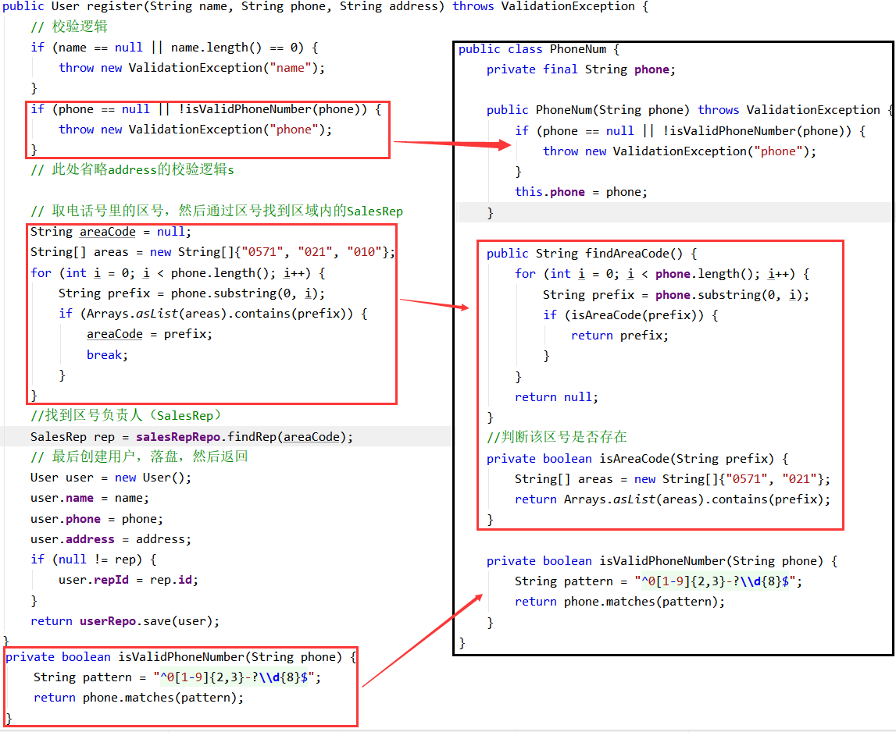

## 初识DDD

### DDD来源介绍

​领域建模和设计的重要性在很早之前就被一些软件开发人员所发现 ，Eric Evans将其定义为领域驱动设计（Domain-Driven Design，简称DDD）；近些年来这种自顶而下的设计方式越发被推崇。

本文以代码为引，从小处入手；同大家一起学习DDD。

### DDD架构的核心

**提倡以业务为核心，解耦外部依赖，分离业务复杂度和技术复杂度。**

### DDD适用场景

DDD虽好，但不要贪杯。在实践DDD时，有两个点需要明确。

1、**领域模型对设计能力要求很高，没把握用好，一个错误的抽象还不如不抽象，宁可不要用，也不要滥用，不要为了DDD而DDD。**

理解：DDD的学习和使用是有代价的，一个零DDD基础的团队，不要期望在一个项目中完美的使用DDD；应该是一步一步的引入DDD的思想。

2、**只有复杂的系统才需要系统DDD。**

理解：DDD是为了治理业务而生的。

这里的复杂分为三个层次：

1. 业务间有复杂的联动关系。
   
2. 系统需要持续维护，业务不断演化
   
3. 需要隔离技术复杂度的场景。

ddd的便捷，是基于业务抽象被不断复用的。如果业务抽象没有复用的必要，也没有系统引入ddd的必要。

只需要使用一次的工具，不需要系统引入ddd。
### 阅读前提

了解面向对象

### DDD基础概念概览

<iframe src="https://www.processon.com/view/link/629309f41efad45e083c557d" width="100%" height="800" frameborder="0" scrolling="No" leftmargin="0" topmargin="0"></iframe>


## 统一语言

领域模型的战略部分：

概念: 统一语言、子域划分、限界上下文

方法：原文分析、四色模型、事件风暴

### 生长出来的概念

1948年6月21日上午11点，在曼彻斯特大学，存储程序的计算机第一次在电子内存中存储了一段软件并成功执行了该软件。

软件的复杂度已经超出很多人的想想。WinXP,Win7代码月4千万行，win11代码已经为5千万行。

为了可以更好的治理代码，我们管理的代码的思想也在不断变化。

从【字节码】--> 【汇编】-->【面向过程】-->【面向对象】

**领域模型**本质上是**面向对象**方法的更为深入的使用。

这里先回顾什么是面向对象：

面向对象的基本逻辑就是将现实事务映射到代码中，在此基础上提出了封装、继承、多态。符合面向对象的代码会以更亲近软件开发者思考认知的方式运行，以更接近人类认知事物的方式进行生长。

随着软件行业的不断细分，软件需求一般不是开发者自行发现；而是由客户，产品经理等角色去提出。

领域模型解决的是让软件以更符合业务需求的方式去产生。

### 统一语言（UBIQUITOUS LANGUAGE）

统一语言是领域模型的第一步，也是会一直贯彻在整个过程中。

由于语言上存在鸿沟，领域专家们只能模糊地描述他们想要的东西，开发人员虽然努力去理解一个自己不熟悉的领域但也只能形成模糊的认识，结果就是各说各的话，或者都是一知半解，最后到上线前才会发现漏了这个漏了那个。

统一语言是指统一 产品、开发、测试等参与者，对业务认知统一。它是指通过浓缩后的领域语言。可表现为图，可以使用UML等方式；


## 贫血模型和充血模型

在领域模型的概念里，两种定义方式。

方式1 ： **失血模型**、**贫血模型**、**充血模型**、**涨血模型** 四种概念。

方式2：**贫血模型**、**充血模型** 两个概念。

这里以 方式2做阐述。 这里认为：过多的概念并不能支持好的代码的产出，从简单的概念里阐述好的行为和不好的行为即可。

### 贫血模型vs充血模型

**贫血模型**：也称贫血领域对象，指仅用作数据载体，而没有行为和动作的领域对象。

**充血模型**：也称充血领域对象，同时定义数据和行为的领域对象。

个人理解：

贫血模型：提供基本的数据支持，不包含实际业务逻辑。

充血模型：提供数据支持，同时提供具体业务逻辑支持。

### 举例说明

如：计算学生的BMI。

**贫血模型：**

```java
class Student {
    Long id;
    double height;
    double weight;

    public double getHeight() {...}
	public double getWeight() {...}
};

class ClassService {
    public double getBMIByStudentId(long id) {...}
};
```

**充血模型：**

```java
class Student {
    Long id;
    double height;
    double weight;

    public double getHeight() {...}
	public double getWeight() {...}
    public double getBMI() {...}
}
```

对比两者代码，容易发现：

1. 贫血模型的业务，放在Service中。
2. 充血模型的业务，放在DP中。

从业务重用上看：

充血模型，业务重用的最小个体是DP。

贫血模型，业务重用的最小个体为Service。如果Service包含其他业务就会导致不必要的依赖。

### 面向对象的角度

从OO的角度去审视贫血模型和充血模型，会发现：

贫血模型的本质是在一堆数据上建立一个一个业务流程，是一个面向过程的实现方式。

充血模型既有数据也有对应的行为，这是面向对象的。

### 如何选择

我们知道充血模型即要抽象属性，也要抽象行为；会比贫血模型更难设计。所以在选用时也有相应的偏好，或者有结合使用的情况。

 如果业务只是简单的CRUD，或者CRUD可以解决90%的业务情况。推荐使用贫血模型。其实大量的项目都是这样的简单项目。

但是如果在做复杂的项目，拥有复杂的业务时，我们就需要使用充血模型；

**DDD是基于好的抽象，宁愿不抽象，也不要固执的做出不合理的抽象。**

## 值对象、DP


这篇详细介绍 值对象、DP 的含义，以及如何使用DP优化现有代码。

### 值对象
首先了解第一个概念：值对象

《实现领域驱动设计》定义：

> 描述了领域中的一件东西
> 
> 不可变的
> 
> 将不同的相关属性组合成了一个概念整体
> 
> 当度量和描述改变时，可以用另外一个值对象予以替换
> 
> 可以和其他值对象进行相等性比较
> 
> 不会对协作对象造成副作用

简单来说：以对象的形式，在DDD中起到值的作用。

这里做一个类比的理解, 如果将一个复杂系统比做一个简单的程序。
```cpp
#include <iostream>
using namespace std;
int main()
{
    ***

    int a = 3;
    int b = 4;
    cout << a+b << endl;

    ***
    return 0;
}
```
上述代码中的int类型的a、b，就可以近似的理解为值对象。

### DP（Domain Primitive）

DP是在特定领域、拥有精准定义、可以自我验证、拥有行为的值对象（ValueObject）。 它是领域的最小组成部分。

DP三原则：
 - 让隐性的概念显性化
 - 让隐性的上下文显性化
 - 封装多对象行为

DP比较抽象，下面以实例的方式具体的介绍DP。
### 实例要求
一个简单的注册业务要求：

> 1、参数为 客户姓名、手机号、地区；需要 校验姓名、手机号、地区信息的有效性。
> 
> 2、根据手机号的归属地和所属运营商，查询得到关联的销售组信息，该销售组ID将作为用户的一个属性。
> 
> 3、据用户信息，构建用户对象；并存入数据库；

### 常见代码
```java
public class User {
    String name;
    String phone;
    String address;
    Long repId;
}

public class UserServiceImpl implements UserService {

    public User register(String name, String phone, String address) 
      throws ValidationException {
        // 校验逻辑
        if (name == null || name.length() == 0) {
            throw new ValidationException("name");
        }
        if (phone == null || !isValidPhoneNumber(phone)) {
            throw new ValidationException("phone");
        }
        // 此处省略address的校验逻辑

        // 取电话号里的区号，然后通过区号找到区域内的SalesRep
        String areaCode = null;
        String[] areas = new String[]{"0571", "021", "010"};
        for (int i = 0; i < phone.length(); i++) {
            String prefix = phone.substring(0, i);
            if (Arrays.asList(areas).contains(prefix)) {
                areaCode = prefix;
                break;
            }
        }
        //找到销售负责人（SalesRep）
        SalesRep rep = salesRepRepo.findRep(areaCode);

        // 最后创建用户，落盘，然后返回
        User user = new User();
        user.name = name;
        user.phone = phone;
        user.address = address;
        if (null != rep) {
          user.repId = rep.id;
        }

        return userRepo.save(user);
    }

    private boolean isValidPhoneNumber(String phone) {
        String pattern = "^0[1-9]{2,3}-?\\d{8}$";
        return phone.matches(pattern);
    }
}
```
找找问题？

### 认知问题
#### 1、接口调用错误不能在前期识别

具体来说调用函数：
```java
public User register(String name, String phone, String address) 
```
传参的错误,我们无法在编译前期知道,只能在业务运行到这来时，通过调试发现。

常见错误有：
- 参数顺序搞错


#### 2、大量的数据校验逻辑，导致的不稳定性
```java
// 校验逻辑
if (name == null || name.length() == 0) {
    throw new ValidationException("name");
}
if (phone == null || !isValidPhoneNumber(phone)) {
    throw new ValidationException("phone");
}
// 此处省略address的校验逻辑
```
代码这里已经有三个逻辑判断，这里存在如下问题：
1. 代码的位置不合适，当业务判断发生变化时，需要【修改】、【测试】注册逻辑。
2. 代码复用不方便。例：号码可能被多个阶段使用，这里需要多份代码。
3. 多个判断，测试用例条件翻倍。
4. 业务异常和校验异常不能被合理区分。

#### 3、胶水代码的存在，导致业务代码不清晰
> 从一些入参里抽取一部分数据，然后调用一个外部依赖获取更多的数据，然后从新的数据中再抽取部分数据用作其他的作用


```java
// 取电话号里的区号，然后通过区号找到区域内的SalesRep
String areaCode = null;
String[] areas = new String[]{"0571", "021", "010"};
for (int i = 0; i < phone.length(); i++) {
    String prefix = phone.substring(0, i);
    if (Arrays.asList(areas).contains(prefix)) {
        areaCode = prefix;
        break;
    }
}
```
这段代码，就是一段截取区号的代码。本质上不应是独属于属于注册用户业务。对于这样的代码就需要被封装起来。

```java
//从号码中获取区号
private static String findAreaCode(String phone) {
    for (int i = 0; i < phone.length(); i++) {
        String prefix = phone.substring(0, i);
        if (isAreaCode(prefix)) {
            return prefix;
        }
    }
    return null;
}
//判断该区号是否存在
private static boolean isAreaCode(String prefix) {
    String[] areas = new String[]{"0571", "021"};
    return Arrays.asList(areas).contains(prefix);
}
```
原代码的调用：
```java
//获取区号
String areaCode = findAreaCode(phone);
//找到区号负责人
SalesRep rep = salesRepRepo.findRep(areaCode);
```
但即便这样，胶水痕迹依然存在；获取区号的能力，不应属于注册用户的service。

### 代码优化实例
这里我们使用DP的思想来，优化源代码。

#### 让隐性的概念显性化
首先是【让隐性的概念显性化】；从代码上看，不难发现这段代码隐藏三个概念：name，phone，address
```java
public User register(String name, String phone, String address) 
```
以phone举例，对phone进行概念显性化。就是对phone进行封装。

接口改为:
```java
public User register(Name name, PhoneNum phone, Address address) 

// 调用：
register(new Name("小张"), new PhoneNum("123**1"), new Address("上海市 黄浦区 南京路 110号")) 
```

解决了第一个问题【**接口调用错误不能在前期识别**】，
同时可以在构造函数中添加有效性判断，以简化和解决第二个问题【**大量的数据校验逻辑**】
区号为电话号码的属性，应该封装到【PhoneNumber】中，这时就解决了第三个问题【**业务代码不清晰**】



原代码的调用：
```java
//找到区号负责人
SalesRep rep = salesRepRepo.findRep(phone.getAreaCode());
```

#### 让隐性的上下文显性化

> 什么是：上下文？
> 限界上下文是一个边界，领域模型便存在在这个边界之内。当模型被一个显示的边界所包围时，其中每个概念的含义便是确定的了。因此，限界上下文主要是一个语义上的边界。

这句话表示的比较抽象，给一个简单的解释：前提，基础。

举个例子：比较下两个地址
```java
new Address("上海市 黄浦区 南京路 110号");
new Address("南京路 110号");
```
地址一，我们很容易找到； 地址二，如果对于上海容易找到，但对于全国就难以确定了。 

这里 【上海市，黄浦区】就是 【南京路 110号】 的前提。

同理，如果存在两个上海市，那么我们就需要【中国】这样的前提。

因此我们需要将这些上下文显现的定义下来：
```java
public class Address {
  private final String country;
  private final String province;
  private final String city;
  ...
}
```

#### 封装多对象行为
这里指，一个DP可以封装多个DP的行为；及鼓励DP的重用。
希望Address和PhoneNumber，可以被重用；以减少重复代码。

如Address和PhoneNumber，现在用于注册。如果这是一个电商系统，也可以用于商品的寄送。

### 最终代码比较


### git代码

https://github.com/su-dd/learning/tree/main/src/spring/ddd/05Demo

实例参考：https://blog.csdn.net/weixin_42596778/article/details/118938934


## 实体、领域服务、应用服务

这一节，主要通过实例的方式；解读：实体、领域服务、应用服务。

### 实例要求
> 1、参数为 客户姓名、手机号；需要 校验姓名、手机号、地区信息的有效性；**并且需要做实名认证。**
> 
> 2、**根据得到的实名信息，按照一定逻辑计算得出该用户的标签，该标签将作为用户的一个属性**
> 
> 3、根据手机号的归属地和所属运营商，查询得到关联的销售组信息，该销售组ID将作为用户的一个属性。
> 
> 4、**根据用户信息，构建用户对象和福利对象，并查询风控是否通过。**
> 
> 5、若通过，用户失去新客身份，且可以查询到福利信息，数据落库。
若不通过，用户保持新客身份，但查询不到福利信息，数据落库。


### 常见代码
```java
public class UserServiceImpl implements UserService {
    @Resource
    private UserMapper userMapper;
    @Resource
    private SalesMapper salesMapper;
    @Resource
    private RewardMapper rewardMapper;
    @Autowired
    private TelecomRealnameService telecomRealnameService;
    @Autowired
    private RiskControlService riskControlService;
    @Override
    public UserDO register(Name name, PhoneNumber phone) throws ValidationException {
        //参数合法性校验已在PhoneNumber中处理
        //参数一致性校验
        TelecomInfoDTO telecomInfoDTO = telecomRealnameService.getRealnameInfo(phone.getPhone());
        if (!name.getName().equals(telecomInfoDTO.getName())) {
            throw new ValidationException("phone : " + phone.getPhone());
        }
        //计算用户标签
        String label = getLabel(telecomInfoDTO);
        //计算销售组
        String salesId = getSalesId(phone);
        //返回身份证
        String idCard = telecomInfoDTO.getIdCard();
        // 用户
        UserDO userDO = new UserDO(idCard, name.getName(), phone.getPhone(), label, salesId);
        // 对应新客奖励
        RewardDO rewardDO = new RewardDO(idCard,label);
        // 检查风控（查看库存等）
        if( !riskControlService.check(idCard, label)) {
            userDO.setNew(true);
            rewardDO.setAvailable(false);
        } else {
            userDO.setNew(false);
            rewardDO.setAvailable(true) ;
        }
        //存储信息
        rewardMapper.insert(rewardDO) ;
        return userMapper.insert(userDO);
    }

    private String getLabel(TelecomInfoDTO dto){
        //本地逻辑处理
        return "";
    }

    // 销售组ID
    private String getSalesId(PhoneNumber phone) {
        SalesDO salesDO = salesMapper.select(phone.getAreaCode(), phone.getOperatorCode());
        if (salesDO != null){
            return salesDO.getSalesId();
        }
        return null;
    }
}  
```
找找问题？

### 认识问题
**核心问题：大量的外部依赖**

这里可能要问：什么叫外部依赖？

**内部：** 当前业务范围

特征：

1、由当前业务自行控制。

2、业务不变的情况下，是基本不会变动的，不可变动的。

**外部：** 当前业务范围外

特征：

1、不受当前业务控制。

2、业务不变的情况下，是可变动的，易变动的。

#### 1、 数据库相关

数据库、数据表Scheme、ORM都属于外部依赖，都是外部依赖。

如:

当前使用是: MySql，后随业务发展，公司环境等等，换成：MongoDB。

当前是：user表 和 reward表 是拆分的，后面由于别的业务存储的影响，需要改为一张表存储；或者需要增加字段。

当前使用是: MyBatis，后面为了安全等原因，需要换位公司内统一使用的ORM，或者改为 JPA，或者 Hibernate。

#### 2、外部系统提供的功能

外部系统提供的功能，大多的表现方式为RPC；

如：当前的实名制验证，是依赖电信提供的服务。

后面可能是换成移动，或者联通。

#### 3、其他业务

顾名思义，就是不属于当前业务的；同时属于当前系统的部分。

如:  新客奖励相关 和 注册业务没有比如关系。

新客奖励，可能是指当前的一种优惠，后期可能就取消了，或者更换了。

### 代码优化

代码优化的思路也很简单。现在的代码，本质上是**面向数据对象编程**；而要做的是**面向接口编程**，也就是大家习以为常的**提接口**。

**接口**的可以理解为是**规则、协议**；将**接口**以业务需要的方式做定义；由于业务的稳定，也就达到了**接口稳定**的目的。

优化后的代码：

#### 1、将实名验证部分抽离


这里的RealnameInfo，上篇学的**DP**。整个实名认证封装为一个接口：
```java
public interface RealnameService {
    RealnameInfo get(Name name, PhoneNumber phoneNumber) throws ValidationException;
}

@Service
public class RealnameServiceImpl implements RealnameService {

    @Override
    public RealnameInfo get(Name name, PhoneNumber phoneNumber) throws ValidationException {
        return new RealnameInfo(name, phoneNumber);
    }
}
```

#### 2、将数据相关的进行抽提


**a、创建数据库相关操作的接口**
```java
// 接口
public interface UserRepo {
    User save(User user);
}

// 实现
@Component
public class UserRepoImpl implements UserRepo {
    @Resource
    UserMapper userMapper;
    @Override
    public User save(User user) {
        UserDO userDO = UserBuilder.toDO(user);
        userMapper.save(userDO);
        return UserBuilder.toEntity(userDO);
    }
}
```

**b、抽离User相关业务，填充到User**
User业务抽提出来
```java
public class User {
    // 用户id
    private String userId;
    // 用户名称
    private Name name;
    // 用户手机，DP
    private PhoneNumber phone;
    //用户标签，DP
    private Label label;
    //绑定销售id,DP
    private Sales sales;
    // 标志是否为新用户，默认为false
    private Boolean fresh = false;
    // 销售查询接口
    private SalesRepo salesRepo;
    //构造方法
    public User(RealnameInfo info, PhoneNumber phone) throws ValidationException {
        this.name = info.getName();
        this.phone = phone;
        this.label = info.getLabel();

        this.salesRepo = SpringContextUtil.getBean(com.demo20.case2.repository.SalesRepo.class);
        this.sales = salesRepo.find(phone);
    }

    public void fresh() {
        this.fresh = true;
    }
}
```

这里的User就是**实体**；

**实体**是有状态，在领域模型中具有唯一性；

为了在它的连续变化中，有效的追踪它，它必须有一个**唯一标志**。

#### 3、抽离其他业务

这里的新客礼物，本质上是对现有的User做检查，并同时更新其他的系统状态。

这里就不好放在User实体内，如果强行放在User实体内，就会引起User的业务不稳定。

这里抽提出一个用于User检查的service。


这里的 CheckUserService 就是**领域服务**。

**领域服务**：为了解决不好在一个实体内解决的业务问题，它一定是**无状态**的。

#### 4、最终的调用代码
发现最终的调用代码是没有业务实现的。
```java
public class UserServiceImpl implements UserService {
    @Autowired
    private UserRepo userRepo;
    @Autowired
    private CheckUserService checkUserService;
    @Autowired
    private RealnameService realnameService;

    @Override
    public User register(Name name, PhoneNumber phone) throws ValidationException {
        // 查询实名信息(实名信息验证)
        RealnameInfo realnameInfo = realnameService.get(name, phone);
        // 构造对象
        User user = new User(realnameInfo, phone);
        // 检查User对象
        checkUserService.check(user);
        return userRepo.save(user);
    }
}
```
这里的UserService, 就是**应用服务**。

**应用服务**：是用来表达用例和用户故事（User Story)的主要手段。

应用层经过应用服务接口来暴露系统的所有功能。在应用服务的实现中，它负责**编排和转发**，它将要实现的功能委托给一个或多个领域对象来实现，它自己只负责处理业务用例的执行顺序以及结果的拼装。经过这样一种方式，它隐藏了领域层的复杂性及其内部实现机制。

**应用服务**：应该是很薄的一层。

### git代码

https://github.com/su-dd/learning/tree/main/src/spring/ddd/20Demo


本文案例参照：https://www.bilibili.com/video/BV1Ci4y1978C?spm_id_from=333.88O.my_history.page.click

## 基于Cola的初步实践

这一节，主要是介绍CQRS、基于COLA的分包方式。

希望将领域模型的理论，应用到实战。 

既然要应用到实战，这里不经要问一个问题： **距离实战，还有多少差距？**

### 业务要求

> 1、活动策划可以查看所有用户信息，并可以通过，手机号码、姓名、销售信息 里的一个或多个来查找用户，显示姓名，号码。
> 
> 2、活动策划可以查看用户的详细信息，显示：姓名，号码，新手福利信息；并修改用户的新手福利。
> 
> 3、用户可以自行注销账号。

### 常见代码

**应用服务：**
```java
@Service
public class UserServiceImpl implements UserService {
    @Autowired
    private UserRepo userRepo;
    @Autowired
    private CheckUserService checkUserService;
    @Autowired
    private RealnameService realnameService;

    @Override
    public UserDTO register(Name name, PhoneNumber phone) throws ValidationException {
        // 查询实名信息(实名信息验证)
        RealnameInfo realnameInfo = realnameService.get(name, phone);
        // 构造对象
        User user = new User(realnameInfo, phone);
        // 检查User对象
        checkUserService.check(user);
        return new UserDTO(userRepo.save(user));
    }

    @Override
    public List<UserDTO> findList(UserParamDTO userParamDTO) {
        List<User> userList = userRepo.find(userParamDTO);
        List<UserDTO> userDTOList = new ArrayList<>();
        userList.forEach(user -> {
            userDTOList.add(new UserDTO(user));
        });
        return userDTOList;
    }

    @Override
    public UserDTO find(UserParamDTO userParamDTO) {
        if (null == userParamDTO.getUserId() || userParamDTO.getUserId().length() == 0) {
            return null;
        }
        User user = userRepo.findById(userParamDTO.getUserId());
        if (null != user) {
            return new UserDTO(user);
        }
        return null;
    }

    @Override
    public UserDTO setFresh(UserParamDTO userParamDTO) {
        if (null == userParamDTO.getUserId() || userParamDTO.getUserId().length() == 0) {
            return null;
        }
        User user = userRepo.findById(userParamDTO.getUserId());
        if (null != user) {
            // 设置用户为新客身份，以便发送新手礼包
            user.setFresh(true);
            // 检查User对象
            checkUserService.check(user);
            return new UserDTO(user);
        }
        return null;
    }

    @Override
    public Boolean deleteOne(UserParamDTO userParamDTO) {
        if (null == userParamDTO.getUserId() || userParamDTO.getUserId().length() == 0) {
            return false;
        }
        return userRepo.delete(userParamDTO.getUserId());
    }
}
```

### 认识问题

**1、前两章的问题，这里再次出现**

解决办法，回顾前两篇内容。


**2、随着不断的提取概念，经典的3层结构不能很好的容纳这些概念。**


**3、多个请求使用一个DTO，导致DTO臃肿**

现在的UserParamDTO，被多个业务使用。导致DTO的臃肿，在传输中需要填充并不需要的字段。

后续维护者，不知道DTO的成员变量有几重业务意义；只能不断膨胀。

同时应用服务不断被修改，有业务外流的风险；也不符合开闭原则。

```java
@Data
public class UserParamDTO implements Serializable {
    // 用户id
    private String userId;
    // 用户名称
    private String name;
    // 用户手机
    private String phone;
    //绑定销售id
    private String salesId;
    // 标志是否为新用户，默认为false
    private Boolean fresh;
}
```

### 1、解决分包不清晰

相对经典的3层架构而言，DDD也有自己的分层架构方式。

DDD的经典4层架构：**用户接口层**，**应用层**，**领域层**，**基础设施层**

与原3层架构，对照如下。


用于DDD分层的复杂性比较高，如： 具体代码如何划分，如何归属。

这里推荐使用Cola的分层方式。

目前Cola已经到4.0时代，经过4个版本的沉淀；笔者认为它已经是一个非常完善的架构方式。

#### Cola 4.0 架构/框架

COLA 4.0 架构分成COLA架构和COLA组件两个部分：

1.  COLA架构：关注应用架构的定义和构建，提升应用质量。

2.  COLA组件：提供应用开发所需要的可复用组件，提升研发效率。


COLA架构各个包结构的简要功能描述，如下表所示：

| 层次       | 包名        | 功能                            | 必选 |
| :--------- | :---------- | :------------------------------ | :--- |
| Adapter层  | web         | 处理页面请求的Controller        | 否   |
| Adapter层  | wireless    | 处理无线端的适配                | 否   |
| Adapter层  | wap         | 处理wap端的适配                 | 否   |
| App层      | executor    | 处理request，包括command和query | 是   |
| App层      | consumer    | 处理外部message                 | 否   |
| App层      | scheduler   | 处理定时任务                    | 否   |
| Domain层   | model       | 领域模型                        | 否   |
| Domain层   | ability     | 领域能力，包括DomainService     | 否   |
| Domain层   | gateway     | 领域网关，解耦利器              | 是   |
| Infra层    | gatewayimpl | 网关实现                        | 是   |
| Infra层    | mapper      | ibatis数据库映射                | 否   |
| Infra层    | config      | 配置信息                        | 否   |
| Client SDK | api         | 服务对外透出的API               | 是   |
| Client SDK | dto         | 服务对外的DTO                   | 是   |

#### 分包后工程结构
1、首先是**用户接口层**和**应用层**的填充。


2、**领域层**的填充


3、**基础设施层** 的填充


### 2、解决DTO臃肿问题

当前的DTO运行方式为：


单一的DTO，在DDD中适配多个业务。DTO不断的被复杂化。

为了解决这个问题，这里引入一个概念：

**CQRS（Command and Query Responsibility Segregation）命令和查询责任隔离**

为了解决传统DTO在DDD中的问题，提出了根据读写职责不同，把领域模型切分为command和query两个部分：


Command端与Query端都通过Application Service 进入系统，共享同一个数据库，但Command端只写入状态，Query端只读取状态。

**代码分包方式：**


**定义和执行体：**

```java
// 参数
@Data
public class RegisterUserCmd extends Command {
    // 用户名称
    private String name;
    // 用户手机
    private String phone;
}

// 执行
@Component
public class RegisterUserCmdExe {
    @Autowired
    private UserGateWay userGateWay;
    @Autowired
    private CheckUserService checkUserService;
    @Autowired
    private RealnameService realnameService;

    public SingleResponse<UserDetailCO> execute(RegisterUserCmd registerUserCmd) {
        try {
            // 查询实名信息(实名信息验证)
            RealnameInfo realnameInfo = realnameService.get(new Name(registerUserCmd.getName()), new PhoneNumber(registerUserCmd.getPhone()));
            // 构造对象
            User user = new User(realnameInfo, new PhoneNumber(registerUserCmd.getPhone()));
            // 检查User对象
            checkUserService.check(user);
            return SingleResponse.of(new UserDetailCO(userGateWay.save(user)));
        } catch (ValidationException e) {
            e.printStackTrace();
            return SingleResponse.buildFailure("401", e.getMessage());
        }
    }
}

// 返回值
@Data
public class UserDetailCO implements Serializable {
    // 用户id
    private String userId;
    // 用户名称
    private String name;
    // 用户手机
    private String phone;
    //用户标签
    private String label;
    //绑定销售id
    private String salesId;
    // 标志是否为新用户，默认为false
    private Boolean fresh;

    public UserDetailCO(User user) {
        this.userId = user.getUserId();
        this.name = user.getName().getName();
        this.phone = user.getPhone().getPhone();
        this.label = user.getLabel().toString();
        this.salesId = user.getSales().getSalesId();
        this.fresh = user.getFresh();
    }
}

```

**调用代码：**

```java
@Service
public class UserServiceImpl implements UserService {
    @Autowired
    RegisterUserCmdExe registerUserCmdExe;
    @Autowired
    FindUsersQryExe findUsersQryExe;
    @Autowired
    FindUserQryExe findUserQryExe;
    @Autowired
    FreshUserCmdExe freshUserCmdExe;
    @Autowired
    DeleteUserCmdExe deleteUserCmdExe;

    @Override
    public SingleResponse<UserDetailCO> register(RegisterUserCmd registerUserCmd)  {
        return registerUserCmdExe.execute(registerUserCmd);
    }

    @Override
    public MultiResponse<UserSimpleCO> findList(FindUsersQry findUsersQry) {
        return findUsersQryExe.execute(findUsersQry);
    }

    @Override
    public SingleResponse<UserDetailCO> find(FindUserQry findUserQry) {
        return findUserQryExe.execute(findUserQry);
    }

    @Override
    public SingleResponse<UserDetailCO> setFresh(FreshUserCmd freshUserCmd) {
        return freshUserCmdExe.execute(freshUserCmd);
    }

    @Override
    public Response deleteOne(DeleteUserCmd deleteUserCmd) {
        return deleteUserCmdExe.execute(deleteUserCmd);
    }
}
```
封装完成后，任何一个业务的参数变化，只会影响自己的业务情况。

应用服务不会因为业务的变化而变化，具体的业务组织交个每个业务执行体做； 更符合单一职责。

### Git代码

https://github.com/su-dd/learning/tree/main/src/spring/ddd/30Demo
### Cola组件介绍

COLA 组件：提供了一些框架级别的功能，提供应用开发所需要的可复用组件，提升研发效率。

| 组件名称                         | 功能                                             | 版本  | 依赖              |
| :------------------------------- | :----------------------------------------------- | :---- | :---------------- |
| cola-component-dto               | 定义了DTO格式，包括分页                          | 1.0.0 | 无                |
| cola-component-exception         | 定义了异常格式，主要有BizException和SysException | 1.0.0 | 无                |
| cola-component-statemachine      | 状态机组件                                       | 1.0.0 | 无                |
| cola-component-domain-starter    | Spring托管的领域实体组件                         | 1.0.0 | 无                |
| cola-component-catchlog-starter  | 异常处理和日志组件                               | 1.0.0 | exception,dto组件 |
| cola-component-extension-starter | 扩展点组件                                       | 1.0.0 | 无                |
| cola-component-test-container    | 测试容器组件                                     | 1.0.0 | 无                |
