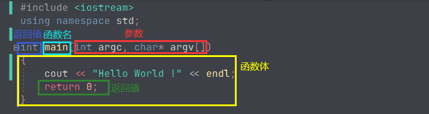

## 函数 & 参数 & 返回值

回到熟悉的Hello World,来学习一下函数、的概念。



函数的一般形式为：

```cpp
返回值类型 函数名(参数列表)
{
  函数体
}
```


例：封装两个int相加的函数，并使用

```cpp
int add(int a, int b)
{
 return a + b;
}

int main(int argc, char* argv[])
{
 int a = add(1, 2);
 cout << a << endl;
 return 0;
}
```


结果：

> 3

## 变量 & 作用域

在 【HelloWorld】中 第一次说到【变量 】，这里再一次提，主要想讲解 作用域是什么。


### 作用域：全局变量，局部变量，形参

作用域：简易理解，一个`{}`决定了一个作用域。如果不在任何`{}`,就是全局。

作用域和变量的关系，具体有以下几点：

1. 变量的作用域为：从变量定义开始，到对应的`}` 为止；
2. 变量只在其作用域内有效；
3. 同一个作用域，不能定义两个相同的变量；
4. 当使用一个变量a时，发现当前位置有两个不同的作用域都有a的声明定义；a取声明最近的一个。


具体可以结合以下代码理解：

```cpp
#include <iostream>
using namespace std;

int b = 2; // b 为 全局变量

int add(int a, int b) // a、b 为 形式参数（简称：形参）
{
 cout << "函数 ： " << endl;
 cout << "a ： " << a << endl;
 cout << "b ： " << b << endl;
 return a + b;
}

int main(int argc, char* argv[])  // argc、argv 为 形式参数（简称：形参）
{
 int a = 1; // a 为 局部变量；

 {
  int a = add(b, 1); // a 为 局部变量； b 为 全局变量
  cout << "a ： " << a << endl;
 }

 cout << "a ： " << a << endl;
 return 0;
}
```


结果：

> 函数 ：
>
> a ： 2
>
> b ： 1
>
> a ： 3
>
> a ： 1

名词解释：

**全局变量：** 函数外部的变量，不做任何`{}`内的变量。

**局部变量：** 存在某个`{}`内部的变量。

**形参：** 函数的参数