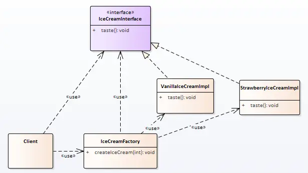

# 简单工厂

选择简单工厂作为第一个篇，因为它几乎是最简单的设计模式。

这里想一想我们的冰淇淋贩卖机器，客户不需要知道冰淇淋怎么生成，客户只需要按下对应的按钮即可得到他们想要的产品。


代码如何实现？

## 场景分析

这里不需要实现所有的选项。

简化一下：啃得鸡推出冰淇淋产品，共两款。草莓冰淇淋（产品编号1）和香草冰淇淋（产品编号1），要卖给用户；

简单工厂就可以实现贩卖机的功能。

## 实现思路

实现类图为：



用户不用知道冰淇淋的生产过程；

用户只需要知道：

1. 要的是冰淇淋 （接口）
2. 冰淇淋的贩卖机在哪 （工厂）
3. 冰淇淋的产品列表 （一般会抽象为枚举类型)

## 代码实现

**冰淇淋接口和它的实现**

```cpp
// 冰淇淋接口
class IceCreamInfterface
{
public:
    virtual ~IceCreamInfterface() {}
    virtual void taste() = 0;
};

// 草莓冰淇淋
class StrawberryIceCreamImpl : public IceCreamInfterface
{
public:
    virtual void taste() override
    {
        qDebug() << QStringLiteral("草莓冰淇淋的味道！");
    }
};

// 香草冰淇淋
class VanillaIceCreamImpl : public IceCreamInfterface
{
public:
    virtual void taste() override
    {
        qDebug() << QStringLiteral("香草冰淇淋的味道！");
    }
};
```

**冰淇淋工厂和产品列表**

```cpp
// 冰淇淋工厂
class IceCreamFactory
{
public:
    // 产品列表
    enum ProductList
    {
        StrawberryIceCream,
        VanillaIceCream
    };

public:
    static IceCreamInfterface  createIceCream(ProductList productId)
    {
        IceCreamInfterface *pProduct = nullptr;
        switch (productId)
        {
        case StrawberryIceCream:
            pProduct = new StrawberryIceCreamImpl();
            break;
        case VanillaIceCream:
            pProduct = new VanillaIceCreamImpl();
            break;
        default:
            break;
        }
        return pProduct;
    }
};
```

**客户**

```cpp
int main(int argc, char *argv[])
{
    // 买个草莓味的冰淇淋
    IceCreamInfterface *pIceCream1 =
            IceCreamFactory::createIceCream(IceCreamFactory::StrawberryIceCream);
    pIceCream1->taste();

    // 买个香草味的冰淇淋
    IceCreamInfterface *pIceCream2 =
            IceCreamFactory::createIceCream(IceCreamFactory::VanillaIceCream);
    pIceCream2->taste();

    delete pIceCream1;
    delete pIceCream2;
}
```

## 使用感悟

简单工厂作为创建型设计模式，主要作用也是将对象的创建与使用分离。

### 简单工厂的特点：

```
1. 产品是有限的、已知的。
2. 工厂类可以直用静态方法，所以可隐藏构造函数（构造函数私有化）
3. 创建方法理论上只依赖产品列表，所以可以创建各种实例，不限于只一类。（这是一个危险的实现）
```

### 简单工厂的问题

1、添加新产品需要修改已经完成的工厂方法。

2、客户需要知道产品列表和功能直接的关系，增加复杂度。


## 代码路径

https://github.com/su-dd/learning/tree/main/src/design_pattern/SimpleFactory