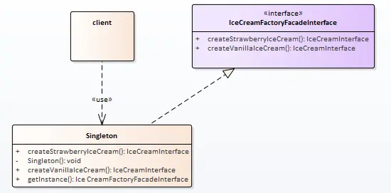

# 单例模式

上篇了解了外观模式，解决了客户端找不到需要访问的功能的困扰。

小卖部是挺好，但是啃得鸡就不干了；我研发的产品，你去卖？ 那我怎么管理服务的标准化（统一提价）。


## 场景分析

小卖部虽好，但如果只有我能开，那就更好了！

单例模式的思路比较简单，就是要求程序运行范围内只有一个对象。

为了这个目的，在不同情况下，需要使用不同的技术来辅助。

## 实现思路

类图：



## 实现代码

单例分为饿汉单例和懒汉单例，下面分别介绍。

### 饿汉单例

相对来说，饿汉单例更好理解一些。单例的目的是为了保证只有一个对象。所以使用了静态对象进行处理。

同时将类的构造函数，copy构造，赋值构造进行私有化。

这时一个进程中将有且只有一个单例类的对象。

```cpp
#include "IceCreamFactoryFacadeInterface.h"
#include "StrawberryIceCreamFactory.hpp"
#include "VanillaIceCreamFactory.hpp"

class EagerSingletonFactoryFacade : public IceCreamFactoryFacadeInterface
{
private:
    static EagerSingletonFactoryFacade m_oInstance;
private:
    EagerSingletonFactoryFacade()
        : m_pStrawberryIceCreamFactory(new StrawberryIceCreamFactory())
        , m_pVanillaIceCreamFactory(new VanillaIceCreamFactory()) {}

    EagerSingletonFactoryFacade(EagerSingletonFactoryFacade const&);
    EagerSingletonFactoryFacade& operator=(EagerSingletonFactoryFacade const&);

public:
    virtual ~EagerSingletonFactoryFacade() {}

    static IceCreamFactoryFacadeInterface *getInstance()
    {
        return &m_oInstance;
    }

public:
    IceCreamInterface *createStrawberryIceCream() override
    {
        return m_pStrawberryIceCreamFactory->createIceCream();
    }

    IceCreamInterface *createVanillaIceCream() override
    {
        return m_pVanillaIceCreamFactory->createIceCream();
    }
private:
    IceCreamFactoryInterface *m_pStrawberryIceCreamFactory;
    IceCreamFactoryInterface *m_pVanillaIceCreamFactory;
};

// 初始化静态变量
EagerSingletonFactoryFacade EagerSingletonFactoryFacade::m_oInstance;
```


### 懒汉单例

懒汉单例不同于只处在于，在使用时它才会加载。有懒加载的效果。

主要使用判空方式确保对象只生成一次。

Ps：实例中使用静态的方式存储指针对象，只是为了方便，这并不是规范。

```cpp
#include "IceCreamFactoryFacadeInterface.h"
#include "StrawberryIceCreamFactory.hpp"
#include "VanillaIceCreamFactory.hpp"
#include <QMutex>
#include <QMutexLocker>

class LazySingletonFactoryFacade : public IceCreamFactoryFacadeInterface
{
private:
    static IceCreamFactoryFacadeInterface *m_pInstance;
    static QMutex s_oMutex;
private:
    LazySingletonFactoryFacade()
        : m_pStrawberryIceCreamFactory(new StrawberryIceCreamFactory())
        , m_pVanillaIceCreamFactory(new VanillaIceCreamFactory()) {}
public:
    virtual ~LazySingletonFactoryFacade() {}

    static void freeInstancel()
    {
        if (nullptr != m_pInstance)
        {
            delete m_pInstance;
            m_pInstance = nullptr;
        }
    }

    // 对于单线程
    // 如果当前判断为单进程，我们中需要做简单的判空处理即可
    static IceCreamFactoryFacadeInterface *getInstance_1()
    {
        if (nullptr == m_pInstance)
        {
            m_pInstance = new LazySingletonFactoryFacade();
        }
        return m_pInstance;
    }

    // 对于多线程
    // 对于多线程程序，只做判空不能做到单例的效果，需要加锁
    // 这是最简单的加锁方式，通常不使用，应为效率不够高
    static IceCreamFactoryFacadeInterface *getInstance_2()
    {
        QMutexLocker oLocker(&s_oMutex);
        if (nullptr == m_pInstance)
        {
            m_pInstance = new LazySingletonFactoryFacade();
        }
        return m_pInstance;
    }

    // 对于多线程 - 双重判空
    // 对于多线程，同时使用双重判空的方式处理，以提高效率
    static IceCreamFactoryFacadeInterface *getInstance_3()
    {
        if (nullptr == m_pInstance)
        {
            QMutexLocker oLocker(&s_oMutex);
            if (nullptr == m_pInstance)
            {
                m_pInstance = new LazySingletonFactoryFacade();
            }
        }
        return m_pInstance;
    }

public:
    IceCreamInterface *createStrawberryIceCream() override
    {
        return m_pStrawberryIceCreamFactory->createIceCream();
    }

    IceCreamInterface *createVanillaIceCream() override
    {
        return m_pVanillaIceCreamFactory->createIceCream();
    }
private:
    IceCreamFactoryInterface *m_pStrawberryIceCreamFactory;
    IceCreamFactoryInterface *m_pVanillaIceCreamFactory;
};

// 初始化静态变量
IceCreamFactoryFacadeInterface * LazySingletonFactoryFacade::m_pInstance = nullptr;
QMutex LazySingletonFactoryFacade::s_oMutex(QMutex::Recursive);
```


## 使用感悟

| 种类     | 实现                                | 优点                                                    | 缺点                                                         |
| -------- | ----------------------------------- | ------------------------------------------------------- | ------------------------------------------------------------ |
| 饿汉单例 | 1、使用静态区对象，确保只有一份实例 | 1、多线程，单线程可以用统一的方式处理 2、无加锁，效率高 | 1、程序运行时需要加载暂时无用的内存，可能影响效率 2、静态对象的初始化由系统决定，如果初始化依赖静态对象，可能导致异常。 |
| 懒汉单例 | 1、通过判空的方法，确保只有一份实例 | 1、程序运行时不用加载多余的数据                         | 1、第一次加载可能不够快 2、代码相对复杂                      |


## 代码位置

https://github.com/su-dd/learning/tree/main/src/design_pattern/Singleton