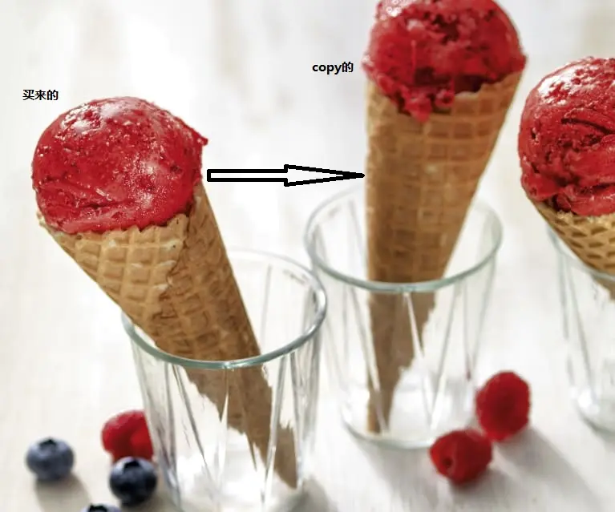

# 原型模式

啃得鸡冰淇淋卖的太好了，别的商家希望也能卖冰淇淋；但是不想自己设计调参。于是clone或者说copy就是一个方案了？



## 场景分析

客户端可以再不用知道对象的具体实现的情况下，新建一个新的对象。那就是客户端只知道接口定义，也就是说是通过接口访问的。

原型模式指通过【现有对象】 是生成一个新对象，而不需要知道他们所属的类。

## 实现思路


类图的设计也可以提一个单独的Prototype接口作为所有类的父类，客户端其实需要的是具有业务意义的类。

## 实现代码

接口：

```cpp
// 冰淇淋接口
class IceCreamInterface
{
public:
    virtual ~IceCreamInterface() {}
    virtual void taste() = 0;
    virtual IceCreamInterface *clone() = 0;
};
```


实现：

```cpp
// 草莓冰淇淋
class StrawberryIceCreamImpl : public IceCreamInterface
{
public:
    virtual void taste() override
    {
        qDebug() << QStringLiteral("草莓冰淇淋的味道！");
    }

    IceCreamInterface *clone()
    {
        return new StrawberryIceCreamImpl();
    }
};
```


## 使用感悟

原型模式的本质是通过深copy的方式生成对象，不用受构造函数的约束（可不用引入具体头文件）。

优点 / 使用场景：

1. 性能优化的场景中，当一共从头建造是需要消耗大量资源（如需要大量的IO操作，权限申请等）
2. 安全要求场景中，不向外暴露头文件，再一写情况下比较安全。

组合使用方式： 可以和工厂模式结合使用，作为工厂模式创建

缺点： 对于类中含有容器对象【如组合模式】不够友好

对类中对象由外部传递时，不够友好


## 代码位置

https://github.com/su-dd/learning/tree/main/src/design_pattern/Prototype