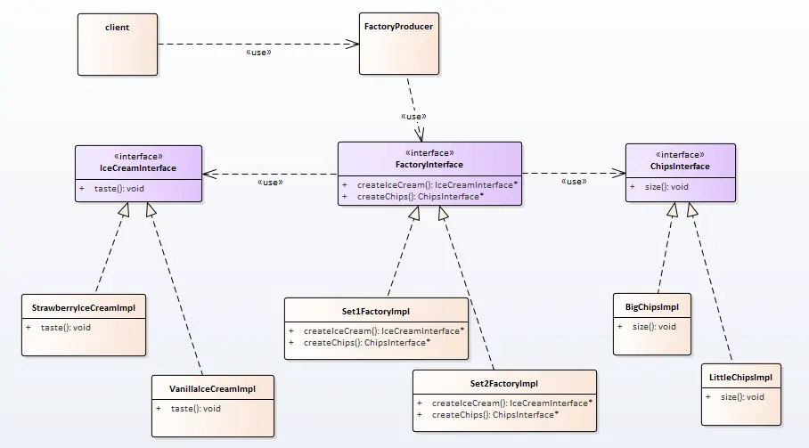

# 抽象工厂

啃得鸡自从产品被抄袭，就很紧张；经过市场部讨论后，希望通过套餐的方式去打动用户。

套餐：（冰淇淋 + 薯条）

现再的问题是套餐产品怎么搞嗯？


## 场景分析

不同于我们之前生产的产品，套餐类产品都是由不同的部分去构成，同一部分再不同套餐中不尽相同；不能在一个工厂内生产所有套餐产品。

所以我们需要多个工厂

抽象工厂是生成一系列对象的方法。

## 实现思路



抽象工厂对比工厂模式，发现工厂是抽象工厂的特例。当抽象工厂的产品只有一种时，就是工厂模式。

## 实现代码

产品1：冰淇淋

```cpp
// 冰淇淋接口
class IceCreamInterface
{
public:
    virtual ~IceCreamInterface() {}
    virtual void taste() = 0;
};

// 香草冰淇淋
class VanillaIceCreamImpl : public IceCreamInterface
{
public:
    virtual void taste() override
    {
        qDebug() << QStringLiteral("香草冰淇淋的味道！");
    }
};

// 草莓冰淇淋
class StrawberryIceCreamImpl : public IceCreamInterface
{
public:
    virtual void taste() override
    {
        qDebug() << QStringLiteral("草莓冰淇淋的味道！");
    }
};
```


产品2：薯条

```cpp
class ChipsInterface
{
public:
    virtual ~ChipsInterface() {}
    virtual void size() = 0;
};

class BigChipsImpl : public ChipsInterface
{
public:
    virtual void size()
    {
        qDebug() << "这个大份的薯条！";
    }
};

class LittleChipsImpl : public ChipsInterface
{
public:
    virtual void size()
    {
        qDebug() << "这个小份的薯条！";
    }
};
```


FactoryProducer:

```cpp
class FactoryProducer
{
public:
    enum Set
    {
        Set1,
        Set2
    };

public:
    FactoryInterface * createSet(Set setNum)
    {
        switch (setNum) {
        case Set1:
            return new Set1FactoryImpl();
        case Set2:
            return new Set2FactoryImpl();
        default:
            return nullptr;
        }
    }
};
```


## 使用感悟

抽象工厂其实并不是一个复杂概念，其实抽象工厂就是工厂模式的一般现象，工厂模式就是抽象工厂的个例。

抽象工厂想要新增一个套餐是简单的，但是想要在套餐中新增一个项就比较不友好。

抽象工厂适用于整套的替换场景中。


## 代码位置

https://github.com/su-dd/learning/tree/main/src/design_pattern/AbstractFactory