# 适配器模型

在桥模式这篇中，啃得鸡优化了自己工厂生产模式；使用桥模型，使得冰淇淋口味和品牌（logo）相互独立变化。

现在小厂家有了一点问题，小厂家A只知道自己需要 草莓和香草两种冰淇淋。不希望知道啃得鸡可以帮助贴多少中品牌。

问题：小厂家如何更简单的获得自己的产品嗯？


## 场景分析

对小厂家A而言，只需要草莓和香草两种冰淇淋。

贴自己的logo是默认的，不需要时刻提醒的。

适配器是为了已经适配那些已经稳定的功能，不希望再发生变动的模块；或者我们并无能力改变的，由外部提供的功能。

典型的是对sdk的接入，当我们希望使用某个sdk的功能；但它又不是那么切合时，为了不将程序搞得一团乱麻。

我们通常会考虑使用适配器的方式。


## 实现思路

这里先看下：啃得鸡sdk


sdk最终通过facade的方式将创建的决定权移交给客户端，代码如下。

```cpp
#include "BrandImpl.hpp"
#include "BrandIntf.h"
#include "IceCreamIntf.h"
#include "IceCreamImpl.hpp"


enum Brand { A, B };
enum Taste { Strawberry, Vanilla };

class IceCreamFacade
{
public:
	IceCreamIntf* createIceCream(Taste taste, Brand brand)
	{
		IceCreamIntf* pIceCream = nullptr;
		switch (taste)
		{
		case Strawberry:
			pIceCream = new StrawberryIceCreamImpl();
			break;
		case Vanilla:
			pIceCream = new VanillaIceCreamImpl();
			break;
		default:
			pIceCream = new StrawberryIceCreamImpl();
		}

		switch (brand)
		{
		case A:
			pIceCream->setBrand(new ABrandImpl());
			break;
		case B:
			pIceCream->setBrand(new BBrandImpl());
			break;
		default:			   
			break;
		}
		return pIceCream;
	}

};
```

对于品牌方A而已，只希望选择口味；不希望在每个生产环境都选择一下自己是A。

这里是使用适配器的方式，隔离A不希望知道的信息。一般有两种方式：类适配器，对象适配器


### 类适配器

通过继承的方式，重写父类函数；以此为client提供更合适的接口。


```cpp
#include "sdk/IceCreamFacade.hpp"

class IceCreamFacadeClassAdapter : public IceCreamFacade
{
public:
	IceCreamIntf* createIceCream(Taste taste)
	{
		return IceCreamFacade::createIceCream(taste, Brand::A);
	}
};
```


### 对象适配器

通过对象使用的方式，将需要实际的业务执行对象进行包装。以此为client提供更合适的接口。



```cpp
class IceCreamFacadeObjectAdapter
{
public:
	IceCreamFacadeObjectAdapter()
		: m_pIceCreamFacade(new IceCreamFacade())
	{

	}
	virtual ~IceCreamFacadeObjectAdapter()
	{
		delete m_pIceCreamFacade;
		m_pIceCreamFacade = nullptr;
	}

public:
	IceCreamIntf* createIceCream(Taste taste)
	{
		return m_pIceCreamFacade->createIceCream(taste, Brand::A);
	}

private:
	IceCreamFacade* m_pIceCreamFacade;
};
```


## 感悟

1、从上述的可知适配器的本质是为了去处理由于某种原因，不能被修改代码的部分。如果我们可以修改目标代码，不建议使用适配器。

2、上述场景为单向调用场景；在实际的场景中还有很多是两个模块相互使用。同时，他们又是不可以被改动的情况。这时我们需要使用双向适配器。这时主要使用**类适配器**。

**双向适配器：**


## 代码

https://github.com/su-dd/learning/tree/main/src/design_pattern/Adapter