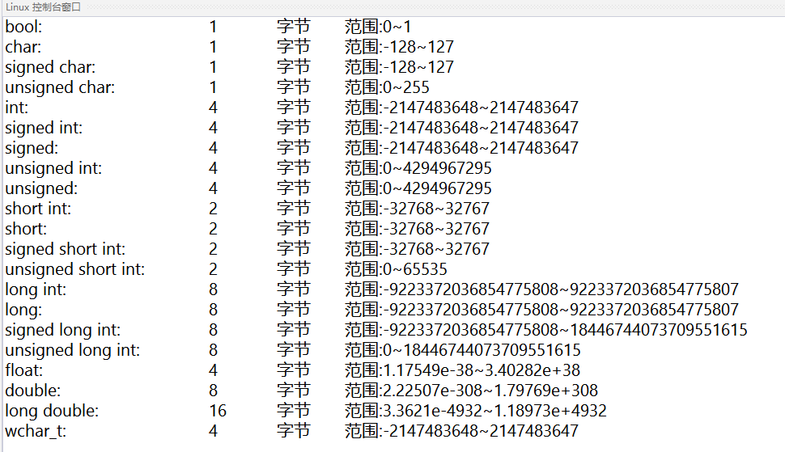

## 1HelloWorld
传说一切语言的第一个程序都是“HelloWorld！”

如下为C++的：

```cpp
#include <iostream>

int main(int argc, char* argv[])
{
 std::cout << "Hello World!" << std::endl;
    return 0;
}
```

简单做一个认识吧：
### main函数

函数的格式:

```cpp
返回值类型 函数名(参数类型 参数， ... )
{
  函数体
}
```

c++程序都是由main函数开始的;

main函数的返回值类型一般为int类型，返回0表示执行成功。

例：

```cpp
int main(int argc, char* argv[])
{
 *****
  return 0;
}
```

### 基本输入输出

有输入和输出的程序才有意义。

C++的基本输入输出流为：cin 和 cout

需要：

1、引入头文件

```cpp
#include <iostream>
```

2、使用命名空间：std

```cpp
using namespace std;

或

std::cout
std::cin
```


**代码：**

```cpp
#include <iostream>
#include <string>
using namespace std;
int main(int argc, char* argv[])
{
 cout << "Hello World!" << endl;

 cout << "请输入你的名字：";
 string name;
 cin >> name;
 cout << "你好！" << name << endl;

 return 0;
}
```


**运行：**


### 变量&注释


#### 注释

C++ 支持单行注释和多行注释。注释中的所有字符会被 C++ 编译器忽略。

C++ 注释一般有两种：

// - 一般用于单行注释。

/*...*/ - 一般用于多行注释。

#### 变量

C++中，变量是程序运行中需要申请的存储空间的助记符；编译完成的程序中是不存在变量的。

声明一个变量，即从申请了一个存储空间；初始化一个变量，即给存储空间一个值。


## 2基础概念

### 函数 & 参数 & 返回值

回到熟悉的Hello World,来学习一下函数、的概念。


函数的一般形式为：

```cpp
返回值类型 函数名(参数列表)
{
  函数体
}
```


例：封装两个int相加的函数，并使用

```cpp
int add(int a, int b)
{
 return a + b;
}

int main(int argc, char* argv[])
{
 int a = add(1, 2);
 cout << a << endl;
 return 0;
}
```


结果：

> 3

### 变量 & 作用域

在 【HelloWorld】中 第一次说到【变量 】，这里再一次提，主要想讲解 作用域是什么。

#### 作用域：全局变量，局部变量，形参

作用域：简易理解，一个`{}`决定了一个作用域。如果不在任何`{}`,就是全局。

作用域和变量的关系，具体有以下几点：

1. 变量的作用域为：从变量定义开始，到对应的`}` 为止；
2. 变量只在其作用域内有效；
3. 同一个作用域，不能定义两个相同的变量；
4. 当使用一个变量a时，发现当前位置有两个不同的作用域都有a的声明定义；a取声明最近的一个。

具体可以结合以下代码理解：

```cpp
#include <iostream>
using namespace std;

int b = 2; // b 为 全局变量

int add(int a, int b) // a、b 为 形式参数（简称：形参）
{
 cout << "函数 ： " << endl;
 cout << "a ： " << a << endl;
 cout << "b ： " << b << endl;
 return a + b;
}

int main(int argc, char* argv[])  // argc、argv 为 形式参数（简称：形参）
{
 int a = 1; // a 为 局部变量；

 {
  int a = add(b, 1); // a 为 局部变量； b 为 全局变量
  cout << "a ： " << a << endl;
 }

 cout << "a ： " << a << endl;
 return 0;
}
```


结果：

> 函数 ：
>
> a ： 2
>
> b ： 1
>
> a ： 3
>
> a ： 1

名词解释：

**全局变量：** 函数外部的变量，不在任何`{}`内的变量。

**局部变量：** 存在某个`{}`内部的变量。

**形参：** 函数的参数


## 3基础类型

### 基础类型

C++的基础数据类型有：

bool ： 处理 布尔类型 值 true 或 false；

char ： 处理 字符类型数据；

int ：处理 整型 数据

float ：处理 浮点数

double ： 处理 双精度浮点数

wchar_t（宽字符型）：如果常量以 L（仅当大写时）开头，则表示它是一个宽字符常量（例如 L’x’），此时它必须存储在 wchar_t 类型的变量中。否则，它就是一个窄字符常量（例如 ‘x’），此时它可以存储在 char 类型的简单变量中。

void ： 空类型


#### 修饰符

除此外，还有类型修饰符：signed、unsigned、long 和 short

可以被类型修饰符修饰的类型有：int char 和 double

其中：

int 可以被 signed、unsigned、long 和 short 修饰 char 可以被 signed、unsigned 修饰 double 可以被 long 修饰

如果只写：signed、unsigned、long 和 short 等价于： signed int、unsigned int、long int 和 short int


#### 范围

不同的编译器，数据类型的大小不同

```cpp
#include <iostream>
#include <limits>
using namespace std;
int main(int argc, char* argv[])
{
    cout << "bool:\t\t\t" << sizeof(bool) << "\t字节\t" << "范围:" << numeric_limits<bool>::min() << "~" << numeric_limits<bool>::max() << endl;
    cout << "char:\t\t\t" << sizeof(char) << "\t字节\t" << "范围:" << (int)numeric_limits<char>::min() << "~" << (int)numeric_limits<char>::max() << endl;
    cout << "signed char:\t\t" << sizeof(signed char) << "\t字节\t" << "范围:" << (int)numeric_limits<signed char>::min() << "~" << (int)numeric_limits<signed char>::max() << endl;
    cout << "unsigned char:\t\t" << sizeof(unsigned char) << "\t字节\t" << "范围:" << (int)numeric_limits<unsigned char>::min() << "~" << (int)numeric_limits<unsigned char>::max() << endl;
    cout << "int:\t\t\t" << sizeof(int) << "\t字节\t" << "范围:" << numeric_limits<int>::min() << "~" << numeric_limits<int>::max() << endl;
    cout << "signed int:\t\t" << sizeof(signed int) << "\t字节\t" << "范围:" << numeric_limits<signed int>::min() << "~" << numeric_limits<signed int>::max() << endl;
    cout << "signed:\t\t\t" << sizeof(signed) << "\t字节\t" << "范围:" << numeric_limits<signed>::min() << "~" << numeric_limits<signed>::max() << endl;
    cout << "unsigned int:\t\t" << sizeof(unsigned int) << "\t字节\t" << "范围:" << numeric_limits<unsigned int>::min() << "~" << numeric_limits<unsigned int>::max() << endl;
    cout << "unsigned:\t\t" << sizeof(unsigned) << "\t字节\t" << "范围:" << numeric_limits<unsigned>::min() << "~" << numeric_limits<unsigned>::max() << endl;
    cout << "short int:\t\t" << sizeof(short int) << "\t字节\t" << "范围:" << numeric_limits<short int>::min() << "~" << numeric_limits<short int>::max() << endl;
    cout << "short:\t\t\t" << sizeof(short) << "\t字节\t" << "范围:" << numeric_limits<short>::min() << "~" << numeric_limits<short>::max() << endl;
    cout << "signed short int:\t" << sizeof(signed short int) << "\t字节\t" << "范围:" << numeric_limits<signed short int>::min() << "~" << numeric_limits<signed short int>::max() << endl;
    cout << "unsigned short int:\t" << sizeof(unsigned short int) << "\t字节\t" << "范围:" << numeric_limits<unsigned short int>::min() << "~" << numeric_limits<unsigned short int>::max() << endl;
    cout << "long int:\t\t" << sizeof(long int) << "\t字节\t" << "范围:" << numeric_limits<long int>::min() << "~" << numeric_limits<long int>::max() << endl;
    cout << "long:\t\t\t" << sizeof(long) << "\t字节\t" << "范围:" << numeric_limits<long>::min() << "~" << numeric_limits<long>::max() << endl;
    cout << "signed long int:\t" << sizeof(signed long int) << "\t字节\t" << "范围:" << numeric_limits<signed long int>::min() << "~" << numeric_limits<unsigned long int>::max() << endl;
    cout << "unsigned long int:\t" << sizeof(unsigned long int) << "\t字节\t" << "范围:" << numeric_limits<unsigned long int>::min() << "~" << numeric_limits<unsigned long int>::max() << endl;
    cout << "float:\t\t\t" << sizeof(float) << "\t字节\t" << "范围:" << numeric_limits<float>::min() << "~" << numeric_limits<float>::max() << endl;
    cout << "double:\t\t\t" << sizeof(double) << "\t字节\t" << "范围:" << numeric_limits<double>::min() << "~" << numeric_limits<double>::max() << endl;
    cout << "long double:\t\t" << sizeof(long double) << "\t字节\t" << "范围:" << numeric_limits<long double>::min() << "~" << numeric_limits<long double>::max() << endl;
    cout << "wchar_t:\t\t" << sizeof(wchar_t) << "\t字节\t" << "范围:" << numeric_limits<wchar_t>::min() << "~" << numeric_limits<wchar_t>::max() << endl;
 return 0;
}
```


**使用：**  Microsoft Visual C++ x86 


**使用：** Microsoft Visual C++ x64 


**使用:** Ubuntu GCC 



### 基础运算符

| 优先权 | 运算符 | 说明 | 结合性 |
| :--: | :--: | :--- | :--: |
| 1 | () | 括号 | 由左至右 |
| 2 | !、-、++、-- | 逻辑运算符NOT、算术运算符负号、递增、递减 | 由右至左 |
| 3 | *、/、% | 算术运算符的乘法、除法、余数 | 由左至右 |
| 4 | +、- | 算术运算符加法、减法 | 由左至右 |
| 5 | <<、>>、>>> | 位操作子左移、右移、无符号右移 | 由左至右 |
| 6 | >、>=、<、<= | 关系运算符大于、大于等于、小于、小于等于 | 由左至右 |
| 7 | ==、!= | 关系运算符等于、不等于 | 由左至右 |
| 8 | & | 位操作子AND | 由左至右 |
| 9 | ^ | 位操作子XOR | 由左至右 |
| 10 | \| | 位操作子OR | 由左至右 |
| 11 | && | 逻辑运算符AND | 由左至右 |
| 12 | \|\| | 逻辑运算符OR | 由左至右 |
| 13 | ?: | 条件控制运算符 | 由右至左 |
| 14 | =、op= | 指定运算符 | 由右至左 |

**op=** 这里指： += 、 -= 、 *= 、 \= 、 %= 、 &= 、 ^= 、 |=

### 引用

在前面一篇我们知道，变量是内存地址的一个名字；引用是给一个已经有名称的内存地址，再起一个名字。

看下面代码，做一下深入理解：

```cpp
/*
* 引用
* 类型 & 引用变量名 = 引用实体；
*/
void test1()
{
 int a = 1;  // 声明并初始化 int 类型变量 a
 int& b = a;  // 定义引用类型 b，指向 变量a
 cout << b << endl;
 int& c = b;  // 定义引用类型 b，指向 变量b
 cout << c << endl;

 cout << &a << endl; // 输出a的内存地址
 cout << &b << endl; // 输出b的内存地址
 cout << &c << endl; // 输出c的内存地址
}
```


**结果：**

> 1
>
> 1
>
> 0x7fffffffe464
>
> 0x7fffffffe464
>
> 0x7fffffffe464

引用 不是新定义一个变量，而 是给已存在变量取了一个别名 ，编译器不会为引用变量开辟内存空间，它和它引用的变量共用同一块内存空间。


### 指针&指针初始化

指针（pointer）是 C++中的一个核心概念；是c++中常见的用来存在内存的一种工具。

理解指针有两个点：

1. 指针本身是一个大小等于int类型的变量。
2. 指针内存储着它指向的值的地址。

```cpp
void test1()
{
 int a = 1; // 声明并初始化 int 类型变量 a
 int* ptr;  // 声明int类型指针 ptr
 ptr = &a;  // 让指针ptr指向 变量a 的地址
 cout << ptr  << endl; // 输出 指针指向的地址
 cout << *ptr << endl; // 输出 指针指向的地址的值
 cout << &ptr << endl; // 输出 指针的地址
}
```


**结果：**

> 0x7fffffffe46c
>
> 1
>
> 0x7fffffffe470

以上demo，指针是指向**栈对象**，其实在正式的编程工作中，指针大多是指向**堆对象**的。

*栈对象 和 堆对象的区别，我们会在后续讲解。*

**堆对象** 的 创建 和 释放 是需要特殊的关键字；

C++中 一共有两对关键字：

**malloc**，**free** （C++，兼容C；所以可以用C的关键字）

**new**，**delete** （C++新增，常用这一对）

**这里注意：** free 和 delete 是 释放指针指向地址的内存，这时指针依然指向对应地址，不为空。

这时需要给指针赋空值，否则后续无法判断指针指向的位置是否有效，就会形成野指针。

同理，在声明一个指针是，通常就应该初始化；如果暂不确定值，可以赋空，防止野指针。

#### malloc & free

malloc 和 free 的一般形式：

```cpp
void *malloc(size_t size) 
void free(void *ptr)
```

malloc 分配指定大小为 size字节的内存空间，返回一个指向该空间的void*指针。 由于返回 void* 指针，所以需要强制类型转换后才能引用其中的值。

free 释放一个由 malloc 所分配的内存空间。ptr 指向一个要释放内存的内存块， 该指针应当是之前调用 malloc 的返回值。

```cpp
void test3()
{
 int* ptr = nullptr; // 通常指针变量声明时，就应该初始化；如果暂不确定值，可以赋空，防止野指针。
 ptr = (int*)malloc(sizeof(int)); // 申请一个int大小的堆内存，并进行强制类型转换
 *ptr = 1; // 对ptr指向的位置赋值
 cout << *ptr << endl; // 输出
 free(ptr);
  ptr = nullptr;
}
```


**结果：**

> 1
>
> 0x55555556aeb0
>
> 0x55555556aeb0


#### new & delete

new & delete 的一般形式：

```cpp
类型* 指针名 = new 类型();
delete 指针名
```


new 按照类型的大小，分配内存。 delete 释放指针指向地址的内存，这是指针依然指向对应地址，不为空。 通常会在 delete 后，增加一个 给指针变量赋空的操作；防止野指针。

```cpp
void test4()
{
 int* ptr = new int(4); // 声明并初始化 int类型 指针 ptr
 cout << ptr << endl; // 输出 ptr 指向的地址
 cout << *ptr << endl; // 输出 ptr 指向地址的值
 delete ptr;
 cout << ptr << endl; // 输出 ptr 指向的地址
 cout << *ptr << endl; // 输出 ptr 指向地址的值
  ptr = nullptr;
}
```


**结果：**

> 0x55555556aeb0
>
> 4
>
> 0x55555556aeb0
>
> 1431655786


### 数组

以int类型举例：

当声明一个int类型的变量a，是在内存中声明了一个int类型大小（4Byte，32Bit）的内存

当声明一个int类型的数组array，是在内存中声明了一组连续的int类型大小（4Byte，32Bit）的内存


#### 基本操作（初始化和下标访问）

数据申明的基本形式：

```cpp
类型  参数[数量]
```

访问数组时，使用数组下标，下标从0开始。

##### 初始化1

已知数组大小，和所有元素的值。

```cpp
void demo()
{
  int array[2] = { 1, 2 };
  cout << array[0] << endl;
  cout << array[1] << endl;
}
```

**结果：**

> 1
>
> 2

这种情况下也可以省略数组大小不写，结果等价。

##### 初始化2

已知数组大小，和有元素的值，且值相同。

```cpp
void demo()
{
  int array[2] = { 1 };
  cout << array[0] << endl;
  cout << array[1] << endl;
}
```

**结果：**
> 1
> 1
##### 初始化3
已知数组大小，值暂不清晰。

```cpp
void demo()
{
  int array[2];
  array[0] = 0;
  array[1] = 1;
  cout << array[0] << endl;
  cout << array[1] << endl;
}
```

##### 未初始化

未初始化的数据为当前内存位置存的随机值（内存中本来的值）。

存在两种为初始的情况： 1、数组刚声明，未赋值。 2、数组访问下标越界，虽然还是可以访问，但是值为随机值。

```cpp
void demo()
{
  int array1[2];
  cout << array1[0] << endl;
  cout << array1[1] << endl;

  int array2[2] = {0};
  cout << array2[0] << endl;
  cout << array2[1] << endl;
  cout << array2[2] << endl;
}
```

**结果：**

```text
-135408993
32767

0
0
-135408993
```

#### 栈数组和堆数组（数组动态分配）

**栈数组：内容存储在栈中的数组。** 上面的demo其实就是栈数组。 这样的数组有一个弊端，需要在写代码时，就定义好数组大小。

如果我们暂时不知道数组的大小；需要在运行时决定数组大小，就需要堆数组；对数组大小进行动态分配。

**堆数组：内容存储在堆中的数组。** C++如果想把内存分配到堆上，就需要使用 C++操作堆的两组关键字：

**malloc**，**free** （C++，兼容C；所以可以用C的关键字）

**new**，**delete** （C++新增，常用这一对）

具体理解查看下面的demo：

##### malloc & free

```cpp
void demo5()
{
 int n = 2; // 定义数组的大小
 int* grade = (int*)malloc(sizeof(int) * n); // 创建数组 数组大小：int类型的大小 * n 。

  cout << sizeof(grade) << endl; // 输出 grade 大小
 cout << grade << endl;  // 输出：指针的执行的位置
 cout << &grade[0] << endl; // 输出：数组0号位的位置 
 cout << &grade[1] << endl; // 输出：数组1号位的位置

 // 输出默认值
 cout << grade[0] << endl;
 cout << grade[1] << endl;

 grade[0] = 0; // 给数组0号位赋值
 grade[1] = 1; // 给数组1号位赋值
 // 输出 赋值后结果
 cout << grade[0] << endl;
 cout << grade[1] << endl;

 free(grade);
}
```


**结果：**

> 8
>
> 0x55555556aeb0
>
> 0x55555556aeb0
>
> 0x55555556aeb4
>
> 0
>
> 0
>
> 0
>
> 1

##### new & delete

需要注意的是 数组的操作符方式为： new\[\] 和 delete\[\]

一般形式为：

```cpp
类型* 指针名 = new 类型[n]; // n 为数组个数
delete[] 指针名
```

```cpp
void demo6()
{
 int n = 3; // 定义数组的大小
 int* grade = new int[n]; // 创建数组 数组大小：int类型的大小 * n 。

  cout << sizeof(grade) << endl; // 输出 grade 大小
 cout << grade << endl;  // 输出：指针的执行的位置
 cout << &grade[0] << endl; // 输出：数组0号位的位置 
 cout << &grade[1] << endl; // 输出：数组1号位的位置

 // 输出默认值
 cout << grade[0] << endl;
 cout << grade[1] << endl;

 grade[0] = 0; // 给数组0号位赋值
 grade[1] = 1; // 给数组1号位赋值
 // 输出 赋值后结果
 cout << grade[0] << endl;
 cout << grade[1] << endl;

 delete[] grade;
}
```


**结果：**

> 8
>
> 0x55555556aeb0
>
> 0x55555556aeb0
>
> 0x55555556aeb4
>
> 0
>
> 0
>
> 0
>
> 1

##### 指针和数组的关系

从以上demo可以发现：堆数组是用指针的方式操作数组；来实现在运行期再决定数组大小的目的。

现在的问题是 为什么我们可以这么做嗯？

这是因为编译器在处理指针的 `[n]`,`++`,`--`,`+ n`,`- n` 操作时，是按 **对应类型大小** 的 往上或往下找到第**n**个位置。

即 指针，可以通过这样的方式操作连续内存，这恰好和数据契合；所以我们可以用指针来操作数组。

但指针和数组是两个概念。


### 常用语句

C++ 常用语句有：

1、赋值语句

2、条件语句

3、循环语句

4、try...catch...throw

#### 赋值语句

一般形式为：

```text
value = exp;
```


value 为变量，exp为可求值的表达式。

例：

```text
int a = 0;

a = 1 + 1;
```


第一句 初始一个int类型变量a，并赋值为0； 第二句 求1 + 1 的值，并赋给 a；


#### 条件语句

##### if else

一般形式为：

```cpp
if (exp)
{
  // 程序代码
}
else
{
  // 程序代码
}
```


exp 为求值为bool 类型的表达式。 程序代码中可以继续嵌套 if else 已完成复杂逻辑判断。

如果只有为true的条件需要特殊的程序代码：

```cpp
if (exp)
{
  // 程序代码
}
```


如果有多个并列的不同条件：

```cpp
if (exp1)
{
  // 程序代码
}
else if (exp2)
{
  // 程序代码
}
else
{
  // 程序代码
}
```


##### 三元运算符

一般形式：

```cpp
condition ? exp1 : exp2;
```


执行方式为：先执行 condition； condition为true，结果为exp1的值； condition为false，结果为exp2的值。

##### switch

如果我们存在大量使用多个并列的不同条件需要判断，也可以使用switch。

一般形式：

```cpp
switch (exp) {
  case condition_exp1:
    // 程序代码1
    break;
  case condition_exp2:
    // 程序代码2
    break;
  case condition_exp3:
    // 程序代码3
    break;
  default:
    // 程序代码4
    break;
}
```


exp、condition_exp1、condition_exp2 ... 可 计算为 int类型，或者为 枚举类型。

逻辑为：exp求出的值，等于 哪一个 condition_exp；代码就跳转到那里执行，到break为止。

如果没有，就执行 default。

例1：

```cpp
int a = 2;
switch (a)
{
case 1:
 cout << "case 1" << endl;
 break;
case 1 + 1 :
 cout << "case 2" << endl;
 break;
default:
 cout << "case default" << endl;
 break;
}
```


运行结果：

```text
case 2
```


例2：

```cpp
switch (1 + 1)
{
case 1+0:
 cout << "case 1" << endl;
case 2:
 cout << "case 2" << endl;
default:
 cout << "case default" << endl;
 break;
}
```


运行结果：

```text
case 2
case default
```


#### 循环语句

##### while

一般形式：

```cpp
while (condition)
{
  循环体代码
}
```


例：计算 1 + 2 + 3 + ··· + 10 的结果

```cpp
void while_demo()
{
 int i = 1;
 int amont = 0;
 while (i <= 10)
 {
  amont += i;
  i++;
 }
}
```


##### do... while

一般形式：

```cpp
do
{
  循环体代码
} while (condition)
```


例：计算 1 + 2 + 3 + ··· + 10 的结果

```cpp
void do_while_demo()
{
 int i = 1;
 int amont = 0;
 do
 {
  amont += i;
  i++;
 } while (i <= 10);
}
```


##### for

一般形式：

```cpp
for ( init ; condition ; increment )
{
  循环体代码
}
```


例：计算 1 + 2 + 3 + ··· + 10 的结果

```cpp
void for_demo()
{
 int amont = 0;
 for (int i = 1; i <= 10; i++)
 {
  amont += i;
 }
}
```


#### try...catch...throw

当执行一段语句可能发生异常时，就需要将这段代码保护起来。

一般形式：

```cpp
try
{
  保护块代码:
  包含：
    throw
  
}
cacth (ExceptionName e1)
{
  cacth块代码1：处理异常1的情况
}
cacth (ExceptionName e2)
{
  cacth块代码2：处理异常2的情况
}
cacth (...)
{
  cacth块代码 ... ：处理剩下的所有异常
}
```

throw : 抛出异常 try : 执行保护代码中，一般包含throw catch : 接收处理异常


##### Demo & 理解throw

throw 在未被命中前，将跳过后续的所有代码；如果一直没有被处理，就会被系统接收，导致当前程序崩溃。

**demo1：** 正常命中异常

```cpp
void try_catch_deom()
{
 try
 {
  cout << "This is before throw" << endl;
  throw 1;
  cout << "This is after throw" << endl;
 }
 catch (int num)
 {
  cout << "This is catch int" << endl;
 }
}


int main(int argc, char* argv[])
{
 try_catch_deom();
 cout << "this is after demo" << endl;

 return 0;
}
```

**结果：**

> This is before throw
> This is catch int
> this is after demo

**demo2：** 由...命中异常

```cpp
void try_catch_deom()
{
 try
 {
  cout << "This is before throw" << endl;
  throw 1.1;
  cout << "This is after throw" << endl;
 }
 catch (int num)
 {
  cout << "This is catch int" << endl;
 }
}

int main(int argc, char* argv[])
{
 try
 {
  try_catch_deom();
  cout << "this is after demo" << endl;
 }
 catch (...)
 {
  cout << "This is catch ..." << endl;
 }
 return 0;
}
```

**结果：**

> This is before throw
> This is catch ...


**demo3:** 无接收

```cpp
int main(int argc, char* argv[])
{
  throw 1;
 return 0;
}
```

结果：程序崩溃


## 4结构体联合体

### 总述

之前了解过 int，char，bool，loog 等基础类型，**结构体**和**联合体** 都是C++继承兼容C的一种自定义类型的方式。

**结构体 (struct)：** 将几个变量的内存组合在一起；长度为所有变量长度之和。

**联合体 (union)：** 让几个变量使用同一段内存；长度为内存占用最大的参数。

*值得注意的是：这里的**变量**，可以是基础类型，也可是自定义类型。*

### 结构体 (struct)

一般形式：

```cpp
struct 结构体名称
{
    结构体
};
```


举例：定义一个同学类型，并使用

```cpp
#include <iostream>
#include <cstring>
using namespace std;

// 声明结构体 Student
struct Student
{
 char name[20]; // 姓名
 int age;  // 年龄
 double height; // 身高 cm
 double weight; // 体重 kg
};


int main(int argc, char* argv[])
{
 Student a; // 定义同学：a
 strcpy(a.name, "小红");
 a.age = 4;
 a.height = 100;
 a.weight = 20.03;
 
 cout << "姓名：" << a.name << endl;
 cout << "年龄：" << a.age << endl;
 cout << "身高：" << a.height << endl;
 cout << "体重：" << a.weight << endl;

 return 0;
}
```

**结果：**

> 姓名：小红
>
> 年龄：4
>
> 身高：100
>
> 体重：20.03


我们还可以在声明结构体的同时去定义对象：

```cpp
struct 结构体名称
{
    结构体
} 变量名1, 变量名2 ... 变量名n;
```


例：

```cpp
// 声明结构体 Student
struct Student
{
 char name[20]; // 姓名
 int age;  // 年龄
 double height; // 身高 cm
 double weight; // 体重 kg
} a; // 定义全局对象 同学：a
```

### 联合体 (union)

一般形式：

```cpp
union 结构体名称
{
    结构体
};
```


这里也支持同时去定义对象：

```cpp
union 结构体名称
{
    结构体
} 变量名1, 变量名2 ... 变量名n;
```


联合体会几个变量使用同一段内存，可结合下面一段代码理解。

例：给以上同学类型再加一个学号

```cpp
#include <iostream>
#include <cstring>
using namespace std;

// 声明结构体 Student
struct Student
{
 int num;  // 学号
 char name[20]; // 姓名
 int age;  // 年龄
 double height; // 身高 cm
 double weight; // 体重 kg
};

union StudentU
{
 Student student;
 int key;
};

int main(int argc, char* argv[])
{
 StudentU a; // 定义同学：a
 a.student.num = 101; // 学号为1
 strcpy(a.student.name, "小红");
 a.student.age = 4;
 a.student.height = 100;
 a.student.weight = 20.03;
 
 cout << "关键值：" << a.key << endl;

 return 0;
}
```

**结果：**

> 关键值：101


可以看到我们没有对 **key** 赋值，但是 **key** 里面存了我们想要的东西；取的是**num**对应的内存中的值。

联合体多用于网络编程，如果希望做相关开发工作，可以看看理解相关概念。

## 5类的封装、继承、多态

首先，简单的认知一下类：C++不同于C的一种自定义类型的方式。

类（Class） 是 C++ 和 C 的最重要区别，C++ 的早期命名就是 C with Class。

类的存在给C++ 带来了面向对象 ，封装、继承、多态为类的三大特性。

在学习Class的具体使用方式前，我们必须先对面向对象的核心概念有大致的认知。大家可以通过：

面向对象的核心概念 ，后面再通过代码理解。

### 类的封装

**定义：** 将抽象出的 **数据**、**行为** 进行有机结合；隐藏细节，指对外提供特定功能的接口 的动作

封装可以分级向外提供访问权限：public、protected、private。

要完成封装，需要做两件事：

1. 从实体猫中 抽象 出我们需要的猫的行为和属性。
2. 将抽象的结果，转换为代码： 类 

#### 抽象

定义: 从众多的事物中抽取出共同的、本质性的特征，而舍弃其非本质的特征的过程。 衡量特征是否为本质特征，要看编程的目的。

举例：我们想看关注一群猫吃的动作

这时我们的抽象：


当我们只关注猫的吃这个动作时，猫的其他属性和动作对我们而言就没有意义了。

#### 类

定义：类是抽象化后的成果。

一般形式：

```cpp
class 类名称
{
public:
  公开的行为定义[函数定义]
protected:
  保护的行为定义[函数定义]
private:
  私有的行为定义[函数定义]
public:
  公开的属性定义[变量定义]
protected:
  保护的属性定义[变量定义]
private:
  私有的属性定义[变量定义]
};  // 一定注意这里有一个`;`，实际编码中常见的错误；会导致一些无法预知的编译错误。
```

**关键字解读：**

> class：类定义关键字
> public、protected、private ：限定函数、属性的使用范围的关键字， 范围 public > protected > private
> 封装时范围说明：
> public：类内部可以访问、子类可访问、类外部可访问
> protected：类内部可以访问、子类可访问
> private：类内部可以访问
> 如果 类 声明时未使用范围的关键字进行标注 函数、属性； 默认为 private
> *public、protected、private在继承上的使用，呆呆 会在下面 见 继承 中讲解*

例：上面的猫的抽象得到类
```cpp
class Cat   // 声明一个类
{
public:
 void eat()
 {
  cout << "猫:" << num << " 在吃鱼 " << endl;
 }
public:
 int num;
};
```

#### 对象
定义：类的实例化结果就是对象。
例：
```cpp
#include <iostream>
#include <cstring>
using namespace std;

class Cat
{
public:
 void eat()
 {
  cout << "猫:" << num << " 在吃鱼 " << endl;
 }
public:
 int num;
};

int main(int argc, char* argv[])
{
 Cat cat;    // 声明一个对象
 cat.num = 1;
 cat.eat();
 return 0;
}
```

**结果：**

> 猫:1 在吃鱼

#### this指针

this指针是类的成员函数的一个隐藏参数，处于形参链表的第一位;它指向当前类对象。

例：

```cpp
class Cat
{
public:
 void eat()
 {
  cout << "猫:" << this->num << " 在吃鱼 " << endl;
 }
public:
 int num;
};
```

#### 构造函数 & 析构函数

构造和析构是类中两个重要的概念；

**构造函数** ：用于初始化类对象，在对象初始化（new 或 直接对象创建）时调用。 **析构函数** ：用于对象资源释放，在对象释放（delete 或 出作用域时对象直接释放）时调用。

一般形式：

```cpp
class ClassName
{
public:
  ClassName(参数列表) // 函数名 必须同类名
    : 初始化列表      // 在初始化列表阶段，对象内存还没建立完成；this是不存在的
  {
    函数体            // this 可使用
  }

  ~ ClassName()      // 函数名 必须同类名; 同时 在前面加上 `~`
  {
    函数体            // this 可使用
  }
};
```

例：

```cpp
#include <iostream>
#include <cstring>
using namespace std;

class Cat
{
public:
 Cat(int num)
  : m_num(num)
 {
  cout << "猫: " << this->m_num << " 出生了" << endl;
 }

 ~Cat()
 {
  cout << "猫: " << this->m_num << " 嗝屁了" << endl;
 }

 void eat()
 {
  cout << "猫: " << this->m_num << " 在吃鱼 " << endl;
 }
public:
 int m_num;
};

int main(int argc, char* argv[])
{
 { // 添加作用域，让 cat析构
  Cat cat(1);
  cat.eat();
 }

 Cat *pCat = new Cat(2);
 pCat->eat();
 delete pCat;

 return 0;
}
```

**结果：**

> 猫: 1 出生了
> 猫: 1 在吃鱼
> 猫: 1 嗝屁了
> 猫: 2 出生了
> 猫: 2 在吃鱼
> 猫: 2 嗝屁了

### 类的继承

**定义：** 描述父子类的关系，子类继承于父类；子类就是父类的一种特例，子类拥有父类的所有信息

继承的方式一般有：public、protected、private

一般形式：

```cpp
class 子类 : public\protected\private 父类
{
 类实现;
};
```

**关键词解释：**

> public、protected、private ：限定函数、属性的使用范围的关键字
> 范围: public > protected > private

**继承时时范围说明：**

|     访问方式     |      public       | protected | private |
| :--------------: | :---------------: | :-------: | :-----: |
|   子类访问父类   | public、protected |  public   | 无权限  |
| 子类对象访问父类 |      public       |  无权限   | 无权限  |

例：
```cpp
#include <iostream>
#include <cstring>
using namespace std;

class Pet
{
public:
 Pet(int num)
  : m_num(num)
 {
  cout << "宠物: " << this->getNum() << " 出生了" << endl;
 }

 ~Pet()
 {
  cout << "宠物: " << this->getNum() << " 嗝屁了" << endl;
 }

 void eat()
 {
  cout << "宠物: " << this->m_num << " 在吃食物 " << endl;
 }

protected:
 int getNum()
 {
  return m_num;
 }

private:
 int m_num;
};


class Cat : public Pet
{
public:
 Cat(int num)
  : Pet(num)
 {
  cout << "猫: " << this->getNum() << " 出生了" << endl;
 }

 ~Cat()
 {
  cout << "猫: " << getNum() << " 嗝屁了" << endl;
 }
};

int main(int argc, char* argv[])
{
 { // 添加作用域，让 cat析构
  Cat cat(1);
  cat.eat();
 }
 return 0;
}
```

**结果：**

> 宠物: 1 出生了
>
> 猫: 1 出生了
>
> 宠物: 1 在吃食物
>
> 猫: 1 嗝屁了
>
> 宠物: 1 嗝屁了

### 类的多态

**定义：** 为不同数据类型的实体提供统一接口，并表现出不同的行为。多态是针对行为（函数）的知识

一般认为多态有 ：重载(overload)、隐藏(hide)、覆盖(override) 三种情况

#### 重载（overload）

**定义：**

> **条件1：** 同一个类中
>
> **条件2：** 相同函数名
>
> **条件3：** 参数不同(参数类型，或参数个数)
>
> **结果：** 函数调用由传入参数决定

例：

```cpp
class Cat
{
public:
 Cat(int num)
  : m_num(num)
 {
  cout << "猫: " << this->m_num << " 出生了" << endl;
 }

 ~Cat()
 {
  cout << "猫: " << this->m_num << " 嗝屁了" << endl;
 }

 void eat(int weight)
 {
  cout << "(int)猫: " << this->m_num << " 吃了 " << weight << " kg 鱼 " << endl;
 }

 void eat(double weight)
 {
  cout << "(double)猫: " << this->m_num << " 吃了 " << weight << " kg 鱼 " << endl;
 }

public:
 int m_num;
};

int main(int argc, char* argv[])
{
 Cat* pCat = new Cat(2);
 pCat->eat(1);
 pCat->eat(1.3);
 delete pCat;

 return 0;
}
```

这里呆呆两次调用了eat方法，只是传入参数的类型不同；对应的结果也不相同。

**结果：**

> 猫: 2 出生了
>
> (int)猫: 2 吃了 1 kg 鱼
>
> (double)猫: 2 吃了 1.3 kg 鱼
>
> 猫: 2 嗝屁了

*这里可能会有疑问：如果是函数名、参数相同，返回值不同会是什么情况？*

*呆呆这里需要提醒大家：在一个类中，C++类中不能声明两个 函数名和参数都相同的函数。*

#### 隐藏 （hide）

**定义：** 隐藏是子类对父类的一种覆盖隐藏的行为，对象是 同名的标识符（函数和属性）； 如果子类中存在和父类相同的标识符，且不构成覆盖（override），则是隐藏。

##### 属性隐藏

> **条件1：** 两个类呈 父子关系； class A 继承 class B
>
> **条件1：** A、B 中存在同名属性： attitude
>
> **使用：** 使用Class A 创建一个对象，赋值给A类型的变量； 使用attitude
>
> **结果：** 使用的是 A 中的 属性

例：

```cpp
#include <iostream>
#include <cstring>
using namespace std;

class Pet
{
public:
 Pet(int num)
  : m_num(num) {}

 ~Pet() { }

public:
 int m_num;
};


class Cat : public Pet
{
public:
 Cat(int num)
  : Pet(num)   // 父类的m_num 赋值为num
  , m_num(100) // 子类的m_num 赋值为 100
 { }

 ~Cat() { }

public:
 int m_num;
};

int main(int argc, char* argv[])
{
 Cat* pCat = new Cat(2);  // 创建 Cat对象赋值给 Cat变量
 cout << pCat->m_num << endl;// 输出Cat变量的m_num
 delete pCat;

 Pet* pPet = new Cat(2);  // 创建 Cat对象赋值给 Pet变量
 cout << pPet->m_num << endl;// 输出Pet变量的m_num
 delete pPet;

 return 0;
}
```

**结果：**

> 100
>
> 2

**这里可以发现，父子类的属性都是存在内存中的；我们可以分别使用父子类的变量，去访问他们的属性**

##### 行为隐藏（函数隐藏）

> **条件1：** 两个类呈 父子关系； class A 继承 class B
>
> **条件2：** A、B 中存在同名函数： fun
>
> **条件3：** A、B中的fun不呈覆盖逻辑
>
> **使用：** 使用Class A 创建一个对象，赋值给A类型的变量； 使用fun
>
> **结果：** 使用的是 A 中的 函数

例：

```cpp
#include <iostream>
#include <cstring>
using namespace std;

class Pet
{
public:
 void eat() // 定义eat函数
 {
  cout << "Pet eat!!!" << endl;
 }
};


class Cat : public Pet
{
public:
 void eat(int num) // 子类声明了同名eat函数，就会隐藏父类eat
 {
  cout << "Cat eat!!!" << endl;
 }
};

int main(int argc, char* argv[])
{
 Cat* pCat = new Cat();
 // pCat->eat(); // eat() 函数被隐藏，无法被调用
 pCat->eat(1);
 delete pCat;

 Pet* pPet = new Cat();
 pPet->eat();
 delete pPet;

 return 0;
}
```

**结果：**

> Cat eat!!!
>
> Pet eat!!!

#### 覆盖 （override）

**定义：**

> **条件1：** 两个类呈 父子关系； class A 继承 class B
>
> **条件2：** A、B中存在函数 fun（fun_a、fun_b）：函数名、函数参数完全相同，返回值相同 或 为父子关系（fun_a 的返回值 是 fun_b的返回值的子类）
>
> **条件3：** Class B 的 函数 有virtual修饰符
>
> **使用：** 使用Class A 创建一个对象，赋值给B类型的变量； 调用 fun
>
> **结果：** 调用结果为 Class A 定义的 fun_a

这里用virtual标识的函数，又称 **虚函数**

例：

```cpp
#include <iostream>
#include <cstring>
using namespace std;

class Pet
{
public:
 Pet(int num)
  : m_num(num) {}

 // 需要注意的是：类成员中存在一个虚函数，那析构函数一定要是虚函数
 // 这是一个编程习惯，后续有机会；再讲解
 virtual ~Pet() { } 
 // 父类的 virtual 是必须的
 virtual void eat()
 {
  cout << "宠物: " << this->m_num << " 在吃食物 " << endl;
 }

protected:
 int m_num;
};

class Cat : public Pet
{
public:
 Cat(int num)
  : Pet(num) { }

 ~Cat() { }
 // 子类的 virtual 和 override 关键字可以省略； 
 // virtual: 添加上增加可读性
 // override: 添加上可以帮助编译器做编译器检查
 virtual void eat() override
 {
  cout << "猫: " << this->m_num << " 在吃食物 " << endl;
 }
};

int main(int argc, char* argv[])
{
 // 这里使用 Cat 类 创建一个 Pet类型 的 变量 pCat
 Pet* pCat = new Cat(2);
 pCat->eat();
 delete pCat;

 return 0;
}
```

**虽然 pCat类型是Pet，但是它的内存中存储的是 Cat类的对象；这时由于覆盖的特性，调用的是Cat类的函数**

结果：

> 猫: 2 在吃食物

#### 综述

重载（overload）：描述的是一个类的同名函数使用规则

隐藏（hide）：描述的是父子类的同名函数，同名属性的使用规则

覆盖（override）：描述的是父子类的**虚函数**使用规则

**呆呆在这里提醒：在正式的编程生产时，函数的隐藏（hide）特性是不被提倡的；**

> 即：子类不要有和父类相同名称的函数；
>
> > 解决方案：
> >
> > 1. 业务意义相同使用父类
> > 2. 业务意义不相同，重命名；子类单独实现

**这会干扰编程设计，一个对象在不同的变量状态下，可能行为结果不同**

#### 扩展认知

多态还可以分为：

变量多态：基础类型变量可以被赋值基础类型对象，也可以被赋值派生类型对象。

函数多态：相同的函数调用（函数名和实参数表），传递给一个对象变量a，可以有不同的行为。行为由变量a的类型决定。

也可以分为：

动态多态：在运行期决定的多态，主要为通过虚继承的方式，实现父类，不同子类的实现不同；即override。

静态多态：在编译期决定的多态

> 静态多态分为：非参数化多态和参数化多态
>
> > **非参数化多态**：函数重载，运算符重载；即overload
> >
> > **参数化多态**：把类型做出参数的多态，泛型编程

## 6抽象类接口

### 接口定义
硬件类接口：指同一计算机不同功能层之间的通信规则称为接口

软件类接口：指对协定进行定义的引用类型。其他类型实现接口，以保证它们支持某些操作。接口指定必须由类提供的成员或实现它的其他接口。与类相似，接口可以包含方法、属性、索引器和事件作为成员。

来自 [百度百科](https://baike.baidu.com/item/接口/15422203?fr=aladdin)

由上可以发现：接口只定义规则，不能创建对象实现业务。

呆呆对接口的理解

对外：一个协议，用于和程序的其他部分通信; 告知程序的其他部分，这里的功能有什么

对内：一个规则，用于告知所有的子类功能要做什么

### 纯虚函数

一般形式：

```text
class 类名
{
范围修饰符:
 virtual 返回值 函数名(参数列表) = 0; // 纯虚函数

};
```

如上：

类中 一个函数 符合： 有 virtual修饰符、有“=0”、无函数实现体； 就是纯虚函数

如果一个类中有纯虚函数，那么这个类就无法事例化

### C++的接口

依据接口的定义，可以用C++纯虚函数来完成：C++中接口的定义

定义

严格定义：如果一个类中的函数都是纯虚函数，这个类就是接口类

宽松定义：如果一个类中的函数存在纯虚函数，这个类就是接口类

相对而言，呆呆更偏向使用严格定义；这样能更好的使用面向接口编程的概念。宽松定义，更多的可能是对已有复杂代码的一种妥协。

例：

```cpp
#include <iostream>
#include <cstring>
using namespace std;

// 定义一个 Pet 接口
class Pet
{
public:
 virtual ~Pet() {} // 虚析构 是必须的，防止内存泄漏
 virtual void eat() = 0; // 纯虚函数
};

// 实现一个Cat
class Cat : public Pet
{
public:
 virtual void eat() override // 子类声明了同名eat函数，就会隐藏父类eat
 {
  cout << "Cat eat!!!" << endl;
 }
};

int main(int argc, char* argv[])
{
 Pet* pPet = new Cat();
 pPet->eat();
 delete pPet;
 return 0;
}
```

**结果：**

> Cat eat!!!
## 7枚举和枚举类

> 枚举
> 定义：枚举（enumeration）是一个自定义类型的方式。
> 作用：限定变量的取值范围为数个明确命名的常量（枚举项（enumerator））。


关键字：
c++11 之前 **enum**
c++11 之后 **enum**, **enum class**, **enum struct**

### enum 不限范围的枚举类型

**一般形式1：**

```cpp
enum 类型名 // 【类型名】 为新的数据类型；
{
  类型1,         // 【类型1】为符号常量，默认从0开始; 【类型1】= 0
  类型2 = 常量表达式,    // 符号常量，也可以被表达式赋值； 【类型2】= 2
  类型3          // 符号常量的值是顺延的；   【类型3】= 3
};
```


例：定义weekday 并使用

```cpp
#include <iostream>
#include <cstring>
using namespace std;

enum Weekday
{
  Mon,
  Tues,
  Wed,
  Thur,
  Fri,
  Sat,
  Sun
};

class Cat
{
public:
 void eat(Weekday day)
 {
    switch (day)
    {
    case Mon:
      cout << "This is Mon， I want fish;" << endl;
      break;
    case 1:
      cout << "This is Tues， I want fish;" << endl;
      break;
    case Wed:
      cout << "This is Wed， I want fish;" << endl;
      break;
    case Thur:
      cout << "This is Thur， I want fish;" << endl;
      break;
    case Fri:
      cout << "This is Fri， I want fish;" << endl;
      break;
    default:
      cout << "I want fish, everyday!" << endl;
      break;
    }
 }
};

int main(int argc, char* argv[])
{
  Cat oCat;
  oCat.eat(0);
 
  oCat.eat(Weekday::Tues);
 
  Weekday oDay1 = Wed;
  oCat.eat(oDay1);
 
  Weekday& oDay2 = oDay1;
  oDay2 = Thur;
  oCat.eat(oDay2);
 
  return 0;
}
```

**结果：**

> This is Mon， I want fish;
> This is Tues， I want fish;
> This is Wed， I want fish;
> This is Thur， I want fish;
#### 局限

**1、** enum的枚举类型是 C++98版本就引入的，呆呆之前说过 C++有作用域的概念，但在这里有点小特殊；我们发现可以在 main 函数中直接使用 Mon。

这就意味着：枚举的声明已经突破了作用域的范围；一旦定义了枚举就无法定义同名类，同名变量。

**2、** 隐式转换问题，由上代码事例可发现；枚举 和 int 可以无障碍的隐式转换；这可能让一些**笔误**逃过编译器的探查，导致一些未知的问题。

*ps: 并不是每个编译器都可以正常的隐式转换，如果使用新版编译器，可减少对应错误*

### enum class

`enum class` 是 `C++11` 提出的，可完美解决以上问题

一般形式：

```cpp
enum class 类型名 // 【类型名】 为新的数据类型；
{
  类型1,         // 【类型1】为符号常量，默认从0开始; 【类型1】= 0
  类型2 = 常量表达式,    // 符号常量，也可以被表达式赋值； 【类型2】= 2
  类型3          // 符号常量的值是顺延的；   【类型3】= 3
};
```

例：

```cpp
enum class Weekday
{
  Mon,
  Tues,
  Wed,
  Thur,
  Fri,
  Sat,
  Sun
};
```

由于使用了 `class` 关键字，所以做类似其他类一样做前置申明
总结，枚举类有以下3个优点：
笔记
1. 降低命名空间污染
2. 避免发生隐式转换
3. 可以前置声明

## 8头文件

### 头文件的作用

C/C++ 编译采用分离编译模式。在一个项目中，有多个源文件存在，但是它们总会有一些相同的内容，比如 `用户自定义类型`、`全局变量`、`全局函数的声明`等。将这些内容抽取出来放到头文件中，提供给各个源文件包含，就可以避免相同内容的重复书写，提高编程效率和代码安全性。

所以，设立头文件的主要目的是：提供全局变量、全局函数的声明或公用数据类型的定义，从而实现分离编译和代码复用。

概括地说，头文件有如下三个作用：


#### 加强类型检查，提高类型安全性

使用头文件，可有效地保证自定义类型的一致性。虽然，在语法上，同一个数据类型（如一个 class）在不同的源文件中书写多次是允许的，程序员认为他们是同一个自定义类型，但是，由于数据类型不具有外部连接特性，编译器并不关心该类型的多个版本之间是否一致，这样有可能会导致逻辑错误的发生。考察如下程序。

```cpp
//source1.cpp
#include <iostream>

class A {
private:
	char num;
public:
	A();
	void show();
};

void A::show(){ std::cout<<num<<std::endl;}

void see(A& a){a.show();}
//end source1.cpp
```


```cpp
//source2.cpp
#include <iostream>

class A {
private:
	int num;
public:
	A(){num=5;};
	void show();
};

void see(A& a);

int main() {
	A a;
	see(a);
}
//end source2.cpp
```


这个程序能够顺利通过编译并正确的运行，在构成项目的两个源文件中，对class A的定义出现了一点小小的不一致。两个源文件中，成员变量num一个是char类型，一个是int类型，这就导致输出了一个特殊的字符。

如果将 class A 的定义放到一个头文件中，用到class A的源文件都包含这个头文件，可以绝对保证数据类型的一致性和安全性。


#### 减少公用代码的重复书写，提高编程效率

程序开发过程中，对某些数据类型或者接口进行修改是在所难免的，使用头文件，只需要修改头文件中的内容，就可以保证修改在所有源文件中生效，从而避免了繁琐易错的重复修改。


#### 提供保密和代码重用的手段

头文件也是 C++ 代码重用机制中不可缺少的一种手段，在很多场合，源代码不便（或不准）向用户公布，只要向用户提供头文件和二进制库即可。用户只需要按照头文件的接口声明来调用库函数，而不必关心接口的具体实现，编译器会从库中连接相应的实现代码。


### 头文件的用法

#### 头文件的内容

头文件包含的是多个源文件的公用内容，因此，全局函数原型声明、全局变量声明、自定义宏和类型等应该放在头文件中。规范的头文件允许被多个源文件包含而不会引发编译错误，所以全局变量的定义、外部变量的定义、全局函数的定义、在类体之外的类成员函数的定义等只能出现一次的内容不应该放在头文件中。

#### 使用系统提供的头文件

C 语言提供的头文件都是以 .h 结尾的，如标准库头文件 stdio.h 等。C++ 语言最初的目的是成为一个“更好的 C”，所以 C++ 沿用了 C 头文件的命名习惯，将头文件后面加上 .h 标志。随着 C++ 语言的发展，C++ 加入了全新的标准库，为了避免与 C 发生冲突，C++ 引入了名字空间来避免名称冲突，也去掉了头文件的 .h 后缀。于是，在一段时间里，很多头文件有两个版本，一个以 .h 结尾，而另一则不是，如iostream.h（位于全局名字空间）和 iostream（位于名字空间 std）。程序员编写程序也有不同的选择，很多 C++ 源程序以这样的语句开始：

```cpp
#include <iostream.h>
```

而另一些，则以这样的两条语句开始：

```cpp
#include <iostream>
using namespace std;
```

这种现象有些混乱，于是 C++ 标准委员会规定，旧 C 头文件（如 stdio.h）和 C++ 中新的 C 头文件（如 cstdio）继续使用，但是旧的 C++ 头文件（如 iostream.h）已被废弃，一律采用 C++ 新标准规定的头文件（如 iostream）。另外，在包含系统头文件的时候，应该使用尖括号（<>）而不是双引号（“”）。

例如应该这样包含头文件 iostream：

```cpp
#include <iostream>
```

而不是这样：

```cpp
#include “iostream”
```

双引号`“”`用来包含自定义的头文件，用它来包含系统头文件是一种不良的编程习惯。原因是编译器遇到双引号包裹的头文件默认为用户自定义头文件，从项目目录下查找，查找不到才会到系统目录中查找，如果存在与系统头文件同名的用户自定义头文件，则会出现不符合预期的错误。

#### 避免头文件被重复包含

C++ 中，如全局变量的定义、全局函数的定义等在项目中只能出现一次。有的可以出现多次，但在一个源文件中只能出现一次，如class的定义等，还有的在一个源文件中可以出现多次，如函数声明等。由于事先无法无法确定头文件的内容，应该避免在一个源文件中对同一头文件包含多次，以免引起重定义错误。考察如下程序。

```cpp
// header1.h
class A {
	int num;
public:
	A();
	void show();
};
// end header1.h
```

```cpp
// header2.h
#include “header1.h”
class B {
	A a;
public:
    void disp();
};
// end header2.h
```

```cpp
// main.cpp
#include <iostream>
#include “header1.h”
#include “header2.h”
A::A() {
    num=5;
}
void A::show(){std::cout<<num<<std::endl;}
int main() {
	A a;
	a.show();
}
// end main.cpp
```

这个程序无法通过编译，原因是 class A 在源文件 main.cpp 中被定义了两次，这是由于头文件 header2.h 包含了 header.1，在源文件 main.cpp 包含了 header2.h，也包含了 header1.h，这就导致 header1.h 在main.cpp 中被包含了两次，也就造成了 class A 重复定义。

一个头文件被别的源文件重复包含是经常发生的，如何避免某个头文件被重复包含呢？利用条件编译轻松解决。在头文件的开始加入：

```cpp
#ifndef HEADER_NAME
#define HEADER_NAME
```

在头文件的结尾加上：

```cpp
#endif
```

`HEADER_NAME` 可以为任意内容，只要能够唯一标识当前头文件即可，建议使用头文件的名称。将这些条件编译预处理指令加入上面的示例程序中的两个头文件，问题即可解决。此外，也可以使用`#paragma once`预处理指令来实现，但这种方法并非所有编译器都支持，考虑到代码的可移植性，建议使用条件编译预处理指令。

阅读以上示例代码，需要注意以下几点：

（1）条件编译指令`#ifndef` `HEADER_NAME`和`#endif`的意思是：如果条件编译标志 `HEADER_NAME` 没有定义的话，则编译 `#ifndef` 和 `#endif` 之间的程序段，否则就忽略它。头文件 `header1.h` 只要被包含一次，条件编译标志宏 `HEADER_NAME` 就会被定义，这样就不会被再次包含

（2）`iostream` 是标准库中的头文件，所以被包含时使用尖括号 `<>`，而 `header1.h` 和 `header2.h` 是用户自定义的头文件，被包含时使用`双引号`


### 常用c++头文件

```cpp
#include <algorithm>//STL通用算法 
#include <bitset> //STL位集容器 
#include <cctype> //字符处理 
#include <cerrno> //定义错误码 
#include <clocale> //定义本地化函数 
#include <cmath> //定义数学函数 
#include <complex>//复数类 
#include <cstdio> //定义输入输出函数 
#include <cstdlib> //定义杂项函数内存分配函数 
#include <cstring> //字符串处理 
#include <ctime> //定义关于时间的函数 
#include <deque> //STL双端队列容器 
#include <exception> //异常处理类 
#include <fstream> //文件输入或者输出 
#include <functional>// STL定义运算函数(代替运算符) 
#include <limits> //定义各种数据类型最值常量 
#include <list> //STL线性列表容器 
#include <map> //STL映射容器 
#include <iomanip>// 参数化输入输出 
#include <ios>//基本输入输出支持 
#include <iosfwd> //输入输出系统使用的前置声明 
#include <iostream> //数据流输入数据流输出 
#include <istream> //基本输入流 
#include <ostream> //基本输出流 
#include <queue> //STL队列送容器 
#include <set> //STL集合容器 
#include <sstream> //基于字符串的流 
#include <stack> //STL堆栈容器 
#include <stdexcept> //标准异常类 
#include <streambuf> //底层输入输出支持 
#include <string> //字符串类 
#include <utility> //STL通用模板类 
#include <vector>//STL动态数组容器 
#include <cwchar>//宽字符处理及输入或者输出 
#include <cwctype> //宽字符分类

//C99
#include <complex.h> //复数处理 
#include <fenv.h> //浮点环境 
#include <inttypes.h> //整数格式转换 
#include <stdbool.h> //布尔环境 
#include <stdint.h> //整数环境 
#include <tgmath.h> //通用类型数学宏
```

## 9 语法面试

### const
#### 作用

1. 修饰变量，说明该变量不可以被改变；
2. 修饰指针，分为指向常量的指针（pointer to const）和自身是常量的指针（常量指针，const pointer）；
3. 修饰引用，指向常量的引用（reference to const），用于形参类型，即避免了拷贝，又避免了函数对值的修改；
4. 修饰成员函数，说明该成员函数内不能修改成员变量。

#### const 的指针与引用

- 指针
    - 指向常量的指针（pointer to const）
    - 自身是常量的指针（常量指针，const pointer）
- 引用
    - 指向常量的引用（reference to const）
    - 没有 const reference，因为引用只是对象的别名，引用不是对象，不能用 const 修饰

> （为了方便记忆可以想成）被 const 修饰（在 const 后面）的值不可改变，如下文使用例子中的 `p2`、`p3`

#### 使用

const 使用

```c
// 类
class A
{
private:
    const int a;                // 常对象成员，可以使用初始化列表或者类内初始化

public:
    // 构造函数
    A() : a(0) { };
    A(int x) : a(x) { };        // 初始化列表

    // const可用于对重载函数的区分
    int getValue();             // 普通成员函数
    int getValue() const;       // 常成员函数，不得修改类中的任何数据成员的值
};

void function()
{
    // 对象
    A b;                        // 普通对象，可以调用全部成员函数
    const A a;                  // 常对象，只能调用常成员函数
    const A *p = &a;            // 指针变量，指向常对象
    const A &q = a;             // 指向常对象的引用

    // 指针
    char greeting[] = "Hello";
    char* p1 = greeting;                // 指针变量，指向字符数组变量
    const char* p2 = greeting;          // 指针变量，指向字符数组常量（const 后面是 char，说明指向的字符（char）不可改变）
    char* const p3 = greeting;          // 自身是常量的指针，指向字符数组变量（const 后面是 p3，说明 p3 指针自身不可改变）
    const char* const p4 = greeting;    // 自身是常量的指针，指向字符数组常量
}

// 函数
void function1(const int Var);           // 传递过来的参数在函数内不可变
void function2(const char* Var);         // 参数指针所指内容为常量
void function3(char* const Var);         // 参数指针为常量
void function4(const int& Var);          // 引用参数在函数内为常量

// 函数返回值
const int function5();      // 返回一个常数
const int* function6();     // 返回一个指向常量的指针变量，使用：const int *p = function6();
int* const function7();     // 返回一个指向变量的常指针，使用：int* const p = function7();
```

#### 宏定义 `#define` 和 `const` 常量

|宏定义 `#define` |const 常量|
|---|---|
|宏定义，相当于字符替换|常量声明|
|预处理器处理|编译器处理|
|无类型安全检查|有类型安全检查|
|不分配内存|要分配内存|
|存储在代码段|存储在数据段|
|可通过 `#undef` 取消|不可取消| 
### static

#### 作用

1. 修饰普通变量，修改变量的存储区域和生命周期，使变量存储在静态区，在 main 函数运行前就分配了空间，如果有初始值就用初始值初始化它，如果没有初始值系统用默认值初始化它。
2. 修饰普通函数，表明函数的作用范围，仅在定义该函数的文件内才能使用。在多人开发项目时，为了防止与他人命名空间里的函数重名，可以将函数定位为 static。
3. 修饰成员变量，修饰成员变量使所有的对象只保存一个该变量，而且不需要生成对象就可以访问该成员。
4. 修饰成员函数，修饰成员函数使得不需要生成对象就可以访问该函数，但是在 static 函数内不能访问非静态成员。

### this 指针

1. `this` 指针是一个隐含于每一个非静态成员函数中的特殊指针。它指向调用该成员函数的那个对象。
2. 当对一个对象调用成员函数时，编译程序先将对象的地址赋给 `this` 指针，然后调用成员函数，每次成员函数存取数据成员时，都隐式使用 `this` 指针。
3. 当一个成员函数被调用时，自动向它传递一个隐含的参数，该参数是一个指向这个成员函数所在的对象的指针。
4. `this` 指针被隐含地声明为: `ClassName *const this`，这意味着不能给 `this` 指针赋值；在 `ClassName` 类的 `const` 成员函数中，`this` 指针的类型为：`const ClassName* const`，这说明不能对 `this` 指针所指向的这种对象是不可修改的（即不能对这种对象的数据成员进行赋值操作）；
5. `this` 并不是一个常规变量，而是个右值，所以不能取得 `this` 的地址（不能 `&this`）。
6. 在以下场景中，经常需要显式引用 `this` 指针：
    1. 为实现对象的链式引用；
    2. 为避免对同一对象进行赋值操作；
    3. 在实现一些数据结构时，如 `list`。

### inline 内联函数

#### 特征

- 相当于把内联函数里面的内容写在调用内联函数处；
- 相当于不用执行进入函数的步骤，直接执行函数体；
- 相当于宏，却比宏多了类型检查，真正具有函数特性；
- 编译器一般不内联包含循环、递归、switch 等复杂操作的内联函数；
- 在类声明中定义的函数，除了虚函数的其他函数都会自动隐式地当成内联函数。

#### 使用

inline 使用

```c
// 声明1（加 inline，建议使用）
inline int functionName(int first, int second,...);

// 声明2（不加 inline）
int functionName(int first, int second,...);

// 定义
inline int functionName(int first, int second,...) {/****/};

// 类内定义，隐式内联
class A {
    int doA() { return 0; }         // 隐式内联
}

// 类外定义，需要显式内联
class A {
    int doA();
}
inline int A::doA() { return 0; }   // 需要显式内联
```

#### 编译器对 inline 函数的处理步骤

1. 将 inline 函数体复制到 inline 函数调用点处；
2. 为所用 inline 函数中的局部变量分配内存空间；
3. 将 inline 函数的的输入参数和返回值映射到调用方法的局部变量空间中；
4. 如果 inline 函数有多个返回点，将其转变为 inline 函数代码块末尾的分支（使用 GOTO）。

#### 优缺点

优点

1. 内联函数同宏函数一样将在被调用处进行代码展开，省去了参数压栈、栈帧开辟与回收，结果返回等，从而提高程序运行速度。
2. 内联函数相比宏函数来说，在代码展开时，会做安全检查或自动类型转换（同普通函数），而宏定义则不会。
3. 在类中声明同时定义的成员函数，自动转化为内联函数，因此内联函数可以访问类的成员变量，宏定义则不能。
4. 内联函数在运行时可调试，而宏定义不可以。

缺点

1. 代码膨胀。内联是以代码膨胀（复制）为代价，消除函数调用带来的开销。如果执行函数体内代码的时间，相比于函数调用的开销较大，那么效率的收获会很少。另一方面，每一处内联函数的调用都要复制代码，将使程序的总代码量增大，消耗更多的内存空间。
2. inline 函数无法随着函数库升级而升级。inline函数的改变需要重新编译，不像 non-inline 可以直接链接。
3. 是否内联，程序员不可控。内联函数只是对编译器的建议，是否对函数内联，决定权在于编译器。

#### 虚函数（virtual）可以是内联函数（inline）吗？

> [Are "inline virtual" member functions ever actually "inlined"?](http://www.cs.technion.ac.il/users/yechiel/c++-faq/inline-virtuals.html)

- 虚函数可以是内联函数，内联是可以修饰虚函数的，但是当虚函数表现多态性的时候不能内联。
- 内联是在编译期建议编译器内联，而虚函数的多态性在运行期，编译器无法知道运行期调用哪个代码，因此虚函数表现为多态性时（运行期）不可以内联。
- `inline virtual` 唯一可以内联的时候是：编译器知道所调用的对象是哪个类（如 `Base::who()`），这只有在编译器具有实际对象而不是对象的指针或引用时才会发生。

虚函数内联使用

```c
#include <iostream>  
using namespace std;
class Base
{
public:
	inline virtual void who()
	{
		cout << "I am Base\n";
	}
	virtual ~Base() {}
};
class Derived : public Base
{
public:
	inline void who()  // 不写inline时隐式内联
	{
		cout << "I am Derived\n";
	}
};

int main()
{
	// 此处的虚函数 who()，是通过类（Base）的具体对象（b）来调用的，编译期间就能确定了，所以它可以是内联的，但最终是否内联取决于编译器。 
	Base b;
	b.who();

	// 此处的虚函数是通过指针调用的，呈现多态性，需要在运行时期间才能确定，所以不能为内联。  
	Base *ptr = new Derived();
	ptr->who();

	// 因为Base有虚析构函数（virtual ~Base() {}），所以 delete 时，会先调用派生类（Derived）析构函数，再调用基类（Base）析构函数，防止内存泄漏。
	delete ptr;
	ptr = nullptr;

	system("pause");
	return 0;
} 
```

### volatile

```c
volatile int i = 10; 
```

- volatile 关键字是一种类型修饰符，用它声明的类型变量表示可以被某些编译器未知的因素（操作系统、硬件、其它线程等）更改。所以使用 volatile 告诉编译器不应对这样的对象进行优化。
- volatile 关键字声明的变量，每次访问时都必须从内存中取出值（没有被 volatile 修饰的变量，可能由于编译器的优化，从 CPU 寄存器中取值）
- const 可以是 volatile （如只读的状态寄存器）
- 指针可以是 volatile

### explicit（显式）关键字

- explicit 修饰构造函数时，可以防止隐式转换和复制初始化
- explicit 修饰转换函数时，可以防止隐式转换，但 [按语境转换](https://zh.cppreference.com/w/cpp/language/implicit_conversion) 除外

explicit 使用

```c
struct A
{
	A(int) { }
	operator bool() const { return true; }
};

struct B
{
	explicit B(int) {}
	explicit operator bool() const { return true; }
};

void doA(A a) {}

void doB(B b) {}

int main()
{
	A a1(1);		// OK：直接初始化
	A a2 = 1;		// OK：复制初始化
	A a3{ 1 };		// OK：直接列表初始化
	A a4 = { 1 };		// OK：复制列表初始化
	A a5 = (A)1;		// OK：允许 static_cast 的显式转换 
	doA(1);			// OK：允许从 int 到 A 的隐式转换
	if (a1);		// OK：使用转换函数 A::operator bool() 的从 A 到 bool 的隐式转换
	bool a6(a1);		// OK：使用转换函数 A::operator bool() 的从 A 到 bool 的隐式转换
	bool a7 = a1;		// OK：使用转换函数 A::operator bool() 的从 A 到 bool 的隐式转换
	bool a8 = static_cast<bool>(a1);  // OK ：static_cast 进行直接初始化

	B b1(1);		// OK：直接初始化
	B b2 = 1;		// 错误：被 explicit 修饰构造函数的对象不可以复制初始化
	B b3{ 1 };		// OK：直接列表初始化
	B b4 = { 1 };		// 错误：被 explicit 修饰构造函数的对象不可以复制列表初始化
	B b5 = (B)1;		// OK：允许 static_cast 的显式转换
	doB(1);			// 错误：被 explicit 修饰构造函数的对象不可以从 int 到 B 的隐式转换
	if (b1);		// OK：被 explicit 修饰转换函数 B::operator bool() 的对象可以从 B 到 bool 的按语境转换
	bool b6(b1);		// OK：被 explicit 修饰转换函数 B::operator bool() 的对象可以从 B 到 bool 的按语境转换
	bool b7 = b1;		// 错误：被 explicit 修饰转换函数 B::operator bool() 的对象不可以隐式转换
	bool b8 = static_cast<bool>(b1);  // OK：static_cast 进行直接初始化

	return 0;
}
```

### friend 友元类和友元函数

- 能访问私有成员
- 破坏封装性
- 友元关系不可传递
- 友元关系的单向性
- 友元声明的形式及数量不受限制

### using

#### using 声明

一条 `using 声明` 语句一次只引入命名空间的一个成员。它使得我们可以清楚知道程序中所引用的到底是哪个名字。如：

```c
using namespace_name::name;
```

#### 构造函数的 using 声明

在 C++11 中，派生类能够重用其直接基类定义的构造函数。

```c
class Derived : Base {
public:
    using Base::Base;
    /* ... */
};
```

如上 using 声明，对于基类的每个构造函数，编译器都生成一个与之对应（形参列表完全相同）的派生类构造函数。生成如下类型构造函数：

```c
Derived(parms) : Base(args) { }
```

#### using 指示

`using 指示` 使得某个特定命名空间中所有名字都可见，这样我们就无需再为它们添加任何前缀限定符了。如：

```c
using namespace_name name;
```

#### 尽量少使用 `using 指示` 污染命名空间

> 一般说来，使用 using 命令比使用 using 编译命令更安全，这是由于它**只导入了指定的名称**。如果该名称与局部名称发生冲突，编译器将**发出指示**。using编译命令导入所有的名称，包括可能并不需要的名称。如果与局部名称发生冲突，则**局部名称将覆盖名称空间版本**，而编译器**并不会发出警告**。另外，名称空间的开放性意味着名称空间的名称可能分散在多个地方，这使得难以准确知道添加了哪些名称。

using 使用

尽量少使用 `using 指示`

```c
using namespace std;
```

应该多使用 `using 声明`

```c
int x;
std::cin >> x ;
std::cout << x << std::endl;
```

或者

```c
using std::cin;
using std::cout;
using std::endl;
int x;
cin >> x;
cout << x << endl;
```

### :: 范围解析运算符

#### 分类

1. 全局作用域符（`::name`）：用于类型名称（类、类成员、成员函数、变量等）前，表示作用域为全局命名空间
2. 类作用域符（`class::name`）：用于表示指定类型的作用域范围是具体某个类的
3. 命名空间作用域符（`namespace::name`）:用于表示指定类型的作用域范围是具体某个命名空间的

**:: 使用**

```c
int count = 11;         // 全局（::）的 count

class A {
public:
	static int count;   // 类 A 的 count（A::count）
};
int A::count = 21;

void fun()
{
	int count = 31;     // 初始化局部的 count 为 31
	count = 32;         // 设置局部的 count 的值为 32
}

int main() {
	::count = 12;       // 测试 1：设置全局的 count 的值为 12

	A::count = 22;      // 测试 2：设置类 A 的 count 为 22

	fun();		        // 测试 3

	return 0;
}
```

