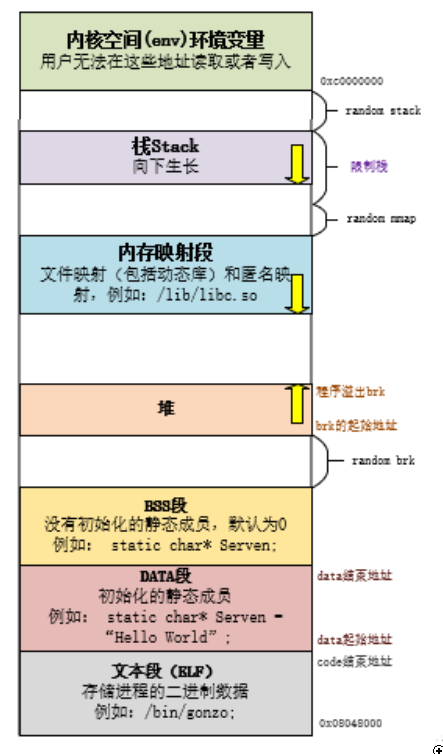
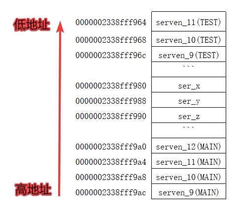

# 深入理解：C++内存分配

程序一般都是在内存中跑的，这章主要讲c++程序运行时的内存分配问题。

讲解包括：内存申请使用的关键字、各种变量在内存中的位置、程序代码在内存中的位置。

这篇会从网络中多篇文档中汲取能量，如果未能罗列引用望海涵

## 什么是内存模型

内存模型就是一种语言它独特的管理者一套程序的机制

C语言会将内存区域划分成堆、栈、静态全局变量区、常量区；

C++则分为堆、栈、自由存储区、全局/静态变量区、常量存储区；

划分的目的是为了能够方便编译器的管理和运行

## 内存的分类

| 分类标准    | 分区数量                                        |
| :---------- | :---------------------------------------------- |
| 两大分区    | 代码区、数据区                                  |
| 四大分区    | 代码区、全局区（全局/静态存储区）、栈区、堆区   |
| c语言分区   | 堆、栈、静态全局变量区、常量区                  |
| c++语言分区 | 堆、栈、自由存储区、全局/静态变量区、常量存储区 |

内存模型根据生命周期的不同分区 自由存储区、动态区、静态区 我们就按照C++语言的内存划分区域来讲解内存管理机制



**文本段（ELF）：** 主要用于存放我们编写的代码，但是不是按照代码文本的形式存放，而是将代码文本编译成二进制代码，存放的是二进制代码，在编译时就已经确定这个区域存放的内容是什么了，并且这个区域是只读区域

**DATA段：** 这个区域主要用于存放编译阶段（非运行阶段时）就能确定的数据，也就是初始化的静态变量、全局变量和常量，这个区域是可读可写的。这也就是我们通常说的静态存储区

**BSS段：** 这个区域存放的是未曾初始化的静态变量、全局变量，但是不会存放常量，因为常量在定义的时候就一定会赋值了。未初始化的全局变量和静态变量，编译器在编译阶段都会将其默认为0

**HEAP（堆）：** 这个区域实在运行时使用的，主要是用来存放程序员分配和释放内存，程序结束时操作系统会对其进行回收，（程序员分配内存像malloc、free、new、delete）都是在这个区域进行的

**STACK（栈）：** 存放函数的参数值和局部变量，这个区域的数据是由编译器来自己分配和释放的，只要执行完这个函数，那么这些参数值和变量都会被释放掉

**内核空间（env）环境变量：** 这个区域是系统内部的区域，我们是不可编辑的

## 各分区例程

### 全局/静态存储区

这个区域有两个段，分别是 `BSS段` 和 `DATA段` ，均存放着`全局变量`和`静态变量`（包括`全局静态变量`和`局部静态变量`）

其中 BSS存放的是程序员编写的**未初始化**的 `全局变量` 和 `静态变量` 而DATA存放**已经初始化**的全局变量、静态变量和常量。

这其中C和C++的BSS还有区别，区别就是：C中的BSS段分为高地址和低地址，高地址是存放全局变量，低地址是存放静态未初始化

```cpp
#include<iostream>
using namespace std;

/*定义全局变量*/
int serven_1;                       // 定义未初始化的全局变量
int serven_2 = 2;                   // 定义初始化的全局变量

static int serven_3;                // 定义未初始化的静态变量
static int serven_4 = 4;            // 定义初始化的静态变量

int main(int argc, char *argv[])
{
    cout<<"BSS:"<<endl;
    cout<<"The address of serven_1:"<<&serven_1<<", The data of serven_1:"<<serven_1<<endl;
    cout<<"The address of serven_3:"<<&serven_3<<", The data of serven_3:"<<serven_3<<endl;

    cout<<"DATA:"<<endl;
    cout<<"The address of serven_2:"<<&serven_2<<", The data of serven_2:"<<serven_2<<endl;
    cout<<"The address of serven_4:"<<&serven_4<<", The data of serven_4:"<<serven_4<<endl;

    return 0;
}
```


**运行结果：**

```text
BSS:
The address of serven_1:00007FF7F3C2E180, The data of serven_1:0
The address of serven_3:00007FF7F3C2E184, The data of serven_3:0
DATA:
The address of serven_2:00007FF7F3C2E000, The data of serven_2:2
The address of serven_4:00007FF7F3C2E004, The data of serven_4:4
```


**结果分析：** 程序定义了两个全局变量 `serven_1` 和 `serven_2` ，两个静态变量 `serven_3` 和 `serven_4` ，其中 `serven_2` 和 `serven_4` 是初始化的，所以 `serven_1` 和 `serven_3` 是存放在 `BSS段` ，并且编译器会将这两个未初始化的变量默认初始化为 `0` ；而 `serven_2` 和 `serven_4` 这两个变量是初始化的，存放在 `DATA段`

### 常量区

上面说到常量是存放在DATA段区域的，下面我们来看一下例子：

```cpp
#include<iostream>
using namespace std;

/*定于全局常量*/
const char* serven_5 ="serven";

int main(int argc, char *argv[])
{
    const char* serven_6 ="serven";
    char * serven_7 = "serven";
    char * serven_8 = serven_7;
    char s[]="serven";
    char s2[]="serven";
    s[1]='1';
    *s='1';
    cout<<"The address of serven_5:"<<&serven_5<<", The data of serven_5:"<<serven_5<<endl;
    cout<<"The address of serven_6:"<<&serven_6<<", The data of serven_6:"<<serven_6<<endl;
    cout<<"The address of serven_7:"<<&serven_7<<", The data of serven_7:"<<serven_7<<endl;
    cout<<"The address of serven_8:"<<&serven_8<<", The data of serven_8:"<<serven_8<<endl;

    cout<<"The address of s:"<<s<<", The data of s:"<<s<<endl;
    cout<<"The address of s2:"<<s2<<", The data of s2:"<<s2<<endl;

    printf("The Pointer of serven_5 :%p\n",serven_5);
    printf("The Pointer of serven_6 :%p\n",serven_6);
    printf("The Pointer of serven_7 :%p\n",serven_7);
    printf("The Pointer of serven_8 :%p\n",serven_8);
    printf("The Pointer of s :%p\n",s);
    printf("The Pointer of s2 :%p\n",s2);

    return 0;
}
```

**Release运行结果：**

```text
The address of serven_5:00007FF6558F5008, The data of serven_5:serven
The address of serven_6:00000096D82FFE60, The data of serven_6:serven
The address of serven_7:00000096D82FFE68, The data of serven_7:serven
The address of serven_8:00000096D82FFE70, The data of serven_8:serven
The address of s:11rven, The data of s:11rven
The address of s2:serven, The data of s2:serven
The Pointer of serven_5 :00007FF6558F32B0
The Pointer of serven_6 :00007FF6558F32B0
The Pointer of serven_7 :00007FF6558F32B0
The Pointer of serven_8 :00007FF6558F32B0
The Pointer of s :00000096D82FFE78
The Pointer of s2 :00000096D82FFE80
```

*这里需要注意的是上面的结果是release的输出，debug的结果并不一定相同。*

**结果解析：**

变量 `serven_5` 是常量，存储在 `DATA段` 区域， `serven_6` 是局部的常量、 `serven_7` 和 `serven_8` 是局部的变量指针，他们都是指向一个常量 “serven”，这个常量存储在常量区的，也就是存储在DATA区域，可以看到在后面打印serven_5~serven_8的时候的地址都是一样的，都是存储在DATA区域。

而 `s` 和 `s2` 是局部变量，存储在栈区域，可以看到代码中打印出来的指针都是在栈区域里面。

总结就是： `s` 和 `s2` 是定义在局部函数里面的变量，所以存放在栈区域，`serven_6` ~ `serven_8` 是定义在局部里面的指针，指向的是常量，所以指向的常量存放在DATA区域，而指针本身存放在栈中

### 栈（Stack）区域

栈区域是编译器自动根据变量进行分配的，不是由程序员进行开辟的，所以编译器即会自动分配也会将其释放，这个区域主要存放函数的参数值、局部变量、形参等等。

```cpp
#include<iostream>
using namespace std;

void TEST(int ser_x, int ser_y, int ser_z){
    int serven_9 = 9;
    int serven_10 = 10;
    int serven_11 = 11;
    printf("The Pointer of ser_x is: %p\n",&ser_x);
    printf("The Pointer of ser_y is: %p\n",&ser_y);
    printf("The Pointer of ser_z is: %p\n",&ser_z);
    printf("The Pointer of serven_9(TEST) is: %p\n",&serven_9);
    printf("The Pointer of serven_10(TEST) is: %p\n",&serven_10);
    printf("The Pointer of serven_11(TEST) is: %p\n",&serven_11);
}

int main(int argc, char *argv[])
{
    int serven_9 = 9;
    int serven_10 = 10;
    int serven_11 = 11;

    printf("The Pointer of serven_9(MAIN) is: %p\n",&serven_9);
    printf("The Pointer of serven_10(MAIN) is: %p\n",&serven_10);
    printf("The Pointer of serven_11(MAIN) is: %p\n",&serven_11);
    TEST(serven_9, serven_10,serven_11);

    int serven_12 = 12;
    printf("The Pointer of serven_12 is: %p\n",&serven_12);

    return 0;
}
```


**Debug运行结果：**

```text
The Pointer of serven_9(MAIN) is: 0000002338fff9ac
The Pointer of serven_10(MAIN) is: 0000002338fff9a8
The Pointer of serven_11(MAIN) is: 0000002338fff9a4
The Pointer of ser_x is: 0000002338fff980
The Pointer of ser_y is: 0000002338fff988
The Pointer of ser_z is: 0000002338fff990
The Pointer of serven_9(TEST) is: 0000002338fff96c
The Pointer of serven_10(TEST) is: 0000002338fff968
The Pointer of serven_11(TEST) is: 0000002338fff964
The Pointer of serven_12(MAIN) is: 0000002338fff9a0
```


*这里注意：release版本，对局部变量有优化，结果就不同了*

**结果解析：** 首先我们先来看一下这个图，是内存管理机制里面的栈，可以看到main函数中定义的变量`serven_9` ~ `serven_11`分别入栈，而且入栈的顺序是从高地址到低地址，每个变量占用4个字节，所以地址相差也就是4个字节

然后就是形参入栈，**形参入栈顺序是从右往左入栈**，所以`ser_z~ser_x`的地址也是依次递减的

最后就是TEST函数里面的局部变量，将局部变量`serven_9 ~ serven_11`依次入栈，并且地址也是一次递减

而且可以看到`serven_12`的地址和`serven_11`是隔壁，由此可以看出，栈的先进后出，也就是调用完函数TEST后会把局部变量`serven_11（TEST）~serven_9（TEST）`、`serv_x~ser_z`全部出栈，然后再将`serven_12`入栈。



但是，我们可以发现了定义`serven_11`之后的调用函数，函数的形参入栈的地址与s`erven_11`定义时的地址相差很远，大概有三个字节，这三个字节中有一个是`serven_11`，那么多出来两个字节是什么呢？

这是因为在调用函数的时候会进行一些操作：

首先我们需要了解几个概念：`栈帧`、`寄存器esp`、`寄存器ebp`

`栈帧`:每个函数有自己的栈帧，栈帧中维持着所需要的各种信息（包括参数、返回地址、参数个数、其它） `寄存器esp`: 保存当前栈帧的栈顶 `寄存器ebp`: 保存当前栈帧的栈底

那么函数在栈入参时候的结构为：

函数的局部变量：（ebp）最右参数->中间参数->最左参数->返回地址->运行时参数（esp）；

### 堆（Heap）区域

这个区域是由程序员来进行分配内存和释放内存用的，当我们使用malloc/free、new/delete（这是在自由存储区上分配和释放的，某种意义上来说呢，起始自由存储区是堆的一个子集）。

在这里要注意的是，我们申请了空间内存一定要释放，如果没有释放那就会导致内存的泄露，后果很严重！！！你遇到过的电脑蓝屏也许就是内存泄漏引起的。

### 堆和栈的区别

| 比较类别 | 堆                           | 栈                        |
| :------- | :--------------------------- | :------------------------ |
| 管理方式 | 由程序员分配和释放           | 编译器自动管理            |
| 空间大小 | 最大可达4GB                  | 空间有限                  |
| 产生碎片 | 会造成空间碎片               | 不会                      |
| 生长方向 | 向上生长（低地址-高地址）    | 向下生长（高地址-低地址） |
| 分配方式 | malloc、new、calloc、realloc | 编译器管理                |
| 分配效率 | 低                           | 高                        |

### 堆和自由存储区的区别

自由存储区其实上是一个逻辑概念

堆是物理概念。

### malloc/free和new/delete的区别

（1）new、delete是C++中的操作符，而malloc和free是标准库函数。操作符可以在类的内部重载，malloc/free不行，唯一的关联只是在默认情况下new/delete调用malloc/free

（2）malloc/free(只是分配内存，不能执行构造函数，不能执行析构函数)，new/free。

（3）new返回的是指定类型的指针，并且可以自动计算所申请内存的大小。而 malloc需要我们计算申请内存的大小，并且在返回时强行转换为实际类型的指针。

### C++中new/delete的工作过程

**申请的是普通的内置类型的空间：**

（1）调用 C++标准库中 operator new函数，传入大小。（如果申请的是0byte则强制转化成1byte）

（2）申请相对应的空间，如果没有足够的空间或其他问题且没有定义_new_hanlder，那么会抛出bad_alloc的异常并结束程序,如果定义了_new_hanlder回调函数，那么会一直不停的调用这个函数直到问题被解决为止

（3）返回申请到的内存的首地址.

**申请的是类空间：**

（1）如果是申请的是0byte，强制转换为1byte

（2）申请相对应的空间，如果没有足够的空间或其他问题且没有定义_new_hanlder，那么会抛出bad_alloc的异常并结束程序

（3）如果定义了_new_hanlder回调函数，那么会一直不停的调用这个函数直到问题被解决为止。

（4）如果这个类没有定义任何构造函数，析构函数，且编译器没有合成，那么下面的步骤跟申请普通的内置类型是一样的。

（5）如果有构造函数或者析构函数，那么会调用一个库函数，具体什么库函数依编译器不同而不同，这个库函数会回调类的构造函数。

（6）如果在构造函数中发生异常，那么会释放刚刚申请的空间并返回异常

（7）返回申请到的内存的首地址

delete 与new相反，会先调用析构函数再去释放内存（delete 实际调用 operator delete）

operator new[]的形参是 sizeof(T)*N+4就是总大小加上一个4(用来保存个数);空间中前四个字节保存填充长度。然后执行N次operator new

operator delete[] 类似；

## 参考文档

[https://zhuanlan.zhihu.com/p/434850899(opens new window)](https://zhuanlan.zhihu.com/p/434850899)

https://blog.csdn.net/weixin_43340455/article/details/124786128