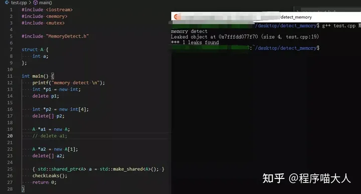

**两三招带你搞定，可以自己撸一个[内存泄漏](https://www.zhihu.com/search?q=内存泄漏&search_source=Entity&hybrid_search_source=Entity&hybrid_search_extra={"sourceType"%3A"answer"%2C"sourceId"%3A1798470821})检测工具**：

先贴个效果图：



它不仅可以检测正常的new和delete申请的内存，还可以检测[智能指针](https://www.zhihu.com/search?q=智能指针&search_source=Entity&hybrid_search_source=Entity&hybrid_search_extra={"sourceType"%3A"answer"%2C"sourceId"%3A1798470821})使用不当引起的内存泄漏，进入正题。

众所周知C++中申请和释放内存使用的是new和delete关键字：

```cpp
void func() {
    A* a = new A();
    delete a;
    A* b = new int[4];
    delete[] b;
}
```

再明确下需求：如果程序中存在内存泄漏，我们的目的是找到这些内存是在哪里分配的，如果能够具体对应到代码中哪一个文件的那一行代码最好。好了需求明确了，开始实现。

内存在哪里释放的我们没必要监测，只需要检测出内存是在哪里申请的即可，如何检测呢？

**整体思路很简单**：在申请内存时记录下该内存的地址和在代码中申请内存的位置，在内存销毁时删除该地址对应的记录，程序最后统计下还有哪条记录没有被删除，如果还有没被删除的记录就代表有内存泄漏。

很多人应该都知道new关键字更底层是通过operator new来申请内存的：

```cpp
void* operator new(std::size_t sz)
```

也就是正常情况下C++都是通过operator new(std::size_t sz)来申请内存，而这个[操作符](https://www.zhihu.com/search?q=操作符&search_source=Entity&hybrid_search_source=Entity&hybrid_search_extra={"sourceType"%3A"answer"%2C"sourceId"%3A1798470821})我们可以重载：

```cpp
void* operator new(std::size_t size, const char* file, int line);
void* operator new[](std::size_t size, const char* file, int line);
```

**tip**：new和new[]的区别我就不具体介绍了，太基础。

如果能让程序申请内存时调用重载的这个函数，就可以记录下内存申请的具体位置啦。

怎么能够让底层程序申请内存时调用重载的这个函数呢？这里可以对new使用宏定义：

```cpp
#define new new (__FILE__, __LINE__)
```

有了这个宏定义后，在new A的时候底层就会自动调用operator new(std::size_t size, const char* file, int line)函数，至此达到了我们记录内存申请位置的目的。

这里有两个问题：

1. 在哪里记录内存申请的位置等信息呢？如果在operator new内部又申请了一块内存，用于记录位置，那新申请的这块内存需要记录不？这岂不是[递归调用](https://www.zhihu.com/search?q=递归调用&search_source=Entity&hybrid_search_source=Entity&hybrid_search_extra={"sourceType"%3A"answer"%2C"sourceId"%3A1798470821})了？
2. 只有在new宏定义包裹范围内申请了内存才会被记录，然而某些第三方库或者某些地方没有被new宏定义包裹，可能就无法被监测是否申请了内存吧？

下面逐个击破：

**哪里存储具体信息？**

我们肯定不能让它递归调用啊，那这些信息存储在哪里呢？这里可以在每次申请内存时，一次性申请一块稍微大点的内存，具体信息存储在多余的那块内存里，像这样：

```cpp
static void* alloc_mem(std::size_t size, const char* file, int line, bool is_array) {
    assert(line >= 0);

    std::size_t s = size + ALIGNED_LIST_ITEM_SIZE;
    new_ptr_list_t* ptr = (new_ptr_list_t*)malloc(s);
    if (ptr == nullptr) {
        std::unique_lock<std::mutex> lock(new_output_lock);
        printf("Out of memory when allocating %lu bytes\n", (unsigned long)size);
        abort();
    }
    void* usr_ptr = (char*)ptr + ALIGNED_LIST_ITEM_SIZE;

    if (line) {
        strncpy(ptr->file, file, _DEBUG_NEW_FILENAME_LEN - 1)[_DEBUG_NEW_FILENAME_LEN - 1] = '\0';
    } else {
        ptr->addr = (void*)file;
    }

    ptr->line = line;
    ptr->is_array = is_array;
    ptr->size = size;
    ptr->magic = DEBUG_NEW_MAGIC;
    {
        std::unique_lock<std::mutex> lock(new_ptr_lock);
        ptr->prev = new_ptr_list.prev;
        ptr->next = &new_ptr_list;
        new_ptr_list.prev->next = ptr;
        new_ptr_list.prev = ptr;
    }
    total_mem_alloc += size;
    return usr_ptr;
}
```

new_ptr_list_t结构体定义如下：

```cpp
struct new_ptr_list_t {
    new_ptr_list_t* next;
    new_ptr_list_t* prev;
    std::size_t size;
    union {
        char file[200];

        void* addr;
    };
    unsigned line;
};
```

没有被new宏包裹的地方可以检测的到吗？

没有被new宏包裹的地方是会调用operator new(std::size_t sz)函数来申请内存的。这里[operator new函数](https://www.zhihu.com/search?q=operator new函数&search_source=Entity&hybrid_search_source=Entity&hybrid_search_extra={"sourceType"%3A"answer"%2C"sourceId"%3A1798470821})不只可以重载，还可以重新定义它的实现，而且不会报multi definition的错误哦。因为它是一个weak symbol，有关strong symbol和weak symbol的知识点可以看我之前的一篇文章：

[程序喵大人：谈谈程序链接及分段那些事48 赞同 · 4 评论文章](https://zhuanlan.zhihu.com/p/145263213)

**这里还有更多的好文章，对于C++我把之前写过的所有文章学习资料全部系统地整理成PDF电子书，可以说干货满满**，可以点击下方卡片获取：


回到正题，既然可以重定义，那就可以这样：

```cpp
void* operator new(std::size_t size) { 
    return operator new(size, nullptr, 0); 
}
```

这样有个缺点，就是不能记录内存申请的具体代码位置，只能记录下来是否申请过内存，不过这也挺好，怎么也比没有任何感知强的多。

其实这里不是没有办法，尽管没有了new宏，获取不到具体申请内存的代码位置，但是可以获取到[调用栈信息](https://www.zhihu.com/search?q=调用栈信息&search_source=Entity&hybrid_search_source=Entity&hybrid_search_extra={"sourceType"%3A"answer"%2C"sourceId"%3A1798470821})，把调用栈信息存储起来，还是可以定位大体位置。关于如何获取调用栈信息，大家可以研究下**libunwind库**看看。

**释放内存时怎么办？**

这里需要重定义operator delete(void* ptr)函数：

```cpp
void operator delete(void* ptr) noexcept { 
    free_pointer(ptr, nullptr, false); 
}
```

free_pointer函数的大体思路就是在链表中找到要对应节点，删除掉，具体定义如下：

```cpp
static void free_pointer(void* usr_ptr, void* addr, bool is_array) {
    if (usr_ptr == nullptr) {
        return;
    }
    new_ptr_list_t* ptr = (new_ptr_list_t*)((char*)usr_ptr - ALIGNED_LIST_ITEM_SIZE);
    {
        std::unique_lock<std::mutex> lock(new_ptr_lock);
        total_mem_alloc -= ptr->size;
        ptr->magic = 0;
        ptr->prev->next = ptr->next;
        ptr->next->prev = ptr->prev;
    }
    free(ptr);
}
```

**如何检测是否有内存泄漏？**

[遍历链表](https://www.zhihu.com/search?q=遍历链表&search_source=Entity&hybrid_search_source=Entity&hybrid_search_extra={"sourceType"%3A"answer"%2C"sourceId"%3A1798470821})即可，每次new时候会把这段内存插入链表，delete时候会把这段内存从链表中移出，如果程序最后链表长度不为0，即为有内存泄漏，代码如下：

```cpp
int checkLeaks() {
    int leak_cnt = 0;
    int whitelisted_leak_cnt = 0;
    new_ptr_list_t* ptr = new_ptr_list.next;

    while (ptr != &new_ptr_list) {
        const char* const usr_ptr = (char*)ptr + ALIGNED_LIST_ITEM_SIZE;
        printf("Leaked object at %p (size %lu, ", usr_ptr, (unsigned long)ptr->size);
        if (ptr->line != 0) {
            print_position(ptr->file, ptr->line);
        } else {
            print_position(ptr->addr, ptr->line);
        }
        printf(")\n");
        ptr = ptr->next;
        ++leak_cnt;
    }
    return leak_cnt;
}
```

关于可以重定义[operator new](https://www.zhihu.com/search?q=operator new&search_source=Entity&hybrid_search_source=Entity&hybrid_search_extra={"sourceType"%3A"answer"%2C"sourceId"%3A1798470821})这个操作，我也是最近看到别人代码后才发现，于是参考别人代码小撸了个代码检测工具，希望大家有所收获！