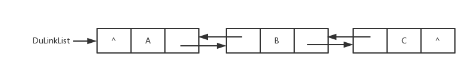
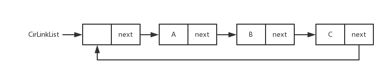
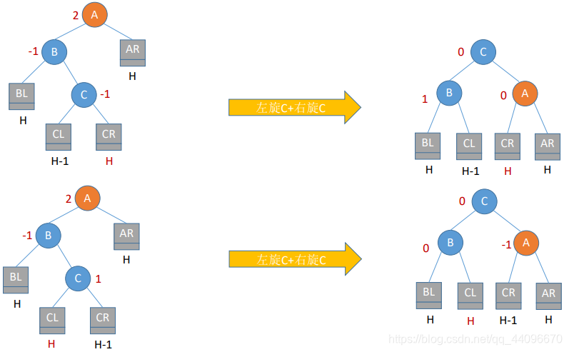
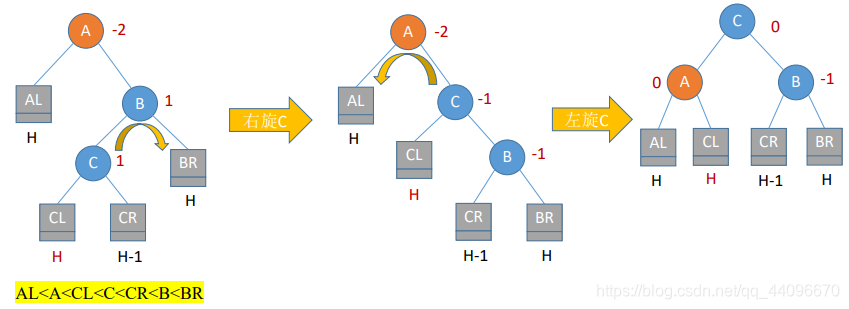
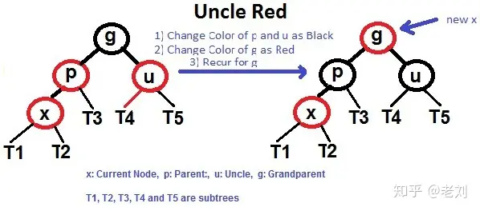

## 定义

数据结构分为**逻辑结构**和**物理结构**。  

- 逻辑结构：指数据元素之间逻辑关系的数据结构，这里的逻辑关系是指数据元素之间的前后间关系，与数据在计算机中的存储位置无关。
- 物理结构：指数据的逻辑结构在计算机存储空间中的存放形式称为数据的物理结构，也叫做存储结构。

### 逻辑结构
数据的**逻辑结构**主要分为**线性结构**和**非线性结构**。  

- 线性结构：数据结构的元素之间存在一对一线性关系，所有结点都最多只有一个直接前趋结点和一个直接后继结点。常见的有数组、队列、链表、栈。
- 非线性结构：各个结点之间具有多个对应关系，一个结点可能有多个直接前趋结点和多个直接后继结点。常见的有多维数组、广义表、树结构和图结构等。

### 物理结构
数据的**物理结构**（以后我都统一称存储结构），表示数据元素之间的逻辑关系，一种数据结构的逻辑结构根据需要可以表示成多种存储结构，常用的存储结构有：  

- **顺序存储**：存储顺序是连续的，在内存中用一组地址连续的存储单元依次存储线性表的各个数据元素。
- **链式存储**：在内存中的存储元素不一定是连续的，用任意地址的存储单元存储元素，元素节点存放数据元素以及通过指针指向相邻元素的地址信息。
- **索引存储**：除建立存储结点信息外，还建立附加的索引表来标识节点的地址。索引表由若干索引项组成。
- **散列存储**：又称Hash存储，由节点的关键码值决定节点的存储地址。

## 线性结构

### 数组（Array）

一种使用连续内存，存储线性数据的结构。


#### 顺序表（Sequence List）
用数组实现了队列List的功能模板，并可动态扩容

[SqList.cpp](https://github.com/su-dd/learning/blob/main/src/DataStructure/SqList.cpp)
顺序表数据结构和图片
```cpp
//顺序列表的类型
typedef struct {
    ElemType *elem; // 队列首指针
    int length;     // 队列中元素个数
    int size;       // 队列大小
    int increment;  // 扩增大小
} SqList;
```


### 链表（Linked List）

一种使用非连续内存，存储线性数据的结构。

在内存的的表现为：

数据结构：
```cpp
typedef struct LNode {
    ElemType data;
    struct LNode *next;
} LNode, *LinkList;
```
##### 单链表（Link List）

##### 双向链表（Du-Link-List）

##### 循环链表（Cir-Link-List）



### 队列（Queue）

一种先进先出（FIFO，First in First out）的线性结构；


#### 数组队列
数据结构
```cpp
typedef struct {
	ElemType * elem;
	int front;
	int rear;
	int maxSize;
}SqQueue;
```

**非循环队列**

```cpp
SqQueue.rear++
```

**循环队列**

```cpp
SqQueue.rear = (SqQueue.rear + 1) % SqQueue.maxSize
```

#### 链队列


### 栈（Stack）

一种后进先出（LIFO，Last in First out）的线性结构；


#### 顺序栈

用数组实现了栈的功能模板，并可动态扩容

[SqStack.cpp](https://github.com/su-dd/learning/blob/main/src/DataStructure/SqStack.cpp)
顺序栈数据结构和图片
```cpp
//顺序栈的类型
typedef struct {
    ElemType *elem; // 栈底指针
    int top;        // 栈顶
    int size;       // 当前大小
    int increment;  // 扩增
} SqSrack;
```


## 非线性结构
### 树（Tree）

树形结构是一种层级式的数据结构，由顶点（节点）和连接它们的边组成。  
数的结构特点是：  

- 每个节点有零个或多个子节点；
- 没有父节点的节点称为根节点；
- 每一个非根节点有且只有一个父节点；
- 除了根节点外，每个子节点可以分为多个不相交的子树。

#### 二叉树
- 每个结点最多有两颗子树，结点的度最大为2。
- 左子树和右子树是有顺序的，次序不能颠倒。
- 即使某结点只有一个子树，也要区分左右子树。
- 每个结点的值均大于其左子树上任意一个结点的值。比如 根结点的值。根结点100大于其左子树上的30，18和16。
- 每个结点的值均小于其右子树上任意 一个结点的值。比如根结点 100 小于其右子树上的 120、130 和 135。


##### 存储结构

[BinaryTree.cpp](https://github.com/su-dd/learning/blob/main/src/DataStructure/BinaryTree.cpp)

二叉树数据结构

```c
typedef struct BiTNode
{
    TElemType data;
    struct BiTNode *lchild, *rchild;
}BiTNode, *BiTree;
```

###### 顺序存储

二叉树顺序存储图片


###### 链式存储

二叉树链式存储图片


##### 遍历方式

**DLR--前序遍历**

根在前，从左往右，一棵树的根永远在左子树前面，左子树又永远在右子树前面 


```cpp
	void pre_order(BiTree Node)//前序遍历递归算法
	{
		if (Node == NULL)
			return;
		printf("%c ", Node->data);//显示节点数据，可以更改为其他操作。在前面
		pre_order(Node->lchild);
		pre_order(Node->rchild);
	}****
```

**LDR--中序遍历**

根在中，从左往右，一棵树的左子树永远在根前面，根永远在右子树前面


```cpp
	void middle_order(BiTree Node)//中序遍历递归算法
	{
		if (Node == NULL)
			return;
		middle_order(Node->lchild);
		printf("%c ", Node->data);// 显示节点数据，可以更改为其他操作。在中间
		middle_order(Node->rchild);
	}
```

**LRD--后序遍历**

根在后，从左往右，一棵树的左子树永远在右子树前面，右子树永远在根前面


```cpp
	void post_order(BiTree Node)//后序遍历递归算法
	{
		if (Node == NULL)
			return;
		post_order(Node->lchild);
		post_order(Node->rchild);
		printf("%c ", Node->data);// 显示节点数据，可以更改为其他操作。在最后
	}
```

**层次遍历**

一层一层的遍历当前树；

一般通过中间容器存储一个层级的节点，实现层级变量


#### 满二叉树

除最后一层无任何子节点外，每一层上的所有结点都有两个子结点二叉树。或者说：一个二叉树，如果每一个层的结点数都达到最大值，则这个二叉树就是满二叉树。或者说，如果一个二叉树的层数为K，且结点总数是(2^k) -1 ，则它就是满二叉树。


#### 完全二叉树

完全二叉树是效率很高的数据结构，完全二叉树是由满二叉树而引出来的。对于深度为K的，有n个结点的二叉树，当且仅当其每一个结点都与深度为K的满二叉树中编号从1至n的结点一一对应时称之为完全二叉树。

或者说：若设二叉树的深度为h，除第 h 层外，其它各层 (1～h-1) 的结点数都达到最大个数，第 h 层所有的结点都连续集中在最左边，这就是完全二叉树。


#### 堆（Heap）

堆比较特殊，是一种图的树形结构。被用于实现“优先队列”(priority queues)，优先队列是一种数据结构，可以自由添加数据，但取出数据时要从最小值开始按顺 序取出。在堆的树形结构中，各个顶点被称为“结点”(node)，数据就存储在这些结点中。  

只要满足下面两个特点的树形结构就是堆：  

- 堆是一个完全二叉树（所谓完全二叉树就是除了最后一层其他层的节点个数都是满的）。
- 大顶堆：根 >= 左 && 根 >= 右
- 小顶堆：根 <= 左 && 根 <= 右


#### 二叉查找树（二叉排序树，二叉搜索树）

值：左 < 根 < 右
1. 若左子树不空，则左子树上所有结点的值均小于它的根结点的值；  
2. 若右子树不空，则右子树上所有结点的值均大于它的根结点的值；  
3. 左、右子树也分别为二叉排序树；  

##### 二叉搜索树的搜索性能

在最好的情况下，二叉搜索树的查找效率比较高，是 O(logn)，其访问性能近似于二分法；

但最差时候会是 O(n)，比如插入的元素是有序的，生成的二叉搜索树就是一个链表，树的一条腿特变长，这种情况下，需要遍历全部元素才行


##### 删除
- 删除节点是树叶，则直接删除；
- 删除的节点只有一个子节点，此时只需要将删除节点的上一个节点的指向该节点的指针指向该节点唯一的子节点；
- 删除的节点有两个子节点（递归）
	- 将该节点右子树中最小的一个节点的值覆盖该节点中的值，然后再删除该节点的右子树中的最小的那个子节点
	- 将该节点左子树中最大的一个节点的值覆盖该节点中的值，然后再删除该节点的左子树中的最大的那个子节点

#### 平衡二叉树（AVL树）
定义：| 左子树树高 - 右子树树高 | <= 1

平衡二叉树的提出就是为了保证树不至于出现二叉查找树的极端一条腿长现象，尽量保证两条腿平衡。因此它的定义如下：

定义：平衡二叉树要么是一棵空树，要么保证左右子树的高度之差不大于 1，并且子树也必须是一棵平衡二叉树。


**查找效率为：**


##### 最小失衡树

平衡二叉树插入新结点导致失衡的子树：

###### 右旋左旋

  

**图解代码**


###### 调整

**LL型**（根的左孩子的左子树插入导致不平衡）：根的左孩子右旋


**RR型**（根的右孩子的右子树插入导致不平衡）：根的右孩子左旋


**LR型**（根的左孩子的右子树插入导致不平衡）：根的左孩子左旋，再右旋




**RL型**（根的右孩子的左子树插入导致不平衡）：右孩子的左子树右旋，再左旋




##### 删除
- 删除节点是树叶，则直接删除；
- 删除的节点只有一个子节点，此时只需要将删除节点的上一个节点的指向该节点的指针指向该节点唯一的子节点；
- 删除的节点有两个子节点（递归）
	- 将该节点右子树中最小的一个节点的值覆盖该节点中的值，然后再删除该节点的右子树中的最小的那个子节点
	- 将该节点左子树中最大的一个节点的值覆盖该节点中的值，然后再删除该节点的左子树中的最大的那个子节点

#### 红黑树

[RedBlackTree.cpp](https://github.com/su-dd/learning/blob/main/src/DataStructure/RedBlackTree.cpp)

首先红黑树（RBT）先是一个二叉搜索树（BST），他是解决二叉搜索树单链情况，区别于二叉平衡树（AVL）的另一种办法；

##### 红黑树的特征是什么？

可以按照括号里边的分类，记住 红黑树的几个原则：

- （**颜色属性**）性质1：节点非黑即红
- （**根属性**）性质2：根节点一定是黑色
- （**叶子属性**）性质3：叶子节点（NIL）一定是黑色
- （**红色属性**）性质4：每个红色节点的两个子节点，都为黑色。(从每个叶子到根的所有路径上不能有两个连续的红色节点)
- **（黑色属性）性质5：** 从任一节点到其每个叶子的所有路径，都包含相同数目的黑色节点。


**红色属性** 说明，红色节点的孩子，一定是黑色。 但是，RBTree 黑色节点的孩子，可以是红色，也可以是黑色；

**黑色属性**，可以理解为**平衡特征**， 如果满足不了平衡特征，就要进行平衡操作。

**新插入的节点一定是红色，且新节点的Parent也是红色；这时，需要调整**
##### 调整
设我们插入的新节点为 X

 **变色**
 1. 如果 X 是根结点(root)，则标记为黑色
 2. 如果 X 的 parent 为红，同时 uncle是红

 	

**左旋右旋**：如果 X 的 parent 为红，同时 uncle是黑色

- **LL** ：Parent节点右旋，变色
	
	

- **LR** ：先X节点左旋，再右旋，变色
	 
	 
	
- **RR** ：Parent节点右旋，变色
	 
	 
	
- **RL** ：先X节点右旋，再左旋，变色
	 
	 
	

##### 应用
- 关联数组：如 STL 中的 map、set

##### 红黑树、二叉树搜索树的区别？

- 红黑树放弃了追求完全平衡，追求大致平衡，在与平衡二叉树的时间复杂度相差不大的情况下，保证每次插入最多只需要三次旋转就能达到平衡，实现起来也更为简单。
- 平衡二叉树追求绝对平衡，条件比较苛刻，实现起来比较麻烦，每次插入新节点之后需要旋转的次数不能预知。

[红黑树，超强动静图详解，简单易懂 - 知乎 (zhihu.com)](https://zhuanlan.zhihu.com/p/79980618)

##### 删除

1. 删除的节点的左、右子树都非空；
2. 删除的节点的左子树为空树，右子树非空；
3. 删除的节点的右子树为空树，左子树非空；
4. 删除的节点的左、右子树都为空树；

分析：1 可以通过，替换 中序遍历的 前置位的值，或后置位的值。转换为 2,3,4 ； 后面只讨论2,3,4

设删除节点为D

**D为红色**


分析：因为D为红色，所以P必为黑色，同时DR不可能为红色(否则违反性质4)。同时由于性质5，则DR必为Nil，否则就D树来说，经过DR与不经过DR的路径的黑节点数必不相同。现在要删除D节点，只需要直接将D节点删除，并将DR作为P的左子节点即可。

**D为黑色，DL为Nil，DR为红色**


分析：由于删除的D为黑色，删除后P的左子树的黑节点数必少1，此时刚好DR为黑色，并且删除后DR可以占据D的位置(这样仍是一棵二叉搜索树，只是暂时还不是合格的红黑树罢了)，然后再将DR的颜色改为黑色，刚好可以填补P左子树所减少的黑节点数。从而P树又平衡了。

**D为黑色，且DR为Nil，S为红**


当前状态，D下面两个位Nil，S为红，SL和SR必定不为空。

需要将P左转，做变色


**D为黑色，且DR为Nil，S为黑**


- **SL、SR都为Nil；P为黑。**


分析：S改为红色

- **SL、SR都为Nil；P为红。**


分析：结果同上，S改黑，P改为黑色。


- **SL为红，SR颜色任意；**(对于该情况的处理，其实我们不关心P的颜色)


分析：将S右旋转；接着将SL改为P的颜色，P的颜色改为黑色(用这个黑色来填补DR分支的黑节点数)；将P左旋转


- **SR为红，SL颜色任意；**(对于该情况的处理，其实我们不关心P的颜色)


分析：将S由黑色改为P的颜色；将SR由红色改为黑色；将P的颜色改为黑色(用该黑色来填补DR分支缺失的黑节点数)；将P节点左旋转；

#### B 树（B-tree）、B+ 树（B+-tree）


##### 特点

- 一般化的二叉查找树（binary search tree）
- “矮胖”，内部（非叶子）节点可以拥有可变数量的子节点（数量范围预先定义好）

##### 应用

- 大部分文件系统、数据库系统都采用B树、B+树作为索引结构

##### 区别

- B+树中只有叶子节点会带有指向记录的指针（ROWID），而B树则所有节点都带有，在内部节点出现的索引项不会再出现在叶子节点中。
- B+树中所有叶子节点都是通过指针连接在一起，而B树不会。

##### B树的优点

对于在内部节点的数据，可直接得到，不必根据叶子节点来定位。

##### B+树的优点

- 非叶子节点不会带上 ROWID，这样，一个块中可以容纳更多的索引项，一是可以降低树的高度。二是一个内部节点可以定位更多的叶子节点。
- 叶子节点之间通过指针来连接，范围扫描将十分简单，而对于B树来说，则需要在叶子节点和内部节点不停的往返移动。

> B 树、B+ 树区别来自：[differences-between-b-trees-and-b-trees](https://stackoverflow.com/questions/870218/differences-between-b-trees-and-b-trees)、[B树和B+树的区别](https://www.cnblogs.com/ivictor/p/5849061.html)

[一文详解 B-树，B+树，B*树 - 知乎 (zhihu.com)](https://zhuanlan.zhihu.com/p/98021010)

##### 红黑树、B 树、B+ 树的区别？

- 红黑树的深度比较大，而 B 树和 B+ 树的深度则相对要小一些
- B+ 树则将数据都保存在叶子节点，同时通过链表的形式将他们连接在一起。

### 散列表（Hash）

散列表又叫哈希表，存储的是由键(key)和值(value)组 成的数据，根据键直接访问存储在内存存储位置的数据结构。


从图中可以看出，左边很明显是个数组，数组的每个成员包括一个指针，指向一个链表的头，当然这个链表可能为空，也可能元素很多。我们根据元素的一些特征把元素分配到不同的链表中去，也是根据这些特征，找到正确的链表，再从链表中找出这个元素。

**哈希表查找数据的公式为：记录的存储位置=f(key)** 

这里的对应关系 f 成为散列函数，又称为哈希 (hash函数)，而散列表就是把Key通过一个固定的算法函数既所谓的哈希函数转换成一个整型数字，然后就将该数字对数组长度进行取余，取余结果就当作数组的下标，将value存储在以该数字为下标的数组空间里，这种存储空间可以充分利用数组的查找优势来查找元素，所以查找的速度很快。

#### 概念

哈希函数：`H(key): K -> D , key ∈ K`
#### 构造方法
- 直接定址法
- 除留余数法
- 数字分析法
- 折叠法
- 平方取中法
#### 冲突处理方法
- 链地址法：key 相同的用单链表链接
- 开放定址法
    - 线性探测法：key 相同 -> 放到 key 的下一个位置，`Hi = (H(key) + i) % m`
    - 二次探测法：key 相同 -> 放到 `Di = 1^2, -1^2, ..., ±（k)^2,(k<=m/2）`
    - 随机探测法：`H = (H(key) + 伪随机数) % m`

#### 线性探测的哈希表数据结构实现
 
[HashTable.cpp](https://github.com/su-dd/learning/blob/main/src/DataStructure/HashTable.cpp)

线性探测的哈希表数据结构和图片
```cpp
typedef char KeyType;
// 哈希表中的记录类型
typedef struct {
	KeyType key;
}RcdType;

// 哈希表类型
typedef struct {
	RcdType* rcd;	// 哈希容器指针
	int size;	// 容量
	int count;	// 当前大小
	int* tag;	// 满空标识，有值1，无值0，删除-1 哈希表用过的同一个key，只能在一个位置，所以需要-1这个值
}HashTable;
```


### 图（Graph）

由顶点和连接每对顶点的边所构成的图形就是图

圆圈叫作“顶点”(Vertex，也叫“结点”)，连接顶点的线叫作“边”（Edge）。也就是说，由顶点和连接每对顶点的边所构成的图形就是图。 图按照顶点指向的方向可分为无向图和有向图，像下面的就叫无向图。 图在存储数据上有着比较复杂和高效的算法，分别有邻接矩阵 、邻接表、十字链表、邻接多重表、边集数组等存储结构。常见的图遍历算法就是广度优先算法和深度优先算法。


