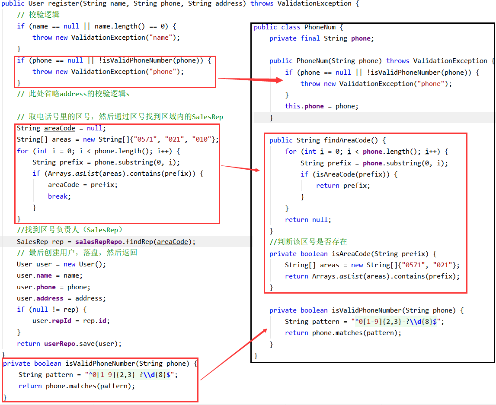
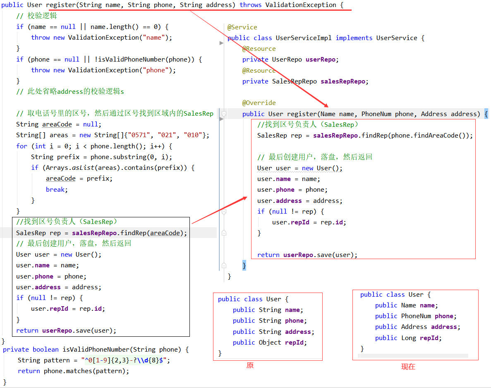

这篇详细介绍 值对象、DP 的含义，以及如何使用DP优化现有代码。

## 值对象
首先了解第一个概念：值对象

《实现领域驱动设计》定义：

> 描述了领域中的一件东西
> 
> 不可变的
> 
> 将不同的相关属性组合成了一个概念整体
> 
> 当度量和描述改变时，可以用另外一个值对象予以替换
> 
> 可以和其他值对象进行相等性比较
> 
> 不会对协作对象造成副作用

简单来说：以对象的形式，在DDD中起到值的作用。

这里做一个类比的理解, 如果将一个复杂系统比做一个简单的程序。
```cpp
#include <iostream>
using namespace std;
int main()
{
    ***

    int a = 3;
    int b = 4;
    cout << a+b << endl;

    ***
    return 0;
}
```
上述代码中的int类型的a、b，就可以近似的理解为值对象。

## DP（Domain Primitive）

DP是在特定领域、拥有精准定义、可以自我验证、拥有行为的值对象（ValueObject）。 它是领域的最小组成部分。

DP三原则：
 - 让隐性的概念显性化
 - 让隐性的上下文显性化
 - 封装多对象行为

DP比较抽象，下面以实例的方式具体的介绍DP。
## 实例要求
一个简单的注册业务要求：

> 1、参数为 客户姓名、手机号、地区；需要 校验姓名、手机号、地区信息的有效性。
> 
> 2、根据手机号的归属地和所属运营商，查询得到关联的销售组信息，该销售组ID将作为用户的一个属性。
> 
> 3、据用户信息，构建用户对象；并存入数据库；

## 常见代码
```java
public class User {
    String name;
    String phone;
    String address;
    Long repId;
}

public class UserServiceImpl implements UserService {

    public User register(String name, String phone, String address) 
      throws ValidationException {
        // 校验逻辑
        if (name == null || name.length() == 0) {
            throw new ValidationException("name");
        }
        if (phone == null || !isValidPhoneNumber(phone)) {
            throw new ValidationException("phone");
        }
        // 此处省略address的校验逻辑

        // 取电话号里的区号，然后通过区号找到区域内的SalesRep
        String areaCode = null;
        String[] areas = new String[]{"0571", "021", "010"};
        for (int i = 0; i < phone.length(); i++) {
            String prefix = phone.substring(0, i);
            if (Arrays.asList(areas).contains(prefix)) {
                areaCode = prefix;
                break;
            }
        }
        //找到销售负责人（SalesRep）
        SalesRep rep = salesRepRepo.findRep(areaCode);

        // 最后创建用户，落盘，然后返回
        User user = new User();
        user.name = name;
        user.phone = phone;
        user.address = address;
        if (null != rep) {
          user.repId = rep.id;
        }

        return userRepo.save(user);
    }

    private boolean isValidPhoneNumber(String phone) {
        String pattern = "^0[1-9]{2,3}-?\\d{8}$";
        return phone.matches(pattern);
    }
}
```
找找问题？

## 认知问题
### 1、接口调用错误不能在前期识别

具体来说调用函数：
```java
public User register(String name, String phone, String address) 
```
传参的错误,我们无法在编译前期知道,只能在业务运行到这来时，通过调试发现。

常见错误有：
- 参数顺序搞错


### 2、大量的数据校验逻辑，导致的不稳定性
```java
// 校验逻辑
if (name == null || name.length() == 0) {
    throw new ValidationException("name");
}
if (phone == null || !isValidPhoneNumber(phone)) {
    throw new ValidationException("phone");
}
// 此处省略address的校验逻辑
```
代码这里已经有三个逻辑判断，这里存在如下问题：
1. 代码的位置不合适，当业务判断发生变化时，需要【修改】、【测试】注册逻辑。
2. 代码复用不方便。例：号码可能被多个阶段使用，这里需要多份代码。
3. 多个判断，测试用例条件翻倍。
4. 业务异常和校验异常不能被合理区分。

### 3、胶水代码的存在，导致业务代码不清晰
> 从一些入参里抽取一部分数据，然后调用一个外部依赖获取更多的数据，然后从新的数据中再抽取部分数据用作其他的作用


```java
// 取电话号里的区号，然后通过区号找到区域内的SalesRep
String areaCode = null;
String[] areas = new String[]{"0571", "021", "010"};
for (int i = 0; i < phone.length(); i++) {
    String prefix = phone.substring(0, i);
    if (Arrays.asList(areas).contains(prefix)) {
        areaCode = prefix;
        break;
    }
}
```
这段代码，就是一段截取区号的代码。本质上不应是独属于属于注册用户业务。对于这样的代码就需要被封装起来。

```java
//从号码中获取区号
private static String findAreaCode(String phone) {
    for (int i = 0; i < phone.length(); i++) {
        String prefix = phone.substring(0, i);
        if (isAreaCode(prefix)) {
            return prefix;
        }
    }
    return null;
}
//判断该区号是否存在
private static boolean isAreaCode(String prefix) {
    String[] areas = new String[]{"0571", "021"};
    return Arrays.asList(areas).contains(prefix);
}
```
原代码的调用：
```java
//获取区号
String areaCode = findAreaCode(phone);
//找到区号负责人
SalesRep rep = salesRepRepo.findRep(areaCode);
```
但即便这样，胶水痕迹依然存在；获取区号的能力，不应属于注册用户的service。

## 代码优化实例
这里我们使用DP的思想来，优化源代码。

### 让隐性的概念显性化
首先是【让隐性的概念显性化】；从代码上看，不难发现这段代码隐藏三个概念：name，phone，address
```java
public User register(String name, String phone, String address) 
```
以phone举例，对phone进行概念显性化。就是对phone进行封装。

接口改为:
```java
public User register(Name name, PhoneNum phone, Address address) 

// 调用：
register(new Name("小张"), new PhoneNum("123**1"), new Address("上海市 黄浦区 南京路 110号")) 
```

解决了第一个问题【**接口调用错误不能在前期识别**】，
同时可以在构造函数中添加有效性判断，以简化和解决第二个问题【**大量的数据校验逻辑**】
区号为电话号码的属性，应该封装到【PhoneNumber】中，这时就解决了第三个问题【**业务代码不清晰**】



原代码的调用：
```java
//找到区号负责人
SalesRep rep = salesRepRepo.findRep(phone.getAreaCode());
```

### 让隐性的上下文显性化

> 什么是：上下文？
> 限界上下文是一个边界，领域模型便存在在这个边界之内。当模型被一个显示的边界所包围时，其中每个概念的含义便是确定的了。因此，限界上下文主要是一个语义上的边界。

这句话表示的比较抽象，给一个简单的解释：前提，基础。

举个例子：比较下两个地址
```java
new Address("上海市 黄浦区 南京路 110号");
new Address("南京路 110号");
```
地址一，我们很容易找到； 地址二，如果对于上海容易找到，但对于全国就难以确定了。 

这里 【上海市，黄浦区】就是 【南京路 110号】 的前提。

同理，如果存在两个上海市，那么我们就需要【中国】这样的前提。

因此我们需要将这些上下文显现的定义下来：
```java
public class Address {
  private final String country;
  private final String province;
  private final String city;
  ...
}
```

### 封装多对象行为
这里指，一个DP可以封装多个DP的行为；及鼓励DP的重用。
希望Address和PhoneNumber，可以被重用；以减少重复代码。

如Address和PhoneNumber，现在用于注册。如果这是一个电商系统，也可以用于商品的寄送。

## 最终代码比较



## git代码

仓库位置：<https://github.com/su-dd/demo.git>

代码位置：[领域模型/05Demo](https://github.com/su-dd/demo/tree/main/领域模型/05Demo)

实例参考：https://blog.csdn.net/weixin_42596778/article/details/118938934