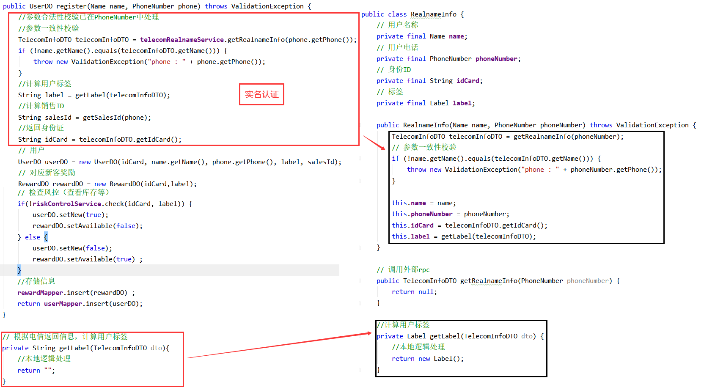
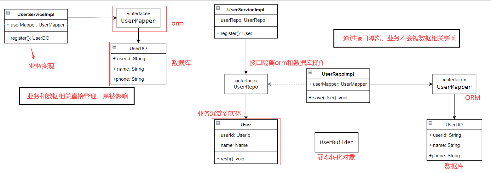
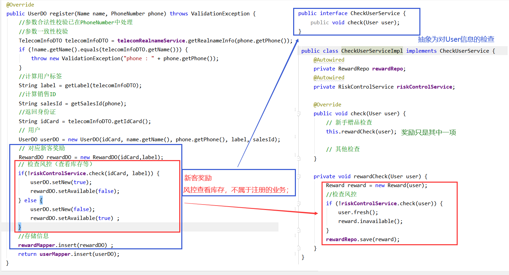

这一节，主要通过实例的方式；解读：实体、领域服务、应用服务。

## 实例要求
> 1、参数为 客户姓名、手机号；需要 校验姓名、手机号、地区信息的有效性；**并且需要做实名认证。**
> 
> 2、**根据得到的实名信息，按照一定逻辑计算得出该用户的标签，该标签将作为用户的一个属性**
> 
> 3、根据手机号的归属地和所属运营商，查询得到关联的销售组信息，该销售组ID将作为用户的一个属性。
> 
> 4、**根据用户信息，构建用户对象和福利对象，并查询风控是否通过。**
> 
> 5、若通过，用户失去新客身份，且可以查询到福利信息，数据落库。
若不通过，用户保持新客身份，但查询不到福利信息，数据落库。


## 常见代码
```java
public class UserServiceImpl implements UserService {
    @Resource
    private UserMapper userMapper;
    @Resource
    private SalesMapper salesMapper;
    @Resource
    private RewardMapper rewardMapper;
    @Autowired
    private TelecomRealnameService telecomRealnameService;
    @Autowired
    private RiskControlService riskControlService;
    @Override
    public UserDO register(Name name, PhoneNumber phone) throws ValidationException {
        //参数合法性校验已在PhoneNumber中处理
        //参数一致性校验
        TelecomInfoDTO telecomInfoDTO = telecomRealnameService.getRealnameInfo(phone.getPhone());
        if (!name.getName().equals(telecomInfoDTO.getName())) {
            throw new ValidationException("phone : " + phone.getPhone());
        }
        //计算用户标签
        String label = getLabel(telecomInfoDTO);
        //计算销售组
        String salesId = getSalesId(phone);
        //返回身份证
        String idCard = telecomInfoDTO.getIdCard();
        // 用户
        UserDO userDO = new UserDO(idCard, name.getName(), phone.getPhone(), label, salesId);
        // 对应新客奖励
        RewardDO rewardDO = new RewardDO(idCard,label);
        // 检查风控（查看库存等）
        if( !riskControlService.check(idCard, label)) {
            userDO.setNew(true);
            rewardDO.setAvailable(false);
        } else {
            userDO.setNew(false);
            rewardDO.setAvailable(true) ;
        }
        //存储信息
        rewardMapper.insert(rewardDO) ;
        return userMapper.insert(userDO);
    }

    private String getLabel(TelecomInfoDTO dto){
        //本地逻辑处理
        return "";
    }

    // 销售组ID
    private String getSalesId(PhoneNumber phone) {
        SalesDO salesDO = salesMapper.select(phone.getAreaCode(), phone.getOperatorCode());
        if (salesDO != null){
            return salesDO.getSalesId();
        }
        return null;
    }
}  
```
找找问题？

## 认识问题
**核心问题：大量的外部依赖**

这里可能要问：什么叫外部依赖？

**内部：** 当前业务范围

特征：

1、由当前业务自行控制。

2、业务不变的情况下，是基本不会变动的，不可变动的。

**外部：** 当前业务范围外

特征：

1、不受当前业务控制。

2、业务不变的情况下，是可变动的，易变动的。

### 1、 数据库相关

数据库、数据表Scheme、ORM都属于外部依赖，都是外部依赖。

如:

当前使用是: MySql，后随业务发展，公司环境等等，换成：MongoDB。

当前是：user表 和 reward表 是拆分的，后面由于别的业务存储的影响，需要改为一张表存储；或者需要增加字段。

当前使用是: MyBatis，后面为了安全等原因，需要换位公司内统一使用的ORM，或者改为 JPA，或者 Hibernate。

### 2、外部系统提供的功能

外部系统提供的功能，大多的表现方式为RPC；

如：当前的实名制验证，是依赖电信提供的服务。

后面可能是换成移动，或者联通。

### 3、其他业务

顾名思义，就是不属于当前业务的；同时属于当前系统的部分。

如:  新客奖励相关 和 注册业务没有比如关系。

新客奖励，可能是指当前的一种优惠，后期可能就取消了，或者更换了。

## 代码优化

代码优化的思路也很简单。现在的代码，本质上是**面向数据对象编程**；而要做的是**面向接口编程**，也就是大家习以为常的**提接口**。

**接口**的可以理解为是**规则、协议**；将**接口**以业务需要的方式做定义；由于业务的稳定，也就达到了**接口稳定**的目的。

优化后的代码：

### 1、将实名验证部分抽离


这里的RealnameInfo，上篇学的**DP**。整个实名认证封装为一个接口：
```java
public interface RealnameService {
    RealnameInfo get(Name name, PhoneNumber phoneNumber) throws ValidationException;
}

@Service
public class RealnameServiceImpl implements RealnameService {

    @Override
    public RealnameInfo get(Name name, PhoneNumber phoneNumber) throws ValidationException {
        return new RealnameInfo(name, phoneNumber);
    }
}
```

### 2、将数据相关的进行抽提



**a、创建数据库相关操作的接口**
```java
// 接口
public interface UserRepo {
    User save(User user);
}

// 实现
@Component
public class UserRepoImpl implements UserRepo {
    @Resource
    UserMapper userMapper;
    @Override
    public User save(User user) {
        UserDO userDO = UserBuilder.toDO(user);
        userMapper.save(userDO);
        return UserBuilder.toEntity(userDO);
    }
}
```

**b、抽离User相关业务，填充到User**
User业务抽提出来
```java
public class User {
    // 用户id
    private String userId;
    // 用户名称
    private Name name;
    // 用户手机，DP
    private PhoneNumber phone;
    //用户标签，DP
    private Label label;
    //绑定销售id,DP
    private Sales sales;
    // 标志是否为新用户，默认为false
    private Boolean fresh = false;
    // 销售查询接口
    private SalesRepo salesRepo;
    //构造方法
    public User(RealnameInfo info, PhoneNumber phone) throws ValidationException {
        this.name = info.getName();
        this.phone = phone;
        this.label = info.getLabel();

        this.salesRepo = SpringContextUtil.getBean(com.demo20.case2.repository.SalesRepo.class);
        this.sales = salesRepo.find(phone);
    }

    public void fresh() {
        this.fresh = true;
    }
}
```

这里的User就是**实体**；

**实体**是有状态，在领域模型中具有唯一性；

为了在它的连续变化中，有效的追踪它，它必须有一个**唯一标志**。

### 3、抽离其他业务

这里的新客礼物，本质上是对现有的User做检查，并同时更新其他的系统状态。

这里就不好放在User实体内，如果强行放在User实体内，就会引起User的业务不稳定。

这里抽提出一个用于User检查的service。



这里的 CheckUserService 就是**领域服务**。

**领域服务**：为了解决不好在一个实体内解决的业务问题，它一定是**无状态**的。

### 4、最终的调用代码
发现最终的调用代码是没有业务实现的。
```java
public class UserServiceImpl implements UserService {
    @Autowired
    private UserRepo userRepo;
    @Autowired
    private CheckUserService checkUserService;
    @Autowired
    private RealnameService realnameService;

    @Override
    public User register(Name name, PhoneNumber phone) throws ValidationException {
        // 查询实名信息(实名信息验证)
        RealnameInfo realnameInfo = realnameService.get(name, phone);
        // 构造对象
        User user = new User(realnameInfo, phone);
        // 检查User对象
        checkUserService.check(user);
        return userRepo.save(user);
    }
}
```
这里的UserService, 就是**应用服务**。

**应用服务**：是用来表达用例和用户故事（User Story)的主要手段。

应用层经过应用服务接口来暴露系统的所有功能。在应用服务的实现中，它负责**编排和转发**，它将要实现的功能委托给一个或多个领域对象来实现，它自己只负责处理业务用例的执行顺序以及结果的拼装。经过这样一种方式，它隐藏了领域层的复杂性及其内部实现机制。

**应用服务**：应该是很薄的一层。

## git代码

https://github.com/su-dd/learning/tree/main/src/spring/ddd/20Demo


本文案例参照：https://www.bilibili.com/video/BV1Ci4y1978C?spm_id_from=333.88O.my_history.page.click