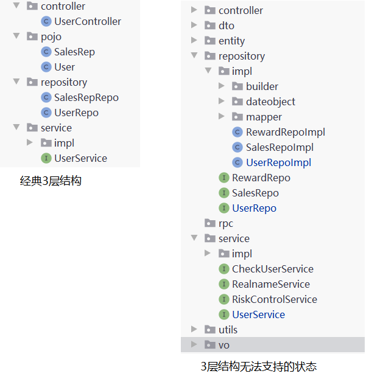
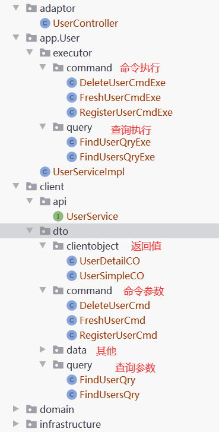

这一节，主要是介绍CQRS、基于COLA的分包方式。

希望将领域模型的理论，应用到实战。 

既然要应用到实战，这里不经要问一个问题： **距离实战，还有多少差距？**

## 业务要求

> 1、活动策划可以查看所有用户信息，并可以通过，手机号码、姓名、销售信息 里的一个或多个来查找用户，显示姓名，号码。
> 
> 2、活动策划可以查看用户的详细信息，显示：姓名，号码，新手福利信息；并修改用户的新手福利。
> 
> 3、用户可以自行注销账号。

## 常见代码

**应用服务：**
```java
@Service
public class UserServiceImpl implements UserService {
    @Autowired
    private UserRepo userRepo;
    @Autowired
    private CheckUserService checkUserService;
    @Autowired
    private RealnameService realnameService;

    @Override
    public UserDTO register(Name name, PhoneNumber phone) throws ValidationException {
        // 查询实名信息(实名信息验证)
        RealnameInfo realnameInfo = realnameService.get(name, phone);
        // 构造对象
        User user = new User(realnameInfo, phone);
        // 检查User对象
        checkUserService.check(user);
        return new UserDTO(userRepo.save(user));
    }

    @Override
    public List<UserDTO> findList(UserParamDTO userParamDTO) {
        List<User> userList = userRepo.find(userParamDTO);
        List<UserDTO> userDTOList = new ArrayList<>();
        userList.forEach(user -> {
            userDTOList.add(new UserDTO(user));
        });
        return userDTOList;
    }

    @Override
    public UserDTO find(UserParamDTO userParamDTO) {
        if (null == userParamDTO.getUserId() || userParamDTO.getUserId().length() == 0) {
            return null;
        }
        User user = userRepo.findById(userParamDTO.getUserId());
        if (null != user) {
            return new UserDTO(user);
        }
        return null;
    }

    @Override
    public UserDTO setFresh(UserParamDTO userParamDTO) {
        if (null == userParamDTO.getUserId() || userParamDTO.getUserId().length() == 0) {
            return null;
        }
        User user = userRepo.findById(userParamDTO.getUserId());
        if (null != user) {
            // 设置用户为新客身份，以便发送新手礼包
            user.setFresh(true);
            // 检查User对象
            checkUserService.check(user);
            return new UserDTO(user);
        }
        return null;
    }

    @Override
    public Boolean deleteOne(UserParamDTO userParamDTO) {
        if (null == userParamDTO.getUserId() || userParamDTO.getUserId().length() == 0) {
            return false;
        }
        return userRepo.delete(userParamDTO.getUserId());
    }
}
```

## 认识问题

**1、前两章的问题，这里再次出现**

解决办法，回顾前两篇内容。


**2、随着不断的提取概念，经典的3层结构不能很好的容纳这些概念。**



**3、多个请求使用一个DTO，导致DTO臃肿**

现在的UserParamDTO，被多个业务使用。导致DTO的臃肿，在传输中需要填充并不需要的字段。

后续维护者，不知道DTO的成员变量有几重业务意义；只能不断膨胀。

同时应用服务不断被修改，有业务外流的风险；也不符合开闭原则。

```java
@Data
public class UserParamDTO implements Serializable {
    // 用户id
    private String userId;
    // 用户名称
    private String name;
    // 用户手机
    private String phone;
    //绑定销售id
    private String salesId;
    // 标志是否为新用户，默认为false
    private Boolean fresh;
}
```

## 1、解决分包不清晰

相对经典的3层架构而言，DDD也有自己的分层架构方式。

DDD的经典4层架构：**用户接口层**，**应用层**，**领域层**，**基础设施层**

与原3层架构，对照如下。


用于DDD分层的复杂性比较高，如： 具体代码如何划分，如何归属。

这里推荐使用Cola的分层方式。

目前Cola已经到4.0时代，经过4个版本的沉淀；笔者认为它已经是一个非常完善的架构方式。

### Cola 4.0 架构/框架

COLA 4.0 架构分成COLA架构和COLA组件两个部分：

1.  COLA架构：关注应用架构的定义和构建，提升应用质量。

2.  COLA组件：提供应用开发所需要的可复用组件，提升研发效率。


COLA架构各个包结构的简要功能描述，如下表所示：

| 层次       | 包名        | 功能                            | 必选 |
| :--------- | :---------- | :------------------------------ | :--- |
| Adapter层  | web         | 处理页面请求的Controller        | 否   |
| Adapter层  | wireless    | 处理无线端的适配                | 否   |
| Adapter层  | wap         | 处理wap端的适配                 | 否   |
| App层      | executor    | 处理request，包括command和query | 是   |
| App层      | consumer    | 处理外部message                 | 否   |
| App层      | scheduler   | 处理定时任务                    | 否   |
| Domain层   | model       | 领域模型                        | 否   |
| Domain层   | ability     | 领域能力，包括DomainService     | 否   |
| Domain层   | gateway     | 领域网关，解耦利器              | 是   |
| Infra层    | gatewayimpl | 网关实现                        | 是   |
| Infra层    | mapper      | ibatis数据库映射                | 否   |
| Infra层    | config      | 配置信息                        | 否   |
| Client SDK | api         | 服务对外透出的API               | 是   |
| Client SDK | dto         | 服务对外的DTO                   | 是   |

### 分包后工程结构
1、首先是**用户接口层**和**应用层**的填充。


2、**领域层**的填充


3、**基础设施层** 的填充


## 2、解决DTO臃肿问题

当前的DTO运行方式为：


单一的DTO，在DDD中适配多个业务。DTO不断的被复杂化。

为了解决这个问题，这里引入一个概念：

**CQRS（Command and Query Responsibility Segregation）命令和查询责任隔离**

为了解决传统DTO在DDD中的问题，提出了根据读写职责不同，把领域模型切分为command和query两个部分：


Command端与Query端都通过Application Service 进入系统，共享同一个数据库，但Command端只写入状态，Query端只读取状态。

**代码分包方式：**


**定义和执行体：**

```java
// 参数
@Data
public class RegisterUserCmd extends Command {
    // 用户名称
    private String name;
    // 用户手机
    private String phone;
}

// 执行
@Component
public class RegisterUserCmdExe {
    @Autowired
    private UserGateWay userGateWay;
    @Autowired
    private CheckUserService checkUserService;
    @Autowired
    private RealnameService realnameService;

    public SingleResponse<UserDetailCO> execute(RegisterUserCmd registerUserCmd) {
        try {
            // 查询实名信息(实名信息验证)
            RealnameInfo realnameInfo = realnameService.get(new Name(registerUserCmd.getName()), new PhoneNumber(registerUserCmd.getPhone()));
            // 构造对象
            User user = new User(realnameInfo, new PhoneNumber(registerUserCmd.getPhone()));
            // 检查User对象
            checkUserService.check(user);
            return SingleResponse.of(new UserDetailCO(userGateWay.save(user)));
        } catch (ValidationException e) {
            e.printStackTrace();
            return SingleResponse.buildFailure("401", e.getMessage());
        }
    }
}

// 返回值
@Data
public class UserDetailCO implements Serializable {
    // 用户id
    private String userId;
    // 用户名称
    private String name;
    // 用户手机
    private String phone;
    //用户标签
    private String label;
    //绑定销售id
    private String salesId;
    // 标志是否为新用户，默认为false
    private Boolean fresh;

    public UserDetailCO(User user) {
        this.userId = user.getUserId();
        this.name = user.getName().getName();
        this.phone = user.getPhone().getPhone();
        this.label = user.getLabel().toString();
        this.salesId = user.getSales().getSalesId();
        this.fresh = user.getFresh();
    }
}

```

**调用代码：**

```java
@Service
public class UserServiceImpl implements UserService {
    @Autowired
    RegisterUserCmdExe registerUserCmdExe;
    @Autowired
    FindUsersQryExe findUsersQryExe;
    @Autowired
    FindUserQryExe findUserQryExe;
    @Autowired
    FreshUserCmdExe freshUserCmdExe;
    @Autowired
    DeleteUserCmdExe deleteUserCmdExe;

    @Override
    public SingleResponse<UserDetailCO> register(RegisterUserCmd registerUserCmd)  {
        return registerUserCmdExe.execute(registerUserCmd);
    }

    @Override
    public MultiResponse<UserSimpleCO> findList(FindUsersQry findUsersQry) {
        return findUsersQryExe.execute(findUsersQry);
    }

    @Override
    public SingleResponse<UserDetailCO> find(FindUserQry findUserQry) {
        return findUserQryExe.execute(findUserQry);
    }

    @Override
    public SingleResponse<UserDetailCO> setFresh(FreshUserCmd freshUserCmd) {
        return freshUserCmdExe.execute(freshUserCmd);
    }

    @Override
    public Response deleteOne(DeleteUserCmd deleteUserCmd) {
        return deleteUserCmdExe.execute(deleteUserCmd);
    }
}
```
封装完成后，任何一个业务的参数变化，只会影响自己的业务情况。

应用服务不会因为业务的变化而变化，具体的业务组织交个每个业务执行体做； 更符合单一职责。

## Git代码

https://github.com/su-dd/learning/tree/main/src/spring/ddd/30Demo
## Cola组件介绍

COLA 组件：提供了一些框架级别的功能，提供应用开发所需要的可复用组件，提升研发效率。

| 组件名称                         | 功能                                             | 版本  | 依赖              |
| :------------------------------- | :----------------------------------------------- | :---- | :---------------- |
| cola-component-dto               | 定义了DTO格式，包括分页                          | 1.0.0 | 无                |
| cola-component-exception         | 定义了异常格式，主要有BizException和SysException | 1.0.0 | 无                |
| cola-component-statemachine      | 状态机组件                                       | 1.0.0 | 无                |
| cola-component-domain-starter    | Spring托管的领域实体组件                         | 1.0.0 | 无                |
| cola-component-catchlog-starter  | 异常处理和日志组件                               | 1.0.0 | exception,dto组件 |
| cola-component-extension-starter | 扩展点组件                                       | 1.0.0 | 无                |
| cola-component-test-container    | 测试容器组件                                     | 1.0.0 | 无                |

参考：《 [COLA 4.0：应用架构的最佳实践](https://links.jianshu.com/go?to=https%3A%2F%2Fblog.csdn.net%2Fsignificantfrank%2Farticle%2Fdetails%2F110934799)》


梳理文档时，借用了多篇文档的内容，目前以记不清晰；未能详细标记，望海涵。