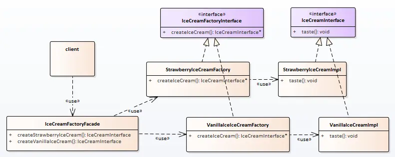

# 外观（面板）模式

经过上篇的基建，发现：产品的质量已经可控，但是客户太费鞋（毕竟跑一家工厂买一个产品，鞋累啊）。

如何让用户不那么费鞋嗯？

供货的问题解决后，下面解决的就是经销的问题，一家可以卖各种商品的小卖部是很有必要的。


## 场景分析

小卖部的特性是什么嗯？

小卖部的特性是将所有的功能放到统一位置，以便客户使用。

## 实现思路

实现类图:



## 实现代码

**外观/面板：**

```cpp
class  IceCreamFactoryFacade
{
public:
    IceCreamFactoryFacade()
        : m_pStrawberryIceCreamFactory(new StrawberryIceCreamFactory())
        , m_pVanillaIceCreamFactory(new VanillaIceCreamFactory()) {}

    ~IceCreamFactoryFacade()
    {
        delete m_pStrawberryIceCreamFactory;
        m_pStrawberryIceCreamFactory = nullptr;
        delete m_pVanillaIceCreamFactory;
        m_pVanillaIceCreamFactory = nullptr;
    }

public:
    IceCreamInterface *createStrawberryIceCream()
    {
        return m_pStrawberryIceCreamFactory->createIceCream();
    }

    IceCreamInterface *createVanillaIceCream()
    {
        return m_pVanillaIceCreamFactory->createIceCream();
    }

private:
    IceCreamFactoryInterface *m_pStrawberryIceCreamFactory;
    IceCreamFactoryInterface *m_pVanillaIceCreamFactory;
};
```


**客户端：**

```cpp
#include "IceCreamInterface.h"
#include "IceCreamFactoryFacade.hpp"

int main(int argc, char *argv[])
{
    IceCreamFactoryFacade oIceCreamFactoryFacade;
    IceCreamInterface* pStrawberryIceCream = oIceCreamFactoryFacade.createStrawberryIceCream();
    IceCreamInterface* pVanillaIceCream = oIceCreamFactoryFacade.createVanillaIceCream();

    pStrawberryIceCream->taste();
    pVanillaIceCream->taste();

    delete pStrawberryIceCream;
    delete pVanillaIceCream;
    return 0;
}
```


## 使用感悟

在外观模式的帮助下，现在解决了工厂模式带来的使用不便的问题。

**对比外观+工厂和简单工厂模式，我们发现：**

相同：

1、对使用者隐藏了实现细节

2、提供良好的使用界面

不同：

外观+工厂对新扩展依然有比较好的包容性，但简单工厂相对差一些。

相对的，简单工厂的类实现比较简单，维护更简单。

**对应外观模式自身：**

外观模式通过提供统一的面板，隐藏了子系统、子模块的具体实现。系统的**封装性和易用性得到提升**，可以阻止新人对不熟悉模块的错误使用。

同时增加新的接口也需要修改面板，相对而言面板本身容易被影响，**扩展性下降**。


## 代码位置

https://github.com/su-dd/learning/tree/main/src/design_pattern/Facade