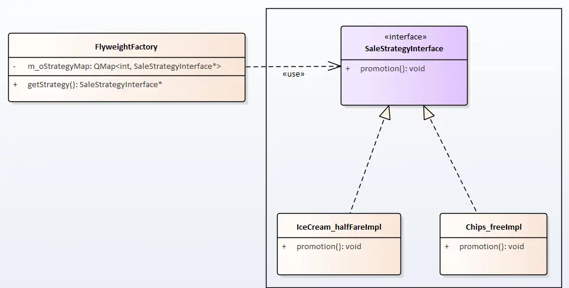

啃得鸡通过促销的方式，已经做了一个爆款店铺。现在希望在其他99家点评也使用这样的促销策略。


## 场景分析

现在我们有100家店铺需要做促销，促销方案有2种。如果是每个店自己做自己的，就要200个策略对象。

这当然不是我们希望看到的！

我们希望只要建两个策略对象就可以了，100家店铺共用这两个策略对象。

享元模式又叫"蝇量模式"是一种通过减少创建对象的个数，来降低内存,提供效率的方式；是一种结构化的设计模式。


## 实现思路




## 实现代码

享元工厂

```cpp
class FlyweightFactory
{
public:
    enum StrategyType
    {
        IceCream_halfFare,
        Chips_free
    };
public:
    ~FlyweightFactory()
    {
        qDeleteAll(m_oStrategyMap.values());
    }

    SaleStrategyInterface* getStrategy(StrategyType type)
    {
        if (!m_oStrategyMap.contains(type))
        {
            switch (type)
            {
            case IceCream_halfFare:
                m_oStrategyMap.insert(type, new IceCream_halfFareImpl());
                break;
            case Chips_free:
                m_oStrategyMap.insert(type, new Chips_freeImpl());
                break;
            default:
                break;
            }
        }
        return m_oStrategyMap[type];
    }

private:
    QMap<int, SaleStrategyInterface*> m_oStrategyMap;
};
```


## 使用感悟

享元模式的目的是通过减少对象的创建，来达到减少内存，提供效率的目的；

它设计的重点在于HashMap是使用，我们需要为HashMap找到一个唯一的特征值。

HashMap一般放在享元工厂中管理。

**优点：**提高对象复用率，提高效率

适用场景：

1. 大量相似或相同对象。
2. 这些对象占用大量内存，或影响效率。
3. 不同对象对外部执行无影响


**进一步思考：**

我们之前的实例其实是每种享元对象都最少创建一个，当这些享元对象之间又存在大量相同的数据如何处理？

这时我们需要引入两个概念：

- **内蕴状态(Internal State)**：存储在享元对象内部且不会随环境改变而改变。因此内蕴状态并可以共享。
- **外蕴状态(External State)**：是随环境改变而改变的、不可以共享的状态。

为了解决这个问题，我们要为现有的对象抽去共性，即对内蕴状态归类，成为享元对象的基础（私有对象或基类数据）；

外蕴状态由客户端保存，并在享元对象被创建之后，在需要使用的时候再传入到享元对象内部。

需要保证：外蕴状态与内蕴状态是相互独立的。


**实现举例:**

通过【P指针】的方式，多个对象共用一段内存属性。

这段内存一般为只读属性（外部只提供只读接口，这样可以做多线程安全）。


## 代码路径

https://github.com/su-dd/learning/tree/main/src/design_pattern/Flyweight