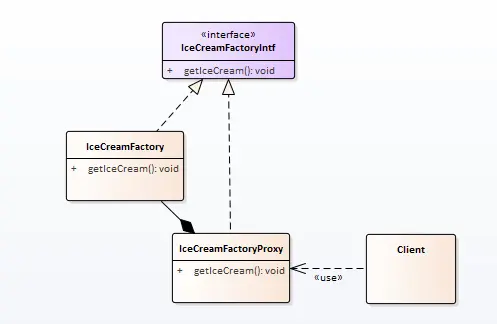

冰淇淋从工厂出来后，一般要经过超市、马路边的小推车等 ，经销代理后，再到达消费者手里；

那为什么要有这样经销代理嗯？

## 场景分析

这里对于消费者而言，目的就是从获得想要的冰淇淋，但是直接从工厂拿对用户而言不方便。所以有了超市。

超市还不能足够的接近客户，就有了马路边的小推车。

超市是为了消费者服务的，小推车也是为消费者服务的。 代理也是为客户服务的。

当希望使用，但无法直接使用，某个对象时；我们就可以考虑代理模式。


## 实现思路



## 实现代码

冰淇淋工厂：

```cpp
class IceCreamFactory : public IceCreamFactoryIntf
{
public:
	IceCreamFactory() {}
	virtual ~IceCreamFactory() {}

	virtual void getIceCream()
	{
		cout << "《冰淇淋》！" << endl;
	}
};
```


工厂代理：

```cpp
class IceCreamFactoryProxy : public IceCreamFactoryIntf
{
public:
	IceCreamFactoryProxy() {}
	virtual ~IceCreamFactoryProxy() {}

	virtual void getIceCream()
	{
		cout << "加价" << endl;
		m_oFactory.getIceCream();
	}

private:
	IceCreamFactory m_oFactory;
};
```


客户调用：

```cpp
int main()
{
	SetConsoleOutputCP(CP_UTF8);
	IceCreamFactoryIntf *p = new IceCreamFactoryProxy();
	p->getIceCream();

	delete p;
	return 0;
}
```


## 感悟

代理模式是一个自由度特别高的模式，也是一个不容易被辨识的模式。

现在去回想：装饰者模式，或者准备在下一章写的桥模式，我们会发现，里面的区别很微妙。

这里来比较装饰者模式 和 代理：

装饰者模式的注重点在于对已有对象的功能增强，特性上可以无限嵌套；

代理注重解决：客户和要使用的对象之间的复杂性，当我们规划了两个实体A和B后，发现A和B之间的调用关系复杂，或者存在业务上不属于A或者B的调用时。

我们就需要代理来处理这部分的复杂性，代理通过添加中间层的方式在A和B之间添加了一层新的扩展封装。

spring aop 是现在比较有名的代理模式实现。


## 代码位置

https://github.com/su-dd/learning/tree/main/src/design_pattern/Proxy