# 命令模式

上一篇备忘录模式，通过对生产参数的备份、存档；解决了自动化冰淇淋生产线 切换生产模式的问题。

但技术员小啃💂 最近过的并不开心，工厂的单子在不断的变化；生产线的生产环境总是需要调整。

生产线的控制随主体一起在工厂，技术员小啃不得不呆在工厂里随时待命；他已经两个月没有回家。

小啃非常希望自己有一个遥控器，可以随时发布指令；一键改变生产线的生产环境就能变成想要的状态。


## 场景分析

在这个场景里有两个角色：技术员小啃、生产线。

技术员小啃是使用者，生产线是被使用者； 由于技术员小啃必须呆在生产线上才能操作生产线，及使用者和被使用者直接耦合。

正常情况下，使用者和被使用者之间是耦合关系的；但这里希望是使用者和被使用者之间不直接产生关系。

为了达到这一目的，如小啃所愿；引入第三个角色：遥控指令

这样构成了，新的调用关系:

> 使用者（小啃）-> 命令（遥控器指令）-> 被使用者（生产线）


## 实现思路




### main函数（客户端）

具体的命令、命令的接受者、命令的调用者。都是在客户端创建。

```cpp
int main(int argc, char* argv[])
{
	Invoker oInvoker;
	IceFactoryReceiver oIceFactoryReceiver;

	StrawberryCommand oStrawberryCommand(&oIceFactoryReceiver);
	oInvoker.setCommand(&oStrawberryCommand);
	oInvoker.executeCommand();
	oIceFactoryReceiver.createCream().taste();

	VanillalceCommand oVanillalceCommand(&oIceFactoryReceiver);
	oInvoker.setCommand(&oVanillalceCommand);
	oInvoker.executeCommand();
	oIceFactoryReceiver.createCream().taste();
	
	return 0;
}
```


## 接受者

业务的具体实现者；这里是冰淇淋生成线。

```cpp
class IceFactoryReceiver
{
public:
	IceFactoryReceiver()
		: m_sflavour("")
		, m_sDryFruit("") {}

	void setFlavour(string flavour)
	{
		this->m_sflavour = flavour; 
	}

	void setDryFruit(string dryFruit) 
	{
		this->m_sDryFruit = dryFruit; 
	}

	IceCream createCream()
	{
		return IceCream(m_sflavour, m_sDryFruit);
	}

private:
	string m_sflavour;
	string m_sDryFruit;
};
```


### 命令

这里将草莓、香草两种冰淇淋的生产，封装为命令。可以发现命令中是拿着命令执行的对象实例的。

```cpp
class Command
{
public:
	~Command() {}
	virtual void execute() = 0;
};

// 草莓味命令
class StrawberryCommand : public Command
{
public:
	StrawberryCommand(IceFactoryReceiver* iceFactoryReceiver)
		: m_pIceFactoryReceiver(iceFactoryReceiver) {}

	~StrawberryCommand() { m_pIceFactoryReceiver = nullptr; }

	virtual void execute()
	{
		m_pIceFactoryReceiver->setDryFruit("瓜子");
		m_pIceFactoryReceiver->setFlavour("草莓");
	}
private:
	IceFactoryReceiver* m_pIceFactoryReceiver;
};

// 香草味命令
class VanillalceCommand : public Command
{
public:
	VanillalceCommand(IceFactoryReceiver* iceFactoryReceiver)
		: m_pIceFactoryReceiver(iceFactoryReceiver) {}

	~VanillalceCommand() { m_pIceFactoryReceiver = nullptr; }
	virtual void execute()
	{
		m_pIceFactoryReceiver->setDryFruit("榛子");
		m_pIceFactoryReceiver->setFlavour("香草");
	}
private:
	IceFactoryReceiver* m_pIceFactoryReceiver;
};
```


### 调用者

调用者负责命令的调用，提供命令统一调用的封装。

```cpp
class Invoker
{
public:
	Invoker() : m_pCommand(nullptr) {}
	~Invoker() {}

	void setCommand(Command *command)
	{
		m_pCommand = command;
	}

	void executeCommand()
	{
		m_pCommand->execute();
	}

private:
	Command * m_pCommand;
};
```


## 感悟

命令模式主要实现了调用者和接受者之间的解构。

**场景1：** 1、调用者在一些不知道接受者的情况，或不能操作调用者的情况。

eg: 界面上有多个按钮控件，分别实现不同的业务功能。

一般界面控制使用一些公共组件；界面控件不知道具体业务使用类，且我们不能操作界面控件的内部实现。

**场景2：** 1、调用者和接受者执行的生命周期不同；接受者执行时，调用者已经被释放。

eg: 数据库系统的撤销、恢复、更新。

数据库根据命令进行撤销、恢复、更新；数据库系统的需要根据自身情况完成数据维护。如果调用者一直等等数据库的返回，可能导致阻塞。同时调用者也不可能提供 撤销、恢复 需要的状态，命令+备忘录可以很好的满足这里的需求。

**同策略模式的区别：**

简单类别：

命令模式是处理将不同的事情用同一种方式去统一调用，策略模式是处理同一件事情的不同处理方式。

命令模式：命令实例中自己拿着接收者实例。所以命令可操作的对象其实不拘束为一个对象，甚至可以不局限为同一类对象。

策略模式：策略实例无接受者实例，是对一件事的不同做法。


## 代码路径

https://github.com/su-dd/learning/tree/main/src/design_pattern/Command