通过大小经销商、零售商， 我们重要将雪糕顺利的搬运到客户手中；但现在又出状况了，客户小明并不开心，因为他有冤无处说，不知道和谁说。

事情是这样的，小明下班去买他最喜欢草莓雪糕，发现只有最后一根了；但拿到手发现，雪糕有点化了；好人小明心想最后一根了就将就一下。

结果等打开发现，草莓雪糕包装里面，居然是让他过敏的香草雪糕 😩

这让小明很沮丧，小明想要反馈情况，当不知道找谁合适。


## 场景分析

这里分析一下小明遇到了的问题、问题的解决方、问题的解决办法：

|          问题          |         解决方         |   解决办法   |
| :--------------------: | :--------------------: | :----------: |
|   草莓雪糕只有一根了   |         零售商         | 及时补充雪糕 |
|      雪糕有点化了      | 整个运输线，包括零售商 | 提高冷链能力 |
| 草莓雪糕里装了香草雪糕 |          厂家          | 提供监管能力 |

这里如果小明希望能完整的反馈整个问题，需要知道所有的负责人的联系方式，并逐一将对应的问题反馈。

这对小明而已是困难的，甚至不可实现的；比如，中间的某个经销商就是小明无法联系上的。

这里如果厂家如果可以建立完整的反馈链条，小明就可以直接将自己所有的反馈交给零售商；从而让整个雪糕供给系统活动反馈。


## 实现思路



### 接口Handler

定义了处理的接口模式

```cpp
class Handler
{
public:
	Handler* getNext() { return next; }
	void setNext(Handler* handler) { next = handler; }

	void handleRequest(Request* request)
	{
		bool handled = false;
		this->handle(request, handled);
		if (!handled)
		{
			getNext()->handleRequest(request);
		}
	}

	virtual void handle(Request* request, bool& handled) = 0;
private:
	Handler* next;
};
```


### 接口Request

```cpp
class Request
{
public:
	Request(RequestType type, string message)
		: m_Type(type)
		, m_sMessage(message)
	{

	}

	RequestType getType()
	{
		return m_Type;
	}

	string getMessage()
	{
		return m_sMessage;
	}

private:
	RequestType m_Type;
	string m_sMessage;
};
```


### 具体处理类

```cpp
// 零售商
class RetailerHandler : public Handler
{
public:
	virtual void handle(Request* request, bool& handled)
	{
		if (request->getType() == RequestType::retaile)
		{
			cout << "零售商处理问题：" << request->getMessage() << endl;
			handled = true;
		}
	}
};

// 经销商
class DealerHandler : public Handler
{
public:
	virtual void handle(Request* request, bool& handled)
	{
		if (request->getType() == RequestType::dealer)
		{
			cout << "经销商处理问题：" << request->getMessage() << endl;
			handled = true;
		}
	}
};

// 厂家
class FactoryHandler : public Handler
{
public:
	virtual void handle(Request* request, bool& handled)
	{
		if (request->getType() == RequestType::factory)
		{
			cout << "厂家处理问题：" << request->getMessage() << endl;
			handled = true;
		}
	}
};
```


### main函数

这里的main

```cpp
int main(int argc, char* argv[])
{
	RetailerHandler oHandler1;
	DealerHandler oHandler2;
	FactoryHandler oHandler3;

	oHandler1.setNext(&oHandler2);
	oHandler2.setNext(&oHandler3);

	Request oRequest1(RequestType::retaile, "雪糕只有一个了");
	oHandler1.handleRequest(&oRequest1);

	Request oRequest2(RequestType::factory, "草莓雪糕袋装了香草雪糕");
	oHandler1.handleRequest(&oRequest2);

	return 0;
};
```


运行结果： 

## 感悟

### 可改进项

这里的Request定义不是应该特别良好的方式。 RequestType 的存在虽然可以明确定义Request的类型，但也导致了**发送方**，需要知道更多想信息。导致耦合的加深，这并不符合职责链去分离 **发送方** 和 **接收方**的初衷。

如果在实际使用中希望通过 RequestType 做明确的划分，可以考虑再做一层封装，做Request的标准生产函数。

### 用法

当前的职责链使用了：

**纯的职责链模式**：一个请求必须被某一个处理者对象所接收，且一个具体处理者对某个请求的处理只能采用以下两种行为之一：自己处理（承担责任）；把责任推给下家处理。

但是小明的问题里还有一个是: 雪糕有点化了,这里用**纯的职责链模式**就不能胜任。及需要：

**不纯的职责链模式**：允许出现某一个具体处理者对象在承担了请求的一部分责任后又将剩余的责任传给下家的情况，且一个请求可以最终不被任何接收端对象所接收。

总的来说：职责链模式 是为了 分离 **发送方** 和 **接收方**； 所以需要在设计时，也尽可能减少耦合。


## 代码位置

https://github.com/su-dd/learning/tree/main/src/design_pattern/ChainOfResponsibility