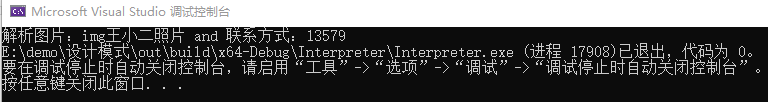

上篇讲到用访问者模式，解决 吃货小玉、神奇小明、善良小芳提出的建议。

这里生产部门却犯了难，包装的信息太过复杂：

> 包装： 印手工制作教程
>
> 包装： 印吃货教程
>
> 包装： 在雪糕包装上印走失儿童的照片、地址信息、父母信息等。

生产部分希望可以用统一的方式进行处理。

## 场景分析

如果包装信息是一个固定格式：如 图片 + 介绍

那么可以简单的定义一个数据结构，并循环容器，即可。

当前场景，不同雪糕对信息的要求不同；如手工部分 可能是成品图，加制作视频链接，加广告语。 丢失儿童部分，可能是 儿童照片，基本信息，家人基本信息。

同时，不同的走失儿童，信息的组成可能也不同。所以希望设计一种方式可以方便的设置信息的组成，通过简单的关键字组合。即可完成信息的组成。

如：

> img "手工图片位置" + weblink "网络位置"
>
> img "儿童图片" + phone "123456789"


## 实现思路


> Context: 环境上下文，存放表达式解析过程中需要的信息
>
> AbstractExpression 抽象表达式：定义表达式的一般能力
>
> TerminalExpression: 终结符表达式，用来实现文法中和终结符相关的解释操作，不再包含其它的解释器，如果用组合模式来构建抽象语法树的话，就相当于组合模式中的叶子对象，可以有多种终结符解释器。
>
> NonTerminalExpression: 非终结符表达式,用来实现文法中和非终结符相关的解释操作，通常一个解释器对应一个语法规则，可以包含其它的解释器，如果用组合模式来构建抽象语法树的话，就相当于组合模式中的组合对象，可以有多种非终结符解释器。

### 抽象表达式

```text
class AbstractExpression
{
public:
	virtual ~AbstractExpression() {}
	virtual string interprete(Context &ctx) = 0;
};
```


### 终止符表达式

```cpp
class ValueExpression : public AbstractExpression
{
public:
	ValueExpression(string key) 
		: m_key(key)
	{
	}

	virtual string interprete(Context &ctx) override
	{
		return ctx.lookup(m_key);
	}
private:
	string m_key;
};
```


### 非终止符表达式——单目运算

图片解析：

```cpp
class ImgExpression : public AbstractExpression
{
public:
	ImgExpression(AbstractExpression * expr)
		: m_Expr(expr)
	{
	}

	virtual ~ImgExpression()
	{
		delete m_Expr;
		m_Expr = nullptr;
	}

	virtual string interprete(Context& ctx) override
	{
		return "解析图片：" + m_Expr->interprete(ctx);
	}

private:
	AbstractExpression* m_Expr;
};
```


### 非终止符表达式——双目运算

加 运算：

```cpp
class PlusOperation : public AbstractExpression
{
public:
	PlusOperation(AbstractExpression* e1, AbstractExpression* e2)
		: m_e1(e1), m_e2(e2)
	{
	}

	virtual ~PlusOperation()
	{
		delete m_e1;
		delete m_e2;
	}

	virtual string interprete(Context& ctx) override
	{
		return m_e1->interprete(ctx) + " and " + m_e2->interprete(ctx);
	}

private:
	AbstractExpression* m_e1;
	AbstractExpression* m_e2;
};
```


### 环境上下文

```cpp
class Context
{
public:
	void assign(string key, string value)
	{
		m_oContextMap.insert({ key, value });           
	}

	string lookup(string key)
	{
		return m_oContextMap.at(key);
	}

protected:
	map<string, string> m_oContextMap;
};
```


### main函数

```cpp
int main(int argc, char *argv[])
{
    Context oContext;
    oContext.assign("Img", "img王小二照片");
    oContext.assign("p", "13579");

    PlusOperation oPlus1(new ImgExpression(new ValueExpression("Img")), new PhoneExpression(new ValueExpression("p")));

    cout << oPlus1.interprete(oContext);

    return 0;
}
```


运行结果：




## 思考解答

以上代码完成了简单的解释器模式，但main函数的使用方式会让人感觉不那么舒适。

我们希望的形式：

输入：一个表达式

> 如： img "手工图片位置" + weblink "网络位置" img "儿童图片" + phone "123456789"

输出： 对应的表达式，所表达的含义。

这些其实是只需要两步： 1、拆解表达式，中缀表达式 改为 后缀表达式 2、压栈求值

这是数据结构相关的知识，这里就不详细说明。


## 感悟

解释器模式，其实是用代码实现了一个简版的 “语言”； 以解决发生频率很高，但规则可明细的场景。

一般来说我们不太可能使用解释器模式，笔者目前为止，还没没有在项目中切实的需要过它。

优点：

良好的扩展性，可以不断定义新的表达式来实现新的业务。

缺点：

容易引起类膨胀，需要较强的类管理能力。


## 代码位置

https://github.com/su-dd/learning/tree/main/src/design_pattern/Interpreter
