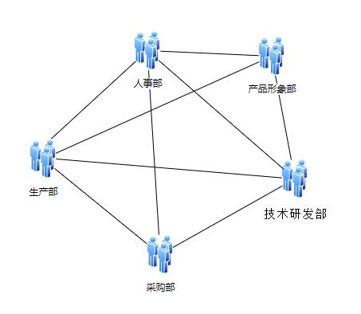
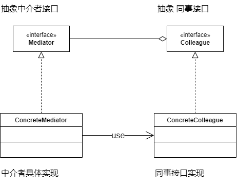
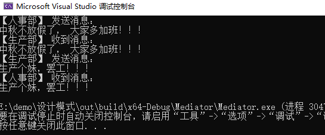

经过 吃货小玉、神奇小明、善良小芳 的idea，和大家的共同努力，啃得鸡公司蒸蒸日上。 公司以吃货小玉、神奇小明、善良小芳 为主力成立了产品形象部。

现在公司一共有： 生产部、技术研发部、采购部、人事部、产品形象部

大家的沟通状态是这样的：



常常一件事需要沟通多个部门才能完成，大家又要完成当前的工作，又要推动沟通；导致工作效率极慢。

现在需要解决当前的复杂沟通状态，怎么处理？

## 场景分析

如果要解决当前的复杂状态，需要引入一个中间人；以管理各个部分人员之间的沟通；一般在公司里以ERP系统的方式存在。


## 实现思路



### 接口类

**中介者：**

```cpp
class Mediator
{
public:
	virtual ~Mediator() {}
	virtual void regist(Collegue* collegue) = 0;
	virtual void sendMessage(string message, Collegue* collegue) = 0;
};
```


**同事接口：**

```cpp
class Collegue
{
public:
	Collegue()
		: m_pMediator(nullptr)
	{
	}

	virtual ~Collegue() 
	{
		m_pMediator = nullptr;
	}

	void setMediator(Mediator* mediator)
	{
		if (mediator != m_pMediator)
			m_pMediator = mediator;
	}

	virtual void sendMessage(string message) = 0;
	virtual void getMessage(string message) = 0;

protected:
	Mediator* m_pMediator;
};
```


### 接口实现

**中介者实现：**

```cpp
class ERPMediator : public Mediator
{
public:
	virtual void regist(Collegue* collegue) override
	{
		m_oCollegues.push_back(collegue);
	}

	virtual void sendMessage(string message, Collegue* collegue) override
	{
		for each (auto var in m_oCollegues)
		{
			if (var != collegue)
			{
				var->getMessage(message);
			}
		}
	}

private:
	list<Collegue*> m_oCollegues;
};
```


**同事接口实现：**

```cpp
// 生产部员工
class ProductionColleague : public Collegue
{
public:
	ProductionColleague(string name)
		: Collegue()
	{

	}

	void sendMessage(string message) override
	{
		cout << "【生产部】" << name << " 发送消息：" << endl;
		cout << message << endl;
		m_pMediator->sendMessage(message, this);
	}

	void getMessage(string message) override
	{
		cout << "【生产部】" << name << " 收到消息：" << endl;
		cout << message << endl;
	}

private:
	string name;
};

// 人事部员工
class PersonnelColleague : public Collegue
{
public:
	PersonnelColleague(string name)
		: Collegue()
	{

	}

	void sendMessage(string message) override
	{
		cout << "【人事部】" << name << " 发送消息：" << endl;
		cout << message << endl;
		m_pMediator->sendMessage(message, this);
	}

	void getMessage(string message) override
	{
		cout << "【人事部】" << name << " 收到消息：" << endl;
		cout << message << endl;
	}

private:
	string name;
};
```


### main函数

```cpp
int main(int argc, char* argv[])
{
	ERPMediator oERPMediator;

	PersonnelColleague oXiaoFang("小芳");
	oXiaoFang.setMediator(&oERPMediator);

	ProductionColleague oXiaoLi("小李");
	oXiaoLi.setMediator(&oERPMediator);

	oERPMediator.regist(&oXiaoLi);
	oERPMediator.regist(&oXiaoFang);

	oXiaoFang.sendMessage("中秋不放假了， 大家多加班！！！");

	oXiaoLi.sendMessage("生产个妹，罢工！！！");

	return 0;
}
```


**结果：**



## 感悟

中介者模式是一个不太常用模式，主体思想是将网状关系，转变为星形关系。

将网状关系的复杂性，收容到一个类中；

这使得其他类变得简单，同时也有中介者类复杂化的代价。


## 代码位置

https://github.com/su-dd/learning/tree/main/src/design_pattern/Meditor