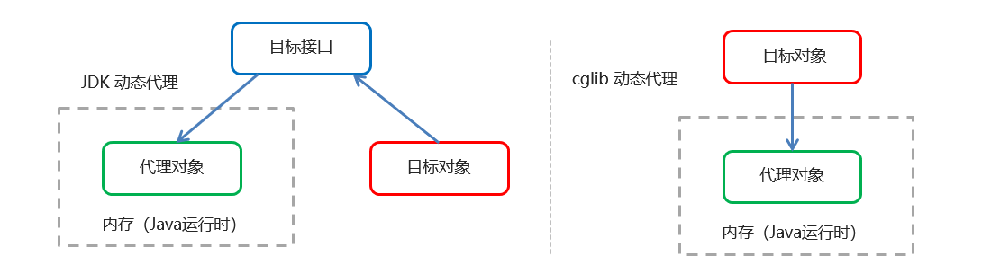

## 1 SpringAOP的实现

AOP的本质是通过对原对象的介入，去增强原对象的功能。

SpringAOP是在运行期，通过动态代理技术生成代理对象实现的。

常用的动态代理技术：JDK代理，cglib代理 （具体理论在后面文章中讨论，本章关注使用）



## 2 AOP的Maven坐标

```xml
    <dependencies>
        <dependency>
            <groupId>org.springframework</groupId>
            <artifactId>spring-context</artifactId>
            <version>5.2.8.RELEASE</version>
        </dependency>
        <!--    aspectj的织入    -->
        <dependency>
            <groupId>org.aspectj</groupId>
            <artifactId>aspectjweaver</artifactId>
            <version>1.9.6</version>
        </dependency>
    </dependencies>
```


## 3 AOP的术语

SpringAOP的实现就是通过代理对象替换掉原对象，同时增强原有类的功能。这里涉及了一些术语：

| 术语                 | 逻辑                                                                                                                                   |
| -------------------- | -------------------------------------------------------------------------------------------------------------------------------------- |
| Target（目标对象）   | 代理的目标对象                                                                                                                         |
| Proxy （代理）       | 一个类被 AOP 织入增强后，就产生一个结果代理类                                                                                          |
| Joinpoint（连接点）  | 所谓连接点是指那些被拦截到的点。在spring中,这些点指的是方法，因为spring只支持方法类型的连接点                                          |
| Pointcut（切入）     | 所谓切入是指我们要对哪些 Joinpoint 进行拦截的定义                                                                                      |
| Advice（通知/ 增强） | 所谓通知是指拦截到 Joinpoint 之后所要做的事情就是通知                                                                                  |
| Aspect（切面）       | 是切入和通知/ 增强的结合   【Pointcut + Advice】                                                                                       |
| Weaving（织入）      | 是指把Advice应用到目标对象来创建新的代理对象的过程。Spring采用动态代理织入，而AspectJ采用编译期织入和类装载期织入 【形成Aspect的过程】 |

## 4 XML配置

### 4.1 Beans属性

增加属性`xmlns:aop`

```xml
xmlns:aop="http://www.springframework.org/schema/aop"
```

属性`xsi:schemaLocation`增加值

```xml
http://www.springframework.org/schema/aop http://www.springframework.org/schema/aop/spring-aop.xsd
```

**XMLDemo:**

```xml
<beans xmlns="http://www.springframework.org/schema/beans"
       xmlns:xsi="http://www.w3.org/2001/XMLSchema-instance"
       xmlns:aop="http://www.springframework.org/schema/aop"
       xsi:schemaLocation="
       http://www.springframework.org/schema/aop http://www.springframework.org/schema/aop/spring-aop.xsd
       http://www.springframework.org/schema/beans http://www.springframework.org/schema/beans/spring-beans.xsd">
</beans>
```


### 4.2 简单的Demo讲解

**XmlDemo:**

```xml
<aop:config>
    <aop:aspect ref="studentAspect">
        <aop:before method="before" pointcut="execution(public void com.study.aop.Student.study())"/>
    </aop:aspect>
</aop:config>
```

`aop:config`：引入aop配置

`aop:aspect`：配置一个aop切面类

`aop:before`：配置前置增强/通知，`method`增强使用的函数

**切点：**

标记：`aop:before`的`pointcut`属性。

切点表达式：`execution([修饰符] 返回值类型 包名.类名.方法名(参数))`

	- 访问修饰符可省略
	- 返回值类型、包名、类名、方法名可以使用星号*  代表任意
	- 包名与类名之间一个点 . 代表当前包下的类，两个点 .. 表示当前包及其子包下的类
	- 参数列表可以使用两个点 .. 表示任意个数，任意类型的参数列表

**xmlDemo：**

```xml
<aop:before method="before" pointcut="execution(public void com.study.aop.Student.study())"/>
<aop:before method="before" pointcut="execution(void com.study.aop.Student.study())"/>
<aop:before method="before" pointcut="execution(* com.study.aop.Student.study())"/>
<aop:before method="before" pointcut="execution(* com.study.aop.Student.*(..))"/>
<aop:before method="before" pointcut="execution(* com.study.aop..*.*(..))"/>
<aop:before method="before" pointcut="execution(* *..*.*(..))"/>
```


### 4.3 通知/增强的类型

`aop:通知类型`标记：

	- `method`：切面类中方法名
	- `pointcut`：切点表达式
	- `pointcut-ref`：切点引用

`aop:pointcut`标记：

```xml
<aop:pointcut id="test" expression="public void com.study.aop.Student.study()"/>
```

**标签类型：**

| 标签                  | 作用             | 运行时机               |
| --------------------- | ---------------- | ---------------------- |
| `aop:before`          | 指定前置通知     | 切入点执行之前         |
| `aop:after-returning` | 指定后置通知     | 切入点执行之后         |
| `aop:around`          | 指定环绕通知     | 切入点执行前后都执行   |
| `aop:after-throwing`  | 指定异常抛出通知 | 切入点异常抛出时       |
| `aop:after`           | 指定最终通知     | 无论是否抛出异常都执行 |

备注：`aop:around` 的实际效果是覆盖了原来的运行方法，通过`ProceedingJoinPoint`调用原方法

```java
public void around(ProceedingJoinPoint jp) throws Throwable {
    System.out.println("around, 环绕增强 ... ");

    Object[] args=jp.getArgs();
    if(args.length>0){
        System.out.print("Arguments passed: " );
        for (int i = 0; i < args.length; i++) {
            System.out.print("arg "+(i+1)+": "+args[i]);
        }
    }
    jp.proceed(args);
    System.out.println("around, 运行完 ... ");
}
```

可以认为：`aop:around`是其他所有标记 + 切入点 的集合。


### 4.4 aop:declare-parents

为一个已知的API添加一个新的功能

对于我们不能修改类代码，只能通过外部包装的情况。如果通过之前的AOP前置或后置通知，又不太合理，最简单的办法就是实现某个我们自定义的接口，这个接口包含了想要添加的方法。

但是JAVA不是一门动态的语言，无法再编译后动态添加新的功能，这时就可以使用 `aop:declare-parents`

**XmlDemo:**

```xml
<aop:declare-parents 
                     types-matching="com.study.aop.Student" 
                     implement-interface="com.study.aop.imp.People" 
                     delegate-ref="studentAspect"/>
```

属性：

- `types-matching`：待增强类的表达式，支持通配符
- `implement-interface`：引入增强的方法所在的接口
- `delegate-ref`：引入增强的实现bean的id
- `default-impl`：引入增强的实现类的全路径名称（使用该方式，无需把增强类的`Bean`注入到Spring容器中）

 注：`delegate-ref`和`default-impl`仍选一个实现即可


### 4.5 向增强函数传参数

切入函数不是一成不变的，有很大的可能性是需要根据切入点的参数而发生不同的变化。

### 4.5.1 通过 JoinPoint(推荐)

切点类和切点函数：

```java
public class StudentAspect {
	public void before(JoinPoint joinPoint) {
        Object[] args = joinPoint.getArgs();
        System.out.println("before, 前置增强 ... " + args[0]);
    }
}
```

xml：

```xml
<aop:config>
    <aop:aspect ref="studentAspect">
        <aop:before method="before" pointcut="execution(void com.study.aop.Student.study(..))"/>
    </aop:aspect>
</aop:config>
```


#### 4.5.2 通过xml配置

切点类和切点函数：

```java
public class StudentAspect implements People {
    public void after(String course, String teacher) {
        System.out.println("after-returning, 后置增强 ... ");
    }
}
```

xml:

```xml
<aop:config>
    <aop:aspect ref="studentAspect">
        <aop:after-returning method="after" pointcut="execution( * com.study.aop.Student.study(String,String)) and args(course, teacher)"/>
    </aop:aspect>
</aop:config>
```


## 5 Demo

Demo路径：https://github.com/su-dd/KnowledgeStack.git

具体路径：JavaWeb/TestCode/_03_Spring/Demo3