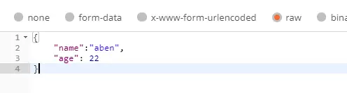

# 1、说明

springboot 是国内最常用的web框架，因为它的http server功能是最重要的。本文列举了一些现在通用的restful形式的接口所需要的注解
<!-- more -->

# 2、@RequestMapping

**@RequestMapping** 注解用于请求地址的解析，是最常用的一种注解

源码如下：

```java
@Target({ElementType.TYPE, ElementType.METHOD})
@Retention(RetentionPolicy.RUNTIME)
@Documented
@Mapping
public @interface RequestMapping {
    String name() default "";

    @AliasFor("path")
    String[] value() default {};

    @AliasFor("value")
    String[] path() default {};

    RequestMethod[] method() default {};

    String[] params() default {};

    String[] headers() default {};

    String[] consumes() default {};

    String[] produces() default {};
}
```

- **@Target** 表示，此注解可以用在类和方法上；
- **@Retention(RetentionPolicy.RUNTIME)** 表示，测注解保留到程序运行时，即程序运行时此注解有效；

该注解的参数如下：

## 2.1、name

为映射设置名称

## 2.2、path和value

- **path** ，顾名思义，运行时，它能够得到地址；
- 该属性是一个字符串数组，表示，可以同时映射多个地址；

而之所以把path和value写在一起，是因为这两个属性的作用的相同的。可以看到，这两个属性都使用spring的注解 **@AliasFor** 互相修饰，表示这两个属性互为别名

这里之所以使用 **value** 属性，是因为，java注解中，如果有多个属性，而使用时，又不指定参数名，则默认传递给 **value** 熟悉。所以，这里使用别名的作用是，使用时可以不使用属性名，直接使用值来表示地址

spring框架中的注解都会有value属性

```java
@RequestMapping("/index")
public String index(){
	return "hello";
}
```

如上例，表示，“/index” 以为没有指定属性名，属于传递给了value属性，也就是path属性

### 2.2.1、@pathVariable

使用path映射url的path，但是对于同一个类型的url，只是path不同，但是处理方式不一样，如果各自写一个方法的话，就显得很多余了，所以可以使用path变量

- 变量使用中括号修饰，配合注解 **@PathVariable** 一起使用，可以得到传入的path；
- 这里还可以使用正则表达式对变量允许的值进行过滤；

示例：

```java
@RequestMapping(value="/index/{name}")
public String index(){
	return "bbb";
}
```

上例中，可以映射path为 /index/xxxx 等的url

```java
@RequestMapping(value="/index/{name:[a-z]}")
public String index(){
	return "bbb";
}
```

上例中，使用了正则表达式，[a-z] 表示a-z的一个字符，所以，只能映射/index/a等，二级目录只是一个字母的url

## 2.3、method

故名思议，表示，http请求使用的方法，它的类型是 **RequestMethod** 数组，**RequestMethod** 是一个枚举，源码如下：

```java
public enum RequestMethod {
    GET,
    HEAD,
    POST,
    PUT,
    PATCH,
    DELETE,
    OPTIONS,
    TRACE;

    private RequestMethod() {
    }
}
```

可以看到，它是包含一系列HTTP方法的枚举类型

而类型是数组表示，它可以指定该接口/类可以监听多种方法

## 2.4、params和header

**params** 参数用于过滤请求，根据该参数值，只将符合条件的请求传递到该方法/类中

如果有多个参数，则参数之间是 **与** 的关系

示例：

```java
@RequestMapping(value="/index", params = "age=12")
public String index(){
	return "bbb";
}

@RequestMapping(value="/index", params = {"age=13,name=ab"})
public String index2(){
	return "ccc";
}
```

上例中，index() 映射请求中，参数age为12的请求

index2() 方法映射请求中，参数age为13且name为ab的请求

**headers** 参数的效果和 **params** 类似，区别是**header** 过滤的是HTTP协议中的header参数

示例：

```java
@RequestMapping(value="/index", headers="content-type=text/html")
public String index2(){
	return "aaa";
}
```

## 2.5、consumes和produces

**consumes** 用于过滤请求内容类型（**Content-Type** 值）

**produces** 用于指定返回值类型

**Content-Type** 在HTTP协议的消息头中用于表示资源的媒体类型，**consumes** 的作用就是根据参数过滤

```java
@RequestMapping(value = "/index", consumes = "application/json")
public String index3(){
	return "aaa";
}
```

# 3、@PathVariable

**@PathVariable** 用于接口的参数获取

在上文的2.2.1中，path变量配合此注解，可以得到传入的path

**@PathVariable** 只有name和value两个参数，互为别名，使用时需要传入一个name

示例：

```java
@RequestMapping(value="/index/{name}")
public String index(@PathVariable("name") String myName){
	return "bbb";
}
```

**@PathVariable** 的参数 **name** 的要和 **@RequestMapping** 的 path 参数中的path变量一致

上例中，myName 参数的值为url的二级path

# 4、@RequestParam

**@RequestParam** 用于 **通过接受表单形式的参数**，即传入的参数必须可以是拼接在URL后面的key-value，也可以是body里面的表单形式的key-value

源码如下：

```java
@Target({ElementType.PARAMETER})
@Retention(RetentionPolicy.RUNTIME)
@Documented
public @interface RequestParam {
    @AliasFor("name")
    String value() default "";

    @AliasFor("value")
    String name() default "";

    boolean required() default true;

    String defaultValue() default "\n\t\t\n\t\t\n\ue000\ue001\ue002\n\t\t\t\t\n";
}
```

可见，**@RequestParam** 特性如下：

- 需要传三个参数：name/value、required和defaultValue，name表示参数名，reuqired表示此参数是否必须传入，defaultValue表示默认值；
- 若不指定默认值，则未传的参数会设为nul；

### 示例1：url 传参

```java
@RequestMapping(value="/index")
public String index(@RequestParam("name") Integer name){
	return "bbb";
}
```

需要注意的是，如果参数类型设置为基本的数据类型，而请求又没有传参的话，会报错，因为基本数据类型没有null类型，所以使用Java包装类即可

### 示例2：body中form形式的传参

需要注意的是，HTTP协议body中传参的形式有多种，这里需要分别处理

默认接受以文本的形式传递的参数，也有的软件叫 **raw**

若传参的形式不同，接口需要设置 HTTP 协议头的 **Content-Type** 的值来接受参数，即，spring 中使用 **@RequestMapping** 的 **consumes** 属性


```java
@RequestMapping(value="/index2", 
                consumes="application/x-www-form-urlencoded")
public String index2(
    @RequestParam("name") String myName, 
    @RequestParam("age") Integer age){
	return "bbb";
}
```

这里使用了 key-value 键值对的表单形式，**@RequestParam** 可以忽略，简化成如下代码，效果相同

```java
@RequestMapping(value="/index2", 
                consumes="application/x-www-form-urlencoded")
public String index2(String name, Integer age){
	return "bbb";
}
```

但是，如果参数过多，则函数的参数列表就会很长，所以这里可以封装成一个类

```java
public class People {
    private Integer id;
    private String name;
    private Integer age;
    //忽略getter和setter
}
 @RequestMapping(value="/index2", 
                 consumes="application/x-www-form-urlencoded")
    public String index2(People people){
        return "bbb";
    }
```

并且，此时无需使用注解，spring 会自动拼装类

# 5、@RequestBody

**@RequestBody** 接受的body内的单一参数，即非表单形式的参数，因为，其也就不能接收GET方法的传参了

其源码如下：

```java
@Target({ElementType.PARAMETER})
@Retention(RetentionPolicy.RUNTIME)
@Documented
public @interface RequestBody {
    boolean required() default true;
}
```

**@RequestBody** 有一个属性 required，默认true，表示单一参数是否必须传入

**示例1：**

**raw** 的方式


```java
@RequestMapping(value="/index")
public String index(@RequestBody String requestParam){
	return "bbb";
}
```

上例中，可以接受到以raw方式传递的参数

**示例2：**

**x-www-form-urlencoded** 的方式

**x-www-form-urlencoded** 是一种把表单数据编码成单一数据的格式，所以可以使用 **@RequestBody** 来获取

```java
@RequestMapping(value="/index2", consumes="application/x-www-form-urlencoded")
public String index2(@RequestBody String requestParam){
	return "bbb";
}
```

**示例3：**

**@RequestBody** 能够将单一形式的参数转换成Java类，这需要参数的key和java类的属性一对一相同，不同的属性则设置为null

```java
@RequestMapping(value="/index")
public String index(@RequestBody Product product){
	return "aaa";
}
```

如上，执行后，controller 内的参数能够自动解析raw方式的传参

# 6、@ResponseBody

**@ResponseBody** 注解的作用是将 java 对象转换位 json 格式的数据

声明如下：

```java
@Target({ElementType.TYPE, ElementType.METHOD})
@Retention(RetentionPolicy.RUNTIME)
@Documented
public @interface ResponseBody {
}
```

由此可知

- 该注解可以用在类和方法上；
- 程序运行时有效；
- 无参数属性；

**@ResponseBody** 注解可以将 controller 方法返回的 java 对象通过适当的转换器转换成指定的格式，并返回到 http response 的 body 区内，通常返回 json 和 xml

使用该注解后，不会走视图处理器，而是直接将数据写入到流中，效果等同于使用 response 对象输出指定格式的数据

本文内容来自：https://www.cnblogs.com/sherlock-lin/p/13021051.html