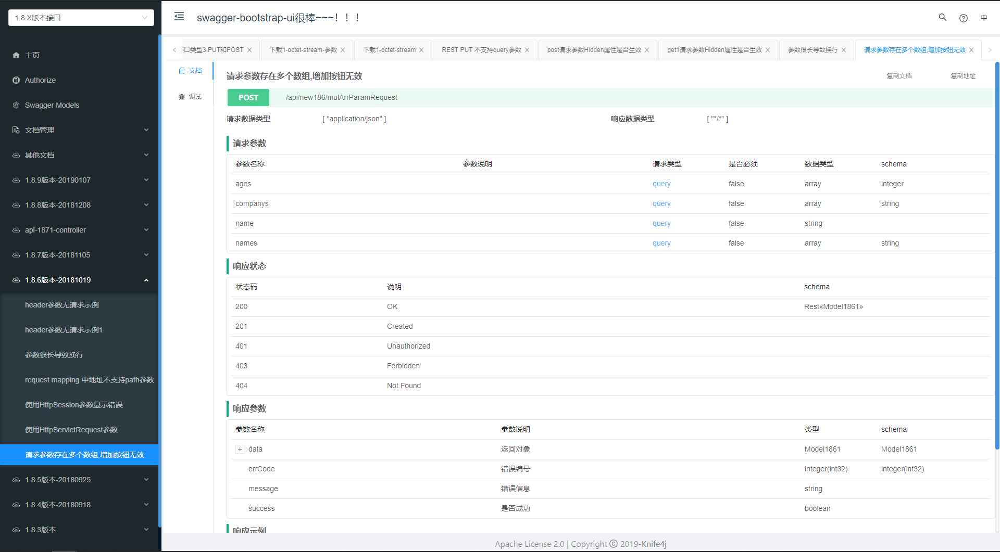
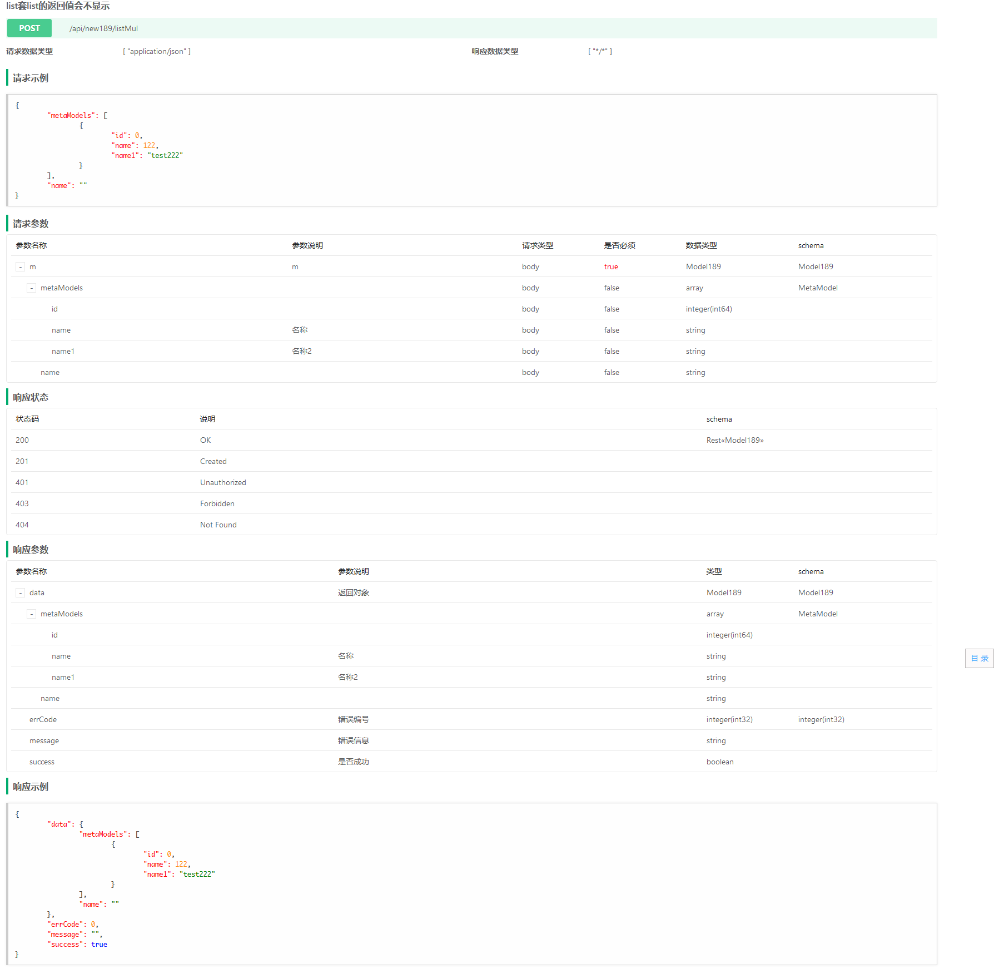

## knife4j背景介绍

knife4j是为Java MVC框架集成Swagger生成Api文档的增强解决方案；

Knife4j的前身是swagger-bootstrap-ui,前身swagger-bootstrap-ui是一个纯swagger-ui的ui皮肤项目。

但是随着项目的发展,面对越来越多的个性化需求,不得不编写后端Java代码以满足新的需求；因此,项目正式更名为knife4j,取名knife4j是希望她能像一把匕首一样小巧,轻量,并且功能强悍。
<!--more-->
## 功能
地址Url为：**服务布置url/doc.html**

例：127.0.0.1/demo/doc.html

1、接口文档显示


2、接口调试


3、Swagger Models


4、支持导出离线Markdown、Html功能




## 教程
1、在maven项目的pom.xml中引入Knife4j的依赖包：
```xml
<dependency>
    <groupId>com.github.xiaoymin</groupId>
    <artifactId>knife4j-spring-boot-starter</artifactId>
    <version>2.0.7</version>
</dependency>
```

2、创建Swagger配置依赖
```java
@Configuration
@EnableSwagger2WebMvc
public class Knife4jConfiguration {

    @Bean(value = "defaultApi2")
    public Docket defaultApi2() {
        Docket docket=new Docket(DocumentationType.SWAGGER_2)
                .apiInfo(new ApiInfoBuilder()
                        //.title("swagger-bootstrap-ui-demo RESTful APIs")
                        .description("# swagger-bootstrap-ui-demo RESTful APIs")
                        .termsOfServiceUrl("http://www.xx.com/")
                        .contact("xx@qq.com")
                        .version("1.0")
                        .build())
                //分组名称
                .groupName("2.X版本")
                .select()
                //这里指定Controller扫描包路径
                .apis(RequestHandlerSelectors.basePackage("com.glodon.controller"))
                .paths(PathSelectors.any())
                .build();
        return docket;
    }
}
```

3、代码常用注解
> @Api：用在controller类，描述API接口
> 
> @ApiOperation：描述接口方法
> 
> @ApiModel：描述对象
> 
> @ApiModelProperty：描述对象属性
> 
> @ApiImplicitParams：描述接口参数
> 
> @ApiResponses：描述接口响应
> 
> @ApiIgnore：忽略接口方法

```java
@Api(tags = "文件处理")  // 制定api分类名称
@Slf4j
@Controller
public class FilePublisherController {

    @ApiOperation(value = "上传")  // 制定api接口名称
    @ApiImplicitParams({
            @ApiImplicitParam(name = "UserID", value = "用户Id", defaultValue = "123456", required = true, dataType = "String", paramType="header")
    }) // 参数定义
    @PostMapping("/UploadFile")
    @ResponseBody
    public CommonResult uploadFile(HttpServletRequest request, @RequestParam("file") MultipartFile file, HttpServletResponse response) {

    }

    @ApiOperation(value = "下载")
    @PostMapping("/DownLoadFile")
    @ResponseBody
    public CommonResult downLoadFile(@RequestBody ParseFileMessage parseFileMsg, HttpServletRequest request, HttpServletResponse response){
    }
}
```

## 引用
[knife4j官网](https://doc.xiaominfo.com/knife4j/)

[Swagger官网](https://swagger.io/docs/)